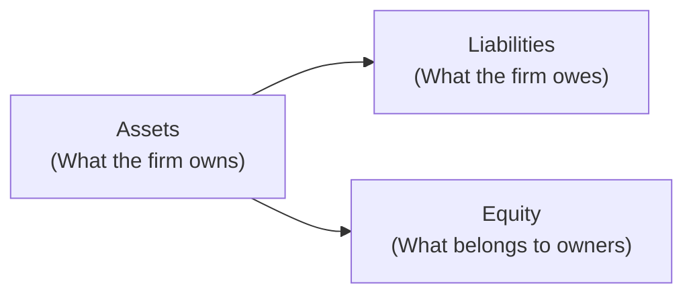

## 9.2 Statement of Financial Position

Have you ever tried to figure out your own net worth by checking how much you have in your bank account, the money you owe on your credit card, and maybe the equity in your home—or how much you still owe on your mortgage? Well, guess what? You’ve basically prepared a simple version of a Statement of Financial Position. Companies and mutual funds do the same thing, only they do it in a more formal and detailed way. This section explores what that formal reality looks like and how it supports decision-making.

The Statement of Financial Position, often referred to as the Balance Sheet, is a concise snapshot of an organization’s financial position at a specific point in time. It outlines what a company or a fund owns (its assets), what it owes (its liabilities), and the leftover interest (equity or net assets) belonging to the owners or shareholders. This leftover interest is basically what would remain if all liabilities were settled using the assets.

Below, we’ll break down the key components—Assets, Liabilities, and Equity—and explain how to read and interpret them. We’ll also see how short-term versus long-term considerations affect the analysis.

--------------------------------------------------------------------------------

### The Fundamental Accounting Equation

The Balance Sheet revolves around one unshakeable principle—if you’re going to buy something, you’ve got to pay for it somehow. In other words:

Assets = Liabilities + Equity

You can almost picture this equation like a seesaw. On one side, you have the assets. On the other side, you have both the liabilities (the debts or obligations) plus the equity (the owners’ share).

Why does it matter? Because it forces the numbers to always “balance.” If a company, for instance, purchases machinery by taking out a loan, you’ll see an increase in the asset (machinery) and an increase in the liability (bank loan). And if the owners put more money in, that increases both the cash asset and the equity.

It can help to visualize this. Below is a simple Mermaid diagram illustrating the relationship among these elements:

But we must ensure the “Assets” side equals the combined total of the “Liabilities” and “Equity” side. That’s the whole magic.

--------------------------------------------------------------------------------

### Components of the Statement of Financial Position

#### 1. Assets
Assets are resources the entity controls—anything that has a future economic benefit. When you hear “Benefit,” think: can it be used or sold to generate cash flow or value?

Typical asset categories include:
• Cash and cash equivalents (like a company’s bank account balance, or a fund’s investments held in a super-liquid form).  
• Marketable securities (short-term investments easily convertible to cash).  
• Accounts receivable (money owed by customers or clients).  
• Inventories (for companies producing/selling goods).  
• Property, plant, and equipment (like machinery, real estate, vehicles).  
• Intangible assets (patents, trademarks, goodwill).  

##### Current vs. Non-Current Assets
Current assets, such as cash and accounts receivable, are expected to be converted into cash or consumed within a year. On the other hand, items like property, plant, equipment, or intangible assets typically fall under the non-current or long-term category.  

In many businesses, distinguishing between current and non-current is crucial. It’s how we measure liquidity. If you need to pay your suppliers in 30 days, it’s good to know how many assets you could quickly turn into cash.

Imagine a mutual fund that invests in short-term government Treasury bills. These T-bills are highly liquid and would typically be reported under current assets because they can be sold easily. Alternatively, a real estate mutual fund might hold investment properties, which are more long term and would be listed as non-current. The classification matters because it tells you how quickly and easily the fund can meet its short-term obligations.

--------------------------------------------------------------------------------

#### 2. Liabilities
Liabilities capture what the entity owes—debts or obligations it has to satisfy in the future. Similar to assets, we group liabilities into current and non-current.

##### Current Liabilities
Current liabilities are those due within a year. Common current liabilities include:  
• Accounts payable (bills to be paid—maybe you owe your suppliers).  
• Short-term loans or lines of credit.  
• Dividends payable (owed to shareholders).  
• Other accrued expenses (like salaries, interest payable).  

##### Non-Current Liabilities
Non-current liabilities are obligations that extend beyond one year, such as:  
• Long-term debt (notes payable, bonds payable).  
• Deferred tax liabilities (tax obligations recognized but not paid yet).  
• Lease obligations (if classified as long term).  

From a mutual fund perspective, liabilities can include accrued fees payable to fund managers, short-term redemption amounts owed to investors, or accrued distributions. While mutual funds themselves often aim to minimize long-term borrowing, understanding the nature of fund liabilities is still key to evaluating potential liquidity or credit risks.

--------------------------------------------------------------------------------

#### 3. Equity (or Shareholders’ Equity)
Equity is, in a sense, what’s left for the owners after all liabilities are subtracted from assets. Here, you’ll often see terms like “Share Capital” (the funds raised from issuing shares) and “Retained Earnings” (profits reinvested in the business or fund).

For a corporation, elements of equity could include:  
• Common stock  
• Preferred stock  
• Retained earnings or deficit  
• Contributed surplus  
• Accumulated other comprehensive income  

In a mutual fund, you might just see “Net Assets Attributable to Holders of Redeemable Units” (if it’s structured as a trust), representing investors’ stakes in the fund. For instance, if you see a consistent trend of growing net assets, that might indicate that either the fund is receiving new subscriptions from investors or that it’s enjoying portfolio growth—either way, a healthy sign.

--------------------------------------------------------------------------------

### Why the Statement of Financial Position Matters

#### 1. Assessing Liquidity, Solvency, and Stress Points
One of the first things financial professionals look at is liquidity—can the entity cover its short-term obligations? This is especially critical for industries like retail or manufacturing, but also for mutual funds that may be subject to sudden redemption requests. If a fund has a large portion of its assets in illiquid securities or assets, it might run into issues meeting investor redemptions if the markets take a turn or if people want out.

Further, the Statement of Financial Position helps assess solvency—whether liabilities could outweigh assets (which you generally don’t want!). If a company or fund is highly leveraged, meaning it carries a lot of debt relative to its equity, that’s a risk factor. One common measure here is the debt-to-equity ratio:  
   
Debt-to-Equity Ratio = (Total Liabilities) ÷ (Total Equity)  

It provides a quick snapshot of how much the entity depends on borrowed funds. For example, let’s say, as an anecdote, I once looked at a technology startup’s balance sheet. It showed liabilities that were nearly triple the equity, and almost no current assets to speak of. I remember thinking, “Well, that’s a bit like trying to balance an elephant on a broomstick.” It can be precarious if revenue dips or if debt covenants become strict.

#### 2. Evaluating the Capital Structure
Capital structure is basically how the firm finances its operations (equity vs. debt vs. other forms of funding). Different mixes have different risk/reward profiles. Some businesses do well with moderate leverage—like real estate companies that use mortgage financing. Others might be riskier if their primary product is very volatile in price.

In the context of mutual funds, you might look positively on a fund’s ability to remain stable even amid big market swings. A fund’s statement of financial position will show how heavily it uses short-term financing for leveraging its positions or whether it invests primarily in liquid assets. Overall, the capital structure influences how agile and resilient the entity will be when navigating financial storms.

#### 3. Understanding Equity Growth (or Erosion)
If you compare statements of financial position over several years, you might see equity gradually rising, reflecting reinvested profits or asset appreciation. On the other hand, a shrinking equity base may flag potential troubles—perhaps the company is posting losses. In the mutual fund world, net assets can fluctuate greatly based on market performance and inflows/outflows from investors. Careful reading of these trends allows you to gauge how well the fund is doing at preserving and growing investor capital.

--------------------------------------------------------------------------------

### Current vs. Non-Current Classification: Key Insights

The classification between current and non-current is so critical that Canadian accounting standards (see CPA Canada Handbook Part I regarding IFRS, and Part II regarding Accounting Standards for Private Enterprises) strictly define how to present it. The main question is, “Can this asset be realized or liability be settled within one year of the reporting date?”

• If the answer is yes, it’s current.  
• If the answer is no, it’s non-current.  

From a practice standpoint, this approach makes your analysis of liquidity straightforward: just compare current assets to current liabilities. The difference is often called Working Capital—basically, how much short-term “buffer” you have to meet your short-term bills:

Working Capital = Current Assets – Current Liabilities

In everyday life, you do this without knowing it. Think about your checking account balance (current asset) and your upcoming credit card bills (current liability). If your account will comfortably cover the next bills, you’re in good shape. If not, there may be some anxious nights ahead.

--------------------------------------------------------------------------------

### Reading a Statement of Financial Position: A Quick Example

Let’s say you have a hypothetical company, Maple Energy, producing renewable energy solutions. On December 31, Maple Energy’s Statement of Financial Position might look like this (high-level summary):

|                | Amount (in millions CAD) |
|----------------|--------------------------|
| **Assets**     |                          |
| Current Assets | $  50                   |
| Non-Current Assets | $ 150               |
| **Total Assets**  | $ 200               |
| **Liabilities** |                        |
| Current Liabilities| $  30              |
| Non-Current Liabilities| $  70          |
| **Total Liabilities** | $ 100          |
| **Equity**        |                    |
| Common Stock      | $  40              |
| Retained Earnings | $  60              |
| **Total Equity**  | $ 100             |

Here, Maple Energy’s total assets are $200 million, total liabilities $100 million, and total equity $100 million. It’s well balanced:

Assets (200) = Liabilities (100) + Equity (100)

The ratio of liabilities to equity is 1.0 (100 ÷ 100). This is a moderate capital structure. Current assets of $50 million compared to current liabilities of $30 million means a positive working capital of $20 million. This suggests Maple Energy has some breathing room to cover short-term payments.

And if you compare these numbers to the prior year, you might see that the company’s net worth (equity) has grown from $90 million to $100 million, indicating positive retained earnings or perhaps some new share issuance. That’s an encouraging sign—like seeing your personal savings account balance go up over time.

--------------------------------------------------------------------------------

### Special Considerations for Mutual Funds

A mutual fund’s Statement of Financial Position can be a bit different from a typical corporate balance sheet. Instead of retained earnings, for instance, you may see sections like “Undistributed Net Investment Income” or “Accumulated Net Realized Gains/Losses.” The key objectives are:

1. Evaluating the fund’s liquidity: Can the fund quickly redeem shares if lots of unitholders want out at once?  
2. Assessing net asset value (NAV) growth: Is the fund’s total equity or net assets on an upward trend or not?  
3. Understanding leverage: Does the fund borrow at all, and if so, how does that leverage affect risk?

Many Canadian mutual funds follow regulations that limit leverage to protect unitholders from excessive risk. CIRO (the Canadian Investment Regulatory Organization), as the national self-regulatory body for mutual fund dealers and investment dealers, encourages compliance with relevant securities regulations that guard investor interests.  

--------------------------------------------------------------------------------

### Practical Tips for Mutual Fund Representatives

• **Compare multiple periods:** Encourage investors to look at the evolution of net assets (equity) across at least a few reporting periods. One single snapshot can be misleading if you don’t see the trend.  
• **Check liquidity risk:** For open-end funds, see how quickly the fund can convert holdings to meet redemption requests—particularly relevant for specialty funds holding less-liquid assets.  
• **Look at any short-term borrowing:** If you see high short-term liabilities, find out why. Is it normal for the strategy (e.g., short-term hedging) or is the fund under some financial strain?  
• **Debt-to-equity (or leverage) ratio:** While less common in mutual funds compared to corporate statements, pay attention if it’s there. High leverage might enhance returns in a bull market but can magnify losses in a downturn.  

--------------------------------------------------------------------------------

### Best Practices and Potential Pitfalls

**Best Practices**  
• **Keep current with regulations:** Canadian-specific standards from the CPA Canada Handbook and IFRS guidelines determine how the Statement of Financial Position is presented and interpreted. For more advanced insights, see “Corporate Finance” by Ross, Westerfield, and Jaffe.  
• **Use open-source tools:** Applications like the free online resources at bankofcanada.ca can offer macro data or interest rate trends that can influence a balance sheet’s asset valuations and liabilities.  
• **Monitor working capital:** A shortfall in working capital is often an early warning sign of financial trouble.  
• **Investigate intangible assets:** Sometimes, intangible assets like goodwill can inflate total assets. Check if the intangible assets are legitimate and tested for impairment regularly.

**Potential Pitfalls**  
• **Ignoring off-balance-sheet items:** Some obligations like operating leases (depending on IFRS compliance) or certain derivative exposures historically didn’t always appear on the Statement of Financial Position. With IFRS changes, more of these items are recognized on the balance sheet, but it’s still worth investigating footnotes.  
• **Forgetting about the notes to the financial statements:** The statement itself is a summary. Always read the accompanying notes for hidden details about valuations, loan covenants, or pending legal issues.  
• **Misclassifying assets and liabilities:** Watch for “window dressing,” where a company or fund tries to make current assets look bigger or current liabilities look smaller at a specific reporting date.  

--------------------------------------------------------------------------------

### Real-World Case Study: A Cautionary Tale

I once met a friend who invested in a small resource company. The Statement of Financial Position looked strong—big intangible assets, minimal liabilities. But the intangible assets had never been really tested for impairment. When the company’s flagship product failed, those intangible assets plummeted in actual market value. Suddenly, the “strong” balance sheet crumbled. The lesson? Always dig deeper. If assets can’t easily be sold or they depend on volatile markets, you can’t necessarily count on them at face value.

--------------------------------------------------------------------------------

### References and Further Reading

• CPA Canada Handbook Part II and Part I: Official standards on how to classify current vs. non-current items.  
• “Corporate Finance” by Ross, Westerfield, and Jaffe: Excellent deep dive into analyzing corporate balance sheets.  
• Bank of Canada (https://www.bankofcanada.ca): Tools and data to track interest rate movements, key macroeconomic indicators.  
• CIRO (https://www.ciro.ca): Regulatory updates and guidelines for mutual fund and investment dealers in Canada.  

--------------------------------------------------------------------------------

## Quiz: Statement of Financial Position



### The Statement of Financial Position is also commonly known as what?
- [x] The Balance Sheet
- [ ] The Income Statement
- [ ] The Statement of Retained Earnings
- [ ] The Statement of Cash Flows

> **Explanation:** The Statement of Financial Position is indeed another term for the Balance Sheet, providing a snapshot of assets, liabilities, and equity at a given date.

### Which formula correctly represents the fundamental accounting equation?
- [ ] Liabilities = Assets + Equity
- [x] Assets = Liabilities + Equity
- [ ] Equity = Assets + Liabilities
- [ ] Revenue = Liabilities – Equity

> **Explanation:** The fundamental accounting equation is Assets = Liabilities + Equity, demonstrating how resources are financed.

### Current assets are those intended to be used or converted into cash within what time frame?
- [x] One year
- [ ] Five years
- [ ] Three months
- [ ] Ten years

> **Explanation:** By standard accounting definitions, current assets are typically used or convertible into cash within one year.

### What is the typical purpose of checking the “debt-to-equity ratio” on a Statement of Financial Position?
- [ ] To see how fast the company can generate profits
- [x] To assess the company’s leverage and financial risk
- [ ] To measure customer satisfaction
- [ ] To determine the total number of outstanding shares

> **Explanation:** The debt-to-equity ratio measures how much the company is financed by debt in relation to equity, indicating the level of financial risk.

### Which of the following would likely appear under Non-Current Liabilities?
- [x] A 5-year bond payable
- [ ] Accounts payable
- [x] A lease obligation extending over 7 years
- [ ] Short-term credit card debt

> **Explanation:** Non-Current Liabilities are obligations that extend beyond one year, such as long-term bonds and extended lease obligations.

### If Current Assets amount to $120,000 and Current Liabilities are $100,000, what is the Working Capital?
- [x] $20,000
- [ ] $100,000
- [ ] $120,000
- [ ] $220,000

> **Explanation:** Working Capital = Current Assets – Current Liabilities = $120,000 – $100,000 = $20,000.

### Why might a high debt-to-equity ratio be a potential red flag?
- [x] It indicates significant reliance on borrowed funds, increasing financial risk
- [ ] It means the company has more owners than creditors
- [x] It can amplify losses in a market downturn
- [ ] It suggests liquidity is not an issue at all

> **Explanation:** A high debt-to-equity ratio signals that a firm is heavily leveraged, which can magnify returns but also amplify losses if market conditions worsen.

### In the context of a mutual fund, which term is often used instead of “retained earnings”?
- [x] Undistributed net investment income
- [ ] Common stock
- [ ] Share premium
- [ ] Operating profit

> **Explanation:** Mutual funds don’t typically have “retained earnings” like corporations; instead, they may list undistributed net investment income or similar terms.

### What does the “notes to the financial statements” section typically reveal?
- [x] Additional details about accounting policies, valuations, and contingencies
- [ ] A summary of marketing activities
- [ ] Tax returns filed by the company
- [ ] Social media handles of the management team

> **Explanation:** The notes provide crucial information on items like valuation methods, contingent liabilities, or other details not fully exposed in the statement’s summary figures.

### True or False: A Statement of Financial Position on its own always provides a full picture of a company’s financial health.
- [x] False
- [ ] True

> **Explanation:** While the balance sheet is essential, it should be read alongside the income statement, cash flow statement, and footnotes for a more complete financial assessment.


