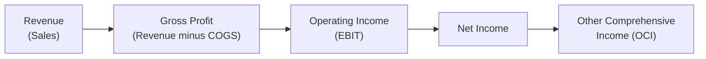

## 9.3 What Is the Statement of Comprehensive Income?

Imagine this: you just started your first job at a small investment firm, and your manager hands you a stack of financial statements. You see terms like “revenue,” “operating expenses,” and “OCI”—and you think, “Uh, what is OCI again?!” That’s when you realize this single document, known as the Statement of Comprehensive Income, holds the key to understanding how the company (or fund) performed in both its usual operations and in a broader sense. Let’s walk through this vital statement together in a friendly, informal way—while still making sure we remain professional enough so your boss is impressed!

Many people refer to the Statement of Comprehensive Income simply as the “Income Statement.” While this is partly correct, you’ll soon find that “comprehensive income” is more than just the day-to-day revenues and expenses. It also includes certain types of gains and losses that—by accounting standards—don’t immediately affect the regular profit and loss. So let’s talk about the difference between net income and comprehensive income, explore typical line items, highlight Canadian regulatory considerations, and then we’ll even throw in a few real-world examples.

---

## Why We Use the Statement of Comprehensive Income

When we talk about a company’s or a fund’s performance, we often look at “how much money they made” in a given period. That’s basically net income. But there’s more. Under International Financial Reporting Standards (IFRS), specifically IAS 1 (Presentation of Financial Statements), companies must show “comprehensive income.” Comprehensive income captures everything from standard revenues and operating costs to items that are recognized directly in equity—such as certain unrealized gains or losses on investments.

In Canada, publicly accountable enterprises and mutual funds generally follow IFRS. If you’re working with Canadian publicly traded firms, or if you’re analyzing mutual funds, you’ll see comprehensive income in the financial statements. By also tracking “other comprehensive income (OCI)” items, you get a fuller picture. For instance, a company might hold foreign subsidiaries or revalue certain assets under IFRS. Those changes can impact equity even if they don’t go through the core profit or loss calculation.

---

## The Main Components

Below is a quick snapshot of what you typically see in a Statement of Comprehensive Income. Don’t worry if it looks like a lot of moving pieces; we’ll break them down slowly:

- Revenue (Sales/Income)
- Cost of Goods Sold (COGS) or Cost of Sales
- Gross Profit
- Operating Expenses
- Earnings Before Interest and Taxes (EBIT)
- Net Income
- Other Comprehensive Income (OCI)

To visualize how they flow, check out this Mermaid diagram:

Starting from revenue, you subtract cost of goods sold to arrive at gross profit. Then you take out operating expenses to arrive at operating income (often referred to as EBIT). After that come interest expenses and taxes, leading you to net income. Finally, certain “extra” items that don’t run through net income (like certain unrealized gains) will show up in the Other Comprehensive Income (OCI) section. The sum of net income and OCI equals total comprehensive income.

---

## A Closer Look at Each Section

### Revenue (Sales/Income)

Revenue is the inflow of economic benefits from your regular business activities—like the fees you earn from clients if you’re a brokerage, or the interest and dividends a mutual fund collects from its underlying portfolio. In IFRS (and in the Canadian context), revenue recognition has specific guidelines to ensure it’s recorded in the correct period. 

In a mutual fund, for instance, “revenue” could include interest from fixed income securities or dividends from equity holdings. For a company that sells products, it’s typically the total sales price of all goods delivered to customers.

### Cost of Goods Sold (COGS) or Cost of Sales

This line item reflects the direct costs needed to produce or purchase what’s being sold. If you’re looking at a manufacturing business, COGS typically includes materials and direct labor. In a service-based business or mutual fund, the concept of COGS might be replaced by costs directly tied to providing the service (e.g., transaction fees for mutual funds). Subtracting COGS from revenue gives you gross profit—a figure that shows how profitable the business’s core activities are before overhead and other indirect costs.

### Gross Profit

Gross profit is your revenue minus the direct costs of generating that revenue. It’s a handy indicator of how efficiently you’re managing the production or acquisition side of your operations. If you notice a downward trend in gross profit over successive periods—even if revenue is stable or rising—it might mean cost control is slipping.

### Operating Expenses

Now we get to operating expenses, where you capture all the indirect costs, from salaries and rent to marketing and office supplies. These are the costs you need to keep the lights on, pay your employees, and maintain day-to-day operations. Generally, these expenses are within the organization’s direct control—although factors like inflation or market trends can also influence them.

### Operating Income (EBIT)

Operating income is often called EBIT: “Earnings Before Interest and Taxes.” It’s basically the result of your revenues minus both direct and indirect operating costs. Operating income is popular with analysts because it focuses on how the main business is performing before financing costs (interest) and taxes complicate the picture. 

### Net Income

So net income is the bottom line on the “traditional” income statement. You get there by subtracting interest costs, taxes, and any other non-operating items from operating income. When people say, “The company posted a profit of $5 million,” they usually mean net income. From a performance perspective, net income is the yardstick many investors watch. But ironically, net income still might not give you the entire story—especially if your firm deals with currency translations, revaluation of certain assets, or other adjustments recognized only in equity.

### Other Comprehensive Income (OCI)

OCI is the place where certain gains and losses go when they aren’t supposed to affect net income. Common examples include:

• Foreign currency translation differences for foreign subsidiaries.  
• Unrealized gains or losses on financial assets measured at fair value through OCI under IFRS 9.  
• Revaluation gains or losses on property, plant, and equipment or intangible assets if following the revaluation model.  
• Certain pension adjustments (actuarial gains or losses) depending on how an entity applies IFRS.  

In mutual funds, for example, changes in fair value for certain investments might flow through OCI if the fund classifies them as “fair value through OCI.” Once these gains or losses are realized (e.g., the fund actually sells the asset), the final profit or loss typically moves into net income. But until that moment, it may remain in OCI.

And if you’ve ever read a fund’s financial statements and seen surprising “unrealized gains or losses,” that’s often where you’ll find them—buried in that OCI section. The sum of your net income and OCI is known as “total comprehensive income,” recognized in the equity section of the balance sheet.  

---

## Putting It All Together: Total Comprehensive Income

When an accountant compiles the Statement of Comprehensive Income, net income is calculated first. Then, items of other comprehensive income get listed separately. The final figure—comprehensive income—demonstrates the total change in an entity’s equity resulting from operations and certain revaluations or translations. 

So, in plain language: net income plus certain unrealized or deferred items = total comprehensive income. Or, as I used to say back in business school: “the stuff we expected plus the stuff we didn’t see coming—until the end of the reporting period, anyway.”

---

## Mutual Funds and the Statement of Comprehensive Income

If you work in the Canadian investment field or you’re analyzing mutual funds, you’ll see some specific lines in the Statement of Comprehensive Income:

• Dividends, interest, and distributions from the fund’s holdings as revenue.  
• Realized gains (or losses) from the sale of securities, which flow into net income or net investment income.  
• Unrealized gains (or losses) that often flow into OCI until positions are actually sold.  

Under IFRS, mutual funds must report changes in fair value for their portfolio. These changes can appear in different parts of the statement depending on the classification of the securities (e.g., “fair value through profit or loss” vs. “fair value through OCI”). If you’re curious about these rules, you may want to look at IFRS 9 (Financial Instruments) for how these designations are determined.

---

## Regulatory Framework in Canada  

While IFRS sets the global accounting standards, Canada’s regulatory bodies ensure financial statements comply with local requirements, transparency levels, and investor-protection measures. As of January 1, 2023, the Canadian Investment Regulatory Organization (CIRO) became Canada’s national self-regulatory body, overseeing investment dealers and mutual fund dealers. (Historically, IIROC and the MFDA oversaw these segments separately, but both organizations have since been amalgamated into CIRO.)  

Canada also has the Canadian Securities Administrators (CSA), which plays a vital role in coordinating provincial and territorial securities regulation. For mutual funds, you can find disclosure requirements at:
• The CIRO website (https://www.ciro.ca)  
• The CSA website (https://www.securities-administrators.ca)  

Additionally, the Canadian Investor Protection Fund (CIPF) protects client assets if a member firm under CIRO becomes insolvent. Knowing these regulatory structures can help you understand why certain footnotes and disclosures appear in the Statement of Comprehensive Income—transparency, comparability, and investor protection are key.

---

## Practical Example: The Consulting Firm

Let’s say you have a small consulting company called StrategySpark. During the year:  
• StrategySpark billed clients $500,000 (Revenue).  
• Direct costs were $150,000 for contract-based professional fees (COGS).  
• Operating costs—like salaries, rent, software, and marketing—amounted to $200,000.  
• The interest on a small business loan was $10,000, and the company paid $20,000 in taxes.  

So how would we see it on the Statement of Comprehensive Income?

1. Revenue = $500,000  
2. COGS = $150,000  
3. Gross Profit = $350,000  
4. Operating Expenses = $200,000  
5. Operating Income (EBIT) = $150,000  
6. Interest = $10,000  
7. Taxes = $20,000  
8. Net Income = $120,000  

Now, suppose StrategySpark invests in a piece of land, and its value increased by $30,000 by the end of the year, but StrategySpark hasn’t sold it. If IFRS revaluation model is used and that revaluation is recognized in OCI, you’ll see:

9. Other Comprehensive Income (OCI) = $30,000  
10. Total Comprehensive Income = $120,000 (net income) + $30,000 (OCI) = $150,000  

The net income from normal operations is $120,000. But the total comprehensive income grows to $150,000 once the unrealized gain on land is factored in.

---

## Common Mistakes and Pitfalls

• Mixing Up Revenue and Other Income: Some companies show gains on the sale of assets as revenue, which can inflate revenue figures. Keep a close eye on footnotes to see if they’re artificially boosting revenue.  
• Ignoring OCI Items: It’s easy to skip the smaller lines at the end of the statement. But sudden big changes in OCI—like from foreign exchange translations—could significantly alter an entity’s total equity.  
• Confusing Operating Income with Net Income: Operating Income (EBIT) excludes financing costs and taxes. If you only look at EBIT, you might miss the impact of a massive interest expense or a big tax break.  
• Overlooking Trends: A single year’s statement is helpful, but the real insights come from analyzing year-over-year changes. In the context of the Conduct and Practices Handbook, regulators can be especially vigilant about consistent and transparent reporting.  

---

## Personal Reflections

I remember the first time I tried to reconcile net income with total comprehensive income for a small chain of retail stores. I was so sure I’d found a mistake because the income statement ended with one number, but the statement of comprehensive income ended with a bigger number! Turns out, the company had a revaluation gain from a building they owned. I felt a little silly, but it taught me a valuable lesson: “comprehensive” truly means capturing the full effect of various valuation changes, not just the day-to-day profits.

---

## Additional Shooting Stars: IFRS vs. Local Standards

Canada adopted IFRS for publicly accountable enterprises, including mutual funds, back in 2011. If you’re looking at private companies, they might use Accounting Standards for Private Enterprises (ASPE). The big difference is that IFRS is globally recognized and requires that separate statement (or section) for other comprehensive income. ASPE doesn’t have a separate statement for “OCI,” so you might not see it if you’re analyzing a private firm that follows ASPE. 

Anyway, it’s pretty neat that IFRS aims to unify how we present complex items like foreign currency translation or revaluation of assets worldwide. This standardization makes it easier for global investors to understand Canadian financial statements, too.

---

## Case Study: A Mutual Fund’s OCI Example

Let’s look at a hypothetical Canadian Equity Fund:

• It earns $1.5 million in dividend income from Canadian stocks.  
• It realizes a $500,000 capital gain from selling some of its equity holdings.  
• Operating expenses (including management fees) total $700,000.  
• It has an additional $300,000 in unrealized losses from the fair value of certain bonds in the portfolio.  

Under IFRS:  
1. Revenue (Dividend Income) = $1,500,000  
2. Realized Gains = $500,000  
3. Operating Expenses = $700,000  
4. Net Income = $1,500,000 + $500,000 – $700,000 = $1,300,000  

But the $300,000 unrealized loss on bonds, if classified as “fair value through OCI,” goes to the OCI section. So, the other comprehensive income might be –$300,000. Then:

5. Total Comprehensive Income = $1,300,000 – $300,000 = $1,000,000  

That negative item in OCI reduces the final measure of total comprehensive income. For the fund’s unitholders, net income looks strong, but the overall change in net assets might be tempered by those declines that haven’t yet been realized. In practice, the classification of securities between “fair value through profit or loss” and “fair value through OCI” can vary—and that’s why it’s important to know the IFRS designations.

---

## Canadian Regulatory Resources and Further Learning

• CIRO (https://www.ciro.ca): Canada’s national self-regulatory body. You can find resources about ongoing disclosure requirements, differences between various investment dealers, and how they present financial results.  
• Canadian Securities Administrators (https://www.securities-administrators.ca): Offers a range of information on provincial and territorial securities legislation and policy.  
• IFRS Foundation (https://www.ifrs.org/): For official standards, including IAS 1 – Presentation of Financial Statements and IFRS 9 – Financial Instruments.  
• “Financial Accounting for Undergraduates” by Wallace, Nielsen, and Christensen: A user-friendly textbook that covers revenue recognition, expense matching, and a deeper dive into comprehensive income.  

If the Statement of Comprehensive Income topic makes your head spin sometimes, don’t feel discouraged. Many practitioners do a quick check of net income, but truly mastering comprehensive income takes a bit of repeated exposure and practice.

---

## Best Practices and Encouragement

• Always read the footnotes! They often explain exactly how certain items got classified (for instance, between “profit or loss” vs. “OCI”).  
• Compare statements over several periods to note recurring trends and see if certain types of gains or losses keep cropping up in OCI.  
• Understand that net income is not always the final word. Other comprehensive income can significantly affect the entity’s total performance and equity.  
• Keep an eye out for major shifts in foreign currency translation if the company or fund you’re analyzing has substantial international exposure.  
• If you’re still feeling shaky, practice dissecting real annual reports from public companies. Then shift to mutual funds or ETFs. The more you do it, the more comfortable you’ll be.  

Ultimately, the Statement of Comprehensive Income is a powerful document that tells you not just “how much profit or loss the entity made,” but also “how changes in valuations and other events outside the day-to-day hustle might affect overall financial health.” Mastering it sets you on a path to understanding a core piece of the puzzle in finance and accounting—one that’s crucial to a well-rounded approach to due diligence, risk management, and sound decision-making.

---

## Quiz: The Statement of Comprehensive Income



### Which term refers to the primary source of inflows from an entity’s usual business operations?
- [ ] Other Comprehensive Income  
- [x] Revenue  
- [ ] Operating Expenses  
- [ ] EBIT  

> **Explanation:** Revenue arises from the entity’s ordinary business activities, such as sales for a retailer or dividends and interest for a mutual fund.

---

### What is the main difference between Net Income and Comprehensive Income?
- [ ] There is no difference; both terms are used interchangeably.  
- [x] Comprehensive Income includes certain unrealized gains and losses that do not flow through Net Income.  
- [ ] Net Income is a leftover concept from older accounting standards.  
- [ ] Net Income includes unrealized gains and losses on all assets.  

> **Explanation:** Comprehensive Income equals Net Income plus Other Comprehensive Income (items like certain unrealized gains or losses on financial instruments or foreign exchange adjustments).

---

### Which financial reporting framework in Canada typically requires including Other Comprehensive Income on financial statements?
- [ ] ASPE  
- [x] IFRS  
- [ ] U.S. GAAP only  
- [ ] There is no requirement in Canada to present OCI separately.  

> **Explanation:** Publicly accountable enterprises in Canada (and most mutual funds) follow IFRS, which requires separating OCI from Net Income.

---

### What does EBIT stand for in the Statement of Comprehensive Income?
- [x] Earnings Before Interest and Taxes  
- [ ] Earnings Before Income Taxes  
- [ ] Earnings Before Internal Transactions  
- [ ] Equity, Bonds, Investments, and Taxes  

> **Explanation:** EBIT is a measure of a company’s operating performance before factoring in interest expenses and taxes.

---

### Which item would most likely appear under the Other Comprehensive Income section?
- [x] A revaluation gain on land that has not been sold  
- [ ] A client’s paid invoice  
- [x] An unrealized loss on certain fixed-income securities classified as fair value through OCI  
- [ ] Employee salaries  

> **Explanation:** OCI commonly records unrealized gains and losses on certain financial assets or revaluations before they are realized.

---

### For a mutual fund, which items typically flow into Net Income?
- [x] Dividends, realized gains, and interest income  
- [ ] Unrealized gains on long-term fixed assets  
- [ ] Unrealized foreign currency translation differences on overseas subsidiaries  
- [ ] Revaluation of intangible assets  

> **Explanation:** Mutual funds usually report investment income (e.g., dividends, interest) and realized gains (or losses) in Net Income. Unrealized changes can go to OCI if classified as “fair value through OCI.”

---

### Why might it be dangerous to focus only on Net Income when analyzing performance?
- [x] Because other comprehensive income items can significantly affect equity  
- [ ] Because Net Income is always negative  
- [x] Because Net Income ignores foreign exchange impacts recorded in OCI  
- [ ] Because Net Income is not a recognized GAAP metric  

> **Explanation:** Focusing only on Net Income can miss big changes in equity from OCI—like currency translation or revaluation gains and losses.

---

### A firm includes a large unrealized gain from revaluing equipment in its financial statements. Under IFRS, where is this often recognized initially?
- [x] Other Comprehensive Income  
- [ ] Revenue  
- [ ] Operating Expenses  
- [ ] Interest Expense  

> **Explanation:** IFRS often directs revaluation gains on certain non-current assets to OCI, rather than revenue or Net Income.

---

### Which Canadian regulatory organization oversees investment dealers and mutual fund dealers today?
- [x] CIRO  
- [ ] MFDA  
- [ ] IIROC  
- [ ] Nasdaq  

> **Explanation:** In 2023, the Mutual Fund Dealers Association (MFDA) and the Investment Industry Regulatory Organization of Canada (IIROC) were amalgamated, forming the Canadian Investment Regulatory Organization (CIRO).

---

### True or False: The sum of Net Income and Other Comprehensive Income equals Total Comprehensive Income.
- [x] True  
- [ ] False  

> **Explanation:** By definition, Comprehensive Income is the sum of an entity’s Net Income and Other Comprehensive Income.


