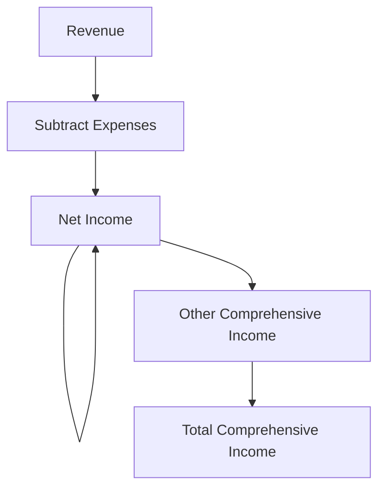

## 9.3 Statement of Comprehensive Income

If there's one financial statement that truly feels like a story of how well (or not-so-well) a company or fund is doing, it's the Statement of Comprehensive Income—also known by more casual names like the Income Statement or Profit and Loss (P&L) statement. I remember the first time I peeked at a real financial statement for a friend’s small restaurant. The numbers were mesmerizing and a bit overwhelming. But once you understand the main components—Revenue, Expenses, Gains, Losses, Net Income, and that mysterious section called Other Comprehensive Income (OCI)—it’s honestly not that bad. Let’s break it down together.

### Understanding the Purpose and Scope

This statement shows financial performance over a specific period, like a quarter or a year. If your favorite café or a giant tech company wants to know how much money they made (or lost) over six months, they’d look to the Statement of Comprehensive Income. Essentially, it answers these questions:

• “How much did we sell or earn?”  
• “What did it cost us to operate?”  
• “Did we end up in the black (profit) or in the red (loss)?”  
• “Is there anything else affecting our economic value that doesn’t go through the usual net income calculation?”

Whether we're discussing a multinational company or a mutual fund, the core principles are the same. Mutual fund representatives, in particular, keep an eye on this statement to see how a company or fund is performing, to spot potential issues with revenue sources or cost overruns, and to gauge overall profitability trends.

### Key Elements of the Statement of Comprehensive Income

Let’s go step by step. And by the way, if you’re ever lost, just remember that revenue generally comes in at the top, expenses are subtracted out, and net income typically appears near the bottom. The twist is the extra line items that gather in “Other Comprehensive Income.”

#### Revenue (Sales or Income)

Revenue is basically the money that flows in from your main business activity— be it providing a service, selling a product, or earning fees. For mutual funds, revenue might be management fees, trading commissions, or interest and dividend income on holdings. For a local bakery, it’s the daily sales of muffins and coffee. IFRS 15 (“Revenue from Contracts with Customers”) sets out detailed guidelines on when and how revenue should be recognized in many cases. Think of it like this: you want to record revenue in the correct period, matching the time you actually earned it by selling that product or delivering that service.

• Example: If a mutual fund invests in bonds, the interest earned is recognized as revenue over time.  
• Example: A consulting firm recognizes revenue when it completes milestones detailed in the client contract.

#### Expenses

Expenses capture the money going out to support operations or produce goods and services. These can include:

• Cost of Goods Sold (COGS) or Cost of Sales: The direct costs tied to what you’re selling (like raw materials for products).  
• Operating Expenses: Salaries, rent, utilities—those day-to-day overhead costs that keep the lights on.  
• Management Fees: Common in the world of mutual funds, representing fees taken by fund managers for professional fund management.  
• Selling, General, and Administrative (SG&A): Often grouped overhead expenses.  

Under IFRS, expenses should be “matched” with revenue in the same period so the Income Statement shows a fair measure of profit or loss.

#### Gains and Losses

Not everything a company or fund does neatly fits under typical revenue-generating or expense-incurring transactions. Gains and losses often pop up outside everyday activities:

• Selling an old building for more than its book value would generate a gain.  
• Negative currency fluctuations on a foreign investment might lead to a loss.  
• Discontinued operations or one-off events, such as an asset disposal, also appear in this category to keep them separate from normal business activities.  

For mutual funds, you could see gains or losses from sales of securities that aren’t part of the “normal operating” revenue. IFRS 9 (“Financial Instruments”) addresses how to handle these gains and losses on financial assets and liabilities.

#### Net Income (Net Earnings)

Net Income sits at the heart of many performance discussions. It’s basically what remains after you’ve subtracted all expenses (and factored in gains/losses) from total revenue. If you wanted to gauge a firm’s day-to-day profitability, Net Income is the first place to look. But the statement doesn’t end there.

#### Other Comprehensive Income (OCI)

You might be thinking: “Wait, if Net Income sums up my revenue minus expenses and all my gains and losses, what else is there?” In some cases, certain unrealized gains or losses get directed to the Other Comprehensive Income section instead of the Net Income line. For example:

• Unrealized gains or losses on certain investments (like equity investments designated under IFRS 9 or the revaluation of certain fixed assets).  
• Foreign currency translation adjustments for foreign subsidiaries.  
• Remeasurements of pension plan obligations.  

OCI items usually do not affect the Net Income figure in the period they arise. However, they still impact the “comprehensive” financial picture. Once you add Net Income and Other Comprehensive Income together, you get Total Comprehensive Income. This is a more expansive measure of how the entity’s value has changed over the reporting period.

### Visual Overview

Below is a simple diagram illustrating how each piece fits together in the Statement of Comprehensive Income. Don’t worry—despite the fancy arrows, it’s basically just a flow:

In practice, Gains and Losses can appear throughout the statement, depending on whether they’re considered part of ordinary operations or separate. The important part is that Net Income is typically shown before Other Comprehensive Income items get stacked on.

### Relevance to Mutual Fund Representatives

Now, you might be sitting there thinking: “Why do I, as a mutual fund representative, need to decipher an entire Statement of Comprehensive Income?” Well:

• Assessing Profitability and Revenue Trends: If you’re analyzing a company you’re planning to invest client funds in, or if you’re evaluating the performance of the mutual fund itself, you want to see the trajectory of profits over time. Is revenue heading up, down, or sideways? Are management fees (for a mutual fund) well-covered by performance?  
• Spotting Key Expense Drivers: If expenses are out of control or if certain fees overshadow the overall returns, that’s a red flag. Even for a mutual fund, high operating costs can quickly erode potential returns for investors.  
• Identifying Potential Risks: Gains or losses that come from one-time events might be interesting but not very predictive of future results. Meanwhile, recurring negative factors (like steadily rising material costs) spell trouble.  
• Forecasting Future Performance: By studying both Net Income and Other Comprehensive Income, advisors can get a deeper sense of potential future returns, especially when there are intangible or unrealized items that may or may not become realized gains or losses later.

### A Quick Case Study: The Balanced Growth Fund

Let’s say you have the “Balanced Growth Fund” that invests in a broad mix of equities and fixed-income instruments:

• The fund’s Revenue might include dividends from stocks and interest from bonds.  
• Expenses could include management and administrative fees, plus transaction costs for buying and selling assets.  
• Gains and Losses might manifest if the fund disposes of certain investments with a higher or lower market value than their recorded cost. A one-time big gain might look great for the period but might not recur next time.  
• Net Income is what’s left after subtracting all those expenses and including realized gains.  
• Other Comprehensive Income could arrive if certain long-term equity holdings rose in price during the period (unrealized), but the fund chooses or is required to present that appreciation in OCI under IFRS 9.

When you see a positive Net Income, that’s fantastic. But if you also see a large negative Other Comprehensive Income, it might mean the fund’s total comprehensive performance is actually weaker. This contrast can happen often, especially with volatile markets affecting long-term holdings that remain unsold.

### Best Practices and Common Pitfalls

• Consistency Is Key: Look at multiple periods (quarter-to-quarter, year-to-year). A single period’s Income Statement can be misleading if there’s a big gain or loss that doesn’t represent the ongoing business.  
• Don’t Ignore OCI: I’ve talked to folks who focus only on Net Income and forget that large unrealized losses might be lurking in OCI. A quick glance might miss major red flags.  
• Watch for Revenue Recognition Policies: Under IFRS 15, revenue has to be recognized when control is passed to the buyer. If you see big spikes in revenue that look out of place, consider reviewing the notes. Perhaps there was a large transaction recognized earlier than expected, or something else is at play.  
• Different Companies, Different Layouts: Don’t be surprised if statements don’t look exactly alike. Some industries group expenses differently, or place Gains and Losses in separate areas. IFRS provides some structure, but actual presentation can vary.  
• Don’t Confuse Cash Flow with Income: A company can show solid Net Income but still be strapped for cash if it’s not collecting receivables on time or is investing heavily in capital assets. If you’re reading this chapter, stroll over to the Statement of Cash Flows section (9.5) later in your studies to see how these statements tie together.

### Personal Anecdote: My “Mystery Expense” Moment

I remember helping a friend who was super excited about a tech company’s booming revenue—only to find out they had an even bigger expense running in parallel! The net result was actually a less impressive profit margin than a competitor with more modest revenue but far better cost control. From that day on, I learned not to get starry-eyed over top-line (revenue) figures without checking the bottom line (net income), and especially the other comprehensive components lurking below.

### Canadian Regulatory Framework and Resources

In Canada, companies typically follow International Financial Reporting Standards (IFRS) as mandated by Canadian securities regulators. Mutual funds are no different, though certain additional rules may apply. Also, depending on your role (e.g., as a mutual fund representative within a dealer firm), CIRO (the Canadian Investment Regulatory Organization) sets overarching standards and guidelines. For official updates or resources, you can visit [CIRO’s website](https://www.ciro.ca).

• IFRS 15 (Revenue from Contracts with Customers): Provides robust guidance on when and how to recognize revenue.  
• IFRS 9 (Financial Instruments): Outlines the classification and measurement of financial instrument gains and losses, including certain designations that affect whether changes go through Net Income or Other Comprehensive Income.  
• Canadian Securities Institute (CSI) Online Exercises: The CSI often offers practical exercises and case studies to help you interpret items on an Income Statement, especially focusing on the mutual fund context.

### Putting It All Together

Ultimately, the Statement of Comprehensive Income is a tool that helps you figure out an entity’s profitable or not-so-profitable story for a given period. For mutual fund representatives, it’s pivotal for selecting suitable investments, comparing performance across funds, and just staying on top of financial health. After all, your clients rely on your insights when deciding where to invest their money.

#### Quick “Glossary of Terms” Recap

• Revenue Recognition: The principle dictating when revenue is recorded. Important for ensuring correct timing of revenue inflows.  
• Expenses: Outflows tied to generating revenue during the same period. Include operating expenses, cost of goods sold, and so forth.  
• Other Comprehensive Income (OCI): Unrealized gains or losses, foreign currency translation adjustments, pension remeasurements, etc. These items don’t hit Net Income but still affect total comprehensive performance.

### References for Further Exploration

• IFRS 15: “Revenue from Contracts with Customers”  
• IFRS 9: “Financial Instruments”  
• [CIRO](https://www.ciro.ca): Canada’s current self-regulatory organization for advisors and dealers  
• Canadian Securities Institute (CSI) courses: They offer advanced modules on financial statement analysis  
• Textbooks on financial statement analysis, like “Financial Statement Analysis” by Martin S. Fridson and Fernando Alvarez  

Stay curious, and don’t be afraid to roll up your sleeves and do a little detective work on those numbers. Understanding the intricacies of the Statement of Comprehensive Income can help you separate truly healthy entities and funds from those just putting on a good show.

---

## Statement of Comprehensive Income Mastery Quiz



### Which of the following best describes the main purpose of a Statement of Comprehensive Income?

- [ ] To show the company’s assets, liabilities, and shareholder equity.
- [ ] To report only the realized gains from asset sales.
- [x] To show financial performance, including net income and other comprehensive income, over a reporting period.
- [ ] To detail the entity’s cash inflows and outflows for a reporting period.

> **Explanation:** The Statement of Comprehensive Income measures overall financial performance, including both net income and those additional OCI items like unrealized gains or losses.

### In the context of mutual funds, which of the following is a common source of revenue?

- [x] Management fees charged to the fund.
- [ ] Seasonal revenue from holiday sales.
- [ ] Government subsidies unrelated to the fund’s operations.
- [ ] Depreciation on rented office space.

> **Explanation:** Management fees (or performance fees) are a mutual fund’s recurring revenue source. Seasonal revenue or unrelated government subsidies are not typical for mutual funds.

### Which financial standard mainly governs revenue recognition for Canadian companies?

- [ ] GAAP 12.
- [ ] IFRS 7.
- [x] IFRS 15.
- [ ] ASPE 1520.

> **Explanation:** IFRS 15 (Revenue from Contracts with Customers) provides detailed guidelines on how revenue should be recognized for Canadian public companies.

### Which of the following items is most likely to appear in Other Comprehensive Income (OCI)?

- [ ] Revenue from product sales.
- [ ] Cost of Goods Sold (COGS).
- [ ] Depreciation expense.
- [x] Unrealized gains on certain equity investments.

> **Explanation:** Certain unrealized gains or losses on equity investments are often reported in OCI as per IFRS 9.

### Why is Net Income not always a complete picture of an entity’s performance?

- [x] It excludes certain unrealized gains or losses captured in Other Comprehensive Income.
- [ ] It only factors in taxes paid but excludes all other expenses.
- [x] It might not reflect significant currency translation adjustments.
- [ ] It accounts for both realized and unrealized gains in the same line.

> **Explanation:** Net Income omits some “below-the-line” items reflected in Other Comprehensive Income, such as foreign currency translation adjustments or certain unrealized gains or losses.

### A significant one-time gain from selling an old warehouse would likely be reported:

- [x] Separately as a non-operating gain.
- [ ] Under Cost of Goods Sold (COGS).
- [ ] Within the notes to the financial statements only.
- [ ] As a direct reduction of revenue.

> **Explanation:** Material one-time gains, such as from the sale of a large asset, are usually presented separately to avoid confusing it with regular operating performance.

### Which of the following is a key benefit for mutual fund representatives in reviewing a Statement of Comprehensive Income?

- [ ] Determining the exact fair market value of the entity’s real estate holdings.
- [x] Identifying revenue trends and expense drivers to evaluate profitability.
- [x] Forecasting future performance based on recurring income and expenses.
- [ ] Monitoring the daily share price of the company or fund.

> **Explanation:** Mutual fund representatives look at revenue trends, expense categories, and overall profitability to decide whether the company or fund is a suitable investment. Daily stock or fund prices are not found on this statement.

### What role does IFRS 9 play in relation to the Statement of Comprehensive Income?

- [ ] It eliminates the need for OCI.
- [ ] It focuses primarily on fixed assets like buildings and machinery.
- [x] It provides guidance on classification and measurement of financial instrument gains and losses.
- [ ] It only applies to audit procedures, not financial statements.

> **Explanation:** IFRS 9 addresses how financial instruments should be recorded, valued, and when gains or losses should flow through Net Income or Other Comprehensive Income.

### Which of the following is true regarding expenses in the Statement of Comprehensive Income?

- [x] They are matched to the same period in which the related revenue is recognized.
- [ ] They are recorded only when cash leaves the business.
- [ ] They should always appear under Other Comprehensive Income.
- [ ] They are optional if the company chooses the cash basis of accounting.

> **Explanation:** Under accrual accounting (as mandated by IFRS), expenses must be matched to the revenues they help generate within the same period.

### The main difference between Net Income and Total Comprehensive Income is:

- [x] Total Comprehensive Income includes Net Income plus Other Comprehensive Income items.
- [ ] Net Income is calculated after taxes, while Total Comprehensive Income excludes taxes.
- [ ] Net Income factors in both realized and unrealized items, whereas Total Comprehensive Income does not.
- [ ] Total Comprehensive Income calculates revenue twice.

> **Explanation:** Total Comprehensive Income is Net Income plus Other Comprehensive Income (such as certain unrealized gains or losses).


