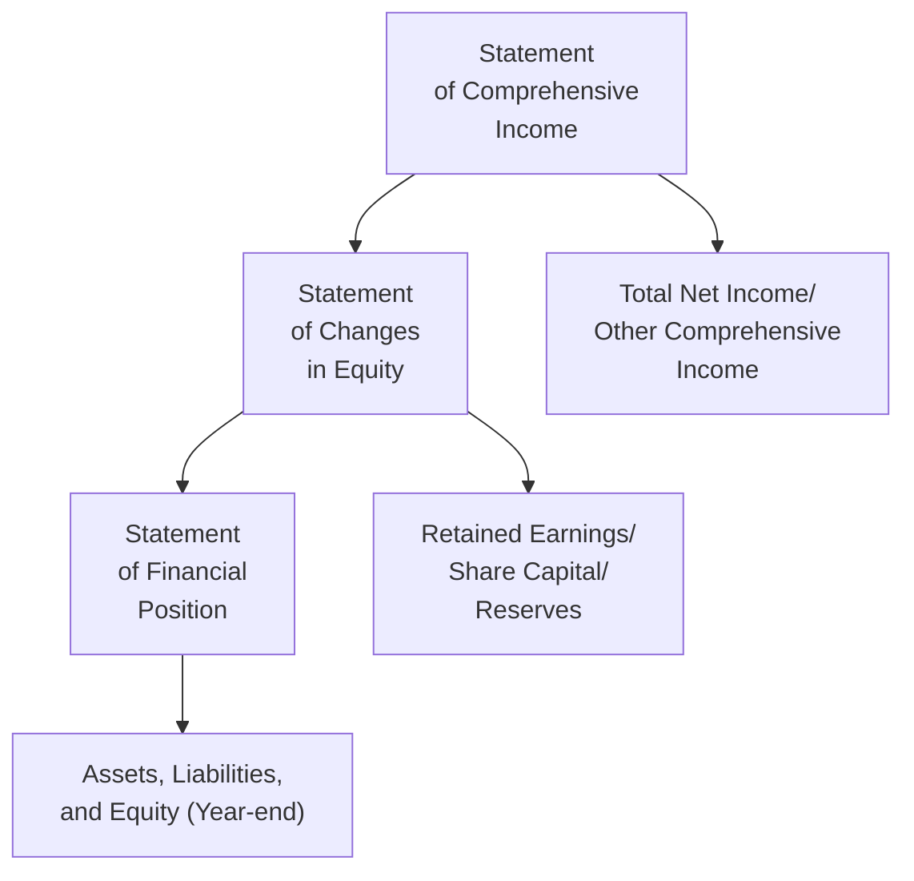

## 9.4 What Is the Statement of Changes in Equity?

Have you ever wondered how a company or mutual fund’s equity—from shares, retained earnings, and everything else—changes from one period to another? Well, that’s exactly what the Statement of Changes in Equity is all about. And, believe me, the first time I saw it, I had no idea why I couldn’t just rely on the Statement of Comprehensive Income and the Statement of Financial Position. Eventually, I realized that the Statement of Changes in Equity helps connect the dots, showing how each component of equity shifts over a reporting period.

It’s like a financial “bridge” that starts with opening balances for different equity components—like retained earnings or share capital—and captures each change arising from net income (or net loss), other comprehensive income, dividends, share issuances, and more. In a mutual fund or other investment fund contexts, it also shows us how unitholder subscriptions, redemptions, and distributions shape the fund’s net assets.

Let’s walk through this from a practical angle—how it’s organized, why it matters, and how you might interpret it if you’re an advisor, investor, or simply a curious learner trying not to get lost in the labyrinth of financial statements.

---

### Why This Statement Matters

If you recall from earlier chapters—especially when we discussed financial statement basics—one major goal is to understand how a company or fund’s performance and transactions affect its overall worth. The Statement of Comprehensive Income captures profit or loss plus “other comprehensive income” items (like certain gains or losses that bypass net income), while the Statement of Financial Position (a.k.a. the Balance Sheet) gives you a snapshot of assets, liabilities, and equity at a particular point in time.  

But how do you see line by line changes in equity? That’s what this statement does. By laying out what happened to retained earnings, share capital, sometimes reserves, and other equity components:

• You observe how net income raised the equity balance.  
• You factor in dividends or distributions that reduce retained earnings.  
• You see the impact of other comprehensive income, which can adjust shareholders’ equity under certain IFRS or accounting guidelines.  
• You figure out whether the company bought back shares (reducing equity) or issued new shares (increasing equity).  

For a typical equity investment, the Statement of Changes in Equity can give you a sense of whether you’re receiving some of the returns in the form of dividends or if those earnings are being reinvested. Meanwhile, in a mutual fund context, you’d see subscriptions (money from unitholders buying units), redemptions (money paid out to unitholders who sell their units), and distributions (fund earnings paid out to existing unitholders).

If you’re an advisor, you’ll frequently refer to this information to gauge whether a company’s or fund’s equity is stable, whether distributions are consistent, and how performance is reflected in the net asset value (NAV). If you’re an investor, you’re basically getting a behind-the-curtain look at how the managers’ decisions and market performance affect the portion of the organization’s net assets attributable to owners (shareholders or unitholders).

---

### Basic Anatomy of the Statement of Changes in Equity

Although formats vary across industries and jurisdictions, here are the primary components you’ll often see:

• Beginning Balance of Equity (each component’s starting point at the beginning of the period).  
• Add: Net Income.  
• Add or Subtract: Other Comprehensive Income (OCI) to the extent it affects equity directly.  
• Subtract: Dividends Paid (in a corporate setting) or Distributions to unitholders (in a fund structure).  
• Add or Subtract: Changes from Issuance and/or Repurchase of Shares/Units.  
• Ending Balance of Equity (for each equity category).

In a company’s annual report, for instance, you might see a table with several columns labeled “Share Capital,” “Retained Earnings,” “Revaluation Reserves,” “Other Reserves,” etc., with each row displaying the changes throughout the period. By the bottom right corner, you can track the total equity figure as of period-end.  

#### A Simple Example

Let’s imagine a fictitious company, MapleLeaf Tech Inc., starting its fiscal year with:

• Share Capital: $500,000  
• Retained Earnings: $200,000  
• Other Reserves: $20,000  

Suppose, during the year, MapleLeaf Tech earns a net income of $80,000. The company also declares and pays $30,000 in dividends. Additionally, it issues new shares worth $50,000 and recognizes $5,000 in other comprehensive income related to foreign currency translation gains (a typical example of OCI). After the dust settles, the statement would record:

1. Opening Equity:  
   - Share Capital: $500,000  
   - Retained Earnings: $200,000  
   - Other Reserves: $20,000  

2. Net Income for the Period (+$80,000) goes to Retained Earnings.  
3. Dividends (−$30,000) reduce Retained Earnings.  
4. Additional Share Capital Issued (+$50,000).  
5. Other Comprehensive Income (+$5,000) affects the “Other Reserves.”  

6. The balances at the end of the period become:  
   - Share Capital = $550,000 ($500,000 + $50,000)  
   - Retained Earnings = $250,000 ($200,000 + $80,000 − $30,000)  
   - Other Reserves = $25,000 ($20,000 + $5,000)  

Hence, MapleLeaf Tech’s total equity climbs from $720,000 to $825,000.

By looking at these numbers, you can see immediately that MapleLeaf Tech boosted its equity primarily through net income and new share issuance, partially offset by dividends. This is the type of clarity you get from the Statement of Changes in Equity.

---

### Linking to the Other Statements

If you’re following International Financial Reporting Standards (IFRS), in particular IAS 1 – Presentation of Financial Statements, it’s standard to present the Statement of Changes in Equity alongside the Statement of Financial Position, the Statement of Comprehensive Income, and the Statement of Cash Flows. They all connect, or “talk” to one another:

• Net Income from the Statement of Comprehensive Income flows into Retained Earnings.  
• Other Comprehensive Income from that same statement also influences equity items, such as revaluation reserves or currency translation adjustments.  
• The final equity total on the Statement of Changes in Equity appears under the “Equity” section of the Statement of Financial Position.  

This integrated view is vital. You can’t properly interpret an organization’s performance and position without considering how these statements link up.

---

### A Quick Mermaid Diagram

Let’s illustrate the flow of information through a Mermaid diagram. Notice each statement’s data feeds somewhere else:

In plain language:

• Net income and other comprehensive income from Point A flow into Point B, updating equity values.  
• The updated equity figure at Point B goes into Point C, specifically under the equity section, rounding out the year-end financial position.

---

### Impact for Mutual Funds and Other Pooled Investment Vehicles

For those of you dealing with mutual funds, segregated funds, or exchange-traded funds (ETFs), the logic is similar, but the labeling often revolves around concepts like net asset value (NAV), unitholder transactions, and so on. The statement tracks:

• Beginning Net Assets (Equity) Attributable to Unitholders.  
• Plus: Subscriptions or New Units Issued (Investors buying in).  
• Minus: Redemptions (Investors selling out).  
• Plus/Minus: Net investment income (realized and unrealized gains/losses).  
• Minus: Distributions (payments to existing unitholders).  

The end result is the new net assets (equity) that belong to unitholders. It’s a direct measure of how the fund’s overall value changes, which is, in turn, reflected in the per-unit NAV.

#### Why Advisors Love This

It’s not just a random piece of financial data. If you’re an advisor, you want to keep tabs on how effectively the fund is managing money, what portion of returns is being distributed rather than reinvested, how client cash flows in or out of the fund might affect the overall performance, and how the managers handle surplus (either distributing or adding back to the fund’s value).

If you notice a big jump in redemptions, for instance, that might indicate unitholders losing confidence—or maybe they just need liquidity. By analyzing the Statement of Changes in Equity, you can piece together investor behaviour with market forces, providing valuable insight for your recommendations to clients.

---

### Key Glossary Terms

Retained Earnings:  
These are the accumulated net profits (or losses) from prior periods that continue to be reinvested in the company or fund. When a corporation earns net income, it can either distribute some or all of it as dividends to shareholders or keep it within the company, thereby increasing retained earnings.

Share Capital:  
This is the money raised by a company in exchange for shares of ownership. For a mutual fund, this would be the value of the subscriptions when unitholders purchase new fund units.

Distributions:  
Payments of income or gains from the company or fund to its owners—shareholders in a corporation, unitholders in an investment fund. Distributions reduce retained earnings in a corporate structure or the net assets attributable to unitholders in a fund.

Unitholder:  
An investor who holds units in a mutual fund, ETF, or trust structure instead of shares. The term “unit” is used to distinguish it from a “share,” although the underlying concept is quite similar.

---

### Best Practices for Analyzing the Statement

• Look at Trends Over Time:  
  A single statement might not tell you the entire story. Compare statements of changes in equity over several periods to see if the company’s or fund’s equity base is consistently growing, occasionally shrinking, or fluctuating widely.

• Check the Sources of Equity Growth or Reduction:  
  Is the growth coming mostly from net income or from issuing new shares/units? A company heavily relying on new share issuances might be diluting existing shareholders, while strong net income with moderate dividends can signal steady operations.

• Evaluate Dividend or Distribution Policies:  
  Is the organization paying out more than it earns? That can be a red flag, potentially indicating it’s dipping into reserves or borrowing to maintain distribution levels.

• Reconcile with Other Statements:  
  Make sure net income from the Statement of Comprehensive Income matches the amount transferred into retained earnings. If anything’s off, find out why—perhaps there are unusual Other Comprehensive Income items or restatements you need to consider.

• Understand the Regulatory Context:  
  In Canada, CIRO (Canadian Investment Regulatory Organization) remains the single self-regulatory body overseeing investment dealers, mutual fund dealers, and market integrity. While “IIROC” and “MFDA” were historical SROs before amalgamating into CIRO, they no longer operate as separate entities. CIRO upholds standards for financial reporting and disclosure within its jurisdiction, and it’s essential to confirm that the statements you’re analyzing comply with Canadian securities regulations.

---

### Common Pitfalls and Practical Tips

• Overlooking Other Comprehensive Income (OCI):  
  Sometimes an investor focuses solely on net income and ignores OCI. However, large currency translation or revaluation gains and losses can add an important dimension to your understanding of the organization’s real financial state.

• Confusing Retained Earnings with Cash:  
  Retained Earnings is not “cash in the bank.” It’s an accounting measure. A company with high retained earnings might still be cash poor if it’s reinvesting heavily in capital expenditures or acquiring other businesses.

• Missing the “Story” Behind Dividends or Distributions:  
  Seeing a healthy dividend is nice, but can the company or fund afford it in the long run? Double-check if those distributions align with net income and the business strategy.

• Not Realizing How Buybacks Affect Equity:  
  When a company repurchases its shares, it reduces share capital (or a related equity account) and the total number of shares outstanding. This can boost earnings per share by reducing the share count, but it also means using cash or incurring debt to finance the buyback. Interpret carefully.

• Failing to Differentiate Subscriptions vs. Redemptions in Mutual Funds:  
  Fund flows can be volatile. Seeing large redemptions might imply shifting investor sentiment. Meanwhile, subscriptions can inflate net assets but also force managers to invest more cash quickly (which can be a risk in fast-changing markets).

---

### Putting It All Together

The Statement of Changes in Equity might feel like a sidekick to the more frequently discussed statements, but once you realize its storytelling power—revealing exactly how and why equity levels shift—you’ll see why it’s a crucial puzzle piece in financial analysis. It ties everything together:

• Net income or net losses flow in.  
• Dividends or distributions flow out.  
• New shares or units sold bring in fresh capital.  
• Other comprehensive income fine-tunes certain equity balances.  

For mutual funds, you replace “dividends” with “distributions” and track your subscription and redemption flows to measure changes in net assets. However, the basic principle remains the same: You’re monitoring how the owners’ portion of the overall pie changes over time.

Personally, I’ve often found it enlightening to look at a company’s Statement of Changes in Equity right after I see its net income and dividends. If the net income is soared high but the equity barely budges, you can guess there might have been a big dividend, a share buyback, or possibly even some non-cash OCI losses. And, well, that’s the real detective work of finance—figuring out the “why” behind the numbers.

---

### Further Resources

• IAS 1 – Presentation of Financial Statements at the IFRS Website:  
  [https://www.ifrs.org/](https://www.ifrs.org/)  
  - Lays out the ground rules for how financial statements (including changes in equity) should look under IFRS.

• CFA Institute:  
  [https://www.cfainstitute.org/](https://www.cfainstitute.org/)  
  - Offers comprehensive courses on financial analysis, including deep dives into equity statements.

• “Interpreting and Analyzing Financial Statements” by Karen P. Schoenebeck:  
  - A detailed resource that can help you master advanced accounting and equity analysis skills.

• CIRO’s Official Site:  
  [https://www.ciro.ca](https://www.ciro.ca)  
  - For updates on current Canadian regulatory compliance, registration standards, and investor protection initiatives.

If you’re keen to practice, try pulling a real company’s annual report—maybe a well-known Canadian bank or resource company—and tracing its equity from one year to the next. Or, if you’re more interested in investing, grab the semi-annual report of a mutual fund. Focus on the changes in net assets. Compare them to net income, distributions, and flows from subscriptions and redemptions. You’ll be amazed at how quickly you’ll start to see the big picture.

---

## Statement of Changes in Equity: Best Practices and Key Insights Quiz



### 1. Which of the following typically increases Retained Earnings on a Statement of Changes in Equity?

- [ ] Share issuance  
- [x] Net income  
- [ ] Dividend payments  
- [ ] Unit redemptions  

> **Explanation:** Retained Earnings generally rise with net income and decrease with dividends or distributions. Share issuance and unit redemptions affect Share Capital (or unitholder equity) but not Retained Earnings directly.

### 2. In a mutual fund's Statement of Changes in Equity, "subscriptions" refer to:

- [ ] Dividend reinvestments  
- [x] New units purchased by investors  
- [ ] The fund's operating expenses  
- [ ] Gains or losses in net income  

> **Explanation:** Subscriptions represent the cash inflow from investors buying new units in the fund, which increases the fund's total net assets attributable to unitholders.

### 3. If a company reports a substantial net income, but its total equity barely changes, which of the following could explain the discrepancy?

- [x] Significant dividend or share buyback  
- [ ] A high degree of leverage on the company’s balance sheet  
- [ ] An external audit adjustment  
- [ ] An increase in retained earnings  

> **Explanation:** When net income is high but total equity does not increase, a common cause is dividend payments or share repurchases that reduce equity.

### 4. Which financial statement in IFRS primarily outlines the beginning and ending balances of each equity component?

- [ ] The Statement of Comprehensive Income  
- [x] The Statement of Changes in Equity  
- [ ] The Statement of Financial Position  
- [ ] The Statement of Cash Flows  

> **Explanation:** Although equity also appears on the Statement of Financial Position, only the Statement of Changes in Equity breaks down each equity account from beginning to end balances.

### 5. Which of the following best characterizes a distribution in the context of a mutual fund?

- [x] A payment of the fund’s earnings to existing unitholders  
- [ ] A company’s issuance of new shares to employees  
- [x] A reduction of the fund’s net assets available for unitholders  
- [ ] An increase in share capital  

> **Explanation:** A distribution represents the portion of income or gains that the fund pays out to its unitholders, reducing the fund’s net assets. It has no direct correlation with staff share issuance.

### 6. In the Statement of Changes in Equity, Other Comprehensive Income (OCI):

- [x] Can increase or decrease certain equity reserves  
- [ ] Has no effect on the equity section  
- [ ] Is always the same as net income  
- [ ] Must be recorded under “Retained Earnings” only  

> **Explanation:** OCI typically modifies specialized reserves (e.g., revaluation or currency translation reserves) and does not usually go straight to retained earnings.

### 7. Which organization now oversees investment dealerships and market integrity in Canada (as of 2025)?

- [x] CIRO  
- [ ] IIROC (current SRO)  
- [x] MFDA (historical SRO)  
- [ ] TSX  

> **Explanation:** The Canadian Investment Regulatory Organization (CIRO) resulted from the amalgamation of the defunct IIROC and MFDA. It is the current, single national SRO in Canada.

### 8. A high level of share buybacks without corresponding growth in net income might suggest:

- [x] Possible short-term boosts to EPS from fewer shares outstanding  
- [ ] Guaranteed improvement in the company's retained earnings  
- [ ] A replacement of debt with equity  
- [ ] No change in total equity  

> **Explanation:** Buying back shares reduces the number of outstanding shares, which can temporarily increase earnings per share (EPS). However, it also uses cash or additional debt and can shrink total equity.

### 9. Why should an advisor pay attention to large redemptions shown on a mutual fund’s Statement of Changes in Equity?

- [x] It might indicate that unitholders are exiting due to underperformance or other reasons  
- [ ] It always signals guaranteed fraud  
- [ ] It’s unrelated to the fund manager’s decision-making approach  
- [ ] It never affects the NAV  

> **Explanation:** Large redemptions can mean investors are pulling out funds, potentially because of dissatisfaction with performance or economic uncertainty. This can impact how the fund is managed and influence the NAV.

### 10. True or False: The Statement of Changes in Equity exclusively reflects changes in retained earnings and cannot include changes in share capital or other reserves.

- [x] True  
- [ ] False  

> **Explanation:** This statement covers subsequent changes in all equity accounts, including share capital, retained earnings, reserves, and any components that form total equity.


