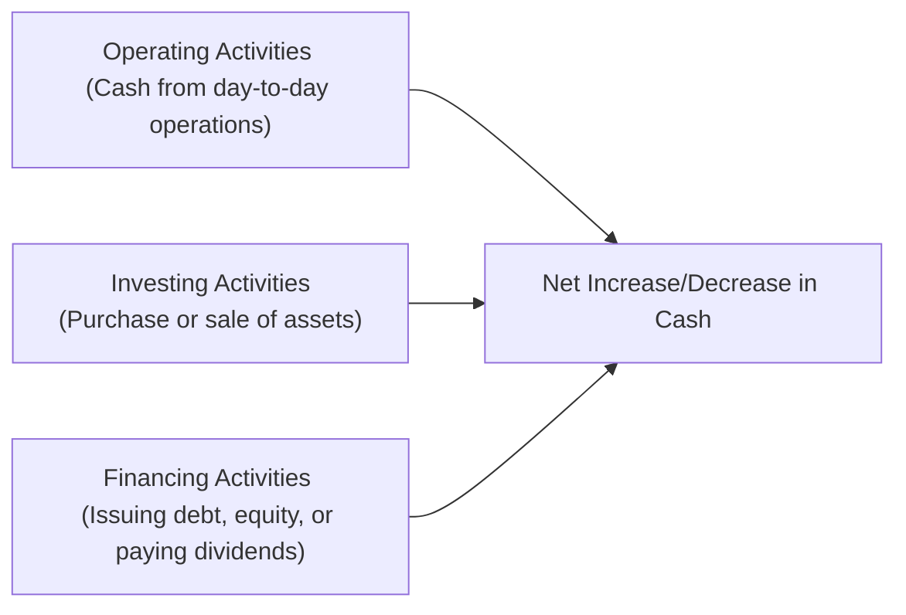

## 9.5 Statement of Cash Flows

Have you ever come across a company that announced a sizeable profit but then, somehow, struggled to pay its bills? Perhaps you’ve heard stories—like my friend who was excited about his investment in a promising biotech start-up, only to discover that, despite an impressive net income reported on its Statement of Comprehensive Income (see chapter 9.3), the company’s bank balance hovered dangerously close to zero. It’s a strange phenomenon, right? Well, we can thank the Statement of Cash Flows for showing us how this is possible.

The Statement of Cash Flows is a critical part of a firm’s financial statements. While the Statement of Financial Position (see chapter 9.2) shows assets, liabilities, and shareholder’s equity, and the Statement of Comprehensive Income (see chapter 9.3) tells us about revenue, expenses, and profit, the Statement of Cash Flows reveals the actual money flowing in and out of the organization. It clarifies whether the company generates enough cash to stay afloat, invest in new opportunities, and provide returns to shareholders (or unitholders, in the case of mutual funds). The statement is divided into three primary sections:

• Operating Activities  
• Investing Activities  
• Financing Activities  

Under the International Financial Reporting Standards (IFRS), these sections follow guidelines outlined in IAS 7 – Statement of Cash Flows. Understanding what goes into each section will help you see whether a company (or fund) is truly “liquid” or merely reporting strong accrual-based earnings that may not reflect the real flow of cash.

Below, we’ll examine each of these three segments, discuss direct versus indirect methods for reporting cash from operations, touch on how mutual funds handle inflows and outflows, explore real-world examples, highlight best practices, and consider pitfalls to avoid. We’ll also wrap up with references and resources for deeper study. So, let’s jump in.

### Why the Statement of Cash Flows Matters

Before diving into the nitty-gritty, let’s quickly remind ourselves why the Statement of Cash Flows is such a big deal. In many cases, companies struggle not because their products are unwanted or their income statements look shaky, but because they run out of liquid cash. Businesses rely on immediate cash to pay salaries, interest on loans, suppliers, and even dividends. Accrual basis accounting (which you’ll see predominantly in the Statement of Comprehensive Income) often includes revenues or expenses that haven’t been settled in cash yet. This can create timing mismatches where a firm reports a profit but has limited actual cash at hand.

A strong Statement of Cash Flows often indicates a healthy ability to generate cash from core operations, fund new investments, or comfortably service higher levels of debt. Conversely, an entity facing consistent negative cash flows—especially from operations—might be forced to rely heavily on financing (e.g., raising new capital or borrowing), which is usually unsustainable in the long term.

### Operating Activities

Operating activities reflect the day-to-day business operations, focusing on revenues and expenses directly related to the company’s core business. Items within this section include:

• Cash received from customers or clients.  
• Cash paid to suppliers and employees.  
• Cash flows related to interest payments and interest received (in some jurisdictions, interest expense may be classified under Financing Activities, but IFRS permits it under Operating Activities as well).  
• Tax payments (e.g., corporate income tax).  

When using the indirect method (the method you’ll most frequently see in financial statements), this section starts with net income (from the Statement of Comprehensive Income) and adjusts for non-cash items such as depreciation, amortization, gains or losses on the sale of assets, and changes in working capital accounts like receivables, payables, and inventory. These modifications bridge the gap between accrual-based profit and the actual cash generated (or used) in operations.  

Under the direct method, instead of adjusting net income for non-cash items, companies list the actual cash collections and payments (like “Cash received from customers” and “Cash paid to suppliers”). However, the direct method is less commonly used because it can be more cumbersome to prepare. IFRS allows both methods, but the indirect method is more widely seen in practice.

### Investing Activities

Investing activities capture cash inflows and outflows involving long-term assets and investments. These often include:

• Purchase or sale of property, equipment, or other capital assets.  
• Purchase or sale of investment securities (e.g., stocks, bonds) if these are not classified as cash equivalents.  
• Cash movements related to mergers or acquisitions.  

This section reveals how the organization is using cash to grow its asset base or perhaps restructure its business. While negative cash flow in the Investing Activities section may initially look concerning, it can actually indicate that a company is expanding and deploying capital to purchase productive assets. That said, if a firm invests heavily without a plan or cannot fund those expenditures from sustainable operating cash flows, it may be heading for trouble.

### Financing Activities

Financing activities detail how a firm raises and returns capital to its stakeholders, including:

• Proceeds from the issuance of shares or bonds.  
• Repayment of loans or redemption of bonds.  
• Payment of dividends to shareholders or distributions to unitholders (for mutual funds or trust structures).  

This section indicates a company’s reliance on external funding. For example, if the business cannot generate sufficient cash from operations, it may need to go to the markets to raise money via equity or debt. Likewise, a firm paying out high levels of dividends but not generating enough cash from operations may be depleting its reserves or borrowing to maintain its dividend policy.

### Visual Overview

To see how these three sections converge to form the total net change in cash, let’s look at a quick diagram:

Each arrow shows how these distinct cash flow categories aggregate into the final amount of increased or decreased cash on the balance sheet for that period. This net increase (or decrease) in cash then reconciles with the opening and closing balances of “Cash and Cash Equivalents” shown on the Statement of Financial Position.

### Mutual Fund Considerations

Now, let’s pivot to consider mutual funds specifically. One might think: “Why does a mutual fund need a Statement of Cash Flows?” After all, funds primarily invest in marketable securities, and many of those positions can be liquidated on short notice. However, mutual funds do still experience:

• Net purchases and redemptions of fund units.  
• Distributions of income and realized capital gains.  
• Operating activities linked to management fees, transaction costs, and other expenses.

If a fund sees a flurry of redemptions, it may need to generate cash quickly, possibly by selling assets. Conversely, if the fund experiences heavy inflows, managers will have extra capital to deploy. Monitoring these cash flows helps you gauge liquidity risk, redemption patterns, and even investor sentiment around the fund’s strategy or performance. A stable or steadily rising level of net cash inflows can suggest the fund is managing unitholder expectations well, while significant net outflows might raise questions about performance or market conditions influencing investor confidence.

### Free Cash Flow (FCF)

For corporate entities, you may also encounter a figure called Free Cash Flow (FCF). FCF often gets calculated after deducting capital expenditures (CapEx) from the cash provided by operations. Essentially, it aims to measure the cash available for distribution to shareholders (or unitholders) once the company invests enough in its existing operations to keep them running (i.e., to maintain or expand its asset base). While mutual funds typically do not face the same CapEx requirements as operating companies, the focus on “excess cash” can be paralleled by how effectively a fund’s investment strategy can cover redemption demands while still investing in new securities.

### Case Study: Accounting Mismatch in a Growing Company

Imagine a technology start-up, MapleApps Inc., recording $200,000 in net income on the Statement of Comprehensive Income. If you stopped there, you might think, “Fantastic, that’s a profitable business.” But then you see that MapleApps had $150,000 of sales on credit, meaning they haven’t actually received all that money in cash yet. On top of this, MapleApps purchased new equipment worth $75,000, spent $30,000 on repaying an existing loan, and received $50,000 from issuing additional shares.

In this scenario:  
• Operating cash flow might be near zero or even negative (because the company’s cash from customers is less than net income, given much is tied up in unpaid receivables).  
• Investing cash flow is negative ($75,000 outflow).  
• Financing cash flow is positive ($20,000 net inflow after loan repayment and new share issuance).

Without the Statement of Cash Flows, you’d be left scratching your head trying to figure out why MapleApps is short on cash when they’ve posted healthy profits.

### Best Practices in Analyzing Cash Flows

• Look for consistency between net income and operating cash flow. A company with stable, positive operating cash flow is generally healthier than one posting profits largely based on non-cash transactions.  
• Watch for significant shifts in working capital (like big jumps in receivables or inventory) that can distort cash flows.  
• Pay attention to capital expenditures in the Investing section. Overly large or unplanned CapEx might strain cash resources, while very low CapEx could indicate underinvestment in growth.  
• Observe how frequently a company taps the Financing section to fund everyday activities. An entity reliant on raising new debt or equity might be on less stable footing than one funding expansions primarily from its operating cash flows.  
• For mutual funds, track net inflows or outflows. Is the fund forced to sell positions at unfavorable times to meet redemptions? Or does it consistently have healthy cash on hand?

### Common Pitfalls

• Assuming profitability always translates into cash availability. Accrual accounting can deliver positive net income even when actual cash is in short supply.  
• Overlooking big swings in working capital requirements, like seasonal demands for inventory or special terms granted to large customers.  
• Misinterpreting negative cash flow in Investing activities as a bad sign without looking at the context (e.g., expansions into new markets).  
• Confusing the direct method for the indirect method: Financial statements rarely use the direct method, so a quick glance might lead you to interpret items incorrectly.  
• Focusing too heavily on short-term financing inflows (e.g., new loans taken out) without noticing that the company is struggling to generate cash operationally.

### Strategies to Overcome Challenges

• Read the Statement of Cash Flows alongside the other statements, not in isolation. Cross-reference net income on the Statement of Comprehensive Income and any dividends or distributions on the Statement of Changes in Equity (see chapter 9.4).  
• Examine the notes to the financial statements for more detail about major cash transactions, especially for intangible or complex investment vehicles.  
• Use simple ratios, like the Operating Cash Flow to Current Liabilities ratio, to gauge short-term liquidity. Or look at “Cash Flow Coverage of Dividends Paid” if you’re curious about dividend sustainability.  
• In the case of mutual funds, pay close attention to any notes regarding changes in net unitholder contributions. A large volume of net redemptions may require the fund to rebalance its portfolio in ways that might affect performance.  

### Regulatory Context and References

For Canadian entities, IFRS is the framework used by publicly accountable enterprises, and IAS 7 – Statement of Cash Flows provides detailed guidance. While private enterprises in Canada can follow Accounting Standards for Private Enterprises (ASPE), the overall structure of the Statement of Cash Flows typically remains quite similar.

CPA Canada offers useful tutorials and tools that walk you through preparing and interpreting statements of cash flows. Additionally, the CFA Institute has in-depth modules on advanced cash flow analysis—perfect for those who want to dive deeper.

Remember, if references to older self-regulatory organizations (like IIROC or MFDA) come up regarding financial disclosure, these bodies have merged into the Canadian Investment Regulatory Organization (CIRO) effective June 1, 2023. For the most recent regulations and guidelines, consult CIRO’s website at https://www.ciro.ca.

### Additional Resources for Further Exploration

• IFRS Foundation – IAS 7 on statements of cash flows: ifrs.org  
• CPA Canada – Cash flow analysis tutorials: cpacanada.ca  
• CFA Institute – Detailed modules on cash flow analysis: cfainstitute.org  
• Government of Canada websites – for official updates on accounting guidelines and reporting standards  

---

## Statement of Cash Flows Mastery Quiz: Test Your Knowledge on Operating, Investing, and Financing Activities



### Which section of the Statement of Cash Flows includes cash paid to suppliers and employees in the normal course of business?

- [x] Operating activities
- [ ] Investing activities
- [ ] Financing activities
- [ ] Consolidation activities

> **Explanation:** Operating activities reflect everyday transactions, such as paying employees and suppliers. Investing activities focus on long-term assets, while financing handles capital structure items (loans, equity, dividends).

### What distinguishes the indirect method from the direct method when presenting operating cash flows?

- [x] The indirect method starts with net income and adjusts for non-cash items.
- [ ] The indirect method lists only gross cash receipts and payments.
- [ ] The direct method begins with net income and adds back depreciation.
- [ ] The direct method uses no accrual-based adjustments.

> **Explanation:** The indirect method begins with net income (from the Income Statement) and adjusts for non-cash transactions, whereas the direct method categorically lists cash inflows/outflows from operations.

### Which part of the Statement of Cash Flows would typically include the purchase of manufacturing equipment?

- [ ] Operating activities
- [x] Investing activities
- [ ] Financing activities
- [ ] Capital preservation activities

> **Explanation:** Purchasing long-term assets, such as machinery, appears in the Investing section of the cash flow statement.

### Why might a company show a net profit on its Statement of Comprehensive Income but still have insufficient cash?

- [x] Accrual accounting can recognize revenue before actual cash is received.
- [ ] Depreciation directly translates to higher cash balances.
- [ ] A negative net income automatically means a surplus of cash.
- [ ] Positive working capital always reduces cash outflows.

> **Explanation:** Under accrual accounting, income is recorded at the time of sale rather than when the cash is collected. Hence, the company might be profitable “on paper” but lack sufficient liquid cash.

### Which of the following is a key reason to track net redemptions in a mutual fund’s cash flow statement?

- [x] It shows potential liquidity demands on the fund.
- [x] It highlights investor sentiment about the fund’s performance.
- [ ] It only appears in the fund’s statement of comprehensive income.
- [ ] It has no impact on the fund’s actual operations.

> **Explanation:** Net redemptions can force the fund manager to sell assets to meet redemption requests, reflecting liquidity needs. Large outflows might also signify wavering investor sentiment.

### Under IFRS, where is interest paid generally categorized on the Statement of Cash Flows if the indirect method is used?

- [x] Operating activities
- [ ] Investing activities
- [ ] Financing activities
- [ ] Non-cash disclosures

> **Explanation:** IFRS allows interest paid to be classified under operating activities, though companies can also choose financing. Many standard presentations place interest under operating activities.

### Which of the following best describes free cash flow (FCF)?

- [x] Cash from operating activities minus capital expenditures
- [ ] Total sales minus cost of goods sold
- [x] Cash generated after funding core operations and asset maintenance
- [ ] Net interest paid over a given period

> **Explanation:** Free cash flow is often defined as the net cash from operating activities minus capital expenditures required to maintain or grow the asset base.

### What should an analyst look for if a company’s investing cash flow is unusually large and consistently negative?

- [x] Whether the outflows are indicative of strategic growth
- [ ] Immediate insolvency or default
- [ ] Fraudulent financing disclosures
- [ ] Idle surplus cash

> **Explanation:** Negative investing cash flows often mean the company is putting cash into capital projects, expansions, or acquisitions, which could be good if aligned with strategic goals.

### Which of these statements about the direct method is correct?

- [x] It reports actual cash receipts from customers and cash paid to suppliers.
- [ ] It starts with net income and then adjusts for depreciation.
- [ ] It is the only acceptable method under IFRS.
- [ ] It always produces much higher net cash balances than the indirect method.

> **Explanation:** The direct method lists actual items like “Cash received from customers” and “Cash paid to employees.” The indirect method starts with net income and adjusts for non-cash items. Both methods arrive at the same net operating cash flow in total, but the presentation differs.

### True or False: A company that reports a large positive balance in Operating Activities can still face liquidity problems within the same accounting period.

- [x] True
- [ ] False

> **Explanation:** Even if operating cash flows are positive, timing mismatches, unexpected expenses, or seasonal working capital needs can cause liquidity stress before the end of that reporting period.


