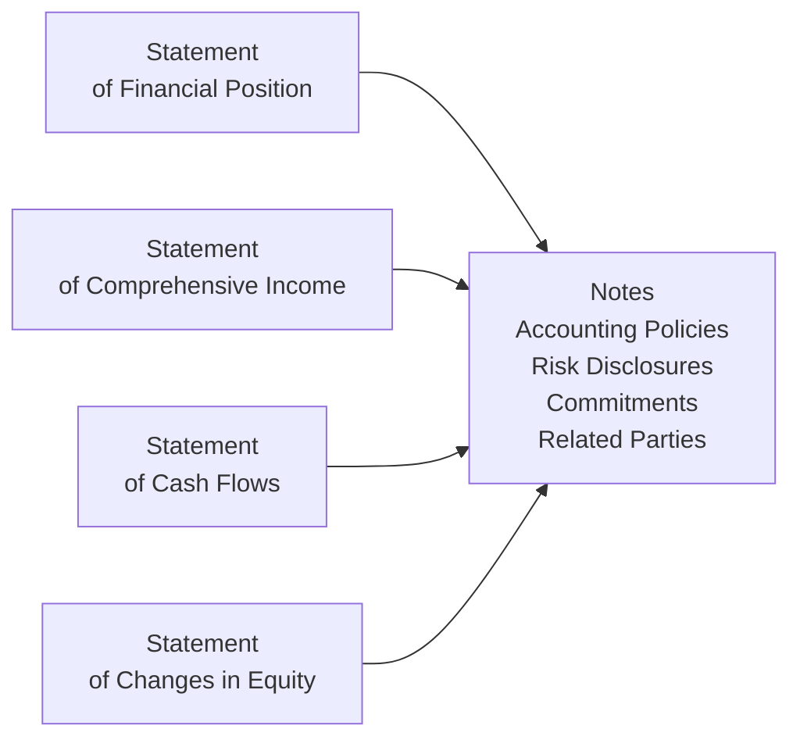
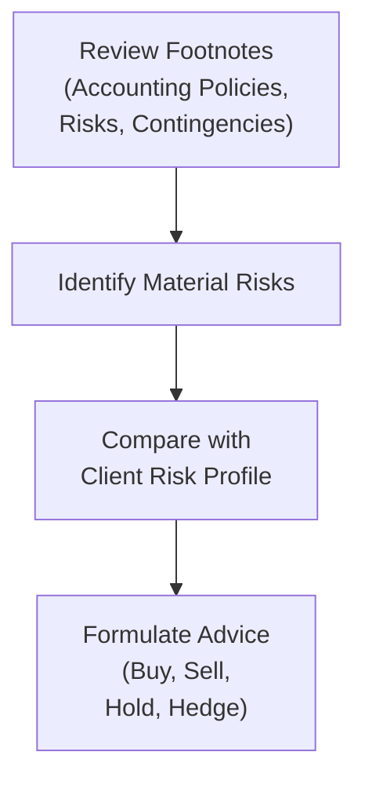

## 9.6 Notes to the Financial Statements (Additional Topic)

Have you ever picked up financial statements for a company—or maybe for a mutual fund—and wondered where the real story is hidden? The main statements (like the balance sheet or statement of comprehensive income) give you the big-picture numbers, but the essence often lies in the attached footnotes or “Notes to the Financial Statements.” These notes provide context, highlight risks, explain accounting methods, and help us figure out how reliable (or not) the numbers truly are.

In this section of the Conduct and Practices Handbook Course (CPH®), we’ll uncover the crucial elements that notes bring to the table, especially from a Canadian market standpoint. We’ll also look at how these notes apply to financial instruments, mutual funds, and investor accounts that you might come across as a Registered Representative. By the end, you should come away with a better sense of how to interpret (and maybe even enjoy reading) these footnotes, ensuring that you’re best equipped to serve your clients and make informed recommendations.

### The Role of Notes: Why They’re So Important

Sometimes I get asked, “Why do I really need to care about those notes? Aren’t the statements enough?” The short answer is no. The more complete answer is that notes:

• Reveal the accounting methods used (such as how inventory or intangible assets are valued).  
• Provide comprehensive breakdowns of items reported on the face of the financial statements (like intangible assets, derivative instruments, or complex liabilities).  
• Disclose significant commitments and contingencies (like lawsuits or contractual obligations).  
• Highlight various risk factors, from credit and liquidity risks to foreign exchange exposures.  
• Uncover any related-party transactions that could hint at conflicts of interest or special arrangements.  

From that vantage point, you can see that ignoring footnotes in your analysis is a bit like only reading the first page of a mystery novel. You miss all the context and spicy details that tie the story together.

### Common Types of Notes

Rather than enumerating them rigidly, let’s walk through the major categories of notes you’ll typically see.

Accounting Policies  
When you open a set of financial statements, the first note is usually about “Significant Accounting Policies.” This is where a company (or mutual fund) lays out which accounting frameworks it follows—like International Financial Reporting Standards (IFRS)—and the specific methods it uses. For a Canadian issuer following IFRS, you’ll see details about revenue recognition, depreciation methods, how foreign currency transactions are translated, and so on.  

These policies can significantly impact the reported earnings and financial position. For example, two firms might have the same type of equipment, but if their depreciation methods differ (straight-line vs. declining balance), their reported net income can vary.

Breakdown of Complex Account Balances  
Ever see a line item in the balance sheet labeled simply as “derivative liabilities” or “intangible assets” but wonder what’s actually inside? That’s where notes delve deeper. They’ll break down intangible assets into categories like patents, software licenses, or goodwill. Or they’ll detail derivative contracts by type—futures, forwards, or options—along with notional amounts and fair value.

Contingencies and Commitments  
Companies and funds might face a range of possible liabilities—like an ongoing lawsuit—or they might have made commitments that could impact their future cash flows (such as large contractual obligations). The notes detail these issues, telling you if they’re just possible or likely, and whether management believes they’ll have a material financial impact.

Risk Disclosures  
Risk disclosures explain how the entity is exposed to market risk (e.g., changes in stock prices, interest rates, currency swings), credit risk (the possibility that a borrower could default), and liquidity risk (the peril of not having enough cash to meet obligations). IFRS 7—Financial Instruments: Disclosures (https://www.ifrs.org/) mandates a set of risk disclosures that give you a sense of how volatile or uncertain the entity’s performance might be.

Related-Party Transactions  
A related-party transaction could involve the chief executive officer, a major shareholder, or a sister entity. Normally, you’d want to know if products are being sold at below-market rates to a related firm, or if a company is loaning money to its directors on favorable terms. Such notes help you assess potential conflicts of interest or misaligned incentives.

### Mutual Funds: Special Notes

When it comes to mutual funds, the notes often place a greater emphasis on valuation procedures and risk management practices around investment portfolios. Typically:

• Funds adhere to a fair value hierarchy (Levels 1, 2, or 3) to estimate the value of securities.  
• They detail how foreign currency transactions are translated.  
• They specify ways the fund manages interest-rate risk or credit risk. For example, they might detail how much of the bond portfolio is in AAA vs. BBB rated instruments.  
• They could also clarify the extent to which derivatives are used for hedging versus speculation.

### A Quick Anecdote: 

I clearly recall a scenario a few years back when I was examining a mutual fund’s notes. The fund had an impressively high yield, but as I dug deeper, I found a substantial portion of its portfolio was in lower-rated, high-yield debt. That was spelled out in the risk disclosures and credit ratings of the bond holdings—something you’d completely miss if you never ventured into the footnotes. That taught me (and hopefully you!) the importance of looking behind the curtain, especially with seemingly lucrative “high-yield” vehicles.

### Reading Notes to Spot Hidden Risks or Opportunities

From a regulatory perspective—especially under the watchful eye of the Canadian Investment Regulatory Organization (CIRO)—a Registered Representative has a duty of care to clients. Part of that means ensuring that the investments you recommend align with the client’s risk tolerance, investment objectives, and financial situation. Without a robust look at the footnotes, you might not fully understand the risk embedded in the entity or fund you’re proposing.

• If a note indicates that a large portion of the company’s assets is pledged as collateral, that’s an added risk dimension.  
• If a note highlights a pending lawsuit, you need to consider how an adverse ruling might hit future earnings.  
• If risk disclosures show that the portfolio is heavily concentrated in a single sector (technology, for example), that’s a big red flag for diversification concerns.

### Visualizing the Relationship Between Core Statements and Notes

Let’s visualize how the notes connect to the main statements. Here’s a simple Mermaid diagram that depicts these relationships:

In this diagram, all main financial statements point to the body of notes, which provide more detail and context. Think of the notes as the central resource that supports and explains everything you see in the primary statements.

### Fair Value Hierarchy Explained

For investments (particularly mutual fund holdings, hedge fund portfolios, etc.), IFRS requires that assets and liabilities measured at fair value be classified into a hierarchy based on the degree of observable market inputs:

• Level 1: Quoted prices in active markets for identical assets or liabilities (e.g., a widely-traded stock).  
• Level 2: Observable inputs other than Level 1 prices (e.g., prices for similar assets in active or less active markets).  
• Level 3: Unobservable inputs (e.g., estimates based on a valuation model, requiring substantial managerial judgment).  

Why does this matter? Because if the fund’s net asset value (NAV) is heavily determined by Level 3 inputs, it implies a higher degree of uncertainty or subjectivity in the valuations.

### Risk Disclosures in Practice

Under IFRS 7, an entity must explain its exposures to different types of risk and how those risks are managed. This might entail:

• A table showing interest-rate sensitivity (e.g., what happens to net income or equity if interest rates go up 1% or 2%).  
• A breakdown of how the company monitors credit risk, including the credit ratings of holdings or concentration of counterparties.  
• Liquidity risk dashboards that highlight upcoming debt maturities or the proportion of liabilities that must be repaid in the short term.

### Contingencies and Commitments

You’ve probably heard about lawsuits or environmental cleanup liabilities looming over a firm. The notes tell you whether a liability is recognized outright on the balance sheet or just noted as a potential (contingent) liability. The difference can be huge:

• If management believes a negative outcome is probable and can be estimated, the liability is accrued.  
• If it’s merely possible but not probable (or cannot be measured reliably), it’s only disclosed.  

The notes give you an early warning sign about issues that might not be fully recognized in the financial statements—yet.

### Related-Party Transactions: Reading Between the Lines

In the Canadian market, as well as globally, transparency about related-party transactions is essential to maintain investor confidence. If a company continuously sells assets to its controlling shareholder at suspiciously high prices, or pays the CFO’s personal holding company for “consulting services,” that could be a major red flag. The notes should disclose:

• The nature of the relationship.  
• The amount of transactions.  
• Any outstanding balances or commitments arising from those transactions.

When analyzing mutual funds, keep an eye on whether the fund’s manager or affiliated parties get fees or commissions that might create conflicts of interest.

### Personal Observations

Sometimes, when flipping through these notes, I feel like I’m detective hunting clues. It can be a bit overwhelming at first—lots of jargon, cross-references, and legal disclaimers. But once you train your eye to spot the key details—like major assumptions behind valuations or big risk exposures—it becomes second nature. I’ve found it helps to keep a small checklist or highlight certain words like “contingency,” “litigation,” “Level 3,” or “credit rating.”  

### Using the Notes for Better Client Conversations

Suppose you’re advising a client who wants to invest in a new high-tech company. The financial statements look okay on the surface, but you see in the notes that half of its intangible assets are classified as indefinite-lived intangible assets under IFRS, meaning they’re not regularly amortized, but tested for impairment. If the company’s technology fails or demand dries up, that intangible might be written off quickly, leading to a big net income hit. By discussing this upfront with your client, you position yourself as a thorough, diligent advisor—and you protect yourself from potential compliance issues if the investment sours down the road.

### Pitfalls and Strategies to Overcome Them

Ignoring the Footnotes  
• Pitfall: Missing critical risk disclosures.  
• Strategy: Make reading at least the summary of significant accounting policies and risk sections a standard part of your research.

Information Overload  
• Pitfall: Getting lost in 50 pages of dense, technical language.  
• Strategy: Use a systematic approach—scan for the big headers (Accounting Policies, Contingencies, Related Parties, Risk Factors) before diving deeper.

Misinterpreting Technical Terms  
• Pitfall: Taking “fair value” at face value without investigating whether it’s actually Level 3 based on internal models.  
• Strategy: If you spot extensively used Level 3 inputs, dive deeper or consult an accounting expert for further insight.

Failing to Communicate Clearly with Clients  
• Pitfall: Not translating complicated footnotes into plain language for a client.  
• Strategy: Practice summarizing or paraphrasing the main points in everyday language. A quick bullet list or short analogy can help them grasp the essence.

### A Look at the Impact on Practice

Under the Canadian Investment Regulatory Organization (CIRO) rules, Registered Representatives should ensure suitability of recommendations and full disclosure. You cannot do that effectively without properly interpreting the footnotes that highlight product-specific or company-specific risks. In addition, for investor protection, you might cross-reference the Canadian Investor Protection Fund (CIPF) guidelines to see how certain aspects of client assets are covered or not covered in the event of a firm insolvency.

### Another Mermaid Diagram: Footnotes and Risk Assessment

Below is a simplified diagram showing how footnotes feed into the risk assessment process for a Registered Representative:

In this depiction, analyzing the footnotes is the first step that shapes your understanding of the overall risks or liabilities. You then map those risks onto the client’s risk tolerance and overall investment objectives before deciding on an action.

### Practical Examples and Case Studies

Case Study 1: The Chengs’ Accounts  
The Cheng family invests in a growth-oriented mutual fund. By reading the notes, you discover that a large percentage of the fund’s portfolio is in small-cap technology companies (Level 3 valuations) that are subject to rapid market swings. This might still align with their growth objectives but also poses high volatility. By informing them of this concentration risk, you do your due diligence, as required by CIRO. (Also see Chapter 9.2 in the main Table of Contents for more general case studies on the Cheng family’s accounts.)

Case Study 2: A Real Estate Investment Trust (REIT)  
Suppose you’re analyzing a REIT with significant Level 3 valuations on its property portfolio. The notes reveal that many properties are in a region tanking economically or subject to new zoning laws. Management’s assumptions might still suggest stable cash flows, but the notes indicate potential impairment if the local real estate market continues to decline. This is crucial for your client to know before committing a large chunk of their retirement savings.

### Tying It All Together

Notes to the financial statements are much more than a formality. They are a treasure trove of information that can make or break your investment thesis. From explaining the fair value hierarchy to warning you about lawsuits, from clarifying intangible asset policies to revealing related-party shenanigans, these notes offer a window into the true nature of an entity’s financial health. Reading them carefully is a must for any financial professional who wants to give clients high-quality advice—and comply with CIRO’s standards of suitability and disclosure.

You might occasionally feel a headache coming on when you see 30 pages of footnotes, but practice helps. Once you incorporate a framework and maybe a highlight reel of top concerns to look for, it becomes a lot easier—and kind of exciting, if you ask me.

### Additional Resources

• IFRS 7 – Financial Instruments: Disclosures: https://www.ifrs.org/   
• CPA Canada’s resources on reading notes to the financial statements: https://www.cpacanada.ca/  
• “Guide to Financial Statement Analysis” by The Economist – Offers a deep dive into how to interpret footnotes and disclosures  
• CIRO for updated rules and guidance on securities regulation in Canada: https://www.ciro.ca  

---

## Quiz: Financial Statement Footnotes



### Which type of note typically provides details on the organization’s methods for revenue recognition, depreciation, and inventory valuation?

- [x] Accounting policies
- [ ] Risk disclosure
- [ ] Contingencies
- [ ] Related-party transactions

> **Explanation:** Accounting policies describe how the organization implements its chosen framework (e.g., IFRS), including revenue recognition, depreciation, and inventory valuation methods.

### What does “fair value hierarchy” (Levels 1, 2, 3) primarily classify?

- [x] The inputs used in valuing assets and liabilities
- [ ] The scope of annual audits
- [x] The difficulty in obtaining a reliable valuation
- [ ] Management’s experience with valuations

> **Explanation:** Levels 1, 2, and 3 distinguish how observable or subjective the inputs are in determining fair value. Level 1 uses active market prices, Level 2 uses observable but indirect inputs, and Level 3 relies on unobservable (often internal) inputs.

### Which document or standard outlines the requirements for disclosure of financial instruments and related risks?

- [x] IFRS 7
- [ ] IAS 10
- [ ] Canadian Investor Protection Fund (CIPF) guidelines
- [ ] CPA Canada Handbook – Tax

> **Explanation:** IFRS 7 (Financial Instruments: Disclosures) mandates that entities provide comprehensive information about financial instruments, including how they manage related risks.

### When is a liability recognized on the balance sheet for a potential legal settlement?

- [x] If it is probable and can be measured reliably
- [ ] Only when the lawsuit is fully resolved
- [ ] If the amount is immaterial
- [ ] If it is remotely possible

> **Explanation:** Under IFRS, a provision (liability) is recognized when an outflow of economic resources is probable and the amount can be estimated reliably.

### Which is a typical characteristic of a related-party transaction note?

- [x] Disclosure of the nature of the relationship and transaction amounts
- [ ] Details on past share prices
- [x] Mention of outstanding balances between the parties
- [ ] Calculation of tax depreciation

> **Explanation:** Related-party transaction notes must disclose the nature of the relationships, transaction amounts, and any balances resulting from those transactions to highlight potential conflicts of interest.

### Which scenario below exemplifies a hidden risk you might discover only by reading the notes?

- [x] A mutual fund invests heavily in Level 3, complex derivatives with limited market data.
- [ ] A well-known brand name is recognized regularly on the balance sheet.
- [ ] The company has stable ongoing operations in a single geographic location.
- [ ] The company’s annual report is only 10 pages long.

> **Explanation:** Level 3 use indicates uncertain valuation due to unobservable inputs. A fund that relies heavily on such assets may be subject to higher valuation risk, often detailed only in the footnotes.

### How do risk disclosures in the notes typically help investors?

- [x] They reveal specific exposures to market, credit, and liquidity risk.
- [ ] They list the CFO’s compensation plan.
- [x] They detail how management mitigates those risks.
- [ ] They confirm the absence of risky financial instruments.

> **Explanation:** Risk disclosures highlight the types of risk the entity faces and describe techniques (e.g., hedging, diversification) to manage or mitigate those risks.

### In the context of contingencies, what does it mean if the outcome is “possible but not probable”?

- [x] No liability is recognized on the balance sheet; the situation is only disclosed.
- [ ] The liability is fully accrued.
- [ ] The liability must be offloaded to a third party.
- [ ] The entity stops referencing the potential risk entirely.

> **Explanation:** Entities disclose details of contingencies that are possible but not probable. A liability is recognized only if an outflow is probable and the amount can be reliably measured.

### Why is it critical for advisors to understand if a fund’s portfolio is heavily concentrated in a single sector or type of investment?

- [x] Sector concentration can result in higher volatility and risk for investors.
- [ ] It automatically guarantees better returns.
- [ ] It makes the fund ineligible for CIPF protection.
- [ ] It’s only relevant for high-net-worth individuals.

> **Explanation:** Concentration in a single sector can lead to higher risk and volatility in the investor’s portfolio, which may not align with all clients’ objectives or risk tolerances.

### True or False: Reading the notes to the financial statements is primarily optional if you only need a high-level understanding of a company’s performance.

- [x] True
- [ ] False

> **Explanation:** While some might consider it optional, from a best practice and compliance perspective—especially in Canada’s regulated environment—fully understanding a company’s or fund’s financials requires reading the notes. Thus, skipping them can lead to major oversights.


