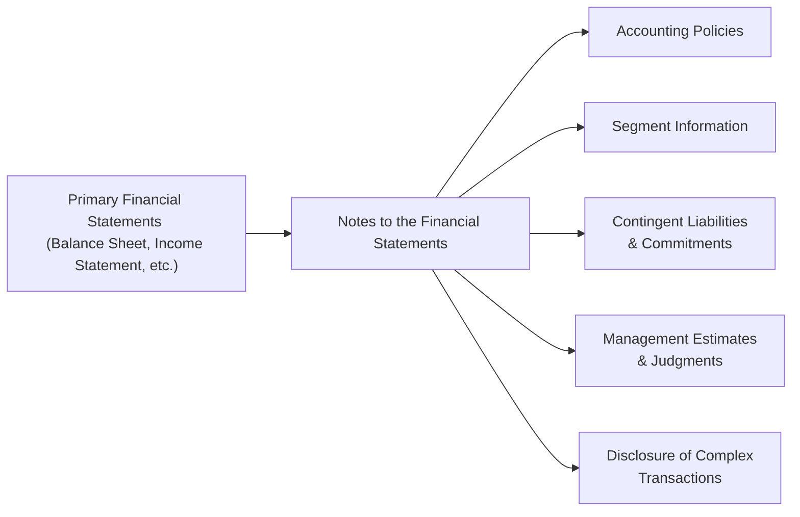

## 9.6 Notes to the Financial Statements

Have you ever skimmed a company’s annual report, glanced at the big numbers in the balance sheet, income statement, or statement of cash flows, and felt a bit uneasy—like you might be missing part of the story? Well, that’s precisely where the Notes to the Financial Statements come in. They’re the sidekick accompaniments to the main financial statements, offering up those crucial behind-the-scenes details that help you really “get” what’s happening under the hood of a business. If the main statements are the headlines, the notes are the investigative articles—they provide the depth, context, and color to ensure that you’re not just seeing the numbers but truly understanding them.

In this section, we’ll dive into what these Notes to the Financial Statements typically include, why they matter, and how you, as a mutual fund representative or an investor, can use them to make better decisions. 

Before we get into the specifics, keep in mind that reading the notes is one of the best ways to gauge the quality, consistency, and risk profile of a company’s financial reporting. This process is not just good practice; it’s critical to ensuring that your advice remains suitable and in line with Know Your Client (KYC) rules (see Chapter 4 and Chapter 17 for more on KYC obligations). 

-----

### The Basics: What Are the Notes to the Financial Statements?

The Notes to the Financial Statements are additional explanations that provide context, detail, and essential information not fully captured in the primary statements (like the Statement of Financial Position (see Section 9.2), Statement of Comprehensive Income (see Section 9.3), etc.). Typically, these notes cover:

• The accounting policies used to prepare the financial statements (for example, how the company recognizes revenue or calculates depreciation).  
• Detailed explanations of particular line items in the statements.  
• Contingent liabilities or lawsuits that can materially affect the company’s future financial health.  
• Segment reporting (for companies that operate in multiple lines of business).  
• Pension plans, share-based compensation details, related-party transactions, and more.  

In essence, the notes help bridge the gap between the raw numbers and the real-world circumstances influencing those numbers. Without them, you could be missing vital clues about a company’s business strategy, risk exposures, and financial health. 

-----

### Why Notes Matter: Unlocking the “Context” Code

So, you might wonder: Do you really need them? Couldn’t we just look at the big numbers on the face of the statements and call it a day? The short answer: absolutely not. Here’s why:

• **Contextual Clarity:** The main statements show you how much inventory a company holds, but the notes might reveal whether that inventory is perishable, subject to obsolescence, or tied to a single supplier arrangement.  
• **Risk Management and Transparency:** The liability section might show a large provision, but the notes clarify that this provision is for an ongoing litigation that may or may not be resolved soon. That is huge for assessing a company’s risk profile.  
• **Regulatory Compliance:** The notes display how a company aligns with current accounting standards, IFRS (International Financial Reporting Standards), or local GAAP (Generally Accepted Accounting Principles in some jurisdictions). Canada follows IFRS for publicly accountable enterprises, so it’s vital to see how companies measure up.  
• **Investor Confidence:** High-quality disclosures in the notes often correlate with better governance, which can bolster investor trust (and hopefully, a more stable share price).  

It’s a bit like going house hunting: you can see a great floor plan from the outside, but you also want to know if there’s any water damage behind the walls. It’s that extra detail that can save you from unwelcome surprises.

-----

### Snapshot: Typical Elements in the Notes

To give you a quick, organized view, let’s lay out the common elements you’d typically find in the Notes to the Financial Statements:

1. **Accounting Policies**  
   This section explains which accounting framework the company uses (most likely IFRS in Canada for public issuers), how revenue is recognized, methods of depreciation, inventory valuation, and more.  

2. **Segment Information**  
   Large, diversified companies often break down their operations into distinct segments (e.g., automotive, financial services, technology). The notes detail each segment’s revenue, profit, and assets so you can see which part of the business is actually driving results.  

3. **Contingent Liabilities and Commitments**  
   Lawsuits, product warranties, or environmental penalties often show up here. If you’re evaluating the potential risk to a mutual fund’s portfolio, these notes help you gauge the likelihood and scale of future claims.  

4. **Management Estimates & Judgments**  
   From how they recognize intangible assets (like patents or licenses) to how they measure credit losses, management will make estimates and judgments that can significantly influence the financials. The notes explain the rationale behind these estimates.  

5. **Disclosure of Complex Transactions**  
   This could involve share-based compensation, pension obligations, derivatives and hedging activities, or related-party transactions. Without these details, you might not understand the real cost of employee stock options or how derivatives are influencing reported income.

-----

### Accounting Policies: The Foundation of Financial Reporting

When you think about financial statements, the numbers don’t appear out of thin air. They’re the product of guidelines set out in accounting frameworks like IFRS. A section in the notes will typically discuss the significant accounting policies the company used. 

• **Significant Accounting Policies**: These are the rules a company chooses within the bounds of accounting standards to record transactions. For instance, a company can measure inventory at lower of cost and net realizable value under IFRS, but there are variations in how cost is determined (FIFO, weighted average, etc.). This is the stuff that can swing reported profits or losses from one period to the next in a major way.

• **Changes in Accounting Policies**: Sometimes, a company changes how it applies certain rules—say they shift from one depreciation method to another. The notes tell you why they did it, how it impacts comparability, and what it means for current and past results. 

For a practical example, I remember the first time I stumbled on a note explaining a change in revenue recognition. The company had started booking revenue earlier in the sales cycle, which instantly made their top line look better. But if you only saw the income statement, you’d assume the company was generating more business. Instead, it was just applying a new policy. That context changed the entire interpretation.

-----

### Contingent Liabilities: What Could Go Wrong?

Contingent liabilities are potential liabilities that might not even appear on the balance sheet if the outcome is uncertain. And without the notes, you might never know these potential obligations exist. Here’s where the concept of a **Contingency** comes in: it’s an event that depends on the outcome of a future event—like a lawsuit that could result in damages.

• **Why It Matters for Mutual Fund Reps**: If a major segment of a company’s business is under legal attack, that could significantly affect future earnings or payouts to shareholders. If the mutual fund you’re handling has a sizable position in this stock, you want to be aware of any big legal storm clouds on the horizon. 

• **Assessing Probability**: The notes often mention the probability of losses (e.g., “probable,” “possible,” or “remote”), along with any estimations of financial impact. These disclaimers may not be perfect, but they give you a benchmark for how seriously you need to take these potential claims.

-----

### Segment Reporting: Zeroing in on Distinct Operations

Many companies operate in more than one business line—think of a conglomerate that has everything from cell phone manufacturing to real-estate development. The segment note often breaks out:

- Revenue by business segment  
- Profit (or loss) by segment  
- Assets and liabilities directly attributable to each segment  

This disaggregation is super helpful. Maybe the real-estate division is tanking while the cell phone business thrives, but if you only looked at the consolidated results, you might think everything is fine or everything is terrible. Segment details let you evaluate each business line on its own merits—for example, one segment might be cyclical whereas another might be more stable. For portfolio managers or mutual fund reps, understanding these distinctions is vital for assessing overall risk and growth potential.

-----

### Complex Transactions: The Devil’s in the Details

Companies undertake all sorts of sophisticated deals—mergers, acquisitions, cross-border joint ventures, or they pay executives using elaborate stock option plans. These can hide or reveal significant value, depending on how the reporting is done.

1. **Share-Based Compensation**: Stock options, restricted share units (RSUs), or performance shares. The notes show you how these arrangements are valued and how they can dilute shareholder value or create future obligations.  
2. **Pension Plans**: Defined-benefit or defined-contribution. The notes usually present the assumptions used, such as discount rates, life expectancy of participants, and expected returns on plan assets. Changes in these assumptions can materially affect the valuation of pension obligations.  
3. **Derivatives and Hedging**: Many firms hedge currency or commodity price risk using derivatives. The notes specify not only the nominal amounts but also the potential risk if the counterparty defaults or if the chosen hedge is not as effective as planned.  

If you’re just glancing at the face of the financials, you might miss a boatload of risk or a potential source of future cash flow. The notes exist precisely to ensure you’re not in the dark about such complexities.

-----

### Prominent Disclosure Standards and Frameworks

In Canada (and globally, for that matter), IFRS sets the tone for disclosures in financial statements. Some resources you might find extremely helpful include:

1. **IFRS Practice Statement on Materiality**: This statement, entitled “Making Materiality Judgments,” helps companies decide what’s truly material so they don’t bombard you with immaterial data. But it also guides them on ensuring they’re not omitting important information.  
2. **SEDAR+**: The publicly accessible system (successor to the old SEDAR), where you can find annual reports from Canadian-listed companies. Browsing a few examples of high-quality notes can be an eye-opener if you’re new to reading them.  
3. **SSRN (Social Science Research Network)**: It contains countless academic papers analyzing disclosure quality, the impact of certain accounting policies, and best practices in financial reporting.  

-----

### Best Practices and Pitfalls in Notes Analysis

• **Be Patient and Thorough**: There’s often a natural temptation to skip or skim the notes because they can be lengthy, repetitive, or too detailed. Don’t shortchange yourself. If you need a deeper look at a question—like how a company is fair-valuing its intangible assets—dig into that specific note.  
• **Look for Management’s Tone**: If the language in the notes is overly defensive or uses a lot of disclaimers, you might suspect something’s not quite right. Alternatively, a high degree of clarity can signal strong corporate governance.  
• **Compare Over Time**: Notes are not static. Keep an eye out for changes from one reporting period to the next. A subtle shift in language can reveal management’s evolving perspective on the company’s future.  
• **Cross-Reference**: The best approach is to read an item in the main statements and then see the explanatory note—this ensures consistency and helps you see if the numbers and the story line up.

-----

### Practical Example: A Lawsuit Disclosure

Let’s do a short hypothetical example. Suppose a technology company, Maple Innovations Inc., is being sued by a competitor for alleged patent infringement. In the liabilities section of Maple’s balance sheet, you might see a line for “Provisions: $1.2 million.” 

Without the notes, that just looks like a normal short-term liability. But maybe the notes reveal:

• Maple’s legal team estimates a 60% likelihood of losing the lawsuit, with potential damages up to $5 million.  
• The $1.2 million provision is a best estimate of the settlement.  
• Maple also faces an injunction risk that could hamper product sales in a key market.

Suddenly, you have a far more nuanced understanding of Maple’s actual risk profile. If you’re weighing whether Maple’s shares are suitable for a balanced mutual fund, these details might sway your decision, or at least prompt you to investigate further (or reduce exposure).

-----

### Relevance to Mutual Fund Representatives

As a mutual fund representative, you’re charged with selecting and recommending funds that line up with your client’s risk tolerance and investment objectives. The underlying holdings of a mutual fund—and the portfolio manager’s selection process—are tied to how stable and transparent a company is. If you don’t understand the “fine print” in a company’s notes, you could be blindsided by hidden liabilities, sudden policy changes, or incomplete revenue recognition methods that inflate the fund’s short-term performance.

Additionally, many mutual funds provide their own sets of notes in semi-annual or annual financial statements. If your client invests in a niche or sector fund, the fund’s notes might detail how they value illiquid securities, how they handle foreign exchange risk, or any derivative exposures. This is crucial for fulfilling your KYC and suitability obligations.

-----

### Glossary

• **Disclosure**: The requirement to present all material information that may influence users’ decisions. Good disclosure fosters trust and reduces the risk of unwelcome surprises.  
• **Significant Accounting Policies**: Methods and assumptions chosen by management that have a material impact on the company’s results (like FIFO for inventory or straight-line for depreciation).  
• **Contingency**: A potential liability (or asset) that depends on the outcome of a future event, such as a lawsuit or regulatory decision.

-----

### Final Thoughts

If the main financial statements are the “front page” of a company’s financial story, the Notes to the Financial Statements are the in-depth articles, interviews, and analyses that give you the real scoop. They show you the how’s, why’s, and what-ifs. By spending some time exploring them, you become better equipped to anticipate challenges, evaluate risks, and offer well-informed recommendations—whether you’re advising someone on a mutual fund or investing on your own account.

So, next time you crack open a financial statement, don’t just rely on the big headlines. Pop over to the notes. Because trust me, that’s often where the most intriguing details lie.  

-----

### Further Resources

• **CIRO** – For the latest regulatory updates in the Canadian investment landscape, visit <https://www.ciro.ca>.  
• **IFRS Practice Statement – Making Materiality Judgments** – Essential for understanding how companies decide what to disclose.  
• **SEDAR+** – Access Canadian public companies’ annual reports: <https://www.sedarplus.ca/>.  
• **SSRN** – Explore academic papers on financial disclosure: <https://www.ssrn.com/>.

-----

## Improve Your Mastery of Financial Disclosures: Notes to the Financial Statements Quiz



### 1. Which element do the Notes to the Financial Statements typically address beyond what appears on the face of the primary statements?

- [x] Complex transactions, accounting policies, and contingent liabilities
- [ ] Revised budget estimates for the next fiscal year
- [ ] Employee headcount and organizational charts
- [ ] Advertising strategies and marketing materials

> **Explanation:** The Notes to the Financial Statements generally include detailed disclosures about complex transactions (e.g., share-based compensation), accounting policies (e.g., revenue recognition), contingent liabilities (e.g., lawsuits), and other info not evident in the primary statements.

---

### 2. Why are contingent liabilities often described in the notes rather than on the balance sheet?

- [x] Because they depend on the outcome of future uncertain events
- [ ] Because they have already been fully paid
- [x] Because management chooses to hide them
- [ ] Because only positive contingencies must be reported

> **Explanation:** Contingent liabilities are uncertain and depend on the outcome of a future event, so they may not meet the criteria for actual recognition as a liability. Although they're not hidden, the full details are often disclosed in the notes rather than recognized on the balance sheet.

---

### 3. What term describes methods and assumptions chosen by management with a material impact on the company's results?

- [x] Significant Accounting Policies
- [ ] Out-of-Scope Procedures
- [ ] Complex Liabilities
- [ ] Subsidiary Requirements

> **Explanation:** Significant Accounting Policies are precisely those methods, rules, and assumptions management adopts when preparing financial statements.

---

### 4. Which of the following is NOT typically included among the Notes to the Financial Statements?

- [x] A list of recommended investing blogs by the CFO
- [ ] Segment reporting for different lines of business
- [ ] Details of share-based compensation
- [ ] Explanations of complex accounting estimates

> **Explanation:** The notes usually address items like segment reporting, share-based compensation, and other accounting estimates. However, personal blog recommendations from the CFO are not a standard disclosure.

---

### 5. Why might the Notes to the Financial Statements discuss an ongoing lawsuit?

- [x] To alert investors to potential contingent liabilities
- [ ] To show how complaints are always dismissed
- [x] Because it doesn't affect the final statements
- [ ] Because it only involves marketing decisions

> **Explanation:** Ongoing lawsuits create contingent liabilities and potential financial risk. The company must disclose these details in the notes so that investors and stakeholders are aware of the future financial implications.

---

### 6. In Canada, publicly accountable companies generally follow which accounting standards?

- [x] IFRS
- [ ] US GAAP
- [ ] Canadian Pension Plan (CPP) rules
- [ ] Sustainability Accounting Standards Board (SASB) exclusively

> **Explanation:** Canadian public companies typically use IFRS (International Financial Reporting Standards) for their financial reporting.

---

### 7. What is the value of segment reporting in the notes?

- [x] It helps identify performance and risk in different business lines
- [ ] It reduces the need for transparency
- [x] It merges financial data into one single figure
- [ ] It is used to disclose the CEO’s personal address

> **Explanation:** Segment reporting breaks down the activities by line of business, allowing readers to see which portions of the company are thriving or struggling.

---

### 8. According to IFRS Practice Statement on Materiality, what is the primary consideration for including information in the notes?

- [x] Whether it could influence the decisions of the statement’s users
- [ ] Whether the CFO likes the formatting
- [ ] Whether it’s the only way to reduce the share value
- [ ] Whether it’s always historically relevant

> **Explanation:** Materiality focuses on whether the omission or misstatement could influence the decisions of the users, making it essential for the notes.

---

### 9. Why should mutual fund representatives pay attention to a company’s Notes to the Financial Statements?

- [x] They provide insights on risks that might affect investments held in a fund
- [ ] They replace the KYC process
- [ ] They allow personal relationships with management
- [ ] They remove the need to read the financial statements

> **Explanation:** For mutual fund reps, understanding the details in the notes helps evaluate the risk and suitability of the underlying investments in a fund portfolio.

---

### 10. True or False: Reading only the main statements (e.g., Income Statement, Balance Sheet) without the notes can lead to an incomplete understanding of the company’s financial health.

- [x] True
- [ ] False

> **Explanation:** The notes often contain crucial disclosures, assumptions, and hidden risk factors necessary for a full understanding of a company’s financial standing.


