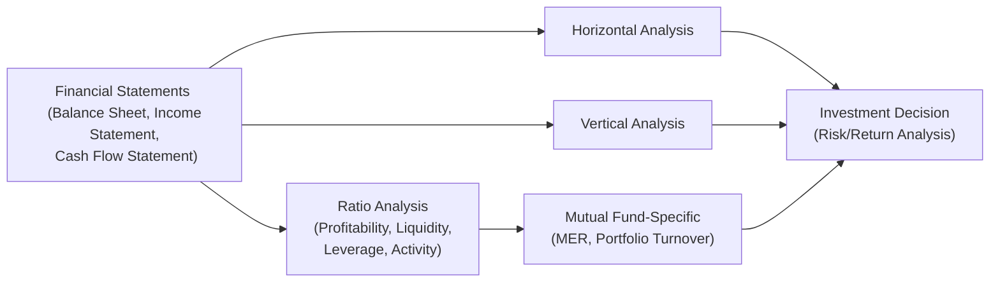

## 9.7 What Is Financial Statement Analysis?

If you've ever sorted through a thick annual report or scrolled through a mutual fund's performance summary and thought, “Um, how do I make sense of all these numbers?”—you’re not alone. Many folks, including finance professionals, sometimes feel overwhelmed when facing endless rows of data in financial statements. But financial statement analysis is about breaking down those seemingly complicated figures into insights you can actually use. It’s that friendly magnifying glass that helps you assess a company’s or mutual fund’s financial stability, its ability to grow, and the risks it faces.

In a nutshell, financial statement analysis examines a firm’s or fund’s balance sheet (Statement of Financial Position), income statement (Statement of Comprehensive Income), and statement of cash flows to create a more robust understanding of its past performance and future prospects. By applying specific tools—horizontal analysis, vertical analysis, and ratio analysis—you can transform raw data into an action plan. These tools also help you notice trends, highlight red flags, and basically tell you when something’s amiss. As a mutual fund representative or an investment advisor, you’ll draw on this knowledge to guide clients toward better-informed decisions, whether they’re choosing a stable income-oriented fund or a riskier—but potentially more rewarding—growth fund.

Below, we’ll explore each analytical approach in detail, look at how they come together, and review how they’re especially relevant in evaluating mutual funds. We’ll also discuss some official Canadian financial regulations and provide references to helpful resources—just to make sure everyone’s on the same page with compliance requirements and best practices.

  
Understanding Financial Statement Analysis  
---------------------------------------

Financial statement analysis goes beyond just reading the numbers you find in a firm’s annual report or a mutual fund’s performance summary. It’s about categorizing, comparing, and interpreting those numbers to get a clearer sense of an organization’s overall health. You've probably heard folks say things like, “Ah, the company’s revenue jumped 20% over the past year,” or “That fund’s Management Expense Ratio (MER) seems too high.” Those comments usually come from applying some form of financial analysis.

Let’s dig deeper into the major tools at your disposal, so you can see how these puzzle pieces fit together.

  
A Closer Look at Horizontal Analysis  
------------------------------------

Horizontal analysis (sometimes called trend analysis) compares specific items over multiple periods to detect growth patterns, seasonal swings, or potential warning signals. Typically, you take an item—like sales revenue or net income—and compare it across two or more years or quarters.

• How it works: You pick a “base period” and compare subsequent periods against that base. For instance, if 2024 is your base year, and you want to check revenue growth in 2025, you’d see how much (in dollars or as a percentage) revenue changed from 2024 to 2025.

• Why it’s useful: Tracking changes lets you quickly spot areas of rapid growth or decline. Say, if a mutual fund’s annual distribution payouts keep dropping each year, that downward trend might indicate deteriorating fund performance or a shift in the fund’s strategy. For corporate issuers, if net income spikes or plummets, you want to see if that’s a sign of operational improvement or the result of a one-time event.

• Personal anecdote: I once reviewed a small tech company’s statements for a potential investment. Horizontal analysis revealed a consistent 10% annual bump in R&D expenses. That alone didn’t discourage me, but it made me dig deeper. Turned out they were expanding their product line, which was actually a positive indicator for future growth (though it temporarily ate into profits).

  
A Closer Look at Vertical Analysis  
----------------------------------

Vertical analysis (often called common-size analysis) looks at each item on a financial statement as a percentage of a base figure—like total assets on a balance sheet or net sales on an income statement. This approach is super handy for comparing companies or funds of different sizes, or for checking how a single company’s or fund’s structure changes over time.

• How it works: Suppose you use net sales (total revenue) as your base. If you see that Marketing Expenses are 15% of net sales, you can quickly compare that ratio to the previous year when it was maybe 10%. The shift says something about how management is allocating resources.

• Why it’s useful: Vertical analysis helps you identify which areas in a company’s operations or a fund’s budgeting hold the greatest weight. If corporate overhead costs suddenly rise from 5% to 12% of sales, might there be inefficiencies creeping in? If a mutual fund’s MER is trending higher when expressed as a percentage of average net assets, you can investigate reasons behind that cost increase.

• Relating to mutual funds: Looking at the cost structure of a fund as a percentage of its assets or revenue can highlight operational issues. A higher MER might mean you’re paying more for management and other fees, which could erode returns over time unless the fund’s performance outweighs those costs.

  
Spotlight on Ratio Analysis  
----------------------------

Ratio analysis is like your Swiss Army knife. You have different blades—profitability ratios, liquidity ratios, leverage ratios, and activity ratios—that slice the data in ways that help you measure performance, risk, and efficiency. Let’s walk through each main category.

Profitability Ratios  
~~~~~~~~~~~~~~~~~~~~
• These ratios indicate how effectively a company is generating profits from its operations and using its assets. Common types include:  
  – Return on Equity (ROE): Net income / Shareholders’ equity  
  – Return on Assets (ROA): Net income / Total assets  

Profitability ratios matter because they give you a sense of whether a company is making enough profit relative to the resources it has. In a mutual fund context, you might look more at metrics like net investment income divided by total fund assets.

Liquidity Ratios  
~~~~~~~~~~~~~~~~
• Liquidity refers to an entity’s ability to meet short-term obligations. Two primary liquidity ratios are:  
  – Current Ratio: Current assets / Current liabilities  
  – Quick Ratio (Acid-Test Ratio): (Current assets – Inventory) / Current liabilities  

High liquidity can mean the company has a robust buffer for rainy days, but too much liquidity might hint that they’re not investing efficiently. With mutual funds, you might consider the fund’s daily or weekly liquidity strategies, especially if it’s an open-end fund promising daily redemptions.

Leverage Ratios  
~~~~~~~~~~~~~~~
• Leverage (or debt) ratios help you evaluate how much of the entity’s financing is provided by creditors versus owners. A classic example is:  
  – Debt-to-Equity Ratio: Total debt / Shareholders’ equity  

This ratio matters if you want to gauge financial risk. Lots of leverage can magnify returns or losses. For a mutual fund, you might look at whether it employs leverage to enhance returns—some specialized funds do, and that can significantly increase risk.

Activity Ratios  
~~~~~~~~~~~~~~~
• Activity ratios assess operational efficiency—how effectively a company manages its assets. Common ones include:  
  – Inventory Turnover: Cost of goods sold / Average inventory  
  – Accounts Receivable Turnover: Net credit sales / Average accounts receivable  

In a mutual fund environment, we often look at portfolio turnover ratio, which indicates how frequently the fund manager buys and sells securities in the fund. If that turnover is extremely high, it might lead to more fees and a bigger tax impact for investors.

  
Financial Statement Analysis in a Mutual Fund Context  
-----------------------------------------------------

Although mutual funds may not have “inventory” in the classic sense, they do manage portfolios of stocks, bonds, or other securities. The fundamental aim remains the same: to figure out if the fund is financially robust, if it aligns with your client’s objectives, and if the operational costs (like the MER) are justified by the returns.

• Management Expense Ratio (MER): Expressed as a percentage of a fund’s average net assets, the MER includes management fees and other expenses. A higher MER can eat into returns, so you’ll want to compare it against similarly styled funds.  
• Portfolio Turnover Ratio: Reveals how actively the fund manager is trading within the portfolio. Frequent trading might (in some market conditions) boost returns, but it also might result in higher transaction costs and potential tax consequences.  

For those of you going through the Conduct and Practices Handbook Course (CPH®) or reviewing regulatory standards from CIRO (https://www.ciro.ca/), understanding these mutual fund metrics is a crucial part of giving suitable advice and meeting your KYP (Know Your Product) responsibilities.

  
Real-World Illustrations and a Simple Mermaid Diagram  
-----------------------------------------------------

Imagine you have two different funds in front of you: Fund A and Fund B. Both are balanced funds investing in a mix of equities and fixed-income instruments. Fund A has an MER of 1.5% and a portfolio turnover ratio of 25%. Fund B has an MER of 2.3% and a turnover ratio of 80%. At first glance, you might be inclined to lean toward Fund A because of its lower costs. But you might also wonder: “Is Fund B’s higher turnover ratio giving it a performance edge in certain market cycles, justifying—and maybe even surpassing—the extra cost?”

To visualize how these metrics all connect, here’s a quick Mermaid diagram showing the flow of relevant factors:

In this diagram, you see that all the fundamental statements (in Node A) feed into the three main analysis techniques: horizontal, vertical, and ratio analysis. Ratio analysis then branches into mutual fund–specific metrics. Ultimately, all these analyses come together to guide you toward a more informed investment decision.

  
Potential Pitfalls and Best Practices  
-------------------------------------

• Overreliance on Historical Data: Horizontal analysis uses trends from the past. It’s great for identifying patterns, but remember that past performance might not guarantee future outcomes.

• Misuse of Ratios in Isolation: A single ratio rarely tells the whole story. If the debt-to-equity ratio is high, but the company has stable cash flows and a strong track record of servicing debt, it may still be a reasonable investment.

• Ignoring Qualitative Factors: Financial analysis is mostly numbers, but you can’t overlook elements like management quality, brand strength, or macroeconomic conditions.

• Adjusting for One-Time Events: Make sure you parse out unusual or one-off items (like restructuring charges) that can skew your analysis. In mutual funds, check for performance fees triggered by short-term spikes.

• Keeping Current with Regulations: Because regulations change over time, you want to keep an eye on updated rules from CIRO, the Canadian Securities Administrators (CSA), and other relevant authorities.

  
Regulatory Considerations  
-------------------------

Within Canada’s regulatory framework, the Canadian Investment Regulatory Organization (CIRO) oversees investment dealers and mutual fund dealers. It replaced the Mutual Fund Dealers Association (MFDA) and the Investment Industry Regulatory Organization of Canada (IIROC) as of January 1, 2023. When you provide advice to clients as a mutual fund representative, you’re bound by CIRO’s conduct and disclosure requirements, which include ensuring that your recommendations are suitable and in line with your client’s profile.

Also relevant are rules and guidelines laid out in National Instrument 81-101 by the Canadian Securities Administrators (CSA). This instrument spells out the type and quality of information that must be disclosed in a mutual fund’s simplified prospectus. That includes details regarding the fund’s MER, fees, risks, and investment strategies—all key components in your financial analysis.

Remember that the Canadian Investor Protection Fund (CIPF) is now the sole investor protection fund, after it merged with the former MFDA IPC. Although CIPF is independent of CIRO, it adds a safety net for eligible client assets if a member firm becomes insolvent. This environment ensures that investors dealing with a CIRO-regulated firm have some level of protection, though it doesn’t guarantee elimination of investment risk.

  
Helpful Resources  
-----------------

If you want to expand your knowledge of financial statement analysis (especially from a practical standpoint), you might check out:

• CIRO’s Official Website:  
  https://www.ciro.ca/  
  Features guidance on performance reporting and client statements, among other resources.

• CSA’s “National Instrument 81-101”:  
  https://www.securities-administrators.ca/  
  Provides details on the required disclosure for mutual fund prospectuses.

• “Analysis for Financial Management” by Robert C. Higgins:  
  A worldwide classic that dives deep into ratios, cash flow analysis, and advanced financial topics.

• Open-Source Financial Tools & Communities:  
  Websites like GitHub have open-source libraries in Python or R for ratio calculations. These can automate complex tasks, letting you focus more on interpretation.

  
Conclusion  
----------

Financial statement analysis might sound daunting at first, but once you get the hang of horizontal analysis, vertical analysis, and ratio analysis, it becomes second nature—sort of like learning to navigate a new city. You quickly figure out where the big landmarks are (revenue, net income, best-performing asset classes) and how to avoid pitfalls (excessive leverage, high costs, unexplained anomalies).

For mutual fund representatives, applying these analytical tools is a must. It helps you figure out if a fund’s expense ratios or turnover metrics support its performance claims, enabling you to guide your clients toward funds that truly fit their risk tolerance and investment goals. When combined with the knowledge of CIRO regulations and the best practices covered in the rest of this chapter (and throughout this book), you’ll be well-positioned to recommend suitable, informed choices for your clients.

Think of it this way: financial statements are like the storyline of a company or a fund—financial analysis is the literary critique that fleshes out the characters, plot twists, and theme. The more fluent you become in this language, the better you can serve your clients, ensuring their financial decisions rest on a bedrock of solid understanding rather than guesswork.

  
## Test Your Knowledge: Financial Statement Analysis Essentials Quiz



### Which method of analysis compares changes in specific financial statement items over multiple periods?

- [ ] Vertical analysis
- [x] Horizontal analysis
- [ ] Ratio analysis
- [ ] Activity analysis

> **Explanation:** Horizontal analysis (also called trend analysis) focuses on comparing figures over two or more periods to identify trends and changes in specific items such as revenue or expenses.

### What does vertical analysis typically express on a financial statement?

- [ ] Line items as dollar amounts
- [x] Line items as a percentage of a base figure (e.g., total assets or net sales)
- [ ] Line items as a ratio to equity
- [ ] Line items as an absolute year-over-year increase

> **Explanation:** Vertical (or common-size) analysis looks at each line item as a percentage of a larger figure in the same period (like total sales), making it easier to compare companies or funds of different sizes.

### Which ratio category focuses on how effectively an entity earns profits?

- [x] Profitability ratios
- [ ] Leverage ratios
- [ ] Liquidity ratios
- [ ] Activity ratios

> **Explanation:** Profitability ratios, such as ROE or ROA, assess how well a company converts its resources and sales into net income.

### A mutual fund’s MER (Management Expense Ratio) is generally expressed as:

- [ ] A ratio of total liabilities to total assets
- [x] A percentage of the fund’s average net assets
- [ ] A ratio of net income to shareholders’ equity
- [ ] A ratio of current assets to current liabilities

> **Explanation:** The MER shows the total annual fees and expenses incurred by a mutual fund, reflected as a percentage of the fund’s average net assets.

### Which of the following is a leverage ratio?

- [x] Debt-to-Equity
- [ ] Current Ratio
- [x] Debt-to-Equity is correct
- [ ] Inventory Turnover

> **Explanation:** Debt-to-Equity evaluates how much of a company’s financing comes from debt as opposed to shareholders. Current Ratio is a liquidity ratio, and Inventory Turnover is an activity ratio.

### Why might you be cautious about solely relying on horizontal analysis?

- [ ] It offers predictive insights into future market trends.
- [x] It is based primarily on historical data and may not guarantee future performance.
- [ ] It focuses only on internal company data.
- [ ] It requires specialized accounting software.

> **Explanation:** Horizontal analysis looks at historical trends. Past performance is not always indicative of future results, so it’s important to consider other factors (like market conditions and management changes).

### Which ratio provides insight into how efficiently a company manages its assets?

- [x] Activity ratio
- [ ] Profitability ratio
- [x] Activity ratio is correct
- [ ] Leverage ratio

> **Explanation:** Activity ratios (like the inventory turnover or receivables turnover) measure how efficiently a company turns resources (inventory or receivables) into sales or cash.

### If a mutual fund’s turnover ratio is very high, what potential downside should you be aware of?

- [ ] Higher liquidity requirements
- [ ] Lower fees for the investor
- [x] Higher transaction costs and potential tax consequences
- [ ] Higher management quality

> **Explanation:** A high turnover ratio can result in more frequent trading, which might increase transaction costs and tax implications for investors.

### What is the main advantage of vertical analysis when comparing two companies of different sizes?

- [x] It standardizes financials by expressing line items as percentages, making comparisons more meaningful.
- [ ] It allows for quick detection of absolute changes in revenue.
- [ ] It calculates the growth rate of net income over time.
- [ ] It reveals a company’s current liquidity position.

> **Explanation:** By converting each item into a percentage of a base figure, vertical analysis helps compare the relative weight of each line item across companies that differ in scale.

### In Canada’s current regulatory landscape, which body oversees both investment dealers and mutual fund dealers?

- [x] CIRO (Canadian Investment Regulatory Organization)
- [ ] IIROC (Investment Industry Regulatory Organization of Canada)
- [ ] MFDA (Mutual Fund Dealers Association)
- [ ] CIPF (Canadian Investor Protection Fund)

> **Explanation:** Effective January 1, 2023, the Mutual Fund Dealers Association of Canada (MFDA) and the Investment Industry Regulatory Organization of Canada (IIROC) amalgamated into the Canadian Investment Regulatory Organization (CIRO). IIROC and MFDA remain historical references only.


