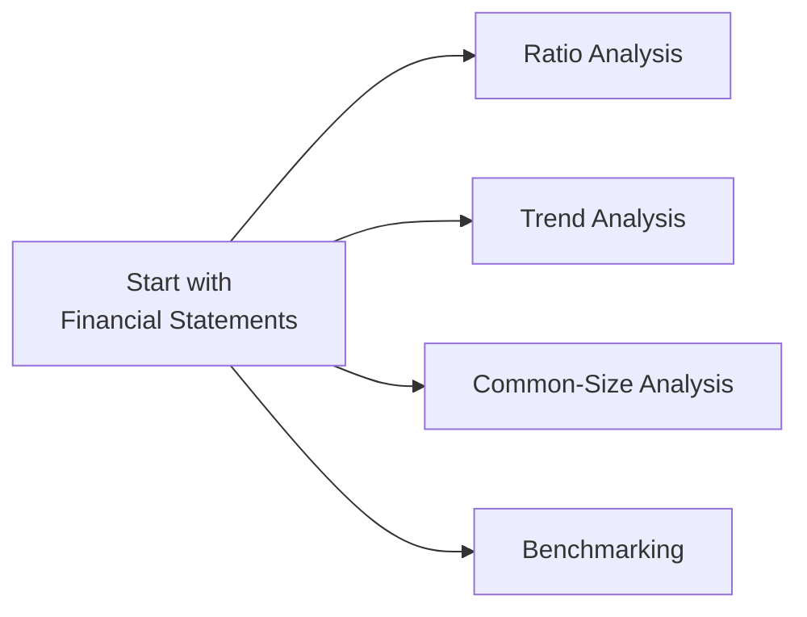

## 9.8 Financial Statement Analysis

Financial statement analysis is one of those topics that can seem a bit daunting—especially if you’re unsure where to begin. I remember my own initial foray into analyzing balance sheets and income statements. Staring at those rows of numbers, I felt like I was deciphering a secret code. If you’ve been there, trust me, you’re not alone. The good news is, once we understand the basic building blocks—like ratios, trends, and common-size comparisons—the entire process gets a lot more approachable.

And let’s be honest: for mutual fund representatives and other finance professionals, being able to parse and interpret financial statements is crucial. Maybe you’re looking at the fundamentals of a company that’s heavily weighted in a particular mutual fund, or you’re evaluating an issuer’s ability to pay its debts when dealing with certain fixed-income products. In either scenario, the goal is the same: you want to draw meaningful insights from a company’s raw data—namely, its financial statements—to ensure you’re making informed recommendations.

Below, we’ll walk through the core methods you’ll use in financial statement analysis: ratio analysis, trend analysis, common-size analysis, and benchmarking. We’ll then explore how these tools work in practice, how they align with Canadian regulatory frameworks, and how you might deploy them in a real-world setting.

---

### Why Financial Statement Analysis Matters

Think of financial statements as the “stories” companies tell about their performance and stability. By analyzing them, you’re effectively reading that story and deciding if it’s a fairytale or a tragedy. For mutual fund sales representatives, the story’s moral often guides whether to hold, buy, or sell particular securities, or perhaps switch clients into different funds that better match their objectives and comfort with risk.

For instance, you might discover that a firm’s profitability is trending downward over several quarters. That might be okay if they’re investing heavily in research and development to spur future growth; it might not be okay if the company’s simply hemorrhaging cash because of a saturated market. The numbers give you those critical clues.

---

### Approaches to Financial Statement Analysis

Financial statement analysis can be broken down into several interlinked approaches. Let’s use a quick diagram to visualize these approaches and how they connect:

Each approach answers a different question:

• Ratio Analysis: “How liquid, profitable, leveraged, or efficient is this company?”  
• Trend Analysis: “Are things getting better, worse, or staying the same over time?”  
• Common-Size Analysis: “How do items scale relative to a base figure, like total assets or revenue?”  
• Benchmarking: “How does this company stack up against peers or an industry standard?”

---

### Digging into Ratio Analysis

Ratio analysis is one of the most popular ways to quickly assess financial health. Ratios distill reams of data into neat relationships you can easily compare across time periods or against competitors. Common ratio categories include liquidity, profitability, leverage, and efficiency.

#### Liquidity Ratios
Liquidity ratios measure a company’s ability to meet its short-term obligations. Two popular ones are:

• Current Ratio: (Current Assets) ÷ (Current Liabilities)  
• Quick Ratio: (Current Assets – Inventory) ÷ (Current Liabilities)

If either ratio is too low, the firm might struggle to pay its bills. If it’s too high, the company could be missing out on opportunities by holding too many idle assets.

#### Profitability Ratios
Profitability ratios focus on how effectively a company converts sales into profit.

• Profit Margin: The portion of revenue that ends up as net income.  
  Mathematically:  
  $$
  \text{Profit Margin} = \frac{\text{Net Income}}{\text{Revenue}} \times 100\%
  $$  
  A higher profit margin typically suggests strong pricing power or cost control—always a good sign.

• Return on Equity (ROE): Net Income ÷ Average Shareholders’ Equity  
  ROE reveals how effectively the company uses its shareholders’ funds to generate returns. Keep in mind that a high ROE can sometimes result from leverage, which may or may not be a good thing depending on the company’s broader context.

#### Leverage Ratios
Leverage ratios show the extent to which a company uses borrowed funds.

• Debt-to-Equity: (Total Debt) ÷ (Total Equity)  
  A high ratio suggests heavier reliance on debt, which amplifies returns (and risks) if the company’s investments pan out.

#### Efficiency Ratios
Efficiency ratios gauge how effectively the company uses its assets to generate revenue. 

• Asset Turnover: (Revenue) ÷ (Average Total Assets)  
  A higher asset turnover indicates efficient use of assets. But remember, some capital-intensive industries (e.g., utilities) naturally have lower asset turnover compared to service-based industries.

---

### Observing Trends Over Time

Ratio analysis becomes infinitely more powerful when viewed over multiple periods. One year of sky-high profitability doesn’t mean much if it drops dramatically the following year. That’s where trend analysis comes in—looking at financial metrics over, say, a three- to five-year window.

If you see the current ratio gradually climbing, you might reasonably conclude the company is becoming more liquid. Or if the profit margin is on a downward slope, you might suspect rising costs. One of my colleagues used to say, “Numbers by themselves can lie; numbers over time tell the truth.” This is the essence of trend analysis.

---

### Common-Size Analysis

Have you ever tried comparing two companies with drastically different sizes—like a massive national corporation versus a tiny local firm? Straight-up comparing their raw numbers won’t make much sense. That’s where common-size analysis comes in handy. 

In a common-size income statement, each line item is expressed as a percentage of revenue. On a common-size balance sheet, each line item is expressed as a percentage of total assets. This levels the playing field for companies of varying sizes. 

For instance, if Company A has a profit margin of 15% and Company B has 10%, you can see that A retains more profit for every dollar of revenue. Similarly, if you notice that Company A invests 5% of revenue into research and development (R&D), but Company B invests 1%, you can glean a sense of how each company is prioritizing future innovation.

---

### Benchmarking: Comparing Against Industry Peers

If you’ve ever tried to see how you measure up by comparing your athletic performance to your friends or a local club, you know the principle of benchmarking. In finance, a benchmark could be:

• An industry average (e.g., average profit margin in the consumer goods sector).  
• A leading competitor or peer group average.  
• A broader market index, depending on the type of data you’re examining.

Sometimes, a mutual fund might highlight how its returns compare to a recognized index. Similarly, you can see how a particular stock’s performance measures up to its peer group. If the firm’s margins or growth rates lag behind those of similar companies, it’s a signal to ask “why?”

---

### Putting It All Together

When you combine ratio, trend, common-size analysis, and benchmarking, you get a comprehensive picture of a company’s strengths, weaknesses, opportunities, and threats. Let’s illustrate this with a quick hypothetical scenario:

#### A Quick Case Study: Maple Leaf Maple Syrup Inc.

Imagine Maple Leaf Maple Syrup Inc. has the following metrics for the past two years:

• Profit Margin: 12% (Year 1), 10% (Year 2)  
• ROE: 18% (Year 1), 15% (Year 2)  
• Current Ratio: 1.6 (Year 1), 1.2 (Year 2)  
• Debt-to-Equity: 0.8 (Year 1), 1.0 (Year 2)  

At a glance:
• Profitability is trending down (both profit margin and ROE).  
• Liquidity is also declining (current ratio dropping).  
• Leverage is increasing (debt-to-equity rising).  

By performing common-size analysis, you discover that Maple Leaf Maple Syrup Inc. spent more on cost of goods sold (as a % of sales) and more on interest (as a % of revenue) in Year 2. You benchmark against a peer group and notice their profit margins are around 13%–14%. Maple Leaf Maple Syrup now appears below average and is becoming more leveraged. You might wonder if they’re investing in a big expansion (potentially good in the long run) or if they’re simply struggling to stay afloat (definitely not good).

This example underscores why analyzing the underlying numbers is so vital. As a mutual fund representative, you might have a fund that holds Maple Leaf Maple Syrup Inc. If the downward trend persists, it might be time to talk with your client or portfolio manager about rebalancing or monitoring the fund more closely.

---

### Application in Mutual Fund Analysis

Mutual fund representatives are often tasked with recommending or reviewing funds that hold dozens or even hundreds of underlying securities. While you won’t be conducting exhaustive statement analysis on every single company held by a large equity fund (that’s typically the portfolio manager’s job), understanding how to interpret the fund manager’s decisions via the lens of these analyses is critical.

• You might see a fund fact sheet pointing to strong revenue growth in the consumer staples sector. You can apply your knowledge of ratio analysis to see whether the companies within that sector actually show improving margins or healthy ROEs.  
• For fixed-income funds, analyzing an issuer’s leverage ratio and interest coverage ratio can help gauge default risk.  

Remember, these insights all feed into the Know Your Client (KYC) process. If your client has a low tolerance for high-risk ventures, you might guide them toward funds that show stable, consistent improvements in profitability and manageable debt levels.

---

### Regulatory Context in Canada

In Canada, each company trading on public markets must follow continuous disclosure obligations set by the Canadian Securities Administrators (CSA). That means companies must regularly file financial statements, management discussion and analysis (MD&A), and other documents that allow investors to stay informed of their financial condition.

Mutual funds also have to meet strict disclosure requirements, including simplified prospectuses and Fund Facts documents. Representatives can (and should) leverage these documents to conduct or validate their financial statement analyses, ensuring their recommendations align with clients’ objectives.

The Canadian Investment Regulatory Organization (CIRO) oversees the regulation of investment dealers and mutual fund dealers, ensuring they abide by compliance standards regarding disclosure, transparency, and the overall suitability of recommendations. You can find more info at [CIRO’s website](https://www.ciro.ca).

---

### Leveraging Tools and Resources

It’s one thing to understand these principles conceptually; it’s entirely another to handle them in practice. Fortunately, technology has made the analytical process simpler and faster:

• Online Calculators: CPA Canada often provides free tools to evaluate basic ratios.  
• Open-Source Libraries: Python libraries like pandas, NumPy, and SciPy streamline the process of calculating ratios and plotting trends instantly.  
• Industry Publications: The “Analysis of Financial Statements” by Leopold A. Bernstein is an excellent foundational text, full of clear examples of ratio and trend analysis.

If you’re ever feeling swamped by all the data, start small. Pick a specific ratio or metric—maybe the debt-to-equity ratio—and track it over a few reporting periods. It’s amazing how focusing on one data point can provide clarity about a company’s direction. Then expand from there.

---

### Real-World Tips and Best Practices

• Always Look in Context: Ratios can be misleading if you isolate them. Profit margin, for instance, needs to be evaluated alongside cost trends, industry averages, and potential expansions in a company’s near future.  
• Don’t Overlook the MD&A: Management’s Discussion and Analysis often provides color on unusual spikes or dips in certain financial metrics. It’s a good place to understand *why* changes happen.  
• Watch Earnings Calls and Updates: Publicly traded companies often hold quarterly earnings calls. Summaries of these calls can provide insight into management’s outlook and highlight key financial statement changes.  
• Combine Quantitative and Qualitative Data: Financial statements are heavily numerical, but remember to integrate industry news, product developments, and overall economic conditions.  
• Revisit Regularly: A once-and-done approach to analysis can lead to outdated conclusions. Markets change, consumer preferences shift, and corporate strategies evolve.

---

### Common Pitfalls

• Over-Reliance on a Single Ratio: Using just the current ratio or just ROE to make an investment decision is like picking a restaurant based only on dessert quality. You need a more balanced view.  
• Focusing on Short-Term Variations: Sometimes, short-term dips or spikes are anomalies. Trend analysis helps you see through the noise.  
• Ignoring Off-Balance-Sheet Items: Check for details in financial notes. Some companies have large off-balance-sheet obligations (e.g., lease commitments) that significantly affect overall risk.  
• Mismatched Benchmarks: If you benchmark a consumer goods company against a high-tech SaaS company, the comparison might not be valid.

---

### A Simple Visual Example With Ratios

Let’s lay out a basic flowchart to show a possible approach to analyzing a company, from collecting statements to making a recommendation:

This process helps ensure you don’t miss critical steps—especially if you’re juggling multiple clients or multiple securities at once.

---

### Conclusion

Financial statement analysis is at the heart of making smart investment recommendations. By pairing ratio analysis with trend views, common-size comparisons, and relevant benchmarks, you’ll uncover a company’s true financial narrative. For mutual fund representatives, these insights inform which mutual funds, segments, or products best align with a client’s goals and risk tolerance.

At the end of the day, numbers from the balance sheet or income statement aren’t just numbers. They’re stories—stories about growth, risk, innovation, or sometimes decline. And your job is to read that story carefully, interpret it correctly, and help your clients navigate it confidently.

---

### Further References and Resources

• Bernard, L. A. (latest edition). “Analysis of Financial Statements.”  
• Canadian Securities Administrators (CSA) for corporate disclosure requirements and investor materials.  
• [CIRO Website](https://www.ciro.ca) for up-to-date regulatory news and standards on investment dealers and mutual fund dealers.  
• [CPA Canada](https://www.cpacanada.ca) for online ratio calculators and best-practice accounting guidelines.  
• Python Libraries (e.g., pandas, NumPy) for powerful open-source data analysis—handy for building your own financial models.

Remember, effective financial statement analysis is like shining a spotlight on a company’s situation. Once the facts are clearly illuminated, you can make reasoned decisions that keep your clients’ best interests at heart.

---

## Test Your Knowledge: Financial Statement Analysis for Canadian Investors



### Which of the following best describes the main purpose of financial statement analysis?  
- [ ] To replace regulatory reporting requirements  
- [x] To evaluate a company’s performance and trends for better investment decisions  
- [ ] To ensure companies comply with tax regulations only  
- [ ] To strictly compare two rival companies without any additional context  

> **Explanation:** Financial statement analysis revolves around evaluating a company’s performance, identifying trends, and aiding investment decisions—whether for equity, debt, or mutual fund holdings.

---

### When performing ratio analysis, which of the following ratio categories is primarily focused on a company’s short-term obligations?  
- [ ] Profitability  
- [ ] Leverage  
- [x] Liquidity  
- [ ] Efficiency  

> **Explanation:** Liquidity ratios (like the current ratio and quick ratio) measure a company’s ability to meet short-term obligations as they come due.

---

### In common-size analysis of an income statement, each line item is typically expressed as a percentage of:  
- [x] Revenue  
- [ ] Total liabilities  
- [ ] Net income  
- [ ] Total equity  

> **Explanation:** Common-size analysis for an income statement expresses each line item (such as cost of goods sold or operating expenses) as a percentage of total revenue, making it easier to compare different-sized companies.

---

### Benchmarking a company’s financial ratios primarily involves comparing them:  
- [ ] Only to the company’s historical averages  
- [ ] Exclusively against predicted future projections  
- [x] Against industry peers or recognized standards  
- [ ] With ratios from different, unrelated industries  

> **Explanation:** Benchmarking compares a company’s performance with that of peers in the same industry or with recognized standards, revealing whether the company is outperforming, underperforming, or simply in line with its competitors.

---

### Which statement best reflects a core insight gained from trend analysis?  
- [x] It reveals whether the company’s performance is improving, declining, or holding steady over time  
- [ ] It measures how the company stacks up against peers in a single point in time  
- [x] It helps identify patterns or warning signs that may not be evident from one period’s results alone  
- [ ] It eliminates the need to examine qualitative factors  

> **Explanation:** Trend analysis looks at multiple reporting periods to identify a pattern or trajectory in financial performance, which can help investors spot growth opportunities or emerging risks.

---

### What is Return on Equity (ROE) a measure of?  
- [x] A company’s ability to generate profits per dollar of shareholders’ equity  
- [ ] A measure of how accurately the company forecasts future profitability  
- [ ] A direct measure of the company’s liquidity position  
- [ ] A method for quantifying how well a company manages its overhead  

> **Explanation:** ROE evaluates how effectively shareholders’ equity is employed to generate profits, so a high ROE typically indicates efficient use of equity capital, although it can also be driven by high leverage, which carries risk.

---

### Which resource primarily dictates the continuous disclosure obligations that companies in Canada must meet?  
- [x] The Canadian Securities Administrators (CSA)  
- [ ] The Canadian Investor Protection Fund (CIPF)  
- [ ] The Toronto Stock Exchange (TSX)  
- [x] The defunct MFDA  

> **Explanation:** Continuous disclosure obligations are primarily overseen by the CSA, ensuring that companies regularly file updated financial statements and MD&A, maintaining transparency for investors. (Note: The MFDA is a historical self-regulatory body that merged into CIRO.)

---

### Which item is most likely to be found in the Management Discussion and Analysis (MD&A) section rather than on the financial statements?  
- [x] Explanations for unusual variances or strategic developments  
- [ ] The company’s total revenue for the fiscal year  
- [ ] The company’s total assets on the balance sheet  
- [ ] Calculations of basic and diluted earnings per share  

> **Explanation:** The MD&A often provides the narrative behind the numbers, explaining material changes, strategic direction, and other qualitative insights you won’t typically see in raw financial data.

---

### Which of the following is an example of a leverage ratio?  
- [ ] Asset Turnover  
- [ ] Current Ratio  
- [x] Debt-to-Equity  
- [ ] Profit Margin  

> **Explanation:** Debt-to-Equity compares a company’s total debt to shareholders’ equity, indicating the degree of financial leverage in the company’s capital structure.

---

### Trend analysis looks at financial statement data across multiple reporting periods. True or False?  
- [x] True  
- [ ] False  

> **Explanation:** Trend analysis involves comparing financial data—like revenue, expenses, and ratios—across several periods to discern patterns, whether upward growth or downward pressure.


