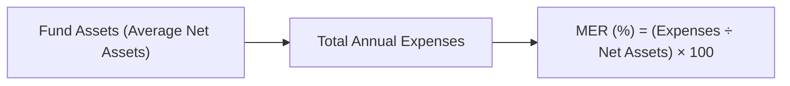

## 9.9 Basic Financial Ratios and Key Performance Indicators (KPIs) for Funds

If you’ve ever chatted with a friend who’s super into mutual funds—maybe they casually drop terms like "Sharpe Ratio" or "Beta"—it can feel intimidating. But trust me, understanding these metrics isn’t just for finance gurus. In this section, we’ll break down the fundamental financial ratios and KPIs relevant to funds in a friendly, step-by-step way.

Before we dive in, recall that we covered how to read and interpret financial statements in Section 9.8. Now, we’ll focus on specific calculations and indicators that help measure a mutual fund’s overall performance, fees, and risk. From the Management Expense Ratio (MER) to advanced risk metrics like Alpha and Beta, these yardsticks will help you (and your clients) make more informed decisions. So, let’s dig in.

--------------------------------------------------------------------------------
  
### Why Do Ratios and KPIs Matter for Mutual Funds?

Think of a mutual fund as a big basket of investments managed by professionals. Sure, you can look at the price or net asset value (NAV) and get a sense of how it’s doing. But to truly understand what’s going on under the hood, you need more diagnostic tools. That’s where financial ratios and Key Performance Indicators (KPIs) fit in.

Ratios like the MER or the Portfolio Turnover Ratio (PTR) can help you see:
• How much you’re paying in fees every year.  
• How frequently the fund manager is buying or selling investments.  
• How much risk the fund manager is taking to earn returns.  

By combining these with other metrics like Alpha, Beta, or Sharpe Ratio, you can figure out if the fund’s performance is all it’s cracked up to be—and if it’s meeting the objectives you’ve set for your client under Know Your Client (KYC) guidelines.

--------------------------------------------------------------------------------

### Management Expense Ratio (MER)

#### Definition and Importance
The Management Expense Ratio (MER) is arguably the most commonly discussed metric among mutual fund investors. It represents the total annual expenses of a mutual fund—this includes management fees, operating costs, some taxes, and other fees—expressed as a percentage of the fund’s average net assets.

An MER of 2% means that for every $100 you invest in the fund, $2 goes toward covering those expenses each year. Over time, these fees reduce your net returns, which is why they get so much attention.

#### How MER is Calculated

Let’s imagine a simplified scenario. Suppose a mutual fund has:
• $500 million in average net assets this year.  
• $10 million in total annual expenses.  

The MER would be:
  
MER = (Total Annual Expenses / Average Net Assets) × 100  
= ($10 million / $500 million) × 100  
= 2%

#### Visual Example (Mermaid Diagram)

The box at the far right (C["MER (%) = (Expenses ÷ Net Assets) × 100"]) sums up the formula used in the calculation. The funds funnel resources into fees and expenses, which then get divided by the total net assets to arrive at the MER.

#### Why It Matters
• High MER: The fund might be actively managed with higher trading costs, marketing fees, or more complex strategies.  
• Low MER: Often seen in passively managed funds (like many index funds), meaning potentially lower costs and possibly higher net returns for investors if performance remains consistent.

In Canada, regulatory bodies like the Canadian Investment Regulatory Organization (CIRO) and the Canadian Securities Administrators (CSA) require mutual funds to clearly disclose MERs in Fund Facts documents so investors know what they’re paying.

--------------------------------------------------------------------------------

### Portfolio Turnover Ratio (PTR)

#### Definition and Importance
The Portfolio Turnover Ratio (PTR) tells you how often the fund manager changes the fund’s holdings within a year. If a fund has a PTR of 100%, that implies its entire portfolio was bought and sold once in that period. A 20% turnover ratio, in contrast, suggests a more “buy-and-hold” approach.

#### Calculation Example

Portfolio Turnover Ratio can be calculated with a formula like:
  
PTR = (Value of Securities Sold or Purchased, whichever is less / Average Net Assets) × 100

Let’s say a manager sells $300 million worth of securities during the year and buys $250 million, and the fund’s average assets are $500 million. Then the lesser of 300 and 250 is 250:

PTR = (250 / 500) × 100  
= 50%

#### Practical Insights
• High PTR: Can indicate an active trading strategy, which might lead to higher transaction costs and potential capital gains distributions.  
• Low PTR: Suggests the manager is maintaining positions more consistently, which may lower costs in the long run (but doesn’t guarantee higher returns).

--------------------------------------------------------------------------------

### Yield and Distribution Rates

#### Definition and Importance
Funds often distribute income from dividends, interest revenue, or capital gains back to unitholders. The yield or distribution rate shows how much income the fund pays relative to its price or NAV. For investors who rely on steady income—like retirees—knowing the yield is key.

#### How It’s Calculated
For instance, if a mutual fund’s NAV is $20 per unit and it pays $1 in annual distributions per unit, the yield would be:

Yield = (Annual Distributions / NAV) × 100  
= ($1 / $20) × 100  
= 5%

#### Additional Considerations
• Dividend vs. Interest Yield: Some funds focus on dividends (equities) or interest (bonds).  
• Tax Impact: Distribution income can have various tax implications. (See Chapter 6 on Tax and Retirement Planning for more details.)

--------------------------------------------------------------------------------

### Sharpe Ratio

#### What is the Sharpe Ratio?
The Sharpe Ratio is a classic measure of risk-adjusted return. It takes the fund’s excess return (beyond the risk-free rate, often proxied by government T-bills) and divides it by the fund’s standard deviation of returns.

Sharpe Ratio = (Fund Return ‒ Risk-Free Rate) ÷ Standard Deviation of the Fund

• Fund Return: This could be an annualized rate of return.  
• Risk-Free Rate: Often something like 1- or 3-month T-bills.  
• Standard Deviation: Measures the volatility of the fund’s returns.  

#### Interpretation
• A higher Sharpe Ratio means the fund generates more return per unit of risk.  
• A lower Sharpe Ratio means the fund is not being adequately compensated for the amount of volatility it experiences.

If a fund’s Sharpe Ratio is 1.2 while another’s is 0.8, the first fund is generally considered better on a risk-adjusted basis—though other factors like the fund’s investment objectives and style still matter.

--------------------------------------------------------------------------------

### Alpha and Beta

#### Breaking Down Alpha (α)
“Alpha” refers to how much a fund outperforms (or underperforms) a benchmark after adjusting for market-related movements. If your fund has an Alpha of +2%, it suggests the manager did 2% better than what you’d expect based on the fund’s inherent market risk, captured by Beta.

• Positive Alpha: The manager added value beyond general market movements.  
• Negative Alpha: The fund underperformed relative to the risk level taken.

#### Beta (β): Measuring Market Risk
Beta measures a fund’s volatility compared to a benchmark or the market. A Beta of 1.0 means the fund’s returns move in line with the market. A Beta above 1.0 means the fund is more volatile than the market; below 1.0 suggests less volatility.

#### Example
If a fund’s Beta is 1.2, the fund’s value tends to move 20% more than the market for any given market movement, all else being equal. For instance, if the market index goes up 10%, the fund might be expected to rise about 12%—but of course, there are many other factors at play.

--------------------------------------------------------------------------------

### Tracking Error

Although not always highlighted as frequently as Alpha or Beta, Tracking Error is quite important if you’re advising on index-oriented strategies or funds that aim to closely mirror a specific benchmark.

Tracking Error = Standard Deviation of (Fund Return – Benchmark Return)

• Lower Tracking Error: The fund is staying close to its benchmark’s return.  
• Higher Tracking Error: The fund’s performance is diverging more from the benchmark.

Index funds, for example, strive for a very low Tracking Error because their goal is simply to replicate the benchmark as closely as possible.

--------------------------------------------------------------------------------

### Context: Tying Ratios and KPIs to KYC and Suitability

Remember, financial ratios and KPIs aren’t just academic exercises. Under the Know Your Client (KYC) rule, you’re expected to understand your client’s objectives, risk tolerance, and timeline. Ratios like MER, Sharpe, Alpha, and Beta help you figure out if the fund’s structure, cost, and performance are a good match.

Is your client extremely fee-sensitive? Then highlight the MER.  
Is your client looking for a stable, income-producing option? Show them the distribution rates.  
Is your client comfortable with higher risk for the chance of higher returns? Sharpe, Alpha, and Beta can help frame that discussion.  

All of these tie back to your ethical and regulatory obligations (see Chapter 17 and Chapter 18) to ensure suitable recommendations.

--------------------------------------------------------------------------------

### Practical Example: Explaining Ratios to a Client

Let’s say your client, Sarah, is in her early 30s, has a moderate risk tolerance, and wants to invest in an equity fund but is concerned about high fees and volatility. Here’s what you might highlight:

1. **MER**: Show her two similar equity funds: Fund A with a 2.3% MER and Fund B with a 1.0% MER. Explain how over time, that fee discrepancy can affect net returns.  
2. **Portfolio Turnover Ratio**: If Fund A has a PTR of 100% and Fund B is only 30%, you could discuss the potential for higher transaction costs and distributions with the high-turnover fund.  
3. **Sharpe Ratio**: If Fund B has a Sharpe Ratio of 1.1, while Fund A’s is 0.9, that indicates (all else equal) Fund B is providing better risk-adjusted returns.  
4. **Beta**: If a high Beta (1.3 or 1.4) is too nerve-racking for her, you might steer her toward a fund with a lower Beta (0.8 or 0.9), reducing her exposure to market fluctuations.  

By distilling it into these categories, you help Sarah see not just the returns, but also the underlying fees and risk exposures. Ultimately, that’s what financial guidance is all about—turning complex numbers into clear, actionable insights.

--------------------------------------------------------------------------------

### Best Practices, Common Pitfalls, and Additional Tips

• **Don’t Over-Rely on a Single Metric**: No ratio stands alone in perfectly capturing a fund’s quality. For example, a low MER doesn’t guarantee better performance, nor does a high Alpha guarantee future results.  
• **Watch for Outliers**: Sharpe Ratio can be misleading if the fund had one particularly good or bad month. The same applies to Beta if the fund invests in specialized or niche sectors that don’t correlate well with a broad market index.  
• **Consider the Market Environment**: A fund with a high turnover ratio might excel during a bullish market but could suffer in a downtrend.  
• **Review Changes**: MER, PTR, and risk profiles may change if the fund manager or strategy changes.  
• **Transparency**: The CSA, through CIRO, expects firms and representatives to fully disclose fees and performance metrics to clients. Keep updated with CIRO’s bulletins at https://www.ciro.ca for any changes in reporting standards.

--------------------------------------------------------------------------------

### Tools and Resources for Further Exploration

• **CIRO and CSA Guidelines**: Stay up to date on current regulations and best practices for disclosing performance and fees.  
• **Fund Fact Sheets on SEDAR+**: You can access official fund documents, which detail MER, PTR, and other performance metrics.  
• **Canadian Securities Institute Courses**: CSI offers training modules on advanced foanalysis, portfolio management, and more.  
• **Ontario Securities Commission (OSC) Investor Education**: Another excellent resource for straightforward investor tools and calculators.  

There are also open-source and commercial investment analysis platforms that can help you compute or compare these metrics. Some let you input a fund’s ticker symbol and immediately produce a chart of its Alpha, Beta, and Sharpe Ratio relative to a chosen benchmark.

--------------------------------------------------------------------------------

### Case Study: Comparing Two Bond Funds

Imagine you’re comparing two bond funds for an income-oriented client, William, who wants moderate, stable returns:

• **Fund X**: MER of 1.5% | PTR of 20% | Yield of 3.5% | Sharpe Ratio of 0.8  
• **Fund Y**: MER of 0.8% | PTR of 50% | Yield of 3.2% | Sharpe Ratio of 1.1  

How might you interpret this?

1. **MER**: Fund Y has a noticeably lower MER, which might be good for William’s net returns over time.  
2. **PTR**: Fund Y has a higher turnover ratio, meaning it rebalances or changes holdings more frequently. This might indicate greater potential for capital gains distributions or transaction costs, but also could mean more active adaptation to market conditions.  
3. **Yield**: Fund X has a slightly higher yield, which might appeal to William if he prioritizes immediate income.  
4. **Sharpe Ratio**: Fund Y’s higher Sharpe Ratio suggests better risk-adjusted returns historically.  

In the end, you and your client must decide which factors matter more. Is it the raw yield, the overall fees, or the way the fund manages volatility?

--------------------------------------------------------------------------------

### Bringing It All Together

At this point, you’ve seen how each ratio or metric—MER, PTR, Yield, Sharpe Ratio, Alpha, Beta, and even Tracking Error—plays a role in painting a complete picture of a mutual fund’s performance. They help you answer questions like:

• How expensive is this fund compared to others?  
• How actively managed is it?  
• How risky is it relative to the overall market?  
• Is the manager adding real value beyond market movements?

And crucially, you can align these insights with your client’s personal objectives, time horizons, and comfort with volatility. That’s how you meet your regulatory and ethical obligations under CIRO guidelines, the CSA, and KYC/suitability standards. 

If you find yourself stuck—maybe a certain fund’s metrics are particularly confusing—take advantage of the official resources, tutorials, and bulletins out there. CIRO’s website (https://www.ciro.ca) keeps you up-to-date on regulatory changes. Also, the new SEDAR+ platform allows you to download fund documents. This is part of your ongoing professional development and how you continue to build trust with your clients.

--------------------------------------------------------------------------------

## Test Your Knowledge: Mutual Fund Ratios & KPIs Quiz



### Which ratio best indicates how much a mutual fund charges in annual fees and expenses?
- [ ] Portfolio Turnover Ratio
- [x] Management Expense Ratio
- [ ] Sharpe Ratio
- [ ] Beta

> **Explanation:** The Management Expense Ratio (MER) shows the total annual expenses of a mutual fund expressed as a percentage of its average net assets.

### A fund with a Beta of 1.2 and a benchmark return of 10% would be expected to:
- [x] Move about 12% (positive or negative) in line with market changes
- [ ] Match the market movements exactly at 10%
- [ ] Move less than 10%, since Beta is below 2.0
- [ ] Produce alpha automatically

> **Explanation:** A Beta above 1 indicates the fund’s returns tend to be more volatile than the market. A Beta of 1.2 suggests about 20% greater movement than the benchmark.

### If an investor wants to measure the amount of return achieved per unit of risk, which metric is most relevant?
- [ ] Portfolio Turnover Ratio
- [ ] MER
- [x] Sharpe Ratio
- [ ] Beta

> **Explanation:** The Sharpe Ratio measures how well the fund performs relative to the risk-free rate, adjusted for its volatility.

### An Alpha of +3% means:
- [ ] The fund underperformed its benchmark by 3%
- [x] The fund outperformed its benchmark by 3% on a risk-adjusted basis
- [ ] The fund’s standard deviation is 3%
- [ ] None of the above

> **Explanation:** Alpha is the extra return beyond what would be expected for the level of risk (as captured by Beta) relative to a benchmark.

### True or False: A fund with a high Portfolio Turnover Ratio always outperforms a low-turnover fund.
- [ ] True
- [x] False
- [ ] Possibly, but only in bull markets
- [ ] No conclusion can be drawn

> **Explanation:** A high turnover ratio does not guarantee higher performance; it simply indicates more frequent buying and selling of securities.

### Which metric would be most relevant if you want to see how a fund’s performance deviates from its benchmark?
- [ ] MER
- [ ] Sharpe Ratio
- [ ] Beta
- [x] Tracking Error

> **Explanation:** Tracking Error measures the standard deviation of the difference between the fund’s returns and its benchmark.

### A client is very fee-sensitive. Which ratio should they focus on first?
- [ ] Portfolio Turnover Ratio
- [ ] Alpha
- [x] Management Expense Ratio
- [ ] Beta

> **Explanation:** MER directly captures the annual fees and expenses, making it a crucial first stop for a fee-conscious client.

### The yield or distribution rate for a mutual fund is calculated based on:
- [x] Annual distributions relative to the fund’s price or NAV
- [ ] Alpha relative to Beta
- [ ] MER versus Sharpe Ratio
- [ ] Standard deviation of net asset value

> **Explanation:** The yield is typically the fund’s annual distributions divided by its current price or NAV.

### In general, a low Tracking Error is important for:
- [ ] An actively managed equity fund seeking high alpha
- [ ] A high-risk hedge fund
- [x] An index fund aiming to replicate a benchmark
- [ ] A specialty fund with frequent changes in strategy

> **Explanation:** Index funds try to mirror the benchmark closely, so they aim for a low Tracking Error.

### For a moderate investor concerned about market volatility, which ratio is crucial for assessing how volatile the fund may be relative to the market?
- [x] Beta
- [ ] Alpha
- [ ] MER
- [ ] Portfolio Turnover Ratio

> **Explanation:** Beta indicates how closely the fund moves with the market and reflects volatility. For a more volatility-sensitive client, focusing on Beta is key.


