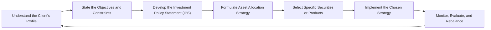

## 1.1 The Seven Steps of the Portfolio Management Process

Building an investment portfolio that aligns with a client’s goals and risk preference can feel like piecing together a giant jigsaw puzzle—except the puzzle pieces are things like equities, fixed income, and, sometimes, alternative assets. And oh, by the way, the puzzle arrangement often changes as market conditions and client circumstances evolve. That’s exactly why the “portfolio management process” exists. It’s a systematic, repeatable method that Investment Advisors (IAs) follow to ensure that a client’s portfolio remains stitched to his or her financial aspirations, even when the world throws in a twist.

I remember once I had two different clients: one, a young software developer, and the other, a soon-to-retire teacher. Both asked, “Hey, how do I start?” The short answer was: “We need a process—a step-by-step approach that helps me understand you, your finances, and the best strategy to meet your needs.” That’s basically what we’ll explore here.

Below is a simple diagram illustrating these seven steps. Don’t worry if it looks complicated at first glance. Each step is meant to fit neatly into the next:

As you can see, once you’re done with step seven, “Monitor, Evaluate, and Rebalance,” you cycle back to step one if the client’s needs or the market environment changes. This cyclical nature helps keep the portfolio in line with life’s unpredictabilities.

Below, we’ll break down these seven steps so that you can apply them to your own practice or personal finances with more confidence.

---

### Understand the Client’s Profile

The first step—sometimes people say it’s the most crucial—can be summed up as “knowing who you’re actually building this portfolio for.” That means gathering all the relevant information, both numbers (like income, net worth, existing assets) and softer data points (like a client’s future dream to buy a cottage, or desire to retire early to host a travel vlog—if that’s a thing they want).

• Qualitative Information:  
  – Investment knowledge (are they beginners, experienced, or experts?)  
  – Attitudes toward risk (are they comfortable seeing their portfolio fluctuate or do they lose sleep over a 1% dip?)  
  – Personal values or lifestyle preferences that might impact investment decisions  

• Quantitative Information:  
  – Current income, savings, and debt levels  
  – Asset ownership details (e.g., real estate, personal businesses, or existing securities)  
  – Monthly or annual cash flow requirements  

In Canada, advisors must comply with CIRO (Canadian Investment Regulatory Organization) standards, which replaced the defunct MFDA and IIROC as of January 1, 2023. A pivotal part of the compliance process here is “Know Your Client” (KYC), basically a legal requirement that ensures any recommended investments truly match the client’s financial situation and appetite for risk. KYC might sound formal and maybe a bit tedious, but it’s essential. Trust me, you don’t want to steer a risk-averse retiree into super-volatile penny stocks. Also, it’s not just about ticking boxes; it’s about forging strong professional relationships founded on trust.

By the way, if you ever want to systematize this step, you might consider open-source tools like Python’s pandas library to create a structured questionnaire for new clients. I once built a small script to generate summarized client “dashboard” reports—this helps keep me (and them) on track.

---

### State the Objectives and Constraints

After the client’s information is at your fingertips, you define what the portfolio actually aims to achieve: capital growth, income generation, or perhaps a combination. There’s also the question of constraints—time horizon, liquidity needs, taxes, legal limitations (especially if your client is dealing with trusts or foundations), and so on.

Let’s illustrate with a quick personal anecdote: A friend approached me to help with an investment strategy that centers around paying for their child’s college education in 10 years. In that scenario, the objective (pay for tuition) and constraints (10-year time horizon, medium risk tolerance, and stable liquidity to handle the unexpected) shaped every subsequent decision we made, from picking the asset classes to the final security selection.

Constraints can come in many forms:

• Liquidity Needs:  
  – Does the client need easy access to cash for living expenses or irregular big-ticket items (like wedding costs or home purchases)?  

• Time Horizon:  
  – Short term (under 3 years), medium term (3–10 years), or long term (over 10 years)?  

• Tax Considerations:  
  – Is your client subject to high marginal tax rates and looking for tax-efficient vehicles (like Canadian dividend tax credits, TFSAs, or, if outside Canada, a wide range of tax-advantaged accounts)?  

• Regulatory or Legal Limitations:  
  – For instance, certain pension plans or trust accounts might have restricted investment mandates.  

By clearly outlining these objectives and constraints, you set boundaries for the rest of the process. This is like mapping out your destination before you start driving.

---

### Develop the Investment Policy Statement (IPS)

Once you know the “who, what, and why,” you write it all down—yep, in a formal document. This is your Investment Policy Statement, or IPS. Think of the IPS like a blueprint. It calls out the objectives, constraints, broad asset allocation guidelines, and performance benchmarks you’ll use to measure success.

Creating an IPS may sound too formal for some folks. But trust me, it’s a game-changer. Back in the day, I used to scribble some notes about what a client wanted and would sort of keep it in my head. That was a recipe for misunderstandings. Having an IPS ensures both the advisor and the client have the same game plan. So if the portfolio experiences a wobble, you can quickly see if something is out of line with the plan, or if the plan itself needs an update due to life changes or market shifts.

Components of an IPS often include:  
• Purpose of the portfolio (e.g., retirement, wealth accumulation)  
• Return objectives and risk tolerance (with specific target metrics where possible)  
• Asset allocation ranges (for each asset class: 40–60% equities, 20–40% fixed income, etc.)  
• Constraints (liquidity, time, tax, legal, unique circumstances)  
• Performance benchmarks (e.g., S&P/TSX Composite for Canadian equities, FTSE Canada Universe Bond for Canadian bonds)  
• Frequency of review  
• Rebalancing thresholds (e.g., if equity weighting moves ±5% from target)

The IPS is essentially your anchor. It keeps the portfolio’s management consistent and objective, especially when panic or euphoria sets in. And yes, those market moods happen to the best of us.

---

### Formulate Asset Allocation Strategy

Now that the client's needs and the “rules” are set, the biggest question is how to divide the portfolio among different asset classes. “Asset allocation”—it’s a buzzword that gets used everywhere, from professional circles to do-it-yourself investing chatrooms. But it’s not just a dull mathematical exercise; it’s about striking a balance between risk and return that matches your client’s unique profile.

The two main philosophies you’ll hear about are:  
• Strategic Asset Allocation (SAA): This is your base policy mix—like the default setting for the portfolio. It’s usually informed by long-term forecasts of risk and return for each asset class and is tied directly to the client’s risk tolerance.  
• Tactical Asset Allocation (TAA): This is when you make short-term, more opportunistic (or defensive) shifts away from the strategic mix if you anticipate certain market trends. If you think global equities are going to surge in the next six months while local equities might lag, you might tilt some portion of the portfolio more globally.

I recall one client who was extremely conservative, but ironically used to love chasing hot tech stocks on rumor-based news. After developing an IPS, we allocated roughly 70% to stable fixed-income and balanced funds, with a small 10% “curiosity” bucket for tech investments he wanted to explore. That decision was informed by the asset allocation step, ensuring the portfolio as a whole stayed aligned with his overall risk profile, while acknowledging his personal preferences.

Diversification is also key—spreading investments across sectors, geographies, and asset types to mitigate unsystematic risk. This process can also help reduce overall volatility. For instance, pairing some higher-volatility growth stocks with stable government bonds can even out your returns over time. Quantitative research tools (like R’s “PerformanceAnalytics” or Python’s “NumPy” library) let you test historical correlations and see if your chosen asset mix is too tightly concentrated in a single sector or region.

---

### Select Specific Securities or Products

Once you have your asset mix, you need to decide exactly what to buy: individual stocks, bonds, ETFs, mutual funds, alternative assets, or a combination. This step is sometimes more fun because you get to “go shopping” for the investments.

Still, though, keep your client’s plan front and center:

1. **Research and Due Diligence**: Investigate everything from a fund’s track record and management team to an individual company’s financial statements. If it’s a product from your own firm or a third party, confirm the alignment to your client’s risk profile.  
2. **Suitability**: In Canada, the “suitability requirement” is enforced by CIRO, requiring an advisor to ensure that each investment is appropriate for the client’s situation.  
3. **Tax Implications**: For instance, you might choose dividend-paying Canadian equities if you’re aiming to leverage the Canadian dividend tax credit, or you might recommend certain corporate-class funds for potential tax efficiency.  
4. **Liquidity Needs**: If your client might need some of this money in the near term, you’ll probably screen out illiquid alternative investments like private equity with long lock-up periods.  

Sometimes the best approach is to mix active management (e.g., selected mutual funds or specific managers with strong performance and research capabilities) with passive products like index ETFs. If you have a major chunk of your portfolio in plain vanilla index ETFs, it can keep costs down while providing broad market coverage. Then you might pick a few active managers in specialized sectors (like emerging markets or small-cap growth) you believe could potentially outperform.

---

### Implement the Chosen Strategy

Once you figure out the “what,” it’s time for the “how, when, and how much.” Implementation involves the nitty-gritty of trade execution. This can vary depending on the scale and structure of the portfolio:

• **Execution Logistics**: Are you placing trades yourself on an online brokerage platform, or do you have a desk dedicated to ensuring best execution? In many large Canadian brokerage houses, advisors collaborate with a trading desk for block trades.  
• **Transaction Costs**: Commissions, spreads, and foreign exchange fees can nibble away at returns. Minimizing these is crucial, especially for large or frequent transactions.  
• **Market Conditions**: Sometimes you might phase in large stock purchases gradually if the market is volatile, using a technique called dollar-cost averaging to spread out risk.  

I once had a client who decided to liquidate a fairly large portion of low-yield GICs to move into a diversified bond fund. Instead of doing it all in one day, we spread the trades over a couple of weeks to avoid potential daily price swings. This approach doesn’t guarantee the best price, but it helps manage the risk of unfortunate timing. Implementation can be as much about art and experience as it is about science.

---

### Monitor, Evaluate, and Rebalance

After you hit the “buy” button, you’re not finished. Portfolios aren’t “set it and forget it”—they’re living, breathing organisms that respond to changes in the market, regulations, and the client’s personal life. So you track performance against the benchmarks outlined in the IPS.

Here’s a quick table illustrating some key monitoring metrics:

| Metric                       | How to Use                                | Example                                                         |
|-----------------------------|--------------------------------------------|-----------------------------------------------------------------|
| Return vs. Benchmark        | Check if returns are on track             | Compare equity portion to S&P/TSX Composite or S&P 500, etc.    |
| Risk Metrics (Volatility)   | See if fluctuations exceed the IPS bounds | If portfolio SD > 15% but the IPS states a 10% cap, investigate |
| Asset Allocation Drift      | Keep weighting in line with targets       | If equities reach 70% but your target is 60%, a rebalance helps |
| Income Generation           | Evaluate if yield meets client’s needs    | For retirees reliant on steady income streams                   |

When an asset class significantly outperforms or underperforms, portfolio weightings can drift away from the initial plan. That’s when rebalancing comes into play. Let’s say you aimed for 50% equities, 40% bonds, and 10% alternatives. If the stock market soars and your equity share hits 60%, you might rebalance—selling some equities and buying more bonds or alternatives—back to the target. This step ensures the portfolio’s risk level remains consistent with the client’s profile.

And of course, keep open communication with clients. If their circumstances or goals shift, you may revise their IPS and the subsequent allocation. Maybe your client now needs to funnel funds into a brand-new business idea or handle sudden medical expenses. Being flexible and receptive is key.

---

### Why This Process Matters

You might wonder, “Can I just pick some mutual funds and let it ride?” Possibly, but that approach often leads to scattered or emotion-driven outcomes—chasing hot tips or reacting disproportionately to market dips. The seven steps give you a more stable roadmap:

• Organized and Systematic: You’re less likely to overlook important details.  
• Compliance-Friendly: You meet regulatory obligations, from KYC to suitability guidelines under the watchful eye of CIRO in Canada.  
• Confidence-Building: Clients see that you’re following a professional framework and not just winging it.  

---

### Key Regulatory and Educational Resources

If you’re practicing in Canada, you should keep track of the laws and regulations set out by the Canadian Securities Administrators (CSA) and enforced by CIRO. If you need to read more:

- [CIRO](https://www.ciro.ca): Canada’s national self-regulatory organization for investment dealers and mutual fund dealers, formed after the defunct IIROC and MFDA combined.
- [National Instrument 31-103 Registration Requirements](https://www.osc.ca/en/securities-law/instruments-rules-policies/3/31-103): Outlines the registration obligations and ongoing compliance requirements for registered firms.  

Internationally, if you or your clients invest across borders, check each jurisdiction’s rules on taxation, cross-border investments, and restrictions. You might like:

- The [CFA Institute](https://www.cfainstitute.org/learning) website for global best practices in portfolio management.  
- “Investment Analysis and Portfolio Management” by Frank K. Reilly and Keith C. Brown, for a thorough academic grounding.  
- Tech-savvy folks can harness open-source software tools like Python’s “pandas,” “NumPy,” and “matplotlib” for portfolio analytics; bankers or R enthusiasts might opt for “quantmod,” “Tidyquant,” or “PerformanceAnalytics.”  

And if you want more structured learning, consider taking an online course on Coursera or the CFA Institute’s specialized modules on wealth planning, risk tolerance, and the art of rebalancing.

---

### Putting It All Together

These seven steps—from understanding the client to rebalancing—create a consistent path that helps you deliver on your client’s objectives. Every step has a purpose and a place:

1. The first step ensures you know the client.  
2. The second step clarifies your direction.  
3. The third step locks those directions in writing.  
4. The fourth step shapes the overall structure of the portfolio.  
5. The fifth step is a deeper dive into the “nuts and bolts” of each investment.  
6. The sixth step is about careful execution.  
7. The seventh step keeps that portfolio fresh and relevant.

It’s a dynamic, cyclical process. Once you begin monitoring and rebalancing, you might find you need new information from your client, or maybe their constraints have shifted. That leads you back to step one, and the process continues. Honestly, that’s what makes portfolio management both challenging and fun—it’s never truly done.

Anyway, I hope this breakdown has demystified what can be an intimidating topic. My best advice? Keep learning, stay flexible, and don’t skip any steps. There’s a reason these steps are tried and true. If you do them well, you’ll likely build enduring client relationships and well-structured portfolios able to weather market storms, client life changes, and everything else that comes your way.

---

## Test Your Knowledge: The Seven Steps of the Portfolio Management Process Quiz



### Which Canadian regulatory body replaced the historical MFDA and IIROC as of January 1, 2023?

- [x] CIRO (Canadian Investment Regulatory Organization)
- [ ] The New SRO (New Self-Regulatory Organization)
- [ ] CIPF (Canadian Investor Protection Fund)
- [ ] OSC (Ontario Securities Commission)

> **Explanation:** The Mutual Fund Dealers Association (MFDA) and the Investment Industry Regulatory Organization of Canada (IIROC) combined to form CIRO on January 1, 2023. CIRO now oversees both mutual fund dealers and investment dealers.

---

### According to the portfolio management process, which of the following is the primary goal of developing an Investment Policy Statement (IPS)?

- [x] To document the client’s objectives, constraints, risk tolerance, and performance benchmarks
- [ ] To meet the asset manager’s personal guidelines and risk preferences
- [ ] To provide a marketing pitch to potential clients
- [ ] To substitute for regulatory documents like the KYC form

> **Explanation:** The IPS is designed to capture the client’s unique situation and formalize how the portfolio should be managed. It’s not just marketing material, nor does it replace official KYC documents.

---

### In the context of asset allocation strategies, what is “tactical asset allocation” generally meant to do?

- [ ] Replace the need for strategic asset allocation
- [x] Allow short-term adjustments to take advantage of perceived market opportunities
- [ ] Ensure zero risk within the client’s portfolio
- [ ] Eliminate the need to rebalance

> **Explanation:** Tactical asset allocation involves making short-term, opportunistic changes around a core strategic mix. It doesn’t eliminate the need to rebalance, nor does it guarantee zero risk.

---

### Which of the following is NOT typically included as a constraint in the portfolio management process?

- [ ] Time horizon
- [ ] Tax considerations
- [ ] Liquidity needs
- [x] Daily leveraged trading requirements
- [ ] Legal/regulatory limitations

> **Explanation:** Daily leveraged trading requirements are uncommon constraints for most individual investors, although institutions might have specialized constraints. Time horizon, tax considerations, liquidity needs, and legal/regulatory limitations are standard constraints.

---

### When choosing a security or product, the “suitability requirement” in Canada is regulated mainly by:

- [ ] CIPF
- [x] CIRO
- [ ] CFA Institute
- [ ] The New SRO (unofficial name)

> **Explanation:** CIRO is the self-regulatory organization that enforces rules related to suitability in Canada. CIPF protects client assets if a member firm becomes insolvent; CFA Institute is a professional body, and the New SRO is simply a past or informal reference to CIRO.

---

### What is the benefit of rebalancing a portfolio periodically?

- [x] It realigns the portfolio to its original or updated target allocations
- [ ] It guarantees a higher return than a buy-and-hold strategy
- [ ] It eliminates all systematic risk
- [ ] It is always done monthly for every client, no exceptions

> **Explanation:** Rebalancing periodically ensures the portfolio doesn’t drift away from its intended risk/return profile. It doesn’t guarantee higher returns or remove systemic risks.

---

### Which statement about diversification is accurate?

- [x] It involves spreading investments across various asset classes to reduce unsystematic risk
- [ ] It eliminates all market risk
- [x] It can include mixing different geographies and industries
- [ ] It is typically unnecessary for conservative investors

> **Explanation:** Diversification helps manage unsystematic risk across sectors and geographies, but it can’t remove systemic or market-wide risk. It’s relevant to both conservative and aggressive investors.

---

### One key advantage of writing an IPS is that:

- [x] It reduces confusion by clearly outlining investment goals and constraints
- [ ] It replaces all other client-facing compliance documents
- [ ] It guarantees positive returns in any market condition
- [ ] It disqualifies the client from making personal investment decisions

> **Explanation:** An IPS ensures the advisor and client are aligned on objectives, constraints, and evaluation methods. It doesn’t replace regulatory documents, guarantee returns, or limit the client’s autonomy.

---

### In the portfolio management process, gathering both qualitative and quantitative data to build a client profile is referred to as which step?

- [x] Understand the Client’s Profile
- [ ] Develop the Investment Policy Statement
- [ ] Formulate Asset Allocation Strategy
- [ ] Monitor, Evaluate, and Rebalance

> **Explanation:** Understanding the client’s profile is the first stage in the process, encompassing the collection of financial data (quantitative) and personal preferences (qualitative).

---

### True or False: Implementing a chosen investment strategy should consider transaction costs and market conditions.

- [x] True
- [ ] False

> **Explanation:** Proper implementation involves seeking best execution for trades and minimizing transaction costs. Strategies like dollar-cost averaging or block trades can be used depending on market conditions.


