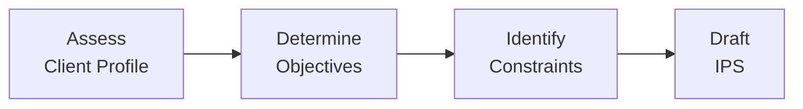

## 1.4 How Investment Advisors Can Determine Investment Objectives and Constraints

Having a clear sense of an investor’s objectives and constraints is absolutely vital when building a successful and lasting portfolio strategy. But, you know, sometimes it can feel like prying when you’re trying to get a sense of what the client truly wants—especially if the client is new to investing or simply not used to sharing so many financial, personal, and even emotional details. Still, establishing those objectives and constraints is the bedrock of a proper Investment Policy Statement (IPS), aligning the portfolio with what the client needs and expects.

Below, we’ll explore how an advisor can pinpoint what exactly the client is looking for—income, capital preservation, capital appreciation, or maybe a combination of these. We’ll also delve into the constraints that can limit or shape how those objectives are pursued (e.g., time horizon, liquidity, taxes, legal or regulatory constraints, and unique preferences like socially responsible investing).

Throughout this discussion, we’ll keep in mind the Canadian regulatory landscape, featuring the Canadian Investment Regulatory Organization (CIRO), which now oversees the responsibilities that historically belonged to the MFDA and IIROC. We’ll also highlight best practices and mention specific tools and resources that can make an advisor’s job easier. Let’s dig in.

---

### Why Determining Objectives and Constraints Matters

I remember once chatting with a new client—let’s call her Sasha—who told me, “I want to make sure I never lose money.” That statement was her primary concern. But as we went deeper, I realized she was also unsatisfied with her current returns. So, she wanted safety (capital preservation) but desired better returns (capital appreciation) at the same time. It’s actually not uncommon to see contradictory or unclear goals like this. Without properly identifying her comfort level with risk, her time horizon, and the practicality of her desired returns, I could have wound up recommending the wrong approach.

When an advisor fails to clarify objectives and constraints, the risk of mismatched goals rises. That’s why there are regulatory guidelines—particularly from CIRO in Canada—requiring advisors to ensure that portfolios reflect stated objectives and constraints. In the process that leads to an IPS, these details become crucial checkpoints for measuring both the advisor’s performance and the client’s satisfaction down the road.

---

### Understanding Investment Objectives

The starting point in any portfolio management process is to identify what an investor is hoping to achieve. Most objectives can be boiled down to one or more of the following categories:

**Income Generation**  
Some clients prioritize a steady cash flow, whether from interest, dividends, or other distributions. For these investors—often retirees or those nearing retirement—the emphasis might be on regular income that covers living expenses. For instance, a retiree might aim for C$2,000 in monthly dividend and interest income to meet fixed costs. Generating a predictable stream of distributions can mean leaning into stable, lower-volatility asset classes, such as high-grade bonds, dividend-paying stocks, and sometimes annuities.

**Capital Preservation**  
Clients with a low tolerance for risk or those concerned that they’ll outlive their nest egg often ask for near-term security and minimal volatility. This approach emphasizes safety of principal and might, for example, include short-duration government bonds, high-grade corporate bonds, or certificates of deposit (GICs in Canada). It’s important to note that, while “I never want to lose money” is a common refrain, leaving too much capital in super-safe vehicles can lead to slow or stagnant growth, especially if inflation outpaces the returns.

**Capital Appreciation**  
This objective is especially relevant for clients who have time on their side. Younger investors or those comfortable with market ups and downs typically focus on growing the portfolio’s value in the long run. Equity-heavy portfolios, including both domestic and international markets, might be the go-to approach here. One might target a 5% or 6% annualized net return, for instance, by riding out equity market cycles.

**Balanced Approaches**  
Many investors want “a little bit of everything.” Balanced approaches usually mix equity (for growth) and fixed income (for stability and income). A common example might be a 60/40 portfolio—60% in stocks and 40% in bonds. But even within a balanced approach, the client’s specific goals, constraints, and preferences dramatically affect the weights.

One key is to make each goal measurable. For instance, “achieve 5% annual growth” or “maintain C$2,000 monthly income distributions” provides more clarity than “invest for growth” or “I want income.” This specificity allows an advisor to measure performance accurately over time.

---

### Core Constraints Shaping the Portfolio

Just as important as identifying objectives is understanding the constraints that might limit or shape how those objectives can be realistically met. Constraints aren’t necessarily negative—they’re just a reality to work within. Think of it as the sandbox in which the advisor and client get to build the perfect castle. Let’s look at some that commonly arise.

**Time Horizon**  
- **Short-Term (1–3 years):** Typically calls for more conservative allocations. You don’t want to risk losing principal just before needing the funds.  
- **Intermediate (3–10 years):** Allows for some moderate risk-taking.  
- **Long-Term (10+ years):** Often suitable for higher equity allocations because there’s enough time to weather market storms.

A good example: If an investor is saving for a down payment on a house in two years, a portfolio heavy in volatile stocks might be too risky. On the other hand, if the investor is looking toward retirement 25 years from now, a primarily fixed-income portfolio might be too conservative.

**Liquidity Needs**  
Some investors need to access capital on short notice—for instance, to fund a business expansion, pay for a child’s tuition, or handle unexpected major expenses. These needs typically call for a portion of the portfolio to be in highly liquid assets such as cash, money market funds, or short-term bonds. The presence of high liquidity needs often reduces the portfolio’s capacity to hold long-term or illiquid investments like real estate limited partnerships or private market investments.

**Taxes**  
Canada’s tax landscape can be quite involved, including personal income taxes, capital gains taxes, and dividends, each taxed differently. High-net-worth clients, in particular, might require sophisticated tax strategies, such as asset location (putting income-generating products in tax-sheltered accounts like TFSAs or RRSPs), strategic use of capital losses to offset gains, or investing in products designed to minimize taxable distributions.

**Legal/Regulatory Constraints**  
Trusts, estates, pension funds, and corporate structures may carry specific legal restraints. For example, a trust deed might limit investment in certain securities or require diversification standards. Under CIRO regulations, advisors must also ensure that their recommendations meet the client’s stated needs and are suitable for their profile. If an individual is subject to certain trust obligations or fiduciary responsibilities, the portfolio may require more documentation and monitoring.

**Unique Preferences**  
Some individuals have personal values that guide their asset choices. This might include:  
- **Socially Responsible Investing (SRI):** Avoiding companies that violate environmental or social standards.  
- **Shariah-Compliant Investing:** Excluding financial practices not permissible under Islamic law, such as interest-based lending or certain highly leveraged sectors.  
- **Religious or Charitable Constraints:** Some charities can’t, or prefer not to, invest in tobacco, alcohol, weapons, or other industries.  

In recent years, SRI or ESG (Environmental, Social, Governance) considerations have gained traction, with many mainstream asset managers offering specific mutual funds or ETFs that filter companies based on pre-set criteria.

---

### A Visual Overview of the Process

Below is a simple Mermaid flowchart illustrating the framework an advisor might follow:

1. **Assess Client Profile:** Gather personal and financial information, risk tolerance, past experiences, etc.  
2. **Determine Objectives:** Income or growth? Balanced or aggressive?  
3. **Identify Constraints:** Time horizon, liquidity, taxes, legal limits, unique preferences.  
4. **Draft IPS:** Consolidate findings into a policy guiding subsequent asset allocation and investment selection.

The next step—once objectives and constraints are isolated—is to shape an investment strategy that aligns with both. This is where the rest of the chapters in this book come in handy, such as analyzing risk profiles (Chapter 2), selecting assets, and finalizing an allocation approach.

---

### Bringing Objectives and Constraints Together

In practice, objectives and constraints can sometimes clash:

• **High Return Needs vs. Low Risk Tolerance**  
  A typical scenario: the client wants a 10% annual return with zero downside. Setting realistic expectations is key. Possibly, a mix of stable dividend-paying stocks and high-quality bonds might strike a compromise.

• **Substantial Liquidity Needs vs. Desire for Higher-Yielding Illiquid Investments**  
  When a client says, “I might need half of these funds in six months, but I’d like to invest in real estate projects that lock my money away for five years,” it’s a tension. Transparent planning about partial liquidity or adding a line of credit can help.

• **Strict Ethical Constraints vs. Narrow Asset Universe**  
  If a client wants to exclude all resource companies for environmental reasons, that can shrink the portfolio’s diversification. The advisor might then look at alternative ESG funds or green bonds.

In each case, it’s the advisor’s job to highlight the potential trade-offs and guide the client toward a portfolio that is sufficiently aligned with reality and personal values.

---

### Practical Examples and Case Studies

**Case Study: The Retiree Wanting Steady Income**  
- **Profile:** Michael is a 68-year-old retiree living in Calgary. He needs a monthly income of C$2,500 from his portfolio to supplement government pensions.  
- **Objective:** Income generation and capital preservation.  
- **Constraints:**  
  - Time Horizon: 20+ more years (potentially)  
  - Liquidity Needs: Moderate—he needs monthly distributions.  
  - Taxes: He’s in the second-highest marginal tax bracket in Alberta.  
  - Unique Preferences: He doesn’t want to touch any risky start-ups.  

An advisor might recommend a balanced approach leaning heavily on fixed-income ETFs and stable dividend stocks. Possibly, a portion could sit in a short-term bond ladder to ensure monthly or quarterly payouts. Tax considerations would involve using Michael’s TFSA for high-yielding investments, while structuring some dividends in a taxable account given preferential dividend tax rates.

**Case Study: The Young Tech Professional Seeking Growth**  
- **Profile:** Sarah is a 32-year-old software engineer with a stable job.  
- **Objective:** Aggressive capital appreciation to retire early (by 55).  
- **Constraints:**  
  - Time Horizon: 20+ years.  
  - Liquidity Needs: Minimal—just a small emergency fund.  
  - Taxes: Gains might be significant if her portfolio does well, so location matters.  
  - Unique Preferences: She’s big into ESG investing, especially low-carbon projects.  

Given Sarah’s longer time horizon and higher risk tolerance, an advisor might allocate a larger portion to equities—both domestic and international—focusing on ESG funds or climate-friendly ETFs. Some tax planning might place a portion in her RRSP to minimize current tax liabilities. Alternatively, she could deploy capital to a TFSA for tax-free gains. If she feels comfortable with some volatility, she could invest in innovative growth companies or factor-based strategies described in Larry Swedroe’s books on factor investing.

---

### Tools, Frameworks, and Resources

Financial professionals in Canada have many resources for clarifying client objectives and constraints. Below are some you might find helpful:

**Regulatory Guidance from CIRO**  
- The Canadian Investment Regulatory Organization (CIRO) sets suitability standards and guidelines. Although historically the MFDA and IIROC were separate bodies, CIRO now oversees all investment dealers and mutual fund dealers in Canada. The official website is at [https://www.ciro.ca](https://www.ciro.ca). Advisors should regularly check for bulletins and regulations on how to document objectives and constraints effectively.

**Portfolio Optimization Spreadsheets**  
- Many open-source tools on GitHub provide Excel or Google Sheets modeling for portfolio optimization. They usually factor in expected returns, volatility, correlation, and constraints such as liquidity or maximum weight per asset class.

**Robo-Advisors’ Risk Engines**  
- A variety of Canadian robo-advisors (e.g., Wealthsimple, Questrade Portfolios) use quick questionnaires to gauge risk tolerance and match users with model portfolios. For advisors, examining how these robots handle constraints—particularly risk scores, time horizons, and bubble test preferences—can offer ideas for a streamlined internal process.

**“Personal Finance for Canadians”**  
- This is a good resource for understanding how everyday Canadians manage their finances, taxes, and constraints. It offers straightforward explanations of tax-advantaged accounts (TFSAs, RRSPs) and how to incorporate them into broader financial plans.

**Larry Swedroe’s Books on Factor Investing**  
- If capital appreciation strategies or balancing risk factors is on your client’s radar, Larry Swedroe provides an in-depth view of how to tilt a portfolio toward certain factors (e.g., Value, Small Cap, Profitability) while still aligning with the broader constraints a client might have.

---

### Best Practices

- **Document Everything:** Thorough fact-finding forms and meeting notes reduce the chance of misunderstanding. This is also crucial from a compliance perspective.
- **Set Realistic Expectations:** Over-promising returns or downplaying risks can lead to disappointment and possibly regulatory trouble. Provide honest projections and discuss scenarios.
- **Review and Update:** Objectives and constraints may shift as life events happen—new job, marriage, inheritance, etc. Regularly update the IPS to reflect these changes.
- **Be Transparent About Fees:** High fees chew into returns. Make sure the client understands how fees align (or sometimes conflict) with their objectives.
- **Consider Tax-Efficiency Early:** Once a portfolio structure is in place, shifting assets to more tax-friendly arrangements (e.g., placing interest-bearing assets in RRSPs or TFSAs) can be complicated. Do it right from the start.

---

### Common Pitfalls

- **Misjudging the Client’s Risk Tolerance:** A nominal risk score doesn’t always reflect the client’s reaction to real market volatility. Use scenario-based conversations: “If your portfolio dropped 15% this year, how would you react?”
- **Ignoring “Soft” Constraints:** Emotional or ethical factors can be just as important as financial ones. Failing to account for them can strain the advisor-client relationship.
- **One-Size-Fits-All Approach:** Model portfolios have their place, but ignoring personal constraints or objectives can lead to suboptimal outcomes.
- **Underestimating Time Horizon Changes:** The client’s horizon might be truncated by unexpected life events, or extended if they decide to keep working beyond normal retirement age. Keep lines of communication open.

---

### Glossary of Key Terms

- **Capital Preservation:** An investment approach focusing on maintaining the initial value of the portfolio, often through lower-risk assets like high-grade bonds or GICs.  
- **Capital Appreciation:** Growth-oriented strategy aiming to increase the portfolio’s value over time through equities or higher-risk assets.  
- **Socially Responsible Investing (SRI):** Selecting or avoiding investments based on ethical or environmental criteria.  
- **Time Horizon:** The period over which the client aims to invest before significant withdrawals are needed.

---

### Conclusion

Determining investment objectives and constraints is both an art and a science. It requires empathy (to hear what the client is really saying, even if it’s not perfectly articulated), knowledge (understanding how financial instruments and market forces work), and, of course, compliance with regulatory guidelines (so that you meet the standards set by CIRO and keep your client’s best interests at heart).

At the heart of this process is the client-advisor relationship. Advisors who invest time in learning what their clients truly want—and what limitations they face—are in a more robust position to recommend portfolios that stand the test of time. Whether the client is aiming for stable retirement income, ready to chase tech-sector growth, or somewhere in between, a balanced, well-researched approach to objectives and constraints can make all the difference in achieving consistent, long-term success.

---

## Test Your Knowledge: Determining Investment Objectives and Constraints Quiz



### Which of the following investment objectives focuses on securing the original principal above all else?

- [ ] Capital Appreciation
- [x] Capital Preservation
- [ ] Income Generation
- [ ] Balanced Growth

> **Explanation:** Capital preservation is all about maintaining the principal. It typically involves safer, lower-volatility assets like high-grade bonds, GICs, or money market instruments.

### A client who wants a steady flow of dividends or interest to fund monthly expenses primarily seeks:

- [ ] Capital Appreciation
- [x] Income Generation
- [ ] Aggressive Growth
- [ ] Socially Responsible Investing

> **Explanation:** Income generation refers to constructing a portfolio that provides regular, predictable distributions through interest, dividends, or other forms of cash flow.

### Which of the following is considered a constraint in investment planning?

- [x] Liquidity Needs
- [ ] Achieving 8% annual return
- [ ] Targeting maximum equity exposure
- [ ] Benchmark Outperformance

> **Explanation:** Liquidity needs are a constraint. They determine how much of the portfolio must be easily accessible in cash or near-cash instruments.

### Time horizon is best described as:

- [ ] The amount of time it takes to research suitable stocks
- [x] The period before significant withdrawals are needed
- [ ] The average business cycle length
- [ ] The historical performance window for bonds

> **Explanation:** Time horizon indicates how long the investment can remain in the market before the client needs to withdraw or utilize funds.

### A client wants to exclude all tobacco and alcohol companies from her portfolio for ethical reasons. This is an example of:

- [x] Socially Responsible Investing (SRI)
- [ ] Capital Preservation
- [x] Unique Preference
- [ ] Tax Minimization

> **Explanation:** SRI involves selecting or excluding certain investments based on ethical or environmental factors. In this case, the client’s ethical preference is a direct constraint on the investment universe.

### When an advisor over-promises returns without emphasizing potential risks, they neglect:

- [x] Setting Realistic Expectations
- [ ] Legal Compliance Only
- [ ] Liquidity Constraints
- [ ] Balanced Portfolio Strategies

> **Explanation:** Advisors must be transparent about possible outcomes and risks. Over-promising sets unrealistic expectations and may lead to compliance and reputational issues.

### Which Canadian regulatory organization currently oversees investment dealers and mutual fund dealers?

- [x] CIRO
- [ ] MFDA
- [x] IIROC
- [ ] CIPF

> **Explanation:** As of 2023, the Mutual Fund Dealers Association (MFDA) and the Investment Industry Regulatory Organization of Canada (IIROC) no longer exist as separate entities. They collectively formed the current Canadian Investment Regulatory Organization (CIRO). CIPF is the Canadian Investor Protection Fund, which offers coverage if a member firm becomes insolvent.

### A high-net-worth client in a top tax bracket is most likely to need which approach?

- [x] Tax-Efficient Asset Location
- [ ] 100% Equity Exposure
- [ ] Zero Liquidity
- [ ] Ignoring TFSAs and RRSPs

> **Explanation:** Asset location strategies, such as holding interest-bearing investments in RRSPs or TFSAs, help reduce taxable income. High-net-worth clients often face complex tax needs that demand careful planning.

### A portfolio with both capital appreciation and capital preservation goals is called:

- [x] Balanced Approach
- [ ] Speculative Approach
- [ ] Day Trading
- [ ] High Liquidity Strategy

> **Explanation:** A balanced portfolio typically allocates between growth stocks and stable fixed-income products, aiming for moderate growth with some protection for principal.

### A client demands no interest-based bonds because of religious constraints. Is this type of concern recognized in building objectives and constraints?

- [x] True
- [ ] False

> **Explanation:** Yes, religious restrictions are indeed unique preferences. This must be factored into the portfolio construction, such as opting for sukuk or other Shariah-compliant instruments.


