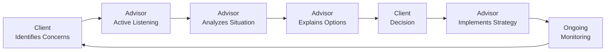

## 1.6 Communication Skills an Investment Advisor Needs

Communication skills are the foundation of any successful investment advisory practice. After all, you can crunch numbers, analyze charts, and structure impressive portfolios, but if you can’t convey your ideas or build a genuine connection with clients, you’ll struggle to maintain trust—and trust is everything in financial services. This section explores the essential communication abilities every investment advisor needs to succeed, from building rapport to tackling tough conversations about market downturns. It also considers the Canadian regulatory environment and the best ways to use modern tools and resources for continuous client engagement.

Before we begin, let me share a quick anecdote: I once had a new client who was so nervous about investing that she apologized for “not knowing the difference between a mutual fund and a muffin.” Her words, not mine! It was clear right away that she needed more gentle guidance than complicated portfolio proposals. With a dash of empathy plus plain language, we uncovered her true risk tolerance and helped calm those finance jitters. The whole experience reminded me that no matter how big or small the portfolio, the key to making someone comfortable is communication. Let’s dig into the strategies that help promote clarity, trust, and rapport in these client relationships.

---

### Building Trust and Rapport

Trust isn’t something you can just hand over in a pamphlet. It has to be cultivated and nurtured over time. In the financial services industry, trust goes hand in hand with your ability to actively listen, respond with empathy, and maintain transparency. Honestly, if you can nail these three elements, you’ll be miles ahead of the game.

• Active Listening.  
  – Active listening is about giving your client your undivided attention. Yes, that means putting your phone on silent or stepping away from your email inbox for a moment.  
  – By reflecting back what the client has said (“So what I’m hearing is...”), you show them that you truly understand their concerns.  
  – This also helps clarify any misunderstandings in real-time. If your client says, “I want more stability,” does that mean guaranteed income or minimal equity exposure? Paraphrasing ensures you’re both on the same page.  
  – In communication research, this technique appears at the top of the list of best practices. But in real life—well, it’s surprisingly rare.

• Demonstrating Empathy and Understanding.  
  – To empathize with a client, you have to see the world through their eyes. That might mean considering their family obligations, career anxieties, or maybe a recent job loss.  
  – Ask open-ended questions to discover these details. People love sharing their stories once they feel safe and supported.  
  – Subtle nods, gentle “mm-hm” acknowledgments, and carefully timed follow-up questions can create a sense of psychological safety that’s essential to building trust.

• Transparent Communication.  
  – Let’s be honest: money is complicated, and sometimes it can be awkward to talk about fees or potential conflicts of interest. But the earlier you state them, the more trust you build.  
  – A conflict of interest arises when the advisor’s interests may potentially diverge from the client’s best interests (for instance, if you earn higher compensation for recommending certain products). In Canada, your regulatory obligations under the Client Relationship Model (CRM) rules—overseen by the Canadian Investment Regulatory Organization (CIRO)—require clarity about fees, compensation, and potential conflicts.  
  – If you demonstrate transparency from day one and keep your client informed of any relevant changes (e.g., new compensation structures, deeper relationships with third-party providers), you reduce surprises and reinforce your credibility.

---

### Explaining Complex Concepts Clearly

Investment advisors often toss around acronyms and jargon. I recall the first time I heard the terms “portfolio rebalancing” and “liquidity funnel” in the same conversation, and I remember thinking, “Yes, I know what those words mean—but does my client?” Honestly, probably not. Clients often hesitate to admit they don’t follow your financial lingo. So we must be mindful to speak their language while still conveying accurate information.

• Translate Industry Jargon into Everyday Language.  
  – If you sense a glazed-over look or a slight pause on the phone, it’s time to step back and say something like, “Let me explain that in simpler terms.” Clients will appreciate your sensitivity.  
  – It can help to practice verbalizing your pitch or explanation out loud, maybe to a friend or colleague, to see if parts of it sound too complicated.  
  – Examples go a long way. If you’re talking about fixed income, you might compare a bond to a loan that the client provides to a government or corporation, complete with an agreed-upon interest rate and timeline.

• Use Visual Aids and Analogies.  
  – Explaining an investment strategy can be so much easier with visuals, whether that’s a simple chart or an entire PowerPoint deck.  
  – A client might only understand “asset allocation” once they see a pie chart with different asset class slices labeled “Equities,” “Bonds,” “Cash,” and so on.  
  – In your chart, you can show how each slice behaves under certain market conditions. For instance, the slice “Equities” may react strongly to economic cycles, while “Bonds” remain comparatively stable.  
  – If you prefer something a bit more engaging, you can even use Prezi or other interactive tools.  
  – Another tip is to relate portfolio ideas to everyday items. You could compare diversification to having a balanced diet, or an emergency fund to a spare tire in your trunk—because if you get a flat, you’ll be thrilled you had it.

• Maintain Consistency in All Materials.  
  – Whether you’re sending an email or a formal investment proposal, try to keep the language consistent. This means using the same terms across all documents and in your verbal explanations.  
  – Sometimes, an advisor uses “bond exposure” in a written write-up and “fixed income allocation” in a conversation, leaving the client to wonder if these two terms are different. Clarify that they’re the same thing.  
  – Consistent language builds client confidence and reduces confusion.

---

### Handling Difficult Conversations

I’d love to say that investment advisors never have to deliver bad news, but let’s be real—markets can and do go south. Whether it’s a sudden market downturn, a restructuring of a beloved corporation, or a personal emergency that forces a client to withdraw funds early, you’ll face tough discussions at some point. How you approach them can make or break the client relationship.

• Be Prepared and Proactive.  
  – Don’t wait until a meltdown occurs to call your client. In fact, if you notice rough waters on the horizon—say, a projected market turbulence due to economic data—it’s often best to alert the client early.  
  – A quick phone call or email to check in can do wonders. You might say: “Hey, just a heads-up: We may see more volatility in the next quarter. Let’s review your portfolio in case we need to rebalance.”  
  – This conveys that you’ve got your eye on the ball and you’re thinking ahead.

• Offer Calm Reassurance.  
  – Anxiety can escalate fast when money is on the line. If a client calls you in a panic because the market dropped 5% in a day, your role is to remain levelheaded.  
  – Validate their feelings (“I understand your nervousness”) and remind them of the plan (“Remember, we set a long-term target for growth, so short-term fluctuations are normal”).  
  – If an adjustment is necessary—like shifting some equity to safer assets—walk them through the pros and cons carefully.

• Know When to Recommend Adjustments.  
  – Sometimes, you have to pivot an investment strategy in response to changing market conditions, new personal circumstances for the client, or both.  
  – In these situations, a thorough explanation of how that pivot will impact risk and returns is crucial to achieving buy-in.  
  – Provide a balanced outlook. If your client sees you focusing solely on the upsides, they might wonder if you’re sugarcoating. A realistic perspective fosters trust.

---

### Reporting and Ongoing Client Updates

Ongoing communication might feel tedious at times—it’s true, preparing regular reports isn’t always as thrilling as analyzing a brand-new tech stock. But let me tell you: consistent, transparent, and timely updates can help your clients sleep better at night. No small accomplishment!

• Provide Regular Statements and Performance Summaries.  
  – Under the regulatory framework in Canada—particularly via CIRO’s guidelines—financial advisors must give clients clear statements.  
  – These statements should show fees, current holdings, performance, and any changes that might affect the client’s well-being.  
  – The aim is to keep the client informed so there’s no big surprise after a year of radio silence. Transparent, periodic updates also help them track progress toward their financial goals.

• Incorporate Digital Tools.  
  – In this digital era, face-to-face meetings are still great, but they aren’t always practical. Video calls via Zoom or Microsoft Teams can provide a personal touch without traveling.  
  – Secure client portals are also becoming more common, letting the client view daily or weekly snapshots of their portfolio’s performance.  
  – You can share timely market insights or educational articles on these portals. Some even integrate messaging features for quick clarifications.

• Deliver Contextualized News and Insights.  
  – Sending out a simple “Your portfolio’s up 5% year-to-date” might not mean much to clients if they don’t understand what’s driving performance or risk.  
  – Provide context: “The Canadian market has rebounded this quarter, especially in the energy sector. Since you hold a diversified mix of domestic equities and some global bonds, you saw moderate gains.”  
  – If there’s major market news—like an expected rate hike—give a short summary of how that might affect their portfolio. This is an easy way to reinforce your value as an advisor who stays plugged into the big picture.

• Embrace a Client-Centric Culture.  
  – Every time you communicate, you have an opportunity to show the client that they are front and center in your practice.  
  – A brief note like, “Hope you enjoyed your son’s graduation yesterday; congratulations!” can strengthen the relationship far beyond numbers on a spreadsheet.  
  – Keep a record of client milestones, such as upcoming retirements or family-related events. That personal touch can turn a routine phone check-in into something meaningful.

---

### Example Scenario: Navigating a Market Downturn Conversation

Let’s illustrate a hypothetical situation. Suppose your client, Alex, calls you in a mild panic because the equity market just dipped 10%. He’s worried that his retirement date, set five years from now, is in jeopardy. Here’s how the communication might flow:

• Acknowledge His Concern.  
  – Say something like, “Alex, I totally understand why you’re nervous. It’s never fun seeing headlines about a market correction.”  
• Revisit the Long-Term Plan.  
  – “We strategized your portfolio with a five-year horizon in mind. This short-term volatility is part of the natural cycle. Let’s look at how your fixed income holdings are balancing the equity losses.”  
• Offer Options.  
  – “If you’d like to reduce a bit of risk, we can shift another 10% of your equities to a short-term Treasury ETF. However, you might lock in losses by selling now.”  
• Empower Alex to Decide.  
  – “Would you feel better sleeping at night if we rebalance, or are you comfortable weathering the current storm given your time horizon?”  
• Provide Documentation.  
  – Follow up with a written summary of the conversation and recommended changes in a client portal update or an email. Include any relevant disclaimers or clarifications.  

Such a straightforward conversation can defuse panic and help keep Alex loyal and confident in your guidance. And, let’s be honest, it’s often these tense moments that truly define the advisor-client relationship.

---

### Visualization: A Communication Flow for Investment Advisors

Below is a simple Mermaid diagram showing how communication flows between you (the advisor) and your client. This diagram underscores the cyclical, ongoing nature of financial communication rather than a one-and-done exchange.

In this cycle, the client’s feedback or questions feed into your thoughtful analysis. You then communicate clearly, they make decisions, and you monitor and refine. Round and round it goes, hopefully for many productive years.

---

### Tools, Frameworks, and Additional Resources

It’s important to keep refining your communication by leveraging new technologies, learning frameworks, and professional development resources—especially in Canada’s regulatory context under CIRO. Here are a few ideas:

• Presentation Software.  
  – PowerPoint and Prezi are tried-and-true ways to show portfolio performance, risk metrics, or financial goals.  
  – For interactive dashboards, consider business intelligence tools such as Tableau or Power BI (though these may be more advanced than many advisors need).

• Communication Frameworks.  
  – “Crucial Conversations: Tools for Talking When Stakes Are High” by Patterson et al. provides excellent insights on how to navigate sensitive or high-pressure dialogues.  
  – “The Trusted Advisor” by David H. Maister, Charles H. Green, and Robert M. Galford is a must-read for professionals eager to strengthen trust with clients.

• Regulatory Guidance.  
  – For the latest updates on advisor-client communication obligations, you can consult the Canadian Investment Regulatory Organization (CIRO) at https://www.ciro.ca. It is the national self-regulatory body overseeing investment dealers, mutual fund dealers, and marketplace integrity.  
  – They offer resources related to the Client Relationship Model (CRM), providing guidelines and best practices for transparency in reporting and conflict-of-interest disclosures.

• Financial Tools and Open-Source Resources.  
  – Python-based libraries like pandas or financial libraries like QuantLib can help with portfolio analytics.  
  – There are also some open-source risk assessment tools that can provide easy-to-interpret visuals for stress testing portfolios. While these might be more advanced, you can generate concise summaries to share with clients.

---

### Key Terms in Communication

• **Active Listening.** A communication technique involving attentive listening, paraphrasing, and clarifying to ensure the client’s needs and concerns are fully understood before steering the conversation.  
• **Conflict of Interest.** A situation where your interests as an advisor may not align perfectly with the client’s best interests. Disclosure of these situations is required under Canadian regulations to maintain transparency.  
• **Client Reporting.** The practice of providing regular statements and updates on portfolio performance, fees, and changes in strategy, ensuring that the client stays informed at all times.

---

### Conclusion

Though it might sound obvious, communication really is at the heart of strong advisor-client relationships. Solid investment knowledge alone isn’t enough to forge lasting partnerships or keep clients loyal when the market wobbles. You need the entire communication toolkit: empathy, clarity, transparency, and consistency. Remember, it’s not just about delivering a monologue on the benefits of a balanced portfolio. It’s about genuinely listening to what your clients want—and sometimes, what they fear—then offering the guidance they need in a way they understand and trust.

Don’t forget: People are often more terrified of looking foolish about finances than they are about the actual risk of losing money. By taking the time to demystify complex concepts, deliver well-structured reports, and address concerns before they become real panic attacks, you can cement your role as a trusted advisor. And trust, well, it can be your biggest asset in an industry built on intangible promises about future returns.

If you’d like to hone these skills further, check out some of the resources mentioned above, such as “Crucial Conversations” and “The Trusted Advisor,” or explore CIRO’s guidelines for the Client Relationship Model. A continuous learning mindset will help you master both the art and science of investment advisory services, and your clients will recognize that effort in every conversation you have.

---

## Test Your Mastery: Communication Skills for Investment Advisors Quiz



### Which of the following best describes active listening in the context of an investment advisor-client conversation?

- [ ] Providing pamphlets with detailed fee structures.
- [x] Paraphrasing and summarizing a client’s concerns to ensure understanding.
- [ ] Recommending adjustments to the portfolio without discussing concerns.
- [ ] Always agreeing with the client’s perspective.

> **Explanation:** Active listening is about confirming the client’s concerns through paraphrasing, clarifying, and showing empathy, ensuring both parties are aligned.

### When discussing fees and potential conflicts of interest, what key principle should guide the advisor’s communication?

- [ ] Trying to simplify fees by combining them into a single lump sum.
- [x] Providing clear, timely, and transparent disclosures as required by CIRO.
- [ ] Matching the fees to the client’s risk level.
- [ ] Avoiding the topic unless the client specifically brings it up.

> **Explanation:** CIRO’s guidelines emphasize the importance of full transparency and timely disclosures regarding fees and any conflicts of interest.

### Which method can effectively illustrate a client’s asset allocation and help them easily understand the composition of their portfolio?

- [ ] A long, text-based summary of each holding.
- [x] A pie chart that shows equities, bonds, and other asset classes by percentage.
- [ ] Only providing a list of ticker symbols.
- [ ] An academic research paper on Modern Portfolio Theory.

> **Explanation:** Visual aids such as pie charts are straightforward and help clients quickly grasp how their assets are distributed.

### During a market downturn, what is the most effective communication strategy with your clients?

- [x] Reach out proactively, acknowledge their concerns, and revisit the long-term plan.
- [ ] Wait for clients to call you so you can address their questions on the spot.
- [ ] Blame their short-term losses on unforeseen market circumstances.
- [ ] Avoid talking about losses to keep them calm.

> **Explanation:** Proactive communication and reminding them of the long-term plan can reduce panic and reinforce trust.

### What is one advantage of integrating digital tools, such as secure client portals and virtual meetings, into your communication strategy?

- [ ] Clients no longer need to sign paperwork.
- [x] They provide more frequent and efficient communication with real-time access to portfolio updates.
- [ ] Costs increase because more technology licenses are required.
- [ ] Clients prefer only in-person meetings.

> **Explanation:** A secure online portal and virtual meetings enable advisors to provide timely, user-friendly access to important investment information.

### Why is it important to maintain consistent terminology in both written and verbal communication?

- [x] Inconsistent language can confuse the client and undermine advisors’ credibility.
- [ ] Using varied terminology showcases the advisor’s advanced knowledge.
- [ ] Clients enjoy hearing new and different terms for the same concept.
- [ ] Regulators prohibit the use of varied terminology.

> **Explanation:** Consistent terminology ensures clarity and avoids misunderstandings, making the communication process smoother.

### Which of the following is an effective strategy for explaining complex financial concepts to a nervous first-time investor?

- [x] Use everyday analogies and incorporate simple language to minimize jargon.
- [ ] Provide only advanced statistical models and formulas.
- [ ] Rely on detailed academic whitepapers.
- [ ] Insist that the client take a finance course before investing.

> **Explanation:** Everyday analogies and simple language help break down complicated ideas, providing clarity and reducing client anxiety.

### When noticing potential short-term market volatility, what should an investment advisor’s immediate communication strategy involve?

- [x] Proactively reaching out to clients and offering to review their portfolios.
- [ ] Advising clients to invest blindly while ignoring market movements.
- [ ] Not mentioning possible volatility to avoid raising concerns.
- [ ] Proposing a complete liquidation of client assets.

> **Explanation:** Being proactive about market changes and discussing potential adjustments or reassurances helps maintain confidence and transparency.

### What primary benefit does “active listening” provide in establishing trust with a client?

- [x] It shows the advisor genuinely cares about the client’s needs and perspectives.
- [ ] It ensures the client will never make poor investment decisions.
- [ ] It shortens the length of client meetings.
- [ ] It replaces the need for written disclosure.

> **Explanation:** Actively listening demonstrates empathy and concern for the client’s viewpoint, reinforcing the relationship’s foundation of trust.

### When might an advisor consider shifting a client’s asset allocation?

- [x] When changing market conditions or personal circumstances call for a modified risk profile.
- [ ] Every day, to maximize short-term profit.
- [ ] Only if the client has no interest in equities.
- [ ] Never, because the initial asset allocation should remain for life.

> **Explanation:** Adjustments are typically made as markets evolve or as the client’s personal financial situation changes, ensuring alignment with overall objectives.


