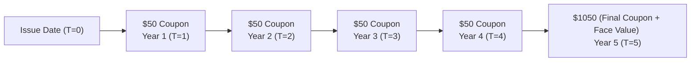
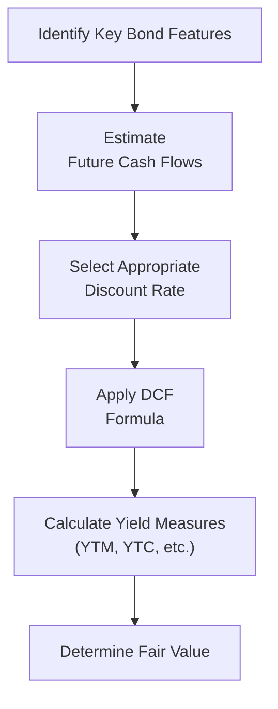

## 10.1 How to Value Debt Securities

Ever had that moment where you look at a bond’s price and think, “Wait, so...why does it cost that much?” or maybe you wondered why that price can fluctuate so wildly with interest rates? You’re not alone. I remember my own early days in finance, trying to wrap my head around bond valuation formulas and discount rates—it felt like deciphering secret code. But guess what? Once you crack that code, a whole world of understanding opens up. 

In this section, we’re diving right into “How to Value Debt Securities,” specifically bonds. If you’re new to this, fear not, because we’ll walk through every major step needed to figure out what a bond is really worth—from the time value of money to calculating yield measures and beyond. If you’re already comfortable with the basics of bond structure, you can simply refresh what you know, and maybe pick up a few real-world tips along the way.

Before we get rolling, keep in mind that Chapter 9 of this book (“Debt Securities”) introduced us to bonds, their structures, and the reasons they exist in the first place. Now, in Chapter 10, we’re going deeper into the actual math and logic that help us to attach a fair value to these critical instruments.

--------------------------------------------------------------------------------

## The Time Value of Money (TVM)

### Why Time Matters

The Time Value of Money (TVM) is the bedrock of finance—an entire planet of valuation concepts spin around it. In plain language, TVM says that a dollar in your hand today is worth more than a dollar you’ll get tomorrow. Why? Because if you have it now, you can invest it and (hopefully) earn some return. Sure, that might sound pretty obvious, but it’s a key principle used in almost every bond calculation out there.

### Discounting Future Cash Flows

With debt securities such as bonds, we typically receive interest (coupon) payments along the road, plus the principal (the face value) at maturity. To value a bond, we “discount” all those future payments—coupons and final principal repayment—back to today’s dollars using a discount rate. This discount rate is also often the required yield or yield to maturity (we’ll dig into yield measures in a moment).

### Choosing the Right Discount Rate

Selecting the right discount rate might feel like choosing the “right” temperature for your coffee—there’s no universal “perfect” pick. Instead, you want to match the rate to the bond’s risk profile, maturity, and other market conditions. For example, a corporate bond with a lower credit rating often gets priced with a higher discount rate because there’s more risk that the bond issuer could default.

--------------------------------------------------------------------------------

## Key Bond Features That Affect Valuation

### Coupon Rates

A bond’s coupon rate is the interest rate it pays, based on the face value. If you have a $1,000 bond with a 5% annual coupon rate, you get $50 in interest payments each year—easy enough. But remember, some bonds pay coupons more often (semi-annually, quarterly). The coupon structure can also be floating (indexed to a market rate like the prime rate or LIBOR in global contexts) as opposed to fixed.

### Maturity Dates

Short-term bonds might mature in a year or two; long-term bonds can have maturity dates decades away. Typically, the longer the maturity, the more sensitive the bond price is to interest rate changes. This matters when you’re discounting all those coupons back to the present. 

### Par (Face) Value

Par value (often $1,000 in North America, though it can vary) is the amount on which the coupon interest is calculated and the sum typically returned to you at maturity. In many bond valuation formulas, the final cash flow is this par value, plus any last coupon payment.

### Embedded Features

Callable, putable, and convertible bonds can alter the timing or size of future cash flows. Let’s say you bought a callable bond that might be taken back (called) by the issuer if interest rates fall. Because the issuer can call the bond away from you earlier, you evaluate your cash flows up to a possible call date. Convertible bonds, on the other hand, can be converted into the company’s stock, so you’d need to factor in the potential value of that conversion.

### Credit Quality

This is a biggie. A bond’s credit rating (from agencies like DBRS Morningstar, S&P, or Moody’s) affects your discount rate because it alters perceived risk. Higher risk means a higher required rate of return, which means higher discounting and usually a lower current price—all else being equal.

--------------------------------------------------------------------------------

## Calculating Bond Cash Flows

### Standard Fixed-Coupon Bond
Imagine you own a “plain vanilla” corporate bond. It has:  
• A $1,000 par value.  
• A 5% annual coupon (paid once per year).  
• 5 years to maturity.  

The coupon payments to you each year are $1,000 × 5% = $50. So for five years, you expect $50 per year, and then at the end of the fifth year, you get your final $50 coupon plus the $1,000 principal (face value).

Here’s a simple timeline to visualize these cash flows:

### Semi-Annual (or Other) Coupon Payments
If the bond pays coupons twice a year, you’d just split that annual coupon in half and get it every six months. For a $1,000 par bond at 5% annual, you’d collect $25 every six months. The math is similar, except you discount each coupon at the appropriate semi-annual yield rate. 

### Zero-Coupon Bonds
A zero-coupon bond pays no coupon. You buy it at a big discount to its face value, and at maturity, you get the full par. That’s the only cash flow. For instance, you might pay $700 for a bond that matures at $1,000 in eight years. The difference—$300—reflects your implied interest.

--------------------------------------------------------------------------------

## Applying the Discounted Cash Flow (DCF) Methodology

### The Present Value Formula

The general formula for a bond price (P) is:


P = \sum_{t=1}^n \frac{C}{(1+r)^t} + \frac{F}{(1+r)^n}


Where:  
• \\( n \\) is the total number of coupon periods until maturity.  
• \\( C \\) is the coupon payment each period.  
• \\( F \\) is the face (par) value.  
• \\( r \\) is the yield (or discount rate) per period.  

If coupons are paid annually, \\(r\\) is the annual discount rate. For semi-annual, \\(r\\) is the semiannual discount rate, and \\(n\\) is the total number of semiannual periods. 

Let’s go back to our example: a 5-year, 5% annual coupon, $1,000 face value. Assume the market interest rate—or required yield—is also 5% (annual). That means you’re discounting $50 for years 1 through 5, plus $1,000 for year 5, at 5%. In a scenario where the coupon rate equals the discount rate, the bond will price at par ($1,000). 

But if the required yield is 6%, the price will drop below $1,000 because the bond’s existing coupon rate looks less attractive compared to newer bonds offering 6%. Conversely, if the required yield is 4%, the bond will be priced above $1,000.

### Putting It All Together
In practical terms, you use this discounted cash flow formula in a financial calculator or a spreadsheet. For instance, in Excel, you can do it with the “PV” function or simply discount each payment manually (if you like that step-by-step detail).

--------------------------------------------------------------------------------

## Yield Measures

### Current Yield
Current yield is a quick snapshot measure:


\text{Current Yield} = \frac{\text{Annual Coupon Payment}}{\text{Market Price}}


If you have a bond paying $50 annually and it trades at $950, then the current yield is \\(50/950 = 5.26\%\\). It’s easy to compute but doesn’t fully capture reinvestment risk or final redemption price.

### Yield to Maturity (YTM)
Yield to Maturity is often considered the “true” measure of a bond’s rate of return if held to maturity. It’s the discount rate that equates the price you pay for the bond with all those coupon payments plus the final principal. We typically solve for YTM using financial calculators or spreadsheets because the formula is iterative (there’s no neat algebraic solution in closed form).

### Yield to Call (YTC) or Yield to Put (YTP)
Callable or putable bonds require you to consider the possibility that the bond could be redeemed early. For example, if interest rates drop, your bond might be called away from you, so the time horizon is shorter. This scenario affects how you calculate your yield. With YTC or YTP, you assume redemption on the call or put date rather than the final maturity date.

--------------------------------------------------------------------------------

## Relationship Between Market Interest Rates and Bond Valuation

As interest rates rise, bond prices go down—an “inverse relationship.” Picture it this way: when new bonds are issued at higher rates, who wants to pay more for your older, lower-interest bond? So the market price of your existing bond has to drop to remain competitive. The reverse is true if market interest rates fall.

--------------------------------------------------------------------------------

## Practical Example: A Step-by-Step Valuation

Let’s walk through a quick example. Suppose you purchase a 3-year bond:

• Par value: $1,000  
• Annual coupon: 4% (so $40 a year)  
• Market yield: 5%  

We can set up the cash flows as:

• End of Year 1: $40  
• End of Year 2: $40  
• End of Year 3: $40 + $1,000 = $1,040  

Now discount each:


\text{Price} = \frac{\$40}{(1+0.05)^1} + \frac{\$40}{(1+0.05)^2} + \frac{\$1,040}{(1+0.05)^3}


Plug in the numbers (or use a financial calculator), and you’ll find the bond’s fair price is around $973.54 (approx.). You’ll notice that $973.54 is less than $1,000 because the bond’s coupon rate (4%) is below the current market yield (5%). 

--------------------------------------------------------------------------------

## Diagrams: Summarizing the Bond Valuation Flow

--------------------------------------------------------------------------------

## Best Practices and Pitfalls

• Always confirm you’re matching payment frequency (annual vs. semiannual) with the correct discount rate. Mixing frequencies is a common error.  
• Watch out for liquidity risk. Sometimes even if the credit looks rock-solid, the bond might be thinly traded.  
• Adjust your measure of yield if there’s a call or put feature looming—YTM might not be the best reflection of your potential return.  
• Stay informed on the issuer’s credit rating. A downgrade can blow up your discount rate assumptions.  

--------------------------------------------------------------------------------

## Strategies to Overcome Common Valuation Challenges

• **Scenario Analysis**: Evaluate different yield scenarios (e.g., yields up by 1%, yields down by 1%) to gauge price sensitivity.  
• **Use Online Tools**: Don’t be shy about using robust, open-source calculators or Excel add-ons. Many of these incorporate built-in features for bond price and yield calculations.  
• **Ongoing Monitoring**: Even after you buy your bond, keep an eye on macroeconomic trends and changes in the issuer’s credit rating.  

--------------------------------------------------------------------------------

## Canadian Context, Regulations, and Resources

• **CIRO (Canadian Investment Regulatory Organization)**  
  Since June 1, 2023, CIRO is the national self-regulatory body overseeing investment dealers and mutual fund dealers in Canada. If you want the most up-to-date regulatory guidelines on fixed-income trading regulations or investor protection, check [CIRO](https://www.ciro.ca/). (Remember, IIROC and MFDA have merged into CIRO and don’t exist separately anymore.)  

• **Canadian Investor Protection Fund (CIPF)**  
  If you’re worried about insolvency issues, CIPF is there to protect client assets when a member firm goes under. To see coverage details, visit CIPF’s official site through CIRO’s resource links.

• **Bank of Canada**  
  For daily or historical yield curves and valuable market commentary, check the [Bank of Canada](https://www.bankofcanada.ca/). It’s a gold mine for data on Canadian rates.

• **IFRS 9**  
  If you’re dealing with the accounting side of bonds, IFRS 9 (Financial Instruments) sets out classification and measurement rules. For more details, definitely consult official IFRS standards.

• **Further Reading**  
  - “Fixed Income Level I and II” by the CFA Institute offers a structured approach to bond valuation.  
  - Pietro Veronesi’s book, “Fixed Income Securities,” goes deeper into the mathematics of bond pricing and risk management.  

--------------------------------------------------------------------------------

## Conclusion

Valuing debt securities isn’t just about plugging numbers into a formula—it’s about putting on the hat of an investor who carefully weighs risks, coupons, and potential changes in market rates. We use the time value of money (TVM) to bring all those future payments into the present, and we always keep an eye on yield measures (YTM, YTC, etc.). 

If you only remember a few things:  
• Understand that interest rates and bond prices move in opposite directions.  
• Pay attention to the specifics of the bond’s features and credit rating.  
• Make sure your discount rate matches your bond’s risk level and payment timing.  

The more you practice, the quicker all this becomes second nature—really, I promise. Next time someone says, “Why is that bond priced at $980 when it pays $50 a year?” you’ll have a ready answer grounded in real math and logic.

Keep going. There’s plenty more to learn about term structure and pricing in our subsequent sections.

--------------------------------------------------------------------------------

## Test Your Knowledge: Bond Valuation Fundamentals Quiz



### Which of the following statements best describes the time value of money (TVM)?

- [ ] It asserts that a dollar tomorrow is always more valuable due to inflation.
- [x] It indicates a dollar today is worth more than a dollar in the future because of investment potential.
- [ ] It suggests that future dollars and current dollars hold exactly the same value in efficient markets.
- [ ] It states that only high-interest-rate environments affect the value of future dollars.

> **Explanation:** TVM says a dollar today can be invested to earn a return, so it’s typically more valuable than waiting to get that same dollar tomorrow.

### What does the coupon rate represent in bond terminology?

- [ ] The bond's annual yield to maturity.
- [x] The percentage of face value paid out each year as interest.
- [ ] The maximum allowable discount rate for a given bond.
- [ ] The amount you must pay to purchase the bond.

> **Explanation:** The coupon rate is the annual interest rate applied to the bond’s par value, which determines the interest payment to the bondholder.

### Why does a bond’s price tend to fall when market interest rates rise?

- [x] Investors demand a lower purchase price to match the new higher yield environment.
- [ ] The bond’s coupons are reduced by the firm issuing it.
- [ ] The par value is adjusted downward by regulation.
- [ ] It reflects legal constraints set by CIRO.

> **Explanation:** Since newer bonds are issued with higher coupons (due to higher rates), existing bonds with lower coupons must decrease in price to remain competitive.

### In a simplified version of the bond pricing formula, which of the following terms is discounted back to the present?

- [ ] Only the principal repayment.
- [x] All coupon payments plus the final principal repayment.
- [ ] Only the coupon payments and not the principal.
- [ ] Only the face value if the bond is callable.

> **Explanation:** The present value of a bond is determined by discounting every coupon payment and the final bond redemption (principal) value.

### Which yield measure is often considered the most comprehensive reflection of a bond’s expected rate of return if held to maturity?

- [ ] Current yield
- [x] Yield to maturity (YTM)
- [ ] Yield to call (YTC)
- [ ] Spot yield

> **Explanation:** YTM captures reinvestment assumptions and the time value of future cash flows, making it a more complete measure than current yield.

### If a bond has a par value of $1,000, an annual coupon of 5%, and a current market price of $900, which formula gives the current yield?

- [x] 50 ÷ 900
- [ ] 50 ÷ 1000
- [ ] 100 ÷ 900
- [ ] 1,050 ÷ 1,000

> **Explanation:** Current yield = Annual Coupon ÷ Market Price. Here, $50 coupon ÷ $900 price.

### What happens to a discount bond’s price if the market yield matches the bond’s coupon rate?

- [x] The bond’s price will rise to par value.
- [ ] The bond’s price will remain at a discount.
- [x] The bond’s yield to maturity will remain lower than its current yield.
- [ ] The bond’s price will drop below par.

> **Explanation:** When the required yield equals the bond’s coupon, the bond’s fair price equals par. Note that the statement about yield to maturity possibly equaling or being different from current yield can depend on whether the bond was priced at a discount or premium beforehand—so the key takeaway is that matching coupon and yield typically leads to a price at par.

### Yield to call (YTC) is most relevant when:

- [x] The issuer has the option to redeem the bond before maturity.
- [ ] The bond can be converted into equity shares at any time.
- [ ] The market interest rate is always rising.
- [ ] The bond is an index-linked bond.

> **Explanation:** YTC matters when a bond is callable, meaning the issuer can “call” the bond away from investors prior to the final maturity date.

### In bond valuation, which of the following would most likely increase the discount rate used in a bond pricing model?

- [x] A downgrade in the bond’s credit rating.
- [ ] A switch from annual to semiannual coupon payments.
- [ ] A shorter maturity date than originally expected.
- [ ] The bond is trading on a more liquid market.

> **Explanation:** A downgrade typically increases the perceived risk, thus increasing the required return and discount rate. Changes in payment frequency or improved liquidity do not necessarily increase the discount rate.

### A zero-coupon bond is priced at a steep discount because:

- [x] It pays no periodic coupons, all interest is effectively paid at maturity.
- [ ] Regulators force the bond to be priced below par.
- [ ] The issuer can change the coupon rate at will.
- [ ] It’s always denominated in a foreign currency.

> **Explanation:** Zero-coupon bonds provide no interest payments during their life, so their entire return comes from the difference between the purchase price and the par value redeemed at maturity.


