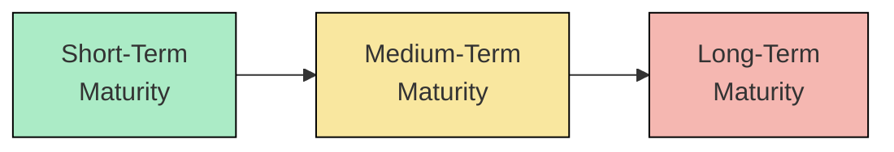

## 10.2 The Term Structure of Interest Rates

It’s funny, but I still remember the first time I heard the phrase “term structure of interest rates.” I was fresh out of school, thinking I had mastered everything about bonds, only to realize I barely understood the very foundation of how yields interact with different maturities. Back then, I had this idea that all bonds of different maturities sort of moved in perfect lockstep. Spoiler alert: they don’t. And that’s precisely why portfolio managers, analysts, and everyday investors pay close attention to the yield curve—because it tells a nuanced story about interest rates, economic expectations, and risk.

The term structure of interest rates, often called the yield curve, is a graphical representation of the relationship between yields (or interest rates) and time to maturity for a set of similar bonds (like Government of Canada bonds). In simple terms, if you line up comparable bonds—say, 1-year, 5-year, 10-year, and 30-year maturities—the yield curve shows you how much each bond is expected to yield at each point in time. This concept is a bedrock of fixed-income investing since it influences decisions on bond selection, portfolio duration, and various hedging strategies. So let’s dive into some of the essential aspects that shape the yield curve and figure out how to use it in real life.

## Definition and Importance

The yield curve itself is a snapshot. Typically, you’d see something like a horizontal axis labeled “Time to Maturity”—from short-term to long-term—while the vertical axis is labeled “Yield.” Plots of yield against maturity for a given day result in a curve that can slope upward, slope downward, or be relatively flat. This curve is crucial because:

• It indicates how investors feel about the future of the economy, inflation, and interest rates.  
• It helps in planning bond portfolio strategies—like whether to buy short-term bonds, long-term bonds, or a mix in between.  
• It guides corporate finance decisions around when to issue debt or refinance.  
• It provides signals about recessions, expansions, or times of economic uncertainty.

We’ll see that sometimes yields for longer maturities are higher, sometimes they’re lower, and occasionally they're very similar across the board. Each shape conveys important signals that portfolio managers closely watch.

## Common Theories Explaining the Shape of the Yield Curve

No shortage of theories exists to explain why yields differ by maturity. Three of the most cited are the Pure Expectations Theory, Liquidity Preference Theory, and Market Segmentation Theory. They’re all helpful lenses, although none perfectly captures every nuance.

### Pure Expectations Theory
Pure Expectations Theory posits that a long-term interest rate is basically the average of all the short-term rates that borrowers and lenders expect to see over the life of that longer bond. In other words, a 10-year bond yield is viewed as an average of the yields on a series of rolling 1-year or 2-year bonds over that 10-year horizon. If the market collectively believes short-term rates will rise, then the 10-year rate should be higher to reflect those expectations.

Why does this matter?
• It suggests that if investors believe interest rates will rise sharply in the future, the yield curve might slope upward.  
• Conversely, if investors think rates will fall, the shape might invert or flatten out.

### Liquidity Preference Theory
The Liquidity Preference Theory says, “Hold on, there’s more to this than just expectations of future rates.” Longer-term bonds carry more uncertainty—like inflation risk, economic fluctuations, or changes in monetary policy—so investors typically demand a premium, referred to as the “term premium,” for lending money over a longer period. This theory often helps explain why a normal yield curve slopes upward, even if shorter-term and longer-term expectations are the same. Investors just want additional compensation for tying up their capital for a longer maturity.

### Market Segmentation Theory
Market Segmentation Theory flips the idea around. It proposes that there are distinct “clienteles” or groups of investors who stick to particular maturity bands. For example, pension funds might focus on very long-term bonds to match their long-dated liabilities, while treasury managers at corporations might focus primarily on short-term debt. These segregated preferences create their own supply-demand dynamics in each maturity segment, independently shaping yields based on localized market conditions.

Of course, in the ever-evolving bond market, supply-demand dynamics, economic data releases, and even investor psychology can all affect yields. In reality, aspects of all three theories are at play at any given time.

## Yield Curve Shapes

If you open a financial news site and see something like, “Yield Curve Inverts; Recession Fears Intensify,” or “Curve Flattens as Investors Await Central Bank Verdict,” that’s a clear sign the yield curve has changed shape. The main shapes are:

### Normal (Upward-Sloping)
In a normal yield curve, longer maturities have higher yields than shorter maturities. This shape often appears in stable economic environments with moderate growth and inflation. It aligns strongly with the Liquidity Preference Theory assumption because investors want a bit more yield to lock in for a longer period.

### Inverted (Downward-Sloping)
In an inverted yield curve, short-term rates exceed long-term rates. This pattern often surfaces when markets believe economic downturns are coming—investors might sell short-term debt and flock to longer-term bonds, driving their yields lower. Historically, an inverted yield curve has sometimes preceded recessions, which is why it sets off alarm bells for many market participants.

### Flat
A flat yield curve indicates that yields across various maturities are roughly the same. Flat curves often signal uncertainty: the market might be in transition or anticipating interest rate changes that haven’t fully materialized yet. During these times, yields for short-term, medium-term, and long-term bonds bunch closer together, reflecting indecision, caution, or major policy announcements looming.

To visualize these shapes in a simplified flow diagram:

Think of it this way: each node—A, B, and C—could represent yields at different maturities, and the shape (whether it’s rising, flattening, or dipping) depends on real-world factors at play on any given day.

## Impact of Central Bank Policy

Central banks, such as the Bank of Canada, have significant influence over the short end of the yield curve through policy rates. When the Bank of Canada changes its overnight rate, it immediately affects the rates financial institutions use for ultra-short maturities. Central bank tools include:

• Policy rate adjustments (e.g., increasing or decreasing the overnight rate).  
• Forward guidance (statements about future rate paths).  
• Quantitative easing or tightening: purchasing or selling longer-term bonds to influence the money supply and interest rates further out along the curve.

It’s not uncommon to see short-term yields shift instantly after a policy announcement, while longer-term yields might move more subtly but still significantly, depending on how markets interpret the outlook for inflation, growth, and overall monetary policy. For instance, during major recessions, central banks may initiate aggressive bond-buying programs to keep longer-term rates lower and stimulate the economy. This can flatten or alter the yield curve in ways that pure supply-and-demand dynamics might not have predicted.

In Canada, the Bank of Canada’s actions are central, but the global context also counts—particularly what the U.S. Federal Reserve does. If the Fed is moving aggressively while the Bank of Canada is more cautious, or vice versa, yield curves in both countries might deviate relative to historical patterns.

## Practical Applications

All this talk would be purely academic if we never put it into action. But the yield curve is front and center in many portfolio strategies and risk management tools.

### Duration Matching
If you’ve ever financed a mortgage, you might have considered matching the length of your loan with your expected time in a house. Similarly, bond investors align the duration of their portfolio with their investment horizon (or liability due dates). For instance, a pension plan with retirees drawing benefits over 20+ years might favor longer-duration bonds that respond similarly to changes in interest rates as their obligations.

### Yield Curve Trades
Portfolio managers frequently undertake specific yield curve strategies, depending on their outlook:
• Riding the Yield Curve: Buying intermediate-term bonds and allowing them to “roll down” the curve as maturity shortens—if the curve stays stable, those bonds can appreciate in price.  
• Barbell Strategy: Splitting allocations between short-term and long-term maturities, mostly skipping the middle.  
• Bullet Strategy: Concentrating maturities around one point on the curve, often aimed at capitalizing on the shape in that segment.  
• Laddering: Staggering maturities at regular intervals, so the portfolio continuously has some bonds maturing, providing flexibility to reinvest at current yields.

### Risk Management
The shape of the yield curve can expand or shrink the risk in a bond portfolio. An inverted curve could signal a slowdown, spurring managers to shorten overall duration, reduce credit exposure, or shift emphasis toward safer segments of the market. Monitoring the yield curve also helps anticipate changes in bond prices due to interest rate risk—particularly crucial for institutions that must mark their holdings to market.

## Best Practices and Challenges

Positioning bond portfolios to benefit from yield curve shifts can be lucrative but tricky:
• **Predictive Uncertainty**: Even professional economists frequently misjudge interest rate movements.  
• **Leverage**: Some yield curve “bets” may involve derivatives or leverage, magnifying both gains and losses.  
• **Reconciling Theories**: The yield curve might be influenced by investor expectations, liquidity preferences, and segmented demand all at once. Don’t rely on a single theory.  
• **Tactical vs. Strategic**: Some managers only tweak their yield curve positions a little (strategic), while others make large, short-term bets (tactical).

Personally, I’ve had times when a strong conviction that the curve would flatten eroded my bond fund’s performance because it happened slower than I anticipated. Timing matters. Admitting that “the market can stay irrational longer than you can stay solvent” is always a humbling but valuable lesson.

## Glossary

• Yield Curve: Graph showing yields across different maturities for similar-grade bonds (e.g., Government of Canada).  
• Normal Yield Curve: An upward-sloping curve where longer-term bonds carry higher yields than shorter-term bonds.  
• Inverted Yield Curve: A curve that slopes downward, indicating short-term yields exceed long-term yields, often seen as a warning sign for economic troubles.  
• Flat Yield Curve: A curve where yields are fairly level across maturities, indicating uncertain market conditions.  
• Duration: A measure of a bond’s price sensitivity to changes in interest rates, expressed in years.  
• Term Premium: Extra compensation demanded by investors to hold longer-term bonds, factoring in uncertainty around inflation and future movements in interest rates.  

## Tools and References

• [Bank of Canada Yield Curves](https://www.bankofcanada.ca/rates/interest-rates/bond-yield-curves/): Real-time and historical yield curve data for Canadian bonds.  
• [CIRO](https://www.ciro.ca/): Canada’s new self-regulatory organization. CIRO bulletins often cover best practices related to fixed-income trading and compliance guidelines. (Remember: IIROC and MFDA are historical references now, having been amalgamated into CIRO.)  
• **Open-Source Financial Analysis Tools**: Libraries like Python’s Pandas, NumPy, or statsmodels can filter, visualize, and model yield curves.  
• **Textbook**: “Fixed Income Securities” by Frank J. Fabozzi: An in-depth resource on valuation, yield curve construction, and advanced fixed-income strategies.

## Real-World Case Study

Back in 2020 and 2021, many central banks (including the Bank of Canada and the Federal Reserve in the U.S.) engaged in quantitative easing to support economies rattled by the pandemic. They purchased large amounts of government bonds, aiming to keep long-term yields low and encourage borrowing. As a result, the yield curve steepened in some intervals and flattened in others, depending on the evolving outlook for inflation and growth. Investors who anticipated a steeper curve might have employed a barbell approach—allocating heavily in short-term and long-term maturities—while those expecting a flattening might have gone for a bullet strategy around intermediate maturities.

Meanwhile, certain portfolio managers used derivatives to hedge big interest-rate moves, while others bet on yield curve “steepeners” or “flatteners.” These trades highlight how crucial it is to understand the near-term interplay of policy, investor sentiment, and supply-demand factors for bonds along all maturities.

## Final Thoughts

A yield curve can seem almost mystical at first. In truth, it’s a reflection of market expectations, risk preferences, liquidity conditions, and monetary policy decisions we see evolving daily. For many of us who manage, evaluate, or regulate fixed-income portfolios, examining the term structure of interest rates becomes second nature. If you’re just starting out, it’s well worth investing the time to understand how the yield curve changes and how those changes translate into opportunities or risks. Even after years in the industry, I still get a tiny jolt of excitement when I see the yield curve shift unexpectedly—because it usually means there’s more for me to learn, analyze, and put into practice.

And trust me, once you’ve been through a couple of wild yield curve cycles, you’ll have plenty of stories to share.

---

## Test Your Knowledge: The Term Structure of Interest Rates



### Which theory posits that long-term interest rates are essentially an average of expected future short-term rates?

- [x] Pure Expectations Theory
- [ ] Liquidity Preference Theory
- [ ] Market Segmentation Theory
- [ ] Random Walk Theory

> **Explanation:** The Pure Expectations Theory states that long-term rates reflect the market’s consensus of all future short-term rates.

### According to the Liquidity Preference Theory, why might investors demand a higher yield for longer-term bonds?

- [ ] They expect a lower inflation rate.
- [ ] Short-term bonds are more complex to trade.
- [x] Longer maturities involve greater uncertainty, so investors want a premium.
- [ ] Longer-term interest rates are always higher by law.

> **Explanation:** The Liquidity Preference Theory argues that investors require additional compensation—a liquidity premium—for locking their money away for longer periods.

### In a normal (upward-sloping) yield curve environment, how do yields typically compare between short-term and long-term bonds?

- [ ] Short-term bonds usually yield more than long-term bonds.
- [x] Short-term bonds usually yield less than long-term bonds.
- [ ] Yields are the same for all maturities.
- [ ] Long-term bonds usually yield less than short-term bonds, but only during recessions.

> **Explanation:** A normal yield curve slopes upward, implying that longer-term bonds carry higher yields to compensate investors for higher maturity risk.

### Which yield curve shape is frequently viewed as a signal of a potential economic downturn?

- [ ] Flat yield curve
- [ ] Steep yield curve
- [x] Inverted yield curve
- [ ] Humped yield curve

> **Explanation:** Historically, an inverted yield curve—in which short-term yields exceed long-term yields—has often preceded recessionary periods.

### What is duration in the context of bond investing?

- [x] A measure of the bond’s price sensitivity to changes in interest rates.
- [ ] The annual coupon rate of the bond.
- [ ] The bond’s total maturity in months.
- [ ] The difference between a bond’s face value and market price.

> **Explanation:** Duration is commonly used to gauge how a bond’s price might respond to changes in interest rates, incorporating the timing of cash flows.

### How do central banks primarily influence the short end of the yield curve?

- [ ] By setting long-term government bond yields directly.
- [ ] By freezing bond trading in secondary markets.
- [ ] By mandating commercial banks to buy short-term bonds.
- [x] By adjusting the policy interest rate and using monetary policy tools.

> **Explanation:** Central banks like the Bank of Canada set—or influence—short-term interest rates via policy decisions, which typically have an immediate effect on short-term yields.

### Which yield curve theory suggests that distinct groups of investors focus on specific segments of the curve based on their unique needs?

- [ ] Pure Expectations Theory
- [ ] Liquidity Preference Theory
- [x] Market Segmentation Theory
- [ ] Yield Spread Theory

> **Explanation:** Market Segmentation Theory states that investor clienteles have preferences for certain maturities, causing supply-demand imbalances within each segment.

### In a barbell strategy for fixed-income investing, how are maturities typically allocated?

- [x] Heavily in short-term and long-term maturities, with minimal exposure in the middle.
- [ ] Concentrated only in middle maturities.
- [ ] Evenly distributed across all maturities.
- [ ] Matched exactly to the duration of the investor’s liability.

> **Explanation:** A barbell strategy focuses on very short- and very long-term maturities, seeking to balance yields and flexibility.

### Why might a flat yield curve be considered an indication of market uncertainty?

- [ ] Investors assume interest rates will remain unchanged forever.
- [ ] Central banks have outlawed normal or inverted yield curves.
- [ ] Short-term rates never move.
- [x] Similar yields across maturities often signal indecision or transitional monetary conditions.

> **Explanation:** A flat curve reflects that the market can’t decisively forecast near- vs. longer-term conditions, yielding roughly the same rate across different maturities.

### The Canadian Investment Regulatory Organization (CIRO) was formed when:

- [x] The Mutual Fund Dealers Association of Canada (MFDA) and the Investment Industry Regulatory Organization of Canada (IIROC) merged.
- [ ] CIPF was established in Canada.
- [ ] The Bank of Canada was founded.
- [ ] OSFI took over all regulation of the Canadian markets.

> **Explanation:** MFDA and IIROC were defunct predecessor SROs, merging into CIRO to become Canada’s new self-regulatory entity for investment dealers and mutual fund dealers.


