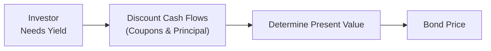

## 10.3 Determining the Prices of Debt Securities

Imagine you’re at your favorite coffee shop, chatting with a friend who just heard that bond prices always move in the opposite direction of interest rates. They’re curious how that actually works in real life. You take another sip of your latte, shrug, and dive into the explanation: “Well, let me try to break this down in plain English...” That’s precisely what we’re going to do in this section—explain how to price bonds and how those pesky interest rate movements factor in.

Before we begin, let’s briefly recall some important background from earlier discussions (see “How to Value Debt Securities” in this same chapter). When we talk about pricing bonds, we’re basically talking about determining the present value of all future cash flows (coupons and principal). These cash flows get discounted based on the investor’s required yield (also known as the discount rate). By the end of this write-up, you’ll have a solid understanding of how bond pricing works, why bond prices fluctuate, and what real-world applications look like.

The Pricing Formula in Practice
------------------------------

The general formula for determining the price P of a bond that pays an annual coupon and matures at par (face value) in n years is:

P = ∑ [Couponₜ ÷ (1 + r)ᵗ] + [Principal ÷ (1 + r)ⁿ]

Here:  
• Couponₜ is the coupon payment in year t.  
• r is the required yield or discount rate (annual basis).  
• Principal is the bond’s face or par value, which is typically paid back at maturity.  

If coupons are paid more frequently—let’s say semi-annually—then you adjust the formula accordingly:  
• Divide the annual coupon by 2 to get each semi-annual coupon payment.  
• Use r/2 in place of r for each discounting period.  
• Double the number of total periods (2n).  

Because many Canadian and U.S. corporate bonds pay semi-annually, practitioners carefully handle compounding frequency to ensure they’re using the correct discount rate and correct number of periods.

Factors Affecting Bond Prices
-----------------------------

It’s not enough to simply plug numbers into a formula. Real-world bond prices are subject to a variety of influences:

**Credit Risk**  
The creditworthiness of an issuer is paramount. If an issuer is considered lower-rated or riskier, investors insist on a higher yield to compensate. A higher required yield means those cash flows get discounted more heavily, which leads to a lower price. Conversely, safer issuers (think Government of Canada or major investment-grade corporations) have lower credit spreads and, as a result, higher bond prices for a given maturity.

**Interest Rate Movements**  
You’ve probably heard someone say: “When interest rates go up, bond prices go down.” Why? Because if new bonds are issued at higher yields, existing bonds paying lower coupons look less attractive, causing their prices to drop until they match current market conditions. When rates fall, the opposite happens: existing bonds with higher coupons become more appealing, so their prices rise.

**Inflation Expectations**  
Inflation erodes the purchasing power of fixed coupon payments. The higher the expected inflation, the less buying power you ultimately have from a stream of fixed bond payments. If investors predict inflation to spike, they’ll demand higher yields to keep their real returns intact, which pushes bond prices lower.

**Bond Features**  
Features like callability, convertibility, floating rates, or sinking funds can significantly affect how a bond is priced. A callable bond, which grants the issuer the right to redeem the bond before maturity, will generally trade at lower prices relative to a plain-vanilla bond because of the reinvestment risk (for the investor) and uncertainty around future coupon streams.

Worked-Out Example (Hypothetical)
--------------------------------

Let’s see how the pricing math works with a concrete example. Suppose we have:

• Face Value (Principal): $1,000  
• Annual Coupon: 5% of the face value  
• Maturity: 5 years  
• Required Yield: 6%  

The annual coupon is $1,000 × 5% = $50. Imagine you’ll receive this $50 at the end of each of the next 5 years, and then get your $1,000 principal repaid at the end of year 5. The discount rate we apply is 6% (r = 0.06, annual).

Thus, the present value (PV) of the coupons is:  
(1) $50 ÷ (1.06)¹ + $50 ÷ (1.06)² + $50 ÷ (1.06)³ + $50 ÷ (1.06)⁴ + $50 ÷ (1.06)⁵  

Meanwhile, the present value of the principal is:  
(2) $1,000 ÷ (1.06)⁵  

You sum these two components (1) + (2) to get the theoretical fair price of the bond. If your required yield changes to 7%, that discount rate is now higher, so the present value will shrink—meaning the bond’s price drops. If the required yield drops to 4%, it boosts the present values, and thus the bond’s price rises.

Quoted Price vs. Invoice (Dirty) Price
--------------------------------------

In many markets worldwide, including Canada and the U.S., the bond price that’s quoted in electronic trading platforms or newspapers is often the **clean price**. The actual price an investor pays, however, is the **dirty price** (sometimes called the **invoice price**). The dirty price takes the clean price and adds **accrued interest**—the interest that has accumulated since the last coupon payment but hasn’t yet been paid out.

Here’s a quick example:  
• Suppose a bond has a 5% coupon, paid semi-annually (2.5% every six months).  
• The clean price is $990.  
• There are two months of accrued interest since the last coupon payment.  

If the bond’s face value is $1,000, that means you’ve accrued 2/6 of the half-year 2.5% coupon on $1,000. So you compute two months of accrued interest on $25 (the half-yearly coupon), which is about $8.33. Then the invoice (dirty) price is $990 + $8.33 = $998.33. That’s the amount you’d pay if you settle the trade on that day.

Practical Application in a Trading Environment
---------------------------------------------

Bond trading desks blend art and science. Picture an institutional bond trader glancing at multiple screens packed with yield curve data, credit spreads, economic indicators, and—for Canadian bonds—information from the Bank of Canada’s latest rate announcements. Traders are also mindful of sector spreads; for instance, energy sector bonds might carry different spread patterns than tech or financial service bonds.

Simultaneously, portfolio managers juggle bond maturity ladders, reinvestment opportunities, and the broader strategic asset allocation. They will often:

• Compare observed market prices (or yields) with an internal calculation of fair value.  
• Look for opportunities where the bond appears underpriced relative to its risk profile.  
• Consider credit rating changes and interest rate outlooks in deciding whether to buy or sell.  

We can represent this synergy visually:

In real markets, specialized software and high-frequency data feeds from exchanges and data providers maintain up-to-the-moment valuations based on variations in yields, credit spreads, and liquidity conditions.

Glossary
--------

**Clean Price**: The quoted bond price, excluding accrued interest.

**Dirty Price (Invoice Price)**: The actual price the buyer pays. This includes accrued interest added to the clean price.

**Accrued Interest**: The interest that has built up since the last coupon payment but is not yet received by the bondholder.

**Credit Spread**: The difference in yield between a corporate or riskier bond and a comparable maturity, risk-free bond (like a Government of Canada bond). A higher spread reflects higher perceived risk.

Best Practices, Common Pitfalls, and Potential Challenges
---------------------------------------------------------

• **Best Practices**:  
  - Double-check your compounding frequency. Panic can set in if you price a bond using annual compounding but it’s actually paying coupons semi-annually.  
  - Carefully assess your yield assumptions—especially if you’re factoring in short-term rate changes or inflation expectations.  
  - Stay informed about regulatory requirements. The Canadian Investment Regulatory Organization (CIRO) sets the standards and rules that dealers should follow regarding transparency and investor protection.

• **Common Pitfalls**:  
  - Underestimating the effect of inflation on fixed interest rates.  
  - Overlooking call features or other embedded options that can lead to different risk/return profiles for investors.

• **Potential Challenges**:  
  - Volatile interest rate environments can make pricing a rollercoaster.  
  - Credit events or rating downgrades can sometimes happen much faster than expected, leaving you holding a bond that might be worth significantly less than you anticipated.

References and Additional Exploration
------------------------------------

• [Bank of Canada’s Credit Conditions](https://www.bankofcanada.ca/rates/indicators/) offers data on corporate bond spreads and many economic indicators influencing bond yields.  
• [CIRO guidance](https://www.ciro.ca/) is crucial for understanding Canada’s current regulatory framework for investment dealers and market integrity, particularly in debt markets. (Historical note: IIROC and MFDA were predecessor organizations that no longer exist as separate entities after amalgamation into CIRO on January 1, 2023.)  
• “Bond Markets, Analysis, and Strategies” by Frank J. Fabozzi provides deep dives into bond pricing, yield calculations, and myriad investment strategies.  
• [Investing in Bonds](http://www.investingbonds.com/) is an educational online resource with free bond pricing tools and market charts.  
• The [Canadian Investor Protection Fund (CIPF)](https://www.cipf.ca/) remains the sole investor protection fund for client assets if a broker or dealer fails.

Personal Anecdote to Inspire Learning
------------------------------------

Years ago, I watched a colleague accidentally calculate bond prices using an annual discount factor for a 10-year corporate bond that paid semi-annual coupons. When the trader realized the yield was off by a decent margin, I remember the flurry of “Wait, that’s not right…” exclamations. The moral of the story? Always ensure your compounding periods match the coupon payment schedule!

Encouragement for Further Learning
----------------------------------

The interplay between bond coupons, yields, credit spreads, and changing market conditions is actually quite fascinating—like a puzzle. Once you start piecing it together, you’ll see how everything interconnects. You also get a deeper sense of how interest rate policies or central bank announcements can ripple through capital markets. In my opinion, bond pricing is one of the best gateways for anyone serious about mastering investment management. Keep practicing real or hypothetical calculations, consult multiple sources, and stay curious about the “why” behind pricing swings.

Remember, learning bond math might take a few tries to fully click, but once it does, you’ll never look at these debt instruments the same way again. And hey—you might even find yourself explaining this stuff to someone else at a coffee shop someday.

## Test Your Knowledge: Bond Pricing Essentials



### Which of the following best represents the general formula for the price of a bond paying annual coupons?
- [ ] Price = Coupon × Number of Years + Principal
- [ ] Price = (Coupon ÷ (1 + r)) + Principal
- [x] Price = ∑ [Couponₜ ÷ (1 + r)ᵗ] + [Principal ÷ (1 + r)ⁿ]
- [ ] Price = Coupon × r × Maturity

> **Explanation:** The bond price formula is the present value of all coupon payments plus the discounted principal at maturity.

### If a bond is quoted at a clean price of $1,015 and has accrued interest of $12, what is the invoice (dirty) price?
- [ ] $1,003
- [ ] $1,015
- [x] $1,027
- [ ] $1,003 + $12 × 2

> **Explanation:** The dirty price (or invoice price) is the clean price plus accrued interest: $1,015 + $12 = $1,027.

### How does a callable feature typically affect a bond’s price?
- [x] It usually causes the bond’s price to be lower compared to a non-callable bond
- [ ] It does not affect the bond’s price at all
- [ ] It typically increases the bond’s price significantly
- [ ] It sets the price always at par

> **Explanation:** Because the issuer can call the bond early, there is additional reinvestment risk for the investor, generally resulting in lower bond prices.

### What happens to the price of an existing 5% coupon bond if market interest rates suddenly rise to 7%?
- [ ] The bond’s price will rise
- [ ] The bond’s price will remain the same
- [x] The bond’s price will drop
- [ ] The bond’s coupon payment will change from 5% to 7%

> **Explanation:** When new bonds offer higher yield, existing bonds’ prices adjust downward so that their yields align more closely with the new market rate.

### When calculating a bond’s price with semi-annual coupons, which of the following adjustments is needed?
- [x] Divide the annual coupon by 2 and use r/2 for the discount rate
- [ ] Double the annual coupon and use r × 2 for the discount rate
- [ ] Keep the annual coupon the same but move to a shorter maturity
- [ ] Ignore compounding frequency

> **Explanation:** Semi-annual coupon bonds require you to split both the coupon and the discount rate to reflect two periods per year.

### What is one common pitfall when pricing bonds?
- [x] Using annual discounting for a bond paying semi-annual coupons
- [ ] Accurately recognizing the bond’s face value
- [ ] Accounting for the bond’s would-be maturity
- [ ] Overestimating accrued interest

> **Explanation:** A widespread error is mismatching the discount frequency with the coupon payment schedule, leading to incorrect pricing.

### If inflation expectations rise, what typically happens to bond prices as a result?
- [x] They decrease
- [ ] They increase
- [ ] They remain unchanged
- [ ] They eliminate coupon payments

> **Explanation:** Rising inflation expectations erode the real return on fixed-income securities, prompting investors to demand higher yields, which then drives bond prices down.

### Which of the following statements about credit risk is correct?
- [ ] Higher credit risk usually leads to lower yields
- [x] Higher credit risk typically requires higher yields
- [ ] Credit risk has no effect on government bond yields
- [ ] Credit risk only applies to equity securities

> **Explanation:** Investors demand additional yield (a risk premium) to compensate for the possibility of default, so higher credit risk equates to higher yields (and lower bond prices).

### Which best describes the “dirty price” of a bond?
- [ ] The quoted price with all taxes included
- [x] The quoted price plus accrued interest
- [ ] The quoted price minus accrued interest
- [ ] The net asset value of the bond

> **Explanation:** The dirty price (or invoice price) is the clean price plus accrued interest, which is what you actually pay at settlement.

### True or False: “Term to maturity” and “duration” always refer to the same concept in bond pricing.
- [x] False
- [ ] True

> **Explanation:** Maturity is how many years remain until the bond’s final principal payment. Duration, however, is a measure of sensitivity to interest rate changes and includes the timing of all coupon payments in its calculation.


