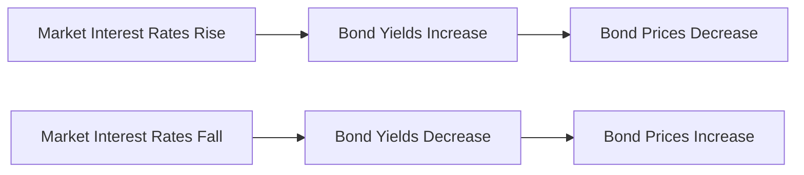
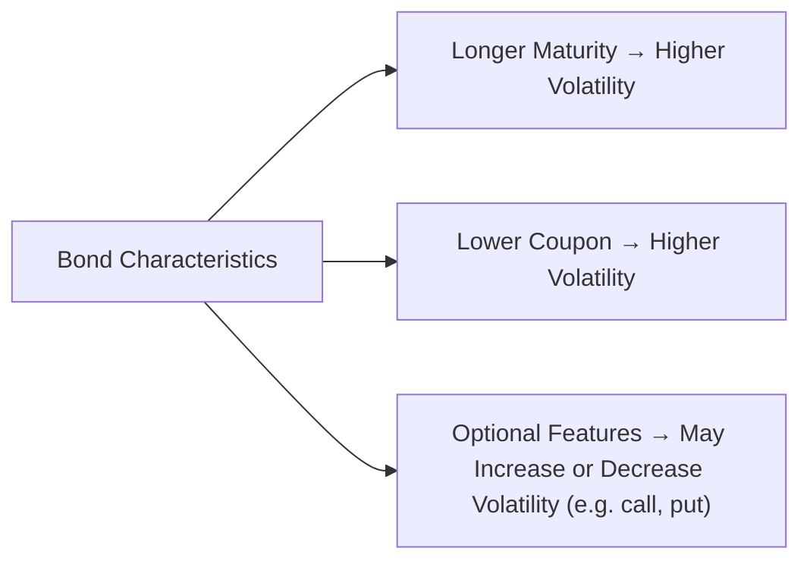
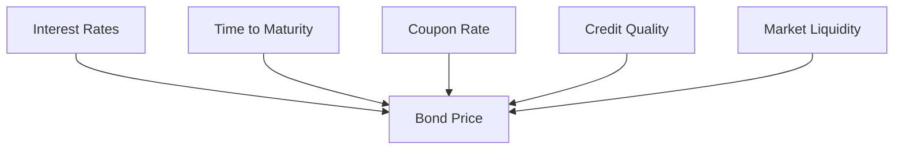

## 11.1 Understanding Bond Price Volatility

Sometimes, the bond market can feel like a calm pond—everything looks still and predictable. Other times, it’s as if someone threw a giant rock into that pond, causing big ripples in prices everywhere. Those ripples? They’re basically bond price volatility in action. In this section, we’ll explore what causes those ripples—interest rate changes, credit concerns, and all sorts of other factors—and show how you can track, predict, and (hopefully) use them to your advantage when building and managing a portfolio. By the end, you’ll better appreciate how even the most “boring” part of the market can become surprisingly dynamic.

### Introduction

If you recall from earlier chapters on debt securities (see Chapter 9) and from your risk profiling explorations (see Chapter 2), bonds have a reputation for being relatively stable compared to equities. After all, bondholders are usually promised a fixed stream of coupon payments and a return of principal at maturity. But even the most rock-solid government bonds are subject to price changes in the secondary market, and these fluctuations can be significant.

I remember the first time I invested in a longer-term bond. I thought, “Ah, well, it’s guaranteed by the government. Nothing much should happen, right?” Then there was a sudden shift in interest rates, and the price of my bond dropped more than I expected. The lesson was simple: even a safe issuer can’t protect you from changes in interest rates or market sentiment.

Let’s unpack the term “bond price volatility” in plain language. Essentially, volatility is just a fancy way of describing how much the bond’s price goes up or down over time. A bond that rarely changes in price has low volatility; one that can sometimes swing wildly has high volatility. And yeah, in bond land, “swinging wildly” might be smaller in magnitude than it is for stocks, but if you care about your portfolio’s value, these smaller swings can still matter quite a bit.

### The Concept of Bond Price Volatility

Bond price volatility refers to the sensitivity of a bond’s market price to changes in various external and intrinsic factors. In many ways, it’s similar to the volatility you see in equities or commodities—but bonds have their own distinct drivers:

• Interest Rate Movements: Changes in market interest rates are typically the biggest factor.  
• Time to Maturity: Typically, the longer the term, the more a bond’s price will move.  
• Coupon Rate: The lower the coupon, the more sensitive the bond tends to be to rate changes.  
• Credit Quality: A downgrade in an issuer’s credit rating can send bond prices tumbling, even if interest rates don’t move.  

To give you a mental model, here’s a simple irony: if you’re holding a long duration, low-coupon bond in a rising interest rate environment, the bond’s price can really dip. On the other hand, a shorter duration, higher-coupon bond tends to have lower price sensitivity to the same rate changes.

### The Key Driver: Interest Rate Risk

Interest rate risk is the phenomenon that most frequently affects bond prices. Because bond coupons are generally fixed, when interest rates in the broader market go up, the value of those old, lower coupons becomes less appealing—people would rather buy new bonds with higher coupons, so the price of existing bonds must adjust downward to remain competitive.

Conversely, when market interest rates drop, your older, higher-coupon bond looks more attractive, and its price moves upward. This inverse relationship is a cornerstone of the bond market.

Below is a simple Mermaid diagram illustrating the inverse relationship between bond prices and interest rates:

In everyday terms: If bank deposit rates (or other market rates) rise, your old bond’s coupon might look quaint in comparison. To entice new buyers, the bond’s market price has to drop. And if rates fall, the opposite happens.

### The Influence of Bond Characteristics

Three key bond characteristics play a notable role in determining how a bond’s price might shift:

• Time to Maturity: Longer-term bonds generally have higher price volatility. The “end game” for many of these concepts is captured by a metric known as “duration” (discussed more deeply in the next section). But keep in mind that a 30-year bond will “feel” interest rate shifts in a more pronounced way than, say, a 1-year T-bill.  
• Coupon Rate: Lower-coupon bonds typically exhibit greater volatility. Imagine you hold a zero-coupon bond (which pays no coupons and only redeems face value at maturity). A small change in yields can dramatically affect its price, because all the bond’s cash flows are far in the future. Conversely, a high-coupon bond that pays a generous interest rate isn’t as impacted by small changes in prevailing rates.  
• Embedded Options: Bonds with built-in features—like a callable bond (issuer can repay early) or puttable bond (holder can sell it back early)—can also have different volatility characteristics. Callable bonds might appreciate less in a falling rate environment because of the risk that the issuer will call them.

Here’s a general representation of how certain features affect sensitivity:

### The Impact of Credit Quality

Now, let’s say your bond’s issuer is Government of Canada. The credit risk is usually minimal, so changes in interest rates drive most of the action. But if your bond’s issuer is a corporation whose credit might be in question, watch out. A credit-rating downgrade (or the mere possibility of one) can push prices down quickly. That’s especially true in uncertain economic conditions.

Even if interest rates remain flat, a big shift in perceived default risk can overshadow all other factors. And ironically, if the broader market is in a panic, even “safe” high-grade corporate bonds can be sold off temporarily—if investors choose to flee to shorter maturities or risk-free government issues. This is often called a “flight to quality” scenario.

### Tying It All Together

If you want a single sentence to take away from all this, it might be: “Bond price volatility is primarily driven by interest rates, but maturity, coupon, and credit quality all combine to shape how dramatic those price swings can be.” Understanding these relationships is crucial for constructing bond portfolios that match client goals and risk tolerances.

And it’s not just theoretical. Knowing how a bond’s price behaves when rates fluctuate (or if a credit concern arises) can help advisors pick the right bond for the right scenario. If your client hates the idea of big price swings, you might steer them toward shorter-term, higher-coupon, or high-quality credits. If they’re comfortable with some volatility and are seeking higher potential yields, longer maturity or lower credit quality might be on the table—though that obviously comes with bigger risks.

### Practical Examples of Bond Price Volatility

Let’s walk through a quick scenario. Suppose you purchase a bond paying a 3% coupon semi-annually. It has 10 years until maturity. Overnight, the central bank announces an unexpected rate hike. The newly issued 10-year government bond is now yielding 4%. Investors look at your old 3% bond and say, “Why would I buy that unless it’s cheaper?” So, your existing bond might drop in price to yield 4%, too. If you hold the bond until maturity, you’ll still get the par value back and your 3% coupon along the way—but if you decide to sell it right after that rate hike, you’ll be dealing with a lower market price.

Another real-world consideration: If the issuer’s credit rating is downgraded, the market might demand a 5% (or higher) yield on the same bond. That would push its price even lower. Now you’re not only facing interest rate risk but also credit risk. This dual wave can produce a bigger effect than one factor alone.

On the flip side, if interest rates decline (say, from 3% to 2%) and your bond still offers a 3% coupon, your bond’s price will rise, because potential buyers will want that higher coupon stream. The result? You might choose to sell at a profit or keep collecting your generous (by comparison) coupons.

### Real-World Observations

Bond price volatility—like everything else in financial markets—is also impacted by behavioral finance, macroeconomic indicators, and liquidity conditions. Even with the same fundamental interest rate environment, changes in investor sentiment can cause bond volatility to spike from time to time. The phenomenon isn’t entirely rational. That’s why it’s important not to rely solely on theoretical models but also to monitor market conditions, such as:

• Yield Curve Shifts: The yield curve can flatten, steepen, invert, or undergo a parallel shift. Each scenario affects bond prices differently.  
• Economic News: Reports on inflation, GDP growth, and employment can shape rate-hike expectations, which in turn feed directly into bond pricing.  
• Central Bank Signals: In Canada, the Bank of Canada’s policy meetings and official statements can have a big influence on market interest rates.  
• Liquidity Conditions: During times of stress, even high-quality bonds can experience price disruptions due to forced selling or flight to safety.

### Tools and Resources

Bond volatility can definitely feel a bit tricky to pin down at first, so you might want to explore tools that help quantify it, such as:

• Duration and Convexity Measures: Discussed in the next section (11.2), these are powerful metrics that give you a rough approximation of how much a bond’s price might change for a given shift in interest rates.  
• Yield Curve Analytics: Publicly available from central banks or from financial data providers. The Bank of Canada (https://www.bankofcanada.ca) offers daily yield curve data that can help you track how rates change across different maturities.  
• Credit Rating Publications: Check the major rating agencies. Changes in ratings or watchlists can clue you in to possible bond price drops or gains in the near future.  
• QuantLib (https://www.quantlib.org): An open-source library that can help you build custom bond-pricing models, measure volatility, and run scenario analyses.  
• Regulatory Guidance: The Canadian Investment Regulatory Organization (CIRO) (https://www.ciro.ca) offers guidelines on compliance, risk management, and best practices for dealing in debt. Historically, regulations existed under the defunct MFDA or IIROC, but all relevant materials have been consolidated under CIRO since 2023.

### Best Practices for Advisors

When you’re advising clients who want to include bonds in their portfolio, consider these steps:

• Assess Risk Tolerance Thoroughly: If your client can’t handle price swings, use shorter maturities or high-grade bonds to limit volatility.  
• Diversify: Spread bond holdings across different maturities, issuers, and credit qualities. Diversification can lower overall portfolio risk.  
• Keep an Eye on Credit Trends: For corporate bonds, track any changes in the issuer’s business model or financial statements that could prompt a rating downgrade.  
• Monitor Macroeconomic Indicators: Anticipate interest rate changes by following the Bank of Canada’s announcements or broader global interest rate trends.  
• Revisit the Portfolio: Bonds aren’t “set it and forget it” instruments. Regularly review portfolio duration, yield, and sector exposures.  
• Use Hedging Tools: If a client wants to hold a bond but is worried about rate spikes, you can discuss derivatives such as interest rate swaps or futures. But keep in mind the complexity and cost of such hedges.

### Potential Pitfalls

It’s easy to fall into these common traps when navigating bond price volatility:

• Overlooking the Impact of Rising Yields: Some investors get blindsided by how quickly a bond’s price can drop if yields spike, especially for longer durations.  
• Ignoring Credit Risk: Even “investment-grade” issuers can face crises. Don’t just look at the coupon; pay attention to the underlying credit metrics.  
• Chasing Yield: A high yield might look tempting, but it often comes with significant credit or duration risk that can lead to painful volatility down the line.  
• Failure to Monitor Secondary Market Liquidity: Some bonds trade thinly, making it hard to sell at a fair price.  
• Neglecting Macroeconomic Warnings: If central banks hint at consecutive rate hikes, that can create a chain reaction across fixed-income markets.

### Personal Reflections

I’ll never forget one instance a few years ago when I recommended a corporate bond to a friend. At the time, the coupon looked fantastic compared to government bonds. But then the issuer got caught up in legal woes and faced a rating downgrade. The bond’s price took a steep dive within a matter of days. It was my wake-up call: bond investing isn’t just about the coupon or the yield; I had to tune in to overall credit exposure and potential volatility. While my friend eventually made back some losses as the company restructured, it was a bumpy ride. That experience underscored the importance of doing thorough research and being realistic about risk appetite.

### Diagram: Factors Affecting Bond Price Volatility

Here’s a Mermaid diagram that summarizes multiple factors:

Each of these arrows represents a push or pull factor that can cause bond prices to fluctuate day by day (or even minute by minute on busy trading desks).

### Conclusion

Bond price volatility isn’t something to be feared; it’s part of the natural ebb and flow of fixed-income markets. Without volatility, there’d be no trading opportunities, no capital gains, and arguably no dynamic mechanism that sets market prices. However, if you don’t understand what drives it, you can find yourself staring at an unexpected capital loss on a bond you thought was “totally safe.”

For investment advisors, a solid grip on the mechanics of volatility paves the way for informed conversations with clients. When you can explain how factors like coupon rates, term to maturity, and credit quality interplay with the broader interest rate environment, you build client trust and confidence. It’s also the cornerstone for more sophisticated strategies—like protective duration management, bond laddering, or active trading based on macroeconomic signals.

If you’re aiming for a deeper dive, check out “The Handbook of Fixed Income Securities” by Frank J. Fabozzi or explore the resources from the CFA Institute (https://www.cfainstitute.org). For official Canadian regulations and guidelines, be sure to visit the Canadian Investment Regulatory Organization (CIRO) website at https://www.ciro.ca and review the latest updates from the Bank of Canada (https://www.bankofcanada.ca) and the Canadian Securities Administrators (https://www.securities-administrators.ca).

We’ll continue our discussion on this topic in the next sections of Chapter 11, where we’ll explore the concepts of duration and convexity (11.2), and investment strategies (11.3) that can help you manage or embrace bond price volatility in your portfolio.

---

## Test Your Knowledge: Bond Price Volatility Quiz



### Which factor is typically the primary driver of bond price volatility?

- [ ] Credit risk
- [x] Interest rate risk
- [ ] Liquidity risk
- [ ] Inflation risk

> **Explanation:** While all these factors influence bond prices, changes in market interest rates usually have the most immediate and significant impact on bond price swings.

### What generally happens to the price of an existing bond if market interest rates increase?

- [x] The bond’s price decreases
- [ ] The bond’s price increases
- [ ] The bond’s price remains the same
- [ ] The bond’s price fluctuates but then always returns to par

> **Explanation:** When interest rates rise, newer bonds typically offer higher coupons, so existing bonds with lower rates need to drop in price to stay competitive.

### Which type of bond typically exhibits the highest price volatility, all else being equal?

- [ ] A one-year high-coupon bond
- [ ] A five-year zero-coupon bond
- [x] A 30-year zero-coupon bond
- [ ] A 10-year high-coupon bond

> **Explanation:** Longer maturity and lower coupon rates both increase a bond’s price sensitivity to interest rate changes. Zero-coupon, long-term bonds are especially sensitive.

### Why does a credit downgrade generally lead to a drop in bond price?

- [ ] Investors expect interest rates to fall.
- [ ] The coupon rate automatically changes.
- [x] The issuer is perceived as riskier, requiring higher yields.
- [ ] Regulatory bodies force the bond price down.

> **Explanation:** A downgrade signifies higher default risk. Investors demand a higher required return (yield), which translates into a lower bond price.

### Which of the following best explains the inverse relationship between bond yields and bond prices?

- [ ] As bond prices rise, investors demand higher yields.
- [x] When market yields rise, existing bonds’ coupons become less attractive, so prices fall.
- [ ] Yields and prices move together because they both depend on the coupon rate.
- [ ] Yields and prices only move inversely in high-inflation periods.

> **Explanation:** If new bonds are issued at higher rates, existing lower-coupon bonds must decrease in price to offer an equivalent yield to new buyers.

### How does a “flight to quality” usually affect bond price volatility?

- [x] It can increase volatility, especially if investors unload lower-grade bonds en masse.
- [ ] It has no impact on bond prices.
- [ ] It only stabilizes high-yield bonds.
- [ ] It only affects ultra-short-term bonds.

> **Explanation:** During market stress, many investors sell riskier assets (including lower-grade bonds) and buy safer assets (like government bonds). This shift can create volatility in bond markets.

### Which of the following bond characteristics tends to reduce price sensitivity to interest rate changes?

- [ ] Long time to maturity
- [x] High coupon rate
- [ ] Low credit quality
- [ ] Zero-coupon structure

> **Explanation:** A higher coupon rate provides more of the bond’s return up front, reducing the impact of future rate fluctuations on the present value of those payments.

### If a bond’s price is currently higher than its face value, what is most likely true?

- [x] Its coupon rate is higher than the current market yield.
- [ ] Its coupon rate is exactly equal to current market yield.
- [ ] It has never paid a coupon.
- [ ] Its issuer has poor credit quality.

> **Explanation:** When a bond’s coupon rate exceeds the prevailing market rate, the bond becomes more attractive, and investors are willing to pay more than the bond’s face value.

### Which regulatory organization currently oversees the activities of Canadian investment dealers and mutual fund dealers?

- [ ] The Mutual Fund Dealers Association (MFDA)
- [ ] The Investment Industry Regulatory Organization of Canada (IIROC)
- [x] The Canadian Investment Regulatory Organization (CIRO)
- [ ] Provincial securities commissions only

> **Explanation:** Effective 2023, MFDA and IIROC were amalgamated into CIRO, which acts as the national self-regulatory body for Canadian investment and mutual fund dealers.

### True or False: An unexpected announcement by the Bank of Canada to lower interest rates generally causes the prices of existing bonds to rise.

- [x] True
- [ ] False

> **Explanation:** When central banks lower rates, the yields on newly issued bonds also tend to drop, making existing bonds with higher coupons relatively more attractive—and thus more valuable in price.


