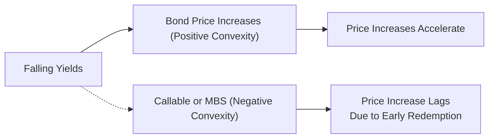
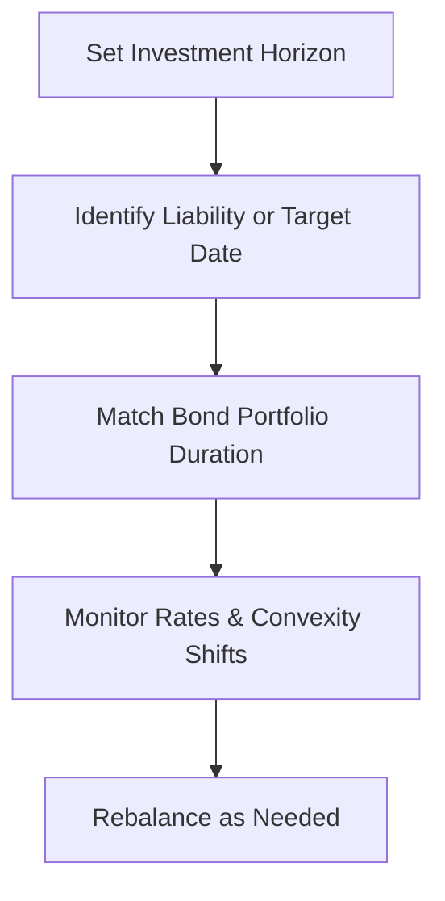

## 11.2 Duration and Convexity

When I was a kid, I remember lending money to a friend—just a few dollars, really. We agreed that I’d charge a small “interest” if he didn’t pay me back in a week. That seemed simple enough, but timing turned out to be crucial: if he repaid early, it felt like I earned less; if he took longer, it felt riskier, and I wondered how much I was really “earning.” Fast forward to my first finance class, and I discovered something that made that whole lending dynamic feel very grown-up: duration. It’s all about how changing interest rates affect the price of bonds you hold. And the concept gets even richer once we add a notion called convexity to the mix.

There’s a lot to cover here, and we’ll keep things slightly casual but still thorough. Let’s dive into these two powerful tools for analyzing bond price volatility: duration and convexity. By the end, you’ll see how portfolio managers and financial advisors in Canada—and beyond—use these measures to manage interest rate risk, build robust strategies, and stay within regulations set by the Canadian Investment Regulatory Organization (CIRO).

Duration is a bedrock concept in fixed-income investing; it measures how sensitive a bond’s price is to changes in interest rates, focusing on the weighted average timing of future cash flows. Convexity, on the other hand, refines that measurement by modeling the curvature in the price-yield relationship. Let’s walk step by step.

### Why Duration Matters

Duration is often described as the “weighted average time” it takes to get your investment back from a bond’s cash flows. If that idea sounds a bit abstract, think of it like figuring out how quickly you recoup your purchase cost through coupon and principal payments. The longer it takes, the more exposed you are to shifts in interest rates.

Moreover, regulators and seasoned professionals, including advisors working under CIRO guidelines, frequently check the duration of bond portfolios to gauge interest rate risk. Canada’s regulatory framework emphasizes clear risk disclosures and alignment of products with clients’ risk profiles. And that’s where duration is so helpful: it translates a somewhat fuzzy concept (interest rate risk) into a concrete number.

### Macaulay Duration

Macaulay Duration is the original formula—like the classic “grandparent” of other duration measures. It’s based on the present value of coupon and principal payments. Below is a canonical formula (in KaTeX) for Macaulay Duration, which we’ll denote as D:


D = \frac{\sum_{t=1}^{T} t \times \frac{CF_t}{(1 + y)^t}}{\sum_{t=1}^{T} \frac{CF_t}{(1+y)^t}}


where  
- \\( t \\) is the time period (e.g., years),  
- \\( CF_t \\) is the coupon or principal payment at time \\( t \\),  
- \\( y \\) is the yield per period, and  
- \\( T \\) is the total number of periods until final maturity.

Think of each \\( t \times CF_t \\) as a small signpost that indicates how much money you get at each point in time, discounted by the bond’s yield. The longer the bond or the smaller the coupon, the higher the duration. Because, well, if it takes forever to get your cash flows, your bond is going to be more sensitive to interest rate changes.

### Modified Duration

Macaulay Duration is a handy measure, but it’s not always easy to interpret it directly as a percentage change in price for a given change in interest rates. That’s why we use Modified Duration:


\text{Modified Duration} = \frac{D}{1 + y}


In plain English, Modified Duration approximates the percentage change in a bond’s price for a 1% (or 100 basis point) change in yields. If the Modified Duration is 5, then we can say (roughly) that if yields increase by 1%, the bond’s price will drop by about 5%. The flip side is also (approximately) true: if yields fall by 1%, the bond’s price should rise by about 5%, assuming no other changes.

### Effective Duration

Now, real life rarely matches the tidy assumptions behind Macaulay and Modified durations. Bonds can have all sorts of embedded features—calls, puts, convertible options—that allow either the issuer or holder to change the timing or the amount of cash flows. A standard measure to capture that optionality risk is known as Effective Duration.

Effective Duration is calculated by shocking the bond’s yield curve up and down by a small amount and seeing how its price changes under each scenario. This approach factors in changes to expected maturity and cash flows due to possible early calls, redemptions, or conversions. If you’re handling, say, a mortgage-backed security (MBS) or a callable corporate bond, you’ll rely heavily on Effective Duration.

CIRO guidelines and the Canadian Securities Administrators (CSA) strongly encourage transparency around these embedded features. If an advisor is recommending a callable bond to a retiree, it’s critical to measure that bond’s Effective Duration for a realistic estimate of interest rate risk—and to consider how that might impact the retiree’s cash flow under different interest rate scenarios.

### Putting It All Together with a Quick Example

Imagine you have two bonds:  
• Bond A: A plain vanilla 10-year government bond with semiannual coupons at 3%.  
• Bond B: A 10-year callable corporate bond also offering a 3% coupon, but the issuer can redeem it if rates drop below 2%.  

If you only calculated Macaulay Duration and paraded it around as the entire story, you’d be missing something big: the call feature in Bond B makes it more likely that your juicy coupon might vanish if yields slide. That drastically changes your interest rate sensitivity compared to Bond A. Use Effective Duration for Bond B, and you’ll see a lower duration value precisely because that call feature can reduce your upside potential if rates fall significantly.

### Refining Our Understanding with Convexity

If duration is about the slope (the first derivative of price with respect to yield), then convexity is about the curvature (the second derivative). Let’s say you have a bond that has a duration of 5, meaning for small changes in yield, you expect the bond’s price to move in the opposite direction by about 5%. But yields can swing by larger amounts than just 1%. Convexity helps to refine that estimate by incorporating the non-linear relationship between bond prices and yields.

• Positive Convexity: Typical of most conventional bonds. It means that if yields fall, your bond’s price rises at a faster rate (and if yields rise, your bond’s price falls at a slower rate). Price changes accelerate in your favor when yields are declining.  
• Negative Convexity: Common in callable bonds or mortgage-backed products, where you don’t fully benefit when rates drop. This usually happens because the bond might get called away (or the homeowners refinance), capping your upside.

In a more graphical sense, you can see these divergences as yields move further away from the original purchase yield. Let’s show it in a small diagram:

When the bond invests in instruments with positive convexity, you benefit more if rates go down than you lose if rates go up by the same amount (everything else being equal). Negative convexity flips that advantage in certain yield environments.

### How Advisors Use Duration and Convexity

Advisors and portfolio managers in Canada often use an “immunization” approach for pension funds, endowments, or individuals who have a very strict time horizon. The goal is to match the duration of the assets to the duration of the liabilities or the investor’s horizon in such a way that changes in interest rates do not significantly affect the portfolio’s value at the target date.

Here’s a tiny demonstration of the concept:

This strategy is often taught in finance programs—and you can see it in action through open-source libraries like QuantLib (https://www.quantlib.org), which has robust modules for calculating durations, convexities, and for running “scenario analyses” to see how your bond position might behave in shifting yield environments.

Convexity plays a more subtle but equally important role. Even if you have matched durations, you need to consider how price changes accelerate or decelerate with big interest rate moves. If you’ve got a big chunk of your portfolio in callable securities, negative convexity can mean your carefully constructed immunization strategy might not hold up perfectly if rates plummet.

### Practical Adventures in Duration and Convexity

- Asset Liability Management (ALM): Insurance companies and pension funds in Canada frequently incorporate duration and convexity matching to handle their long-term liabilities. They might mix corporate, provincial, or federal bonds to shape their portfolio’s overall convexity.  
- Debt Market Trading Mechanics: Remember that if you’re trading in the Canadian debt market, you’re operating under CIRO’s rules and Market Integrity requirements. Tools like the Bank of Canada Yield Curve data (https://www.bankofcanada.ca/rates/interest-rates) help you check the shape of the yield curve. Then you can gather reference yield levels to refine your duration and convexity calculations.  
- Risk Budgeting for Private Clients: Advisors might set a “risk budget” for interest rate movements, meaning they decide how much of the portfolio’s total risk can come from duration. If you want to limit large drawdowns, you shorten your duration or layer in instruments with positive convexity, like standard government bonds.  
- Stress Testing: With the help of Effective Duration, you can see how an embedded put or call might get triggered if rates cross a certain threshold. A big part of the CSA’s regulatory developments on debt instruments (https://www.securities-administrators.ca) focuses on ensuring that advisors adequately stress-test portfolio outcomes for clients.

### Negative Convexity Woes

The promise of a high coupon might initially lure investors into callable bonds. But if yields dive and the issuer redeems the bond early, you’re left with reinvestment risk. That’s the heartbreak of negative convexity: you enjoy some price appreciation but not the full potential. Mortgage-backed securities can be even trickier because homeowners might prepay mortgages en masse when interest rates drop, drastically cutting the bond’s cash flows and forcing you to reinvest at a lower rate.

In any product’s official disclosures, or in the marketing materials under CIRO compliance, you’ll typically see disclaimers that “Early redemption may affect income” or “Negative convexity risk is present.” This is a heads-up to read the fine print, run some scenario analyses, and figure out your comfort level with a security that might not behave like a plain old government bond.

### Best Practices and Pitfalls

• Best Practice #1: Always use the right type of duration measure. If you’re analyzing a bond with no embedded options, Modified Duration is typically good enough. For an option-laden bond, Effective Duration is your friend.  
• Best Practice #2: Keep your eye on convexity. Duration alone can underestimate (or overestimate) price changes when rates move substantially.  
• Best Practice #3: Don’t rely on a single point of yield change. Running scenario analyses with multiple interest rate shifts is key.  
• Pitfall #1: Ignoring the call or put feature. This can lead to nasty surprises if rates move in your favor, and you get that early redemption.  
• Pitfall #2: Maintaining the same bond allocation in drastically changing interest rate environments without re-checking your portfolio’s duration.  
• Pitfall #3: Overestimating the value of negative convexity. Some folks assume the yield advantage is guaranteed. It’s not—once rates decline, your high-yield bond could be called away.  

### Regulatory and Institutional Context

The old days of referring to IIROC or the MFDA are gone; those organizations amalgamated into the Canadian Investment Regulatory Organization (CIRO) effective June 1, 2023. CIRO is now Canada’s national self-regulatory body for investment dealers and mutual fund dealers, and it ensures advisors follow thorough due diligence when recommending fixed-income products.

You’ll also see references to the Canadian Investor Protection Fund (CIPF), which stands guard if a member firm goes insolvent. From a regulatory vantage point, so long as you comply with suitability and disclosure requirements—and carefully document your recommended strategies—CIRO guidelines generally offer decent guidance on the permissible ways to measure, manage, and disclose interest rate risk. For official updates or external references, head to https://www.ciro.ca.

### Tools, Frameworks, and Additional References

• CIRO Bond Pricing and Risk Management Guidelines: https://www.ciro.ca  
• Bank of Canada Yield Curve Data: https://www.bankofcanada.ca/rates/interest-rates  
• CSA’s Regulatory Developments on Debt Instruments: https://www.securities-administrators.ca  
• QuantLib Library Examples: https://www.quantlib.org (wonderful if you’re into coding your own models)  
• “Fixed Income Analysis” by CFA Institute (a classic text that devotes significant space to duration, convexity, and embedded options)

### Final Thoughts

Duration and convexity might sound like airy concepts, but trust me, they’re life-savers if you want to manage your bond portfolio effectively. They keep you from being blindsided by interest rate swings, and they help you figure out which bonds to hold in uncertain markets. Overlooking them can lead to big regrets—just as ignoring that friend’s repayment pattern once led me to lose track of the “interest” he owed me!

In day-to-day practice, watch your portfolio’s average duration and the overall convexity profile. If you spot negative convexity in big chunks of your bond investments, see how that might limit your upside or disrupt your timing. Run stress tests, look for changes in the market yield curve, and stay tuned to CIRO’s guidelines. Before you know it, you’ll craft a bond strategy that can handle the ups and downs of ever-changing interest rates—and keep your clients (and you) sleeping more peacefully at night.

---

## Test Your Knowledge: Duration and Convexity Essentials



### Which of the following best describes Macaulay Duration?
- [ ] A measure of the bond’s credit risk relative to government benchmarks.
- [x] A weighted average time until the bond’s cash flows pay back its original cost.
- [ ] The final maturity date of the bond.
- [ ] The legal schedule for coupon payments.

> **Explanation:** Macaulay Duration is the weighted average time to receive the bond’s cash flows, reflecting the point at which your initial investment is, on average, recovered.

### Which duration measure best accounts for embedded options in fixed-income securities?
- [ ] Macaulay Duration
- [ ] Modified Duration
- [x] Effective Duration
- [ ] None of the above

> **Explanation:** Effective Duration captures the effect of changes in cash flows that result from embedded options like calls or puts.

### What is the typical impact on a callable bond’s price when market yields fall substantially?
- [ ] The bond’s price increases faster than a non-callable bond.
- [ ] The bond’s price remains entirely unaffected.
- [ ] The bond’s price decreases significantly.
- [x] The bond’s price rise is capped due to potential early redemption.

> **Explanation:** Callable bonds exhibit negative convexity; their price appreciation is limited because the issuer may redeem the bond to save on interest costs.

### How do portfolio managers commonly use duration for immunization strategies?
- [ ] They buy only zero-coupon bonds.
- [ ] They focus on stocks rather than bonds.
- [x] They match the portfolio’s average duration to the investor’s time horizon.
- [ ] They avoid all bonds with durations longer than one year.

> **Explanation:** Immunization aligns the portfolio duration with a target horizon so that interest rate movements minimally affect the final portfolio value at that date.

### Which of the following tends to have positive convexity?
- [ ] Mortgage-backed securities
- [x] Traditional, non-callable corporate bonds
- [ ] Callable bonds
- [ ] All bonds with embedded options

> **Explanation:** Conventional, non-callable bonds typically exhibit positive convexity, meaning their price increases accelerate when yields drop.

### If a bond has a Modified Duration of 6, how much would its price approximately change for a 1% increase in yield?
- [ ] +6%
- [ ] +1%
- [x] -6%
- [ ] -1%

> **Explanation:** A bond’s price and yield move inversely; with a Modified Duration of 6, a 1% increase in yield implies about a 6% drop in price.

### Which scenario illustrates negative convexity?
- [ ] A government bond with a fixed coupon.
- [ ] A corporate bond with no call options.
- [x] A mortgage-backed security subject to early prepayment.
- [ ] A zero-coupon bond issued by the federal government.

> **Explanation:** Negative convexity arises when cash flows can change in ways that reduce price appreciation, such as homeowners prepaying mortgages when rates drop.

### What is the main reason Effective Duration is more accurate than Modified Duration for bonds with embedded options?
- [ ] It is regulated by CIRO.
- [ ] It calculates coupon reinvestment rates.
- [x] It adjusts for changes in coupon or principal cash flows triggered by option exercise.
- [ ] It is a simpler approach requiring fewer inputs.

> **Explanation:** Effective Duration captures the possible shift in cash flows from calls, puts, or other embedded features, making it more accurate for these securities.

### Which organization oversees investment dealer and mutual fund dealer regulation in Canada (as of 2025)?
- [x] CIRO
- [ ] IIROC
- [ ] MFDA
- [ ] CIPF

> **Explanation:** The Mutual Fund Dealers Association of Canada (MFDA) and the Investment Industry Regulatory Organization of Canada (IIROC) no longer exist as separate entities; they amalgamated into the Canadian Investment Regulatory Organization (CIRO).

### True or False: Positive convexity means a bond’s price rises at a faster rate as yields decrease and falls at a slower rate as yields increase.
- [x] True
- [ ] False

> **Explanation:** Positive convexity improves the bond holder’s price appreciation when rates drop and moderates price decline when rates rise.


