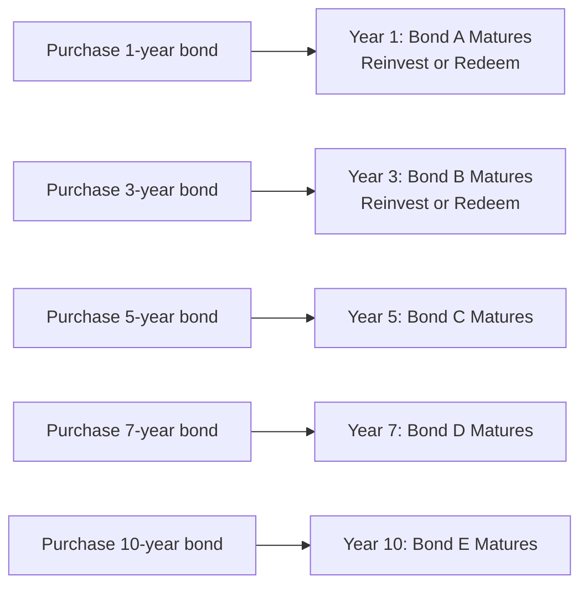

## 11.3 Investment Strategies for Managing Bond Price Volatility

Have you ever felt that anxious twist in your gut when bond prices start seesawing with every jot and tittle of interest rate changes? I certainly have. There was a day, not too long ago, when I glanced at my modest bond portfolio and just about panicked because headlines screamed, “Rising Rates, Falling Bond Prices!” In that moment, I realized how crucial it is to have a rock-solid strategy for dealing with the ups and downs of interest rates. So in this section, let’s talk about some effective ways to manage bond price volatility. We’ll dive into immunization, laddering, barbell and bullet strategies, active vs. passive management, and how to anticipate interest rate shifts. You’ll discover why portfolio duration might become one of your new best friends—and hopefully, you’ll walk away feeling a tad more confident when the markets start getting jumpy.

Before we begin, remember that these strategies must fit into the broader context of a well-structured portfolio. In other words, bond price volatility is only one slice of the entire investment management pie. oK, let’s jump into the heart of it!

---

### Understanding the Essence of Volatility in Bond Prices

Bond price volatility is largely driven by changes in market interest rates. When interest rates go up, bond prices typically go down because new bonds coming onto the market offer higher yields, making existing bonds less attractive. Conversely, if interest rates tumble, investors scramble to buy older bonds (which now have higher coupons than the new ones)—so bond prices rise.

• (Maybe a quick formula to remind ourselves):
  
  When talking about bond pricing, we often see a relationship like:


\text{Bond Price} \approx \sum_{i=1}^{N} \frac{C_i}{(1 + r_i)^i} + \frac{\text{Face Value}}{(1 + r_N)^N}


Where:
- \\( C_i \\) is the coupon payment at time \\( i \\).
- \\( r_i \\) is the yield or required rate of return at time \\( i \\).
- \\( N \\) is the total number of coupon periods until maturity.

So if \\( r_i \\) changes, it changes the entire equation. That, my friend, is sometimes all it takes to rattle your portfolio’s value.

---

### The Concept of Duration (The Magic Word)

You’ll hear folks in the bond world chat about “duration” all day long. Duration is a measure of a bond’s sensitivity to interest rate changes. It blends timing of cash flows and bond maturity, giving you a rough sense of how much a bond’s price might change given a 1% change in interest rates. 

Many of the strategies below rely on matching or managing the duration in ways that help you sleep at night (or at least not lose all your hair). Let’s break them down.

---

### Immunization Strategy

Immunization is a fancy word for trying to shield (or “immunize”) a portfolio from interest rate changes. If you’ve got a specific future liability—maybe you’re planning to buy a house or your client wants a guaranteed sum at retirement—immunization could be your friend.

• How It Works:
  1. You match the duration of your bonds (or bond portfolio) with the duration of your liability. Duration is basically the weighted average time until the bond’s cash flows pay back the investment, adjusted for the present value of money.
  2. As interest rates move, the gain (or loss) from reinvesting coupons tends to offset the price changes in the bonds themselves—when the strategy is perfectly executed.
  3. To maintain this perfect alignment, you periodically rebalance the portfolio because duration changes as time passes and as interest rates fluctuate.

So, in simpler terms, immunization helps ensure that, come what may with interest rates, you’ll have close to the amount of money you need at the exact time you need it. However, immunization isn’t a “set it and forget it”—you need to keep an eye on it and rebalance to keep durations consistently matched.

Imagine you’re a pension fund manager in Canada aiming to finance retirees’ benefits that come due in 10 years. You pick a portfolio of bonds with an average duration close to 10 years. If interest rates jump, the value of the portfolio might drop, but over time, you get to reinvest at higher rates, which helps offset the loss. 

**Practical Diagram for Immunization:**

Below is a simple mermaid diagram showing how a bond portfolio and a liability can be aligned over time:

**Explanation:**  
• Step A is where you decide your target duration.  
• Step B is simply the market’s interest rate fluctuations—inevitable!  
• Step C is your rebalancing process to keep the duration aligned.  
• Step D is your ultimate payoff, or liability coverage.

---

### Bond Laddering

Bond laddering is like pushing the “don’t put all your eggs in one basket” approach into the dimension of time. You invest in bonds that mature at staggered intervals—say 1 year, 3 years, 5 years, 7 years, and 10 years. 

When one of these “rungs” matures, you can reinvest the principal at the current market rate. This approach can smooth out reinvestment risk, because not all your money is up for reinvestment at once—you spread that risk across multiple maturity dates.

**Personal Anecdote:**  
I once built a mini-ladder with four GICs (like short-term bonds) over a 4-year horizon. Every year, one of them came due, so I could either use the money or roll it over at the new rate. It was like having a “scheduled pit stop” each year. The good news? I never had to worry about the entire chunk getting locked in when rates were miserable.

**Simple Ladder Diagram:**

This structure ensures that each bond matures at different times. If rates go up, you reinvest at higher yields. If rates go down, you at least locked in some of the older, higher rates in the medium- or long-term bonds.

---

### Barbell Strategy

Now let’s say you like parts of the ladder strategy, but you’re also intrigued by taking advantage of possible extreme moves in yields on short- and long-term bonds. You might try the barbell strategy. The name “barbell” basically references placing heavy loads on both ends of a bar, leaving little or nothing in the middle.

1. **Short-term bonds**: They’re fairly stable, offering lower interest rates but quick maturity and reinvestment opportunities.  
2. **Long-term bonds**: They give higher yields but carry more interest rate risk and greater price volatility.

You effectively skip the intermediate maturities. The thinking is that if the yield curve shifts, you can benefit both from the agility of short-term bonds and the higher yields from the long end. But keep in mind: this can be riskier if the yield curve shape shifts in a way you didn’t anticipate.

**Example:**  
Let’s say you devote 50% of your portfolio to short-term notes (2-year maturities) and 50% to long-term bonds (10-year+). You keep watch on the market. If short-term rates seem likely to leap, you might favor the short end so you can reinvest soon. If the economic environment suggests that longer-term rates will come down, you might bank on price appreciation of those long bonds. That said, real life is always trickier than it seems on paper—so be prepared for volatility.

---

### Bullet Strategy

A bullet strategy focuses all maturities around a single point in time—a bit like, well, focusing the bullet right at a target date. If you know for certain you’ll need a big chunk of money at a specific time—maybe you’re paying for your kid’s university tuition in exactly four years—you might build a bullet structure that invests in bonds maturing right around that year. The advantage is that you’re laser-focused—no messing around with reinvestment during holding periods. The disadvantage is, you guessed it, reinvestment risk if you’re forced to reinvest coupon payments in an unfavorable rate environment prior to the bullet date. 

Walking through an example: If your target is Year 5, you might buy a combination of 5-year bonds. That means at the end of Year 5, all or most of your bonds mature simultaneously, providing exactly the lump sum you need. The bullet strategy can be especially useful when you precisely know a future cash obligation to the day or month. However, if rates drastically fall in the meantime, your coupon reinvestment might not be so thrilling.

---

### Active vs. Passive Bond Management

Investors—and particularly, investment advisors—like to split themselves into “active” or “passive” camps. Let’s see how this duality plays out in bond management:

• **Active Bond Management**  
  - Attempting to outperform a benchmark index.  
  - Potentially uses credit research (picking the best corporate bonds), interest rate forecasts, yield curve positioning, or sector rotation (going heavier on provincial bonds vs. federal or corporate).  
  - Offers bigger potential returns if your manager calls it right, but you pay more in fees and you shoulder the risk of underperformance if they get it wrong.

• **Passive Bond Management**  
  - Tries to closely replicate a bond index.  
  - This can be done by purchasing a proportionate slice of all bonds in that index (or using sampling strategies).  
  - The focus is not on beating the index but matching its duration, yield, and other risk characteristics—thus matching its performance.  
  - Management fees are generally lower, and resources required (like staff or advanced forecasting tools) can be more minimal.

**Canadian Context Note:**  
Within Canada, advisors working under the Canadian Investment Regulatory Organization (CIRO) should be aware of the guidelines and best practices for presenting these strategies to clients, as well as relevant rules about the disclaimers and transparency of fees. There used to be separate regulators known as IIROC and MFDA, but they merged into CIRO on January 1, 2023. Now CIRO oversees the entire industry, ensuring appropriate standards for both mutual fund dealers and investment dealers.

---

### Interest Rate Anticipation Strategy

Sometimes you just have a hunch (or a well-studied forecast) on which way interest rates will go. This is where interest rate anticipation strategies enter. In essence, you tweak your portfolio’s duration to match your forecast:

• If you think rates **will rise**:  
  - Shorten duration (buy shorter-term bonds, hold more cash, or use floating-rate notes).  
  - The theory is that short-term bonds won’t lose as much if rates spike.

• If you think rates **will fall**:  
  - Lengthen duration (hold more long-term bonds).  
  - That way, if yields drop, the price of your long-term bonds leaps upward.

Of course, no one has a crystal ball. Getting it wrong can backfire pretty badly. This approach is fundamentally about timing the market, which even professionals find tricky. 

**Case Study:**  
Let’s say an investment firm in Toronto sees early signals of an economic slowdown. They expect the Bank of Canada to cut rates next quarter. They extend their bond portfolio’s duration from 5 years to 8 years by swapping out some of their intermediate bonds for long-term ones. If rates do go down, bond prices climb, likely rewarding their strategy. But if inflation data surprises to the upside and the Bank of Canada raises interest rates, they might be in a pickle as those longer-term bonds get hammered in price.

---

### Practical Implementation Tips

• **Rebalancing**: Just as you rebalance a stock portfolio, you also need to rebalance your bond strategies—especially for immunization. Duration doesn’t stand still; as time passes, durations shorten, so a periodic “tune-up” is essential.

• **Sector Allocation**: Even in the bond universe, you can consider government, provincial, municipal, or corporate bonds. Each has its own credit risk and yield profile. 

• **Credit Analysis**: With corporate bonds, keep in mind that it’s not just interest rates that matter. Sudden changes in a company’s credit rating or outlook can also move bond prices. A barbell strategy with half corporate, half government might look different than one with half short-term T-Bills and half long-term Treasuries.

• **Use of Derivatives**: Some advanced folks use futures or options on bonds to manage or hedge interest rate risk. That can become complicated quickly but is an option for large portfolios that want to dial up or down duration and risk more precisely.

---

### Example: Combining Ladder and Barbell for a Hybrid Approach

Some portfolio managers combine strategies—perhaps building a partial ladder for mid-range bonds while also using a barbell approach to overweight short- and long-term bonds. It can get complicated, but it’s a way to spread out interest rate and reinvestment risks while seeking incremental yield.

Here’s a theoretical example of how a portfolio might break down:

• 40% in a ladder of mid-range maturities from 3-7 years.  
• 30% in short-term (1-2-year) bonds or T-Bills.  
• 30% in long-term (10+ years) corporate or government bonds.

No single approach is perfect or guaranteed. Each strategy addresses interest rate volatility differently, and they can also be used in combination.

---

### Incorporating Canadian Regulatory Guidelines

Because we’re in Canada (though these strategies apply worldwide), it’s good to know that any recommendations or sales of bond strategies to clients are governed by CIRO. You’ll find continuing professional development materials and the newly updated guidelines on the CIRO website (https://www.ciro.ca). Also keep an eye on the Canadian Securities Administrators (CSA) websites (https://www.securities-administrators.ca) for any notices that might impact bond ETFs and mutual funds. The Bank for International Settlements (https://www.bis.org) offers global insights on interest rates and their fluctuations—great for a more macro perspective.

---

### Harnessing Open-Source Tools

• **PyPortfolioOpt**: This Python-based library (https://github.com/robertmartin8/PyPortfolioOpt) can help you run optimization routines on your bond portfolio, letting you test different allocations under various interest rate scenarios. While it’s most commonly used for equities, you can adapt some of the modules for fixed income to see how a barbell or ladder might compare to a bullet strategy in backtests.

• **Bond Pricing Calculators**: Several online open-source calculators or spreadsheets can help with building a bond ladder or immunizing a portfolio. You can do scenario analyses by shifting yields up or down a few basis points to see how your portfolio might behave.

---

### Common Pitfalls and Best Practices

1. **Ignoring Reinvestment Risk**: If you fixate only on the bond prices and forget that coupons and redemptions get reinvested in potentially lower-interest environments, you could be in for a shock.
2. **Overcomplicating**: Mixing too many strategies without a clear plan can be counterproductive. You might end up paying more in transaction fees and losing track of your overall duration profile.
3. **Misjudging Credit Risk**: Focus on interest rates so heavily that you forget about credit risk? That’s a no-go. Corporate or high-yield bonds demand extra due diligence.
4. **Failing to Rebalance**: Duration matching strategies (like immunization) only work as intended if you rebalance regularly.

**Best Practices**:  
• Revisit your bond portfolio’s duration at least quarterly.  
• Document the rationale behind your strategy.  
• Keep your eye on the yield curve (flat, steep, inverted) and relevant macroeconomic indicators.  
• For bullet strategies, note the potential lumpsum risk at maturity.

---

### Glossary

• **Immunization**: A strategy aimed at matching the duration of assets and liabilities so that interest rate fluctuations have minimal net effect on the portfolio.  
• **Bond Laddering**: Spreading bond investments across multiple maturities to smooth out reinvestment and price risks.  
• **Barbell Strategy**: Allocating mainly to short-term and long-term bonds, skipping intermediate maturities, to balance liquidity and yield potential.  
• **Bullet Strategy**: Focusing bond maturities around a single point in time to satisfy a known future liability.  
• **Active Management**: Attempting to outperform a benchmark index by forecasting interest rates, credit conditions, and yield curve changes.  
• **Passive Management**: Replicating the performance and risk characteristics of a bond index, often with lower fees.  
• **Interest Rate Anticipation**: Adjusting a portfolio’s duration (lengthening or shortening) based on an expectation of rising or falling interest rates.

---

### References and Further Reading

• [CIRO Professional Development Materials on Fixed Income Strategies](https://www.ciro.ca)  
• [Canadian Securities Administrators (CSA) Notices on Bond ETFs and Mutual Funds](https://www.securities-administrators.ca)  
• [Bank for International Settlements (BIS) Research on Interest Rate Risks](https://www.bis.org)  
• [PyPortfolioOpt on GitHub for Portfolio Construction](https://github.com/robertmartin8/PyPortfolioOpt)  
• Fabozzi, Frank J. “Bond Portfolio Management.” (Excellent resource for deeper dives into immunization, laddering, and other advanced strategies)

---

And that just about wraps it up. The next time you look at your bond portfolio facing the gyrations of the interest rate environment, hopefully you’ll feel a bit more grounded with these strategies at your fingertips. Now, how about testing yourself?

## Test Your Knowledge: Bond Price Volatility and Strategies



### 1. Which of the following best describes “immunization” in bond portfolio management?

- [x] Matching asset duration to liability duration to minimize interest rate impact  
- [ ] Allocating to only short-term bonds to avoid price risk  
- [ ] Focusing on high-yield instruments to maximize returns  
- [ ] Using zero-coupon bonds exclusively  

> **Explanation:** Immunization specifically aims to match the duration of assets and liabilities, reducing interest rate risk over a particular horizon.

### 2. What is a key benefit of a bond laddering strategy?

- [x] It provides regular opportunities to reinvest at current market rates  
- [ ] It consolidates maturities into one specific date  
- [ ] It eliminates all reinvestment risk entirely  
- [ ] It requires no monitoring or rebalancing  

> **Explanation:** By staggering bond maturities, you receive periodic cash inflows, allowing reinvestment at prevailing interest rates.

### 3. In a barbell strategy, what is the typical allocation approach?

- [x] Investing in both short-term and long-term bonds, bypassing intermediate maturities  
- [ ] Holding only mid-term corporate bonds  
- [ ] Placing half the allocation in equities and half in government bonds  
- [ ] Never buying T-bills for liquidity  

> **Explanation:** A barbell strategy places heavy allocations on two ends of the maturity spectrum—short and long—skipping intermediate maturities.

### 4. Which statement accurately describes a bullet strategy?

- [x] It concentrates bond maturities around one single point in time  
- [ ] It ranges maturities evenly across short- to long-term maturities  
- [ ] It strictly avoids high-yield bonds  
- [ ] It is identical to immunization  

> **Explanation:** Bullet strategies align most or all maturities with a singular target date, ideal for a specific liability or objective.

### 5. What is one of the main distinctions between active and passive bond management?

- [x] Active management attempts to outperform a benchmark via interest rate/trading strategies, while passive management replicates a bond index  
- [ ] Passive management relies on daily trades to beat the market, while active approaches simply copy the index  
- [x] Active managers never conduct credit analysis, while passive managers do  
- [ ] In Canada, passive management is not permitted under CIRO regulations  

> **Explanation:** Active managers make strategic moves to exceed the index; passive managers mirror the index as closely as possible.

### 6. How might an investor respond if they anticipate rising interest rates?

- [x] Shorten the duration of their bond portfolio  
- [ ] Lengthen the duration of their bond portfolio  
- [ ] Invest only in long-term zero-coupon bonds  
- [ ] Ignore duration entirely  

> **Explanation:** If rates are expected to rise, investors usually reduce duration to help mitigate potential price declines.

### 7. Which strategy specifically tries to minimize interest rate risk by matching the portfolio’s duration to the investor’s cash flow needs?

- [x] Immunization  
- [ ] Barbell  
- [x] Laddering  
- [ ] Bullet  

> **Explanation:** Immunization leads you to match asset and liability duration, thus maintaining stable value for a known future liability.

### 8. Which of the following is a potential drawback of a bullet strategy?

- [x] Greater reinvestment risk if interest rates drop and coupons must be reinvested at lower rates  
- [ ] The necessity of reinvesting maturities every year  
- [ ] The requirement to maintain two extremes of maturities  
- [ ] The impossibility of matching a specific future liability  

> **Explanation:** With a bullet strategy, most maturities converge on a single date; reinvested coupons before then might face unfavorable rates.

### 9. In passive bond management, how does duration factor into the approach?

- [x] The portfolio’s duration is typically matched to that of the chosen index  
- [ ] There is no consideration of duration at all  
- [ ] Duration is changed daily to time the market  
- [ ] It focuses only on short-term corporate bonds  

> **Explanation:** Passive managers generally replicate the duration (and other risk/return characteristics) of the benchmark bond index.

### 10. Investors expecting falling interest rates might opt to lengthen their bond portfolio’s duration.

- [x] True  
- [ ] False  

> **Explanation:** A longer duration benefits from greater price appreciation when interest rates decline.


