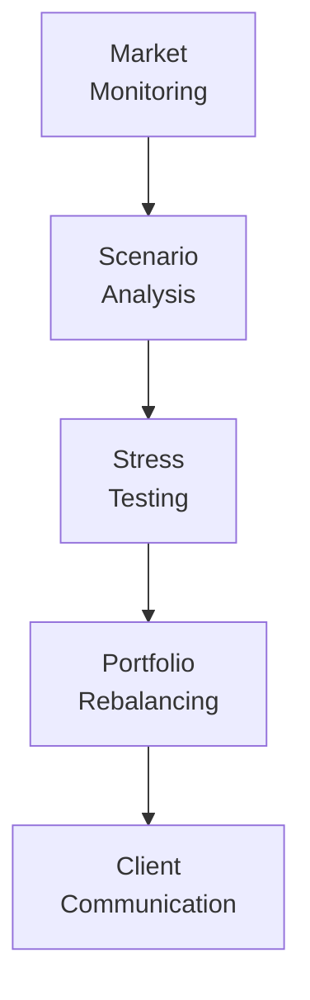

## 11.4 Measuring and Monitoring Ongoing Price Volatility

Volatility can feel like the roller coaster you never signed up for—especially when you’re dealing with bonds that used to seem relatively stable. As market conditions evolve, interest rates shift, and economic indicators flash, it becomes crucial for advisors and investors to keep track of a bond portfolio’s risk characteristics. This section explores the “how” and “why” of measuring and monitoring ongoing price volatility, ensuring you stay on top of any changes that might affect portfolio performance. And hey, I remember once, I was so focused on just the yield of a few corporate bonds that I almost missed a red flag in interest rate risks. That near-miss taught me the hard way: if you don’t keep a continuous eye on volatility, you might face nasty surprises.

Below, we dive into the key components that make ongoing volatility tracking more than just a buzzword: scenario analysis, stress testing, regular re-balancing, and open communication with clients. By connecting these dots, you can craft a more resilient bond portfolio that remains aligned with a client’s objectives—even when the markets throw the occasional curveball.

---

### Why Ongoing Monitoring of Price Volatility Matters

Price volatility in bonds is primarily driven by:
• Changes in interest rates (often influenced by central bank policies and economic indicators).  
• Shifts in credit spreads (the market’s perception of credit risk).  
• Economic and political events (e.g., recessions, geopolitical tensions).  

Tracking volatility is not just an intellectual exercise—it’s a practical necessity. For organizations governed by Canadian Investment Regulatory Organization (CIRO) rules, ongoing monitoring is part of best practices to ensure investment dealers and advisors remain compliant and prepared. Historically, organizations like the Mutual Fund Dealers Association of Canada (MFDA) and the Investment Industry Regulatory Organization of Canada (IIROC) had guidelines on oversight; those bodies have now amalgamated into CIRO, reflecting a unified approach to investor protection and marketplace integrity. Keeping a close watch on volatility protects both you and your client by allowing timely adjustments to evolving market conditions.

---

### Key Tools for Measuring Volatility

You might be wondering: “So, how do we actually measure ongoing bond price volatility?” The primary tools include:

• Duration: A measure of a bond’s sensitivity to interest rate changes.  
• Convexity: Shows how the duration of a bond changes as interest rates shift, providing a second layer of interest rate risk insight.  
• Yield Curve Analysis: Observes how yields differ across maturities, indicating shifts that might signal rate changes.  

In practice, you’d look at these metrics regularly—almost like getting a routine health check. If you’re comfortable working with data, you can even automate these calculations: Python, R, MATLAB, or standard Excel spreadsheets can do the heavy lifting.  

---

### Scenario Analysis

Scenario Analysis is about simulating how a bond or bond portfolio might behave under various hypothetical conditions—think of it like a “What if?” game. Examples of scenarios:

• Interest rates rise by 1% over the next six months.  
• Credit spreads for corporate bonds widen by 100 basis points overnight.  
• A severe recession hits, slashing interest rates but increasing default risk.  

Each of these scenarios can have unique impacts on the price of individual bonds and on the portfolio as a whole. By simulating these situations in advance, you can identify vulnerabilities and plan for them. For instance, you might discover that your portfolio is heavily exposed to long-duration bonds that could take a major price hit if the Bank of Canada raises interest rates.

Below is a simplified table illustrating how different scenarios might interact with common bond metrics:

| Scenario                                      | Interest Rate Movement  | Credit Spread Movement | Portfolio Impact                       |
|-----------------------------------------------|-------------------------|------------------------|----------------------------------------|
| Rising Rates by 100 bps                       | +1.0%                   | Minimal change         | Duration-driven price declines         |
| Widening Corporate Spreads                    | Flat or slightly lower  | +100 bps              | Corporate bonds lose value significantly |
| Deep Economic Recession                       | -1.5%                   | +150 bps              | Gains for government bonds, losses for lower-credit corporate bonds |

Scenario analysis can be handled with open-source tools or commercial platforms, enabling you to input custom economic assumptions (like GDP growth, inflation rates, or changes in monetary policy).

---

### Stress Testing

Stress testing is the more dramatic cousin of scenario analysis. Rather than focusing on typical or even moderately challenging situations, stress testing throws your portfolio into extreme, but theoretically plausible, events. Think of:

• A sudden 300 basis point jump in interest rates within a month.  
• Systemic financial crisis where credit spreads skyrocket.  
• Global geopolitical crisis impacting oil prices and emerging market debts simultaneously.  

These hypothetical extremes are designed to reveal how your portfolio might perform in a worst-case scenario. Sometimes, you realize that what appeared to be a “safe” bond portfolio might buckle under extraordinary conditions—maybe the credit exposure is too concentrated, or the maturities are aligned in a way that they’re extremely vulnerable to abrupt interest rate hikes.

Stress testing is frequently discussed in regulatory circles. CIRO publishes materials on risk assessment methodologies (see https://www.ciro.ca for updates). Incorporating these extreme “what if” exercises can help you meet regulatory expectations and provide clients with peace of mind that their money is prepared—even for storms we rarely see.

---

### Periodic Portfolio Re-Balancing

Even the best-laid plans drift over time. Perhaps you started with a balanced allocation between short-term and long-term bonds. Then interest rates dropped, leading to substantial price gains in longer-duration bonds. Suddenly, what was a 50-50 short-to-long mix has turned into 30-70. This shift increases risk if rates rise again.

Re-balancing involves selling or buying assets to return the portfolio to its intended allocation of durations, credit exposures, and risk levels. This is not a one-time chore. Think of it like an exercise routine: you have to keep up with it regularly, or else you lose fitness. By re-balancing:
• You maintain the duration and risk levels that match a client’s profile.  
• You lock in gains (if certain bonds have risen significantly in value).  
• You avoid letting what should be a short-term bond allocation balloon into something with a higher risk profile.  

Periodic re-balancing further keeps you in line with the evolving preferences of your client. People’s financial situations change, and even their comfort with risk evolves. Bringing the portfolio back to stated objectives ensures you’re not inadvertently drifting into an unwanted risk zone.

---

### Communication With Clients

You can do the best stress tests in the world, but if your client isn’t on board with the findings—or doesn’t even know you’re doing them—things can unravel quickly. Communicating regularly about changes in market conditions, how your scenario analyses are playing out, and what adjustments you’re making is essential.

Why? Because clients might:
• Overreact to short-term volatility, potentially selling at the worst time.  
• Want to shift their bond strategy if their life circumstances change (e.g., retirement timeline, sudden financial needs).  
• Need reassurance that you have a plan for less-likely but high-impact events.  

Unsure of how to explain complicated risk analysis to your clients without them zoning out? One approach is to use straightforward analogies and visuals. For instance, if you talk about bonds as if they’re “umbrellas in a light drizzle but might be lacking if we have a full-blown hurricane,” you’re more likely to keep your client engaged. Show them easy-to-read charts of how the portfolio might behave in different interest rate environments. This fosters trust and clarity.

---

### Using Technology to Automate Monitoring

Gone are the days where you had to crunch bond durations with a printed yield curve spread out on your desk. Advisors today have a variety of tools:

• Spreadsheet Programs (e.g., Excel, Google Sheets) with built-in financial functions and macros.  
• Python Libraries (pandas, NumPy, matplotlib) that allow custom scenario modeling and data visualization.  
• R Packages (quantmod, tidyverse) for sophisticated portfolio analytics.  
• Commercial Platforms (Bloomberg Terminal, FactSet, ICE Data Services) offering integrated yield curve modeling and scenario stress testing modules.  

For do-it-yourself approaches, open-source technologies can be cost-effective and surprisingly powerful. If you need robust systems (or if your business’s compliance framework demands professional-level platforms), subscription-based software might be the route. Either way, automation frees you from routine computations, giving you time to focus on actual decision-making and client engagement.

---

### Workflow Illustration

To visualize how these elements can come together, here’s a simple Mermaid diagram showing a workflow for measuring and monitoring ongoing price volatility:

• Market Monitoring: Keep tabs on interest rate announcements, economic indicators, and credit spread changes.  
• Scenario Analysis: Run simulations for “typical” shifts in rates or spreads.  
• Stress Testing: Push the limits with extreme scenario modeling.  
• Portfolio Rebalancing: Adjust positions to maintain or achieve target duration and risk.  
• Client Communication: Discuss changes, rationale, and forward strategy with the client.

---

### Real-World Anecdote: Managing a Rate Spike

I once worked with a client who had little appetite for risk, but absolutely needed a predictable income stream. We carefully constructed a short-to-intermediate bond ladder that we thought was perfect. However, a few months later, global inflationary pressures prompted the Bank of Canada to raise rates more aggressively than anticipated. The short-duration portion performed decently, but the intermediate portion saw noticeable price declines—and the client started getting nervous.

Here’s what we did:
1. Ran a quick scenario analysis that assumed one additional rate hike.  
2. Noticed that a few five-year corporate bonds in the portfolio were particularly vulnerable if the spread on their ratings widened.  
3. Executed a partial re-balancing: sold some of those five-year corporates and bought shorter maturities.  
4. Communicated with the client about the rationale. I explained, “We’re expecting stormier weather, so we’re shortening the sails to keep the boat steady.”  

This quick corrective action helped reduce the potential for large price swings, reassuring the client. It highlighted, for me, the importance of timely communication and the advantage of having scenario and stress-testing frameworks ready to go.

---

### Common Pitfalls and How to Avoid Them

• Neglecting to Update Assumptions: Economic conditions can shift quickly, and stale data can lead to misguided decisions. Keep your model inputs fresh.  
• Overfitting Stress Tests: Sometimes, we get so creative with doomsday scenarios that we lose focus on plausible events. Strike a balance between practicality and thoroughness.  
• Failing to Engage Clients: Even the most robust model means little if clients don’t understand or trust the process. Regular, jargon-free communication is critical.  
• Not Re-Balancing in Time: Markets move fast. If you only rebalance once a year, you might miss windows to lock in gains or limit losses.  

---

### Regulatory Framework and Resources

Under CIRO’s current guidelines (https://www.ciro.ca), advisors must implement prudent risk management strategies and inform clients about potential risks and rewards of investment products. Stress testing and scenario analysis are often cited as valuable methods for meeting these obligations, particularly when dealing with fixed-income investments.

You can also explore:
• Government of Canada Market Debt and Borrowing Programs: (https://www.fin.gc.ca)  
• “Fixed Income Securities” by Bruce Tuckman and Angel Serrat  
• Historical MFDA/IIROC (predecessor SROs; no longer active post-2023) guidelines on risk disclosure  
• Python packages like NumPy, pandas, or the “quantmod” package in R  

All these resources converge on a simple truth: combining systematic analysis with scheduled re-balancing and transparent client communication is the surest way to manage bond price volatility.

---

### Conclusion

Measuring and monitoring ongoing price volatility in bonds is not a one-time assignment. Much like going to the gym or checking your car’s oil, it’s about consistency and discipline. Using tools like scenario analysis, stress testing, and re-balancing, you can adapt to changing markets swiftly. Pair that with clear communication, and you’ll build trust and maintain portfolios that meet client objectives, even when the market has some wild mood swings.

So, watch the markets, run your numbers, adjust your portfolio, and chat openly with your client. That’s the magic recipe. A bond portfolio doesn’t have to be a nail-biter. With adequate preparation and continuous monitoring, you’ll keep it on track—rain or shine.

---

## Self-Assessment: Measuring and Monitoring Bond Price Volatility



### Which of the following best describes scenario analysis?
- [ ] A method of predicting bond prices based on historical performance alone.
- [x] A process of evaluating bond performance under various hypothetical market conditions.
- [ ] A direct measure of bond sensitivity to credit risk.
- [ ] A re-balancing technique that focuses solely on yield maturity.

> **Explanation:** Scenario analysis imagines multiple market environments (e.g., rising interest rates, widening credit spreads) to see how bonds might respond.

### What is one purpose of stress testing a bond portfolio?
- [ ] To eliminate credit risk entirely.
- [ ] To find ways to maximize short-term performance in normal conditions.
- [x] To evaluate the impact of extreme but plausible market events on bond prices.
- [ ] To randomly shuffle portfolio holdings without rationale.

> **Explanation:** Stress tests envision worst-case or extreme scenarios, showing how badly the portfolio might be affected and revealing hidden risks.

### How does periodic re-balancing help manage bond price volatility?
- [x] It keeps duration, credit exposure, and portfolio structure aligned with client goals.
- [ ] It eliminates the need for ongoing monitoring.
- [ ] It allows indefinite deferral of capital gains taxes.
- [ ] It is not relevant for bonds.

> **Explanation:** Re-balancing is used to realign a portfolio’s characteristics (e.g., duration, risk exposure) with the client’s original strategy.

### In a rising interest rate environment, which bond characteristic typically captures the price impact?
- [x] Duration
- [ ] Seniority
- [ ] Management fees
- [ ] Coupon reset frequency

> **Explanation:** Duration measures sensitivity to interest rate changes, indicating how much a bond’s price might fall if rates rise.

### What is the relationship between scenario analysis and stress testing?
- [x] Stress testing often examines more extreme versions of the conditions explored in scenario analysis.
- [ ] Scenario analysis only applies to equity markets, while stress testing applies to bonds.
- [x] Both scenario analysis and stress testing ignore changes in credit spreads.
- [ ] None of the above.

> **Explanation:** Stress testing is a specialized form of scenario analysis focusing on extremely adverse events. Both can account for credit spreads.

### Which of the following is a key reason to maintain regular communication with clients about bond volatility?
- [x] To ensure they understand changes in market conditions and remain comfortable with the strategy.
- [ ] To convince them to suspend all monitoring efforts.
- [ ] To discourage re-balancing.
- [ ] To hide the risk factors inherent in the bond market.

> **Explanation:** Clients should be updated so that they’re aware of market shifts and remain confident in the steps taken to address volatility.

### What role do open-source tools like Python or R play in monitoring price volatility?
- [x] They can automate calculations like duration, run scenario analyses, and facilitate data visualization.
- [ ] They are reserved for large institutional players only.
- [x] They cannot handle any form of stress testing.
- [ ] All monitoring must be done manually for maximum accuracy.

> **Explanation:** Python, R, and related libraries allow for complex modeling and data analysis, saving time and improving accuracy.

### Which of the following misconceptions can lead to underestimating bond price volatility?
- [ ] Believing that scenario analysis offers worthwhile insights.
- [x] Assuming that bonds are inherently risk-free and require no monitoring.
- [ ] Applying stress tests regularly.
- [ ] Understanding that re-balancing is essential.

> **Explanation:** Many novice investors think bonds are “safe,” but they can still experience considerable price swings.

### What happens if you ignore re-balancing for too long in a dynamic market?
- [x] The portfolio’s original risk profile can drift significantly from what was intended.
- [ ] You automatically benefit from better diversification.
- [ ] The portfolio spontaneously hedges against all interest rate risk.
- [ ] Portfolio duration remains static.

> **Explanation:** Over time, fluctuating bond prices and yields can shift the portfolio away from its initial or intended allocation.

### True or False: Stress testing and scenario analysis are effectively the same thing and yield identical insights.
- [x] True
- [ ] False

> **Explanation:** While scenario analysis can be wide-ranging, stress testing typically focuses on extreme conditions. They are related but not identical, often providing different insights based on severity of assumptions.


