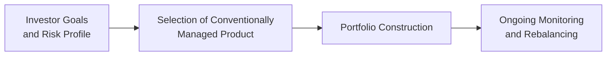

## 12.2 The Role of Conventionally Managed Products in Investment Management

Picture this: You’ve got some savings, and you want to invest. But every time you open up a financial news site or chat with friends about roaring markets, you notice the conversation quickly bounces between terms like “fund mandates,” “risk parameters,” “balanced portfolios,” and so forth. It can be enough to make your head spin. I remember when I first started investing: I was enthralled by the idea of picking the perfect stock myself, but I soon realized how much time, energy, and expertise it would require to stay on top of every detail. That’s when I discovered the world of conventionally managed products—things like mutual funds, closed-end funds, and wrap accounts. They changed how I thought about investing. And guess what? They might just change your perspective, too.

Conventionally managed products typically serve as a convenient, user-friendly gateway into diversified investing. They can be especially appealing for investors who want professional portfolio management without juggling every single financial ratio and performance report on their own. Below, we’ll explore how these products can become integral to investment management—from their role in portfolio construction and liquidity considerations to their regulatory oversight in Canada.

### Portfolio Construction Utility

Conventionally managed products often sit at the very foundation of many retail investment portfolios. The reason is simple: when you buy a mutual fund or other pooled product, you’re essentially purchasing a pre-built collection of securities, often diversified across different companies, sectors, or even geographic regions. 

• Diversification in a Single Purchase: If you’re new or if you’re limited in time, picking 40 or 50 individual stocks might be unrealistic. A single balanced mutual fund could spread your money across equities and fixed income in one swoop.  

• Built-In Discipline: These funds often follow clearly defined mandates, such as “growth,” “value,” or “balanced.” That means there’s a structured approach to asset selection. You’re less likely to panic and sell at the wrong time because your fund manager maintains a systematic discipline behind the scenes.  

It’s no wonder so many Canadians rely on these products, especially in Registered Retirement Savings Plans (RRSPs) or Tax-Free Savings Accounts (TFSAs). Whether you’re hoping for a stable retirement plan or a stepping stone into the markets, conventionally managed products typically provide a robust starting block in your overall investing journey.

### Professional Management Advantage

One of the biggest draws here is, well, the word “professional.” A fund manager or a team of analysts researches market trends, analyzes companies’ financial statements, and makes buy-and-sell decisions on your behalf. Let’s be honest: that’s a huge relief if you don’t have time to pour over all those earnings releases or get excited every time GDP numbers are announced.  

• Research Resources: Conventional fund managers usually have access to a wide pool of market data, including specialized industry reports, corporate trend analyses, and macroeconomic forecasts. It’s the sort of material individual investors might find expensive or time-consuming to get and interpret.  

• Expertise in Market Cycles: When markets get bumpy, experienced fund managers might adjust portfolios based on cyclical trends, potential interest rate changes, or shifting consumer habits. That’s not to say they’re infallible—far from it. However, they at least have the training and resources to (hopefully) avoid some pitfalls.  

• Reduced Emotional Decision-Making: Many conventional products rely on an institutional manager’s discipline and portfolio guidelines. Emotions are a big deal in investing—fear leads to panic selling, and greed leads to reckless buying. By delegating to someone guided by a systematic process, you might sidestep your own emotional biases.

This “professional management advantage” might allow you to sleep a bit better at night. Of course, remember that professional managers underperform benchmarks sometimes, and fees can eat into your returns. It’s not a perfect system. But yeah, for many folks, it’s worth offloading the day-to-day stress of picking, monitoring, and rebalancing each security.

### Complement to Direct Investment Holdings

What if you’re already an enthusiastic do-it-yourself investor? It may sound a bit contradictory, but even seasoned stock-pickers often add mutual funds and closed-end funds to their personal portfolios for specific purposes. For example:

• Specialized Access: Let’s say you’re really comfortable investing in domestic stocks but want some emerging-market exposure. Instead of individually researching dozens of companies in emerging markets, you can buy a specialized emerging-market fund managed by experts who (hopefully) live and breathe that region.  

• Sector-Specific Strategies: Maybe you hold a handful of blue-chip Canadian bank stocks, but you’d also like a slice of the tech sector in Asia. Instead of analyzing every piece of tech news out there, you pick a tech-focused mutual fund run by a manager who devours that data daily.  

• Asset Allocation Gaps: If you’re holding mostly equities, you can sometimes rebalance or shore up your portfolio with a bond fund. In other words, conventionally managed products can fill asset classes or geographical areas you might not have time to tackle yourself.

In short, conventional products aren’t just for newcomers. They fit snugly into portfolios of folks who also invest in individual stocks, real estate, or alternative assets. The mix-and-match approach can help you craft a well-rounded portfolio that aligns with your personal objectives.

### Liquidity and Accessibility

Ever tried to sell a piece of real estate in a pinch? It can take a while—maybe months. Conventionally managed funds (especially open-end mutual funds) are typically easier to buy or sell, often daily. While closed-end funds might trade on exchanges at premiums or discounts to their net asset value (NAV), they’re still generally simpler to transact than property or some exotic private investments.  

• Low Barriers to Entry: Mutual funds often have low initial investment thresholds—sometimes a few hundred dollars. This accessibility means a person with a modest budget can start investing.  

• Built-In Flexibility: If you decide to pivot your financial strategy—maybe shifting from equities to bonds as you age—most fund providers make it relatively smooth to do so. Often, you can switch between different funds offered under the same provider without too many headaches.  

• Watch Out for Fees: While liquidity is great, be mindful of redemption fees, short-term trading fees, or commissions that might apply. Also, some funds may impose short-term trading penalties if you buy and sell too frequently.

### Ideal for Broad Strategies

Conventionally managed products can be used in pretty much any overarching strategy you can imagine, whether you want to emphasize growth, income, or a balanced approach. For instance, if you’re seeking steady dividends, you might pick a dividend-focused equity fund. If you want a mix of bonds and equities, a balanced fund might fit. If you crave global growth, there’s a suite of global equity funds ready to go.

If you’re ever flipping through a fund catalogue, you’ll see all sorts of “mandates.” One fund might be global small-cap equities. Another might be short-term Canadian bonds. Another might explicitly incorporate Environmental, Social, and Governance (ESG) factors. The point is, these products are designed with variety in mind, and the range of available strategies ensures that almost every investor’s preference can be accommodated.

### Regulatory Oversight

In Canada, these products are subject to regulatory oversight by the Canadian Investment Regulatory Organization (CIRO) and the Canadian Securities Administrators (CSA). Historically, there were separate self-regulatory organizations (like MFDA and IIROC), but by 2025, we have CIRO overseeing investment dealers, mutual fund dealers, and market integrity on equity and debt marketplaces. 

Why does this matter? Well, **transparency** and **fiduciary standards** are huge in the world of managed products. Disclosure requirements enable you to see fees, fund performance, and other important information. 

• Periodic Reporting: Fund managers must regularly release updates on performance, portfolio holdings, and changes in strategy, so you aren’t left guessing what’s inside your fund.  

• Suitability Obligations: Firms and advisors regulated by CIRO must ensure the products they recommend align with your risk tolerance and objectives. That’s a big difference from a purely unregulated environment.  

• Protections for Investors: The Canadian Investor Protection Fund (CIPF) safeguards your assets if a member firm becomes insolvent. This adds another layer of security and might give you more confidence in putting your money into conventional funds.

For more details, you can visit the [CIRO Investor Resources](https://www.ciro.ca/investors) page—or look up provincial and territorial securities regulations under the CSA umbrella. These organizations often publish helpful bulletins, so you can stay current on best practices and your rights as an investor.

### A Visual Overview of the Role of Conventionally Managed Products

Below is a simple Mermaid diagram showing how these products fit into an overall investment process:

- Node A captures your personal objectives: retirement, capital growth, education savings, etc.  
- Node B emphasizes the choice of a conventionally managed product (e.g., mutual fund, closed-end fund, wrap product) that meets your risk tolerance and timeline.  
- Node C highlights the actual building of your portfolio.  
- Node D stresses the importance of ongoing reviews to ensure the product still aligns with your objectives.

### Practical Examples and Case Studies

• The First-Time Investor: Suppose a recent graduate wants to invest $5,000 but doesn’t have the time or skill to pick individual stocks. They might opt for a balanced mutual fund. This product provides an immediate spread across equities and bonds, often with just a few clicks. The graduate can top it up periodically, reviewing every six months.

• The Retiree Seeking Steady Income: Imagine a retiree who wants consistent cash flow. They may choose a monthly income mutual fund composed of dividend-paying equities and fixed-income securities. At the same time, they might hold a separate money market fund for short-term emergency needs, offering them both growth potential and liquidity.

• The Seasoned Trader Filling a Gap: Consider a savvy stock picker who’s assembled a portfolio of mostly Canadian equities. Realizing she’s lacking international exposure, she can purchase an international equity mutual fund or a globally diversified closed-end fund. This way, she covers entire regions and sectors she previously missed.

### Common Pitfalls and Best Practices

• Overlooking Fees: Management expense ratios (MERs) or loads can significantly affect your long-term returns. Always read the fund fact sheet or simplified prospectus.  

• Misunderstanding Mandates: If the product has an “aggressive growth” mandate, don’t expect it to preserve capital in a downturn. Align the fund’s objective with your real needs.  

• Neglecting Rebalancing: Even if you pick an amazing bond fund, it might grow unbalanced relative to your equities if you don’t rebalance. Over time, your portfolio deviates from your intended allocations.  

• Chasing Performance: It’s tempting to jump into a fund that skyrocketed last year. But remember, past performance doesn’t guarantee future results. Investigate whether the success was due to a one-time event or consistent skill.  

### Glossary

• **Liquidity:** The degree to which an asset can be quickly bought or sold in the market without affecting its price. Mutual funds and exchange-traded funds typically offer high liquidity.  

• **Balanced Portfolio:** A portfolio that generally holds both equities and fixed-income securities, aiming to balance risk and return. Many balanced mutual funds are designed to maintain an approximate ratio between stocks and bonds.  

• **Fiduciary Standards:** Legal or ethical responsibilities ensuring a professional acts in the best interests of clients. CIRO-regulated firms and advisors must follow these standards.  

• **Mandate:** The official stated objective or investment strategy that a fund follows. This typically includes the asset classes involved, geographic regions, or specific investment styles.

### Additional Resources

• [CIRO Investor Resources](https://www.ciro.ca/investors): In-depth tutorials and educational materials on how mutual funds work, what fees may apply, and your rights as an investor.  

• [Morningstar Canada](https://www.morningstar.ca): A robust platform for fund analysis tools, research reports, and performance data.  

• “Fundamentals of Investment Management” by Geoffrey A. Hirt and Stanley B. Block: Provides an extensive academic outlook on portfolio management, tackling both theory and practical applications.  

These resources can give you deeper insights into analyzing merited funds, comparing performance, and ensuring your portfolio remains aligned with your goals.

---

### Encouragement and Final Thoughts

So, is a mutual fund or closed-end fund a magic bullet for every investment scenario? Maybe not. However, if you value professional management, appreciate the convenience of built-in diversification, and want an efficient path to various strategies, conventionally managed products can be your bread and butter. Whether you’re brand-new and prefer not to fuss with building a huge, diversified portfolio from scratch, or you’re an industry veteran seeking a quick route to exposure in a new sector, these products are well worth your attention.

I can recall how certain funds I invested in early on—particularly balanced funds—gave me the confidence to stay invested through market downturns. Yes, there were fees, and yes, sometimes the manager made calls I didn’t fully agree with. But overall, they served as a stable backbone while I learned more about direct stock investing. Over time, I’ve incorporated specialized funds to gain access to real estate investment trusts (REITs) or overseas tech. That’s the beauty of these products: you can use them as the main course or a side dish in your financial plan. They exist to make your life easier, your portfolio more robust, and your long-term financial goals more achievable.

----

## Test Your Knowledge: The Role of Conventionally Managed Products in Investment Management



### Which of the following best describes the primary benefit of conventionally managed products in a retail investor's portfolio?

- [ ] They eliminate all investment risk by offering guaranteed returns.
- [x] They provide access to diversification and professional management.
- [ ] They only allow investors to buy U.S. stocks.
- [ ] They require advanced financial expertise to manage.

> **Explanation:** Conventionally managed products, such as mutual funds, offer diversification and professional management that help retail investors participate in multiple market segments without needing deep expertise themselves.

### How do professional fund managers typically add value for investors?

- [x] They employ research, expertise, and disciplined processes to make investment decisions.
- [ ] They remove the need for investors to pay any fees for fund management.
- [ ] They guarantee outperformance of benchmark indexes.
- [ ] They only buy long-term government bonds.

> **Explanation:** Professionals use tools and resources (like economic indicators, financial statements, and market analysis) to guide more informed buy-sell decisions. No manager can guarantee outperformance, and fees are usually involved.

### Why might an experienced stock-picker still include mutual funds in their portfolio?

- [ ] Because individual stocks can never be traded profitably by retail investors.
- [ ] Because mutual funds generate higher returns than stocks 100% of the time.
- [x] To gain exposure to specialized markets or sectors that they do not have time to research in-depth.
- [ ] Because they are legally required to invest in at least one mutual fund.

> **Explanation:** Even seasoned DIY investors may use funds for regions or sectors they aren’t personally equipped to research in great detail.

### Which of the following best reflects the liquidity feature of open-end mutual funds?

- [x] Investors can typically redeem their shares at the fund's net asset value (NAV) on any business day.
- [ ] They can only be sold once a year during a designated trading window.
- [ ] They always trade at a discount to the net asset value.
- [ ] The government guarantees you’ll always convert your shares to cash instantly.

> **Explanation:** Open-end mutual funds allow daily subscriptions and redemptions generally based on that day’s NAV, making them relatively liquid, although settlement times and short-term trading fees may apply.

### What should investors be mindful of before transacting in conventionally managed products?

- [x] Possible fees, such as management expense ratios, sales charges, or short-term trading penalties.
- [ ] Exemption from taxes, as no taxes ever apply to mutual fund investments.
- [x] Liquidity considerations, including redemption policies.
- [ ] The absence of any regulation by Canadian authorities.

> **Explanation:** Investors must understand fees associated with the product and any redemption rules. Although these products are regulated, fees vary and can impact net returns.

### How do conventionally managed products support various investment strategies?

- [x] They offer specialized mandates (e.g., growth, income, balanced) aligned with different investor goals.
- [ ] By restricting all funds to invest only in government bonds.
- [ ] By preventing portfolio rebalancing or diversification.
- [ ] By eliminating all inflation risk for investors.

> **Explanation:** A wide variety of fund mandates exist—balanced, income, growth, global, sector-specific—thus allowing alignment with distinct strategies, goals, and risk tolerances.

### What is a possible pitfall of chasing the best-performing mutual fund based on last year’s returns?

- [x] Past performance is not necessarily indicative of future results, and the fund’s success might not repeat.
- [ ] Regulators require all high-performing funds to close for new investments.
- [x] The fund’s performance may be driven by one-off factors.
- [ ] Fee structures for top-performing funds are always zero.

> **Explanation:** A strong past performance can be due to short-lived market conditions or singular events. Investing solely based on short-term performance can be risky.

### What role does CIRO play in relation to conventionally managed products?

- [x] It provides oversight for investment dealers and mutual fund dealers to ensure they uphold regulatory standards and investor protection.
- [ ] It is an investment advisory firm that charges fees to help investors pick funds.
- [ ] It is only responsible for collecting taxes on fund transactions.
- [ ] It is part of the U.S. Securities and Exchange Commission (SEC).

> **Explanation:** CIRO is Canada’s self-regulatory organization overseeing dealers, ensuring funds are offered properly and investors are protected.

### How can an investor confirm which asset classes or regions a fund invests in?

- [x] By reviewing the fund’s prospectus or simplified fund fact sheet, which discloses investment mandates.
- [ ] By reading unverified social media posts from self-proclaimed experts.
- [ ] By day-trading the fund on margin.
- [ ] By buying the fund blindly and hoping for the best.

> **Explanation:** The most reliable method is to review official fund documents (like prospectuses and fund fact sheets) that outline the fund’s objectives, strategies, and holdings.

### True or False: Balanced funds typically include a mix of both stocks and bonds to seek moderate risk and return.

- [x] True
- [ ] False

> **Explanation:** Balanced funds generally hold a combination of equities and fixed-income securities, aiming to balance potential returns against volatility.


