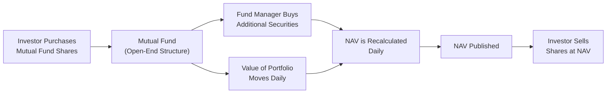

## 12.3 Mutual Funds

Let me just say, the first time I ever encountered a “mutual fund,” I was a little confused—I’m pretty sure I mumbled, “Wait, so it’s both an investment and a pool of money and a product all at once?” And, yeah, it kind of is. Mutual funds can be surprisingly easy once you grasp the basics of their open-end structure and the broad variety of categories they come in. Let’s explore the nuts and bolts of how mutual funds work, why they might be valuable (or not), and how you can keep an eye on their performance.

---

### The Open-End Structure

Open-end mutual funds, commonly referred to simply as “mutual funds,” continuously issue new shares (or units) to investors. That might sound fancy, but here’s the gist: whenever new people want to jump in, the fund just creates new units. Likewise, if existing investors cash out, the fund redeems (or removes) those units. In other words, it “expands and contracts” to match the flow of investor dollars.

• Net Asset Value (NAV) Calculation: Since there’s constant buying and selling, the value of each share—called the net asset value (NAV)—is calculated daily. The NAV is essentially the total value of all the investments in the fund, minus any liabilities, divided by the number of shares outstanding. It’s a neat snapshot of what one share (or unit) of the fund is worth at any given close of day.

• Continuous Creation and Redemption: Because new units/shares are created or retired according to investor demand, mutual funds don’t trade like individual stocks on a secondary market. Instead, you typically buy or redeem shares directly through the fund or via a dealer aligned with the fund manager.

It often helps to visualize it. Below is a simple diagram of how an open-end mutual fund functions:

In this diagram, you can see how easy it is for investors to buy in—or sell out—because there are always more (or fewer) shares that the fund can create (or redeem).

---

### Types of Mutual Funds

Mutual funds come in all shapes and sizes. From stock-heavy strategies to more balanced and specialized approaches, each type is designed to appeal to different investor profiles and objectives.

#### Equity Funds

Equity funds focus on stocks. That said, “stock” can be defined in different ways:
• Growth style: The fund aims to invest in companies that are expected to increase their earnings at a faster-than-average rate.  
• Value style: The fund focuses on companies that appear to be undervalued in the market.  
• Geography-based: You might see domestic equity funds (like Canada-only or U.S.-only) or global equity funds that invest around the world.  

And because the stock market can be unpredictable, equity funds can vary from super aggressive (small-cap growth) to more conservative (large-cap dividend stocks).

#### Fixed-Income Funds

Fixed-income funds invest primarily in bonds and other debt instruments. As you might guess, the interest rate and credit risks are key considerations here. Some funds hold government bonds (federal, provincial, or municipal), while others venture into higher-yield corporate bonds (with potentially bigger returns but also higher default risk). Depending on the fund’s mandate, these investments can be spread across short-term (like T-bills) or long-term bonds (both government and corporate). The beauty is that you can focus on a relatively stable income stream, but be aware that “stable” doesn’t mean “risk-free,” especially with interest rate changes.

#### Balanced Funds

Balanced funds blend equity (stocks) and fixed-income (bonds) in one portfolio. They’re kind of like the Swiss Army knives of mutual funds, aiming to provide a moderate level of growth coupled with some stability from bond allocations. While they won’t necessarily beat pure equity funds in a bull market, they also might not drop as sharply in tougher times, thereby offering a middle-of-the-road performance profile.

#### Specialty Funds

“Specialty” is basically an umbrella term for any fund targeting super-specific areas such as technology, energy, health care, infrastructure, sectors, niches, you name it. Also included here might be ESG (Environmental, Social, and Governance) funds, which focus on “socially responsible” or “value-aligned” investing. Specialty funds typically carry more risk because they’re not as diversified (think technology sector in a dot-com bust). But if you have a strong conviction or want to support a particular cause or industry, they can be an interesting choice.

---

### Advantages of Mutual Funds

Mutual funds gained popularity for a reason. Here are some of the big selling points:

• Professional Management: A professional fund manager (or team) looks after day-to-day investment decisions. You’re effectively paying for their expertise, research, and portfolio management skills. If you don’t fancy spending weekends analyzing company balance sheets, this could be an attractive perk.

• Economies of Scale in Trading Costs: When mutual funds trade, they can do so in large blocks, and this bulk buying/selling can sometimes reduce transaction costs compared to what an individual investor would pay.

• Regulatory Transparency: Mutual funds in Canada must operate under frameworks such as National Instrument (NI) 81-102, among others. These rules specify portfolio diversification requirements, restrict certain risky strategies (like excessive use of leverage), and ensure extensive disclosure. That means you, as an investor, can get access to documents like the simplified prospectus, Fund Facts, and financial statements.

• Diversification in a Single Product: Because most mutual funds hold many different securities, you automatically get some measure of diversification. A single equity fund might hold dozens—if not hundreds—of stocks. That’s a massive plus for investors who aren’t in a position to build such variety on their own.

---

### Potential Drawbacks

As with anything, mutual funds have some aspects you might see as downsides:

• Management Expense Ratios (MERs) & Trailing Commissions: The fund manager gets paid, and so does the dealer or advisor who facilitates the investment. These fees get deducted from the fund’s returns. Over the long run, high MERs can significantly erode overall returns.

• Redemption or Short-Term Trading Fees: Depending on how the fund is structured, you might face charges if you sell your shares too quickly (within 30 or 90 days, for example). This discourages short-term trading and helps the fund manager maintain a stable investment base.

• Lack of Direct Control: By investing in a mutual fund, you hand over control of the specific stock or bond picks to the fund manager. If you’re a real “hands-on” type of investor, you might prefer picking your own individual securities instead.

---

### Suitability and Regulation

If you’re looking at the Canadian market, it’s good to note that mutual funds follow specific guidelines set out in regulations such as NI 81-102. These revolve around concentration limits, permitted investments, and disclosure methods to ensure that no single product gets too risky without you knowing about it. While the Government of Canada delegates the regulation of mutual funds to provincial regulators working together through the Canadian Securities Administrators (CSA), day-to-day oversight of dealers selling mutual funds in Canada is handled by CIRO (Canadian Investment Regulatory Organization).

Before 2023, there was the MFDA (Mutual Fund Dealers Association) for mutual funds specifically, and IIROC for investment dealers, but those two have now merged into CIRO as our single national self-regulatory organization overseeing investment dealers, mutual fund dealers, and market integrity. So it’s CIRO that enforces rules and professional standards for mutual fund dealers, ensuring they comply with all the necessary guidelines.

#### CIRO for Mutual Fund Dealers

CIRO’s rulebook requires firms and individuals dealing in mutual funds to meet proficiency standards, know-your-client requirements, and abide by regulations ensuring that client interests are placed first. If you’re curious about these conduct standards or want to check out any official notices, you can scope out [CIRO’s website](https://www.ciro.ca/rules/notices).

#### CIPF (Canadian Investor Protection Fund)

If your mutual fund dealer ever enters insolvency, the Canadian Investor Protection Fund (CIPF) provides coverage for client assets, up to specified limits, so long as the firm and products are CIPF-eligible. Just remember, CIPF coverage is about firm insolvency—not market losses. If your mutual fund’s value drops due to poor performance, CIPF won’t restore that.

---

### Fees, Practical Considerations, and Best Practices

Mutual funds can work wonders if you’re seeking an easy, diversified approach to investing, but you have to watch the fees carefully and make sure the fund’s strategy aligns with your goals. A couple of tips:

• Look at the Management Expense Ratio (MER): An MER of 2.5% might not seem like much at first glance, but that’s 2.5% every year, even if the fund’s performance is mediocre. Compare funds with lower MERs or consider certain index-tracking options if you want to keep costs down.

• Factor in Trailing Commissions: Some mutual funds pay a trailing commission (sometimes called trailer fees) to advisors every year. This can subtly affect the fund’s performance. If you feel that the service and advice are worth it, that’s great—but be aware of where your money’s going.

• Understand Redemption Terms: Always check the simplified prospectus or Fund Facts to see if there’s a short-term redemption fee or load structure (front-end or back-end). If you exit the fund earlier than you expect, you don’t want a nasty surprise.

• Keep an Eye on Benchmarking: Many mutual funds are measured against a relevant index. Checking whether a fund consistently outperforms or underperforms its benchmark can indicate whether you’re getting value for your money.

---

### Reading Mutual Fund Documents

You’ve probably heard of “Fund Facts” or a “Simplified Prospectus.” I remember feeling like I was flipping through 20 pages of disclaimers when I first read one. However, these documents are quite important:

• Fund Facts: In Canada, this is a concise summary of the fund’s key features, fees, historical performance, risks, and more. Issued in compliance with CSA requirements, these are meant to be user-friendly. You can see a sample layout of this document at the [CSA’s website](https://www.securities-administrators.ca/resources).

• Simplified Prospectus: A lengthier, more detailed read that includes all the essential legal and financial details. If you want the nitty-gritty on how the fund invests, what charges exist, how performance fees might be structured, and so on, this is where you’ll find it.

Reading these might seem tedious, but it’s your best line of defense in understanding what kind of commitment you’re making. It’s like thoroughly reading the instructions before assembling furniture—helpful so you don’t end up with too many leftover screws.

---

### Case Study: Choosing Between Two Equity Funds

Picture a friend of mine, let’s call her Linda. She’s in her mid-30s, looking for growth. She compares two Canadian equity mutual funds:

1. Fund A charges an MER of 1.8%, invests mostly in large-cap Canadian banks, utilities, and telecommunications companies, and has had an average annual return of 7% over the past five years.  
2. Fund B charges an MER of 2.3%, invests in a broader range of Canadian stocks, including a healthy mix of mid-cap growth companies, and has posted 8% average returns over the same timeframe.

Linda noticed that the sectors in Fund A might be less volatile, but the limited sector exposure might hinder returns if certain industries outperform. Fund B’s higher MER is offset by historically higher returns—though, of course, future returns aren’t guaranteed. After reading the Fund Facts from both (particularly the potential risk ratings and the top ten holdings), Linda decided to go with Fund B, but she also accepted that paying more in fees would reduce her net returns unless the fund’s manager consistently adds value.

---

### Common Pitfalls and How to Avoid Them

Even with a professional manager in the driver’s seat, mutual funds have pitfalls to watch out for:

• Chasing Past Performance: It’s tempting to buy the fund that made a big splash last year. But remember, last year’s winners can sometimes turn into next year’s losers, depending on market cycles.  
• Neglecting Asset Allocation: A single mutual fund is typically a piece of your overall portfolio. Even if it’s well-diversified, you must consider how it fits with the rest of your investments (equities, bonds, real estate, private investments, etc.).  
• Not Checking the Fund Manager’s Experience: People often focus on the brand name of the mutual fund rather than the strengths of the individuals or teams who manage it. Sometimes, a high-profile manager leaving can lead to changes in performance.  
• Overlooking Tax Efficiency: Some mutual funds have high turnover, leading to capital gains distributions that might not be ideal if you’re holding the fund in a taxable account. Check the distribution history if taxes are a concern.

---

### Additional Canadian Considerations

Because mutual funds are so popular in Canada, we have some notable guidelines:

• NI 81-102 (Investment Funds): Defines parameters around concentration, leverage, liquidity, and more.  
• NI 81-101 (Mutual Fund Prospectus Disclosure): Lays out the requirement for a simplified prospectus and Fund Facts.  
• CIRO Regulation: As the national self-regulatory body, CIRO sets conduct rules for advisors selling mutual funds.  
• CIPF Coverage: Offers protection up to specific limits if member firms go insolvent.  

For official updates, rules, and resources beyond this text, keep an eye on [CIRO’s Notices](https://www.ciro.ca/rules/notices).

---

### Practical Examples and Real-World Scenarios

• Dollar-Cost Averaging (DCA): Some investors buy mutual fund units regularly (e.g., on each payday). This method can help smooth out the market’s ups and downs.  
• RRSPs and TFSAs: In Canada, mutual funds often reside within registered accounts like RRSPs or TFSAs, potentially giving you tax advantages.  
• Group Retirement Plans: Many companies offer Group RRSPs or employer-sponsored retirement plans that include a pre-selected menu of mutual funds.  
• short-term redemption fees: Suppose you buy a fund and decide to sell it in a couple of weeks. Some mutual funds have short-term trading fees (like 2%) if you exit quickly. This is designed to deter frequent trading.

---

### Glossary

• Net Asset Value (NAV): The per-share value of a mutual fund, found by dividing the total value of its portfolio minus liabilities by the shares outstanding.  
• Equity Fund: A mutual fund that invests primarily in stocks.  
• Fixed-Income Fund: A mutual fund focusing on bonds or other debt instruments.  
• MER (Management Expense Ratio): The total annual costs (management, operating, and sometimes distribution fees) to run the fund, shown as a percentage of the fund’s average net assets.  
• Trailing Commission: A recurring payment made by the fund manager to dealers or advisors each year, based on the investment you hold in the fund.

---

### Conclusion and Key Takeaways

Mutual funds remain one of the most accessible and popular vehicles for Canadian investors—and for good reason. They offer professional management, diversification, and regulatory oversight, all in one neat bundle. That said, fees, performance variability, and loss of direct control over security selection might deter some. 

Really, it’s all about knowing your investment goals: do you want convenience, broad diversification, and management expertise? Then a mutual fund might be a perfect fit. Just do your homework, read the documentation (seriously!), and pay attention to fees. If everything lines up with your risk tolerance and objectives, mutual funds can be a powerful component of a well-rounded portfolio.

---

### References and Further Reading

• Canadian Securities Administrators (CSA) – [https://www.securities-administrators.ca/resources](https://www.securities-administrators.ca/resources)  
• CIRO – [https://www.ciro.ca](https://www.ciro.ca) (Includes updated regulatory notices and rules)  
• “Personal Finance for Canadians” by Kathleen Helen Brown et al.  
• Sample Fund Facts – Provided by many fund companies or on the CSA website under “Investor Tools.”  
• Open-Source Analysis Tools – Websites like Morningstar and other data aggregators provide helpful snapshots of a fund’s performance, fees, and risk metrics.

---

## Test Your Knowledge of Mutual Funds



### 1. Which statement best describes an open-end mutual fund structure?

- [ ] It has a fixed number of shares that trade on an exchange.  
- [x] It creates new shares when new money comes in and redeems shares when investors exit.  
- [ ] It is limited to large institutional investors only.  
- [ ] It is completely unregulated in Canada.  

> **Explanation:** An open-end mutual fund continuously creates and redeems shares based on investor demand.  

### 2. When reading Fund Facts or a simplified prospectus for a mutual fund, which piece of information is typically found?

- [x] Management Expense Ratio (MER)  
- [ ] The fund manager’s personal tax returns  
- [ ] The exact daily trading costs  
- [ ] Unverifiable anecdotes about past performance  

> **Explanation:** Fund Facts commonly include details like the MER, performance history, investment objectives, and risks, all as part of its mandated disclosure.  

### 3. One key advantage of mutual funds is:

- [x] Professional management and diversification  
- [ ] Guaranteed returns regardless of market conditions  
- [ ] Zero annual fees  
- [ ] No regulation by government authorities  

> **Explanation:** Mutual funds provide access to professional management and built-in diversification. However, returns are not guaranteed, and they are regulated in Canada.  

### 4. Which of the following is true about Management Expense Ratios (MERs) in mutual funds?

- [ ] They are never disclosed to investors.  
- [ ] They only apply to index-based mutual funds.  
- [x] They represent the total yearly cost of running the fund, stated as a percentage of average assets.  
- [ ] They are charged only when the fund performs poorly.  

> **Explanation:** The MER shows the total annual operating costs, including management fees, operating expenses, and sometimes trailer fees, expressed as a percentage of the fund’s average net assets.  

### 5. In Canada, mutual funds are subject to which key regulation?

- [ ] Anti-laundering laws only  
- [ ] No regulations apply to mutual funds  
- [x] NI 81-102 covering areas such as investment restrictions and disclosure  
- [ ] Federal regulation that bars sales to international investors  

> **Explanation:** NI 81-102 sets out rules on things like portfolio concentration limits, permitted investments, fund operations, and transparent disclosure to protect investors.  

### 6. A mutual fund specializing in renewable energy companies would typically be classified as:

- [ ] A balanced fund  
- [x] A specialty fund  
- [ ] A fixed-income fund  
- [ ] A currency fund  

> **Explanation:** Specialty funds focus on a specific industry or theme, such as renewable energy.  

### 7. Double-checking the experience of a mutual fund’s management team is important because:

- [x] Changes in the fund manager can influence performance.  
- [ ] It has no effect on the fund’s investment strategy.  
- [x] Management experience can signal how well a fund might adapt to market changes.  
- [ ] It’s required for the CIPF to protect you.  

> **Explanation:** The fund manager’s skills and experience play a central role in stock or bond selection and overall strategy. A switch in management can impact performance and style.  

### 8. One common limitation of mutual funds compared to owning individual securities is:

- [ ] You can’t automatically reinvest dividends.  
- [x] Lack of direct control over individual holdings.  
- [ ] They trade continuously throughout the day like stocks.  
- [ ] Fees never get disclosed to investors.  

> **Explanation:** In a mutual fund, you delegate specific security selection to the fund manager, so you don’t get to scour the market picking individual stocks or bonds.  

### 9. In Canada, CIRO’s role regarding mutual funds includes:

- [x] Overseeing the conduct and proficiency of mutual fund dealers.  
- [ ] Acting as the lead manager for all mutual funds.  
- [ ] Offering guaranteed investment returns.  
- [ ] Being responsible for setting interest rates for bond funds.  

> **Explanation:** CIRO is the national self-regulatory body ensuring that dealers and their representatives adhere to professional standards and regulatory requirements, including the sale of mutual funds.  

### 10. True or False: CIPF (Canadian Investor Protection Fund) protects you from market losses in your mutual fund.

- [x] True  
- [ ] False  

> **Explanation:** This is a trick question. Strictly speaking, CIPF protects client assets if the member firm becomes insolvent, not if your fund loses value due to market shifts. If the statement is read literally—"protects from market losses"—the correct answer would be “False.” However, if the statement is read strictly in the context "True or False: CIPF... protects you from market losses", it is false. CIPF does NOT cover market losses. Just note the difference in wording carefully.  


