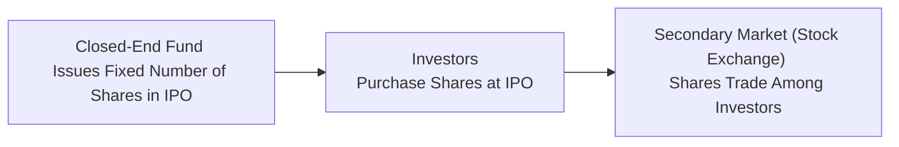

## 12.4 Closed-End Funds

Have you ever come across a fund trading on the Toronto Stock Exchange (TSX) that looks a bit like a mutual fund but trades just like a stock? That’s pretty much how I first stumbled upon closed-end funds—and, honestly, it felt a little confusing at first. Are they mutual funds? Are they stocks? The truth is they occupy a unique space, blending characteristics of both. In this section, we’ll dig into closed-end funds by focusing on how they work, what sets them apart from mutual funds, their potential advantages, and the drawbacks you should keep in mind. So, let’s dive right in.

### Introduction

Closed-end funds can be thought of as a more “static” version of mutual funds: they issue a fixed number of shares to the public in what’s typically referred to as an Initial Public Offering (IPO). After that, the fund’s shares trade on an exchange among investors, rather than being redeemed by the fund itself. This key structural difference means you don’t have daily inflows and outflows like in open-end (mutual) funds. Instead, the share price is determined by market forces—just like the stock of any publicly traded company. 

This can create interesting dynamics: sometimes these funds trade at a discount to net asset value (NAV), sometimes at a premium, and occasionally right at par. Often, there’s a rationale behind these price discrepancies—like the overall supply and demand in the market, the management strategy, or just good old investor sentiment. Let’s explore all of this step by step.

### Structure and Trading Mechanics

Let’s begin by visualizing how a closed-end fund is structured and how its shares enter the market. During the IPO, the fund raises money by selling a fixed number of shares to investors. Once the IPO is completed, shares trade in the secondary market (for example, on the TSX), and the fund will not typically issue more shares nor redeem existing ones (except in special circumstances like secondary offerings, rights offerings, or share buybacks). 

Here’s a quick overview in a diagram form:

• In the first stage, the closed-end fund is created and offers a set number of shares to the public in its IPO.  
• Next, investors purchase these shares during the IPO.  
• After that, the shares are listed on an exchange. Any buying or selling happens between investors in that secondary market.  

A key thing to remember: Because the fund itself doesn’t redeem shares on a daily basis, it’s not subject to the same redemption pressures as a mutual fund. If you want to sell your shares, you do so on the exchange at the prevailing market price—just as you would sell any stock.

You might be wondering: “Wait, so does the fund’s share price always match the value of the underlying assets?” The short answer is no. Sometimes the market price is higher than the NAV (called a premium), or it could be lower than the NAV (called a discount). We'll look into the reasons behind that shortly.

### Differences from Mutual Funds

If you’ve read the preceding section on mutual funds (see “Mutual Funds” in this same chapter), you’ll notice that open-end funds (traditional mutual funds) can create and redeem shares daily based on investor demand. That process keeps their share price right around their NAV—no big deviations.

By contrast, in a closed-end structure:  
• Daily inflows or outflows do not occur, so the fund manager isn’t forced to buy or sell portfolio securities just to meet redemptions.  
• The share price can change wildly depending on investor sentiment, trading volume, or other external factors, such as macroeconomic news.  

So yes, that can mean a bigger potential for price volatility—both in a good way (if the fund’s shares move up) and in a not-so-good way (if demand for the shares evaporates). Also, liquidity is entirely dependent on the trading activity in the secondary market. If trading volume dries up, it can be tricky to sell a large position quickly without moving the price.

Another difference—although it might sound subtle—is the specialized mandates that closed-end funds often employ. Many closed-end funds choose to pursue niche strategies—ranging from advanced bond strategies, small-cap or frontier market equities, or even private-equity-like maneuvers. Because they don’t have to worry about large daily inflows or outflows, they can hold less liquid securities or more concentrated bets.

### Potential Advantages

Let’s talk about why an investor (and an investment advisor) might be interested in a closed-end fund in the first place. Despite the possibility of discounts and the inherent price volatility, closed-end funds can offer:

• Full Investment of Capital: The portfolio manager does not need to hoard cash to meet redemptions. They can stay fully invested (or correspondingly fully leveraged) according to the mandate. That structure can be advantageous for investors looking for a fund that consistently executes a specific strategy—let’s say high-yield bonds or a specialized sector like uranium exploration companies.  

• Specialized or Niche Strategies: If you’re targeting a unique slice of the market, a closed-end fund might be the only format readily available, especially in Canada. Some closed-end funds offer exposures to alternative asset classes or illiquid holdings that open-end mutual funds might not venture into.  

• Potential for Discount-Based Gains: Occasionally, if the market is inefficient or negative sentiment drags a fund’s share price below its NAV, an investor might purchase it at a discount. Should that discount narrow (and if the underlying holdings maintain or grow their value), there’s the potential for a return boost when the fund price converges closer to the NAV. Of course, there’s no guarantee that a discount will ever disappear—or that it won’t widen further.

Personal anecdote: I once came across a bond-focused closed-end fund trading at a 12% discount to its NAV. Over a year, the discount narrowed to about 6% while the underlying bonds appreciated slightly. That one-two combination of narrowing discount and rising portfolio value ended up returning more than I anticipated initially. But such scenarios can also backfire if the discount widens, so caution is key.

### Potential Drawbacks

Of course, closed-end funds aren’t all sunshine and rainbows. There are genuine pitfalls you need to keep in mind:

• Persistent Discounts (or Premiums): For reasons that might be irrational or structural, the fund’s share price can get stuck well below (or well above) its NAV for extended periods. For example, a fund focusing on an out-of-favor sector might see minimal demand, reinforcing a significant discount. In some rare cases, a certain “star manager” or extremely hot investment theme might cause a premium. Both scenarios can skew your risk-return profile.  

• Limited Liquidity: These funds can have relatively thin trading volumes, which might lead to wide bid-ask spreads. If you need to sell in a hurry, you might be forced to accept a noticeably lower price—particularly if there aren’t enough buyers at your desired level.  

• Additional Risks on Leverage: Some closed-end funds take advantage of leverage (borrowing against the portfolio to amplify returns). While this can boost returns in positive markets, it exacerbates losses during downturns and adds complexity to the fund’s risk profile.  

• Complexity and Transparency: Since many closed-end funds pursue specialized strategies, it can be more difficult to analyze, track, or compare them using conventional tools. The performance might hinge on unique metrics or rely on less transparent assets.

### Case Study: Niche Dividend Strategy Fund

Imagine a closed-end fund named “Niche Dividend Strategy Fund,” launched with the specific objective of investing in companies that grow dividends annually in emerging markets. Suppose it raised $150 million in its IPO (placing 10 million shares at $15 per share). Now that it’s listed on the TSX, you see that the fund’s market price is $14.00, while the NAV of the fund stands at $14.75. That’s a discount of roughly 5%.  

Why might this discount exist? Maybe emerging market dividend stocks are out of favor at the moment, or liquidity is low, or maybe the manager’s track record is unproven. As an investor, you might look at that 5% discount and think, “If the market sentiment picks up, I could lock in not only the potential appreciation of the underlying securities but also a narrowing of the discount.” But, of course, it could go the other way: if the manager underperforms or if emerging markets look riskier, that discount might widen to 10%.  

### Practical Considerations for Investors

If you’re considering closed-end funds for a client’s portfolio (see also risk discussions in Chapter 16: Managing Your Client’s Investment Risk), here are a few strategies to keep in mind:

• Discount Analysis: Monitor how big the discount or premium is historically. Some closed-end funds consistently trade within a set discount range. Others fluctuate widely. Try to figure out if there’s a sound reason behind that discount or if it might be an undervalued opportunity.  

• Trading Volume and Liquidity: Always check average daily volumes, especially if you or your client need to be able to enter or exit quickly. Thinly traded funds can be tough to offload at a fair price.  

• Manager Quality: As with any actively managed product, the manager’s track record matters. If a team has consistently delivered over multiple market cycles, that can help justify paying a premium or riding out a discount.  

• Fees: Closed-end funds can have higher costs relative to some ETFs or open-end mutual fund alternatives. Ensure you’re factoring in the management expense ratio (MER) and any performance fees.  

• Regulatory Environment: In Canada, closed-end funds are subject to regulations set by the Canadian Securities Administrators (CSA). While the specifics differ from open-end mutual funds (like certain aspects of NI 81-102, which primarily deals with mutual funds), there are still governance and disclosure requirements that keep them in line. Before diving in, it might help to scan through any relevant CSA National Instruments to understand the constraints under which these funds operate.

### Glossary

**Discount/Premium to NAV**  
When a closed-end fund is trading below (discount) or above (premium) the fund’s net asset value. For example, if NAV is $20/share but the market price is $18/share, that’s a $2 discount or 10%.  

**Secondary Market**  
The marketplace (like the TSX) where previously issued securities—stocks, bonds, and closed-end funds—are traded among investors.  

**IPO (Initial Public Offering)**  
The first time a company or fund’s shares are offered to the public. Closed-end funds often launch capital this way to establish their structure and start investing.  

### Regulatory Aspects in Canada

Historically, the Investment Industry Regulatory Organization of Canada (IIROC) oversaw investment dealers in Canada, while the Mutual Fund Dealers Association of Canada (MFDA) oversaw mutual fund dealers. As of January 1, 2023, however, those two bodies amalgamated into the Canadian Investment Regulatory Organization (CIRO). CIRO now acts as Canada’s self-regulatory organization, monitoring investment firms and market operations on both the equity and debt side.  

From a compliance perspective, closed-end funds in Canada typically must adhere to certain CSA regulations, often spelled out in various National Instruments. While many of these rules are designed for open-end funds, closed-end funds do have specific carve-outs and guidelines. If you’re curious about the nitty-gritty, you might research NI 81-101 and NI 81-102, but be mindful that these instruments were initially designed for mutual funds, not exclusively for closed-end structures.  

### Additional Resources

If you’re eager for a deeper dive:  
• The TSX website: [https://www.tsx.com](https://www.tsx.com) provides up-to-date listings, quotes, and trading volumes for closed-end funds.  
• The CSA’s regulatory guidelines and National Instruments offer official insight into how closed-end funds are structured, governed, and disclosed.  
• “The Handbook for Canadian Closed-End Funds,” available online, is a great resource for best practices, historical performance data, and advanced analysis methods.  
• To stay informed on current self-regulatory frameworks, check out [CIRO’s publications](https://www.ciro.ca).  

### Conclusion

Closed-end funds are like a hidden corner of the fund world that blends stock-like trading with fund-like asset management. Their ability to trade at a notable discount or premium to NAV can be both an advantage and a headache, depending on one’s timing and fortune. And while they lack the daily liquidity and share creation/redemption model of an open-end fund, investors might appreciate the steady, fully invested approach that managers can take without redemption pressures.  

Ultimately, deciding whether closed-end funds fit a portfolio depends on factors like your (or your client’s) risk tolerance, time horizon, and sophistication level. If you’re up for a more dynamic ride, possibly reaping benefits from discounts and specialized strategies, they might be a worthy addition. But if daily liquidity and NAV-driven pricing are what you’re after, then an open-end fund or an ETF might be a better match.  

If you remember nothing else: always look under the hood. Whether you’re analyzing fees, manager style, or the fund’s discount/premium track record—make sure you know what you’re getting into. And if you decide to dabble, keep an eye on liquidity and potential trading costs, because they can be sneaky hurdles in the closed-end fund universe.

----

## Test Your Knowledge: Closed-End Funds in Canada



### Which statement best describes a closed-end fund's share structure?

- [ ] It issues new shares daily to meet investor demand.
- [ ] It redeems shares at NAV whenever investors want to sell.
- [x] It offers a fixed number of shares that trade on the secondary market.
- [ ] It has unlimited shares based on the fund manager’s discretion.

> **Explanation:** Closed-end funds generally issue a fixed number of shares during an IPO. Investors can buy or sell those shares only on the secondary market afterward.

### Which of the following represents a potential advantage of closed-end funds?

- [ ] Constant inflows that keep the fund size predictable.
- [x] The ability to remain fully invested without daily redemptions.
- [ ] Guaranteed pricing at NAV to match the value of underlying assets.
- [ ] Unlimited liquidity due to daily creation of new shares.

> **Explanation:** Because closed-end funds typically don’t face daily redemptions, they can remain fully invested and are not forced to hold substantial cash reserves.

### What is one main factor causing a closed-end fund to trade at a discount to its NAV?

- [x] Negative investor sentiment or low demand in the secondary market.
- [ ] The fund manager’s daily share creation process.
- [ ] A straightforward and transparent investment mandate.
- [ ] High frequency of share redemptions by investors.

> **Explanation:** In a closed-end fund, supply-demand dynamics in the secondary market can cause the share price to deviate from the NAV, resulting in a premium or discount.

### Why might some closed-end funds have lower liquidity?

- [x] They do not continuously issue or redeem shares, resulting in limited supply in the market.
- [ ] They always trade at par value with their NAV, so investors have no incentive to sell.
- [ ] They are only available to hedge funds and accredited investors.
- [ ] They face mandatory daily redemptions.

> **Explanation:** Liquidity depends on how actively these shares are traded on the exchange, and with a fixed number of shares in circulation, there might be fewer buyers and sellers at any given time.

### Which regulatory body currently acts as Canada’s self-regulatory organization for investment dealers?

- [ ] MFDA
- [ ] IIROC
- [ ] The New SRO
- [x] CIRO

> **Explanation:** The Mutual Fund Dealers Association (MFDA) and the Investment Industry Regulatory Organization of Canada (IIROC) amalgamated into the Canadian Investment Regulatory Organization (CIRO) beginning in 2023.

### Which statement best compares closed-end funds to open-end funds (mutual funds)?

- [x] Closed-end fund shares trade on an exchange, while mutual fund shares are redeemed by the fund itself.
- [ ] Mutual funds have fixed share counts, while closed-end funds create new shares daily.
- [ ] Closed-end funds offer flexible daily redemption at NAV, unlike mutual funds.
- [ ] Closed-end funds must always trade at a premium to their NAV.

> **Explanation:** Closed-end funds list shares on an exchange, and investors transact with each other rather than with the fund. Mutual funds, by contrast, issue or redeem shares directly at NAV.

### How can investors benefit from a closed-end fund trading at a significant discount to NAV?

- [ ] It guarantees higher returns than open-end funds.
- [x] If the discount narrows while the underlying assets rise, returns can be magnified.
- [ ] The discount instantly leads to arbitrage-free profits with no risk.
- [ ] Discounts are irrelevant to an investor's overall returns.

> **Explanation:** When a fund is at a discount, investors may buy shares at a lower price relative to the fund’s underlying assets; if that discount narrows over time and the assets also appreciate, it can amplify returns.

### What is one potential drawback of investing in closed-end funds?

- [ ] The fund always trades at or above NAV, so buyers overpay.
- [ ] They offer unlimited liquidity to investors at any time.
- [x] The share price can remain at a persistent discount over time, limiting returns.
- [ ] They are unaffected by overall market sentiment.

> **Explanation:** In some cases, the share price may remain below NAV for an extended period, reducing the investor’s ability to realize the full underlying portfolio value.

### Which of the following might most significantly affect a closed-end fund’s market price?

- [ ] The redemption schedule managed by the fund itself
- [ ] Daily net asset value calculations
- [x] Investor demand and supply dynamics in the secondary market
- [ ] Mandatory daily share issuances

> **Explanation:** Since the shares trade in a secondary market, supply and demand factors for those shares are the main driver of the fund’s price—potentially pushing it above or below the NAV.

### A closed-end fund is initially offered at $20 per share (NAV = $20). A year later, the NAV is $22, but the shares trade at $19. What best explains this situation?

- [x] The fund trades at a discount, meaning its market price is below its NAV.
- [ ] The fund trades at a premium, meaning it is overvalued in the marketplace.
- [ ] The fund is worthless since it can’t redeem shares.
- [ ] The fund must have been closed to new investors permanently.

> **Explanation:** The fund is trading $3 below its net asset value, which indicates a discount. This can persist for a variety of reasons, such as limited demand or negative market sentiment toward the fund’s strategy.


