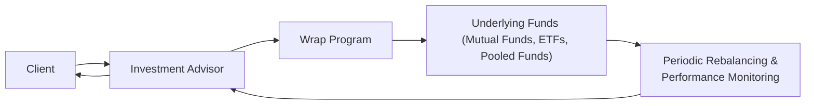

## 12.5 Wrap Products

It’s funny how often we hear people say, “I wish managing my investments wasn’t so confusing” or “I’m tired of juggling multiple accounts.” Heck, I’ve been there myself, back when I first started investing. That’s precisely where wrap products can step in—they bundle different services into a cohesive package and charge a single fee for it. Think of it like ordering a prix fixe menu in a restaurant: rather than paying à la carte, you get the appetizer, main course, and dessert all on one bill.

Wrap products can be a pivotal tool for investment advisors and their clients who crave seamless service. This section dives deep into wrap products, highlighting their unique structure, perks, downsides, regulatory considerations, and everything in between. We’ll also bring in real-world examples, personal anecdotes, and a dash of informality so it doesn’t feel like you’re wading through a finance textbook. Let’s get going.

### Definition and Rationale

A wrap product is an all-in-one solution that “wraps” several investment services—like portfolio management, ongoing advisory support, administrative tasks, and sometimes transaction costs—into a single annual fee. If you’ve ever tried to keep multiple statements, fees, and managers straight in your head, you know how complicated it can get. That’s one big reason wrap products exist: They simplify portfolio management and reporting by consolidating everything under one roof.

• All-Inclusive Fee: Instead of paying a separate fee for each service, you pay what’s often called a “wrap fee”—a flat or asset-based rate that covers most of your ongoing investment expenses.  
• Convenience and Clarity: You get one comprehensive statement that shows you what’s happening in your portfolio.  
• Professional Oversight: A team (or a specific manager) continuously monitors and rebalances your holdings as economic conditions and your goals shift.

The underlying rationale is straightforward: many investors desire professional management but do not want the headache of detailed cost breakdowns every single time a transaction happens. Wrap products respond to that desire with a neat, packaged solution. 

### Structure

Wrap products typically involve a roster of mutual funds, exchange-traded funds (ETFs), or even pooled funds managed by different portfolio managers. While the investment advisor orchestrates the big-picture asset allocation and picks the underlying managers or funds, the day-to-day selection of securities might be delegated to specialized professionals.

A common setup might look like this:

• You sign a wrap agreement with your investment advisory firm.  
• You each agree on an overall investment strategy—say, a balanced 60/40 equity-to-bond split—plus any constraints and objectives you might have (like moral/ethical screens or liquidity needs).  
• Within the wrap framework, the advisor chooses from funds or model portfolios that align with your profile.  
• The advisor, or a designated investment manager, periodically rebalances your holdings. E.g., if stocks skyrocket and surpass your 60/40 target, they might trim equities and replenish the bond allocation.  
• At quarter-end (or month-end, depending on the product), you receive one consolidated statement showing all your investments, how they’re performing, and how they’re allocated.

Here’s a simple Mermaid diagram to illustrate how a wrap product might be structured:

In this diagram, the client is at the heart of the relationship, but the advisor interacts with the wrap program, which includes a suite of underlying funds and rebalancing routines that feed back into the advisor’s recommendations.

### The Wrap Fee

At the core of wrap products is the wrap fee—often charged as a percentage of assets under management (AUM). This fee typically includes:

• Investment Management: Fees covering the underlying funds (some may have reduced management fees if they’re part of an in-house set of funds).  
• Transaction Costs: Commissions and other charges associated with buying or selling securities (though in some wrap programs, more frequent trading may result in surcharges).  
• Advisory and Administrative Expenses: The day-to-day cost of your advisor’s services, plus administrative tasks like account statements, regulatory filings, and record-keeping.  

Because you’re paying an all-inclusive rate, you generally don’t see a direct charge each time a trade is made—which can be appealing if you like the idea of consistent monthly or quarterly fees without a pile of individual transaction bills.

However, there’s a flip side: if you’re not very active in terms of trading or if you only require minimal advisory support, the wrap fee might end up being higher than what you’d pay by piecing everything together on your own. 

### Benefits for Investors

• Simplified Statements:  
  One of the biggest perks, as the name suggests, is wrapping all the services under one statement and fee schedule. If you have multiple assets spread across different accounts, it can feel like juggling lemons—sometimes you drop one simply because you can’t keep track of them all. Wrap products tidy that up.  

• Professional Management:  
  You get ongoing rebalancing and oversight from experts who (hopefully) know how to navigate market swings. Whether it’s a bull market or bear market, you’re not left second-guessing if it’s time to shift your allocation.

• Continuous Advisory Relationship:  
  The advisor’s role isn’t just a one-time consultation; it’s an ongoing partnership. That means if you have questions or if your financial goals change, you can talk it out.  

• Transparency of Ongoing Costs:  
  Because the wrap fee is often a straightforward percentage of assets, you have a good sense of what you’re paying each quarter. You get fewer hidden charges, fewer surprise transaction fees.  

### Considerations and Potential Drawbacks

While wrap products can simplify a lot, there are some important caveats:

• Cost Analysis:  
  Wrap fees might be higher or lower than investing in separate funds, depending on how often you trade and how many services you need. Some advisors say it’s worthwhile because it simplifies administration; others might find it’s not cost-effective compared to do-it-yourself or traditional commission-based models. Always request a detailed fee breakdown.  

• Transparency:  
  Although wrap products are marketed as transparent because fees are lumped together, that can sometimes obscure the detail of how each fee component is allocated. It’s good practice to ask, “How much is going to the fund managers? How much is for administrative costs?”  

• Manager or Product Restrictions:  
  In some wrap setups, you might be limited to a select menu of mutual funds or managers who have partnered with the advisory firm. That’s not necessarily bad, but it’s important to confirm you’re seeing a broad, unbiased selection of funds. 

• Potential Conflict of Interest:  
  Advisors might be incentivized to direct you toward in-house or affiliated funds to keep costs low for the wrap program—but that might or might not always match your best interests. The best advisors will make recommendations based on your goals, not on firm mandates.  

• Minimal Trading vs. Active Trading:  
  If you trade rarely, you might feel you’re paying for services you don’t fully use. Conversely, if you trade heavily, your wrap fee may be more than you’d pay if you executed trades in a standard commission-based environment.  

### Personal Anecdote

I remember advising a family friend—let’s call him Dave—who always had three or four separate brokerage accounts. He’d get a stack of statements each quarter and would inevitably ask, “Am I actually making money or not?” Because the statements all used different reporting styles, it was nearly impossible to see a true holistic picture. Switching to a wrap program changed that experience for him. Dave now gets one consolidated statement. He also likes that he can just call his advisor whenever something is on his mind without feeling the meter is ticking. That peace of mind can be priceless for the right type of client.

### Case Studies and Real-World Examples

Imagine a client who invests heavily in ETFs with minimal turnover. Let’s compare two scenarios:

• Traditional Commission-Based Model:  
  - Charges average around $6.99 per ETF trade.  
  - Minimal advisory support, maybe just an annual check-in.  
  - Big chunk of time spent manually rebalancing.  
  - Possibly requires paying a separate advisor fee, or no fee if the firm’s approach relies on transaction commissions.  

• Wrap Model:  
  - 1.2% annual wrap fee, covering all trades, advice, rebalancing, and a consolidated end-of-month statement.  
  - Access to in-depth analytics or performance-tracking tools.  

If the client occasionally trades but values the convenience of a dedicated advisor and consolidated statements, the wrap might be worth the fee. But if the client is a do-it-yourself type who rarely asks for professional guidance, the cost of 1.2% on the entire portfolio could be higher than paying a few transaction fees.

Always weigh the difference between service levels in each model. Some investors happily pay for the convenience, while others prefer the independence (and potential cost savings) of an a la carte approach.

### Regulatory Perspectives in Canada

In Canada, the regulatory environment for wrap accounts has evolved. The Canadian Investment Regulatory Organization (CIRO), established on January 1, 2023, after the amalgamation of the Mutual Fund Dealers Association of Canada (MFDA) and the Investment Industry Regulatory Organization of Canada (IIROC), is now the national self-regulatory body overseeing investment dealers, mutual fund dealers, and market integrity. 

When it comes to wrap products, CIRO emphasizes:

• Clear Fee and Conflict Disclosure: Advisors need to disclose fees and possible conflicts of interest fully.  
• Suitability: Wrap accounts must be recommended in appropriate circumstances, not simply because it’s a convenient or profitable structure for the advisor or firm.  
• Ongoing Client Communication: Continuous reviews ensure that the wrap program remains aligned with the client’s risk tolerance, objectives, and personal circumstances.  

For official notices or updates regarding fee-based and wrap accounts, the CIRO website at [https://www.ciro.ca/rules/notices](https://www.ciro.ca/rules/notices) is a key resource. Since CIRO replaced the old MFDA and IIROC, references to those previous organizations remain only as historical footnotes in many documents.

### Tools and Additional Resources

• Fund Comparison Engines: Tools like Morningstar or Fund Library ([https://www.fundlibrary.com](https://www.fundlibrary.com)) help you evaluate the performance, fees, asset mixes, and risk metrics of various funds that might appear in wrap programs.  
• Online Modules on Wrap Account Management: Several Canadian financial training providers offer courses or modules specifically for understanding the intricacies of wrap programs.  
• Open-Source Financial Tools: Budgeting or rebalancing spreadsheets (e.g., using Google Sheets or Excel templates) can provide a parallel check. Although your advisor handles rebalancing, maintaining your own spreadsheet is a nice way to understand what’s happening behind the scenes.  
• CIRO: As noted, for up-to-date regulatory guidance, check the CIRO website.  

### Glossary

Wrap Fee:  
A comprehensive charge covering investment management, advisory services, and sometimes transaction costs, typically expressed as a percentage of assets under management.

Pooled Fund:  
A private or institutional fund structure—such as a trust or limited partnership—where multiple investors combine their assets under professional management. Often available only to accredited or institutional investors, these funds may be offered within wrap products to expand diversification.

Rebalancing:  
The process of readjusting the proportions of assets in a portfolio. If one type of asset grows significantly, the portfolio is rebalanced by selling a bit of the winner and buying more of the underrepresented assets to maintain a target allocation.

### Best Practices and Pitfalls

• Ask for a Fee Breakdown: Even if you’re paying a single wrap fee, it’s wise to request a detailed breakdown. Know how much is going to the advisor, the fund manager, and transaction costs—or if any sub-advisor fees are included.  
• Assess Your Trading Style: If you expect frequent trades, see whether the wrap fee becomes more cost-effective than pay-per-trade, or vice versa if you rarely make adjustments.  
• Evaluate Provider Bias: Check if your advisor is restricted to certain in-house funds. In some wrap programs, you only have access to the firm’s proprietary products, which can limit diversity.  
• Regular Check-Ins: Even though the wrap takes care of rebalancing, do an annual or semi-annual meeting with your advisor. Make sure your life changes (new job, marriage, kids, estate planning, etc.) are reflected in your portfolio.  
• Compare Cost vs. Service Level: Some folks are quite willing to pay for peace of mind and built-in advice. Others prefer a lean cost structure. There is no universal right or wrong approach—the key is your personal preference and financial goals.

### Concluding Thoughts

Wrap products can be a game-changer for Canadian investors craving simplicity and a more hands-off approach. They package multiple services—trading, advisory, and administrative tasks—under one umbrella. That all-in-one convenience is often accompanied by a single wrap fee, which can be a breath of fresh air compared to separate, itemized costs. 

Of course, as with any financial arrangement, it’s important to ensure that a wrap account is truly the right fit. Costs, transparency, selection of managers, plus your own investment style—these factors all matter. If it aligns with what you need, a wrap product can free you from administrative hassles and allow you to focus more on your long-term goals. But if you’re an investment geek who loves micro-managing trades, or if your trading volume is so low that the wrap fee doesn’t make sense, you may want to look elsewhere. 

Ultimately, a thoughtful, informed decision—ideally made in close collaboration with a qualified advisor—will help you leverage the best of what wrap products have to offer.

---

## Test Your Knowledge: Wrap Products and Fee-Based Services Quiz



### Which of the following is a key characteristic of a wrap program?

- [ ] No annual fees, only transaction fees
- [x] A single fee covering multiple services and features
- [ ] Mandatory daily rebalancing
- [ ] Exclusively investing in government bonds

> **Explanation:** A hallmark of wrap programs is that they charge an all-inclusive "wrap fee," covering advisory services, transaction costs, and portfolio oversight under one umbrella.

### What primary benefit do wrap products offer to clients overwhelmed by multiple statements?

- [x] A single statement that consolidates different holdings
- [ ] Government subsidies on transaction fees
- [ ] Zero risk in the stock market
- [ ] Unlimited margin borrowing at no cost

> **Explanation:** Wrap products typically simplify portfolio management and reporting so clients can view all investments in one consolidated statement.

### Which of the following best describes a “wrap fee”?

- [x] A comprehensive fee that includes investment management, advisory, and transaction costs
- [ ] A performance-based fee only paid if the portfolio outperforms the market
- [ ] A fee paid exclusively for real estate investments
- [ ] A front-end load on mutual fund transactions

> **Explanation:** The core idea behind a wrap fee is that it covers numerous services, usually calculated as a percentage of the client's assets under management. 

### Why might wrap accounts be less cost-effective for someone who rarely trades?

- [x] They could end up paying a higher annual fee than if they paid commissions only when trading
- [ ] They tend to have higher minimum balance requirements than any other account type
- [ ] They are always more expensive for big portfolios
- [ ] They reduce the number of possible investment choices

> **Explanation:** For investors who trade infrequently and require minimal advisory services, paying a wrap fee can be more expensive than simply paying for occasional trades.

### Which regulator oversees compliance and standards for wrap accounts in Canada as of 2025?

- [x] The Canadian Investment Regulatory Organization (CIRO)
- [ ] The Mutual Fund Dealers Association (MFDA)
- [ ] The Investment Industry Regulatory Organization of Canada (IIROC)
- [ ] The Canadian Financial Advisors Association

> **Explanation:** In 2025, CIRO is the national self-regulator in Canada for investment dealers and mutual fund dealers. The MFDA and IIROC are historical predecessors.

### What is a potential drawback of some wrap programs where the advisor can only operate with in-house funds?

- [x] Limited selection of portfolios or managers
- [ ] No requirement for any wrap fees
- [ ] Guaranteed absolute returns
- [ ] Strictly balanced fund mandates

> **Explanation:** If a wrap program draws only from in-house funds, it may reduce the overall choices available, potentially creating conflicts of interest or limiting diversification.

### How does rebalancing contribute to the success of a wrap account portfolio?

- [x] It keeps the portfolio aligned with the investor’s risk profile
- [ ] It completely eliminates market risk
- [ ] It substitutes bonds with GICs every year
- [ ] It guarantees positive returns in any market environment

> **Explanation:** Rebalancing is the periodic process of readjusting assets to maintain a target allocation, thereby helping manage risk and stay aligned with a client’s objectives.

### Which scenario could make a wrap account advantageous for a busy investor?

- [x] An investor seeking ongoing advice and simplified statements
- [ ] An investor comfortable doing their own research and trades
- [ ] An investor who never wants to own anything other than GICs
- [ ] An investor with low capital and no desire for professional management

> **Explanation:** Wrap accounts tend to be beneficial for those who prefer delegation and streamlined reporting—especially if they regularly engage with their advisor’s insight.

### How is transparency maintained in wrap clients’ statements?

- [x] By providing consolidated reports and fee breakdowns upon request
- [ ] By only sending paper copies on a quarterly basis
- [ ] By refusing to disclose underlying fund performance
- [ ] By offering no details to avoid confusion

> **Explanation:** A hallmark of wrap programs is consolidated reporting. Investors should also request fee breakdowns if they want more detail on how their wrap fee is allocated.

### True or False: Wrap products remove the need for any ongoing advisory discussions.

- [ ] True
- [x] False

> **Explanation:** Wrap products are meant to foster an ongoing advisory relationship, not replace it. Continuous communication ensures critical changes in life or markets are reflected in the portfolio.


