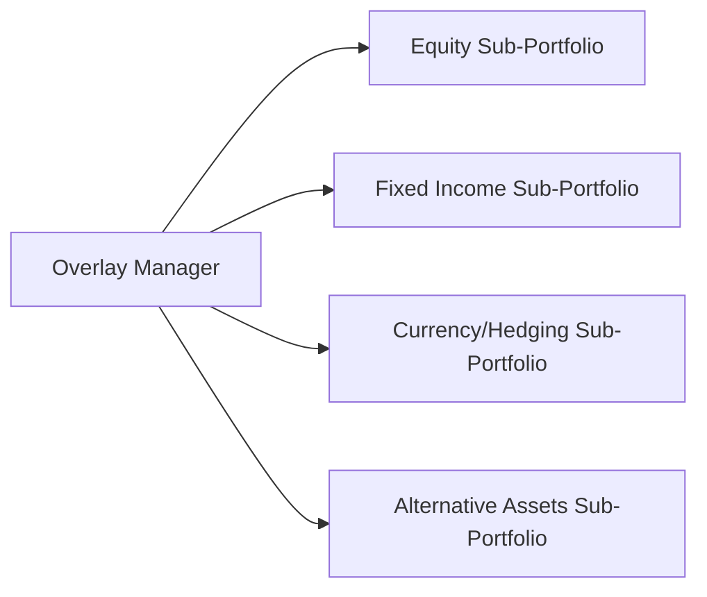
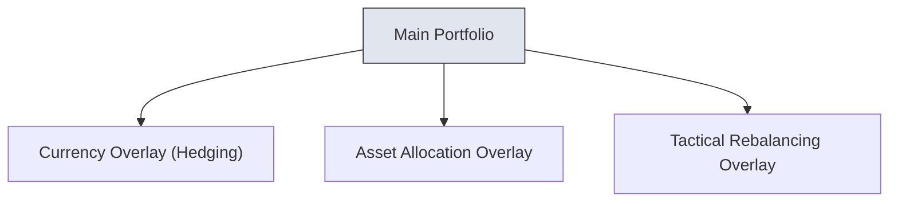

## 12.6 Overlay Management

Overlay management might sound like something right out of a fancy hedge-fund playbook, but it’s actually much more approachable than it first appears. Basically, overlay management is about putting someone—an overlay manager—in charge of coordinating all the moving parts of a complex portfolio so that everything lines up with a cohesive strategy. It’s like having a single driver for a very large bus full of passengers, each representing different asset classes or sub-portfolios. Let’s walk through the core ideas, common strategies, a few examples, and best practices for making the most of overlay management.

## Introduction
If you’ve ever tried to juggle multiple tasks at once—like making dinner, talking on the phone, and keeping an eye on the kids—you know how complicated life can get. Portfolios can be similar: you often have equities, bonds, maybe swaps, or foreign exchange exposures, and you’re trying to keep them all balanced. Overlay management aims to consolidate oversight so that each sub-portfolio or strategy doesn’t accidentally take on offsetting or duplicative positions. In other words, it prevents your left hand from undoing what your right hand just did.

A few years ago, I was working with a client who had separate managers for equities, bonds, and foreign currency hedging. Each manager was brilliant in their niche, but sometimes their actions counteracted each other. The equity manager might buy a stock with inherent foreign currency exposure, while the currency manager might hedge out that currency at the exact same time, leading to unnecessary costs. The client was basically paying extra for trades that canceled out. An overlay manager would have noticed that and found a more efficient approach.

## Key Concepts in Overlay Management
Overlay management can best be understood as an umbrella structure. Here’s a breakdown of some key ideas:

• Unified Strategy: Rather than letting each sub-portfolio operate in isolation, an overlay manager aligns them under a single, overarching strategy. This might involve setting max drawdown limits, risk boundaries, or expected return targets at the total portfolio level.

• Risk Coordination: Every sub-portfolio has its own risk exposures—equities carry market risk, bonds carry interest rate risk, currency holdings carry foreign exchange risk, and so on. The overlay approach identifies these risks, spots potential offsets (or redundancies), and decides how best to manage them.

• Trade Synchronization: Trades can be netted or aggregated to cut down on transaction costs. This often involves using derivatives (like futures, options, or swaps) to hedge certain risks (for example, currency or interest rate). By centralizing command over these tools, you can achieve cost efficiencies that might be missed otherwise.

• Transparency: Overlay management data often gets presented in a more holistic way. For instance, an investor can see exactly how each sub-portfolio’s risk profile contributes to the overall picture rather than looking at each piece in isolation.

Below, you can see a simplified diagram that might help visualize how an overlay manager interacts with various sub-portfolios. Imagine the overlay manager at the center, coordinating each moving piece:

In this diagram, the Overlay Manager has direct lines of communication with each sub-portfolio. Its main job is to ensure everything stays in sync, risks are balanced, and trades are consistent with the broader objectives.

## Rationale for Overlay Management
Overlay management can solve a ton of headaches. Let’s explore some benefits:

• Risk Control: By having a centralized view, the overlay manager can spot if the equity sub-portfolio is heavily exposed to, say, the U.S. dollar, while the currency sub-portfolio is selling U.S. dollars. If these exposures offset each other unnecessarily, you might be paying transaction costs for no real net effect. Central oversight can rectify this.

• Cost Efficiency: Consolidating trades across the entire portfolio can yield lower transaction costs because trades can be netted. For instance, if one sub-portfolio wants to buy 100 futures contracts and another wants to sell 80, the net trade is fewer than 100. You only pay the transaction costs on the net difference, which is often cheaper than two separate trades.

• Enhanced Transparency and Reporting: Overlay management allows for comprehensive, integrated reporting. Decision-makers can see the complete picture of risk exposures. Instead of having disjointed strategies, you have a single set of reports showing how each sub-portfolio is contributing to overall returns and risks.

• Consistent Implementation of Policy: Some investors have overarching policies, like “we want to maintain a 70/30 equity/fixed income mix, but we don’t want to exceed this volatility threshold.” Overlay managers can ensure these policies are actually implemented consistently across sub-portfolios, because they’re the ones who see all the angles.

## Common Overlay Strategies
When folks talk about overlay management, they’re often referring to three main categories:

Currency Hedging Overlays:  
– Suppose you have an international equity sub-portfolio with holdings in multiple currencies—CAD, USD, EUR, JPY, and so on. A specialized currency overlay manager uses derivatives to manage and hedge the foreign exchange (FX) risk. Perhaps they’ll buy CAD futures when your portfolio is too exposed to USD or offset a significant Euro risk using euro forwards. The goal: reduce unwanted FX fluctuations that might blow up your portfolio’s volatility.

Asset Allocation Overlays:  
– Market conditions can shift quickly. Maybe your client’s investment policy statement (IPS) states that equity exposure is set at 60%, but if market indicators hint at a downturn, the overlay manager might reduce equity exposure to 55%. They might do this by selling equity index futures or purchasing bond futures to tilt the overall portfolio. By adjusting exposures dynamically, they can maintain or tweak the portfolio’s strategic alignment to evolving markets.

Tactical Rebalancing Overlays:  
– This is a short-term approach. The overlay manager will look for opportunities in the short term—maybe there’s a sudden spike in the price of a commodity or a sudden shift in interest rates. While the core portfolio remains oriented toward long-term goals, the overlay manager might implement short-term trades to capitalize on (or protect against) ephemeral market conditions. The aim is to grab short-term alpha or hedge short-term risk without permanently altering the portfolio’s long-term stance.

Here’s a quick diagram showing how these overlay strategies can fit into the main portfolio:

In this schematic, the Main Portfolio sits at the top, representing your baseline mix of equities, bonds, and other assets, while the three overlay strategies feed back into it, adjusting exposures or hedging risks as needed.

## Practical Implementation of Overlay Management
Wondering how you actually go about putting overlay management into practice? The following steps typically come into play:

1. Establish Overall Investment Policy and Constraints  
   Define target allocations, acceptable risk limits, liquidity constraints, and any rules regarding leverage or derivatives usage. The overlay manager needs this blueprint to steer each sub-portfolio.

2. Identify Existing Exposures  
   You can’t manage what you don’t measure. So the next step is to figure out: “What are my current exposures?” Maybe you’ve got 70% equity in North American markets, 20% in fixed income, 10% in alternatives, plus currency exposures in USD, EUR, etc. The overlay manager puts all this data into a centralized system.

3. Design Overlay Strategies  
   Based on the exposures that exist (and the constraints from the policy), the manager might propose, for example, an FX hedging overlay so that no single currency constitutes more than 40% of the portfolio. Or they might set up an asset allocation overlay to tactically shift out of equities if certain market metrics indicate stormy weather ahead.

4. Execute and Coordinate Trades  
   The overlay manager regularly reviews the sub-portfolios to coordinate trades. They might net trades between sub-portfolios or place trades in derivatives markets as a more cost-effective way to handle rebalancing. For instance, if two sub-portfolios are both adjusting equity positions, the manager can combine or offset these orders, paying less in commission.

5. Monitor and Adjust  
   Markets don’t stand still, so constant monitoring is key. The overlay manager keeps track of performance, re-checks the portfolio’s overall risk posture, and then revisits each overlay strategy. If the portfolio’s client decides to revise their risk tolerance or investment objectives, the manager will adjust accordingly.

6. Report Holistically  
   Instead of separate reports for each sub-portfolio, the overlay manager produces an integrated summary. This might show the combined effect of currency hedges, the net equity position, or how short-term tactical moves are impacting overall performance.

## Challenges and Potential Pitfalls
Overlay management does carry complexities:

• Communication Gaps: If sub-portfolio managers and the overlay manager don’t communicate in real time, trades can happen in isolation. Good data-sharing protocols and systems integration are vital.

• Over-Optimization: Sometimes an overlay manager might be so laser-focused on short-term inefficiencies that they undermine the portfolio’s long-term goals. Striking the right balance is key.

• Operational Complexity: Overlay management demands robust back-office systems. You need to handle margin, collateral, and netting across various instruments. A misstep can lead to big losses or compliance issues.

• Regulatory Hurdles: Dealing with derivatives and short-term tactical overlays can trigger additional rules. In Canada, derivatives users must comply with CIRO guidelines and be mindful of proficiency requirements—like passing the Derivatives Fundamentals Course (DFC). Globally, bodies such as the Global Association of Risk Professionals (GARP) also provide frameworks and industry-accepted best practices.

## Canadian Regulatory and Institutional Considerations
Historically, Canada had two separate self-regulatory organizations (SROs): the Mutual Fund Dealers Association of Canada (MFDA) and the Investment Industry Regulatory Organization of Canada (IIROC). As of January 1, 2023, these two merged into the Canadian Investment Regulatory Organization (CIRO), which is now the single national SRO overseeing investment dealers and mutual fund dealers in Canada. If you’re dealing with derivative overlay strategies, you’ll need to ensure you’re compliant with the relevant CIRO rules and guidelines. For official references or updates, always check the CIRO website at [https://www.ciro.ca](https://www.ciro.ca).

Additionally, the Canadian Investor Protection Fund (CIPF) is Canada’s sole investor protection fund (as of January 1, 2023) and provides coverage if a CIRO member firm goes insolvent. Overlay strategies often rely heavily on derivatives; if your firm is a member of CIRO, CIPF coverage extends to protect client assets in case of dealer insolvency, but it does not cover market losses or currency fluctuations.

## Real-World Example: Currency Overlay in a Global Portfolio
Imagine a Canadian pension fund invests in beta-driven global equities, weighting them across the U.S., Europe, and Asia. Without an overlay manager, the fund might see big swings in returns because currency moves can overshadow the stock gains. By hiring a currency overlay manager, the pension fund can smooth out the foreign exchange volatility. The manager checks the fund’s net currency exposure, determines the target hedge ratio (say, 50% of USD exposure and 30% of EUR), and implements cross-currency swaps or forward contracts. This reduces the risk that an appreciating Canadian dollar will erode foreign returns. 

## Best Practices
• Set Clear Objectives: Know exactly what you’re aiming for—reduced volatility, optimized returns, or both. Communicate this thoroughly with both the overlay manager and sub-portfolio managers.  
• Emphasize Collaboration: The overlay manager should be in regular contact with sub-portfolio managers. Encourage open data sharing to eliminate redundancies.  
• Use Technology Wisely: Automated systems can help track risk exposures in near real time, ensuring the manager always has the most up-to-date info.  
• Monitor Costs: When you’re dealing with derivatives and short-term trades, costs can add up fast. Ensure each overlay strategy adds value after fees.  
• Continual Education: Overlays can be complex and ever-evolving. Staying on top of derivative strategies via the CIRO’s Derivatives Fundamentals Course or exploring resources from GARP’s “Principles of Financial Derivatives” can keep your team skilled and informed.

## Glossary
• Overlay Manager: A manager responsible for coordinating the overall portfolio structure, ensuring each sub-component aligns with a unified strategy.  
• Derivatives: Financial instruments (like futures, options, and swaps) whose value is derived from underlying assets—such as equities, bonds, or currencies.  
• Hedging: Strategies designed to offset potential losses in one position by taking an opposite position in a related security or derivative instrument.  
• Netting: Combining or offsetting opposing positions to reduce the total volume of trades, thereby cutting transaction costs and operational risks.  

## Additional Resources
• CIRO (Canadian Investment Regulatory Organization): [https://www.ciro.ca](https://www.ciro.ca) – Canada’s current national SRO for investment dealers.  
• CIPF (Canadian Investor Protection Fund): [https://www.cipf.ca](https://www.cipf.ca) – Sole investor protection fund for clients of CIRO member firms.  
• GARP (Global Association of Risk Professionals): “Principles of Financial Derivatives” – A well-regarded resource for anyone dealing in derivatives.  
• Google Scholar Search: “Overlay Management in Portfolio Construction” – Ideal for peer-reviewed academic research on overlay strategies.  
• Derivatives Fundamentals Course (DFC): Provided under CIRO’s proficiency standards, covers essential knowledge for using derivatives within Canadian markets.

## Conclusion
Overlay management is essentially about gluing all the puzzle pieces of your portfolio together—bonds, equities, currencies, you name it—under one strategic roof. By centralizing oversight, you can reduce duplicative trades, keep a tighter rein on risk exposures, and (hopefully) save on costs in the process. It’s not a magic cure-all, but it can be a powerful way to ensure that every part of your portfolio is working in harmony rather than at cross purposes.

If you’re looking to implement an overlay solution, start by clarifying your portfolio’s overall objectives and constraints, then bring in an overlay manager (or make sure your team is skilled up on derivative instruments and risk management). Pay attention to regulatory requirements, especially in Canada, where CIRO supervises all the relevant rules and proficiency standards. Overlay management might feel complicated at first, but once you see how it can smooth out those discordant notes in a multi-asset portfolio, you might never go back to a fragmented approach.

--------------------------------------------------------------------------------

## Test Your Knowledge: Overlay Management Essentials



### Which of the following best describes overlay management? 
- [ ] A method to trade only individual stocks without diversification
- [x] A portfolio approach coordinating multiple sub-portfolios under a single strategy
- [ ] A technique exclusively designed for day trading currency pairs
- [ ] An insurance policy for protecting only equity positions

> **Explanation:** Overlay management is about aligning various sub-portfolios and strategies so that they collectively follow a unified approach. It’s not restricted to day trading or single-stock methods, and it isn't mere insurance.

### Which is a key advantage of overlay management?
- [x] It integrates trades and reduces transaction costs
- [ ] It eliminates the need for any derivative instruments
- [ ] It licenses a manager to trade outside an investor’s risk tolerance
- [ ] It removes the possibility of portfolio losses

> **Explanation:** By consolidating and netting trades across numerous sub-portfolios, overlay management can minimize transaction costs. It doesn’t remove losses entirely, nor does it mean you don’t need derivatives. It also doesn’t allow trading outside of your policy guidelines.

### How does a currency overlay strategy typically work?
- [ ] Buying only foreign stocks whenever the local currency is weak
- [x] Using derivatives to hedge or manage foreign exchange risk in international holdings
- [ ] Converting all foreign assets back to domestic currency immediately
- [ ] Avoiding all foreign investments to bypass currency risk

> **Explanation:** Currency overlay strategies use derivatives—like forwards or swaps—to reduce unwanted FX volatility in a portfolio with multiple foreign investments.

### In the context of overlay management, what does "netting" refer to?
- [x] Offsetting buying and selling orders to reduce total transaction costs
- [ ] Buying stocks in bulk at the end of each quarter
- [ ] Reconciling capital gains on a weekly basis
- [ ] Consolidating all sub-portfolios into one investment instrument

> **Explanation:** Netting involves offsetting buy and sell orders across sub-portfolios to reduce overall commissions and slippage, which is a key efficiency gained under overlay management.

### Which role does the overlay manager primarily fulfill?
- [x] Coordination of asset allocation and risk exposures across various sub-portfolios
- [ ] Solely analyzing the bond market for interest rate trends
- [x] Overseeing derivatives hedges to align with overall strategy
- [ ] Setting corporate governance policies for all investee companies

> **Explanation:** The overlay manager’s key function is to oversee and unify portfolio exposures, often using derivatives. They can look at asset allocation, coordinate among sub-managers, and ensure rebalancing is in line with the overarching strategy.

### Which of the following is a common overlay strategy?
- [x] Currency hedging
- [ ] Purchasing only short-term government bonds
- [ ] Holding large cash reserves for indefinite periods
- [ ] Eliminating all market risk from the portfolio

> **Explanation:** Currency hedging overlays are extremely common—especially for large portfolios with multiple foreign currency exposures.

### What is one potential pitfall of overlay management?
- [x] Over-optimization that conflicts with long-term goals
- [ ] Having too many sub-managers coordinating in unison
- [x] Regulatory freedom from all derivative licensing requirements
- [ ] Full protection from any market downturn

> **Explanation:** Over-optimization can undermine the portfolio’s big-picture strategy. Additionally, using derivatives may require regulatory compliance and licensing, so “regulatory freedom” doesn’t exist under these rules.

### Why is collaboration between the overlay manager and sub-portfolio managers important?
- [x] To ensure trades are not duplicative or offsetting
- [ ] To guarantee each sub-portfolio uses different custodians
- [ ] To meet the legal requirement of daily phone meetings
- [ ] To avoid trading in any global market

> **Explanation:** Collaboration helps avoid conflicting or redundant positions and ensures the overall strategy is consistently implemented.

### Which Canadian regulatory body oversees proficiency standards for derivatives?
- [ ] The defunct Investment Industry Regulatory Organization of Canada (IIROC)
- [ ] The defunct Mutual Fund Dealers Association of Canada (MFDA)
- [x] The Canadian Investment Regulatory Organization (CIRO)
- [ ] The Canadian Investor Protection Fund (CIPF)

> **Explanation:** As of January 1, 2023, CIRO is Canada’s sole self-regulatory body, overseeing derivatives, licensing, and market integrity for investment dealers and mutual fund dealers.

### Overlay management guarantees profit and eliminates market volatility. True or False?
- [ ] True
- [x] False

> **Explanation:** While overlay management can optimize risk exposures and costs, it cannot eliminate market volatility entirely nor guarantee profits.


