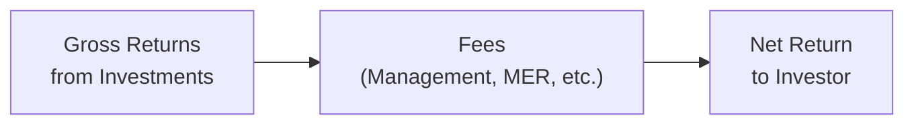
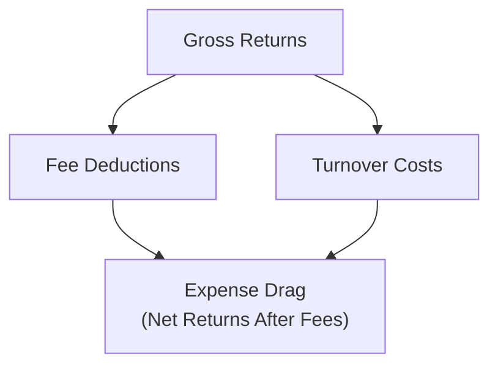

## 12.7 Fees and Turnover

Picture this scenario first: My cousin, Lucy, once called me in a panic. She had just opened her very first investment account—she was so excited about her shiny new mutual fund. Then she noticed a list of fees that seemed longer than her grocery receipt. She asked, “Wait, am I paying this every year? Every trade? How does this cut into my returns?” And honestly, these are super valid questions that everyday folks, as well as finance professionals, need to ask. Fees can really undermine your returns if you don’t understand them, and turnover in a fund can further complicate matters by adding transaction costs and taxable events. 

This section aims to clarify fees and turnover inside conventionally managed products such as mutual funds, wrap products, or conventional managed portfolios—basically, your average “let-the-management-team-handle-it” investment vehicle. We’ll discuss management fees, performance fees (when they apply), and that all-important management expense ratio (MER). Then we’ll tackle turnover ratio, its effect on taxes, and how the net result may impact your returns.

Along the way, we’ll keep things real with relatable examples (like Lucy’s situation) and some data visualizations to illustrate key points. There’s a bit of Canadian regulatory context sprinkled throughout (for Lucy and all other Canadian investors), but most of these principles hold globally.

---

### Why Fees and Turnover Matter

If you recall from Chapter 12’s earlier sections, conventionally managed products are designed to provide professional investment management, convenience, and sometimes diversification. But behind the scenes, the management team is incurring costs. At the same time, they’re possibly rebalancing the fund to follow certain strategies, which can trigger various expenses. Those two elements—fees and turnover—directly shape your net return.

Fees typically appear in several ways:
• Management fees  
• Operational expenses  
• Performance fees (in selected cases)  

Turnover ratio, on the other hand, indicates how actively the fund’s manager trades within the portfolio. That can drive costs up, particularly if the trades are frequent or occur in markets with higher transaction fees.

Let’s take a look at these issues in more detail.

---

### Fee Structures

Anyone who’s ever shopped around for a mutual fund or an Exchange-Traded Fund (ETF) knows fees come in all shapes and sizes. Names for fees can vary somewhat among providers, but the general structure remains fairly consistent.

#### Management Fees

Management fees are basically the compensation the fund company charges you for managing the investments. Think of it as paying a manager for using their expertise to pick securities, manage risk, and (hopefully) deliver good performance. These fees are typically a percentage of the fund’s assets under management. For example, a 1.5% management fee means that if you invest CAD 10,000, the annual management fee is CAD 150.

Now, you might ask, “Is that all I pay?” Usually not exactly. That’s because there can be additional operational costs like recordkeeping fees, marketing expenses, and sometimes distribution (or trailer fees) to dealers. If you’re a Canadian investor, you’ll see these listed in the prospectus or Fund Facts documents. According to guidance from the Canadian Securities Administrators (CSA), a point-of-sale disclosure highlights these fees more transparently than in the past. So, for instance, you’d see the breakdown in your Key Facts or Fund Facts document showing how much is allocated to management fees and how much goes to operating and trading expenses.

#### MER (Management Expense Ratio)

The MER is a consolidated measure of these recurring annual costs—like management fees, operating expenses, and sometimes certain taxes—expressed as a percentage of the fund’s average net assets. If you see an MER of 2.00%, that indicates that 2.00% of the fund’s total assets are used each year to cover the cost of running the fund.

It’s important to note that the MER doesn’t always include trading costs (commissions, bid-ask spreads, etc.). In truth, some mutual funds or ETFs also disclose a separate trading expense ratio (TER). When the MER and the TER are combined, some folks call that the total cost ratio. But you’ll typically see “MER” thrown around as the main cost figure in everyday conversation.

If a fund’s MER seems relatively high—like above 2%—the manager needs to deliver outperformance to justify those fees in the eyes of investors. Put another way, if you’re paying 2%, the fund has to earn more than a simpler, cheaper product (maybe an ETF with a 0.10% expense ratio) to make sense for you. In some cases, investors prefer lower-cost index funds or ETFs because the MER is so much smaller.

#### Performance Fees

Performance fees, also known as incentive fees, emerge more frequently in hedge funds or specialized private funds. However, they can crop up in some actively managed mutual funds, too. Essentially, if the manager beats a specific benchmark or a high-water mark, they’re entitled to a portion of the outperformance. This can range from a small portion, say 10% of gains over a benchmark, to more generous splits, but it’s far less common in “plain vanilla” mutual funds for everyday retail investors in Canada.

The key thing: Performance fees can motivate strong active management. But they can also encourage risk-taking. As an investor, you’ll want to be sure you’re comfortable with the manager’s style and the possibility that performance fees might spur them to assume bigger bets.

---

### Impact on Returns

Everyone invests to, well, make money—whether that’s for retirement, buying a home, traveling, or philanthropic objectives. But fees eat away at returns. It’s as if you’re running a race while carrying a small backpack of rocks. The heavier the backpack, the harder it is to arrive ahead of other folks who aren’t weighed down as much.

Below is a simple flowchart showing how fees reduce your net returns:

The net return is the return you actually receive after all fees—management, performance, operational—are subtracted from the fund’s total gains.

Let’s look at a quick example: Suppose a balanced mutual fund delivered a gross annual return of 8%. With an MER of 2%, your net return drops to 6%. If you invest CAD 10,000, that’s a difference of CAD 200 in a single year. Over many years, this difference magnifies significantly via compounding. 

A helpful resource here is Morningstar’s “Fund Fee Calculator.” You can plug in your fund’s MER, your initial investment, how long you plan to invest, and your expected annual return, and it’ll show you just how much you might pay in fees overall. Although the final figure is an estimate, it’s an eye-opener for many folks—like Lucy, who realized a huge portion of her gains was going to fees, especially since her fund was fairly average in performance.

---

### Turnover Ratio

If you’ve ever watched an active manager in action, you know they buy and sell securities regularly to capture opportunities. Sometimes it’s once a quarter, sometimes it’s daily. But how does that activity show up in the fund’s metrics?

#### Definition

The turnover ratio is a simple measure of how frequently the fund’s portfolio holdings are replaced during a year. For instance, a 100% turnover ratio suggests that the entire portfolio was effectively bought and sold once during that period. Meanwhile, a 200% turnover ratio might mean that holdings were turned over twice, indicating a very active trading strategy.

#### Effect on Costs and Taxes

High turnover often means higher transaction costs, including broker commissions, bid-ask spreads, and potential market-impact costs. Even if these expenses are small individually, they can add up quickly.

In addition, every time a profitable position is sold, a capital gain is realized. In a taxable account, that can trigger capital gains tax for unitholders who hold the fund. Distribution of capital gains means you might pay taxes even if you didn’t personally sell your shares in the mutual fund. If your investment is in a tax-deferred account (like a Registered Retirement Savings Plan (RRSP) in Canada), this might not be a big deal right now, but it could still impact your tax situation eventually.

Hence, turnover ratio, and the associated trading costs, becomes an invisible line item for a lot of investors. It’s not always neatly displayed on the label like the MER. Still, it can sometimes appear in the fund’s annual reports under the “Statement of Operations,” or you’ll see it referenced in more detailed commentary from the fund manager.

#### Implications for Investors

A higher turnover strategy isn’t inherently bad. In a turbulent market, active managers who trade frequently may mitigate losses and capture opportunities. But these trades cost money, and they can generate taxable events. So if you’re an investor holding these funds in a non-registered (taxable) account, you’ll want to weigh whether the potential of outperformance is worth the additional tax liability and trading expenses.

In generally stable markets, it might be challenging for a high turnover fund to produce net returns (after fees and taxes) that beat a more passive alternative. Still, some managers make the case that their frequent reallocation justifies the higher costs by creating better risk-adjusted returns. As an investor, you might want to examine actual performance data over multiple years. Also, you should consider your personal situation—particularly your tax bracket and your investment horizon.

---

### Another Look at Expense Drag

“Expense drag” is a term sometimes used to describe how fees and trading costs collectively reduce a fund’s gross returns. Consider it the friction from the management process. That friction might be worthwhile if the management team is adding enough value. However, especially in a lower-return environment, significant fees and frequent turnover can easily outweigh the benefits of active management.

Here’s a quick visual showing how turnover and fees together can pull down gross returns:

Over a long investing timeline—10, 20, or 30 years—even small variations in fee percentages and turnover can balloon into large differences in your portfolio’s ending value. 

---

### Practical Example: Lucy’s Dilemma

Let’s say Lucy invests CAD 10,000 in a mutual fund with a 2% MER. The fund has a turnover ratio of 80% in a typical year. Suppose the gross return is 8%. Here’s a simplified illustration of Lucy’s net outcome:

• Gross Return: 8% of CAD 10,000 = CAD 800  
• Less MER: 2% of CAD 10,000 = CAD 200  
• Turnover costs (assume 0.5% of CAD 10,000) = CAD 50  

So initially, you might look at the 8% return and think Lucy’s making CAD 800, but once fees and turnover costs are done, she’s down to CAD 550 in net gains (effectively 5.5%). If we factor in capital gains tax from frequent trading (assuming Lucy is in a taxable account), she might see an even lower net figure. These costs won’t always be laid out for you quite this plainly.

---

### Canadian Regulatory Context and Best Practices

As of 2025, the Canadian Investment Regulatory Organization (CIRO) is responsible for overseeing investment dealers, mutual fund dealers, and marketplace integrity. Previously, there were two separate self-regulatory organizations—IIROC and MFDA—but they have been amalgamated into CIRO. The Canadian Investor Protection Fund (CIPF) now operates as the sole investor protection fund for clients of SRO member firms.

From a disclosure perspective, the CSA (Canadian Securities Administrators) has made efforts for more transparent fee disclosure. Investors receive documents like Fund Facts or ETF Facts that outline:
• The fund’s MER  
• Fund performance history  
• Risk rating  

The “Point of Sale” (POS) disclosure rules have also improved how these fees are shown and explained to investors before they purchase. Furthermore, the Continuous Disclosure Obligations (National Instrument 81-106 in Canada) require funds to provide timely updates on their financial statements and annual disclosures, which typically discuss turnover and fees in more detail.

---

### Reducing the Drag: Strategies for Investors

No one wants to hemorrhage money through fees and taxes. But how can you limit the damage?

• Compare MERs. If you’re considering a mutual fund, look for a lower MER alternative if the performance record and manager track record are comparable.  
• Monitor turnover. If you suspect a high turnover ratio is leading to bigger tax bills and transaction costs, check the fund’s annual report or Fund Facts to find its turnover ratio.  
• Use tax-sheltered accounts where possible. In Canada, RRSPs and TFSAs can help reduce the tax bite from capital gains distributions attributable to higher turnover.  
• Consider passively managed or index solutions. Index funds generally have lower turnover, so they typically produce fewer realized capital gains.  
• Evaluate total returns net of fees. Ultimately, your net return is what matters, so always look at risk-adjusted returns after all costs.  

---

### Tools and Resources

For further reading and assistance checking fees and turnover data:

• [CSA Investor Tools](https://www.securities-administrators.ca/investor-tools) – Official site covering Canadian securities regulation, with helpful resources on fee disclosures and investor protection.  
• [Morningstar Fund Fee Calculator](https://www.morningstar.ca) – Evaluate how fees will affect your long-term returns.  
• “Common Sense on Mutual Funds” by John C. Bogle – Though focusing on U.S. mutual funds, Bogle’s philosophies about costs and indexing are highly influential worldwide.  
• Fund’s Annual Information Form or Simplified Prospectus – These documents often detail management fees, performance fees (if any), and turnover ratios.  
• CIRO website: [https://www.ciro.ca](https://www.ciro.ca) – Learn more about today’s Canadian regulatory environment, updates, and guidelines.

---

### Putting It All Together

Fees and turnover might not be the most glamorous topics, but they are central to understanding how your investment returns get whittled down before they arrive in your hands. Whether you’re new to investing (like Lucy) or a seasoned pro, keep your eye on fees (MER, management fees, and performance fees)—every single fraction of a percent can put a noticeable dent in your returns over time. 

Similarly, watch out for high turnover strategies that might lead to increased taxation in a non-registered account and bigger trading costs. One fund manager’s swift trades could be beneficial if they manage volatility well, but you have to see the net result, factoring in the cost of doing all that trading. 

In essence, always ask, “Is the manager adding more value than the costs they incur?” If the answer is yes, you might accept higher fees and turnover. If it’s no—or if you simply prefer a more hands-off approach—there’s a growing palette of lower-fee offerings, including index funds, ETFs, or other strategies that aim to minimize turnover while delivering broad market returns.

It’s all about achieving a comfortable balance: maximizing net returns in line with your personal risk tolerance and investment objectives. Fees and turnover aren’t the only puzzle pieces, but they’re definitely among the biggest.

---

## Test Your Knowledge: Fees and Turnover Fundamentals



### In the context of mutual funds, what do management fees typically cover?

- [x] Costs of managing and administering the fund on a day-to-day basis
- [ ] Costs of paying capital gains taxes on behalf of investors
- [ ] Brokerage fees related to trading in the fund
- [ ] Custodial charges for storing physical gold

> **Explanation:** Management fees generally cover fund management and operational administration. They do not include trading costs or taxes.

### Which of the following is included in the Management Expense Ratio (MER) of a fund?

- [x] Management fees plus most operating expenses
- [ ] Only management fees
- [ ] Only brokerage fees
- [ ] Capital gains taxes owed by investors

> **Explanation:** MER is a consolidated measure of the fund's management fees and recurring operating expenses. It typically does not include incremental trading costs or investor taxes.

### What is one commonly cited consequence of a high turnover ratio?

- [x] Increased trading costs
- [ ] Reduced transparency in fund holdings
- [ ] Automatic MER reduction
- [ ] More accurate benchmarking against the index

> **Explanation:** Higher turnover means more frequent buying and selling, which leads to higher trading costs and potentially higher taxes for investors.

### If a mutual fund has a gross annual return of 10% but an MER of 2%, approximately what is the net return to the investor, ignoring other factors?

- [x] 8%
- [ ] 10%
- [ ] 5%
- [ ] 2%

> **Explanation:** A 2% MER reduces the return from 10% to around 8%.

### Which of the following best describes a performance fee in a mutual fund?

- [x] A fee charged when the fund performance exceeds a specific benchmark
- [ ] A fee charged whenever the fund underperforms its peers
- [x] A fee usually found in more specialized or actively managed funds
- [ ] A fee charged to pay the salaries of the fund managers regardless of returns

> **Explanation:** Performance fees are earned by the manager if the fund outperforms a benchmark (or meets another performance hurdle). They’re more common in premium or specialty funds.

### How can a high turnover ratio impact investor taxes in a taxable account?

- [x] It can lead to more frequent realized capital gains
- [ ] It always converts any capital gains into capital losses
- [ ] It eliminates capital gains completely
- [ ] It is unrelated to capital gains or investor taxes

> **Explanation:** A high turnover ratio often triggers more frequent capital gains distributions, which can result in higher tax liabilities for investors in taxable accounts.

### Which Canadian organization is now responsible for overseeing investment dealers and mutual fund dealers as of 2025?

- [x] CIRO (Canadian Investment Regulatory Organization)
- [ ] IIROC
- [x] MFDA
- [ ] OSC

> **Explanation:** IIROC and the MFDA have amalgamated into CIRO. Historical references to IIROC or MFDA should be noted as defunct, with CIRO being the national SRO in 2025.

### Why is the MER not always the complete representation of a fund's total costs?

- [x] Trading costs are often excluded from the MER
- [ ] MER also includes the investor’s personal income taxes
- [ ] MER usually includes no operational expenses
- [ ] MER typically covers only specialized performance fees

> **Explanation:** Trading costs, such as commissions and bid-ask spreads, are not included in the MER but can still significantly affect net returns.

### What is one strategy to mitigate the impact of high turnover in a mutual fund portfolio?

- [x] Holding the fund in a tax-sheltered account like an RRSP or TFSA
- [ ] Selling off the mutual fund shares daily
- [ ] Encouraging the fund manager to trade even more frequently
- [ ] Avoiding rebalancing entirely

> **Explanation:** Placing high-turnover mutual funds into tax-advantaged accounts can help reduce the tax implications from frequent capital gains.

### True or False: “If a fund’s fees seem high, it must be poorly managed.”

- [x] True
- [ ] False

> **Explanation:** This is tricky. High fees do not necessarily mean a fund is poorly managed, but the manager must deliver sufficient outperformance to justify the higher costs. Investors should evaluate net performance and risk.


