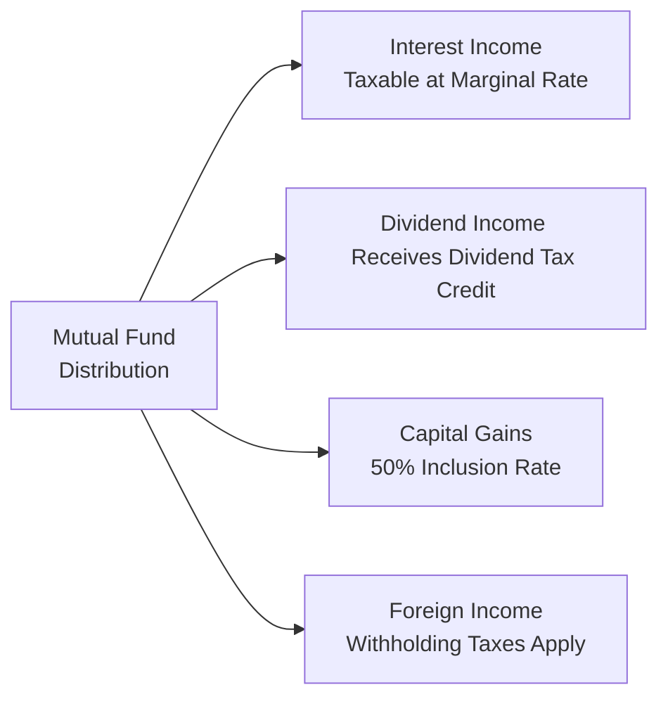
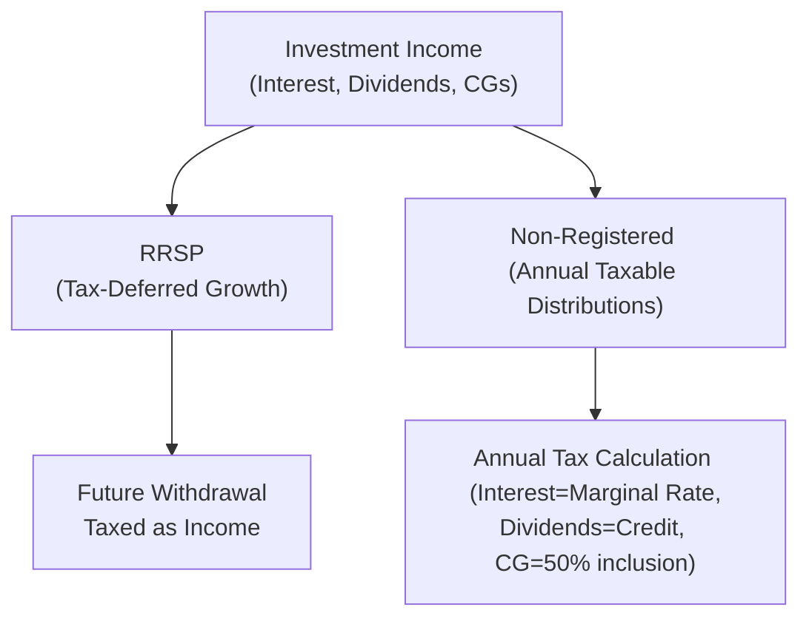

## 12.8 The Relationship Between Taxes and Returns on Conventionally Managed Products

So, let’s talk about something that I’ve seen catch quite a few people off guard—how taxes can seriously affect their investment returns, particularly when we’re dealing with “conventionally managed products” such as mutual funds, wrap accounts, and closed-end funds. I remember a friend once got really excited after reading a fund’s performance chart, only to discover (during tax time) that her net return was a lot lower than she expected. She literally said, “Where did my gains go?” Well, although it’s not the most thrilling topic, understanding how taxes chip away at your returns or sometimes surprise you with a bigger tax bill is absolutely essential to being a savvy investor or advisor.

Below, we’ll dig into the nitty-gritty of how distributions from these products are taxed, how asset location can help keep some of those taxes in check, why turnover might become your worst enemy around year-end, and how leveraging registered accounts can shape your strategy. We’ll also use some illustrative examples, introduce a couple of diagrams, and reference relevant Canadian regulations (with a quick nod to global practices here and there). Whether you’re brand new to the financial world or knee-deep in portfolios, hang on—there’s likely something in here to help you sharpen your approach and optimize after-tax returns.

Understanding the Basics of Taxation on Mutual Funds and Other Conventionally Managed Products

When you invest in a mutual fund, a closed-end fund, or a wrap program, your returns come in various forms. These products gather money from several investors, pool the funds, invest in (hopefully) promising securities, and then distribute gains or losses. Many folks forget that the tax consequences can be quite different depending on whether you received interest income, dividends, or capital gains. Foreign income also has its own special twists. Let’s talk about each category first.

Taxation of Distributions

Interest Income  
Interest income distribution is often the most straightforward form of investment return—but ironically, it tends to be the least tax-friendly. In Canada, interest income is taxed at your marginal tax rate. That means if your total income puts you in a higher tax bracket, you’ll be paying that same rate on your interest. Suppose you’re at a 40% marginal rate, and your fund distributes CAD 1,000 in interest over the year, well, you might owe about CAD 400 in taxes. Depending on your personal tax situation, that can sting a bit.

Dividend Income  
Dividends paid from eligible Canadian corporations are treated more favorably in Canada, thanks to the dividend tax credit. The government’s logic is that the corporation paying the dividend has already paid corporate taxes on that income, so you get a credit to avoid double taxation. For instance, if you hold mutual funds that invest predominantly in Canadian companies paying dividends, you might see a lower effective tax rate on those distributions compared to interest. It’s like a small pat on the back from Canada’s tax system for investing in domestic corporations.

Capital Gains Distributions  
Now we come to capital gains distributions, which are taxed at a 50% inclusion rate. That means only half of any realized capital gain is added to your taxable income. If the mutual fund manager sells a security in the fund, generating a large capital gain, they may distribute that gain to unitholders. You, as the investor, end up paying the tax on your portion of the gain. Practically, this can be smaller than paying taxes on interest because only half of the gain is taxed. However, capital gains can be unpredictable—sometimes managers sell more frequently than you expect, triggering distributions at inconvenient times.

Foreign Income  
Funds that invest in foreign securities—U.S. stocks, European equities, emerging markets, and so forth—often generate foreign income. This income may be subject to withholding taxes imposed by the foreign jurisdiction. Plus, in Canada, foreign-sourced income doesn’t get the dividend tax credit advantage. Typically, it’s taxed as ordinary income at your marginal rate. You may, however, get a foreign tax credit to offset some of the withholding tax, but it rarely eliminates the entire additional cost.

Here’s a quick visual overview to make this more concrete (and a bit more fun):

This flowchart is a simplified depiction of how different distributions from a single fund can be classified and taxed differently once you, the investor, receive them.

Tax-Efficiency Considerations

Asset Location Strategies  
I recall a time when I just started investing, and I plopped everything in my non-registered brokerage account. I thought, “Well, it’s simpler.” Then tax time rolled around, and I realized my interest-bearing fixed income funds were generating more in taxes than in net returns. That’s where asset location comes in. If you have an RRSP (Registered Retirement Savings Plan), a TFSA (Tax-Free Savings Account), or other registered vehicles, you can get some sweet tax deferral or tax-free growth on interest income that’s usually the worst offender from a tax standpoint. Meanwhile, capital gains and Canadian dividends might be more suitable in non-registered accounts, because they receive relatively favorable tax treatment. Over time, efficiently allocating your assets across registered and non-registered accounts can have a huge impact on how much money stays in your pocket.

Turnover Impact  
Another big factor is portfolio turnover. Picture a mutual fund that’s constantly buying and selling stocks to chase short-term market opportunities. Let’s say it does well and ends up with realized gains. Guess who picks up the tax bill on those gains: you, the unitholder. High turnover can create frequent taxable events and, ironically, reduce your overall after-tax performance if not properly planned for. Many funds with higher turnover advertise strong gross performance, but when you net out the taxes, the story can be a little less rosy.  

Year-End Distributions  
One little unpleasant surprise for investors is what’s known as “buying a distribution.” If you buy units in a mutual fund late in the year, specifically before they pay out their annual distribution, you might get saddled with a year-end capital gains distribution for gains that accrued long before you jumped in. In other words, you might be paying taxes on gains you never actually enjoyed as an investor. It’s a bit like walking into a party right at the end—and then still having to help clean up. To avoid this, some advisors suggest holding off new purchases until after the distribution date is announced or has passed, especially if it’s a non-registered account.

Registered vs. Non-Registered Accounts

Registered Accounts (e.g., RRSP, TFSA, RESP)  
In Canada, many of us are big fans of the RRSP—a wonderful device for deferring taxes on contributions and allowing investments to compound tax-free until withdrawal. Then there’s the TFSA, which may be even better in some scenarios, especially if you expect your marginal tax rate to rise in the future. Investments in these registered accounts grow without incurring annual taxes. However, you must keep in mind that once withdrawals begin (RRSP), or once there’s no more room (TFSA), additional complexities come into play. It’s not that it’s complicated in the sense of day-to-day management, but the overall strategy of deciding which of these accounts to contribute to and what types of funds to hold can get tricky.

Non-Registered Accounts  
With non-registered accounts, you pay taxes on distributions each year. You’re also responsible for reporting any capital gains or losses you realize when you sell the fund. The silver lining is that you can also claim capital losses, which can offset other capital gains. Dividends from Canadian companies may benefit from the dividend tax credit. One difference is that in TFSAs or RRSPs, these annual distributions aren’t taxed at all while they remain in the account, so you effectively get more money compounding over time. That advantage can feel significant over a 10-, 20-, or 30-year horizon.

Implications for Investment Planning

Understanding your expected tax rate, your time horizon, and the types of returns your chosen fund is likely to generate is critical to drafting a strategy that optimizes after-tax returns. If the goal is truly to grow wealth efficiently, it’s not just about picking the best funds or managers in terms of gross performance. It’s also about placing them in the right type of account and paying attention to turnover patterns, distribution schedules, and overall tax efficiency.  

One scenario I know well: a high net-worth client in the top marginal bracket invests in a bond fund in a non-registered account. That bond fund churns out monthly interest. Because the interest is taxed at the investor’s top marginal rate, the after-tax return is surprisingly low—sometimes only around half of the top-line yield. If that same bond fund had been tucked inside an RRSP, the entire yield could compound year over year, with taxes deferred until retirement when the investor might be in a lower tax bracket.

Practical Examples and Case Studies

1) The High Turnover Fund Surprise  
Imagine a mutual fund that invests in volatile tech stocks. It trades frequently, capturing short-term gains. Over a year, the fund returns a nominal 12% growth, and you get a distribution that triggers a 4% capital gain. If you’re in a 40% marginal tax bracket, half of that gain (i.e., 2% of your initial investment) becomes taxable, which translates into an additional 0.8% tax. Suddenly, your 12% nominal return is effectively around 11.2%. Over time, that difference can seriously add up, especially if the turnover behavior remains consistent.

2) Buying Before Year-End Distribution  
Let’s say you purchase CAD 10,000 worth of a mutual fund on December 1. The fund has had a stellar year and plans to distribute, on average, about 5% of its net asset value as capital gains on December 20. You’re only in the fund for 20 days, but you receive 5% of your investment amount as a distribution, which you’ll pay taxes on come April. Perhaps you only actually participated in a fraction of those gains while you were invested. Meanwhile, next year, you might not even reap that distribution if the fund has a different strategy. A typical remedy is to figure out the ex-distribution dates and consider whether you should wait.

3) Foreign Equity Fund Holding  
Consider a Canadian investor who invests in a U.S.-based fund that has a strong track record of growth. The fund pays out dividends from American corporations, which are taxed at the investor’s full marginal tax rate in Canada (since they’re foreign dividends). On top of that, there’s a withholding tax the investor might pay to the U.S. before receiving the dividends, although a portion may be recoverable through the foreign tax credit. Holding that same fund or stock in an RRSP (which often benefits from an exemption on U.S. withholding tax on dividends for U.S.-domiciled securities) could significantly reduce the total tax cost if it’s structured properly. However, the situation would be different in a TFSA, as U.S. withholding tax may still apply in many cases.

Glossary

Marginal Tax Rate  
This is the tax rate you pay on the last dollar of income. Many Canadians have a tiered system, where the first portion of their income is taxed at a lower percentage and subsequent incomes at higher percentages. Knowing your marginal rate helps you estimate the after-tax effect of interest, dividends, and other distributions from mutual funds.

Dividend Tax Credit  
This credit reduces the overall tax owed on eligible dividends from Canadian corporations. Essentially, it recognizes that tax has already been paid at the corporate level, so the investor shouldn’t be taxed again in full.

Withholding Tax  
A tax withheld by the foreign country on investment income that Canadian residents earn from that country’s securities. In the case of U.S. stocks, a typical 15% is withheld. Investors can usually claim a foreign tax credit on their Canadian tax return to offset part of this amount.

Asset Location  
The practice of strategically dividing your holdings among different account types—RRSP/TFSA or non-registered—based on tax treatment, liquidity, and your personal financial goals.

Registered Retirement Savings Plan (RRSP)  
A tax-deferred investment account. Contributions can be deducted against income, and the investments inside grow tax-free until you make withdrawals. Withdrawals generally add to taxable income in the year they’re taken.

Tax-Free Savings Account (TFSA)  
A registered account where any growth inside is tax-free. Contributions are not tax-deductible, but when you eventually withdraw funds from your TFSA, you do so without paying tax on the income or capital gains.

Additional Diagram: Tax-Advantage by Account Type

Here’s a small conceptual diagram illustrating how different types of income might flow through RRSP vs. non-registered accounts:

In the RRSP, amounts grow tax-deferred until withdrawal. In a non-registered account, distributions typically generate an immediate or annual tax liability.

References

• Canada Revenue Agency (CRA):  
  [https://www.canada.ca/en/revenue-agency.html](https://www.canada.ca/en/revenue-agency.html)  
  For updated marginal tax rates, registered account limits, and detailed guidance on how to file taxes on mutual funds, check the CRA’s official website regularly.

• Canadian Investment Regulatory Organization (CIRO):  
  [https://www.ciro.ca](https://www.ciro.ca)  
  Since June 1, 2023, CIRO has been Canada’s national self-regulatory body. It replaced the historical entities of IIROC and the MFDA. CIRO publishes notices and educational materials on suitability considerations for mutual funds and other investment products, which include guidance on tax implications for distributions.

• The Canadian Handbook of Taxation:  
  This comprehensive resource dives deep into Canadian tax law as it relates to personal and corporate investments. It’s an excellent companion resource if you want to really geek out on the technical aspects of tax calculations.

• Various Open-Source Tools and Software:  
  Many open-source or commercial tax prep software solutions can simulate or project the after-tax outcomes of different distributions and account structures, which can be especially helpful during your planning processes.

Encouraging Advisors to Think Critically

In a nutshell, it’s not enough to just recommend or invest in a “strong” conventional fund if you ignore tax efficiency. Best practices often include reviewing the fund’s turnover, understanding distribution patterns, and placing it in an account that will reduce or defer taxes. Stay in touch with your clients regularly to see if their tax situation changes, because it often does—maybe a client’s salary increases, or they receive an inheritance, or they move abroad. All these life events can dramatically shift the optimal tax strategy.

I’ve personally seen people transform their overall portfolio performance just by repositioning certain assets into TFSAs, or by timing their fund purchases a bit more strategically around year-end. It’s not rocket science—it’s mostly about awareness and attention to detail.

Pitfalls and Challenges

• Buying a distribution inadvertently and getting stuck with an immediate tax bill.  
• Holding high-frequency trading funds in non-registered accounts and facing surprise capital gains.  
• Failing to capture the potential benefits of the dividend tax credit if you’re investing primarily in foreign dividend-paying securities (where no such credit applies).  
• Overlooking the effect of foreign withholding tax that might be recoverable, partially or fully, if you do the proper paperwork or hold the asset in an appropriate registered account like an RRSP.

Strategies to Overcome Common Issues

• Evaluate year-end distribution announcements and consider delaying purchases in non-registered accounts if distributions are imminent.  
• Keep track of your personal or client’s marginal tax bracket, then match assets accordingly.  
• Explore low-turnover—or tax-efficient—funds if you’re investing in a non-registered account.  
• Revisit your plan at least annually and especially when major financial events occur.

Wrapping Up

At its core, making the most of your investments in conventional managed products means being smart about taxes. Yes, strong gross returns can be great, but you’ve got to ask yourself: “What am I really taking home after taxes?” If that answer is less than what you expected because of distributions, withholding, or incorrectly placed assets, it might be time to chat with a knowledgeable advisor, run your own analysis, or just do a deeper dive into the resources from the CRA and CIRO. Once you start thinking in terms of after-tax returns and asset location, you might find a whole new level of clarity—and hopefully, satisfaction—when you open your next account statement.

Take it one step at a time, remember that each investor’s situation is unique, and stay curious. There’s always something new to learn in this ever-evolving sphere of investment management and Canadian tax policy. The good news? Now that you know more than the basics about how taxes and distributions work, you’re well on your way to making more informed decisions for yourself or your clients.

## Test Your Knowledge: Taxes and Returns on Conventionally Managed Products



### Which type of mutual fund distribution is typically taxed at your full marginal tax rate in Canada?

- [x] Interest income
- [ ] Eligible Canadian dividends
- [ ] Foreign capital gains
- [ ] Return of capital

> **Explanation:** Interest income is taxed at the investor’s marginal tax rate in Canada because it receives no special tax credits or reductions.

### What is the significance of the dividend tax credit for Canadian investors receiving eligible dividends from Canadian corporations?

- [x] It reduces the effective tax rate on those dividends to account for taxes already paid at the corporate level.
- [ ] It is a government grant that matches every dividend dollar one-for-one.
- [x] It encourages individuals to invest exclusively in foreign dividend-paying stocks.
- [ ] It completely eliminates all tax on dividends.

> **Explanation:** The dividend tax credit recognizes that the corporation paying the dividend has already been taxed. This credit lowers the tax rate—though it doesn’t eliminate taxation entirely.

### How does a high turnover rate in a mutual fund generally impact an investor’s tax situation in a non-registered account?

- [x] It can generate frequent realized capital gains that create unexpected yearly tax liabilities.
- [ ] It tends to result in lower expense ratios for the fund.
- [ ] It defers tax indefinitely until the fund is sold.
- [ ] It eliminates taxes on dividends.

> **Explanation:** High turnover often means the fund is triggering taxable events throughout the year, leading to additional capital gains distributions.

### What is “buying a distribution” when it comes to mutual funds?

- [x] Purchasing fund units shortly before the fund distributes taxable capital gains or income.
- [ ] Buying into a fund with extremely low management fees.
- [ ] Investing in a fund that has no distributions due to low turnover.
- [ ] Buying shares of a company that does stock buybacks instead of giving dividends.

> **Explanation:** When you buy mutual fund units right before the fund makes its year-end distribution, you may receive a capital gain distribution immediately—despite not benefiting from that gain’s growth phase.

### Which asset location strategy might generally be considered more tax-efficient for interest-generating investments?

- [x] Holding them in an RRSP or TFSA to shelter the interest from immediate taxation.
- [ ] Placing them in a high-interest savings account with no tax benefits.
- [x] Keeping them in a non-registered account for maximum liquidity.
- [ ] None of the above.

> **Explanation:** Interest income is taxed at your full marginal rate in a non-registered account, so deferring or sheltering it in an RRSP or TFSA can help preserve more after-tax returns.

### What is the advantage of receiving eligible Canadian dividend income in a non-registered account, compared to foreign dividend income?

- [x] Eligible Canadian dividends generally receive a dividend tax credit, reducing taxpayers’ effective tax rate.
- [ ] There are no advantages whatsoever.
- [ ] Foreign dividends have zero withholding tax.
- [ ] Foreign dividends are always tax-free.

> **Explanation:** Foreign dividends do not qualify for a dividend tax credit in Canada and are usually taxed at the investor’s marginal rate.

### Which of the following statements about withholding tax on foreign income is correct?

- [x] It is the foreign country’s mechanism to collect tax at the source, and may be partially recoverable through tax credits in Canada.
- [ ] It is a tax credit given by the Canadian government to foreign investors.
- [x] It completely eliminates any need to pay Canadian taxes on that foreign dividend income.
- [ ] It does not apply to any Canadian residents earning U.S. dividends.

> **Explanation:** Withholding tax is taken by the foreign jurisdiction and can be partially offset by claiming a foreign tax credit on your Canadian return, although it doesn’t always offset the entire amount.

### In what situation might a Canadian investor benefit from holding U.S. dividend-paying securities inside an RRSP rather than a TFSA?

- [x] RRSPs often have a treaty-based exemption from U.S. withholding tax on dividends, while TFSAs typically do not.
- [ ] TFSAs receive a better exchange rate automatically.
- [ ] RRSPs lose their tax-deferred status if U.S. assets are held in them.
- [ ] U.S. dividends are always tax-free in TFSAs.

> **Explanation:** Generally, RRSPs are recognized in U.S.-Canada tax treaties, so U.S. dividends may escape withholding tax. TFSAs are not given the same treaty benefits, so withholdings usually still apply.

### What is the “50% inclusion rate” for capital gains in Canada?

- [x] Only half of a realized capital gain is added to your taxable income.
- [ ] Only 50% of your capital losses can reduce your capital gains taxes.
- [ ] You must pay 50% additional tax on all capital gains.
- [ ] You can only earn 50% of your ordinary dividend income.

> **Explanation:** The 50% inclusion rate means that if you realize a capital gain, only half of that gain will be taxed at your personal marginal rate.

### True or False: Placing a mutual fund with high turnover into a non-registered account always leads to lower overall taxes than putting it in a registered account.

- [x] False
- [ ] True

> **Explanation:** A high-turnover fund in a non-registered account may trigger frequent capital gains distributions, likely increasing your tax burden compared to deferring or sheltering those gains in a registered account.


