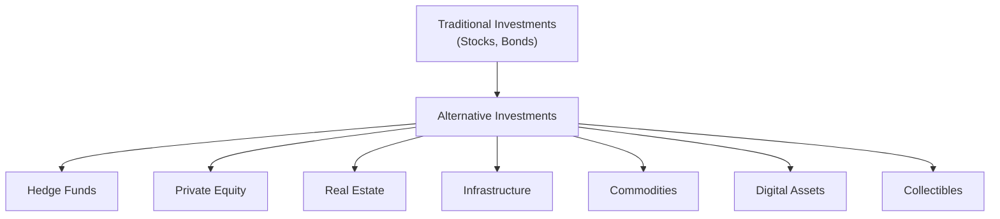

## 13.1 What Are Alternative Investments and Why Invest in Them?

Have you ever found yourself at a dinner party where everyone starts talking about real estate syndicates, cryptocurrency funds, or fine art auctions as though they’re discussing last night’s hockey game? It can feel a bit intimidating, especially if you’ve always thought of investing as simply buying stocks and bonds. But let me tell you—there’s an entire universe of investment opportunities out there, and many of them fall under the umbrella we call “alternative investments.” If you’ve been curious but also a little wary, don’t worry. You’re not alone. In this section, we’re going to break down what alternative investments are, why investors might want them in a portfolio, and how to navigate their unique characteristics and risks.

Before we dive too deep, though, let me share a quick story: A close friend of mine once poured a significant chunk of his savings into a private real estate development that promised sky-high returns. It sounded too good to be true—and guess what? It was. Construction got delayed, the market turned, and his investment was essentially locked up for years with little clarity on whether he’d see any meaningful returns. That was his crash course in the illiquidity risk and complexity often lurking in alternative investments. It’s one reason I’m passionate about explaining how these non-traditional assets work. Let’s begin with some basics.

### Defining Alternative Investments

When we talk about alternative investments, we’re basically referring to any investment product that’s not considered a traditional equity or bond instrument. Sure, that’s a broad definition, right? Well, that’s because the alternative space is vast. Hedge funds, real estate, commodities, infrastructure, private equity, collectibles, and even digital assets like cryptocurrencies or tokenized securities all fall into this bucket.

The phrase “alternative investments” might seem a little catch-all, and in many ways, it is. What unites these diverse categories is that they tend to go beyond the simple buy-and-sell nature of public stocks and bonds, often requiring specialized knowledge, more extensive due diligence, and careful consideration of factors like liquidity, lock-up periods, and regulatory structures.

#### A Quick Visual Overview

Below is a simple diagram illustrating how alternative investments fit into the larger picture of investment categories:

As you can see, alternative investments represent an entire cluster of opportunities beyond classic stocks and bonds.

### Why Invest in Alternatives?

So, why would anyone consider investing in these often complex and less liquid instruments? Investors are typically drawn to alternative investments for several reasons:

• Potential Diversification: When stock and bond markets enter a tailspin, certain alternative assets may hold steady or even rise in value. Real estate, commodities, or private equity returns might show a low correlation to the broader equity or fixed-income market, helping smooth out the bumps in a traditional portfolio.

• Unique Return Opportunities: Many alternative investments, particularly hedge funds and private equity, aim to capture alpha—that is, excess returns above a market benchmark. By employing specialized strategies or focusing on niche markets, they can sometimes outperform traditional assets (though this is never guaranteed).

• Inflation Hedging: I remember seeing gold prices surge when inflation concerns spiked. Real estate, commodities, and sometimes infrastructure investments can act as a hedge against inflation because their underlying assets (like property values or commodity prices) might rise when inflation accelerates.

• Capitalizing on Market Inefficiencies: Private market deals, certain hedge fund strategies, and specialized commodity trades often exist in corners of the market where not everyone has easy access. This unique positioning can create pockets of above-average returns if managed properly.

These are compelling benefits. Yet, it’s important to note that not every alternative investment will deliver these advantages. A hedge fund that’s poorly managed or using excessive leverage might be more of a headache than a reliable source of diversification. As with all investments, due diligence is key.

### Unique Characteristics of Alternative Investments

Now, if you’ve only invested in publicly traded stocks or simple bond funds, the alternative space can feel like you’ve wandered into a different country—complete with its own language, customs, and entry requirements. Let’s explore some of these distinguishing features:

• Lower Liquidity: Ever heard the phrase “money locked up for years”? In private equity or certain hedge funds, you may have to commit your funds for a set period (e.g., several years), with no guarantee you can pull out early. Real estate deals might be even more prolonged. This illiquidity can be technically referred to as a “lock-up period,” during which you simply cannot redeem your investment.

• Complex Fee Structures: Traditional mutual funds typically charge an expense ratio. Meanwhile, hedge funds may charge a “2 and 20” fee (2% annual management fee plus 20% of any profits), and private equity managers often take a management fee plus “carried interest,” meaning they get a share of the profits above a certain hurdle rate. These fees can significantly eat into returns, especially if performance lags.

• Potentially Higher Risk: Let’s face it, leverage can look great when everything’s going up, but it drastically amplifies losses in a downturn. Certain alternative investments may use higher levels of borrowed funds to boost returns. And because some segments of the alternative market are less regulated, you might face more uncertainty around valuation, transparency, and operational risk.

• Skill-Dependent Outcomes: Many alternative strategies rely heavily on the manager’s skill. Are they adept at short selling? Do they thoroughly understand emerging markets or new technologies? In hedge funds, for instance, alpha generation often hinges on a manager’s strategy and execution. If the manager stumbles, the outcome can be painful for investors.

### Suitability: Who Should Invest?

Just because you can invest in a private equity fund—or a fancy farmland project—doesn’t mean you should. Suitability is essential. Canadian regulatory standards, under CIRO (the Canadian Investment Regulatory Organization), mandate that investment advisors must know their clients (KYC) and know their products (KYP) before making specific recommendations.

• Accredited Investors: Many alternative investments are sold via exempt market channels, meaning they don’t file a prospectus. Under Canadian law, only accredited investors (people or entities meeting certain income or net worth thresholds) can participate in these offerings. It’s not just about regulatory compliance; it’s about having sufficient financial cushion to absorb potential losses.

• Risk Tolerance: If the idea of seeing your money locked away for five to seven years, with no guaranteed payout, makes you lose sleep, think twice before diving into private equity or real estate development projects. Alternatively, if you value the potential for higher returns and can handle volatility, certain hedge fund strategies or leveraged commodity plays might be suitable.

• Time Horizon: Are you investing for the next 20 years, or do you need these funds in two? Alternative investments often require a longer-term commitment. Real estate, infrastructure, and private equity usually come with multi-year timelines to develop and realize gains.

### Regulatory Landscape in Canada

If you’re in Canada, it’s crucial to understand the local regulatory context:

• CIRO (Formerly IIROC and MFDA): As of January 1, 2023, the Mutual Fund Dealers Association of Canada (MFDA) and Investment Industry Regulatory Organization of Canada (IIROC) ceased to exist as separate entities and combined into the Canadian Investment Regulatory Organization (CIRO). CIRO is now the single national self-regulatory body overseeing investment dealers, mutual fund dealers, and marketplaces. You can visit [https://www.ciro.ca](https://www.ciro.ca) to access updates on alternative investment regulations, compliance, and investor protection guidelines.

• Canadian Securities Administrators (CSA): The CSA is an umbrella organization of Canada’s provincial and territorial securities commissions. If you want to explore the nitty-gritty details of prospectus exemptions or accredited investor criteria, check out [https://www.securities-administrators.ca](https://www.securities-administrators.ca). They have plenty of resources on how alternative investments can be structured in Canada.

• CIPF: The Canadian Investor Protection Fund is now the sole fund to protect clients’ assets if a member firm becomes insolvent. While CIPF generally covers losses related to the insolvency of a broker, it does not guarantee the value of any investment such as a hedge fund or commodity position.

• Provincial Securities Commissions: Each province may also have its own guidelines, especially regarding disclosures for offering memorandums and accredited investors. Always ensure that whichever product you’re considering has cleared the appropriate regulatory hurdles.

### The Importance of Due Diligence

If there’s one thing you can’t skip when it comes to alternative investments, it’s due diligence. This is the process of investigating an investment product (or fund, or strategy) thoroughly before committing your money.

• Management Expertise: Find out who’s calling the shots. Do the managers have a strong track record? If it’s a real estate project, do they have a history of bringing similar initiatives to successful completion?

• Operational Transparency: For hedge funds or private equity, it’s important to know how they value assets, what their portfolio turnover looks like, and the exact fees you’ll pay. In some markets, unscrupulous operators might exploit looser regulations to hide poor performance or even engage in fraud.

• Independent Research: Relying solely on marketing materials could be a recipe for trouble. Consider using third-party data services or analyst reports that can provide an unbiased look at the fund’s performance history and operational risks.

• Understanding the Strategy: Ask questions like, “How do you generate returns?” or “What are the main drivers behind this strategy?” The more you understand the investment’s functioning, the better you can judge whether it aligns with your risk tolerance and objectives.

Sometimes, as investors, we get dazzled by the promise of high returns, especially if we hear success stories from friends or see glossy brochures. But trust me, the real measure of success in alternative investments is often how well you manage risk—and that starts with thorough due diligence.

### Practical Example: Hedge Fund Long/Short Strategy

Imagine you’re considering a hedge fund that uses a long/short equity strategy. The pitch might be: “We go long on undervalued stocks and short on overvalued ones, delivering returns in both bull and bear markets.” Sounds promising, right? But an informed investor would dive deeper:

• What valuation metrics do they rely on?  
• How do they manage the short positions during market rallies?  
• Do they use leverage to magnify those positions?  
• What are the redemption terms and lock-up period?  
• How have they performed in past market downturns?

If the fund manager dodges these questions or can’t provide clear data, consider that a red flag. This process of digging deeper is exactly what we mean by “due diligence.” Trust me, the time you spend investigating now can save you heartache (and money) later.

### Common Pitfalls and Best Practices

Let’s get real: the road to investing in alternative assets isn’t always smooth. There are common pitfalls:

• Lack of Liquidity: Many investors underestimate how difficult it is to exit an alternative position. Make sure your emergency funds or short-term money are kept separate from your alternative investments.

• High Fees: Performance fees can be great if the manager truly adds value. However, be wary of paying steep fees for mediocre performance. Compare fees across funds and determine whether the expected alpha justifies the cost.

• Overconcentration: It’s tempting to plow a big chunk of your portfolio into a high-return opportunity, but diversification still matters. Even if you’re in alternatives, spread your risk across different strategies and assets.

• Poor Alignment of Interests: Do the managers invest their own capital in the fund or project? If not, they might not have “skin in the game,” and that’s a concern.

And here are some best practices:

• Start Small: If you’re new to alternatives, consider dipping your toe with a smaller allocation—something like 5–10% of your overall portfolio.

• Reassess Regularly: Just because you’re in a multi-year real estate deal doesn’t mean you ignore the investment entirely. Keep tabs on progress, market shifts, and any changes in management or strategy.

• Keep Liquidity Handy: It’s wise to have a safety net in more liquid assets (like cash or readily traded securities). If a sudden personal need arises or the market changes drastically, you’ll be glad you did.

• Seek Professional Guidance: Working with an advisor well-versed in alternative investments can cut your learning curve significantly. They’ll help you navigate regulatory requirements, due diligence, and the complexities of each product.

### Real-World Scenario: Private Equity in Healthcare

Let’s say you’re exploring a private equity fund focusing on early-stage Canadian healthcare companies. The fund manager explains that the sector is primed for growth due to an aging population and increased demand for healthcare services. You love the sound of it—healthcare is a critical industry, after all.

However, you discover the fund has a minimum five-year lock-up, invests in only five companies (relatively concentrated), and charges a 2% annual management fee plus 20% carried interest on profits. You also learn that the manager’s last fund had one massive success and three lackluster exits. Would you still invest?

Your decision might depend on:
• Your risk tolerance (the potential to earn outsized returns in an emerging healthcare solution is exciting, but the concentration risk is high).  
• Your ability to handle illiquidity for at least five years.  
• The manager’s track record: one success might not be enough to offset the multiple middling performances.  
• The total cost of running this investment—if profits are low, the fees might wipe out your net gains.

### Glossary of Key Terms

• **Accredited Investor:** An individual or entity meeting certain net worth or income thresholds allowing them to invest in exempt securities.  
• **Alpha:** The excess return of an investment relative to a benchmark index, often sought in alternative investments.  
• **Illiquidity Premium:** Additional returns investors expect for holding assets that aren’t easily sold.  
• **KYC (Know Your Client):** Regulatory requirement for advisors to gather essential information about clients’ financial situations, objectives, and risk tolerance.  
• **KYP (Know Your Product):** Requirement for professionals to thoroughly understand the products they recommend, including risks, fees, and structure.  
• **Exempt Market:** A market where securities are sold under exemptions from prospectus requirements, typically open to accredited or otherwise qualified investors.  
• **Leverage:** The use of borrowed funds or financial instruments to amplify returns (and potential losses).

### Additional Resources

• Canadian Securities Administrators (CSA):  
  [https://www.securities-administrators.ca](https://www.securities-administrators.ca)  
  Essential for rules on prospectus exemptions, accredited investor definitions, and other guidelines.  

• Canadian Investment Regulatory Organization (CIRO):  
  [https://www.ciro.ca](https://www.ciro.ca)  
  For the latest regulatory updates, rules surrounding alternative investments, and investor protection guidelines.  

• Chartered Alternative Investment Analyst (CAIA) Association:  
  [https://caia.org](https://caia.org)  
  A global body focused on alternative investments; offers credential programs and a wealth of educational materials.  

• Alternative Investment Management Association (AIMA):  
  [https://www.aima.org](https://www.aima.org)  
  Provides best practices, research, and advocacy for the hedge fund and private credit industry worldwide.  

• Book Recommendation:  
  “CAIA Level I: An Introduction to Core Topics in Alternative Investments” (Wiley) for an in-depth overview.

### Conclusion

Investing in alternatives can be an exciting venture that adds depth, diversification, and even inflation protection to your portfolio. But let’s not sugarcoat it: these assets aren’t for everyone. They often come with higher fees, more complex strategies, and limited liquidity. If you decide to venture into this territory, do it with eyes wide open, armed with the necessary knowledge, a well-defined risk tolerance, and professional guidance if you need it.

And remember my friend’s story—the one who got stuck in a real estate project that dragged on for years. He eventually recouped part of his investment, but the whole experience was a reminder that while the allure of higher returns is attractive, you must understand precisely what you’re getting into. Due diligence, regulatory compliance, and ongoing monitoring are your best defenses against unwelcome surprises.

Alternative investments can play a valuable role in modern portfolio management. Embrace them selectively, and always keep a watchful eye on the factors that define success in this space: the manager’s skill, market inefficiencies, and, above all, alignment with your overall financial goals. If you do that, you’ll be in the best possible position to tap the exciting potential that alternatives can offer—without losing sight of the risk-and-return balance that matters to every investor.

---

## Mastering the Basics: Alternative Investments Knowledge Check



### Which of the following best describes an alternative investment?

- [ ] A publicly traded stock.  
- [ ] An investment-grade corporate bond.  
- [x] A non-traditional investment like hedge funds or private equity.  
- [ ] A savings account at a local bank.  

> **Explanation:** Alternative investments typically lie outside traditional stocks and bonds, including hedge funds, private equity, and other specialized asset classes.

### What is the main benefit of adding alternative investments to a conventional portfolio?

- [ ] They are always safer than stocks.  
- [x] They may offer diversification benefits and uncorrelated returns.  
- [ ] They are not subject to market cycles.  
- [ ] They guarantee above-market returns.  

> **Explanation:** One of the biggest draws to alternative investments is their potential to behave differently compared to stocks and bonds, thereby increasing overall portfolio diversification.

### Which factor most commonly distinguishes hedge fund fee structures from mutual fund fee structures?

- [ ] Hedge funds only charge performance fees.  
- [x] Hedge funds often have performance fees like “2 and 20.”  
- [ ] Mutual funds never charge management fees.  
- [ ] Mutual funds usually charge more than hedge funds.  

> **Explanation:** Hedge funds typically combine a management fee with a performance fee, whereas mutual funds primarily charge a management expense ratio (MER) without performance-linked fees.

### When might an investor consider a private equity fund an unsuitable choice?

- [x] When they need the money to be liquid in the short term.  
- [ ] When they are seeking higher returns than traditional assets.  
- [ ] When they want to invest in emerging companies.  
- [ ] When they have a strong risk tolerance.  

> **Explanation:** Private equity funds often have long lock-up periods, so they are unsuitable if the investor needs quick or easy access to their funds.

### How does leverage affect risk in alternative investments?

- [x] Leverage can amplify both gains and losses.  
- [ ] Leverage has no impact on risk levels.  
- [x] Using leverage always guarantees higher returns.  
- [ ] Leverage guarantees lower returns during a market crash.  

> **Explanation:** Leverage magnifies the effects of market movements. It can boost returns when markets are favorable but can also significantly increase losses during downturns.

### Which regulatory organization now oversees investment dealers and mutual fund dealers in Canada?

- [x] CIRO (Canadian Investment Regulatory Organization).  
- [ ] The Mutual Fund Dealers Association of Canada (MFDA).  
- [ ] The Investment Industry Regulatory Organization of Canada (IIROC).  
- [ ] The Ontario Securities Commission (OSC).  

> **Explanation:** As of January 1, 2023, the MFDA and IIROC were consolidated into CIRO, making it the single self-regulatory organization for investment dealers and mutual fund dealers in Canada.

### What is a key reason accredited investor rules exist for certain alternative investments?

- [x] To ensure that only financially capable individuals invest in higher-risk products.  
- [ ] To allow all retail investors equal access.  
- [x] To lower the barriers to entry for hedge funds.  
- [ ] To reduce the number of investment opportunities in the market.  

> **Explanation:** Accredited investor criteria help ensure that individuals and entities with sufficient financial means (and presumably risk tolerance) have access to higher-risk and less liquid products.

### What is the most common drawback of locked-up capital in alternatives?

- [ ] Guaranteed higher returns.  
- [x] Inability to redeem funds when needed.  
- [ ] Lower performance fees.  
- [ ] Greater transparency.  

> **Explanation:** A key drawback to investments with lock-up periods (like certain hedge funds or private equity) is illiquidity. You may not be able to access your money until the lock-up ends.

### Why is due diligence especially important for alternative investments?

- [ ] They are regulated exactly the same as stocks.  
- [ ] They require no specific knowledge.  
- [ ] They never carry risk.  
- [x] They may involve complex structures and limited transparency.  

> **Explanation:** In many alternative investments, complexity and reduced regulation can make it harder to gauge true risks. Thorough due diligence helps mitigate these challenges.

### True or False: The Canadian Investor Protection Fund (CIPF) guarantees the value of your alternative investments if the market goes down.

- [x] True  
- [ ] False  

> **Explanation:** This is a trick question—CIPF does not guarantee investment values! CIPF covers losses if a member firm becomes insolvent, not if the market declines.


