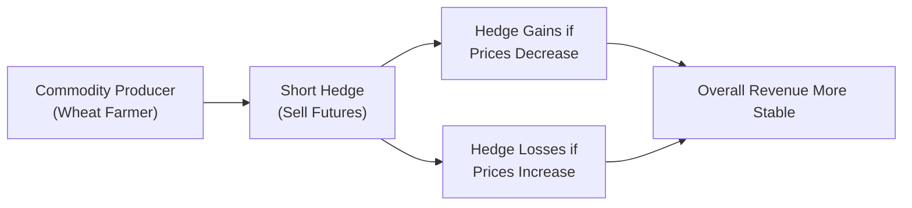
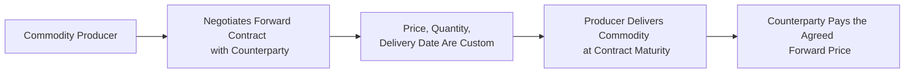
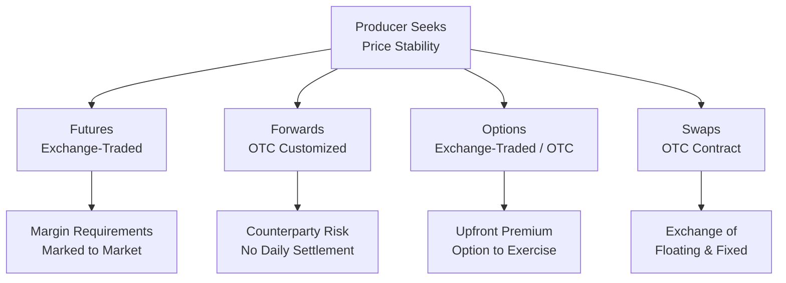

## 13.10 How Commodity Producers Manage Financial Risk

Commodity prices can seem downright mysterious sometimes. One moment, they’re sky-high; the next, they plunge faster than you can say “corn futures.” This volatility isn’t just an abstract spreadsheet number—if you’re a farmer, a miner, or an oil driller, sudden price swings can make or break your business. The stakes are high, and nobody wants to run their enterprise with a perpetual knot in their stomach. Against that backdrop, hedging tools exist to preserve a bit of sanity. In this section, we’ll explore how commodity producers use derivatives to stabilize revenues, reduce risk, and manage their financial futures in a world that rarely stands still.

We’ll begin with a look at why hedging is so essential, then delve into the specific tools—like futures, forwards, swaps, and options—that shape risk management. We’ll share real-world scenarios, highlight best practices, and even discuss a few cautionary tales to show what can go right and wrong. Finally, we’ll wrap up with regulatory considerations and references to help you continue your learning. But the key takeaway is that well-crafted risk management strategies can empower producers to lock in revenue, plan for the future, and sleep a bit easier when commodity prices take one of their infamous roller-coaster rides.

---

### Why Do Commodity Producers Hedge?

Commodity producers often have massive capital investments—think farmland, mining equipment, drilling rigs—and these long-term commitments force them to operate through the ups and downs of market cycles. Unlike traders who can open and close positions quickly, producers can’t just “turn off” production when prices dip. They rely on stable revenue to cover everyday costs like salaries, maintenance, and interest on debt. Let me share a personal anecdote: I once visited a mid-sized wheat farm on the Canadian Prairies. The farmer mentioned how a single season’s poor selling price could undo years of hard work and investment. That’s a risk he couldn’t afford. So he turned to hedging strategies to set a more predictable price for part of his crop, effectively smoothing out the year’s revenues.

“Hedging,” in a nutshell, is about offsetting the financial impact of price moves in the opposite direction. If a producer is worried about lower commodity prices slashing profits, they can “short hedge” with derivatives that pay off when prices fall. In this way, gains on the hedge offset the drop in the physical commodity prices. On the other hand, if the physical commodity price soars, the derivative position might lose—but overall, the producer still benefits from a guaranteed minimum revenue. That’s the primary motivator behind hedging. It’s not speculation; it’s risk reduction.

---

### Common Hedging Tools

Commodity producers have a variety of tools at their disposal, each with pros and cons. While these tools can get technical, we’ll break them down in plain language. And if you’re ever itching for more mathematical rigor, fear not—you can check the references at the end, or even consider diving into John C. Hull’s “Options, Futures, and Other Derivatives.” For now, let’s explore the main instruments.

#### Futures Contracts

Think of a futures contract like a promise to sell or buy a standardized quantity of a commodity at a future date for a set price. For instance, a wheat producer can sell wheat futures contracts on an exchange to secure a price for their harvest months before it’s ready. The key benefits?

• Standardization: Futures contracts are standardized in terms of quantity, quality, and delivery date, making them liquid and easily tradable on exchanges.  
• Price Transparency: Since they trade on formal exchanges, you can see real-time quotes and be sure you’re getting a fair price (or at least a market price).  

However, futures also come with “margin” requirements. Producers need to post a performance bond (margin) that fluctuates with market prices. If prices move unfavorably, they might face margin calls—a requirement to deposit more funds. This can sometimes strain cash flow.

Let’s visualize a simple short hedge using a mermaid diagram:

When the producer sells a futures contract, they’re effectively locking in a price. If the market price goes down, the producer might lose on the physical sales but gain on the futures position. If the market price goes up, they gain on physical sales but lose on the futures contract. Either way, the net effect is more predictable revenue.

#### Forward Contracts

Forwards are like futures but traded over-the-counter (OTC) rather than on an exchange. This means producers can customize them—maybe they need a specific contract size that futures don’t offer, or certain timing that doesn’t match standardized contracts. The big difference is that forward contracts come with higher counterparty risk because there’s no exchange clearinghouse standing in the middle. Forwards also aren’t marked to market daily; instead, everything settles at maturity.

If you’re a producer needing a very particular specification for your commodity (let’s say a certain grade of wheat that’s not covered by standard exchange contracts), a forward contract might be just the ticket. However, your handshake is directly with a bank or trading house, so you’ll want to make sure you trust (and understand) your counterparty.  

Here’s a diagram showing how a forward contract might work:

#### Options

Options give the holder the right, but not the obligation, to buy or sell a commodity at a set price (the strike) by a certain date. Producers might buy put options to establish a floor price for their commodity. If the market price plunges below the strike, the put option gains value, offsetting the loss in the physical commodity’s value. The beauty of a put option is that if the market soars, the producer can let the option expire and sell their physical commodity at the higher market price.

From a risk management standpoint, options can be great—but they cost money upfront (the option premium). So if you’re a producer who wants unlimited upside with limited downside, you might accept that you’ll pay the premium, akin to buying insurance.

#### Swaps

A swap is another OTC derivative, often used to exchange floating commodity prices for fixed ones. Imagine you’re an oil producer worried about unexpected price drops. In a swap, you might promise to pay a bank the floating market price for oil in exchange for receiving a fixed price. By doing this, you lock in revenue at that fixed price. If market prices plummet, you’re still receiving the fixed price. If market prices skyrocket, you’re stuck receiving only the fixed price. Like the other tools, this is a trade-off. But for stability, many producers are happy to accept that trade-off.

---

### Key Strategies for Commodity Producers

Producers typically adopt a “short hedge” strategy—selling derivatives that appreciate when commodity prices go down—to offset potential losses in the physical commodity. Let’s break down a few scenarios you might see in real life:

• **Locking in Future Sales**: A copper mine expects to produce 5,000 tons next quarter. They sell copper futures now to lock in the selling price.  
• **Insurance of Sorts**: A hog producer might buy put options to protect against sudden declines in pork prices, thus setting a floor on how low prices can go.  
• **Customized Hedges**: An agricultural co-op enters into a forward contract with a larger commodities merchant for specialty grains not covered by standard exchange contracts.  
• **Swapping Price Risk**: An energy producer swaps a floating natural gas price for a fixed price with a financial institution, mitigating the risk of severe price declines.

With each strategy, the underlying principle remains: the derivative’s gain (or loss) helps offset unexpected movements in the commodity’s spot price.

---

### Advantages and Disadvantages of Hedging

Hedging is not without costs and trade-offs:

**Advantages**  
• **Revenue Stability**: By securing a minimum selling price, producers can plan capital expenditures and borrowing needs with more certainty.  
• **Enhanced Budgeting**: Hedging transforms chaotic price fluctuations into a stable, predictable cash flow.  
• **Creditor and Investor Assurance**: Lenders and investors often prefer working with companies that have a prudent hedging policy, seeing them as more creditworthy or stable.  

**Disadvantages**  
• **Opportunity Cost**: If prices rally, you may lose out on the windfall because your short futures or forward position offsets the gain.  
• **Premiums**: Options can protect your downside, but the upfront premium might eat into profits.  
• **Margin Calls**: Futures require daily margining. Sudden price changes can force producers to post additional funds, straining liquidity.  
• **Counterparty Risk**: OTC contracts (forwards, swaps) can expose you to default risk if the counterparty fails to meet its obligations.

It’s important to understand these dynamics before jumping in. Some producers hedge only a portion of their output, leaving room to benefit if prices rise. Others hedge heavily for peace of mind, sacrificing potential upside.

---

### Regulatory Considerations

If you plan to hedge in Canada, you’ll quickly become acquainted with the Canadian Investment Regulatory Organization (CIRO), formed from the merger of historical SROs (IIROC and the MFDA). CIRO is responsible for overseeing derivative transactions by investment dealers. In tandem, each provincial securities commission (e.g., the Ontario Securities Commission, the Alberta Securities Commission) has its own rules. You might find that certain margin requirements, reporting obligations, or risk disclosure rules apply to your hedging activities. If your trades are exchange-traded futures, you’ll also deal with the exchange’s regulations—like those set by ICE Futures Canada or the CME Group for cross-border trades.

Over-the-counter markets present another layer of complexity. Under Canadian regulations, certain standardized OTC derivatives may need to be cleared through recognized central counterparties, and you might have to adhere to derivative trade reporting requirements (e.g., to designated trade repositories). It’s a moving landscape, so it’s crucial to consult legal and compliance experts—especially because regulations can differ slightly from one province to another. For further details, check out the official CIRO website at [https://www.ciro.ca](https://www.ciro.ca).

---

### Practical Example: A Grain Farmer’s Short Hedge

Let’s build a more detailed scenario. Suppose Lucy runs a mid-sized grain farm in Saskatchewan. She’s about to harvest 200,000 bushels of canola in three months. She’s terrified that canola prices might plummet, so:

1. Lucy checks current futures prices for canola. She sees she can sell canola futures at $14 per bushel for delivery in three months.  
2. She sells enough futures contracts to cover half her expected harvest—say 100,000 bushels.  
3. Fast forward three months. When Lucy harvests, the actual market price is $12 per bushel. That’s $2 below the futures price. So Lucy’s physical commodity sells for $12 in the spot market, but the short futures position gains $2 per bushel, netting a total of $14 effectively.  
4. If, instead, the spot price turns out to be $16, Lucy’s loss on the futures position is more than offset by the higher physical price, so effectively she still gets about $14 (depending on basis and transaction costs).  
5. The result is a more stable revenue stream around $14, minus transaction costs and basis adjustments.

Lucy might feel a twinge of regret if the price goes to $16 and she only nets $14, but she’ll breathe easier knowing she didn’t risk selling at $12. This is the classic hedging trade-off.

---

### Common Pitfalls and Best Practices

**Pitfalls**  
• **Over-hedging**: If you hedge more production than you can deliver, you might have to buy back contracts at unfavorable prices.  
• **Ignoring Basis Risk**: The difference between the futures price and the cash market price (the basis) can fluctuate, and might not move in lockstep with the futures contract you use.  
• **Misalignment of Contract Terms**: If your production timeline doesn’t match your hedge’s expiration date, you could face rollover risks or mismatch issues.  
• **Speculative Attitude**: Some producers get tempted to “get fancy” with derivatives, crossing the line from hedging to speculation and taking on more risk than intended.

**Best Practices**  
• **Define Clear Hedging Objectives**: Aim for stable revenue or cost control, not gambling on price direction.  
• **Monitor Your Positions**: Keep a close watch on margin requirements, basis changes, and new regulatory developments.  
• **Use Sound Data and Forecasting**: Build or buy robust models that incorporate weather patterns, global demand, currency exchange rates, and political risks—especially if you produce commodities that are heavily exported.  
• **Consult Experts**: Engaging with experienced futures brokers or commodity risk managers can help tailor suitable strategies.  
• **Stay Informed about Regulatory Changes**: Keep an eye on CIRO publications and provincial securities commissions to avoid compliance headaches.

---

### Real-World Anecdote: Gold Mining Firm’s Forward Sales

A gold mining firm in Ontario decided to lock in part of its anticipated production for the next five years using forward sales. They reasoned that even if gold soared beyond that forward price, they’d still have plenty of unhedged exposure and could participate in some upside. When gold eventually fell below their forward price, the company benefited from those forward contracts—effectively selling at a premium to the spot market. The end result? They avoided the panic in the downturn and secured enough revenue to keep critical projects running. Did they miss out on additional upside when gold initially rallied? Sure, but their main priority was to keep the lights on during cyclical lows.

---

### Using OTC Derivatives for Customized Hedges

OTC derivatives such as forward contracts and swaps give producers the flexibility to design exactly what they need. Let’s say a soybean processor wants to simultaneously manage price risk for both soybeans (the input) and soybean meal (the output). They might enter an OTC swap with a large bank that references a formula combining soybean futures and meal futures, effectively hedging their unique margin. This type of customization is invaluable when standardized exchange-traded products won’t cut it. But remember: you face both counterparty risk and more complex legal/regulatory frameworks in the OTC world.

---

### Glossary

• **Short Hedge**: A strategy where a producer sells futures (or enters a derivative contract) to offset potential declines in the price of an underlying commodity.  
• **Forward Contract**: An over-the-counter agreement that obligates the seller to deliver and the buyer to accept a specified quantity of a commodity at a predetermined price on a future date.  
• **Swap**: A derivative in which two parties exchange cash flows, such as paying a fixed price for receiving a floating commodity price (or vice versa).  
• **Margin**: The collateral that futures traders must deposit with a broker/exchange to cover the potential risk of loss.

---

### Diagram: Comparing the Main Hedging Instruments

Use this diagram as a quick reference to remember the basic differences among these derivatives.

---

### Canadian Regulatory Environment Overview

In Canada, derivatives are governed primarily by:  
• **CIRO**: The Canadian Investment Regulatory Organization (launched 2023) oversees investment dealers’ derivatives activities, merges past responsibilities of IIROC and MFDA.  
• **Provincial Securities Commissions**: Set their own rules for derivative reporting, licensing, and clearing.  
• **Commodity Exchanges**: Establish rules such as margin requirements and daily price limits for futures trading.  
• **Clearing Houses**: Minimize credit risk in centralized clearing of standardized OTC derivatives.  

Staying compliant involves reporting trades to approved trade repositories, keeping thorough records, and ensuring that staff responsible for derivatives have the necessary qualifications or regulatory approvals. If you’re new to hedging or expanding your operations, you’ll likely need to consult with compliance experts or attend specialized training.

---

### Broader Context and Global Comparisons

Global commodity markets often interconnect. A canola farmer in Saskatchewan may eventually see their product end up in Asia. Price influences come from currency exchange rates (CAD vs. USD), geopolitics, and the health of the global economy. Different regions have different rules—like Dodd-Frank in the U.S. or EMIR in the EU—so if you want to hedge in multiple jurisdictions, you’ll need to track multiple rulebooks. That said, a unified approach to risk management is crucial, so large multinational commodity producers often build a centralized hedging desk to coordinate all their global exposures.

---

### Suggested Future Learning

• **“Options, Futures, and Other Derivatives” by John C. Hull**: A classic, comprehensive resource on derivatives.  
• **CFA Institute**: Offers courses on derivatives and risk management.  
• **CAIA Association**: The Chartered Alternative Investment Analyst program includes modules on commodities and hedging.  
• **CIRO Website**: [https://www.ciro.ca](https://www.ciro.ca) for up-to-date Canadian regulatory information.  
• **Provincial Securities Commissions**: Check official sites like the Ontario Securities Commission ([https://www.osc.ca](https://www.osc.ca)) or Alberta Securities Commission ([https://www.albertasecurities.com](https://www.albertasecurities.com)) for regional rules.  

---

### Closing Thoughts

Managing commodity price risk is vital for businesses that revolve around physical production. It’s like mood insurance—only instead of a person’s mood, it’s the market’s mood swings. By locking in future prices, using swaps to gain stability, or employing options to protect profits, producers can focus on what they do best—growing crops, mining minerals, drilling for oil—rather than worrying about every zigzag of the market.

Yes, hedging comes at a cost, and it’s not a magic bullet. But if done thoughtfully, it can be the difference between riding out a market storm or falling victim to it. As we’ve seen, hedging is about building a more certain future—one that allows for better planning, steadier cash flow, and a healthier bottom line.

Remember, do your homework, consult with experts, and track your results to ensure your hedging aligns with your strategic goals. Good luck with your next harvest, drilling project, or extraction operation—and may the derivatives markets be ever in your favor (or at least neutral enough to let you sleep at night).

---

## Test Your Knowledge: Commodity Hedging Strategies and Risk Management



### Which of the following best describes the primary goal of hedging for commodity producers?
- [ ] To guarantee unlimited profit potential in rising markets.
- [x] To reduce revenue volatility and protect against falling prices.
- [ ] To speculate on future price movements and increase exposure.
- [ ] To fully eliminate all forms of risk in the business.
> **Explanation:** The primary goal is to stabilize income by reducing exposure to adverse price movements, not to speculate on the market or capture all possible upside.

### What is the main difference between a futures contract and a forward contract from the producer’s perspective?
- [ ] Futures are always cheaper to implement than forwards.
- [x] Futures are exchange-traded, standardized, and involve daily margining, while forwards are OTC and customizable.
- [ ] Forwards offer no credit risk, whereas futures carry significant credit risk.
- [ ] Futures are illegal in Canada, whereas forwards are allowed.
> **Explanation:** Futures are standardized and traded on an exchange with daily margin and a clearinghouse. Forwards are private agreements with customization but higher counterparty risk.

### A “short hedge” typically involves:
- [ ] Buying futures in anticipation of higher prices.
- [x] Selling futures to offset the risk of declining spot prices.
- [ ] Entering into a swap to gain exposure to rising prices.
- [ ] Buying call options to protect downside risk.
> **Explanation:** A short hedge is executed by selling futures contracts, which appreciate if the commodity’s spot price falls, thereby offsetting the decline in physical revenues.

### Which of the following is a disadvantage of using put options as a hedging tool?
- [ ] They offer unlimited upside potential.
- [ ] They can be traded on an exchange with strict standards.
- [x] The producer must pay an upfront premium cost.
- [ ] They remove the need for margin payments.
> **Explanation:** Options provide flexibility and a price floor, but the cost of that protection is the premium paid upfront.

### When Canadian commodity producers use OTC derivatives, one important regulatory consideration is:
- [ ] They only need to submit monthly updates to CIRO for swaps.
- [ ] There are no margin requirements for OTC instruments.
- [ ] CIRO has no jurisdiction over OTC derivatives.
- [x] Derivative trades may need to be reported to recognized trade repositories and adhere to provincial rules.
> **Explanation:** Canadian regulators require certain OTC derivatives transactions to be reported, and producers must comply with both CIRO rules (for dealer activities) and provincial regulators.

### In a scenario where a farmer expects to harvest 200,000 bushels of canola and decides to hedge 100,000 bushels using futures, which statement is most accurate?
- [ ] The farmer has specced out all price risk with no upside potential.
- [x] The farmer partially hedges, securing revenue for half of the crop while retaining potential upside on the unhedged portion.
- [ ] The farmer violates exchange policy by only hedging half of the harvest.
- [ ] The farmer is mandated to hedge the entire harvest to remain compliant.
> **Explanation:** Producers can choose how much to hedge. Hedging half of the production allows partial revenue protection while retaining upside on the rest.

### In an oil swap where the producer receives a fixed price and pays a floating price, what happens if the market price for oil plummets?
- [x] The producer continues to receive the higher fixed price, benefiting from the swap.
- [ ] The producer must pay an additional margin to the exchange.
- [ ] The producer gains from rising market prices as well.
- [ ] The producer’s counterparty risk is eliminated.
> **Explanation:** If the producer receives a fixed price in the swap, they’re protected from downward moves since they still get paid at the agreed fixed rate.

### What is a key risk of entering an OTC forward contract instead of an exchange-traded futures contract?
- [ ] The daily margin requirements are more complex.
- [ ] The contract is standardized and cannot be customized.
- [x] There is no clearinghouse mechanism, so counterparty default risk is higher.
- [ ] The contract’s settlement is publicly reported every day.
> **Explanation:** OTC forward contracts lack a centralized clearinghouse, so counterparty default risk is higher compared to exchange-traded futures.

### Which of the following is a best practice for commodity producers implementing a hedging strategy?
- [ ] Speculate if fundamental analysis suggests rising prices.
- [x] Monitor basis risk, contract maturity dates, and maintain clear hedging objectives.
- [ ] Hedge 100% of production to eliminate all risk.
- [ ] Roll over contracts every day to capture intraday price movements.
> **Explanation:** Best practices include aligning the hedge with actual production, carefully managing basis risk, maintaining clear objectives, and monitoring positions.

### A short hedge ensures full protection from all market-related risks. True or False?
- [x] True
- [ ] False
> **Explanation:** Well, this is a bit of a trick question. A short hedge is specifically designed to protect against falling commodity prices, but it doesn’t eliminate all possible business risks (like weather, operational issues, or basis risk). However, in the context of market price volatility for the commodity, a short hedge significantly reduces the downside price exposure.  


