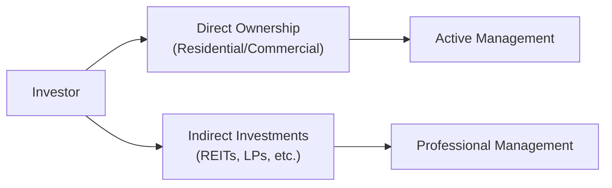

## 13.11 Ways to Invest in Real Estate

Real estate has a reputation for stability—folks often see it as a tangible investment that you can literally touch, walk through, and fix up if needed. Perhaps you’ve heard family members brag about selling their house at just the right time, or you’ve watched TV shows featuring people flipping properties for quick profit. Among all asset classes, real estate is one of the most approachable, because, hey, we all need somewhere to live or work, right? But it can also be more complex than it first appears. There are direct ownership options, indirect ownership vehicles, and a maze of legal and tax implications to consider. In this section, we’ll explore multiple ways to invest in real estate, discuss potential pitfalls, and share best practices.

Before we dive in, a quick personal anecdote: The first time I invested in a rental property, I was so excited that I forgot to check local zoning rules (big mistake!). Turns out, the property’s basement suite wasn’t actually zoned for multi-tenant use—so I learned the importance of local regulations the hard way. In many ways, that little mess was the best teacher I could’ve asked for. Let’s move forward and make sure you’re better prepared than I was!

### Why Real Estate?

Real estate is often linked to:

• Potential for steady cash flow (rent)
• Asset appreciation
• Portfolio diversification beyond stocks and bonds
• A “hands-on” experience (for those who like tangible projects)

Of course, it also has risks, including market fluctuations, possible property damage, vacancies, and other headaches. The approach you choose—direct or indirect ownership—will heavily influence how much work, risk, and reward you may experience.

---

### Direct Ownership

Let’s start with the most traditional route: buying a property outright (or at least with a mortgage). Direct ownership can involve purchasing a residential single-family home, a duplex, an apartment building, or even a commercial office space.

#### Residential Properties

Residential real estate involves properties such as single-family homes, condos, and multi-unit dwellings (like duplexes or triplexes). Many people begin here because it’s relatively straightforward: you buy a property, rent it out to tenants, and (hopefully) collect monthly cash flow that exceeds your mortgage, insurance, and upkeep costs. This sort of hands-on approach means you get to decide on renovations, set rental rates, deal with tenants, and manage repairs—or outsource some of these tasks to a property management firm if you prefer a more hands-off approach.

• Advantages: High degree of control; potential for significant returns via appreciation and rental income.
• Disadvantages: Requires active management; can be illiquid; might need a high initial down payment.

#### Commercial Properties

Commercial real estate includes office buildings, retail shops, and industrial spaces. They often involve more sophisticated leases (like triple-net leases, where the tenant covers property taxes, maintenance, and insurance). Commercial projects can yield higher returns and longer lease terms, but they also require more capital and expertise.

• Advantages: Opportunity for higher rental yields; potentially stable, long-term tenants.
• Disadvantages: Higher complexity; potentially higher vacancy risk; more significant upfront investment.

#### Joint Ventures or Partnerships

Not everyone wants to, or can, buy a full property themselves. In that case, you might consider forming a partnership or joint venture. This is a way for two or more investors to pool resources and share the risks and responsibilities. One partner might be the “hands-on” property manager, while another might just be the “money” partner, providing the necessary capital and leaving the day-to-day management to someone else.

• Advantages: Shared costs and expertise; potentially easier to scale.
• Disadvantages: Earnings must be split; risk of conflicts among partners over strategy or management decisions.

---

### Indirect Ownership

If unclogging toilets and dealing with tenants isn’t your jam, you might lean toward more passive forms of real estate investing. Indirect ownership structures let you get exposure to real estate’s economic returns without buying a property outright.

#### Publicly Traded REITs

Real Estate Investment Trusts (REITs) are companies that own or finance real estate properties and distribute most of their taxable income to shareholders in the form of dividends. Publicly traded REITs can be bought and sold on stock exchanges just like regular shares, making them a liquid way to invest in real estate.

• Examples: Residential REITs specializing in apartment buildings, commercial REITs focusing on office space, and industrial REITs investing in warehouses.
• Liquidity: High. You can buy or sell REIT units in seconds on the stock market.
• Management: Professional teams oversee the properties. You don’t have to manage anything directly.

Mortgage REITs (mREITs) are a specialized subset that invest in mortgages or mortgage-backed securities rather than actual properties, collecting interest from borrowers. These can provide higher yields but may involve interest-rate risk. 

> GLOSSARY:  
> **Mortgage REIT:** A REIT that invests primarily in mortgages and mortgage-backed securities, earning income from interest on these loans.

#### Real Estate Mutual Funds and ETFs

If you want broad exposure to a basket of real estate companies, you might look into real estate mutual funds or exchange-traded funds (ETFs). These funds typically invest in multiple REITs or real estate–related equities, offering diversification across property types, geographies, and management teams. They also trade on major exchanges and can be easily bought or sold.

• Key Benefits: Diversification and professional management.  
• Drawbacks: Expense ratios, market price fluctuations, and less direct control compared to owning an individual property or a single REIT.

#### Real Estate Limited Partnerships

Real Estate Limited Partnerships (RELPs) bring multiple investors together to fund real estate projects. They’re typically structured so that a general partner manages the project, while the limited partners provide capital and share in the returns. Because they’re typically offered privately (not on a public exchange), RELPs often have stringent eligibility requirements and can be quite illiquid.

• Advantages: Access to larger projects, professional management, potential for high returns if the project succeeds.  
• Disadvantages: Illiquidity, high minimum investments, and often restricted to accredited investors who meet specific net worth or income thresholds.

> GLOSSARY:  
> **Real Estate Limited Partnership (RELP):** A partnership structure where multiple investors pool resources for real estate projects; typically illiquid with a defined exit strategy.

#### Private REITs

Private REITs resemble publicly traded REITs in that they pool investors’ funds and focus on real estate assets. However, they do not list on public exchanges, making them less transparent and harder to trade. Private REIT managers decide when and how investors can redeem shares, making these vehicles suitable primarily for those comfortable with longer holding periods.

---

### Understanding Liquidity, Leverage, and Management Responsibilities

One major fork in the road between direct and indirect investing is the level of control and responsibility you want. Let’s break it down visually:

- Direct Ownership: You’re in the driver’s seat, free to set rental rates, pick tenants, and decide when to do renovations. You also bear the brunt of dealing with broken furnaces and vacant units. 
- REITs & Funds: Managers handle day-to-day operations. You simply invest and let the pros do their job. But you have less say in specific property decisions.

#### Leverage

Real estate investing allows for leverage via mortgages or other financing. While leverage can amplify returns, it also magnifies losses if property values decline. If you extend yourself too far financially and a market downturn hits, you could face serious challenges (like negative equity or forced liquidation).

#### Liquidity Spectrum

Below is a quick comparison of liquidity and other factors:

| Factor                     | Direct Ownership                    | Publicly Traded REITs            | Real Estate LPs / Private REITs |
|----------------------------|-------------------------------------|----------------------------------|---------------------------------|
| Liquidity                  | Low (may take months to sell)       | High (public market)             | Low (often lock-up periods)     |
| Management Responsibility  | High (you or a property manager)    | Low (professional teams)         | Low (general partner)           |
| Minimum Capital            | Usually High (down payment, etc.)   | Relatively Low (buy shares)      | High (often accredited investors) |
| Control                    | High (direct decisions)             | Low (no control over property)   | Moderate to Low (limited partner)  |
| Potential Returns          | Tied to property performance/sale   | Dividend yield & price changes   | Distributions plus potential capital gain |

---

### Tax Implications

Taxes can be a huge factor in real estate investing, sometimes making or breaking the viability of a deal. In Canada, you’ll want to consult the Canada Revenue Agency (CRA) or a qualified tax professional to understand how the following apply to your situation:

• Depreciation (Capital Cost Allowance): You can often depreciate your rental property over time, reducing your taxable income.  
• Capital Gains: When you sell a property, any gain is partially taxable. The capital gains inclusion rate in Canada is 50%, but this can change based on tax policy updates.  
• Deductions: You may be able to deduct mortgage interest, property taxes, insurance, and certain maintenance costs if it’s an investment property.  
• Specific Credits or Incentives: Certain programs or tax credits exist for eco-friendly renovations or for certain developments (federal or provincial).

Canadian investors in publicly traded REITs also have to consider how distributions are taxed—some portion might be treated as return of capital, and other portions as income or capital gains. Keep detailed records, and when in doubt, reach out to the experts or check the CRA’s website:
[https://www.canada.ca/en/revenue-agency.html](https://www.canada.ca/en/revenue-agency.html).

---

### Conducting Local Market Research and Due Diligence

Real estate is hyper-local. Even within the same city, different streets or neighborhoods can exhibit vastly different occupancy rates, demographics, and growth prospects. Research is critical:

1. **Location Trends**: Are people moving into the area or leaving? Is it near public transportation, schools, or job centers?  
2. **Occupancy and Rent Rates**: For direct investments, check how quickly properties rent out. For indirect options like REITs, read the annual reports (available on SEDAR+: [https://www.sedarplus.ca](https://www.sedarplus.ca)) to understand portfolio occupancy.  
3. **Comparable Sales**: Check local listings or hire an appraiser to compare similar properties that have sold recently.  
4. **Macroeconomic Factors**: Interest rates, economic growth, employment rates, and government housing policies can influence real estate values.  
5. **Property-Specific Due Diligence**: If you’re buying property directly, get a proper inspection, review any existing leases, and ensure compliance with zoning bylaws (learn from my basement suite fiasco!).

---

### Practical Financial Examples

• **Case Study—Residential Flip**: Suppose you buy a fixer-upper in the suburbs for CAD 500,000, invest CAD 50,000 in renovations, and sell it for CAD 600,000. On paper, you might think you made CAD 50,000. But factoring in closing costs, real estate commissions, property taxes, and carrying costs (e.g., mortgage interest), your actual profit could be significantly lower. One must do a thorough cost analysis to see if flipping is truly profitable.

• **Case Study—REIT Investment**: Imagine you buy CAD 10,000 worth of shares in a commercial REIT that yields 5% annually in dividends. Each year, you earn about CAD 500 in dividends. If the REIT’s share price appreciates by 10% over a year, that’s an additional CAD 1,000 in unrealized gains. So your total return (assuming you sell at that moment) could be around CAD 1,500 or 15%. However, if interest rates suddenly rise, property values might drop, and the REIT’s share price could tumble, so it’s not without risk.

---

### The Role of Canadian Investment Regulation

If you’re buying publicly traded REITs or real estate ETFs through an investing platform, your account is overseen by the Canadian Investment Regulatory Organization (CIRO)—formed when the Mutual Fund Dealers Association of Canada (MFDA) and the Investment Industry Regulatory Organization of Canada (IIROC) amalgamated on January 1, 2023. This is relevant for investor protection standards, disclosure requirements, and dispute resolution. If the dealer you work with becomes insolvent, the Canadian Investor Protection Fund (CIPF) offers coverage for client assets, though do note CIPF is separate from CIRO and only covers specific types of investments. For official regulatory updates, visit the CIRO site: [https://www.ciro.ca](https://www.ciro.ca).

---

### Glossary of Key Terms

• **Mortgage REIT**: A REIT that invests primarily in mortgages and mortgage-backed securities, earning income through interest on those loans.  
• **Real Estate Limited Partnership (RELP)**: A partnership structure where multiple investors pool resources for property projects; typically offers limited liquidity and is often restricted to accredited investors.  
• **Net Operating Income (NOI)**: A property’s revenue from operations minus operating expenses. It does not account for financing costs or taxes and is used as a fundamental performance metric in real estate analysis.

---

### Best Practices, Pitfalls, and Strategies

• **Best Practices**:  
  – Diversify geographically if possible, rather than doubling down on a single market.  
  – Maintain healthy cash reserves for repairs, unexpected vacancies, or sudden economic downturns.  
  – Consult professionals. This might be a real estate lawyer, accountant, or property management firm.  
  – Keep good records for both financial and legal reasons.

• **Common Pitfalls**:  
  – Underestimating ongoing costs (maintenance, property taxes, insurance).  
  – Over-leveraging: Taking on too much debt can topple your portfolio if markets dip.  
  – Poor tenant screening: Problem tenants can result in missed rent payments and property damage.  
  – Overlooking liquidity constraints, especially if you suddenly need cash.

• **Pro Tip—Critical Thinking**:  
  – Ask yourself, “What if interest rates change drastically?” or “What if a large employer leaves the local market?”  
  – Scenario planning helps you see if you can weather minor or major shocks.

---

### Additional Resources

• Canada Revenue Agency (CRA) for official tax guidance on real estate transactions: [https://www.canada.ca/en/revenue-agency.html](https://www.canada.ca/en/revenue-agency.html).  
• SEDAR+ for reviewing financial statements and disclosures of publicly listed REITs: [https://www.sedarplus.ca](https://www.sedarplus.ca).  
• Book Suggestion: “The Real Estate Game” by William J. Poorvu – a comprehensive guide loaded with practical insights and case studies, authored by a former Professor at Harvard Business School.  
• For official regulatory updates in Canada, visit CIRO: [https://www.ciro.ca](https://www.ciro.ca).

---

Real estate’s beauty is its diversity. Whether you prefer brick-and-mortar control or a more hands-off approach via REITs, you can find an investment style that suits your comfort level. It can be an excellent part of a well-rounded portfolio—just remember that it’s not always a guaranteed slam dunk. With careful due diligence, proper research, and an understanding of the risks, you can harness real estate to stabilize and potentially grow your wealth. 

And, who knows, maybe you’ll find yourself telling your own “first property experience” story (hopefully with fewer basement suite headaches) when you look back!

---

## Dynamic Real Estate Investment Quiz



### What is a key advantage of investing in real estate through a publicly traded REIT?

- [x] It provides higher liquidity compared to owning physical property.
- [ ] It entirely eliminates vacancy risk for the investor.
- [ ] It imposes no investment minimums.
- [ ] It offers guaranteed returns through fixed payouts.

> **Explanation:** Publicly traded REITs can be bought and sold on stock exchanges, which generally makes them far more liquid than direct ownership of real assets.

### Which of the following is TRUE regarding direct ownership of a rental property?

- [ ] It requires no ongoing management responsibilities.
- [x] It typically requires active participation in property maintenance and tenant relations.
- [ ] It is always more profitable than investing in REITs.
- [ ] It cannot be financed with mortgage loans in Canada.

> **Explanation:** Direct ownership often involves hands-on tasks like maintenance and tenant screening, though a property manager can be hired to reduce the workload.

### In a Real Estate Limited Partnership (RELP), which party typically handles day-to-day management?

- [ ] All limited partners as a group.
- [x] The general partner.
- [ ] A government-assigned trustee.
- [ ] An insurance company.

> **Explanation:** A RELP has one or more “general partners” responsible for day-to-day operations, while the “limited partners” usually only contribute capital.

### What is one common pitfall of using leverage (a mortgage) to buy real estate?

- [x] Market downturns can magnify your losses.
- [ ] No proof of income is ever required.
- [ ] All properties guaranteed to appreciate.
- [ ] You cannot deduct any interest expense.

> **Explanation:** While leverage can amplify returns, it also increases risk—if property values fall, the borrower can face negative equity and other financial strain.

### Which metric is commonly used to evaluate the performance of income-producing real estate?

- [x] Net Operating Income (NOI).
- [ ] GDP Growth Index.
- [x] Price-to-Earnings (P/E) Ratio.
- [ ] MER (Management Expense Ratio).

> **Explanation:** Net Operating Income (NOI) is revenue minus operating expenses, offering a clear snapshot of a property’s core profitability. Meanwhile, P/E Ratio is more common in stock analysis.

### Which of the following best describes a mortgage REIT?

- [x] A company that invests in mortgages or mortgage-backed securities.
- [ ] A trust that solely invests in industrial warehouses.
- [ ] A trading firm that only focuses on flipping single-family homes.
- [ ] A partnership that invests in farmland exclusively.

> **Explanation:** Mortgage REITs hold mortgages or mortgage-backed securities and earn interest from these loans, rather than collecting rent directly from properties.

### True or False: Private REITs are listed on major stock exchanges and are easily tradable by retail investors.

- [x] False
- [ ] True

> **Explanation:** Private REITs are not traded on public exchanges, so they’re less liquid and typically have restrictions on how and when investors can redeem their shares.

### Why is local market research critical in direct real estate investment?

- [ ] Real estate markets behave uniformly across the country.
- [x] Values, rental demand, and regulations vary widely even within the same city.
- [ ] All appraisals are regulated to produce the same valuation.
- [ ] Because the federal government sets fixed rent levels nationwide.

> **Explanation:** Real estate is extremely localized, influenced by area-specific employment trends, demographics, zoning rules, and more.

### What is one potential tax benefit of owning a rental property in Canada?

- [x] The ability to claim capital cost allowance (depreciation).
- [ ] Complete tax exemption for all rental income.
- [ ] Double-dipping on mortgage interest deductions.
- [ ] No requirement to pay property tax.

> **Explanation:** Investors can often claim capital cost allowance to reduce taxable rental income. However, it’s crucial to follow CRA rules and consult a qualified tax professional.

### True or False: CIRO (Canadian Investment Regulatory Organization) now regulates both investment dealers and mutual fund dealers in Canada.

- [x] True
- [ ] False

> **Explanation:** As of January 1, 2023, the Mutual Fund Dealers Association of Canada (MFDA) and the Investment Industry Regulatory Organization of Canada (IIROC) amalgamated into CIRO, Canada’s new self-regulator overseeing all investment dealers and mutual fund dealers.


