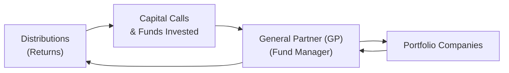

## 13.12 Ways to Invest in Private Markets

Investing in private markets can feel both exciting and intimidating—kind of like jumping into a car for the very first time. On one hand, there’s those high-octane returns you’ve heard about. On the other, it can be a bumpy ride with a whole bunch of unfamiliar twists and turns. “Private markets” usually refer to investments in companies or assets that are not traded on stock exchanges. This includes private equity funds, venture capital funds, angel investments, and direct investments in private companies—plus many other structures.

If you’re new here, welcome. If you’re an experienced financial pro, well, let’s roll up our sleeves and explore these structures in depth. We’ll talk about how they work, the usual lock-up periods, how capital is called, the potential for big returns, and the not-so-small risks involved. We’ll keep it real, with clear language, personal anecdotes, a few diagrams, and references. The Canadian market context will be our main reference point, though we’ll briefly peek at global variations where relevant.

--------------------------------------------------------------------------------

### Introduction to Private Market Investing

Private market investing involves putting your money into businesses or funds that don’t trade on public exchanges. Right away, you might think: “Why bother?” Often, it’s the potential for higher returns or portfolio diversification. However, private investments are typically less liquid and require a long-term commitment. They’re also known for higher risks because they don’t face the same level of market regulation or real-time price discovery that public companies do.  

Many private market deals rely on “exempt market” regulations that allow certain investors to buy securities without a prospectus. Because liquidity is limited, the typical investor needs a substantial net worth or must meet specific accredited investor thresholds. Before you plunk down any money, you’ve got to be comfortable tying up your funds for years, sometimes a decade or more.

Anyway, let’s kick this off by looking at the most common structures, such as private equity funds, venture capital, angel networks, and direct investments.

--------------------------------------------------------------------------------

### Common Structures

#### Private Equity Funds
Private equity funds are pooled investment vehicles managed by a General Partner (GP). Investors in the fund are called Limited Partners (LPs). When a private equity fund invests in a company, it often aims to restructure operations, optimize strategy, and eventually exit via a sale or an IPO at a higher valuation.  
• Minimum investment requirements can be pretty high, easily in the six- or seven-figure range.  
• Commonly invests in mature or established companies—sometimes in “buyouts,” where the fund acquires most or all of a target company with leverage (debt).  

#### Venture Capital Funds
Venture capital (VC) funds typically invest in earlier-stage or high-growth companies—often technology or innovation-focused. These can be riskier than private equity buyouts because early-stage startups fail at a higher rate, but the upside can be massive if a portfolio company becomes a “unicorn” (a private company valued at over $1 billion).  
• VC funds call capital in stages ("capital calls") to invest in promising startups.  
• Expected holding periods can stretch from 5 to 10 years before an exit materializes.  

#### Angel Investor Networks
Angel investors are individuals (often high net worth, but not always) who invest directly in startups they believe in—sometimes with smaller check sizes than a VC would.  
• Angel investor networks pool resources or coordinate deals to help angels diversify or share due diligence.  
• Angels might get an ownership stake or convertible debt, hoping for a nice payoff when the startup takes off.  

#### Direct Investments in Private Companies
Some folks invest directly in private companies, effectively bypassing the typical fund structure. Maybe you have a friend with a small manufacturing business in need of expansion capital. You could step in, negotiate the valuation, and inject your capital in exchange for equity.  
• Direct investments provide more control (you might take a seat on the board), but typically come with higher risk.  
• Liquidity is very limited—you can’t just sell shares on the open market whenever you want.

--------------------------------------------------------------------------------

### Typical Capital Commitments and Fund Mechanics

One hallmark of private funds—private equity and venture capital especially—is that they don’t usually take all your money upfront. Instead, you commit a certain amount (say $500,000), and the fund issues what’s called a **capital call** whenever it needs part of that commitment for a deal. The timeline can vary:

• **Lock-Up Periods**: There’s often a multi-year lock-up (5–10 years), meaning you likely can’t withdraw your capital.  
• **Distribution Timelines**: As portfolio companies mature and exit, the fund distributes profits to investors over time.  
• **Fund Life Cycle**: Private equity and VC funds often have three main phases: fundraising, investing in deals, and exiting/harvesting.  

Below is a simple diagram that outlines a typical private equity or venture capital fund structure. Don’t worry if it looks a little busy—this is just to give you the gist of how money flows in and out:

• LP (Investor) commits capital.  
• GP (Fund Manager) finds private companies, invests capital, and manages the portfolio.  
• Portfolio companies, if successful, generate returns.  
• GP then distributes profits (minus fees and carried interest) back to LPs.

--------------------------------------------------------------------------------

### Understanding the Risk-Return Profile

So, let’s talk about the biggest question everyone always has: “Is it worth it?” Potentially, yes. But the risk is definitely up there—especially with emerging startups. Here’s a quick breakdown:

• **High Risk, Possibly High Reward**: You could see outsized returns if a company hits it big (think of an early investor in a major tech success story). But you could also lose most or all of your investment if the company tanks.  
• **Manager Selection**: Partnering with top-tier managers can make or break your returns. In fact, the difference in performance between the best and worst managers is usually larger in private markets than in public markets.  
• **Illiquidity**: Be prepared for minimal liquidity. If you need your money in two years, private markets might not be your best bet.  

There’s also something called the “**J-curve**.” This describes how, in the initial years, a private fund may show losses or negative returns due to early fees, start-up costs, or less mature investments. Over time, if portfolio companies thrive, the fund’s value can swing upward. Ultimately, you’ve got to be comfortable riding that roller coaster.

--------------------------------------------------------------------------------

### Limited Secondary Markets

A major difference between private markets and public markets is the limited nature of secondary trading. Public stocks can be sold with a couple of keyboard clicks. In private markets:

• **Secondary Markets**: Yes, there are private secondary markets where LP interests can be traded. But these markets are far less liquid, and it’s common to sell at a discount to the Net Asset Value (NAV).  
• **Why Sell?**: Sometimes an LP needs cash sooner than the fund’s planned exit. They might sell their fund interest at a discount to another private investor.  
• **Plan for Illiquidity**: Assume you may be stuck with your investment for the life of the fund, so never invest money you might need in the near term.

--------------------------------------------------------------------------------

### A Closer Look at Manager Selection

One personal story: I once had a colleague who joined a well-known private equity fund. She was full of excitement. Some deals soared, others, well—they didn’t. But because of the manager’s network and expertise, the overall results were pretty good. That experience reminded me how crucial the right manager can be.  

When shopping for a private equity or venture capital fund, ask:  
• What’s the fund’s track record?  
• How much experience do the portfolio managers have in the relevant industry?  
• What fees do they charge (management fee plus carried interest)?  
• How do they source their deals?  

Try to do serious due diligence: read the fund’s offering memorandum, talk with existing investors, and research the GP’s background. The Canadian Investment Regulatory Organization (CIRO) at [https://www.ciro.ca](https://www.ciro.ca) can help you navigate the regulatory environment. Remember that the coverage of the Canadian Investor Protection Fund (CIPF) typically applies to insolvencies of CIRO-member firms, rather than guaranteeing private market investments themselves.

--------------------------------------------------------------------------------

### Angel Investor Networks and Direct Investing

#### Angel Investor Networks
Angel investor networks are communities of individuals who collaborate on deals. They collectively vet opportunities, share intel and best practices, and sometimes pool funds. Even if you’re investing a small check, you might get diversified exposure across multiple startups.  
• Great for folks who want to learn the ropes from more seasoned investors.  
• In Canada, these groups often follow exemptions that permit accredited investors to invest directly in private companies.  
• The **Canadian Business Corporations Act (CBCA)** might come into play when structuring or registering these companies.

#### Direct Investments in Private Companies
There’s a certain allure in going direct if you really believe in a single venture—or know the people behind it. I once had a friend who invested directly in a small eco-tech startup. He loved the founders’ passion and was convinced the planet needed their solution. That turned out well, but direct investing can be extremely risky.  
• You must personally vet the company’s business plan, financial statements, and leadership.  
• You’ll likely have to sign a shareholders’ agreement—pay close attention to clauses on dilution, liquidation preference, and voting rights.  
• Exit strategy? If the company never goes public or never sells, you might be locked in for a long, long time.

--------------------------------------------------------------------------------

### Mermaid Diagram: Typical Private Fund Life Cycle

It’s helpful to visualize a typical private equity or venture capital fund’s life cycle:

• **Formation**: The managers form the legal entity and set investment strategies.  
• **Fundraising**: Attract limited partners—money starts rolling in.  
• **Investment Phase**: The fund actively invests capital.  
• **Value Creation & Monitoring**: The fund may bring expertise, restructure operations, and grow the companies.  
• **Exits & Harvest**: Selling or taking companies public to realize gains.  
• **Wind-Up**: The fund eventually dissolves and returns remaining capital (and profits) to investors.

--------------------------------------------------------------------------------

### Best Practices, Potential Pitfalls, and Practical Tips

1. **Diversification**: Even in private markets, spread your bets. Relying on one single private company can be a recipe for heartbreak.  
2. **Due Diligence**: Thoroughly investigate the GP’s track record, strategy, fee structure, and alignment of interests.  
3. **Watch Out for Fees**: Private equity and VC funds typically charge a management fee (often around 2%) plus carried interest (around 20% of profits above a certain return hurdle). Over the life of the fund, fees can add up.  
4. **Long-Term Mindset**: These aren’t get-rich-quick schemes. Lock-up periods can last up to 10 years.  
5. **Legal and Compliance**: In Canada, be mindful of securities regulations and the relevant exemptions. If you’re unsure, consult with a lawyer or licensed advisor.  
6. **Advisor Support**: Consider working with a professional who understands private markets—especially if this is your first foray.  

One big pitfall? People often underestimate how long the capital will be locked away. I knew someone who committed a big chunk to a PE fund… then realized two years later they needed that money for a house purchase—bad timing. You know how that story ends: they had to sell their interest on the secondary market at a discount.

--------------------------------------------------------------------------------

### Glossary of Key Terms

• **Capital Call**: A notice from the fund manager to limited partners to deliver a portion of their committed capital.  
• **Angel Investor**: An individual providing capital in a startup’s early stages, usually in exchange for convertible debt or ownership equity.  
• **Secondary Market (Private Equity)**: A marketplace (often private) where existing LP interests can be bought or sold, usually at a discount to NAV.

--------------------------------------------------------------------------------

### Regulatory Environment in Canada

The private capital markets in Canada are affected by a patchwork of provincial securities regulations and frameworks. Here are a few major points:

• **CIRO (Canadian Investment Regulatory Organization)**: Governs investment dealers, mutual fund dealers, and market integrity. As of 2025, it is Canada’s new national self-regulatory organization, replacing IIROC and the MFDA, which are now defunct.  
• **Exempt Market Framework**: Private issuers often sell securities under exemptions (like the accredited investor exemption). These reduce the regulatory burden but also limit who can invest.  
• **Canadian Business Corporations Act (CBCA)**: Governs business incorporation, corporate structure, and other corporate matters vital for private companies.  
• **Canadian Investor Protection Fund (CIPF)**: CIPF remains the country’s sole investor protection fund, primarily covering client assets if a CIRO dealer becomes insolvent. CIPF typically does not guarantee the performance of private market investments.  

--------------------------------------------------------------------------------

### References and Additional Resources

• **Canadian Venture Capital & Private Equity Association (CVCA)**: [https://www.cvca.ca](https://www.cvca.ca)  
  - Great data on Canadian PE/VC markets, deals, and industry trends.  

• **Private Capital Markets Association of Canada (PCMA)**:  
  - Offers courses and training on private market structures, regulations, and best practices.  

• **CIRO**: [https://www.ciro.ca](https://www.ciro.ca)  
  - Official updates and regulatory info.  

• **Canadian Business Corporations Act (CBCA)**:  
  - If you’re delving into direct investments or angel deals, brush up on relevant sections.  

• **Open-Source Tools**:  
  - Some private investors use open-source analytics or data platforms like R or Python libraries to evaluate investment performance.  
  - Online cap table tools exist to manage ownership stakes and distributions for smaller deals.  

--------------------------------------------------------------------------------

## Test Your Knowledge on Private Market Investing



### Which of the following investment vehicles most commonly invests in mature or established private companies?

- [ ] Venture Capital Fund
- [x] Private Equity Fund
- [ ] Angel Investor Network
- [ ] Hedge Fund

> **Explanation:** Private equity funds typically focus on more mature businesses, sometimes using leveraged buyouts. Venture capital funds, on the other hand, focus on early-stage or high-growth startups.

### Which statement best describes the “capital call” process in private equity or venture capital?

- [ ] All committed capital is paid upfront at the start.
- [x] Investors pledge a total amount, and only contribute when the fund requests it.
- [ ] Investors pay in monthly installments over the entire life of the fund.
- [ ] No capital is ever actually transferred until the fund exits.

> **Explanation:** Private equity and VC funds operate by calling down capital from investors as needed to invest in deals, rather than collecting the entire commitment upfront.

### Which of the following is most closely associated with direct early-stage investments, often in return for convertible debt or equity?

- [ ] Private Equity Funds
- [ ] Public Mutual Funds
- [ ] Real Estate Investment Trusts (REITs)
- [x] Angel Investor Networks

> **Explanation:** Angel investors focus on seed or early-stage companies, often investing in exchange for convertible notes or ownership shares.

### What is a key characteristic of private market investments compared to public market investments?

- [ ] They are generally more liquid with quick exit opportunities.
- [x] They often involve long lock-up periods and are illiquid.
- [ ] They have mandated daily price reporting.
- [ ] They avoid any form of regulatory oversight.

> **Explanation:** A hallmark of private market investments is their illiquidity and longer lock-up periods. While oversight does exist, it’s not as standardized as in public markets.

### In Canada, which entity oversees investment dealers and market integrity after the amalgamation of IIROC and the MFDA?

- [ ] IIROC
- [x] CIRO
- [ ] MFDA
- [ ] None of the above, it’s entirely unregulated

> **Explanation:** The Canadian Investment Regulatory Organization (CIRO) became the unified self-regulatory organization, effective June 1, 2023. IIROC and MFDA are now defunct.

### The “J-curve” in private equity typically refers to:

- [ ] The shape of the fund manager’s compensation curve.
- [x] Early negative returns and fees before the portfolio matures and exits drive returns higher.
- [ ] The immediate profitability of a fund from day one.
- [ ] How interest rates fluctuate over time in the fixed-income market.

> **Explanation:** The J-curve illustrates how PE returns might be negative or low in the early years, then ramp up as exits occur and value is realized.

### Which of the following is a reason investors sometimes sell an LP interest on the secondary market?

- [x] They need liquidity before the fund reaches its planned exit.
- [ ] The fund automatically redeems their interest annually.
- [ ] Secondary markets always provide higher returns than the primary market.
- [x] They want to exit a poor-performing manager early.

> **Explanation:** Liquidity needs and dissatisfaction with a manager can drive an investor to seek the secondary market, typically at a discount. (Note that multiple statements here can be correct in practical scenarios: needing liquidity or wanting to exit a poor manager.)

### When investing directly in a private business, which document commonly governs voting rights and liquidation preferences?

- [ ] The investment policy statement
- [x] The shareholders’ agreement
- [ ] The prospectus
- [ ] The fund offering memorandum

> **Explanation:** In direct private company investments, shareholders’ agreements typically outlines the voting rights and liquidation preferences of shareholders.

### In the Canadian context, which legislative act primarily governs the incorporation and governance of federally registered businesses?

- [ ] The Private Capital Markets Association Act
- [ ] CIRO governance policy
- [x] The Canadian Business Corporations Act (CBCA)
- [ ] Tax-Free Savings Account Act

> **Explanation:** The CBCA provides the legal framework for creating and governing federally incorporated companies in Canada.

### True or False: The Canadian Investor Protection Fund (CIPF) functions as a performance guarantee for private equity investments.

- [x] True
- [ ] False

> **Explanation:** This is a trick question. The statement is actually false—CIPF does not guarantee performance. It protects specific assets at CIRO-member dealers in the event of insolvency, not the underlying performance of private market investments.


