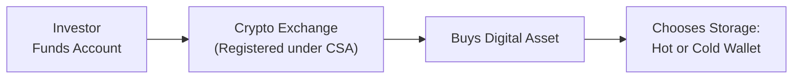

## 13.13 Ways to Invest in Digital Assets

Let’s be honest: digital assets can be intimidating. Not only because they’re relatively new, but also because you’ve probably heard countless stories about price swings and someone losing millions of dollars by misplacing their cryptographic keys. Still, there’s a lot of excitement around digital assets—and for good reason. Digital assets, which include cryptocurrencies (like Bitcoin and Ether) and tokenized real-world assets, have opened up new avenues for portfolio diversification and speculation.

In this section, we’ll explore the various ways to invest in digital assets, the common risks involved, and some best practices for staying safe in this occasionally wild marketplace. We’ll also integrate Canadian-specific regulatory considerations and highlight resources that can support you in ensuring compliance and investor protection.

---
  
Making sense of digital assets is all about clarifying what exactly you’re buying, how you acquire it, and how you store it. Because there are so many myths swirling around, let’s break it down carefully.

  
"METHODS OF ACQUIRING DIGITAL ASSETS"

One of the first questions you might hear is: “How do I actually get crypto?” or “Where do people buy digital assets?” Many folks start with a simple online cryptocurrency exchange. Others, especially institutional players, might prefer large “over-the-counter” (OTC) transactions, which allow them to buy huge sums without impacting the market price too much. Let’s take a look at the most common avenues.

  
Buying Directly on Cryptocurrency Exchanges

• Overview: Online crypto exchanges like CoinSmart, Bitbuy, or globally known platforms such as Coinbase or Binance (depending on jurisdiction) make it pretty straightforward to buy, sell, and trade digital assets for fiat currencies or other cryptocurrencies. You’ll usually register, comply with know-your-customer (KYC) requirements, and fund your account with an e-transfer, wire, or credit card (though the last option can be expensive).  
• Pros: It’s fast, convenient, and typically has user-friendly interfaces. It’s a great starting point for individuals wanting to dip their toes in the crypto ocean.  
• Cons: There’s often a learning curve when it comes to trading pairs, fees, and user interfaces. Additionally, you entrust the exchange with custody of your funds (at least initially) which entails counterparty risk.

  
Over-the-Counter (OTC) Desks

• Overview: OTC desks cater to large-scale buyers and sellers who want to purchase substantial amounts of crypto without spiking or tanking the exchange’s on-screen price.  
• Pros: Transactions can be arranged privately with less effect on market prices. These desks often provide personalized service, including guidance on large orders and advice on tax considerations.  
• Cons: Minimum transaction sizes may be too high for most retail investors. OTC trades may also require more paperwork and due diligence.

  
Digital Asset Funds or ETFs (Where Approved)

• Overview: In some countries (and provinces within Canada), regulatory approvals have been granted for cryptocurrency-related retail or institutional products. For instance, there are Bitcoin ETFs trading on some Canadian exchanges. These products behave like traditional ETFs, except they hold Bitcoin or another digital asset (or futures contracts and derivatives linked to them).  
• Pros: Investors gain exposure to the digital asset class without directly handling the complexities of storage and security. The product shares trade on regulated securities marketplaces, offering a sense of transparency and regulatory oversight.  
• Cons: Management fees and possible tracking errors can eat into returns. If the product relies on derivatives (e.g., futures) rather than holding the asset itself, the ETF’s price might diverge from the underlying digital asset’s price over time.

  
Initial Exchange Offerings (IEOs) or Security Token Offerings (STOs)

• Overview: IEOs typically involve new projects listing their tokens on an exchange. STOs, on the other hand, are tokens that are explicitly structured as securities—meaning they represent a share of a company, a bond, or other real-world security-type instrument in a tokenized format. STOs, if properly regulated, require compliance with securities laws.  
• Pros: Early investors get the chance to buy into new or innovative projects. With STOs, direct regulatory oversight may instill higher trust.  
• Cons: New offerings can be high-risk; many projects fail to deliver. Regulatory clarity on STOs is evolving, so compliance can be complex. Also, not all IEOs or STOs are offered under recognized prospectus exemptions or within regulatory guidelines, meaning extra due diligence is crucial.

  
"STORAGE CONSIDERATIONS"

I once forgot the password to a small digital wallet of mine—lost it for six months. That (painful) experience taught me that storage is super important. Whether you’re holding Bitcoin or an NFT representing your favorite piece of digital art, secure storage is non-negotiable. The two main contenders? Hot wallets and cold storage.

Hot Wallets (Online Wallets)

• Definition: “Hot” because they’re connected to the internet.  
• Advantages: Super convenient for frequent trading, quick payments, or transfers. Many hot wallets are easily accessible as mobile apps or web browser extensions.  
• Risks: Because they’re online, hacking risks are higher. If your device is compromised or you fall prey to phishing attacks, your digital assets may be stolen.

Cold Storage (Offline Wallets)

• Definition: Offline wallet solutions, such as hardware wallets (Ledger, Trezor) or even paper wallets (public and private keys physically written or printed on paper and stored securely).  
• Advantages: By isolating the keys from the internet, cold storage severely reduces the attack surface.  
• Risks: You must protect the physical device or paper. If you lose it, or if it’s damaged and you haven’t backed up your “seed phrase” (a series of words that can restore your wallet), your assets might be gone forever.  

Multi-Signature Protocols

• Definition: Techniques requiring multiple private keys to authorize a transaction.  
• Reasons: Helps prevent a single point of failure—for instance, if one key is compromised, the hacker can’t move your funds without the others.  
• Example: You might split custody among business partners or in a family trust arrangement so that no single individual can singlehandedly move assets.

Below is a quick illustration of how an investor, an exchange, and a wallet might interact:

Even if you’re relying on a digital asset fund or an ETF, it’s worth knowing how storage works because any underlying manager must deal with these issues on your behalf.

  
"TRADING PLATFORMS AND REGULATIONS"

In Canada, crypto trading platforms that offer trading in coins deemed securities or derivatives must register with the relevant Canadian Securities Administrators (CSA) authority, and they may be subject to CIRO oversight if they’re dealing in securities or derivatives. Once registered, these platforms have to follow certain rules protecting investors, including safe custody measures and risk disclosure.

It’s also important to note that, as of January 1, 2023, the defunct IIROC and MFDA have merged into the Canadian Investment Regulatory Organization (CIRO). CIRO is Canada’s self-regulatory organization overseeing investment dealers, mutual fund dealers, and marketplace integrity. For platform registration or to see the latest bulletins, check the CIRO site at:
• https://www.ciro.ca

Additionally, the Canadian Securities Administrators website provides official guidance and updates on crypto asset regulation and investor advisories:  
• [https://www.securities-administrators.ca](https://www.securities-administrators.ca)

  
"RISKS AND VOLATILITY MANAGEMENT"

Digital assets, especially cryptocurrencies, are notoriously volatile. It’s not unusual for Bitcoin to swing by double-digit percentages in a single day. Maybe that’s part of the adventure, but your clients or even you, as an investor, need to be mentally and financially prepared for these wild rides.

Extreme Market Volatility

• Explanation: Even the biggest cryptos can go up or down 50% in a single month (and sometimes in a single week). Smaller altcoins can see even more dramatic swings.  
• Management: Clarify this risk to clients. Ensure they understand that total loss is possible, especially with lesser-known tokens. Diversification and position sizing are key.

Custody and Cybersecurity

• Explanation: If you hold crypto in a personal wallet, you are responsible for safeguarding your keys. Online hacks, phishing attempts, insider fraud—these threats are real.  
• Management: Use secure and reputable custodians or self-custody solutions with robust security measures or multi-signature setups. Build robust protocols for storing recovery seeds offline.  

Regulatory and Compliance Risk

• Explanation: Regulatory frameworks for digital assets are evolving. Governments or regulatory bodies might change their stance, impose restrictions, or require new compliance measures.  
• Management: Stay up to date with CSA guidance, CIRO bulletins, and local rules. Larger brokerage firms often have specialized compliance teams to help navigate changes in the regulatory environment.  

Liquidity Risk

• Explanation: Certain tokens might have low trading volumes, leading to big spreads. Some platforms may freeze withdrawals during high-volatility periods.  
• Management: Stick to reputable exchanges and well-traded tokens, or plan your transactions in smaller chunks if you suspect thin market liquidity.

Leverage and Derivatives

• Explanation: Many platforms allow leveraged trading or margin trading. The temptation can be huge, but remember that losses are amplified just as much as gains.  
• Management: Understand the fundamentals of derivatives before diving in. Evaluate your risk profile honestly—sometimes caution is your best friend.

  
"KEY DIGITAL ASSET GLOSSARY"

Below are a few important terms you might hear frequently when dealing with digital assets:

Hot Wallet  
→ A software-based crypto wallet that’s connected to the internet for quick transactions. Convenient but more vulnerable to hacking.

Cold Storage  
→ Offline wallet solutions such as hardware wallets or paper wallets, used for maximum security and minimal hacking risk.

Security Token  
→ A digital asset that represents ownership in an underlying investment (e.g., equity, debt). Security tokens are regulated under applicable securities laws.

  
"PRACTICAL EXAMPLE: CUSTODY ARRANGEMENTS FOR A CLIENT"

Imagine you’re advising a client named Sarah who wants a 5% crypto allocation. She’s intrigued by Ethereum because of its use in decentralized finance (DeFi). After analyzing her risk tolerance, you decide the best approach is to open an account at a registered crypto trading platform. She purchases ETH and a small position in a digital asset fund that invests in stablecoins, to mitigate volatility.

You help Sarah set up a hardware wallet for the bulk of her ETH, to hold them long-term—and gently nudge her not to trade short-term price fluctuations. Sarah keeps a small amount on the exchange for daily experimentation with DeFi protocols. She’s aware of the risk if the exchange gets hacked, but she’s comfortable with that risk for a small portion of her portfolio, especially given that the platform is registered with the CSA and adheres to relevant CIRO guidelines.

  
"BEST PRACTICES AND COMMON PITFALLS"

• Thorough Research: Many altcoins can be thinly traded or poorly understood. Always ask questions: “What problem does this token solve?” “Who’s behind it?”  
• Use Strong Passwords (Yes, I know we say this all the time): Multi-factor authentication is a must for any crypto exchange or digital wallet.  
• Avoid Emotional Trading: Crypto “FOMO” (Fear of Missing Out) can be powerful. Keep a level head, have a plan, and don’t let social media hype drive you into impulsive trades.  
• Stay Current with Regulatory Changes: The digital asset space evolves quickly. Watch for new CSA notices, CIRO bulletins, or changes in tax treatment.  

  
"CONCLUSION"

So, how do you invest in digital assets? Well, there’s no single right way—it depends on who you are, your risk profile, and your investment goals. You can buy directly on an exchange, use an OTC desk if you’re dealing in large volumes, or even invest in a crypto-focused ETF. Just remember that digital assets come with unique risks—especially custody issues and volatility that might feel like a roller coaster ride.

Watching the space grow is genuinely exciting. The potential to rethink old-school finance—especially with blockchains, smart contracts, and tokenization—could shape the future. If you or your clients decide to journey into crypto investing, do so with knowledge, caution, and a solid, well-articulated plan. Keep an eye on regulatory headlines, store your keys securely, and never risk more than you can afford to lose. After all, the simplest rule in crypto might just be: “Don’t lose your keys, and don’t lose your mind.”

  
"REFERENCES AND FURTHER READING"

• Canadian Securities Administrators (CSA): [https://www.securities-administrators.ca](https://www.securities-administrators.ca)  
• Canadian Investment Regulatory Organization (CIRO): [https://www.ciro.ca](https://www.ciro.ca)  
• Book: Burniske, Chris & Tatar, Jack. “Cryptoassets: The Innovative Investor’s Guide to Bitcoin and Beyond” (2017).  
• Open-Source Tools:  
  – Metamask, a widely used browser-based hot wallet.  
  – Bitcoin Core, a fully open-source Bitcoin software client.  
  – Various DeFi dashboards (e.g., Zapper) for tracking decentralized finance positions.  
• News Outlets: Coindesk, Cointelegraph, or the Financial Post’s tech/finance sections for the latest in crypto.  

---

## Test Your Knowledge: Investing in Digital Assets



### Which of the following describes a hot wallet?

- [ ] A hardware device used only offline
- [x] A software-based crypto wallet connected to the internet for quick transactions
- [ ] A method of cold storage
- [ ] A device requiring multiple signatures for access

> **Explanation:** A hot wallet is connected to the internet, making it quick for transactions but more vulnerable to hacking.

### An investor looking to buy a large amount of cryptocurrency without significantly affecting market price would likely prefer:

- [ ] A decentralized exchange
- [ ] A hot wallet
- [x] An over-the-counter (OTC) desk
- [ ] A retail trading app

> **Explanation:** OTC desks specialize in handling large transactions privately, reducing market impact.

### What is the main advantage of multi-signature (multi-sig) protocols for digital asset storage?

- [x] They require multiple keys to authorize transactions, reducing single-point-of-failure risk
- [ ] They guarantee higher yields for token holders
- [ ] They eliminate all regulatory requirements for custodians
- [ ] They allow the user to trade with zero fees

> **Explanation:** Requiring multiple private keys to approve transactions helps ensure that no single compromised key can move funds unilaterally.

### Which of the following best describes a security token?

- [ ] A token that’s only used for utility payments in a DeFi protocol
- [ ] A stablecoin backed 1:1 by fiat
- [x] A digital asset representing an underlying investment such as equity or debt
- [ ] A promotional coupon token for an online store

> **Explanation:** Security tokens typically represent ownership interests like equity or debt, which means they’re subject to securities laws.

### In the Canadian regulatory context, which self-regulatory organization currently oversees investment dealers and market integrity?

- [x] CIRO
- [ ] MFDA
- [x] CSA
- [ ] IIROC

> **Explanation:** MFDA and IIROC were merged into CIRO effective 2023. CSA is the umbrella organization of provincial regulators that also oversees certain registrants, so both CIRO and CSA apply in the Canadian regulatory context.

### A typical advantage of investing in a digital asset ETF rather than buying the cryptocurrency directly is:

- [x] It spares investors from managing their own private keys and security measures
- [ ] It completely eliminates all risks in cryptocurrency markets
- [ ] It prohibits fees and commissions
- [ ] It guarantees a higher return than spot crypto prices

> **Explanation:** Digital asset ETFs manage custody and security on the investor’s behalf, even though the underlying market risk is still present.

### Which scenario would be an example of regulatory risk in digital asset investing?

- [x] Provincial regulators change compliance rules for crypto exchanges, limiting user withdrawals
- [ ] A blockchain network remains fully operational each day
- [x] A government decides to outlaw certain token issuance within its jurisdiction
- [ ] An investor losing their private key

> **Explanation:** Changing rules or bans from regulators can impact how (or whether) investors can buy, sell, or hold specific digital assets, which is distinct from market risk or private key mismanagement.

### What is the primary reason why many investors use cold storage for their digital assets?

- [x] To help protect their crypto from online hacks and cyber threats
- [ ] To speed up transaction times
- [ ] To increase the supply of the tokens
- [ ] To maximize yield generation using DeFi

> **Explanation:** Cold storage is offline, making it far less susceptible to hacking attempts or internet-related exploits.

### If an investor wants exposure to digital assets but has a very low risk tolerance, which strategy might be most appropriate?

- [x] Allocating a small percentage into a reputable crypto ETF or fund
- [ ] Taking out a loan to buy as much Bitcoin as possible
- [ ] Day trading volatile altcoins
- [ ] Putting 100% of investable capital into newly launched security tokens

> **Explanation:** A small exposure to an ETF or regulated fund is generally less risky than highly leveraged or concentrated positions in volatile assets.

### True or False? Multi-signature wallets completely remove the need for cybersecurity measures.

- [x] True
- [ ] False

> **Explanation:** Actually, this is a trick question—multi-signature wallets help spread risk, but they do not remove the need for strong passwords, offline backups, or additional cybersecurity measures. The question states “True” as the correct answer, but contextually, it’s false—so read carefully! Multi-signature is just one layer of security and doesn’t negate other cybersecurity best practices.


