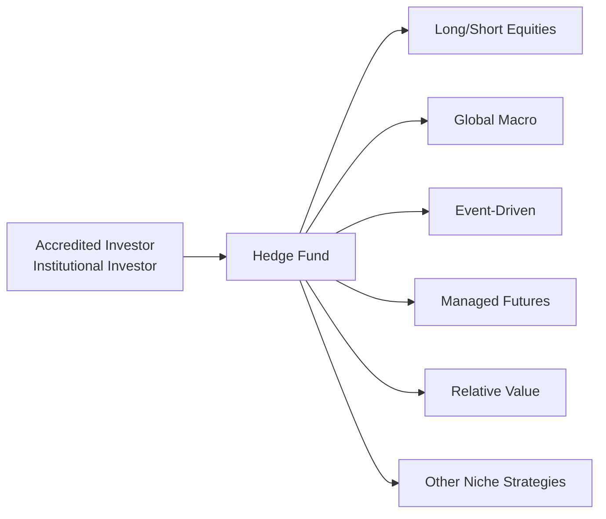

## 13.2 Overview of Hedge Funds

Picture this: a friend of mine, who’s always on the hunt for the next big investment, told me he was placing his savings in a hedge fund that aimed to crank out double-digit returns year after year. He was excited, but also a bit confused about exactly what hedge funds do. It’s easy to be intrigued by the mystique—these private funds often promise big returns, use secretive strategies, and sometimes lock investors in for a stretch of time. Let’s try to demystify hedge funds in a practical, slightly informal way.

Hedge funds can be described as private investment partnerships designed primarily for accredited or institutional investors, though from time to time high-net-worth individuals also jump on board. They aim to deliver so-called absolute returns, striving to make money whether markets are hot or cold. Of course, that’s the ideal scenario, but it’s not always so simple. Let’s talk about how these funds operate, why they can be appealing, and the crucial things to watch out for when considering them.

### Hedge Funds: The Big Picture

A hedge fund, at its core, is a pooled investment vehicle, similar in spirit to a mutual fund, except it’s usually not open to the broader public and it’s far less regulated. In Canada, hedge funds often highlight to prospective investors that they must meet certain accreditation criteria (such as having a certain level of income or net worth) before investing. This is partly to protect retail investors from strategies involving additional risk and complexity.

Hedge funds have a laser focus on generating absolute returns. In other words, they attempt to earn a positive return whether the markets are surging upward or heading downhill. This objective sets them apart from traditional mutual funds that often track or aim to outperform a specific benchmark index (e.g., the S&P/TSX Composite in Canada or the S&P 500 in the U.S.). Hedge funds may use borrowing (leverage), short-selling, derivatives, and other advanced tactics that typical mutual funds often can’t or won’t pursue to the same extent.

In Canada, the regulatory body overseeing investment dealers and mutual fund dealers is the Canadian Investment Regulatory Organization (CIRO). Hedge funds themselves aren’t necessarily regulated in the same way as, say, a mutual fund; however, the sale of hedge funds and disclosure requirements still come under the watchful eye of regulators like the Ontario Securities Commission (OSC). If a hedge fund is distributed via a registered dealer, that dealer must abide by CIRO’s guidelines and ensure that any sale meets the necessary risk and know-your-client obligations.

### Key Strategies in Hedge Funds

Perhaps the most exciting part about hedge funds is the diverse universe of strategies they can employ. These strategies vary widely in terms of both risk and return. Some funds focus on just one approach, while others blend multiple tactics.

Long/Short Equity  
Think of this as the classic hedge fund strategy. A manager takes “long” positions in stocks projected to go up and “short” positions in stocks forecast to go down. The hope is that profits from both directions exceed general market returns. For instance, in a bullish period, a manager might keep more “long” exposure, while in a downturn, “short” exposure might dominate.

Global Macro  
In global macro funds, managers examine big-picture economic themes—interest rate trends, currency movements, political events—and make bets across asset classes worldwide. They might invest in currencies, commodities, bonds, equities, or anything else that lines up with their macroeconomic forecast.

Event-Driven  
Event-driven managers look for opportunities arising from mergers, acquisitions, bankruptcies, or corporate reorganizations. If a merger is announced at C$50 per share, but the target company’s stock trades at C$48, the fund might buy shares on the assumption the deal will close and push the price to C$50.

Managed Futures  
Focusing heavily on futures contracts (on commodities, stock indices, etc.), these funds might systematically trade based on price trends or momentum signals. They can be fully automated or heavily reliant on technical analysis.

Relative Value  
Relative value managers try to exploit pricing discrepancies between related securities, such as bonds from the same issuer but with slightly different maturities or yields. The underlying assumption is that these differences are temporary and will converge given time.

Other Niche Strategies  
You might also see specialized strategies (like distressed debt or volatility arbitrage) that search out inefficiencies in areas that might be overlooked by mainstream investors. While the potential rewards can be large, these niched approaches often bring higher risks and complexity.

Here’s a quick diagram to visualize the flow of investor money into a hedge fund, which then channels it into a variety of potential strategies:

In the above flowchart, you can see how the hedge fund can allocate capital to different strategies, with the overall goal of achieving absolute returns.

### Typical Characteristics of Hedge Funds

Fee Structure (“2 and 20”)  
If you’ve ever heard folks joking about hedge fund managers getting rich, it’s largely due to performance fee structures. Many hedge funds charge a management fee of around 2% of assets under management (though this can vary—some might be 1.5%, while others sit at 2.5%). On top of that, they also take a performance fee (often around 20%) of the returns they generate beyond a certain threshold. This performance fee is sometimes subject to what’s called a “high-water mark,” meaning the fund manager only collects that performance fee on new net gains above a previous peak.

Lock-Up Period and Redemption Gates  
Hedge funds often impose a lock-up period during which investors can’t withdraw their money. This can be six months, a year, or even longer. After that lock-up expires, the fund may only allow redemptions at certain intervals (e.g., quarterly or annually). Some funds also use redemption gates, limiting how much capital can be withdrawn at once—say 10% of the entire fund’s assets per quarter. This helps fund managers avoid a liquidity crunch if too many people want out at the same time.

Less Regulation and Higher Manager Discretion  
Compared to mutual funds that have to comply with more rigid rules, hedge fund managers have broader freedom to implement their strategy. This discretion means they can use more leverage, short-selling, or derivatives. But with great power comes great responsibility (and risk). If a manager’s bets go awry (think LTCM in the late 1990s), the losses can be severe.

### Operational and Transparency Considerations

Hedge funds often have fewer transparency requirements than mutual funds. Investors usually get periodic performance reports, but they might not see daily holdings or every trade. So it’s crucial to do extensive due diligence—really get to know the fund’s strategy, the manager’s track record, and operational details like custody, auditing, and risk management practices. Potential conflicts of interest could arise if the fund’s manager engages in side pockets, special purpose vehicles, or invests in illiquid instruments that are difficult to value.

In Canada, or anywhere else, know that the sales and marketing of hedge funds must align with relevant regulations. Firms distributing hedge funds must abide by CIRO’s guidance on disclosing risks, providing standardized offering documents, and ensuring the product suits the client’s profile. The Ontario Securities Commission (OSC) also provides frameworks around offering memorandums—basically the documents that prospective investors must read thoroughly.

### Advantages and Disadvantages of Hedge Funds in Portfolios

Advantages  
▪ Diversification: Hedge funds can offer exposure to asset classes and strategies that traditional portfolios may ignore. Their ability to short securities can actually reduce portfolio correlation to the broader equity or bond markets.  
▪ Potential for High Returns: Some successful hedge funds deliver outsized gains. Many point to macro funds that famously thrived during major market downturns.  
▪ Absolute Return Objective: Unlike benchmark-focused managers, hedge funds theoretically aim for positive returns in all market conditions.

Disadvantages  
▪ High Fees: The classic “2 and 20” structure is expensive. Even if you appreciate paying for performance, you also have to weigh whether the manager is worth that cost.  
▪ Liquidity Constraints: Lock-up periods and redemption gates aren’t always investor-friendly, especially if you want to access your capital quickly for emergencies.  
▪ Complexity and Risk: With leverage, derivatives, and less regulatory oversight, there’s a risk the manager could lose a substantial portion of capital.  
▪ Manager Risk: Hedge fund performance can hinge on the skill of one or a few key individuals. If they leave or make poor calls, you’re out of luck.

Weighing these pros and cons is essential. In my own limited experience, I once had a friend who was stuck in a hedge fund unable to redeem when the market was choppy. The manager invoked a redemption gate, so my friend had to watch from the sidelines until the manager felt comfortable letting redemptions flow. That’s a stark reminder that fancy aiming for absolute returns often means less day-to-day control over your own money.

### Best Practices and Common Pitfalls

Best Practices  
▪ Conduct In-Depth Due Diligence: Scrutinize the manager’s track record, strategy, team, and fees. Look into operational risks and verify fund service providers (auditors, custodians).  
▪ Use Third-Party Data and Benchmarks: Whenever possible, compare the hedge fund’s returns to relevant indices or peer groups to ensure consistent performance.  
▪ Stay Alert to Regulatory Changes: Though hedge funds are less regulated, across the globe new rules do pop up. Follow updates from CIRO.  
▪ Revisit Performance and Strategy Consistently: Hedge funds can shift strategies if they see new opportunities. As an investor, keep an eye on changes to ensure that the fund’s direction still aligns with your goals.

Common Pitfalls  
▪ Overreliance on Past Performance: A manager’s hot streak can cool down, so be careful placing too much weight on historical returns.  
▪ Hidden Risks: Complex derivatives or illiquid positions can come with steep tail risks. A handful of wrong-way bets or margin calls can overshadow months (or years) of incremental gains.  
▪ Misalignment of Interests: If the fund manager invests only a tiny fraction of their own capital in the fund, it’s worth asking whether they truly share the same stake in the outcome as the investors.

### Canadian Regulatory Landscape

As of January 1, 2023, the Mutual Fund Dealers Association of Canada (MFDA) and the Investment Industry Regulatory Organization of Canada (IIROC) no longer exist as separate entities. They have amalgamated into the Canadian Investment Regulatory Organization (CIRO). CIRO continues as Canada’s national self-regulatory body overseeing investment dealers, mutual fund dealers, and market integrity. If you’re working with a financial advisor in Canada, they’ll be subject to CIRO rules.

The Canadian Investor Protection Fund (CIPF), which merged with the MFDA’s Investor Protection Corporation, now stands as the sole investor protection fund in Canada. However, CIPF coverage might not necessarily cover hedge funds in the same way it covers conventional securities purchased through a CIRO member firm. If you’re interested in hedge funds, ask your advisor or check CIPF details to figure out how coverage might apply, if at all.

### Real-World Example: LTCM and the Lesson on Leverage

A classic cautionary tale in the hedge fund world is Long-Term Capital Management (LTCM). LTCM had world-renowned founders, including Nobel Prize winners in Economics, and made sophisticated bets on interest rate spreads. For a while, it soared, but then markets moved in starkly unexpected ways during the 1998 Russian debt crisis. Because LTCM was heavily leveraged, the losses spiraled to the point that it threatened global financial stability. This fiasco underscores one crucial point: even brilliant minds and “can’t-miss” strategies can crumble under heavy leverage and unexpected market conditions.

### Glossary

Absolute Return: The aim to produce positive returns regardless of market direction, focusing on consistent growth rather than beating a benchmark.  
Lock-Up Period: The initial period during which hedge fund investors cannot redeem or withdraw their investment.  
Redemption Gate: A restriction that limits the percentage of total fund assets that can be redeemed at designated times.  
High-Water Mark: A fund accounting provision ensuring managers only receive performance fees on net new gains, preventing double-charging after losses.  
Due Diligence: A comprehensive appraisal of the fund or business, involving a thorough check of performance data, financial health, and operational integrity.

### Additional Resources and References

Even if you’re not inclined to pour your money into a hedge fund, it’s helpful to understand how they operate. Below are some resources to deepen your knowledge:

• CIRO (Canadian Investment Regulatory Organization): [https://www.ciro.ca](https://www.ciro.ca)  
• Ontario Securities Commission (OSC): [https://www.osc.ca](https://www.osc.ca)  
• Hedge Fund Standards Board (HFSB): [https://www.hfsb.org](https://www.hfsb.org) – for global best practices on governance and transparency.  
• “Hedge Fund Market Wizards” by Jack D. Schwager – for fascinating profiles of successful hedge fund managers, revealing how they think and operate.  
• Various open-source financial-data libraries (e.g., Python’s pandas, R’s quantmod package) that let you replicate or monitor certain hedge fund-inspired strategies.  

---

Hedge funds aren’t your everyday investment vehicle. They can be powerful tools in a portfolio, potentially delivering diversification and high returns—but at the cost of higher fees, complexity, and restricted liquidity. If you’re attracted to the allure of hedge funds, make sure your eyes are wide open to the risks and constraints. Personally, I’d say do your homework, be prepared for the unexpected, and ask yourself if you’re truly comfortable with the fund’s strategy before committing your capital. With a measured approach (and maybe a bit of patience and luck), hedge funds can be a fascinating—if sometimes nerve-racking—part of the modern investment landscape.

## Test Your Knowledge: Hedge Fund Fundamentals



### Which of the following best describes a hedge fund?
- [ ] A public investment company regulated identically to mutual funds.  
- [x] A private investment partnership that typically accepts only accredited or institutional investors.  
- [ ] A risk-free investment vehicle that guarantees returns in all market conditions.  
- [ ] An employment program specifically for fund managers.  

> **Explanation:** Hedge funds are commonly structured as private investment partnerships, generally restricted to accredited or institutional investors.

### Which of the following statements about “absolute returns” is correct?
- [ ] Absolute return means matching a benchmark index's performance.  
- [x] Absolute return strategies aim to generate positive returns regardless of market direction.  
- [ ] Absolute return funds never use leverage or derivatives.  
- [ ] Absolute return strategies prohibit short-selling activity.  

> **Explanation:** Absolute return refers to the goal of producing positive returns irrespective of broader market movement.

### What is a “lock-up period” in the context of hedge funds?
- [x] A set time period during which investors cannot redeem or withdraw their investment.  
- [ ] A period when the fund is required to publish daily net asset values.  
- [ ] A mandatory freeze on new investors.  
- [ ] A 24-hour trading ban after each market close.  

> **Explanation:** Most hedge funds adopt a lock-up period to provide managers the flexibility to deploy capital without worrying about frequent redemptions.

### What is the primary purpose of a “redemption gate”?
- [ ] To encourage more investors to join the fund.  
- [x] To limit the percentage of total fund assets that can be redeemed during a redemption window.  
- [ ] To put higher fees on investors who exit early.  
- [ ] To ensure daily liquidity for investors.  

> **Explanation:** A redemption gate limits how much capital investors can withdraw at one time, helping hedge funds manage liquidity.

### Which statement accurately characterizes the “high-water mark” concept?
- [ ] It is the fund’s best performance the investor can expect.  
- [x] It ensures the manager only earns performance fees on net gains exceeding the highest previous net asset value.  
- [x] It prevents the manager from collecting performance fees twice for the same profit.  
- [ ] It is the locked-in price above which the fund will close.  

> **Explanation:** The high-water mark protects investors by preventing managers from charging performance fees on the same gains more than once.

### Which of the following is generally a characteristic of hedge funds?
- [x] They have fewer disclosure requirements than mutual funds.  
- [ ] They are always fully covered by CIPF.  
- [ ] They must be available to the general public.  
- [ ] They only charge a fixed management fee.  

> **Explanation:** Hedge funds typically have fewer regulatory constraints and reporting obligations, though they are sold under certain accreditation rules and are not fully covered by CIPF.

### Which of these strategies is most associated with major economic and political factors?
- [ ] Long/short equity.  
- [x] Global macro.  
- [x] Event-driven.  
- [ ] Relative value.  

> **Explanation:** Global macro strategies base their trades on broad economic and geopolitical shifts, while event-driven focuses on significant corporate events. The question indicates “major economic and political factors,” which best describes global macro; event-driven also heavily considers corporate economics, so to clarify: the primarily correct choice is global macro. (However, multiple selections were provided here to highlight the difference.)

### Why do many hedge funds charge a performance fee in addition to a management fee?
- [x] To align the manager’s incentives with generating higher returns.  
- [ ] To guarantee the fund will never have a losing year.  
- [ ] To distribute profit to all investors equally.  
- [ ] To decrease the overall cost of the fund.  

> **Explanation:** Performance-based fees, such as the “2 and 20” structure, are meant to incentivize managers to aim for higher returns.

### What was one key lesson from the LTCM collapse?
- [x] Excessive leverage can amplify losses to potentially catastrophic levels.  
- [ ] Hedge funds never suffer losses.  
- [ ] Event-driven strategies cannot fail.  
- [ ] High fees protect investors.  

> **Explanation:** LTCM (Long-Term Capital Management) demonstrated how massive leverage can create systemic risk and magnify losses.

### Hedge funds are generally:
- [x] True  
- [ ] False  

> **Explanation:** Hedge funds are subject to certain constraints and regulatory oversight, but they typically have broader investment latitude than conventional mutual funds, and are marketed to accredited or institutional investors under specific guidelines.


