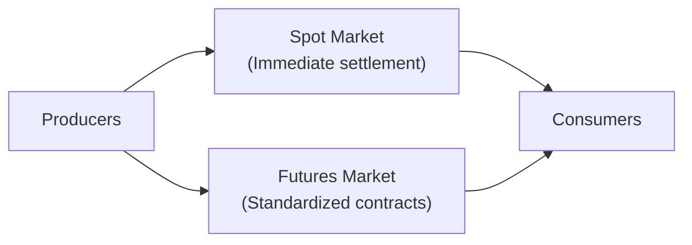

## 13.3 Overview of Commodities

Commodities—like oil, gold, wheat, and copper—often evoke images of bustling exchange floors, big price swings, and the possibility of striking it rich (or losing it all) overnight. (I’ll be honest: I once spent a rainy day in Calgary chatting with a farmer who told me how weather could make or break his year, and it opened my eyes to just how real the stakes can get!) In this section, we’ll delve into how commodities fit into an investment portfolio, their diverse categories, the factors that drive their prices, and how you can reduce or increase risk (maybe more than you’d like!) through the spot and futures markets. By the end, you’ll have a well-rounded sense of how commodities function and whether they deserve a place in your clients’ or your own investment strategy. Let’s jump in.

### Understanding Commodity Markets

A commodity is a basic good used in commerce that’s interchangeable (fungible) with others of the same type. Some might say: “Oil is oil, gold is gold,” and that’s broadly true—at least in standardized forms. While certain grades or qualities differ, each commodity within a category shares enough characteristics that they trade on a large global “pool,” typically with well-defined benchmarks or standardized specifications.

Commodity investments happen in two main ways:
• Physical ownership (think literal barrels of oil, bales of cotton, or bars of gold).  
• Derivative instruments (like futures contracts), where you gain exposure to price movements without storing or transporting anything.  

And because commodity prices often march to the beat of their own drum, they can offer diversification benefits to portfolios that are traditionally dominated by equities and bonds. But keep in mind, these same distinct price movements can bring big volatility spikes, day-to-day or even minute-to-minute.

### Categories of Commodities

It helps to break down commodities by category. If you’ve ever sat in traffic behind a semi-truck full of grain or flown over Alberta’s oil sands, you’ve probably gotten a real-life glimpse of the first or second category listed below.

• Energy (e.g., oil, natural gas)  
  - Energy commodities power our cars, heat homes, and run factories. Oil (WTI or Brent benchmarks) and natural gas are the two big names here. Geopolitical tensions, OPEC+ decisions, and weather events can send their prices bouncing like a ping-pong.  

• Precious metals (e.g., gold, silver)  
  - Gold is often viewed as a “safe haven” asset (though how “safe” it really is can be debated, as prices can still fluctuate). Silver, platinum, and palladium also attract interest, but gold usually grabs headlines.  

• Industrial metals (e.g., copper, aluminum)  
  - These are the workhorses of industry. Copper is tied to construction and infrastructure, so it’s sensitive to economic growth, especially in rapidly industrializing nations. Aluminum is widely used in manufacturing everything from beverage cans to airplanes.  

• Agricultural products (e.g., wheat, corn)  
  - Crops form the backbone of the global food supply. When I was in Manitoba, I met a wheat farmer who pointed out that a single cold snap or drought can significantly shift supply, creating large price fluctuations. Agriculture is sensitive not only to weather but also to consumer trends (like demand for livestock feed or biofuels).

### Key Drivers of Commodity Prices

Why do commodities sometimes move in ways that really catch us off-guard? Well, it’s often about supply and demand, but that’s only the beginning. Let’s unpack the usual culprits.

• Supply and demand dynamics  
  - Classic econ 101, right? When supply is constrained (e.g., an oil pipeline fails), prices go up. When demand suddenly spikes (like everyone wants more copper for electric vehicles), prices climb.  

• Weather conditions  
  - This is especially important for agricultural and energy commodities (think “warm winters” impacting natural gas demand, or “flooding rains” ruining crops).  

• Geopolitical events  
  - Conflicts or political instability in major producing regions can choke supply or disrupt shipping routes. Similarly, trade sanctions or tariffs can abruptly shift trade flows.  

• Currency fluctuations  
  - Many commodities are priced in U.S. dollars—so if the dollar surges, commodity prices might become more expensive for other countries, potentially dampening demand.  

• Global economic growth  
  - Rapid expansion (especially in energy-hungry or infrastructure-building countries like China) often spurs higher commodity consumption. A slowdown does the opposite.

### Spot Markets vs. Futures Markets

Let’s talk about two major ways commodities are bought and sold: spot markets and futures markets.

**Spot Market**  
Here, you pay the “spot price” and receive immediate delivery—kind of like buying fruit at a grocery store. The transaction is settled “on the spot” (or very close to it). For large-scale trades, though, “immediate delivery” can translate to a few days of logistical handling. The spot price is a crucial reference for short-term deals and is what you’ll hear on the news for “current gold prices” or “WTI crude front-month,” etc.

**Futures Market**  
Futures contracts are standardized agreements to buy or sell a commodity at a predetermined price on a specified date in the future. Farmers often do this to lock in a price for their harvest ahead of time. Speculators (like hedge funds or day traders) also trade futures to profit from anticipated price swings or to hedge other exposures.

If you’ve ever wondered why oil trades for different prices in different months, you’re looking at the structure of the futures curve. Sometimes the near-term price is higher than future contracts (backwardation), or it’s lower (contango). These terms can matter a lot if you’re rolling over futures positions month after month and incurring a “roll yield” that can help or hurt performance.

Below is a simplified diagram showing the flow of commodities from producers to the spot and futures markets and ultimately to end-users:

### Commodities as a Portfolio Diversifier

A strong argument for investing in commodities is their historical low-to-moderate correlation with stocks and bonds. This means that when equity markets wobble, commodity prices might remain stable or even rise. Some folks see commodities as an inflation hedge because they are real assets—when prices of goods go up, many commodity prices usually rise too. 

But correlation is dynamic. During certain crises, almost all assets can move together in a “flight to liquidity.” In those moments, commodities might not cushion your portfolio as much as you’d like. Nonetheless, over the long run, adding a dash of commodity exposure can provide an extra layer of diversification.

### Risks Associated with Commodity Investments

Commodities can be thrilling or terrifying, depending on how you approach them.

• High price volatility  
  - Commodities tend to react quickly to global developments. Political unrest, unexpected weather shifts, or even rumors can cause huge price swings.  

• Leverage  
  - Many investors access commodities via futures, which can be heavily leveraged. While leverage can amplify gains, it can also multiply losses. Futures margin calls are no joke.  

• Storage and transportation costs  
  - Holding physical commodities can be a logistical challenge. Carrying costs (warehousing, insurance, spoiling or degradation) can eat away at returns.  

• Regulatory and geopolitical risk  
  - Changing government policies (like export bans or new tariffs) can disrupt trade flows, while conflict can halt production or transit.  

• Liquidity risk  
  - Certain agricultural or minor metal markets might not have the depth of crude oil or gold. When market liquidity dries up, exiting positions can be costly.

### Practical Example: Using Commodities for Inflation Hedging

Suppose your client is worried about inflation spiking over the next few years. You might suggest adding a small commodity position, say via an ETF that tracks a broad commodities index. Because commodities like oil or metals often see price increases when inflation rises, the position could help offset potential losses in other parts of your client’s portfolio.

However, you should also consider costs:  
• If the ETF rolls futures in contango, you might face a return drag over time.  
• The management expense ratio (MER) for commodity-based ETFs is often higher than for plain-vanilla equity index funds.  

So, it’s a balancing act. But it might be worth it if the portfolio would otherwise face too much inflationary pressure.

### A Note on Canadian Regulatory Landscape

In Canada, the primary national self-regulatory organization for investment dealers and mutual fund dealers is CIRO (the Canadian Investment Regulatory Organization). CIRO came into being after the amalgamation of the defunct IIROC and MFDA, and it oversees the activities of member firms, ensuring they follow regulatory guidelines. If you’re offering commodities-related investment products, you’ll want to be aware of CIRO’s rules on leverage, margin, and know-your-client (KYC) obligations regarding futures and derivatives.

Additionally, the Canadian Investor Protection Fund (CIPF) provides coverage in case a CIRO member firm becomes insolvent. This coverage typically focuses on the recovery of assets in accounts, although it doesn’t protect against losses from market movements. For more information, visit [https://www.ciro.ca](https://www.ciro.ca).

If you’re venturing into the world of commodity futures, you might engage with the Montreal Exchange ([https://www.m-x.ca](https://www.m-x.ca)), a part of the TMX Group. While it’s smaller compared to giant U.S. exchanges, it offers a range of derivative products. On the global stage, the Commodity Futures Trading Commission (CFTC) in the U.S. ([https://www.cftc.gov](https://www.cftc.gov)) sets rules that significantly influence futures trading worldwide. You’ll also want to monitor the Bank of Canada’s (BoC) updates ([https://www.bankofcanada.ca](https://www.bankofcanada.ca)) to track interest rates and economic indicators that might ripple into commodity prices.

### Conceptual Walkthrough: A Simple Futures Pricing Model

At a high level, a common (though simplified) way to think about futures pricing is through the idea of cost of carry. In KaTeX:


  F_{0} = S_{0} \times e^{r \times t}


Where:  
• \\( F_{0} \\) is today’s futures price for delivery at time \\( t \\).  
• \\( S_{0} \\) is today’s spot price.  
• \\( r \\) is the risk-free rate or carrying cost.  
• \\( t \\) is the time to maturity in years.  

This formula shows that futures prices can often be higher than the current spot price, reflecting the cost of financing and storage (if it’s a physically storable commodity). Real markets get more complicated—especially for agricultural goods (often seasonally dependent) or metals that might trade above or below theoretical cost-of-carry prices for various reasons.

### Best Practices and Common Pitfalls

**Best Practices**  
• Maintain a disciplined approach to position sizing. (Don’t let a short-term hunch turn into an overleveraged bet.)  
• Stay informed: watch weather forecasts, inventory reports, and major economic data that can heavily influence specific commodities.  
• Map out your exit strategy. Plan what triggers a sell, whether it’s technical signals or changes in fundamentals.  

**Common Pitfalls**  
• Ignoring storage roll costs. If you’re investing in a commodity ETF or rolling futures contracts, you need to be aware of the costs or gains from contango or backwardation.  
• Overlooking liquidity. Thinly traded markets can cause wide bid-ask spreads, which can chew into your returns.  
• Getting too emotional. Commodities can have huge intraday swings; it’s easy to get caught up in fear or greed.  

### Additional Resources

If you want a deeper dive, check out these resources:

• The Montreal Exchange: [https://www.m-x.ca](https://www.m-x.ca)  
• Commodity Futures Trading Commission: [https://www.cftc.gov](https://www.cftc.gov)  
• Bank of Canada: [https://www.bankofcanada.ca](https://www.bankofcanada.ca)  
• Recommended reading: “A Trader’s First Book on Commodities” by Carley Garner (provides an excellent primer on how commodity markets really work)  

### Glossary

**Spot Price**  
The current market price at which a particular commodity can be bought or sold for immediate delivery.

**Futures Contract**  
A standardized legal agreement to buy or sell a commodity at a predetermined price at a specified time in the future.

**Backwardation**  
A market condition where the futures price of a commodity is lower than the spot price, potentially creating a positive roll yield for long positions.

**Contango**  
A market condition where the futures price of a commodity is higher than the spot price, potentially creating a negative roll yield for long positions.

**Leverage**  
Using borrowed capital or derivative instruments to amplify exposure and potential returns (but also potential losses).

----

I sometimes think commodities are a bit like the underappreciated wildcards of the investment world: they can serve as a valuable hedge, or they can be a roller coaster that keeps you (and your clients) up at night. The secret is to study them carefully, respect their volatility, and fit them into your overall strategy sensibly.

## Test Your Knowledge: Commodity Markets Quiz



### Which of the following statements best describes the spot market for commodities?
- [x] It involves buying or selling a commodity at its current price for immediate delivery.
- [ ] It involves long-term contracts with no specified delivery date.
- [ ] It is a market only for precious metals like gold and silver.
- [ ] It is a market that requires at least one month before settlement.
> **Explanation:** The spot market refers to transactions that are settled and delivered almost immediately at the current price.

### In which scenario would you most likely see backwardation in a commodity futures curve?
- [x] When current demand is very high and immediate supply is limited, pushing spot prices above future prices.
- [ ] When the future price is always higher than the spot price.
- [ ] When the commodity is in surplus, driving the spot price well below futures contracts.
- [ ] When the commodity faces no storage costs.
> **Explanation:** Backwardation typically arises when immediate or spot demand is strong, driving up current prices relative to future prices.

### How can agricultural commodities be significantly affected by weather conditions?
- [x] Extreme weather events like droughts or floods can drastically reduce supply and drive prices higher.
- [ ] Weather has no real impact because agricultural products are harvested indoors.
- [ ] Weather conditions only influence precious metals, not agricultural goods.
- [ ] Weather can’t affect commodity prices unless it is severe enough to affect global shipping lanes.
> **Explanation:** Weather directly affects crop yields, making supply uncertain and thus driving price volatility for agricultural products.

### What does leverage do in the context of commodity futures trading?
- [x] It amplifies both potential gains and potential losses.
- [ ] It only multiplies gains while leaving losses unchanged.
- [ ] It permanently reduces risk because you need less capital up front.
- [ ] It removes the need for margin requirements.
> **Explanation:** Leverage can magnify returns, but it also magnifies potential losses. Margin calls are still present and can be triggered more quickly at higher leverage levels.

### Why are commodities often considered an inflation hedge?
- [x] Their prices tend to rise when the general price level of goods and services increases.
- [ ] They have no correlation with inflation at all.
- [ ] They are always cheaper than stocks and bonds.
- [ ] They never experience price volatility.
> **Explanation:** As the prices of goods go up, commodities—being the raw materials for goods—often experience a corresponding rise in price, helping offset inflationary effects in a portfolio.

### What is a primary benefit of including commodities in a traditional stock-and-bond portfolio?
- [x] They may offer diversification benefits due to low-to-moderate correlation with equities.
- [ ] They guarantee higher returns than equities or bonds.
- [ ] They’re exempt from all regulatory oversight.
- [ ] They have no risk of capital loss.
> **Explanation:** Commodities can provide diversification because they often move independently from stocks and bonds, reducing overall portfolio risk.

### Which of the following is a downside of investing in physical commodities?
- [x] Storage and transportation costs can reduce overall returns.
- [ ] You avoid all price volatility.
- [ ] You can use unlimited leverage without margin calls.
- [ ] Physical commodities never degrade.
> **Explanation:** Holding commodities physically can incur costs such as storage, insurance, and potential spoilage for some items.

### What role does the Bank of Canada play in influencing commodity prices in Canada?
- [x] It sets monetary policy, which can affect interest rates, currency values, and by extension, commodity prices.
- [ ] It directly trades commodities to control global supply.
- [ ] It imposes tariffs on all commodity exports.
- [ ] It has no interaction or impact on commodity dynamics.
> **Explanation:** By setting monetary policy, the Bank of Canada influences interest rates and currency exchange rates, both of which can indirectly affect commodity supply, demand, and pricing.

### Which option is NOT a common misconception about commodity investing?
- [x] Commodities can be highly volatile and require careful risk management.
- [ ] Commodities always move in the opposite direction of equities.
- [ ] Commodity futures require zero margins.
- [ ] Agricultural commodities are unaffected by consumer trends.
> **Explanation:** It’s not a misconception that commodities can be volatile and demand attention to risk management. Quite the opposite—it’s a valid reason for caution.

### True or False: CIRO (the Canadian Investment Regulatory Organization) replaced IIROC and MFDA and now oversees investment dealers, mutual fund dealers, and market integrity in Canada.
- [x] True
- [ ] False
> **Explanation:** CIRO is indeed the new consolidated self-regulatory body in Canada, taking over from the defunct IIROC and MFDA.


