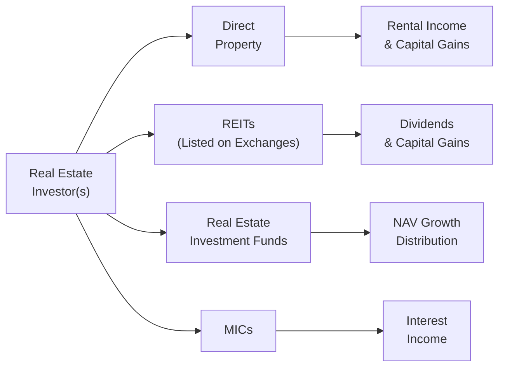

## 13.4 Overview of Real Estate

Real estate, for many of us, can feel a little larger-than-life. It’s that home you drive by every day, the office tower that lights up the skyline at night, or the local warehouse that ships products to customers all over the region. So, let’s talk about how all of these different bits and pieces fit into investment portfolios. Personally, I remember the anxious excitement of touring my first potential rental property. I walked in, scanned the floors, the walls, literally counting how many coats of paint it would need. That moment — full of “um,” “ah,” and “I hope this is a good investment!” — made me realize how multifaceted real estate can be.

There’s a lot more to real estate than just four walls. In finance, we often break it down into different segments and look at each from an investment perspective. Real estate can serve as a stable generator of income over the long haul, and it’s sometimes praised as a hedge against inflation. However, we shouldn’t forget about the potential headaches: illiquidity, transaction costs, and localized economic risks. Let’s walk through these nuances carefully, giving you the full picture of real estate within a broader portfolio context.

Understanding Different Real Estate Segments

Residential properties include single-family homes, condominiums, and apartment buildings. They’re usually driven by local demand, population movement, and housing affordability. For a smaller investor, a residential property might be a good (though not always easy) starting place, since most people have at least some intuitive understanding of the housing market. You know how we say “location, location, location”? Well, location definitely matters. But so do things like mortgage rates, the job market in the area, and even intangible factors (think “vibe” of a neighborhood).

Commercial properties include office buildings, coworking spaces, and hotels. Their performance hinges on business cycles. When offices are in high demand (like in a booming tech town), rents can soar. But an economic downturn or fundamental changes in how companies use office space can leave owners with high vacancies.

Industrial properties meet the needs of logistics, manufacturing, and warehousing. These often carry long-term leases and can be driven by e-commerce or supply-chain demands. Industrial real estate is also quite sensitive to global trade patterns and the cost of borrowing to finance big warehouse projects.

Retail spaces — from small strip malls to large shopping centers — are typically reliant on consumer spending. Shifts in consumer shopping habits pose ongoing challenges, particularly the move toward e-commerce. Still, prime retail sites can remain lucrative if they have strong anchor tenants (like a popular grocery store).

Mixed-use properties cater to real estate that merges multiple functions. You might see a retail ground floor, a couple of floors of offices, and residential condos on top. These properties can be more complex to manage — you’re dealing with many types of tenants and building codes — but they can also be more resilient, as a slowdown in one area (e.g., retail foot traffic) might be offset by strong demand in another (e.g., residential).

Here is a quick snapshot that compares the segments:

| Real Estate Segment | Typical Uses                                    | Key Considerations                                                              |
|---------------------|------------------------------------------------|---------------------------------------------------------------------------------|
| Residential         | Houses, condos, apartments, and rental units   | Neighborhood quality, mortgage rates, tenant stability, local economic factors  |
| Commercial          | Office buildings, hotels, coworking spaces     | Tenant quality, length of lease contracts, broader business cycles              |
| Industrial          | Warehouses, manufacturing sites, data centers  | Proximity to transport hubs, logistic demand, strength of manufacturing sector  |
| Retail              | Malls, storefronts, shopping centers           | Consumer trends, location, anchor tenants, e-commerce competition              |
| Mixed-Use           | Combo of residential, commercial, retail, etc. | Complexity of management, synergy or conflicts among different property uses    |

Key Drivers of Real Estate Value

We throw around the phrase “location” a lot, but that’s only one aspect. Real estate value is driven by:

• Location: It affects everything, from foot traffic to the property’s reputation. A scenic waterfront condo often commands a premium; likewise, a downtown core office tower benefits from high visibility and easy commuter access.

• Interest Rates: When rates drop, borrowing becomes cheaper, so more buyers can jump in. This drives up property prices. When rates rise, it can cool down the market since mortgage payments become more expensive.

• Supply-Demand Dynamics: If new home construction lags behind population growth, for instance, a housing shortage can push up prices and rents.

• Economic Health: If the local (or national) economy is growing, businesses flourish, consumer confidence strengthens, and real estate typically benefits. Conversely, recessions, downward business cycles, or structural changes (e.g., telecommuting) can put downward pressure on property valuations.

• Government Regulations: Zoning, taxation, supportive policies for tenants or homebuyers, and mortgage lending rules (such as qualifying interest rates set under guidelines from the Canada Mortgage and Housing Corporation (CMHC)) all weigh heavily. Keep an eye on how the Canadian regulatory environment can shift the cost and risk of borrowing.

• Demographics: Growing or aging populations can drive certain segments. A city with a booming, youthful population might see more demand for rental condos near workplaces and leisure activities.

Investment Vehicles in Real Estate

When we say “invest in real estate,” it’s easy to imagine physically buying a building or parcel of land. But there are actually lots of ways to gain exposure to real estate in your portfolio.

Direct Property Investments  
Some folks buy a house or an apartment building and rent it out. This can be a very hands-on route; you’re the one dealing with clogged sinks, tenant turnover, and property taxes. Direct investment often requires substantial capital up front (or a significant mortgage). It can provide stable cash flow if occupancy remains high, but the property can become quite illiquid — especially if you need to sell quickly in a slow market.

Real Estate Investment Trusts (REITs)  
REITs are corporations or trusts that own a portfolio of income-generating real estate. That could be anything: office buildings, shopping malls, hospitals, data centers — you name it. REITs are typically traded on stock exchanges, so you can buy and sell them like shares. They must distribute a large chunk of their taxable income as dividends, which explains their popularity among income-oriented investors. In Canada, REITs often appear on the Toronto Stock Exchange, letting you gain exposure to large-scale real estate without the hands-on management hassle.

Real Estate Investment Funds  
These are pooled investment vehicles (such as mutual funds or private equity-style funds) dedicated to real estate. The structure varies: some might be open-end funds where you can redeem units at net asset value (NAV), while others may be closed-end with fixed terms. Each fund has its own strategy — it could focus on industrial property in certain regions or perhaps a diversified approach across multiple market segments.

Mortgage Investment Corporations (MICs)  
A Mortgage Investment Corporation pools investor capital to lend primarily residential mortgages. This can often involve lending to borrowers who might not qualify for traditional bank mortgages. So, while MICs can offer attractive yields, there’s usually higher risk due to the borrower’s credit profile or the collateral quality. In Canada, these are structured under specific federal regulations in the Income Tax Act, requiring them to distribute most of their income as well.

Diagrams can help us visualize how investment flows into different real estate options:

In this diagram, the real estate investor (A) can channel capital into various vehicles. Direct ownership (B) can yield rental income and potential capital appreciation (F). REITs (C) can distribute dividends and provide capital gains if share prices rise (G). Real estate funds (D) often have NAV growth and distributions (H). Finally, MICs (E) distribute interest income while they manage a portfolio of mortgages (I).

Benefits of Including Real Estate in a Portfolio

You might be asking: “Why do I even want this in my investment mix?” Well, real estate can:

• Diversify Your Portfolio: Real estate returns don’t always move in perfect tandem with the stock or bond markets. That helps mitigate some portfolio volatility.

• Provide Relatively Stable Returns: Rental income can remain steady if properties remain occupied. Some investors find comfort in a physical, tangible asset.

• Offer an Inflation Hedge: Historically, property values can trend upward during inflationary periods. Rents can often be adjusted to match rising prices, offering some protection against the eroding purchasing power of money.

• Supply Leverage Opportunities: Real estate is one of the few asset classes that banks are typically comfortable lending against. But keep in mind, adding leverage also boosts risk.

Challenges and Risks

I once owned a duplex where the upstairs tenants moved out, leaving me with no rental income for months. It got me thinking: real estate, for all its appeal, has plenty of challenges.

• Illiquidity: Want to sell quickly in a down market? That might mean lowering your price dramatically just to attract buyers. This illiquidity is baked into most direct property transactions.

• High Transaction Costs: Real estate commissions, land transfer taxes, legal fees — it all adds up. These costs can eat into your returns, especially for shorter holding periods.

• Maintenance, Repairs, and Vacancies: Problems with a property (e.g., roof leaks) can come out of nowhere and demand immediate capital. Vacancies can disrupt your income flow and might require additional marketing or incentives to attract new tenants.

• Local Economic Downturns: If a region’s main industry declines, or if property taxes shoot up, your returns can suffer. Real estate is heavily tethered to local or regional conditions.

• Tenant Risk and Regulatory Hurdles: Even if you find tenants, evicting a delinquent tenant or navigating local homeowner regulations can be time-consuming and stressful.

Glossary of Key Terms

Cap Rate (Capitalization Rate)  
The capitalization rate is calculated by dividing the net operating income (NOI) from a property by the property’s market value. Mathematically, you might see it expressed as:


\text{Cap Rate} = \frac{\text{Net Operating Income}}{\text{Property Market Value}}


It’s a common metric when assessing a property’s potential return, comparable in spirit to a stock’s dividend yield. A higher Cap Rate sometimes indicates greater risk (and potentially higher return), whereas a lower Cap Rate suggests a more stable asset with lower yields.

Cash Flow  
Cash flow is simply the net money flowing in or out of the property. For instance, you collect rent (inflow), then pay operating expenses, property taxes, mortgage payments, and repairs (outflows). The remainder is your net cash flow.

Leverage Ratio  
This indicates how much of the property’s value is financed with debt. For example, if you have 70% of your property value in a mortgage, the leverage ratio is 70%. High leverage can amplify returns but also magnify losses.

Real Estate Investment Trust (REIT)  
A corporation or trust that handles a portfolio of real estate. It pays out a large portion of its income as dividends. REITs can specialize in many sectors (such as residential, commercial, or industrial) or in certain regions.

Mortgage Investment Corporation (MIC)  
Under Canadian law, a MIC invests in mortgages secured primarily by residential properties. They distribute almost all of their income and often appeal to investors seeking fixed income and partial shelter from direct property-management hassles.

Putting It All Together

Perhaps you’re a new investor just starting to dip your toes into the world of real estate. Or maybe you’re an experienced investor seeking to compare REITs against direct ownership. Regardless, the essential questions you’ll want to tackle include:

• What type of real estate segment suits my risk profile and expertise?  
• Am I prepared for the costs and hands-on responsibilities of a direct investment?  
• Is a REIT or a real estate fund a better fit for my liquidity needs?  
• How much leverage am I comfortable using?  
• Do I understand the local and macroeconomic factors that affect my property?

Best Practices

• Conduct Thorough Due Diligence: If you’re going direct, investigate everything from property insurance costs to prospective tenant demand. If you’re looking at a REIT, analyze the portfolio composition, historical dividend yields, and vacancy rates.

• Diversify Across Locations: Confidentially, I’ve seen close friends face big losses because they bet heavily on a single market that experienced a downturn. Spreading your real estate exposure across different areas or types of properties can help reduce localized risk.

• Keep Adequate Reserves: Real estate always comes with surprise expenses. Maintaining a reserve fund helps you stay afloat when issues pop up — and trust me, they will.

• Monitor Economic Indicators: Interest rates, employment data, local population trends, commercial vacancy rates, and supply-demand metrics can give you valuable clues about where the market’s heading.

• Stay Current with Regulations: Federal rules (like changes to mortgage stress tests) or provincial/municipal rules (like rent control policies) can significantly alter the investment landscape. CIRO (the Canadian Investment Regulatory Organization), established in 2023, is Canada’s new self-regulatory body overseeing investment dealers, mutual fund dealers, and marketplace integrity. Always keep an eye on official announcements through their website at [https://www.ciro.ca](https://www.ciro.ca).

Additional Resources and References

• Canada Mortgage and Housing Corporation (CMHC): This agency provides both mortgage insurance and loads of research and data on Canadian housing [https://www.cmhc-schl.gc.ca](https://www.cmhc-schl.gc.ca).  
• Real Property Association of Canada (REALPAC): For up-to-date industry reports and standards in real estate [https://www.realpac.ca](https://www.realpac.ca).  
• “Investing in REITs” by Ralph L. Block: A recognized work that dives into analyzing and selecting REITs.  
• For broader Canadian investing insights and updates, see CIRO at [https://www.ciro.ca](https://www.ciro.ca).

It’s probably obvious that real estate is a big, ginormous world, full of hope, challenges, and complexity. Whether you’re drawn in by the potential for strong returns, or perhaps just the comfort of owning something physical, it pays to take a step back and weigh the pros and cons. After all, once you’re in, you’ll likely be in it for a while.

Real estate is not a sure bet, but when approached strategically — with an eye on location, macroeconomic trends, your personal risk appetite, and the best type of ownership structure — it can become a powerful part of your investment portfolio. And maybe you’ll find yourself, just like me, exploring that first property with a mixture of excitement, mild panic, and a sense that you’re stepping into something both timeless and endlessly adaptable.

---

## Real Estate Knowledge Check: Test Your Understanding of Property Investing



### Which of the following is a potential benefit of including real estate in a diversified portfolio?

- [x] It often provides stable returns and potential income from rents.
- [ ] It guarantees capital appreciation in any market condition.
- [ ] It is entirely liquid and can be sold immediately at market value.
- [ ] It faces no regulatory oversight and minimal legal expenses.

> **Explanation:** Real estate can yield stable returns through rental income and potential price appreciation. It’s not fully liquid, and it does not guarantee price gains. Regulations and legal considerations are definitely relevant.

### What is the primary factor that typically drives supply-demand conditions in real estate markets?

- [ ] Central bank monetary policy alone.
- [ ] Only demographic changes.
- [x] A combination of immigration, construction activity, demographics, and economic vitality.
- [ ] Merely the local government’s tax policy.

> **Explanation:** Supply-demand in real estate is shaped by a variety of factors including immigration, new construction, demographic trends, economic conditions, and sometimes government policies on development and taxes.

### Which vehicle allows you to invest in a portfolio of income-generating properties without needing to directly purchase or manage the properties yourself?

- [ ] Direct home ownership.
- [x] Real Estate Investment Trust (REIT).
- [ ] Buying a second condominium for personal use.
- [ ] Participating in an unregulated salvage fund.

> **Explanation:** A REIT is a structured investment vehicle that owns and often operates income-producing real estate. Investors can buy shares and receive distributions without the obligations of a landlord.

### What drawback do many real estate investors face when attempting to exit a direct property investment quickly?

- [ ] Extremely high dividend yield.
- [x] Illiquidity and the need to lower the price for a quick sale.
- [ ] Guaranteed profit from forced eviction sales.
- [ ] No legal or regulatory requirements.

> **Explanation:** Selling a property in a short timeframe usually gives sellers less bargaining power, which can force them to lower their asking price. Real estate is widely considered an illiquid investment.

### Which organization replaced the MFDA and IIROC in 2023 to become Canada’s new self-regulatory body for investment dealers and market integrity?

- [x] The Canadian Investment Regulatory Organization (CIRO).
- [ ] The Canadian Investor Protection Fund (CIPF).
- [ ] The FDIC (Federal Deposit Insurance Corporation).
- [ ] The Bank for International Settlements (BIS).

> **Explanation:** On January 1, 2023, the Mutual Fund Dealers Association of Canada (MFDA) and the Investment Industry Regulatory Organization of Canada (IIROC) amalgamated into CIRO, Canada’s new investment regulatory body.

### What is the main purpose of a Mortgage Investment Corporation (MIC)?

- [x] To pool investor capital and invest in mortgages, primarily residential.
- [ ] To operate retail-focused properties across multiple provinces.
- [ ] To serve as a brokerage for distressed properties.
- [ ] To function strictly as a private equity real estate fund.

> **Explanation:** A Mortgage Investment Corporation (MIC) pools investor funds to originate or invest in mortgages. It follows Canadian regulations that require it to distribute most of its income.

### Which statement correctly describes the “Cap Rate” in real estate?

- [x] It’s the ratio of a property’s net operating income (NOI) to its current market value.
- [ ] It measures the loan-to-value ratio of a mortgage.
- [x] It is often used to compare different real estate investments.
- [ ] It is determined purely by the prevailing prime rate.

> **Explanation:** The Cap Rate helps investors evaluate a property’s rate of return by comparing annual net operating income with the current market value. It’s widely used for comparisons across different properties and reflects both risk and return.

### What is a realistic example of a risk associated with leverage in real estate investing?

- [x] It can magnify losses if property values decline, leaving the investor owing more than the property is worth.
- [ ] It eliminates all mortgage-related expenses.
- [ ] It ensures permanent price appreciation.
- [ ] It never affects your credit credibility.

> **Explanation:** When using leverage, the investor borrows money to purchase real estate. If property values drop, the debt still needs to be repaid, which can lead to negative equity.

### Which of the following is a recognized benefit of holding a reserve fund for real estate investments?

- [x] Covering unexpected repairs or maintenance costs.
- [ ] Increasing leverage without lender approval.
- [ ] Guaranteeing vacancy rates remain at zero.
- [ ] Eliminating the need for any property insurance.

> **Explanation:** Maintaining sufficient reserve funds helps you pay for unplanned expenses, like a broken HVAC unit or urgent renovation, which helps stabilize cash flow and safeguard against emergency costs.

### Real estate can sometimes serve as an inflation hedge because:

- [x] Property values and rents often rise when prices in general go up.
- [ ] It is unaffected by changes in the cost of materials or labor.
- [ ] Tenants must pay a fixed rent, unaffected by inflation.
- [ ] Government policies are always favorable in inflationary times.

> **Explanation:** Real estate tends to move with the overall price levels in the economy, allowing landlords to raise rents and property values to increase over time, helping offset inflation’s impact on investment returns.


