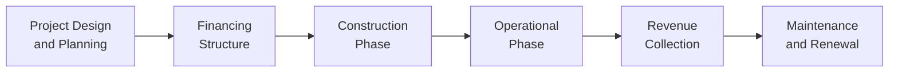

## 13.5 Overview of Infrastructure

Infrastructure is, in many ways, the backbone of our daily lives. It includes those big, sometimes invisible systems that keep our modern world moving—like roads, bridges, airports, power lines, water systems, telecommunications networks, and more. For investors, infrastructure can also offer a distinct set of potential benefits, including stable long-term returns and diversification. Yet, investing in infrastructure is hardly trivial. It involves unique maturities, regulatory oversight, and substantial capital outlays. In this section, we’ll dig deeply into infrastructure as an asset class, explore the key characteristics that make it attractive (and sometimes complicated), and outline ways to approach infrastructure investing in practice.

Before we get started, maybe I can share a quick personal anecdote. I once spoke to a friend who spent hours driving along a toll road in Ontario. She was always annoyed about the toll fees. One day, I lightly joked, “You know, you could actually own a piece of that road!” That got her curious, and it’s a neat example: those tolls you pay might actually go to investors who helped finance the highway’s construction, in exchange for stable revenues over many years. So, let’s see what it means to invest in infrastructure, how it works, and why it might be relevant for all sorts of portfolios.

---

### The Importance of Infrastructure

Infrastructure literally paves the way for economic development. Whether it’s a new bridge linking two busy cities or a power plant that keeps the lights on, infrastructure underpins commerce, public health, education, and much more. From an investment perspective, infrastructure projects often have:

• Long life spans (roads and bridges can last decades).  
• Monopoly-like characteristics, meaning there might be only one big toll highway or one municipal water system in a region.  
• Regulated or concession-based revenue, through which an entity—often a government—provides stable returns to whoever invests in building or operating the asset.

Given these features, infrastructure investments can offer stable, steady income over a long period, which appeals to pension funds, insurance companies, and private investors looking for relatively predictable cash flows.

---

### Types of Infrastructure Assets

When we talk about infrastructure, we’re typically referring to a broad scope of physical assets that serve public needs. These can be grouped by function:

• Transportation: Think roads, highways, airports, seaports, and railways.  
• Utilities: Includes electricity generation and distribution, water supply, and, in some cases, natural gas pipeline infrastructure.  
• Telecommunications: Cell towers, fiber optic networks, broadband distribution systems.  
• Social Infrastructure: Hospitals, schools, prisons, and similar publicly operated or socially oriented facilities.  

One tiny side note: I remember traveling in a remote area of Canada and realizing that the only reliable cell service came via a single tower perched on a hill. That tower was (and still is) considered a piece of telecom infrastructure that might provide stable returns to whoever financed it.

---

### Key Characteristics of Infrastructure Investments

#### Long-Term, Stable Cash Flows

A major attraction is the potential for stable and predictable income. Often, this income is derived from user-pays models (like tolls) or from regulated tariffs set by government bodies. In other words, if you invest in a toll bridge, you might receive revenue each time a car crosses the bridge for the next 30 years.

#### Monopoly-Like Traits

Infrastructure assets often enjoy exclusive rights or natural monopolies that come with high barriers to entry. For instance, a single power grid might supply an entire region, locking out competition due to the massive expense of building a parallel distribution network. However, political pressures can arise if governments or regulators believe the monopoly is extracting too high a return from users.

#### Political and Regulatory Oversight

Infrastructure is subject to extensive regulation precisely because of its core importance to the public. In Canada, you might see these oversight mechanisms at both the provincial and federal levels, depending on the nature of the project. Regulations can dictate toll rates, environmental standards, and even maximum allowed returns, typically to protect the public interest.

---

### Potential Benefits for Investors

#### Lower Correlation with Traditional Equity Markets

Because infrastructure projects—roads, utilities, water facilities—often have fairly inelastic demand, they can be less sensitive to general economic cycles. If the economy slows, people still need electricity and water, and they still might use toll roads. This can result in cash flows that aren’t closely tied to the broader equity market. So, building an infrastructure allocation into a portfolio may improve diversification.

#### Inflation Protection

Many infrastructure investments include revenue structures indexed to inflation. For example, a regulated utility may receive periodic rate adjustments tied to the Consumer Price Index (CPI). So, if inflation rises, the utility’s prices (and thereby revenues) may rise as well, helping protect investors’ real returns over time.

#### Stable Yield Over Long Horizons

Infrastructure returns can come from user fees or availability payments (which we’ll discuss shortly). Because these revenue sources are often predictable, infrastructure assets can provide a steady yield. That’s why many institutional investors—like pension funds—flock to infrastructure. They want stable, long-duration cash flows that can fund long-term liabilities.

---

### Risks and Considerations

Everything isn’t always rosy in infrastructure investing. If you’ve ever tried crossing a politically contentious toll bridge, you may have heard folks complaining that prices are “too high” or the government changed the toll structure. Let’s get into some of those potential pitfalls.

#### Political and Regulatory Risk

Politics and policy changes can significantly impact infrastructure revenues. A government might promise a certain tariff or toll rate, only to face a voter backlash years later—leading to lower rates than initially agreed. Similarly, a shift in oversight or regulation can reduce profitability or hamper expansions. In Canada, regulation of utilities can change if governments introduce new environmental or social mandates.

#### Capital-Intensive Projects with Long Payback

Infrastructure construction requires significant upfront capital. The payback period might stretch 20 or 30 years. If an investor’s time horizon is shorter, or if unexpected changes happen midway (like cost overruns during construction), this can pose challenges. Delays, budget blowouts, and operational hiccups can all weigh on returns.

#### Operational Risks

Bridges need maintenance, airports need expansions, and water plants must meet environmental regulations. Poor management or lack of maintenance can result in costly repairs and downtime. In some cases, revenue might halt if the asset isn’t available for use—leading to major disruptions to expected cash flows.

---

### Concession Agreements, Regulated Utilities, and Availability Payments

Before we jump into a few more details, let’s clarify some terms you’ll see over and over in infrastructure investing. These are also helpful in understanding the revenue arrangements that underpin many infrastructure assets.

#### Concession Agreement

A Concession Agreement gives a private entity the right to operate a business or manage an infrastructure asset for a certain period, typically in exchange for building, financing, or maintaining the asset. For instance, a private company might sign a 30-year concession to build and operate a road, collecting tolls in return.

#### Regulated Utility

A Regulated Utility is a utility governed by a regulatory body that controls rates and service conditions. Take an electricity grid: The utility that owns and operates this grid can often only charge what the regulator allows. The regulator, in turn, balances the utility’s need to earn a fair return with the public’s need for reasonable, reliable service.

#### Availability Payment

In certain Public-Private Partnership (P3) models—popular in Canada and many other jurisdictions—private investors receive “Availability Payments” from the government. These payments are contingent on the facility being operational. So if a private company builds a hospital, the government may pay them a certain annual fee as long as the hospital meets performance metrics (operational, open to the public, meeting quality standards), rather than collecting user fees directly.

---

### A Step-by-Step Perspective on Infrastructure Investing

Sometimes it’s easiest to see it as a sequence of interlinked phases:

["Project Design  and Planning"]: This includes feasibility studies, environmental assessments, and regulatory approvals.  
["Financing  Structure"]: Draws on equity, debt, or sometimes government funding or guarantees.  
["Construction  Phase"]: Typically the highest capital outlay and can present significant cost overrun risks.  
["Operational  Phase"]: The asset is ready to use. Tolls, tariffs, or availability payments kick in.  
["Revenue  Collection"]: Long-term cash flow generation through user fees or regulated rates.  
["Maintenance  and Renewal"]: Assets need ongoing upkeep and occasional expansions or upgrades.

As you can see, a lot can happen between the design table and eventual revenue collection—making thorough due diligence absolutely crucial.

---

### Practical Examples and Real-World Scenarios

• Highways and Toll Roads: In Ontario, you might have privately operated roads with an electronic toll collection system. The company that built the road receives toll revenue for decades. But if drivers start avoiding the toll or an alternative route emerges, usage might drop, reducing revenues.  

• Airports: An airport typically has multiple revenue streams—landing fees, terminal charges, retail concessions, and parking. Investors might partner with local authorities under a concession model or a public-private partnership.  

• Water Treatment Facilities: A municipal authority contracts out the design, construction, and operation of a water facility on a long-term basis. The investor-operator might receive water fees or fixed amounts from the municipality, depending on how the contract is structured.  

• District Energy Systems: In a mixed commercial/residential area, a private firm can build a central facility to provide heating and cooling. They sign long-term contracts with building owners, generating stable revenues and taking advantage of economies of scale.

---

### Common Investment Structures

• Direct Ownership: Large institutional investors sometimes directly buy or develop an infrastructure project. This requires significant capital and project management capabilities.  

• Infrastructure Funds: Pooled vehicles that invest in a variety of infrastructure assets. These funds may be privately offered (e.g., private equity-style funds) or publicly traded (e.g., certain closed-end funds).  

• Public-Private Partnerships (P3s): Governments and private investors form partnerships to share the costs, risks, and rewards of building and operating infrastructure. The Canadian Council for Public-Private Partnerships (CCPPP) is a great resource to understand how P3 processes are structured.  

• Listed Infrastructure Companies: Some companies that own and operate infrastructure assets trade on public stock exchanges, giving investors a more liquid (though sometimes more volatile) entry point.  

---

### Regulatory Snapshot in Canada

In Canada, infrastructure investing must satisfy multiple levels of oversight. At the national level, there’s Infrastructure Canada, which provides strategic direction and funding for major projects. Meanwhile, provincial and municipal governments each have their own regulatory frameworks.

From a financial-regulation perspective, the former MFDA and IIROC got amalgamated into the Canadian Investment Regulatory Organization (CIRO) in 2023. If you’re an advisor or dealer regulated by CIRO, you’ll need to ensure any recommended infrastructure investments (for instance, a listed infrastructure fund or an exempt-market product) comply with CIRO’s rules on suitability, disclosure, and client asset protection. As of 2025, CIPF (the Canadian Investor Protection Fund) is the sole investor protection fund in Canada, providing coverage in case a CIRO member firm becomes insolvent.

Advisors recommending infrastructure funds or direct placements must confirm they understand the product’s risk profile, cost structure, and liquidity constraints. For official updates, check [CIRO’s website](https://www.ciro.ca).

---

### Technological Innovations in Infrastructure

Even something as seemingly stable as a toll road can benefit from technology. Automated tolling systems have revolutionized how toll revenue is collected. Smart grids for electricity distribution enable utilities to manage energy consumption more efficiently. Green infrastructure, such as solar farms or wind power facilities, is also increasingly popular among environmentally conscious investors seeking stable, inflation-linked returns (sometimes backed by government feed-in tariffs).

---

### Best Practices and Common Pitfalls

• Thorough Due Diligence: Investors should analyze not just the proposed revenue projections, but also the track record of the construction team, political climate, potential for cost overruns, and local government stability.  

• Diversification: Instead of placing all your capital in a single toll road project, consider diversifying across multiple types of infrastructure. This approach can help mitigate the unique political or demand risks tied to any one asset.  

• Alignment with Local Regulations: For instance, if you’re investing in a regulated utility in a Canadian province, be ready for changes in regulations around energy efficiency, emissions, or rate setting. Maintaining good relationships with regulators can help mitigate surprises.  

• Understanding Liquidity Constraints: Infrastructure assets are typically illiquid. You might not be able to exit an infrastructure project quickly without incurring penalties or selling at a discount.  

• Environmental and Social Governance (ESG) Considerations: Infrastructure projects often have large environmental footprints. Engaging with local communities and ensuring compliance with ESG standards can safeguard long-term profitability and social license to operate.  

---

### Case Studies

I remember reading about a public-private partnership for a new hospital in the Prairies. The private consortium was responsible for designing, building, financing, and maintaining the hospital, and in return received annual availability payments from the provincial government. Investors liked the reliability of government payments and, over a 30-year contract, the internal rate of return was quite attractive.

On the flip side, there was a toll highway project in Europe that severely overestimated traffic volumes. The result? A fraction of the expected revenue and a near-default on project debt—ouch. The lesson was that predicting future usage is not just a spreadsheet exercise; it demands robust scenario analysis and local market insight.

---

### Glossary

Concession Agreement  
: A contract granting the right to operate a business or asset, often used for infrastructure projects.

Regulated Utility  
: A utility whose rates and service terms are dictated by a regulatory body to meet both the service provider’s and the public’s interests.

Availability Payment  
: Compensation from a government or authority based on the infrastructure being operational and meeting prescribed performance standards, rather than directly collecting fees from end users.

---

### Additional Resources

• Infrastructure Canada: [https://www.infrastructure.gc.ca](https://www.infrastructure.gc.ca) - Official source of government-led infrastructure initiatives and policy updates in Canada.  
• Canadian Council for Public-Private Partnerships (CCPPP): [https://www.pppcouncil.ca](https://www.pppcouncil.ca) - P3 guidelines, case studies, and best practices.  
• CIRO: [https://www.ciro.ca](https://www.ciro.ca) - The Canadian Investment Regulatory Organization for ongoing updates, regulatory requirements, and investor protection resources for infrastructure investments in Canada.  
• Book: “Private Infrastructure Finance” by Stefano Caselli - A comprehensive guide for those wanting deeper insights into advanced financing structures in infrastructure.  

---

### Encouragement for Further Learning

In my opinion, infrastructure investing can be a powerful way to bring stability and diversity to a portfolio, especially when you keep an eye on inflation protection and regulatory frameworks. But, it’s no secret that infrastructure also demands a lot of patience, capital, and skillful due diligence. Perhaps next time you drive on a toll highway, or pass by a wind farm, think about the underlying mechanics that make that infrastructure possible—and the investors who have bought a slice of it.

With continued urbanization and the constant demand for modernization (and replacement) of critical public assets, the global need for infrastructure investment is unlikely to subside anytime soon. It’s a dynamic space, shaped by policy, technology, and socio-economic forces. So, keep studying, stay curious, and explore the roads—literal and figurative—that infrastructure may open for your investment strategy.

---

## Test Your Knowledge: Infrastructure Investment Essentials



### Which of the following assets is typically considered an infrastructure investment?

- [ ] A short-term corporate bond
- [x] A toll highway
- [ ] A venture capital stake in a tech startup
- [ ] A container of precious metals

> **Explanation:** A toll highway is a classic infrastructure asset, characterized by long-term, stable revenue (toll collection) and high barriers to entry.

### What is the main reason some infrastructure revenues can be inflation-protected?

- [ ] Infrastructure projects never face competition
- [x] Many projects have rates or fees linked to the CPI or regulated tariffs
- [ ] They are always subsidized by the government
- [ ] Their cash flows are static and do not change over time

> **Explanation:** Infrastructure revenues, especially in utilities or concession agreements, can include inflation-linked rate adjustments to help maintain real returns.

### If a government pays a private company based on the facility being operationally available, what is this known as?

- [ ] Peak-usage payment
- [x] Availability payment
- [ ] Concession fee
- [ ] Dividends

> **Explanation:** Availability payments are paid to a private partner when the facility meets specific operational standards, ensuring consistent revenue independent of direct user fees.

### What does the term “regulated utility” imply?

- [x] A utility whose rates and service terms are overseen by a regulatory body
- [ ] A utility fully owned by a private investor without government involvement
- [ ] A utility that is only regulated by environmental agencies
- [ ] An unregulated energy producer on the open market

> **Explanation:** Regulated utilities are supervised by a government authority that sets service terms and rates to balance public interest and investor opportunity.

### Which is a potential risk associated with infrastructure investing?

- [x] Political or regulatory changes affecting toll rates
- [ ] Zero upfront capital requirements
- [ ] Immediate, high liquidity
- [ ] Guaranteed 100% returns

> **Explanation:** Political/regulatory changes can reduce or cap tolls, resulting in lower revenues. Infrastructure investments often have high capital requirements and are illiquid, with no guaranteed returns.

### Why might infrastructure assets exhibit lower correlation with stock markets?

- [ ] They are rapidly traded on major exchanges
- [x] Demand for essential services remains relatively stable, regardless of economic cycles
- [ ] They are primarily technology-driven and move like tech stocks
- [ ] They operate on extremely short-term contracts

> **Explanation:** Infrastructure assets (e.g., water, electricity, highways) often provide essential services, so they don’t always move in tandem with macroeconomic shifts that affect equities.

### In a public-private partnership (P3), which organization is responsible for providing guidelines and best practices in Canada?

- [ ] The Bank of Canada
- [ ] The Canadian Investor Protection Fund (CIPF)
- [x] The Canadian Council for Public-Private Partnerships (CCPPP)
- [ ] The International Monetary Fund (IMF)

> **Explanation:** The CCPPP is a well-known source of P3 guidance and best practices in Canada, providing resources and case studies for stakeholders.

### In what phase do investors typically face the highest risk of cost overruns in an infrastructure project?

- [x] Construction phase
- [ ] Operational phase
- [ ] Maintenance phase
- [ ] Renewal phase

> **Explanation:** During construction, unpredictability in labor, materials, and unforeseen technical challenges can cause cost overruns, making this stage high risk.

### What is a common reason governments allow private investors into infrastructure projects?

- [ ] To reduce oversight and regulation
- [x] To share financing, risks, and sometimes gain access to private-sector efficiency
- [ ] To ensure immediate public ownership
- [ ] To eliminate the need for any public funds

> **Explanation:** Governments often invite private investors to help bear the cost and risks of building major projects and to bring private-sector innovation and efficiencies to public projects.

### True or False: Infrastructure Canada is the main national institution directing major infrastructure policy in Canada.

- [x] True
- [ ] False

> **Explanation:** Infrastructure Canada plays a leading role in shaping and funding major infrastructure initiatives across the country according to federal policy frameworks.


