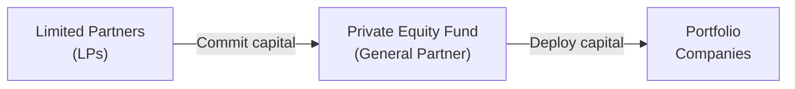
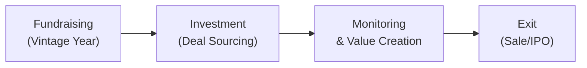

## 13.6 Overview of Private Markets

I remember the first time I chatted with a colleague who was investing in private equity. She spoke about these mysterious “LP” and “GP” structures, multi-year lockups, and the excitement (and nerves) of investing outside the public markets. Honestly, I was a little intimidated—maybe you feel that way, too?

Well, let's break it down together. Private markets basically refer to investing in non-publicly traded equities or debt instruments. These can be private equity buyouts, venture capital opportunities, private debt deals, or an entire range of alternative structures. While these investments can offer the potential for big-time returns, they also come with significant risks and complexities. So let's roll up our sleeves and explore how private markets work, why they're interesting, and what you need to watch out for.

## Defining Private Markets

Private markets primarily revolve around investments in companies or debt instruments that are not listed on public exchanges like the TSX or NYSE. Instead of buying shares through your regular broker from a public order book, you typically invest in a privately negotiated transaction. Picture shaking hands with company founders or specialized fund managers, rather than clicking a “buy” button online.

More formally, these markets encompass private equity (including buyouts, growth equity, and venture capital) and private debt (including mezzanine financing, direct lending, and other non-public debt instruments). Often, these opportunities are offered through limited partnerships, in which institutional investors, pensions, endowments, and high-net-worth individuals participate.

## Sub-Categories of Private Markets

Private markets aren’t a monolithic box. They’re more like a series of closely related boxes. Here’s a closer look at how these sub-categories may appear:

• Private Equity Buyouts: Often led by specialized buyout firms acquiring controlling stakes in mature or underperforming companies. The goal is to restructure, improve operations, and eventually sell or take the company public (IPO) for a profit.

• Growth Equity: Focuses on more established companies that have proven business models but need capital to scale. Investors typically purchase minority stakes, partnering with management to spur faster expansion.

• Venture Capital: A world unto itself, venture capital invests in early-stage and emerging companies. It’s a high-risk, high-reward environment where GPs (General Partners) seek potential unicorns—that is, the next wave of companies with billion-dollar valuations. Think about the small tech startup in a friend’s garage that suddenly becomes the next big software-as-a-service phenomenon.

• Mezzanine Financing: A hybrid of debt and equity, often used in buyouts and expansions. At its core, mezzanine financing is subordinated debt that can convert to equity or include equity-related rewards (like warrants). It’s typically riskier than senior secured debt but can also provide attractive returns.

• Direct Lending: Here, private debt funds issue loans directly to companies, often mid-market businesses that need capital for expansions, acquisitions, or refinancing. This bypasses traditional bank lending channels.

Each sub-category comes with its own unique risk-and-reward profile. Venture capital can yield astronomical returns if you pick the right tech startup, but the route to success is paved with countless failed ventures. Meanwhile, private equity buyouts and mezzanine deals often involve more predictable but still significant risk, particularly operational or financial risk. Direct lending may offer stable interest-like returns but can still be exposed to default or credit risk in tough markets.

## Key Features of Private Market Investments

So you might be asking: “Why bother investing in these private deals if they’re so risky and complicated?” Great question. Private markets have some distinctive features that can be both irresistible for some and unnerving for others:

• Longer Investment Horizons: When you invest in private markets, be prepared to stay put. You’re typically locking up your money for five to ten years (sometimes longer). If you’re not comfortable waving goodbye to your capital for that long, you might want to look elsewhere.

• Illiquidity: It’s not just a summer fling—this is a full-blown, committed relationship. Once you invest, you usually can’t just sell your stake at a moment’s notice. Exits come through M&A transactions, IPOs, or recapitalizations. The payoff, if it happens, could be substantial, but you’ll need the stomach for a relatively locked-up capital structure.

• Potentially Higher Returns: Private market investors hope for above-market returns, often arising from the ability to invest in undervalued or fast-growing companies before the public even sees them. If you get in early on the next big biotech or software firm, it can be game-changing. On the flip side, if the investment flops, your principal might go out the window.

• Greater Risk: Private markets can be risk magnets. Company financials might be opaque, monitoring can be tough, and success might depend heavily on the skill of the fund manager or on macro trends that blow the business plan off course. For instance, a leveraged buyout might fail if the new management can’t fix operational inefficiencies or if there’s an economic downturn.

## A Look at the Private Equity Fund Structure

A lot of private market investments are made through structured funds. Picture a funnel: many investors at the top, the fund manager in the middle, and the portfolio companies at the bottom.

Below is a simplified diagram (created using Mermaid.js) of how a private equity fund is typically set up:

• Limited Partners (LPs) are usually institutional investors, pension funds, endowments, high-net-worth individuals, or family offices. Their liability (and involvement in the day-to-day operation) is limited to the capital they’ve contributed.  
• The General Partner (GP) manages the fund, sources deals, makes investment decisions, and monitors the portfolio companies.  
• Portfolio companies are the businesses in which the fund invests—hopefully businesses with strong potential for growth or strategic transformation.

## Typical Life Cycle of a Private Equity Fund

Below is a simplified diagram illustrating the journey from setting up a fund to exiting investments:

1. Fundraising: The GP assembles commitments from LPs. The “vintage year” is the year the fund starts investing—an important marker for performance comparisons.  
2. Investment/Deal Sourcing: The GP identifies potential targets, conducts due diligence, negotiates terms, and closes the deal.  
3. Monitoring & Value Creation: The GP works closely with the management team to grow or stabilize the company. This might involve restructuring, cost-cutting, or new product lines that supercharge revenue.  
4. Exit: The final step is selling the portfolio company via a merger/acquisition, taking it public in an IPO, or selling to another private equity firm.  

Proceeds are then distributed to the LPs (and the GP), with some portion often reinvested in future funds or brand-new deals.

## Conducting Thorough Due Diligence and Manager Selection

Private markets aren’t for the faint of heart, so the importance of due diligence can’t really be overstated. In a sense, you're hiring the GP to select and manage these deals on your behalf. So you want to know: What’s the GP’s track record? Have they worked specifically in biotech, resource extraction, or consumer tech? Is there a strong alignment of interests (i.e., do they have skin in the game)?

• Track Record: Always dig into the manager’s historical results—both successes and failures. It’s not about just the good times. How have they navigated market downturns?  
• Industry Specialization: A GP with deep expertise in a specific sector often has an advantage in sourcing off-market deals and adding operational value.  
• Alignment of Interests: Typically, GPs also invest a decent chunk of their own money in the fund, ensuring they feel the same pinch if things go south.  
• Team Background: Senior team members’ resumes can be a window into the fund’s capabilities. Are they ex-CEOs, M&A lawyers, tried-and-true entrepreneurs? That can matter more than you might think.

Due diligence can also include looking at the manager’s operational approach: do they have a stable portfolio, or are they near the end of their investment period? Are they over-diversifying, or is the portfolio too concentrated in a single sector?

## Suitability and Risk Considerations

Because of the long lock-up periods and higher risk, private markets typically suit investors who can handle the possibility of losing capital (perhaps all of it) and are able to wait a while for a return. High-net-worth individuals and institutions (like pension funds) often allocate a certain portion of their portfolio—maybe 5% to 15%—toward private market investments for diversification and the possibility of enhanced returns.

But let’s face it: there are real risks here, including:

• Operational Risk: If the company’s management team stumbles, or if a sudden supply chain shock disrupts production, your investment may suffer.  
• Manager Risk: The GP might fail to identify quality deals or may overpay for the acquisitions. Experience and track record matter.  
• Market Risk: A global recession or monetary tightening can hamper even the best private equity strategies.  
• Liquidity Risk: Since you can’t easily sell private fund stakes, you might be stuck in an investment that’s underperforming, with limited options to pivot.  

Additionally, in Canada, there's a regulatory framework around private placements overseen by the Canadian Securities Administrators (CSA). Investors have to meet certain accreditation thresholds (like net worth or annual income) to be eligible to invest in private deals unless they fall under certain exemptions. You might want to check out the CSA website (https://www.securities-administrators.ca) to get more details. Also note that oversight for investment dealers in Canada is administered by the Canadian Investment Regulatory Organization (CIRO). CIRO became the national self-regulatory organization on January 1, 2023, replacing the prior entities (IIROC and MFDA) which are now defunct. 

If you’re curious about how these regulatory considerations apply to your own situation, or if you need guidance on safeguarding your capital, you can reference CIRO’s official resources at https://www.ciro.ca.

## Glossary

Here are a few terms that we keep referencing:

• General Partner (GP): The entity or “manager” that runs the day-to-day operations of a fund. They source deals, manage the portfolio, and earn a management fee plus a share of profits (carried interest).  
• Limited Partner (LP): The investors in the fund whose liability is limited to the amount of their capital commitment. They generally have no role in operational decisions.  
• Vintage Year: The year the private fund starts investing its capital. It’s used as a key metric to compare performance across funds; for example, a 2018 vintage fund might be compared to other 2018 vintage funds.  
• Mezzanine Financing: A hybrid instrument that lies between senior secured debt and common equity. It’s often used to finance expansions, buyouts, or recapitalizations and may include equity participation via warrants or conversion rights.

## Canadian Context and Beyond

While the fundamental structure of private markets tends to be similar across the globe, each jurisdiction has its own nuances. In Canada, for instance, the private equity and venture capital ecosystem has been steadily growing, with government programs sometimes providing co-investment. Organizations like the Canadian Venture Capital & Private Equity Association (CVCA) maintain market data, best practices, and networking opportunities for Canadian investors (https://www.cvca.ca). 

For a global perspective, you might also look at major markets like the United States and Europe, which often have larger, more developed private market ecosystems. Cross-border opportunities can be attractive, but they also boost the complexity around taxes, regulatory compliance, and exchange-rate risk. (For an in-depth look at international investing, refer to Chapter 14 of this text.)

## Practical Examples and Case Studies

Let’s say a private equity firm invests in a mid-size manufacturing business in Ontario that’s struggling with outdated equipment and distribution challenges. The GP injects capital, brings in a top-notch operations team, and revamps the distribution channels. Over five years, sales quadruple, profitability surges, and the firm is sold to a large industrial conglomerate. The LPs achieve a tidy, above-market return. This is your classic (and somewhat idealized) private equity scenario.

On the venture capital side, you might imagine a small Toronto-based startup that’s developing an AI-driven platform for the healthcare industry. A seed-stage venture capital fund invests early, guiding the founders through product development. There’s a chance the technology stumbles in pilot tests. Or it might take off, leading to a mega-round of financing from global VCs and, eventually, an IPO or acquisition. While success stories get all the headlines, many VC-backed companies fail to generate any return at all.

## Best Practices

1. Diversify: Even within private markets, consider diversifying across different funds, industries, or vintages.  
2. Perform In-Depth Due Diligence: If you’re investing directly, stay on top of the company’s strategy, management track record, and valuation. If you’re investing in a fund, assess the GP’s approach thoroughly.  
3. Consider the Global Picture: Macroeconomic factors (interest rates, GDP growth trends, currency fluctuations) can affect private market performance.  
4. Think About Liquidity Needs: If you might need your money in the next few years, perhaps put less into private markets. The longer your horizon, the more sense it might make.

## Common Pitfalls

• Overconfidence in Manager Reputation: Competent managers can also have losing streaks, especially if they venture outside their core expertise.  
• Underestimating Costs and Fees: Private equity funds often involve management fees, carried interest, and other associated costs.  
• Not Understanding the J-Curve: Early in a fund’s life, returns can be negative as capital is called but not yet returned. The performance is often “U”- or “J”-shaped as value is eventually realized.  
• Inadequate Legal or Tax Advice: Private markets can come with layers of legal intricacies and tax implications, especially for cross-border investments. If you’re operating in or outside Canada, a poor tax structure can eat away at those sweet returns.

## Regulatory and Legal Landscape

Because private market transactions are less transparent than public ones, securities regulators ensure that only qualified (often accredited) investors can invest in many of these deals. The logic is that well-capitalized and financially savvy investors can protect themselves if an investment fails. Canada’s main authority, the CSA, outlines the rules for private placements, including accredited investor exemptions and offering memorandum exemptions. Refer to the CSA website (https://www.securities-administrators.ca) for complete details.

Also, keep in mind that if you’re dealing with a registered investment dealer or advisor in Canada, they operate under the supervision of CIRO. If a dealer fails and client assets are at risk, the Canadian Investor Protection Fund (CIPF) may offer coverage. It’s always best to keep an eye on your provider’s registration status and the type of regulatory oversight they fall under.

## Additional Resources

Here are some recommended sources to help you dive deeper:

• CVCA (Canadian Venture Capital & Private Equity Association): https://www.cvca.ca  
• CSA Private Placement Exemptions: https://www.securities-administrators.ca  
• “Mastering Private Equity” by Claudia Zeisberger: A comprehensive textbook that explores everything from PE fund structure to advanced valuation methods.  
• Past chapters of this book—particularly Chapter 2 (risk assessment), Chapter 3 (asset allocation strategies), and others that put private markets into a broader portfolio context.

## Final Thoughts

Private markets can be an adventure. It’s like exploring a lesser-known corner of the financial world that can offer meaty returns if done well, but watch out—because it can also deliver some stinging losses. If you’re truly committed to a long-term horizon, can handle illiquidity, and can do your homework on finding the right managers, private markets might be a worthy addition to your portfolio. 

Ultimately, managing these investments requires careful planning, constant due diligence, and a healthy dose of patience. But for many investors—particularly institutional players or high-net-worth individuals—these strategies are part of a well-rounded investment approach. If you have the appetite for it, you might find that private markets give you a seat at the table of some of the most dynamic growth stories in business today.

----

## Test Your Knowledge: Private Markets Fundamentals



### Which of the following best describes a key advantage of participating in private equity investments?
- [ ] Absolute liquidity year-round
- [x] Potential for higher returns through undervalued or high-growth companies
- [ ] Full transparency in real-time
- [ ] Freedom from regulatory oversight

> **Explanation:** Private equity offers investors the chance to tap into undervalued or rapidly growing opportunities. However, it comes with high risk and restricted liquidity.

### Which statement best characterizes the role of General Partners (GPs) in a private equity fund?
- [x] They manage the fund and make investment decisions on behalf of the fund.
- [ ] They simply provide capital and enjoy limited liability.
- [ ] They have no involvement in operational decisions.
- [ ] They act as independent auditors of the fund.

> **Explanation:** GPs actively manage the private equity fund, source deals, and execute the investment strategy. Limited Partners (LPs) provide the capital, but have minimal involvement in management.

### Which scenario accurately illustrates what mezzanine financing might look like?
- [x] A business receives subordinated debt with attached warrants allowing conversion into equity.
- [ ] A system where start-ups exchange company product samples for equity capital.
- [ ] Government-subsidized loans for distressed rural businesses.
- [ ] Issuance of publicly traded bonds to institutional investors.

> **Explanation:** Mezzanine financing is typically a hybrid between senior debt and common equity. It often includes warrants or other equity components to enhance returns.

### A venture capital investor is usually focused on:
- [ ] Buying back shares from existing public investors.
- [x] Funding early-stage companies with high growth potential.
- [ ] Short-term lending to established corporations.
- [ ] Providing liquidity for public equity markets.

> **Explanation:** Venture capital often targets startups or early-stage tech-focused companies, offering funding in exchange for equity stakes.

### When discussing the “vintage year,” what does that term usually denote?
- [x] The year a private fund begins deploying capital into investments.
- [ ] The year a private fund completely liquidates its holdings.
- [x] A performance comparison benchmark among private funds.
- [ ] The date upon which dividend payments are first issued.

> **Explanation:** The vintage year helps identify when a fund starts its investment cycle and is used to compare performance relative to other funds of the same start date.

### Which factor contributes most significantly to illiquidity risk in private market investments?
- [x] Inability to trade fund interests on public exchanges.
- [ ] Daily mark-to-market pricing.
- [ ] Automated rebalancing mechanisms.
- [ ] Strict regulatory disclosure requirements.

> **Explanation:** Private market stakes cannot be sold or traded easily, so investors can’t quickly exit their positions.

### An investor analyzing a private equity manager should focus on:
- [x] The manager’s track record (including both successes and failures) and industry expertise.
- [ ] The manager’s ability to provide daily liquidity at par value.
- [x] The alignment of interests between the manager and investors.
- [ ] The manager’s option to buy or sell shares on the TSX.

> **Explanation:** Track record, specialization, and strong alignment of interests are crucial; daily liquidity or exchange listings aren’t typical features in private equity.

### Which of the following is a typical exit strategy for a private equity fund?
- [x] Selling the portfolio company to a strategic acquirer.
- [ ] Delisting the company from public exchange.
- [ ] Halting all distributions and bank transfers.
- [ ] Only paying interest on an ongoing basis indefinitely.

> **Explanation:** A common exit is through an M&A transaction, an IPO, or possibly a secondary buyout by another fund.

### Why might private equity buyouts be referred to as “leveraged” buyouts?
- [x] They often utilize a significant portion of debt financing in the acquisition.
- [ ] They rarely use any form of debt to finance the deal.
- [ ] They cannot incorporate mezzanine financing.
- [ ] They avoid using third-party capital.

> **Explanation:** Many buyouts involve a blend of equity from the private equity fund and a substantial amount of debt.

### True or False: The “Canadian Investment Regulatory Organization (CIRO)” oversees mutual fund dealers, investment dealers, and market integrity in Canada, replacing prior separate entities (IIROC, MFDA).
- [x] True
- [ ] False

> **Explanation:** On January 1, 2023, IIROC and MFDA combined to form CIRO, which now oversees dealers and market integrity on equity and debt marketplaces.


