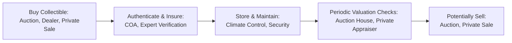

## 13.7 Overview of Collectibles

Some people fall in love with the rich tapestry of art, stamps, and coins—others connect with the roar of a classic car engine or the perfect swirl of vintage wine in a crystal glass. Collectibles can open the door to a vibrant, deeply personal world of investment. And sure, I’ll admit that I once got incredibly excited when I found a vintage hockey card from my childhood hero—only to realize two weeks later that it had a subtle tear, and I’d seriously overestimated its value (lesson learned!). Anyway, in this section, we’ll explore the fascinating realm where passion and investment converge. We’ll examine the different types of collectibles, the risks involved, the potential benefits, and some crucial best practices.

### Common Categories of Collectibles

Collectibles come in a dazzling array of categories, each with its unique community, valuation quirks, and resale channels. While this isn’t an exhaustive list, these are some of the big ones:

• Fine Art: Paintings, sculptures, and prints from renowned artists—think everything from Picasso to contemporary emerging talents.

• Classic Cars: Vintage automobiles, often from iconic manufacturers like Ferrari, Porsche, or Ford’s original Mustang line. Car shows, specialty auctions, and private collectors fuel demand.

• Rare Coins and Stamps: Numismatics (coins) and philately (stamps) are age-old fields with specialized grading systems and a global network of collectors.

• Antiques: Furniture, ceramics, jewelry, and historical artifacts that hold both cultural and monetary value.

• Wines and Spirits: Rare vintages, limited-edition releases, and age-worthy bottles that connoisseurs covet. Wine auctions, specialized cellars, and collector clubs punctuate this market.

• Luxury Watches: Iconic watch brands (e.g., Rolex, Patek Philippe, Audemars Piguet) with limited production runs and intricate craftsmanship. Many watch enthusiasts consider them wearable art.

• Sports Memorabilia: Trading cards, autographed jerseys, game-worn equipment from athletes—this interest has surged with digital platforms enabling wider trade and authentication.

• Other Collectibles: Comic books, Pokémon cards, rare books, vinyl records, and more. Honestly, if there’s a passionate community, there’s probably a collectibles market.

### Characteristics of Collectibles as Investments

Collectibles differ significantly from more conventional investments (like stocks or bonds), primarily because collectability is based on subjective demand. You might pay a fortune for a masterpiece if you love it, but demand could plummet if market tastes shift.

• Aesthetic and Personal Enjoyment: Many people collect because they genuinely love the item—its history, its beauty, or its story. The emotional factor is often as important as the financial potential.

• Subjective Pricing: You won’t find a well-established exchange or standardized ticker symbol for your vintage Warhol print. Instead, pricing typically hinges on factors such as rarity, condition, provenance, and market trends.

• Limited Liquidity: If you need to sell quickly, you may only have a few interested buyers—pushing you to accept a lower price. Auction houses, online marketplaces, and private sales are the primary channels, but transactions can be more time-consuming and unpredictable compared to, say, selling shares of a publicly traded company.

• Specialized Markets: Auction houses (like Canada’s Heffel Fine Art Auction House), dealers, private collectors, and dedicated conventions are usually the go-to places for trading. Each segment tends to have its own set of market norms and practices.

### Key Risks in Collectibles

Let’s face it: collectible investing can be fun and exhilarating, but it’s also riddled with potential pitfalls.

• Forgery and Counterfeit: Fakes abound, especially with high-value items like art, rare coins, and sports memorabilia. Even professional dealers occasionally get duped. Always demand authentication—look for official certificates (COAs) or recognized third-party verification. You might also want to consult databases like the Art Loss Register (https://www.artloss.com).

• Physical Storage and Insurance: Fine art requires climate-controlled conditions, wine needs cellaring, and classic cars crave secure garages. All that can be expensive. Insurance costs can also add up, especially if your item is highly valuable.

• Market Fluctuations: Collectibles often do well when the economy is booming and wealthy buyers are flush with disposable income. However, during a recession, demand can plummet. The cyclical nature of HNW (high-net-worth) spending is a key factor affecting collectibles’ value.

• Lack of Regulation, Minimal Investor Protection: Traditional investments in Canada are overseen by the Canadian Investment Regulatory Organization (CIRO). But when it comes to collectibles, such strict oversight typically doesn’t apply. The Canadian Investor Protection Fund (CIPF) covers certain securities in the event of a member firm insolvency, but it does not cover losses from a collectible that turns out to be counterfeit or worthless. Invest with caution.

• Expertise Barrier: Collectibles often require deep, specialized knowledge. A single oversight (like not recognizing a painting’s suspicious brushstroke pattern) can lead to financial loss.

### Potential Benefits and Rewards

While the above risks can be daunting, many collectors and investors happily venture into the collectible markets. Part of the allure is that intangible emotional “feel-good” component. Yet, there are also some objective financial reasons to consider collectibles:

• Portfolio Diversification: Collectibles often have a low correlation with traditional equity and debt markets. In theory, if your equity portfolio dips, your collectible art might remain stable—assuming art collectors still see value in your piece. It’s another dimension of diversification, albeit a niche one.

• Capital Appreciation: Some collectibles, especially those by famed artists or ultra-rare items, have seen impressive long-term value growth. A well-documented example is the explosion in the value of classic cars in recent decades, though recent market volatility has introduced new caution.

• Emotional Satisfaction: Let’s not forget that many people genuinely enjoy owning these items. There’s emotional or even sentimental value. This might sound like a small perk, but it can be a big deal for that near-priceless sense of personal fulfillment.

• Networking: Being part of collector communities—attending auctions, specialty fairs, and private showings—can open up opportunities to meet like-minded people and to glean insider insights. This can lead to discovering unique pieces at the right time or forging new friendships.

### Authentication, Provenance, and Auction Premiums

In the collectibles world, you’ll hear a few buzzwords over and over. Here’s a mini glossary of key terms:

• Provenance: The documented ownership history of an item. For instance, a painting’s provenance might include the artist who initially sold it, the galleries through which it passed, auction house records, and so on. Solid provenance can be the difference between a $500 print and a $500,000 original.

• Auction Premium: When purchasing an item at auction, you’ll pay the hammer price plus a buyer’s premium—often 10–25% (sometimes more). This premium covers the auction house’s expenses and services.

• Authenticity Certificate (COA): Used frequently in art and memorabilia, a COA attests to the genuineness of an item. But watch out: COAs can be forged. Reputable agencies or experts (e.g., recognized watchmakers for vintage watches or leading art experts) can provide stronger assurances.

### Diagram: Collectible Investment Cycle

Below you’ll find a simple flowchart representing a typical, high-level journey for collectible investors, from acquisition to eventual sale.

You’ll notice that valuation checks appear after storing and maintaining the item for a while. These checks might happen annually or less frequently, depending on market dynamics and the item’s popularity.

### Case Study: Vintage Wine

A friend of mine once purchased six bottles of a prestigious Bordeaux vintage. He stored them in a professional wine cellar—proper temperature, humidity, and all. Over the years, the wine’s value rose quite nicely, thanks to strong demand and favorable critic reviews. However, one day he decided to check an online marketplace. He discovered that forgeries of that exact same Bordeaux vintage were rising in frequency, leading to a swirl of doubt around authenticity. Collectors got jittery and began to question the legitimacy of many bottles on the market.

Eventually, before the rumor storm got even worse, he had his bottles re-authenticated by a wine expert and updated the cellar’s precise temperature logs (which some serious collectors like to see). He sold three of them at auction for a substantial profit. However, storage and appraisal fees ate into his returns. Even so, he remained happy because he simply adored the wine topic and enjoyed holding a “liquid asset” that appreciated. Moral of the story? Authenticity matters, and so does careful record-keeping.

### Storage, Maintenance, and Insurance Best Practices

When people think about investing in intangible assets like stocks or bonds, they rarely worry about storage or climate. But in the collectible realm, proper storage can make or break your item’s value.

• Climate Control: Paintings, vintage wines, and certain antiques can degrade quickly without the right temperature and humidity. Specialized facilities exist for each collectible category.

• Security: If you own high-value items, robust security systems and discreet storage locations are crucial to deterring theft.

• Insurance Policies: Regular homeowner’s insurance often won’t cover collectible items adequately. Seek specialized coverage that accounts for items’ appraised values.

• Documentation: Keep updated records of purchase, provenance, appraisals, photographs, and any restoration work performed. If you insure a painting, insurers may require a formal appraisal every few years.

### Regulatory Considerations in Canada

Although collectibles are not regulated investments in the same way that securities are, Canadian financial professionals still must comply with client disclosure and sales ethics set forth by CIRO. Historically, IIROC and the MFDA served as separate self-regulatory organizations, but they have been amalgamated into CIRO (https://www.ciro.ca). As of 2025, MFDA and IIROC are defunct, so references to them apply only to historical contexts. CIRO overall focuses on investment dealers and mutual fund dealers for publicly traded instruments, not collectible markets directly. Because CIPF protections do not extend to physical collectibles, it’s particularly important for investors to conduct thorough due diligence.

### Open-Source Tools and Additional Resources

If you’re considering venturing into collectibles, here are some resources to help you with due diligence:

• Heffel Fine Art Auction House (https://www.heffel.com): A leading Canadian auction house offering auctions, appraisal services, and insight into Canadian fine art.  
• Art Loss Register (https://www.artloss.com): The world’s largest private database of stolen art. Use this resource to help protect yourself from handling or buying stolen pieces.  
• “The Art of Investing in Art”: Several authors and auction house guides provide in-depth discussions on art markets, authentication processes, and case studies from the auction world.  
• Collector Groups and Forums: Many collectors gather online to discuss new finds, share authentication tips, or highlight potential scams.  
• Specialized Software: Some open-source software tools (like collection-management apps) can help you organize and track valuations, especially for coin and stamp collections.

### Practical Tips and Strategies

• Research, Research, Research: Learn the jargon, read about notable forgeries, attend fairs, and talk to experts.  
• Consider Hiring an Appraiser: For rare or high-value collectibles, professional appraisal is essential, especially if you plan to insure the item.  
• Budget for Maintenance and Storage: Don’t overlook the ongoing costs that accompany collectibles.  
• Keep Up with Trends: Tastes shift. If you noticed the NFT boom, you’ll recall how quickly entire markets can appear, surge, and sometimes fade. Keep your ear to the ground on what’s hot or not.  
• Diversify Reasonably: Don’t sink your entire nest egg in rare coins or vintage Ferrari parts. These markets can be slow-moving or highly volatile. Collectibles can be one piece of your overall portfolio puzzle (see Chapter 3 on Asset Allocation Strategies and Chapter 16 on Managing Investment Risk).

### Summary and Encouragement

In short, collectibles can be thrilling, potentially profitable, and deeply personal. Yes, they come with their share of complexities—from authenticating a vintage watch’s movement to ensuring wine is stored properly. But for those who love history, design, culture, or the thrill of hunting down rare finds, collectibles offer both aesthetic enjoyment and a chance at capital appreciation. If you’re ready to dip your toes in, start small, learn the ropes, join collector communities, and maintain prudent risk management. You just might discover a world of passion—and maybe even profit—in the process.

## Test Your Knowledge: Collectibles Investing Quiz



### 1. Which of the following is a key reason for the subjectivity in collectibles pricing?

- [ ] High liquidity in a regulated exchange.
- [x] Valuation hinges on rarity, condition, and market taste.
- [ ] Strong correlation with broad equity markets.
- [ ] Transparent electronic trading venues.

> **Explanation:** Collectible prices are significantly influenced by subjective factors, including item condition, rarity, and collector demand. There is no standardized exchange where prices are collectively established.

### 2. What is “provenance” in the context of collectibles?

- [ ] The standard measure of collectible liquidity.
- [ ] A type of auction premium on final bids.
- [x] The documented ownership history of an item.
- [ ] A certification linking the collectibles market to CIPF.

> **Explanation:** Provenance refers to the recorded history of an item’s ownership, which is crucial for establishing authenticity and value.

### 3. Which organization oversees investment dealers and mutual fund dealers in Canada as of 2025?

- [x] The Canadian Investment Regulatory Organization (CIRO).
- [ ] IIROC (Investment Industry Regulatory Organization of Canada).
- [ ] MFDA (Mutual Fund Dealers Association of Canada).
- [ ] The Canadian Investor Protection Fund (CIPF).

> **Explanation:** After the amalgamation of IIROC and MFDA, CIRO now serves as Canada’s national self-regulatory organization. IIROC and MFDA exist only historically.

### 4. Classic cars, rare coins, fine art, and vintage wines are examples of:

- [ ] Conventional industrial commodities.
- [ ] Short-term debt instruments.
- [ ] Regulated equity securities.
- [x] Collectibles.

> **Explanation:** All of these items—classic cars, rare coins, fine art, and vintage wines—are categorized as collectibles.

### 5. Which of the following is NOT a typical risk associated with collectible investing?

- [ ] Physical theft or damage.
- [ ] High insurance and storage costs.
- [x] Guaranteed returns backed by CIPF.
- [ ] Market fluctuations tied to economic cycles.

> **Explanation:** CIPF covers certain markets for securities, not collectibles. Collectibles do not come with guaranteed returns.

### 6. Why is an Authenticity Certificate (COA) important?

- [x] It verifies that a collectible is genuine.
- [ ] It prevents any possibility of theft.
- [ ] It replaces the need for insurance.
- [ ] It eliminates the need for provenance.

> **Explanation:** A COA attests to an item’s authenticity but does not replace due diligence such as provenance checks or insurance considerations.

### 7. Which of the following best addresses the issue of forgery in art?

- [ ] Storing it in a climate-controlled facility.
- [x] Consulting reputable experts and checking stolen art databases.
- [ ] Relying solely on the seller’s claims.
- [ ] Skipping provenance and COA verification.

> **Explanation:** Expert checks, along with resources like the Art Loss Register, reduce the risk of buying a forged or stolen piece.

### 8. How can collectibles serve as a diversification tool in a portfolio?

- [ ] They always move in tandem with equities.
- [ ] They are part of a government-backed guarantee scheme.
- [x] They may have low correlation with traditional asset classes.
- [ ] They can be sold instantly on regulated exchanges.

> **Explanation:** Many collectibles do not necessarily follow stock or bond market trends, so they can add diversification benefits if held alongside more conventional assets.

### 9. One of the biggest ongoing costs of owning collectibles is:

- [ ] Corporate dividends.
- [ ] High interest rates set by the Bank of Canada.
- [x] Storage and insurance.
- [ ] CIPF premiums on the collectible’s value.

> **Explanation:** Whether you own fine art, wine, or classic cars, ensuring they are properly stored and insured typically involves significant expenditure.

### 10. True or False: CIPF provides coverage to investors of physical collectibles against loss if the dealer becomes insolvent.

- [ ] True
- [x] False

> **Explanation:** CIPF protects clients of member firms for certain securities and cash in the event of the firm’s insolvency. It does not extend coverage to physical collectibles like art or bottles of fine wine.


