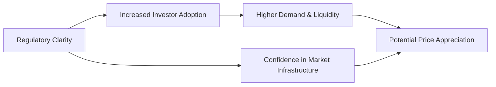

## 13.8 Overview of Digital Assets

Digital assets can seem, well, a little mysterious. You’ve probably seen the headlines about Bitcoin millionaires or heard someone in your circle excitedly describing how they can send money across the globe in mere seconds. Don’t worry if it all feels complicated—you're not alone. In this section, we’ll break down the building blocks of digital assets in a slightly informal way, share a few personal anecdotes, and highlight key insights. Our hope is that by the end, you’ll feel way more comfortable discussing digital assets with clients, evaluating their place in a portfolio, and understanding the relevant regulations in Canada.

## What Are Digital Assets?

Digital assets refer to electronic representations of value that use cryptography, distributed ledger technology (like blockchain), or other means to secure their creation, transactions, or ownership. In simpler terms: they’re virtual tokens or coins, often built on special online networks, that can be transferred from one person to another without always relying on a central authority—like a bank.

Common forms of digital assets include:

• Cryptocurrencies (Bitcoin, Ether, and innumerable altcoins)  
• Stablecoins pegged to fiat currencies or commodities  
• Security Tokens, often representing ownership in real-world assets  
• Tokenized real estate or collectibles on blockchain networks  

Digital assets typically live on blockchains—shared online ledgers that record all transactions securely and transparently (at least in theory). Although the market changes quickly, a few underlying principles persist: decentralization, cryptographic security, and relatively transparent record-keeping.

## Key Drivers of Digital Asset Adoption

Let’s talk about why digital assets have garnered so much attention.

• Regulatory Environment: Regulations can either boost confidence (by offering clarity) or create uncertainty (if the rules are vague). In Canada, the Canadian Investment Regulatory Organization (CIRO) has been working toward clearer guidelines for crypto asset dealers. The Canadian Securities Administrators (CSA) also publishes Staff Notices to guide market participants.  
• Investor Adoption: As more people invest, trade, and use digital assets, liquidity and acceptance grow. Big names—think major banks or corporations—have started exploring and even embracing crypto solutions, adding to mainstream acceptance.  
• Network Utility: For blockchains like Ethereum, the more developers build useful applications, the more demand there can be for their native tokens. This can affect prices and investor interest.  
• Macroeconomic Influences: Low interest rates or inflation concerns can drive interest in bitcoin or other cryptocurrencies viewed as “store-of-value” assets—though this perspective can fluctuate. Central bank policies sometimes affect investor decisions to hedge or speculate on digital assets.

We can visualize these drivers in a simple diagram:

**Explanation:** As regulatory clarity (A) increases, investor adoption (B) might rise. More foothold in the mainstream can lead to higher demand (C) and more confidence (D), which may drive prices up (E). Of course, in reality, markets are messy—they don’t follow a neat chart 100% of the time. But this can help conceptualize the general flow.

## Potential Benefits in a Portfolio

Alright, so why might investment managers consider digital assets in a portfolio? Let’s see:

• High-Growth Potential: Bitcoin, Ether, and other digital assets can experience massive price surges—though there’s a flip side to that (volatility!). Some investors see it as an opportunity to capture high returns, albeit with high risk.  
• Diversification: Some digital assets have shown relatively low correlations with bonds or equities—at least at certain times. However, this correlation can suddenly swing. In a perfect scenario, if one asset class goes down, another (like a particular cryptocurrency) might remain steady or even climb.  
• 24/7 Borderless Trading: Unlike the stock market that sleeps on weekends and holidays, digital asset markets never close. They also allow near-instant cross-border transfers with minimal fees, which can be enticing for global investors.  
• Fractional Ownership: Instead of having to buy one whole bitcoin (which could cost tens of thousands of dollars), you can buy a fraction, making it more accessible to a wider retail audience.  

I remember my first dabble: a weekend, 11 p.m., and I decided—on a whim—to buy a sliver of Ether. It felt surreal to trade outside typical market hours, though it also meant I had to watch my phone at odd times to keep up.

## Risks and Considerations

Before you load up your digital wallets, let’s be blunt: digital assets aren’t all rainbows.

• Extreme Volatility: Prices can spike or plummet within hours or even minutes. Managing client expectations becomes crucial.  
• Regulatory Uncertainty: While Canada is progressively providing guidelines, the global nature of crypto means rules vary widely from one jurisdiction to another. Keeping up with compliance can be a headache.  
• Security and Custody Issues: Private key management is paramount. If someone hacks your wallet or you lose your private key, you might lose your assets permanently. Institutional custodians exist but come with their own fees and complexities.  
• Technology Infrastructure: A reliance on blockchain networks means if the network becomes congested or compromised, asset liquidity and security might be affected. Smart contract bugs can also lead to losses.

### Example of a Security Breach

One high-profile example is the story of exchange hacks. Several cryptocurrency exchanges have suffered security breaches over the years, resulting in stolen funds. If these exchanges do not have robust internal controls or insurance, clients can bear the brunt. That, in turn, underscores the importance of robust due diligence when choosing platforms for trading or custody solutions.

## Types of Digital Assets

### Cryptocurrencies
These are the best-known digital assets, often used to facilitate peer-to-peer payments or as a store of value. Bitcoin (BTC) is the granddaddy, launched in 2009, while Ethereum (ETH) introduced the concept of smart contracts. Others, like Litecoin, try to offer faster transactions or different consensus mechanisms.

### Stablecoins
Stablecoins aim to maintain a stable value by pegging themselves to a reserve of fiat currency, precious metals, or other assets. For instance, a USD-backed stablecoin holds 1:1 reserves in U.S. dollars so that each token equals one dollar. These are popular for trading, as they reduce the risk of huge price swings. However, the viability of a given stablecoin depends on the issuer’s transparency and reserves.

### Security Tokens
Security tokens represent traditional securities (like shares, bonds, or ownership in real estate) but in tokenized form. They’re issued in compliance with securities regulations—like an STO (Security Token Offering). These are particularly relevant in jurisdictions (including Canada) that recognize tokens as securities under certain conditions. The technology potentially reduces administrative overhead and allows fractional ownership, but compliance demands remain high.

### Other Tokenized Assets
In the future, you might see tokenized versions of everything from carbon credits to fine art. Tokenization can improve liquidity in traditionally illiquid markets. However, credit risk, technology risk, and a lack of mainstream adoption can hamper investor confidence.

## Regulatory Landscape in Canada

Since January 1, 2023, the Canadian Investment Regulatory Organization (CIRO) oversees investment dealers, mutual fund dealers, and market integrity. Any references to the separate MFDA or IIROC are historical. For crypto-specific guidance, you can check out:

• [CIRO](https://www.ciro.ca) resources and announcements regarding crypto asset dealer membership requirements  
• [CSA Staff Notices on Cryptocurrency](https://www.securities-administrators.ca)  

Additionally, the Canadian Investor Protection Fund (CIPF) remains the sole investor protection fund for Canadian investors after merging with the MFDA IPC in 2023. However, CIPF protection typically covers assets held by a member firm—digital assets in private wallets may be outside CIPF’s purview, so it’s vital to check the coverage details.

### Cross-Reference with Other Chapters

• Chapter 2: Understanding a Client’s Risk Profile – Digital assets can be more volatile and may require thorough risk tolerance questionnaires (plus additional questions around tech comfort).  
• Chapter 3: Asset Allocation – If you’re integrating cryptocurrencies or other digital assets, consider the correlation with other asset classes and rebalancing strategies.  
• Chapter 14: International Investing – Digital assets are inherently global. As you look at cross-border transactions, watch for foreign regulations, currency exposures, and tax implications.  
• Chapter 15: International Taxation – Transactions in digital assets can trigger complex cross-border tax obligations.  
• Chapter 16: Managing Your Client’s Investment Risk – Tools like options or futures might be used to hedge certain crypto exposures, though these are specialized and not available for all tokens.  

## Storing and Safeguarding Digital Assets

### Private Keys and Wallets
Your private key unlocks your crypto. Lose it, and you lose your coins—forever. That’s why many investors use “cold storage” (offline) hardware wallets or rely on custodial solutions offered by regulated institutions. However, convenience often trades off with direct control; letting a third party store your assets can reduce your direct risk of mishandling private keys, but it introduces counterparty risk.

### Smart Contract Risks
For assets on networks like Ethereum, tokens are controlled by smart contracts—pieces of code that automatically execute transactions under certain conditions. Bugs in these contracts can lead to vulnerabilities, exploited by hackers to drain funds. Thorough audits and risk assessments are essential.

## Keys to Including Digital Assets in a Portfolio

• Start Small: Many advisors recommend a small allocation (say 1%–5%) to manage volatility.  
• Risk Mapping: Understand how digital assets fit into the broader risk budget of your client’s portfolio.  
• Liquidity Management: Markets never sleep, but liquidity can still evaporate if prices crash.  
• Education: Clients (and advisors) should understand the technology, the regulatory environment, and the pitfalls before committing funds.

## Practical Example: Balancing Risk & Reward

Suppose you have a client, Sarah, who wants exposure to “the next big thing” but hesitates about volatility. After assessing her risk profile (Chapter 2) and overall portfolio strategy (Chapter 3), you might propose a 3% allocation in Bitcoin or an ETF that tracks a digital asset index. Sarah’s portfolio is diversified across equities, bonds, and alternative investments—so the incremental risk is manageable. You’d also explain that she needs to:

1. Keep an eye on that wallet or the ETF’s performance regularly.  
2. Consider the technology risk.  
3. Understand that crypto regulation is evolving.  

It’s all about setting realistic expectations.  

## Glossary

• **Blockchain:** A distributed ledger technology enabling secure and transparent record-keeping. Data is stored in “blocks,” each cryptographically linked to the previous one, forming a “chain.”  
• **Security Token Offering (STO):** An offering where digital tokens are classified as securities under applicable regulations, often granting rights like dividends or voting.  
• **Stablecoin:** A digital asset pegged to a fiat currency or commodity to reduce volatility. Examples include USDC, USDT, and others.  
• **Private Key:** Confidential data that allows the holder to control and manage digital assets held in a crypto wallet.  

## Additional Resources

• [CSA Staff Notices on Cryptocurrency Regulations](https://www.securities-administrators.ca)  
• [CIRO](https://www.ciro.ca) – For the latest Canadian compliance updates  
• “Mastering Bitcoin” by Andreas M. Antonopoulos – Offers an in-depth technical overview of Bitcoin and blockchain fundamentals  
• Open-Source Tools – Many exist for portfolio tracking, on-chain analysis, and multi-signature wallets (e.g., Electrum, Gnosis Safe)

If you’re itching for more detail on blockchain’s nuts and bolts, you might check out developer-focused communities on GitHub or join global hackathons that revolve around decentralized finance (DeFi). While those can get hyper-technical, they’re often a goldmine of innovative ideas.

## Conclusion

Anyway, that’s the big picture of digital assets. They offer the promise—or perhaps we should say the “possibility”—of high returns, new ways of transferring value, and interesting diversification properties. Yet they also bring high volatility, evolving regulations, and technological complexity. If we keep an open mind, keep learning, and keep a steady hand on risk management, digital assets can become a meaningful part of an investment portfolio. 

It’s an emerging field, so continuous education is key. Remember: This portion of the investment world literally changes every day, so always stay updated with the latest guidance from CIRO, the CSA, and relevant authorities worldwide.  

-----

## Test Your Knowledge: Overview of Digital Assets



### Which of the following best defines a blockchain?

- [ ] A centralized database controlled solely by a national bank
- [x] A shared ledger of transactions distributed across a network of computers
- [ ] A physical book of transactions maintained at a single location
- [ ] A specialized social media platform for traders

> **Explanation:** Blockchain is a distributed ledger technology shared across multiple computers, ensuring security and transparency.

### What is a key characteristic that makes stablecoins different from other cryptocurrencies?

- [ ] They are only mined by large institutions
- [ ] They are intangible and cannot be traded
- [x] They aim to maintain a stable value by pegging to an underlying asset
- [ ] They have no real-world utility

> **Explanation:** Stablecoins attempt to keep their price consistent, typically pegged to a fiat currency or commodity.

### Which of the following is an accurate statement about the Canadian Investor Protection Fund (CIPF) and digital assets?

- [ ] CIPF automatically covers all digital assets stored in self-custody wallets
- [x] CIPF typically covers assets held by a CIRO member firm but not necessarily personal crypto wallets
- [ ] CIPF is irrelevant after the new SRO replacement
- [ ] CIPF only covers stablecoins

> **Explanation:** CIPF covers client assets if a CIRO member firm becomes insolvent, but it does not extend to privately held digital assets in a personal wallet.

### One significant risk for digital assets is:

- [ ] Guaranteed zero volatility
- [ ] Automatic regulatory compliance for all tokens
- [x] Possibility of hacking or fraud due to technological vulnerabilities
- [ ] Guaranteed immunity from macroeconomic influences

> **Explanation:** Digital assets can be subject to hacking or fraud due to smart contract or exchange vulnerabilities.

### Which factor often contributes to the high volatility of digital assets?

- [ ] Complete immunity from speculation
- [x] Rapid changes in speculative demand and market sentiment
- [ ] Stable and predictable global regulation
- [ ] Guaranteed government backing

> **Explanation:** Market sentiment shifts, speculative buying or selling, and abrupt regulatory changes can drive large price swings.

### In terms of portfolio management, digital assets can:

- [x] Potentially offer diversification when correlations are low
- [ ] Have zero correlation with all other asset classes at all times
- [ ] Eliminate the risk of portfolio drawdown
- [ ] Prevent technological outages

> **Explanation:** Digital assets can sometimes exhibit low correlation with traditional asset classes, offering diversification, although correlations shift.

### When considering a security token offering (STO):

- [x] The token is classified as a security and must comply with relevant securities regulations
- [ ] The token has no underlying asset or regulatory framework
- [x] Fractional ownership of assets can be facilitated through tokenization
- [ ] It is mandatory to only use Bitcoin for payments

> **Explanation:** An STO is subject to securities laws and can allow fractional ownership of real-world assets.

### How might an investor mitigate the risk of losing digital assets due to lost private keys?

- [ ] Only using unsecured public Wi-Fi to store private keys
- [ ] Storing private keys in every social media account
- [x] Utilizing secure custody solutions or hardware wallets for safe storage
- [ ] Sending private keys via email to a friend

> **Explanation:** Protecting private keys with a hardware wallet or a reliable custodial service is crucial to mitigate risk.

### According to Canadian regulations, digital asset dealers:

- [x] May require membership with CIRO, ensuring adherence to standards and guidelines
- [ ] Are not subject to any oversight
- [ ] Can never operate legally in Canada
- [ ] Are fully protected by CIPF even outside of member dealers

> **Explanation:** CIRO membership can be required for firms dealing in digital assets, reflecting Canada’s evolving regulatory framework.

### True or False: Digital assets always operate outside the influence of macroeconomic factors such as interest rates and monetary policy.

- [x] True
- [ ] False

> **Explanation:** While some holders treat digital assets as a hedge against inflation or currency risk, market sentiment can correlate to broader economic policy shifts. In practice, digital asset prices can still be influenced (positively or negatively) by macroeconomic conditions.


