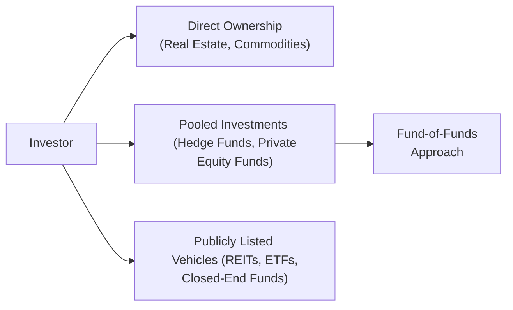

## 13.9 Ways to Invest in Alternative Investments

There’s something almost magical about alternative investments. They can seem elusive—like that intriguing recipe your favorite chef won’t fully share. But once you understand how to approach them, they can add exciting dimensions to a portfolio, often going beyond the usual stocks and bonds. In this section, we’ll explore the major ways to invest in alternative assets, such as infrastructure projects, real estate, commodities, private equity, hedge funds, and more. We’ll also look at some real-life tales, best practices, and even a few pitfalls you might want to avoid.

Before we get started, let me share a personal story that actually changed the way I think about “alternatives.” When I was younger, I spent some time helping a family friend who ran a small vineyard in the Okanagan Valley. That was my first up-close encounter with a “direct ownership” stake in an alternative asset. It was a dream, but also a lot of work—cultivating grapevines is labor-intensive, and the success depends on climate, soil conditions, and the market for wine. But guess what? When it works, it can be very rewarding (literally in the form of delicious wine). That experience taught me that while alternatives can offer something different, they require skill, diligence, and sometimes a little luck. Let’s explore.

---

### Understanding the Range of Alternative Investment Structures

When we talk about alternative investments, we’re talking about real estate, infrastructure, private equity, hedge funds, commodities, collectibles, digital assets, and a whole batch of other possibilities. Each of these carries a unique risk-return profile that can potentially complement traditional portfolios.

The ways to invest can generally be broken down into three broad routes:

• Direct Ownership (buying something and holding it straight away)  
• Pooled Vehicles (e.g., hedge funds, private equity funds, or real estate investment trusts)  
• Various hybrid or bespoke structures (like fund-of-funds).

The diagram below provides a high-level visual overview of some of the main structures for alternative investing:

Think of these like different roads that eventually lead to your goal of “alternative exposure.” Each path has its own twists, turns, cost implications, and set of complexities.

---

### Direct Ownership vs. Pooled Investment

When you choose direct ownership, you’re simply buying the asset itself. Maybe you purchase farmland or a small gold mine in Northern Ontario. The point is: you call the shots. You don’t rely on a manager or a complex structure to do the heavy lifting. The good news is that you get complete control (within regulatory bounds, of course). The bad news: you’re also on the hook for day-to-day decisions about the asset, plus you might face significant liquidity constraints. If you want to exit farmland or a gold mine, you’ll have to find a buyer—for farmland, that can be easier said than done if the buyer pool is small.

Pooled capital solutions—like hedge funds or private equity funds—are an alternative to direct ownership. You contribute money to a professional manager or a professional group. They do the heavy lifting, from sourcing deals to negotiating terms and implementing strategic changes. Usually, the idea is that a top-tier manager might outperform or unearth the next big success story. The trade-off? You’re typically paying substantial fees, you might have limited redemption windows, and you have less control over the specific assets being purchased.

---

### Publicly Listed Vehicles

Some alternatives, such as real estate or infrastructure, can also be accessed through publicly listed vehicles. Examples include:

• Real Estate Investment Trusts (REITs)  
• Infrastructure ETFs  
• Listed Closed-End Funds  

These structures provide the benefits of daily liquidity (most of the time), regulatory oversight, and relative ease of entry. If you’re eyeing exposure to alternative assets but don’t want to tie your capital up for years on end, publicly listed structures might offer a more flexible route.

However, remember that liquidity can sometimes be a double-edged sword. Publicly traded assets are exposed to broader market sentiment. A REIT’s share price can drop due to interest-rate spikes or negative headlines, even if its portfolio of skyscrapers is still performing decently.

---

### Fund-of-Funds Approaches

If you’re unsure about picking one hedge fund or private equity fund, or you just don’t have the time or expertise, a fund-of-funds approach might be the solution. In a fund-of-funds, you invest in one overarching “master” fund. That fund is responsible for allocating your money across multiple underlying funds. This can provide diversification across strategies (long/short equity, global macro, distressed debt, etc.) and managers, which, in theory, reduces single-manager risk.

But there is a catch. Fund-of-funds come with an extra layer of fees—on top of the underlying manager fees, you’re also paying the fund-of-funds manager. So, watch your net returns. Understand whether the added diversification or manager selection skill is worth the cost.

---

### Know Your Client's Investment Objectives

Now, a quick word on compliance. In Canada, we have the Canadian Investment Regulatory Organization (CIRO) overseeing the conduct of investment dealers and mutual fund dealers. CIRO is fairly strict about ensuring advisors truly “know their client,” which includes understanding the client’s investment objectives, risk tolerance, time horizon, net worth, incomes, and more. Remember that alternative assets are often illiquid and might demand a decade-long commitment—like private equity or certain real estate developments—so you want to be sure you, or your client, can tie up that capital without regret. 

If you’re an advisor, ensure your client is fully aware of the complexities and potential issues: from liquidity gates (where the fund managers restrict withdrawals to preserve capital) to subscription documents that detail thick sets of legal and operational terms.

---

### Evaluating Cost Implications

Fees can be tricky. To highlight a few:

• Management Fees and Performance/Incentive Fees: Many hedge funds charge a “2 and 20,” meaning 2% annual management and 20% of profits over a benchmark or hurdle rate. Private equity funds often charge something in a similar range.  
• Brokerage Fees and Load Fees: Some mutual funds or alternative mutual fund structures might impose a load fee or redemption fee.  
• Transaction Costs: Direct ownership might carry big transaction costs, such as legal fees or property taxes.  

Making sense of these fees is vital because your net return can be meaningfully eroded by them. If the underlying asset or manager aims for a 15% annual return, but you’re losing 5–6% to fees and other costs, your net takeaway might only be around 9–10%, and that’s before taxes.

---

### Consider Operational Complexities

Alternative assets sometimes have subscription windows—meaning you can only invest (or redeem) at certain times. A typical hedge fund might offer quarterly or even annual liquidity. Private equity funds usually lock up your capital for several years, with capital calls happening over time. If you have unexpected personal liquidity needs, alternatives can be tricky. 

Another operational concern is the complexity of documentation—from big private placement memorandums (PPMs) to subscription forms and redemption requests. Plus, the minimum investment size can be quite large. Many institutional private equity funds demand commitments of $5 million or more. Retail-accessible alternatives (like publicly listed REITs) have much smaller minimums but also come with other trade-offs, such as increased correlation with public markets.

---

### Additional Practical Considerations

It’s important to do your homework. For publicly listed alternatives, resources like SEDAR+ ([https://www.sedarplus.ca](https://www.sedarplus.ca)) offer access to prospectuses, financial disclosures, and management commentary. By reviewing these documents, you can see how the fund manager invests, the fund’s performance track record, and the specific fee structure. For historical references, the predecessor organizations to CIRO—namely MFDA and IIROC—no longer operate as separate self-regulatory organizations. Now, all relevant oversight information is consolidated under CIRO’s umbrella. 

Also, check out the Canadian Securities Administrators (CSA) for guidelines and updates on alternative fund regulation. Although “alternatives” used to be the Wild West, nowadays you’ll find more robust rules about how these products can be marketed and sold to retail clients in Canada.

---

### A Quick Glossary

• **Direct Ownership:** Buying and managing the asset directly (e.g., farmland, real estate, commodities). You have full control but also full responsibility.  
• **Fund-of-Funds:** A fundraising vehicle that invests in multiple underlying funds, offering diversification under one umbrella while charging an additional layer of fees.  
• **Liquidity Gate:** A fund manager’s right to temporarily limit or pause redemptions if too many investors want their money back at the same time—or if the manager feels it’s in the best interest of all investors to preserve the fund’s assets.  

---

### Practical Examples and Case Studies

Let’s illustrate a couple of scenarios:

1. **Case Study: Kelly’s Real Estate Ladder**  
   Kelly has $500,000 to invest and wants some exposure to real estate. She decides to split her money into two parts. The first part ($300,000) is used to buy a direct stake in a small apartment building with a group of friends. It’s direct ownership—they pool their money, hire a manager, and operate the building themselves. The second part ($200,000) is used to buy units in a publicly listed REIT that focuses on industrial warehouses. The direct ownership piece is illiquid, with the potential for big gains if they manage the property well. The REIT portion, on the other hand, is easy to buy or sell on the open market, though it’s exposed to daily fluctuations.

2. **Case Study: The Hedge Fund Balancing Act**  
   Samuel invests $1 million in a hedge fund employing a long/short equity strategy. The manager charges a 1.5% management fee and 20% performance fee on profits above a 5% hurdle. Samuel also invests $500,000 in a fund-of-funds that allocates across five different hedge funds, each with different strategies (global macro, long/short credit, activism, etc.). The second approach offers broader diversification, but layering on the fund-of-funds’ fee means Samuel is effectively paying two sets of fees. Over a 5-year horizon, the added safety and manager expertise might be worth it, but the total net returns could be lower than if he had chosen a single-manager fund with outstanding performance.

---

### Key Takeaways and Good Practices

• **Match Liquidity with Needs**: Don’t lock up money in a 10-year private equity fund if you might need it next year.  
• **Watch the Fees**: Alternatives can be fee-heavy; ensure the net return is worthwhile.  
• **Do Thorough Due Diligence**: Whether you’re analyzing a vineyard or a hedge fund, spend time understanding its unique risk factors.  
• **Check Your Risk Tolerance**: Alternatives often carry a high risk-return profile.  
• **Explore Diversification**: Consider mixing direct ownership with pooled vehicles or fund-of-funds to spread risk.  

---

### References for Further Exploration

• **SEDAR+**: [https://www.sedarplus.ca](https://www.sedarplus.ca) — Access provider filings, prospectuses, and financial statements for publicly traded alternative vehicles.  
• **CIRO**: [https://www.ciro.ca](https://www.ciro.ca) — Canada’s principal self-regulatory organization for investment dealers, including guidelines on marketing and selling alternative products.  
• **CSA**: [https://www.securities-administrators.ca](https://www.securities-administrators.ca) — Canadian Securities Administrators for rules concerning public offerings and alternative investment disclosures.  

---

### Recommended Reading

A useful book to complement your knowledge is “Investment Management for Insurers” by David F. Babbel et al. Even though it’s primarily focused on insurance companies, the chapters on non-traditional and alternative asset classes are super informative. They highlight how large institutional players make allocation decisions around these products, which can inspire insights into your own or your clients’ portfolios.

---

## Test Your Knowledge: Alternative Investments and Access Methods



### Which of the following statements best describes direct ownership of alternative investments?

- [ ] It involves buying shares in a publicly traded REIT.
- [ ] It refers to investing in a fund-of-funds.
- [x] It’s where an investor purchases and manages the asset (like real estate) directly.
- [ ] It’s limited to listed infrastructure ETFs.

> **Explanation:** Direct ownership means you have the deed or title to the asset itself. It involves dealing with all aspects of the investment, from paperwork to ongoing management.

### What is a potential disadvantage of investing in a private equity fund?

- [ ] Liquidity is immediate and daily.
- [x] Funds can lock up capital for several years (long lock-up periods).
- [ ] They typically have no management fees.
- [ ] Redemption windows are open every week.

> **Explanation:** Private equity funds generally require multi-year commitments, during which your capital is illiquid. This can be challenging if you need to access funds quickly.

### Why might an investor choose a publicly listed vehicle like a REIT over direct ownership of a property?

- [ ] Because directly owning property always leads to zero returns.
- [ ] Because REITs do not follow stock market fluctuations at all.
- [ ] Because REITs are only accessible to institutional investors.
- [x] Because REIT shares typically offer liquidity and easier entry/exit points.

> **Explanation:** Publicly listed vehicles such as REITs typically trade on an exchange, offering daily liquidity and lower minimum purchase requirements compared to direct ownership.

### What is a critical consideration for investors exploring fund-of-funds?

- [ ] There is never any diversification benefit.
- [ ] No minimum investment is ever required.
- [ ] The fund-of-funds always charges zero fees.
- [x] The extra layer of fees on top of the underlying fund manager fees can reduce net returns.

> **Explanation:** A fund-of-funds structure can add an additional fee layer, which can significantly impact the overall returns that eventually flow to investors.

### Which of the following best explains a “liquidity gate” in hedge funds?

- [ ] Providing unlimited liquidity to investors at any time.
- [ ] Guaranteeing daily redemption whenever needed.
- [x] Limiting or deferring investor redemptions to protect remaining investors or the fund.
- [ ] A gate that locks investors in for 30+ years automatically.

> **Explanation:** A liquidity gate lets the manager temporarily restrict redemptions, often to prevent a “run on the fund” that could force asset fire-sales.

### How might high management and performance fees negatively affect a hedge fund investor’s realized returns?

- [x] By reducing the investor’s net performance after fees and incentives are paid out.
- [ ] By making the value of the fund’s holdings automatically go to zero.
- [ ] By eliminating exposure to global markets entirely.
- [ ] By transferring all risk to the fund’s manager.

> **Explanation:** Even if a hedge fund performs well, management and incentive fees can eat significantly into the investor’s overall return.

### What is one advantage of direct ownership?

- [x] The investor retains full control over the asset’s management decisions.
- [ ] It automatically diversifies across multiple sectors.
- [x] It can offer unique tax benefits in some situations.
- [ ] It is always cheaper than any pooled vehicle.

> **Explanation:** Direct ownership can deliver total control over the asset and may provide certain tax benefits, depending on local laws. However, it may not always be cheaper and does not inherently diversify across multiple assets.

### Where might you access regulatory disclosures and financial statements of a Canadian-listed alternative investment vehicle?

- [x] SEDAR+ (System for Electronic Document Analysis and Retrieval Plus).
- [ ] Personal finance blogs.
- [ ] Unsanctioned stock forums.
- [ ] The defunct IIROC website.

> **Explanation:** SEDAR+ is the designated platform for company filings in Canada, including prospectuses and financial statements for publicly traded alternative funds or vehicles.

### Which organization is currently responsible for overseeing investment dealers and mutual fund dealers in Canada?

- [ ] MFDA
- [ ] IIROC
- [ ] CIPF
- [x] CIRO

> **Explanation:** Following the amalgamation of MFDA and IIROC, CIRO is now Canada’s self-regulatory organization for investment dealers and mutual fund dealers, effective June 1, 2023.

### True or False: A fund-of-funds can provide immediate daily liquidity despite investing in illiquid assets.

- [x] True
- [ ] False

> **Explanation:** Some fund-of-funds structures aim to provide more frequent or simplified liquidity terms than the individual funds they invest in, though not all do. The umbrella structure may distribute liquidity more regularly if it has strategies specifically designed for that purpose.


