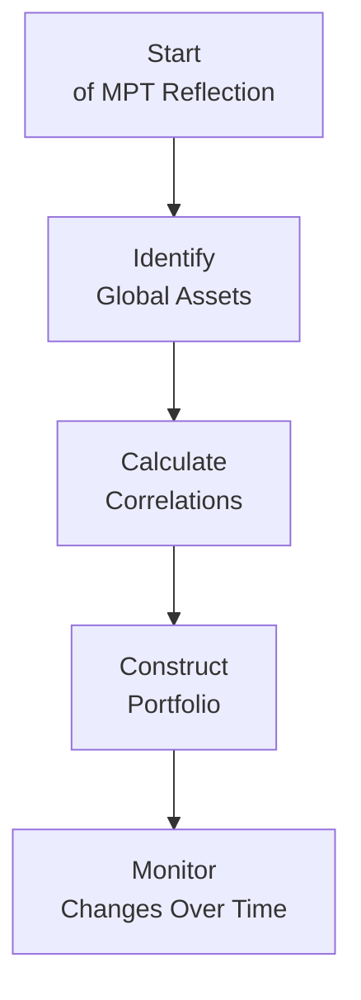

## 14.1 The Theoretical Basis for International Investing

Imagine the first time you stepped outside your comfort zone—maybe it was trying a new cuisine, traveling to a distant country, or changing career paths. Did you feel that sense of excitement mixed with a bit of risk? Well, that’s kind of what happens when investors step into international markets. It’s both thrilling and nerve-wracking, and often extremely rewarding. In this section, we’ll explore why so many investment professionals think it’s crucial to look beyond domestic borders, how theories like Modern Portfolio Theory (MPT) and the International Capital Asset Pricing Model (ICAPM) set the stage for global diversification, and what important factors (including “home bias”) influence investor behavior. 

### Why Look Abroad?

Turns out, investing in different markets can actually dampen overall portfolio volatility. That might seem counterintuitive at first—after all, foreign countries can be unpredictable, right? But as MPT points out, when different markets don’t move perfectly in sync (or, in statistical terms, when correlations aren’t 1:1), holding assets around the globe can reduce your overall portfolio risk.  

In a nutshell, MPT says: if two assets are less than perfectly correlated, combining them can deliver a better balance of risk and return. That’s the power behind cross-border diversification—German equities, Canadian resource stocks, Brazilian bonds, or Japanese technology shares may not all follow the same economic tides at the same time. This difference in movement creates an opportunity to smooth out bumps in the road.

### Modern Portfolio Theory in an International Context

At its core, Modern Portfolio Theory (MPT) looks a bit like a puzzle game: each asset is a puzzle piece with unique risk-and-return characteristics, and your job is to fit them together. Now, MPT gets even more interesting once you consider the entire globe of investable securities, from equities in emerging markets to government bonds in far-flung jurisdictions.

MPT’s main claim to fame is that an optimal portfolio exists that can maximize return for a given amount of risk (or equivalently, minimize risk for a given amount of expected return). This is often depicted on what’s called the “efficient frontier.” When we extend MPT to international markets, we expand our pool of assets, which can potentially push that frontier outward, meaning we can either seek a higher return for the same risk or the same return at a lower level of risk.

But no theory is perfect in practice. And while correlations among global markets are often low enough to help with diversification, these correlations can shift over time—especially in moments of crisis, such as a global recession. Even so, careful analysis of global trends still helps identify new opportunities and reduce concentration risk in any single country.

### Introducing the ICAPM

The Capital Asset Pricing Model (CAPM) is like a blueprint in finance classrooms that explains how an asset’s expected return relates to its risk (systematic risk, to be specific). CAPM says:


E(R_i) = R_f + \beta_i \bigl(E(R_m) - R_f\bigr)


• \\(E(R_i)\\) = Expected return of asset \\(i\\)  
• \\(R_f\\) = Risk-free rate  
• \\(\beta_i\\) = Sensitivity of asset \\(i\\) to the overall market risk  
• \\(E(R_m)\\) = Expected return of the market  

But that’s the basic, domestic version. Internationally, we add nuances like currency risk and global market factors. Enter the International Capital Asset Pricing Model (ICAPM):


E(R_i) = R_f + \beta_{i} \bigl(E(R_w) - R_f\bigr) + \beta_c (\Delta_{FX})


• \\(E(R_i)\\) = Expected return of an international asset \\(i\\)  
• \\(R_f\\) = Global risk-free rate (could be proxied by a major currency’s government bond)  
• \\(\beta_{i}\\) = Asset’s sensitivity to world market returns  
• \\(E(R_w)\\) = World market expected return  
• \\(\beta_c\\) = Sensitivity to currency movements  
• \\(\Delta_{FX}\\) = Change in relevant exchange rates  

The ICAPM acknowledges that you’re investing in a world market, not just a domestic one, and it throws in an extra factor—currency movements. After all, if you’re a Canadian investor buying Japanese stocks, you also face JPY-to-CAD conversion risk. That’s a systematic risk you can’t fully diversify away.

### Understanding Home Bias

If global diversification makes so much sense, why do many investors still hold mostly domestic securities? There’s a psychological phenomenon here called “home bias,” which is basically the tendency to overweight assets in one’s home country. It’s like that comforting bowl of home-cooked soup—to many investors, domestic assets just “taste” safer.  

Behavioral finance suggests several reasons for this bias:  
• Familiarity: We know our home country’s brands, economic policies, and trends better.  
• Regulatory hurdles: Some institutions impose limits on foreign investments due to compliance or local regulations.  
• Transaction costs: Historically, buying foreign assets could be more expensive.  
• Investor psychology: People simply feel more comfortable with what they know.

But times are changing: more online brokers are offering global diversification at lower fees, knowledge about other markets is more widely available, and regulations in many places are easing up (though you should always check with the Canadian Investment Regulatory Organization—CIRO—for the latest rules in Canada). The key takeaway: even if home bias is comforting, you might miss out on broader diversification benefits by ignoring foreign markets.

### Shifting Correlations Over Time

International markets may not move in lockstep, but correlations do shift—especially during market crises. Think about the 2008-2009 Global Financial Crisis, when equity markets worldwide tumbled in unison. Correlations spiked, reducing the diversification bonus.  

But these spikes are often temporary, and in calmer times, correlation levels may drop back down. So you don’t abandon diversification just because of turbulence any more than you’d abandon wearing seat belts just because everyone’s stuck in traffic at once. You still tailor your portfolio accordingly, maybe adjusting the allocation to reflect changing correlations, or employing strategies like currency hedging.

### The Role of Macroeconomic Indicators

If you’re going to invest abroad, get used to reading about other countries’ macroeconomic indicators. Gross Domestic Product (GDP) growth, inflation, unemployment rates, government debt levels, interest rates—these data points give you a sense of where a country’s economy is headed. A country experiencing robust GDP growth and stable inflation might present attractive opportunities, while nations with high debt and unpredictable monetary policies might pose more risk.

A practical starting place could be the [IMF Data Library](https://data.imf.org) or the [OECD Data](https://data.oecd.org) portal. They offer open-source levels of data that can help you make informed estimates about future economic conditions. For regulatory updates and guidelines on how to incorporate new market insights into your practice, you can turn to [CIRO](https://www.ciro.ca) (the Canadian Investment Regulatory Organization) and the Canadian Securities Administrators (CSA). Always keep your finger on the pulse of these macro indicators because currency exchange risk, interest rate differentials, and political stability can all affect international returns.

### Best Practices and Common Pitfalls

• Start small: If you’re uncomfortable with overseas investments, maybe test the waters with global ETFs or mutual funds that spread risk over many countries.  
• Stay updated: Global politics and economics move fast. Changes in trade policies or unexpected elections can impact equity valuations in a hurry.  
• Beware currency risk: Sometimes your asset can go up in local terms but still show a loss when converted back to your home currency.  
• Monitor fees and taxes: Watch for foreign withholding taxes, currency conversion costs, and management fees.  
• Don’t let fear paralyze you: Market fluctuations in far-off countries might feel scary, but with thorough research and the right tools, you can navigate them intelligently.

### A Quick Visual on MPT and Global Diversification

Below is a simple Mermaid diagram illustrating the thought process behind expanding MPT into international markets:

1. You begin by reviewing MPT fundamentals at the “Start of MPT Reflection.”  
2. Then you “Identify Global Assets” that suit your broad strategy.  
3. You “Calculate Correlations” between these assets, looking for diversification benefits.  
4. Build your “Constructed Portfolio,” ideally hitting that efficient frontier sweet spot.  
5. “Monitor Changes Over Time” because correlations and economic circumstances shift.

### Integrating Theory With Practice

The theoretical basis of international investing underpins much of what we do in real-world portfolio management. Whether you’re an advisor working with high-net-worth clients or you’re just managing your own nest egg, dipping your toes into international waters might actually help you sleep better by reducing overall volatility. That said, you need to do your homework—sudden shifts in foreign policies or interest rates can upset returns. 

For those wanting a deeper dive into these theories, check out the books “Investments” by Zvi Bodie, Alex Kane, and Alan Marcus, or “International Investments” by Bruno Solnik and Dennis McLeavey. Both works explain the complexities of global markets and advanced diversification strategies.

If you’d like to explore or verify macroeconomic data on your own, the [IMF Data Library](https://data.imf.org) and [OECD Data](https://data.oecd.org) portals let you analyze trends in everything from consumer prices to foreign direct investment. And if you’re looking for Canadian-specific regulatory guidance on how to properly disclose and manage international holdings, visit [CIRO](https://www.ciro.ca) and the Canadian Securities Administrators.

### Encouraging Critical Thought

As you consider your international strategy, ask yourself: How comfortable am I with uncertain currency movements? What if correlations increase during economic turmoil—am I prepared for that scenario? Are my research tools and data sources up to date? Being intellectually honest about these questions fosters better decision-making. 

Also, try to remain open-minded toward the broader global landscape. Just because you’ve had success in domestic securities doesn’t mean you should overlook the possibilities that exist in developed and emerging markets. And yes, you might face challenges like language barriers or higher volatility in some emerging markets, but the flipside is potential for growth you might not find at home.

### References and Resources

• **CIRO (Canadian Investment Regulatory Organization):** [https://www.ciro.ca](https://www.ciro.ca)  
• **Canadian Securities Administrators (CSA):** [http://www.securities-administrators.ca](http://www.securities-administrators.ca)  
• **IMF Data Library:** [https://data.imf.org](https://data.imf.org)  
• **OECD Data:** [https://data.oecd.org](https://data.oecd.org)  
• **“Investments” by Zvi Bodie, Alex Kane, and Alan Marcus**  
• **“International Investments” by Bruno Solnik and Dennis McLeavey**  

### Final Thoughts

International investing doesn’t have to be intimidating. Like trying a new dish, it’s normal to feel a bit nervous. But as MPT, ICAPM, and countless academic studies suggest, broadening your horizons may reduce the overall risk while uncovering unique growth prospects. Yes, home bias is real—we feel comfortable with what we know. Yet the world is vast, and so are the opportunities. By carefully analyzing correlations, macroeconomic indicators, and systematic risks, you can harness the power of global markets to build a more efficient, more resilient portfolio.

---

## Test Your International Investing Knowledge: Engaging Quiz for Global Diversification



### Modern Portfolio Theory suggests that international diversification can help reduce risk primarily due to which factor?

- [ ] Higher cost ratios in foreign markets
- [ ] Uniform correlation of global assets
- [ ] Absolute elimination of systematic risk
- [x] Lower correlations between domestic and foreign markets

> **Explanation:** When the correlation between domestic and foreign assets is lower than 1.0, a portfolio that blends these assets can experience a reduced total volatility, thereby lowering overall risk.  

### Which of the following additional factors does the International CAPM (ICAPM) account for, beyond the basic CAPM approach?

- [ ] Dividend policy variations
- [ ] Labor market dynamics
- [x] Currency exchange rate risk
- [ ] Domestic government subsidies

> **Explanation:** The ICAPM extends the CAPM by including currency exchange risk, because investing internationally usually entails exposure to foreign currency fluctuations.  

### What best describes “home bias” in an international investing context?

- [x] Investors’ tendency to overweight domestic securities relative to global diversification
- [ ] A strict regulatory prohibition on international investments
- [ ] The preference for emerging markets over developed markets
- [ ] The reliance on foreign analysts for investment advice

> **Explanation:** Home bias often arises from familiarity, regulatory environment, and psychological comfort with domestic markets, making investors hold more domestic assets than is theoretically optimal.  

### During a global financial crisis, how do correlations among different international markets typically change?

- [ ] They remain constant due to government intervention
- [ ] They always become zero
- [x] They usually increase, reducing diversification benefits
- [ ] They turn negative in most cases

> **Explanation:** In turbulent market times, correlations among global assets often spike, reducing the effectiveness of diversification.  

### Why is researching macroeconomic indicators such as GDP growth, inflation, and interest rates important for international investing?

- [ ] They guarantee a positive return
- [ ] They have no impact on foreign portfolios
- [x] They help assess the economic environment and potential investment risks or opportunities
- [ ] They are solely used for currency hedging strategies

> **Explanation:** Understanding economic indicators aids in predicting how international markets might perform and the risks they present, influencing portfolio allocation decisions.  

### Which resource can Canadian investors reference for guidance on rules and regulations about international investing post-2023?

- [ ] The defunct IIROC website
- [ ] A historical MFDA publication
- [x] The Canadian Investment Regulatory Organization (CIRO)
- [ ] The national bank’s local office

> **Explanation:** With the amalgamation of IIROC and MFDA into CIRO, Canadian investors should check [CIRO](https://www.ciro.ca) for up-to-date regulatory information and resources.  

### If an investor wants to reduce currency exposure when holding international assets, which of the following strategies might they consider?

- [x] Employ currency hedging
- [ ] Rely on government subsidies
- [x] Diversify across multiple currencies
- [ ] Eliminate all foreign holdings entirely

> **Explanation:** Currency hedging strategies (like forward contracts or currency futures) plus dispersing investments across multiple currencies can mitigate exchange rate risk in an international portfolio.  

### Which is a likely benefit of including foreign equities in a Canadian investor’s portfolio?

- [ ] Increased transaction costs for improved returns
- [ ] Protection from labor market changes in foreign countries
- [ ] Elimination of all systematic risk
- [x] Potential for enhanced diversification due to lower correlation with Canadian equities

> **Explanation:** Leveraging lower correlations between foreign and domestic equities potentially boosts overall diversification benefits.  

### According to Modern Portfolio Theory, which scenario might push the efficient frontier outward?

- [x] Adding international assets with low correlation to domestic holdings
- [ ] Decreasing the number of stocks you hold
- [ ] Relying on a single industry for investment across multiple countries
- [ ] Selecting only very high beta stocks

> **Explanation:** MPT suggests that incorporating assets with lower correlation into a portfolio can expand the efficient frontier, offering a more favorable risk-return trade-off.  

### True or False: Correlations between global assets never change, making diversification benefits consistent at all times.

- [x] True
- [ ] False

> **Explanation:** Actually, this is a trick question. The statement is false because correlations between global assets can and do change, especially during economic turmoil.  


