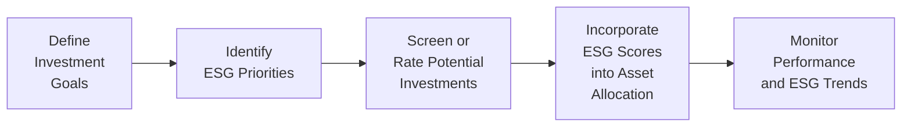
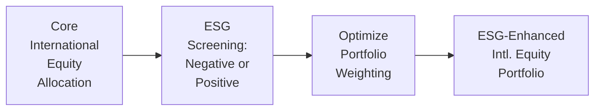

## 14.10 ESG and Responsible International Investing

We’ve all been there: scrolling through social media or chatting with friends, we catch wind of a company accused of polluting some river or ignoring labor rights. And then comes that little voice in our head, “Wait, do I really want to put my money there?” This is precisely where ESG—Environmental, Social, and Governance—enters the scene. ESG essentially helps us invest in a way that aligns with our values by screening companies based on their environmental impact, social responsibility, and corporate governance practices. Simple enough, right? Actually, once you set foot into global markets, it can get tricky because regulations, norms, and reporting standards vary a whole lot from region to region. Below, we’ll walk through some seriously deep insights you need for responsible international investing.

---

### Why ESG Matters in International Markets

ESG factors have become part of mainstream investment analysis because they help reveal a company’s long-term viability and risk profile. If a company dumps toxic waste in a local water supply, that’s not only an environmental hazard but a potential legal and public relations nightmare. If an overseas factory pays workers unfair wages, that can hurt employee morale and brand reputation. Or if a country’s governance standards are weak, foreign investors might face higher corruption risks or see minority shareholder rights go ignored.

When it comes to international investing, ESG integration is not just some “nice to have”—it can be a genuine differentiator in building profitable, stable portfolios. In fact, sustainable international funds sometimes outperform their benchmarks, particularly over the long term. There’s a growing body of evidence from academic studies, edge-of-your-seat case studies, and even big ESG rating providers—Sustainalytics, MSCI ESG Research, and RobecoSAM—that show strong ESG practices reduce risks and create more resilient earnings streams.

---

### Global Frameworks for ESG

Let’s say you’re sitting in your office, pondering how best to allocate some capital in emerging markets. You think, “Hmm, I should probably know more about best-in-class ESG standards or global frameworks.” Indeed, frameworks like the UN Principles for Responsible Investment (PRI) and the Global Reporting Initiative (GRI) have become crucial for ensuring consistent ESG disclosures around the world. 

• PRI (Principles for Responsible Investment):  
  The PRI is a UN-supported initiative. It calls on investors to incorporate environmental, social, and governance considerations into their decision-making processes. Organizations that sign on to the PRI voluntarily agree to certain principles. These might include regularly reporting how they integrate ESG into their practices, engaging with portfolio companies to improve their ESG performance, and collaborating with other industry participants.  
  Many Canadian firms, including some large pension funds, are signatories to the PRI, giving them a platform to influence corporate behavior globally.

• GRI (Global Reporting Initiative):  
  The GRI sets widely used standards for sustainability reporting. Their frameworks guide companies on what to disclose about environmental, social, and governance impacts. By adhering to GRI standards, corporations can be more transparent with investors, making it easier to compare and evaluate them on a global scale.  
  This approach is especially helpful for global or cross-border investing, where you might be comparing a French automotive company to a Brazilian mining firm.

By following these frameworks, companies offer more consistent data to help you evaluate ESG risks and opportunities. That consistency can be your best friend because, honestly, comparing two companies’ annual sustainability reports can otherwise feel like comparing apples to giraffes.

---

### The Three Pillars of ESG

Before diving deeper into regional differences or real-world examples, let’s quickly recap the ESG pillars:

1. **Environmental**: Covers how businesses manage their ecological footprint. Think energy efficiency, carbon emissions, waste management, and resource conservation.  
2. **Social**: Assesses labor practices, community engagement, consumer protection, diversity and inclusion, and human rights.  
3. **Governance**: Looks at the policies, procedures, and controls set by the board of directors and executives, including executive pay, shareholder rights, and transparency.

When investing internationally, each pillar can come with its own unique set of challenges. For example, in countries with weaker environmental regulations, you might see more frequent industrial accidents or ecological damage. Social issues can be acute where labor laws are lax, and governance can be questionable if corruption issues persist or if minority shareholder protections are minimal.

---

### Regional Differences and Varying Enforcement

The reality is that ESG standards and enforcement differ widely. One moment, you might be analyzing a company in France, which has relatively robust corporate sustainability reporting rules, and the next, you’re looking at an emerging market where these rules might not even be on the radar. You’ll see big variations in disclosure requirements, the presence (or absence) of independent audits, and local cultural norms regarding environmental and labor practices.

• Some European countries (like the Nordics) lead in ESG enforcement and climate ambition. They have stricter rules around carbon emissions, supply chain transparency, and equal pay.  
• In the Asia-Pacific region, ESG adoption is picking up speed but can vary wildly from one jurisdiction to another. In some markets, minor corporate governance issues like nepotism or non-transparent executive compensation might go unaddressed.  
• Over in Sub-Saharan Africa, you might encounter big disparities in environmental practices, where certain nations impose strong environmental regulations, while others have fewer enforcement resources available.

In Canada, the Canadian Securities Administrators (CSA) has been putting out Staff Notices that offer guidance on ESG-related investment fund disclosures. This is relevant if you’re purchasing or distributing funds in Canada, because you’ll want to ensure the fund is accurately labeled “sustainable” or “ESG-focused” and not just “greenwashing.” The key is to confirm that the fund’s actual holdings match its marketing claims.

---

### Lashbacks, Pitfalls, and the Controversial Greenwashing Problem

I recall meeting a friend in Toronto who wouldn’t stop raving about a new “eco-friendly” global equity fund. They were buzzing because the fund’s branding screamed “green.” But after reading the prospectus, the top holdings included a petrochemical giant known for some questionable environmental practices. It’s not automatically a deal-killer (sometimes engagement and improvement strategies exist), but you get the point: marketing can be misleading. We call that “greenwashing,” and it’s an unfortunate phenomenon.  

Hence, your diligence should go beyond a fund’s label. Third-party ESG research and rating providers—like Sustainalytics or MSCI ESG—can help verify or challenge a fund’s sustainability claims. But you also want to cross-check because rating methodologies differ. While one might weigh carbon emissions heavily, another might prioritize labor issues or board independence.

---

### Corporate Governance Concerns in Global Markets

Now, let’s chat a bit about governance—probably the less glamorous but arguably the most important ESG pillar. A company’s governance structure sets the rules of the game, shaping how decisions are made and whose interests come first. In some markets, especially emerging or frontier ones, minority shareholder protection can be weaker. This can lead to all sorts of undesirable outcomes, like:

• Management or controlling shareholders making decisions favoring their own interests, leaving minority shareholders sidelined.  
• Limited transparency or delayed financial disclosures.  
• Potential corruption or nepotism at the board level.

A prime example is when a major state-owned enterprise (SOE) in certain regions might “bend” the rules to align with political objectives, not necessarily maximizing value for outside investors. As an investor, it’s critical to do extra investigative work here. A few phone calls, reading up on local regulations, or seeking specialized counsel might address these concerns. Some folks even leverage specialized ESG or governance risk consultants with on-the-ground expertise.

---

### Integrating ESG into International Asset Allocation

In Chapter 3 of this book, we introduced the idea of structuring asset allocations around different asset classes. When ESG enters the picture, you might adapt your allocation based on your or your client’s ethical preferences and risk tolerance. For instance, if your client wants to steer clear of high carbon emitters, you might scale back allocations to certain heavy industries or jurisdictions that rely on fossil fuels. If strong governance is most important, you might focus on countries well-known for stable legal frameworks and robust disclosure rules.

Below is a high-level mermaid diagram illustrating a simplified process for incorporating ESG factors into international asset allocation:

In practice, you might refine each step. For instance, “Screen or Rate Potential Investments” could involve cross-checking multiple rating providers and verifying that data with a fundamental analysis. Then, under “Monitor Performance and ESG Trends,” you’d keep an eye on news about labor controversies, pollution scandals, or changes in local governance laws.

---

### ESG and Long-Term Performance

A persistent question is whether ESG-friendly investing leads to better returns. While short-term swings in global markets can overshadow the positive effects of ESG, there’s evidence suggesting ESG-oriented companies may exhibit superior risk-adjusted performance over the long haul. A few reasons:

1. **Lower Risk of Controversies**: Companies with robust ESG policies tend to avoid headline-grabbing disasters—like major spills or labor violations.  
2. **Smoother Operational Efficiency**: Good governance often translates to well-structured operations, fewer conflicts of interest, and better resource management.  
3. **Stakeholder Trust**: High ESG performance can enhance customer loyalty and attract top talent, feeding a virtuous cycle of brand value and employee satisfaction.

The Canadian Investing ecosystem, overseen by CIRO (the Canadian Investment Regulatory Organization), also encourages financial firms to consider these risks. CIRO replaced the old MFDA and IIROC in 2023, so any references to those organizations are purely historical now. Canadian Investor Protection Fund (CIPF) remains the umbrella for investor protection if a regulated firm goes insolvent. Considering ESG factors falls in line with a broader push for due diligence and transparency in the Canadian regulatory landscape.

---

### Sustainable and Thematic Funds for International Exposure

One practical way to get exposure to responsible international investing is through mutual funds or ETFs specifically designed to follow ESG criteria, often called “sustainable funds.” These funds integrate ESG throughout the investment process, from screening to weighting:

• **Negative screening**: Excluding companies engaged in harmful industries (e.g., tobacco, firearms).  
• **Positive screening**: Seeking companies with leading environmental or social practices (e.g., renewable energy providers).  
• **Themed investing**: Investing in lines of business contributing to solutions, such as clean tech or affordable housing.

While screening is often helpful, it’s worth noting that absolute exclusions can limit diversification. Perhaps a sustainable fund excludes all fossil fuel companies, but that might limit exposure to markets that are heavily resource-based. It’s a balancing act: how strongly do you (or your clients) want to incorporate ESG screening relative to possible diversification benefits?

---

### Engaging with Companies: Shareholder Activism

Sustainable investing doesn’t necessarily mean excluding companies with poor ESG scores. Some investors prefer engagement (or activism), especially in markets that need improvement. By holding equity positions in companies, these investors push for better disclosure or changes in governance.

For example, large Canadian pension funds—often signatories to the PRI—are known to engage directly with multinational corporations, pressuring them to adopt stronger environmental policies or more transparent board structures. This approach aims to introduce improvements from within and can be particularly impactful in emerging economies looking to attract foreign capital.

---

### Real-World ESG Case Studies

It might help to break down a rather typical (yet hypothetical) scenario: 

• **Case 1: Mining Company in Latin America**  
  A resource extraction firm with significant operations in Chile might have strong revenue prospects due to rising copper demand. But let’s say you discover the company has faced multiple allegations of water mismanagement, leading to conflicts with local communities. When factoring in ESG, you’d weigh these controversies to gauge the risk of operational stoppages or regulatory fines. If you still invest, you might diversify with other holdings or push for better water management practices.

• **Case 2: Renewable Energy Startup in Southeast Asia**  
  A small renewable energy firm in Malaysia aims to address local power shortages with solar technology. Early indicators show strong local governance, a robust social responsibility agenda, and an environmental benefit. However, you might also worry about political uncertainties or the threat of more complex bureaucracy. So you perform a deep fundamental analysis to confirm that the growth potential offsets the heightened political risk.

---

### Regulatory Considerations in Canada

In Canada, the CSA (Canadian Securities Administrators) has published some incredibly detailed Staff Notices explaining how fund managers should disclose their ESG strategies and alignment. Some key points:

• If a Canadian-registered investment fund claims a “sustainable” or “ESG” approach, the manager must show a cohesive investment strategy that supports that claim.  
• Continuous disclosure obligations require clarity on how ESG strategies are implemented and any associated costs or restrictions.  
• CIRO, the national self-regulatory organization, monitors the compliance of investment dealers with these disclosure requirements. CIPF offers coverage to clients if a dealer fails, safeguarding investments, including those in ESG-focused funds.

Keeping track of these rules is as important as the ESG metrics themselves because mislabeling can lead to regulatory interventions and potential reputational damage.

---

### Using Open-Source Tools and Research

Don’t overlook the treasure trove of free or open-source resources for ESG. While premium access to Sustainalytics or MSCI ESG can be expensive, there are platforms or datasets that can give you partial insight at no cost—especially for widely covered large-cap companies. For instance, the IFC (International Finance Corporation)—part of the World Bank Group—regularly publishes guidelines and case studies on private-sector development in emerging markets, with a strong emphasis on ESG.

---

### Balancing Socially Responsible Investing with Financial Goals

You might be wondering, “So, do I just go all-in on ESG and ignore everything else?” Well, not necessarily. Even though ESG can guide you toward better long-term risk management, you still need to consider asset allocation, time horizons, liquidity needs, and your personal (or your client’s) investment strategy. One approach is to apply an ESG overlay to a traditional portfolio: you define your typical asset allocations across regions or industries and then refine each allocation choice with ESG data. That way, you’re not discarding entire markets but being selective within them.

Here is a simplified mermaid diagram showing how an ESG overlay might be applied to international equities:

In short, your final portfolio’s shape depends on how deeply you want to integrate ESG. Some might go lightly: simply weeding out controversial industries. Others might bring a heavy hand: only selecting best-in-class ESG players, or investing exclusively in specific themes like renewable energy or gender equality.

---

### Common Pitfalls

• **Over-Reliance on One Rating**: ESG rating systems are not standardized, so a company might score differently across different providers.  
• **Inadequate Local Understanding**: Without local insight, you might misinterpret data—for instance, a modest carbon footprint might be due to an industry’s smaller scope in that country, not necessarily better policies.  
• **Greenwashing**: We’ve mentioned this, but it’s worth repeating. A fancy “green” label does not guarantee actual ESG integration.  
• **Ignoring Governance**: Environmental and social issues can appear flashy, but governance influences both of these profoundly. Poor governance can unravel even the best corporate sustainability agenda.

---

### Best Practices

• **Engage with Company Management**: Don’t be afraid to ask pointed questions during earnings calls or general meetings.  
• **Use Multiple ESG Data Sources**: Diversify your data just like you diversify your portfolio.  
• **Stay Updated on Local Regulations**: If you invest in emerging markets, keep up with domestic regulatory shifts, enforcement levels, and cultural attitudes toward ESG.  
• **Leverage CSA Staff Notices**: Read up on the latest Canadian regulatory guidance to ensure compliance and accurate fund marketing.  
• **Collaborate with Others**: Joining or following collaborative initiatives (like the PRI) can give you a broader perspective on global norms and best practices.

---

### Final Thoughts

Responsible international investing with an ESG lens is part art, part science. Sure, we have frameworks like the PRI and GRI giving us standardized ground rules, but local nuances mean you’ll always need thorough due diligence. Still, the payoff can be immense: beyond the potential for stable returns, your investments support companies that aim to operate ethically, and you help shape markets toward greater responsibility.

It’s all about that elegant balance: seeking healthy financial returns while also ensuring that the capital you deploy aligns with your values and contributes to positive global change. And if you ask me, that’s not just a trend—it’s the future of investing.

---

## Test Your Knowledge: ESG and Responsible International Investing



### Which of the following best describes ESG integration in an international investing context?

- [ ] A focus on short-term profits above everything else
- [x] A systematic approach that incorporates environmental, social, and governance factors across different markets
- [ ] A mandatory procedure limited to North American equities
- [ ] A purely philanthropic activity without any financial considerations

> **Explanation:** ESG integration evaluates environmental, social, and governance dimensions when selecting and managing investments globally, aiming for both responsible and financially viable outcomes.

---

### What is the main role of the UN’s Principles for Responsible Investment (PRI)?

- [ ] To levy fines on companies that violate environmental laws
- [ ] To offer tax incentives for companies building solar panels
- [x] To encourage investors to incorporate ESG factors into their investment decisions
- [ ] To create mandatory climate regulations in developed nations

> **Explanation:** The PRI provides a framework for responsible investment, urging signatories to adopt ESG practices. It does not regulate or impose fines directly.

---

### Which statement about global ESG reporting standards is most accurate?

- [ ] They are fully standardized and identical across countries
- [x] GRI offers widely recognized guidelines, but adoption and implementation can vary regionally
- [ ] All companies worldwide must follow the GRI guidelines
- [ ] ESG reporting is entirely optional in every country

> **Explanation:** While GRI provides widely accepted guidelines, actual adoption can differ from place to place, and there is no single universal requirement for all companies globally.

---

### Why might emerging markets require more in-depth ESG due diligence?

- [ ] They are always fully compliant with international ESG standards
- [ ] Their disclosures are strictly enforced, so extra steps aren’t needed
- [x] They often have weaker regulatory frameworks and lower enforcement
- [ ] Their governance practices are universally stronger than those in developed markets

> **Explanation:** Many emerging markets have less robust enforcement of environmental and governance rules, which makes more thorough research essential for responsible investing.

---

### Which of the following describes a potential downside of negative screening?

- [ ] It increases exposure to high carbon emitters  
- [ ] It guarantees stronger ESG scores in the portfolio  
- [x] It may limit diversification by excluding entire sectors or industries  
- [ ] It never considers the social component of ESG  

> **Explanation:** By automatically excluding specific sectors, you could reduce the portfolio’s breadth and possibly miss out on strong performers that are improving their ESG practices.

---

### What is greenwashing?

- [ ] A legitimate ESG approach that focuses on water conservation  
- [x] Misleading or exaggerated claims about environmental or social benefits  
- [ ] The process of verifying sustainable fund holdings  
- [ ] A legal requirement in countries with strong ESG regulations  

> **Explanation:** Greenwashing refers to marketing tactics that make something seem more eco-friendly or socially responsible than it truly is, thus misleading investors.

---

### How can governance issues in certain markets impact minority shareholders?

- [x] Weak governance may allow controlling shareholders to prioritize personal interests over minority shareholders  
- [ ] Weak governance practices rarely affect investors  
- [x] It can limit transparency and delay financial disclosures, raising risks for minority shareholders  
- [ ] It guarantees stronger protection for minority shareholders  

> **Explanation:** Poor governance structures can result in opaque decision-making, preferential treatment for controlling stakeholders, and limited recourse for minority shareholders.

---

### Which is a primary reason ESG-focused companies may have better risk-adjusted performance over the long term?

- [ ] They invest heavily in high-risk industries  
- [x] They often minimize legal, reputational, and operational risks  
- [ ] They neglect compliance efforts to save on costs  
- [ ] They rely entirely on short-term speculative gains  

> **Explanation:** Sound ESG practices tend to reduce a firm’s exposure to controversies, litigation, and brand damage, potentially fostering more stable, risk-adjusted returns.

---

### Why are multiple ESG rating sources often consulted by investors?

- [x] Different providers may weigh ESG factors differently, leading to varied scores  
- [ ] Using multiple sources is illegal in most regions  
- [ ] They all produce identical coverage and scores  
- [ ] Each source offers the exact same methodology  

> **Explanation:** ESG rating agencies use different methodologies and metrics for evaluating companies. Consulting multiple sources can provide a more comprehensive and balanced view.

---

### True or False: ESG and responsible investing standards are mostly irrelevant to Canadian investors due to CIRO’s rules.

- [ ] True
- [x] False

> **Explanation:** CIRO’s role in overseeing the investment industry in Canada includes encouraging transparent and responsible market conduct. ESG standards are very relevant, helping ensure that investors have clear disclosures and robust risk management in place.


