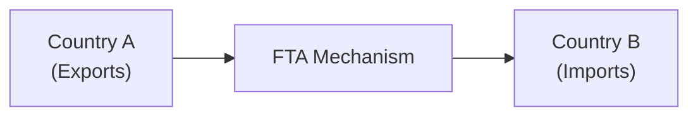

## 14.11 The Impact of Free Trade Agreements and Global Institutions

Sometimes, when I think about international investing, I imagine my close friend who’s always on the lookout for new business opportunities. She sells artisanal skincare products online and dreams of tapping into markets across the globe. But the big question that always comes up is: “So… where do I even start?” Free trade agreements (FTAs) and global institutions are often central to that conversation. They’re like a roadmap, or maybe even a passport, that can help companies and investors cross borders more smoothly.

Let’s look at the various ways that free trade agreements and global organizations—like the World Trade Organization (WTO), the International Monetary Fund (IMF), and others—play a massive role in shaping investment flows and creating opportunities worldwide. Along the way, we’ll talk about different strategies and highlight how these agreements may reduce investment barriers, open new frontiers, and still leave us with a few challenges to handle.

Role of Free Trade Agreements in Cross-Border Investment  
--------------------------------------------------------
Free trade agreements are essentially treaties that reduce or eliminate tariffs, quotas, and other barriers to trade between member countries. They’re not magic wands, but they do streamline certain aspects of exporting and importing, making it easier for businesses (and investors) to find attractive opportunities abroad. If you’re in Canada, you’ve probably heard quite a bit about agreements like the Canada–United States–Mexico Agreement (CUSMA, formerly NAFTA), the Comprehensive Economic and Trade Agreement (CETA) between Canada and the EU, and the Comprehensive and Progressive Agreement for Trans-Pacific Partnership (CPTPP).

Imagine you’re an investor in Canada. You want to invest in Mexico, but you’re worried about extra tariffs or surprise taxes. Thanks to CUSMA, many of those tariffs are gone. That doesn’t mean you’re free of regulatory constraints—each country still has its own rules—but you do get a certain layer of predictability.  

Free Trades, Fewer Hoops:  
1. Tariff Elimination: A hallmark of an FTA is the reduction or outright removal of tariffs on goods. This can help companies produce more competitively and move products abroad more cost-effectively.  
2. Investment Protections: Some FTAs include provisions for investor-state dispute settlement mechanisms. That can provide a measure of legal certainty if something goes wrong.  
3. Regulatory Compatibility: FTAs often push toward harmonizing (or at least recognizing) regulations among trading partners. This might make it simpler to conform to product standards or financial disclosure rules abroad.  

Let’s visualize a simplified flow of goods under an FTA:

In this diagram, Country A’s exports go through the FTA mechanism, which reduces barriers and speeds up the shipment of goods to Country B. In practice, it’s more complicated—there are customs procedures, cross-border taxes (if any remain), and regulations to follow—but the FTA is designed to clear up friction points.

The World Trade Organization’s Key Functions  
-------------------------------------------
The World Trade Organization (WTO) is like the global referee for trade rules. And yes, sometimes it feels like that referee is blowing the whistle every few minutes! The WTO ensures that trade flows as smoothly and fairly as possible. It helps settle disputes when they pop up, and it encourages ongoing negotiations to open up markets further.

1. Dispute Resolution: The WTO has a formal process by which member countries can challenge each other’s practices. If Canada believes that another country is imposing unfair duties on Canadian goods, it can seek resolution through the WTO.  
2. Legal Framework: The WTO’s agreements (like the General Agreement on Tariffs and Trade—GATT) detail how countries should manage imports, exports, subsidies, and more.  
3. Monitoring: The WTO regularly checks members’ trade policies to ensure they’re in line with agreed-upon rules.

How does this matter to you as an investor? Well, if one country slaps huge tariffs on steel imports or suddenly restricts the inflow of foreign capital, the WTO can help address these moves—potentially leveling the playing field.

Regional Trade Blocs and Their Investment Impact  
------------------------------------------------
Now, there’s something else we need to factor in: regional trade blocs. In a sense, these are like clubs formed by neighboring (or sometimes not-so-neighboring) countries to deepen economic integration. Think of the European Union (EU) or the Association of Southeast Asian Nations (ASEAN). In these blocs, borders become more permeable for goods, services, people, and capital.

For instance, the EU’s freedom of movement and single market policies typically save tons of paperwork for businesses. That can allow an Italian maker of specialty cheeses to sell easily in Germany or a German car manufacturer to set up a factory in Slovakia. From an investment standpoint, that’s huge because it provides clarity and consistency on rules across a multitude of countries within the region.  

Some Key Characteristics of Regional Trade Blocs:
• Common Tariff Policies: Many blocs adopt a common external tariff for goods coming from outside the bloc, so all members share the same external trade barriers.  
• Single Market: In more integrated blocs like the EU, you get a single market for goods and people, which can expand labor supply and consumer markets.  
• Potential Currency Union: In regions like the Eurozone, using one currency can simplify cross-border transactions and remove exchange-rate risk.

Of course, it’s not always sunshine and roses. Belonging to a trade bloc can also create winners and losers. If you run a small company in a less developed member state, you might be worried about being outcompeted by large corporations from wealthier states. Trade blocs can shift investment flows to certain areas over others, and if the bloc imposes external tariffs on non-members, that might limit some forms of external competition—and possibly challenge free competition on a global scale.

How Global Financial Institutions Influence Policy  
-------------------------------------------------
A handful of global financial institutions hold significant sway over how countries manage their finances, deal with currency fluctuations, and steer economic policy. While they’re not “trade” organizations per se, their role in international markets is massive.

• International Monetary Fund (IMF): The IMF goes beyond occasional headlines about “IMF bailouts.” It’s actively promoting global financial cooperation, stability, and economic growth. The IMF monitors exchange rates, tries to keep a lid on financial crises, and offers advice (and sometimes funding) to countries with shaky economies. Investors might watch an IMF program in an emerging market as a sign that the country’s financial picture could stabilize—or, at least, that it’ll have a financial safety net.  

• World Bank: Focused on development projects, the World Bank provides loans and grants to reduce poverty and support economic progress in developing nations. A supportive World Bank initiative can improve a country’s infrastructure, making it more attractive for foreign direct investment.  

• Bank for International Settlements (BIS): Think of the BIS as the bank for central banks. That’s not an oversimplification—this institution helps central banks (like the Bank of Canada or the Federal Reserve in the U.S.) collaborate on monetary policy, banking regulations, and financial stability. BIS research can affect how national banks regulate commercial banks, which in turn directly affects how easy or hard it is to finance new investments at home and abroad.

Risk and Opportunity in a Global Marketplace  
-------------------------------------------
It’s tempting to see FTAs and global institutions as some sort of superhero team that banishes all risks. But that’s not quite reality. Yes, these agreements and institutions provide frameworks for more efficient trade flows, investor protections, and dispute resolution. They can open new markets and reduce some regulatory burdens. Yet, they also create a dynamic global landscape that can shift with changes in policy, leadership, or geopolitical priorities.

• Market Growth and Diversification: When tariffs fall, new consumer markets open up. This can boost demand for exportable goods, potentially lifting profits for multinational corporations. Investors get the chance to diversify by investing in new industries or countries.  
• Competition and Volatility: As supply chains become more international, competition can intensify—maybe an auto parts factory in Canada faces new, cheaper competition from a similar operation set up in Southeast Asia. Additionally, large-scale agreements like CPTPP might shift entire supply chains, creating both winners and losers.  
• Regulatory and Political Risk: Even with an FTA, each country can still impose regulations that affect your investments. Political changes in one member country can also sour the spirit of cooperation or lead to abrupt changes in trade or corporate taxes.  
• Commodity Price Swings: When you integrate more closely with global markets, you’re often more exposed to commodity price fluctuations. For instance, if you invest in commodities or resource companies, a free trade deal could boost demand from new markets, but it could also mean heavier competition from producers in other FTA regions.

Example: CPTPP’s Impact on Canadian Agriculture  
-----------------------------------------------
Let’s look at a real-world scenario with the Comprehensive and Progressive Agreement for Trans-Pacific Partnership (CPTPP). The CPTPP involves countries like Canada, Australia, Japan, and several others around the Pacific Rim. For Canadian agricultural exporters, it opened bigger doors to Japan, Vietnam, and others. That’s a sweet spot for a canola farmer in Saskatchewan. She might see lower tariffs on her exports, making her product more competitive abroad.  

But at the same time, some domestic producers (e.g., dairy or poultry, which were partly protected by supply-management systems) have had to adapt to increased competition from foreign producers. This can stir political debate. On the aggregate, though, CPTPP can raise economic activity in member countries—paving the way for broad-based growth in trade.  

Strategies to Harness These Benefits  
------------------------------------
Whether you’re an individual investor, a portfolio manager, or a small-business owner, it helps to have a few strategies in mind when approaching the opportunities and risks that trade agreements offer:

• Monitor Official Channels: Sites like Global Affairs Canada (https://www.international.gc.ca) update you on new trade agreements, expansions of existing deals, and investment initiatives.  
• Diversify Based on Pulsing Markets: If an FTA suddenly expands market demand for a certain commodity or product, it might be a good time to consider stock positions in related companies—but watch for overexposure.  
• Stay Current with Regulatory Changes: Keep tabs on each member country’s legislation. Yes, it can be a job in itself, but if major policy changes occur—like a sudden shift in tax policy or investment restrictions—it might significantly alter your investment’s performance.  
• Use Open-Source Financial Tools: There are open-source analysis platforms—ranging from database software to specialized economic modeling tools—that can help track trade flows, tariffs, and currency movements across borders.  

Canadian Regulatory Environment and CIRO  
----------------------------------------
Within Canada, you’ll find a particular regulatory environment for finance, especially after the amalgamation of the Mutual Fund Dealers Association of Canada (MFDA) and the Investment Industry Regulatory Organization of Canada (IIROC) into the Canadian Investment Regulatory Organization (CIRO) (effective June 1, 2023). CIRO oversees investment dealers, mutual fund dealers, and marketplace integrity for both equity and debt. If you’re a Canadian advisor facilitating clients’ international investments or a retail investor with a brokerage account, CIRO is your go-to resource for regulatory guidance and investor protection standards.  

If you ever need more details about how cross-border trades are regulated, how your broker needs to be registered, or how your investments are protected by the Canadian Investor Protection Fund (CIPF), you can check out https://www.ciro.ca. CIPF is now Canada’s single investor protection fund, after it merged with the MFDA Investor Protection Corporation. That’s important to know if you’re venturing into international securities—should your brokerage firm become insolvent, CIPF is there to protect your assets.

Connection to Broader Themes in This Book  
-----------------------------------------
If you recall, earlier sections in Chapter 14 discuss the primary advantages and potential disadvantages of international investing. But free trade agreements come in as a big bonus, because they can reduce some of that "disadvantage" risk and make expansions into foreign markets smoother. Meanwhile, the roles of global institutions like the IMF intersect with risk management strategies (which we discuss in Chapter 16) because they can stabilize economies, thus reducing sovereign risk for investors.

I like to think of investing in global markets as driving on a multi-lane highway. The trade agreements and institutions are like the traffic signals and speed limits. You can drive faster on well-maintained roads, but you still have to watch out for construction zones, random lane closures, or reckless drivers. The advantage is that these "roads" (markets) are better connected than ever before, thanks in part to free trade. But you still need a good map—knowing which route to take, which markets hold potential, and what hazards lie ahead.

Key Terms  
---------
Free Trade Agreement (FTA)  
: A pact between two or more countries eliminating or reducing tariffs, import quotas, and preferences on most goods and services traded among them.

World Trade Organization (WTO)  
: An international body tasked with regulating trade rules, mediating disputes, and facilitating trade liberalization among its member countries.

Trade Bloc  
: A type of intergovernmental agreement, often regional, where tariffs and non-tariff barriers are reduced or eliminated among member states.

BIS (Bank for International Settlements)  
: An international financial institution that fosters cooperation among central banks, aiming to ensure monetary and financial stability.

Where to Go for More Information  
--------------------------------
• Global Affairs Canada (https://www.international.gc.ca): Stay updated on Canadian trade policies, current trade agreements, and investment guidelines.  
• World Trade Organization (https://www.wto.org): Find the latest on global trade policies, dispute resolutions, and relevant data.  
• IMF Policy Papers: See how organizations like the IMF view issues of global trade, capital flows, and economic reforms on a macro level.  
• CIRO (https://www.ciro.ca): For Canada-specific regulatory updates, rules, and investor protection resources.  

Bringing It All Together  
------------------------
International investing is a rich tapestry of opportunities and challenges. Free trade agreements can open doors (sometimes wide open!), while global institutions provide frameworks that help reduce volatility and maintain some semblance of balance. As an investor, being aware of how these pacts and institutions shape the playing field can make a significant difference in your portfolio’s performance.

But you know what? It’s not just about reading the headlines. It’s about sharpening your ability to interpret economic trends, political shifts, and structural reforms—knowing how to pivot as agreements evolve and how to stay poised for changes in global demand. If you keep building your knowledge, consulting reliable sources, and maybe share a few stories with colleagues and friends along the way, you’ll be better positioned to navigate the global marketplace successfully.

So, next time you see news about a big trade agreement being signed or a massive IMF package being approved for a certain country, think of it as a clue. It’s a sign to pay attention, to maybe do a little deeper digging, and possibly to realign your investments for the next wave of global growth. And who knows—maybe you’ll be able to do exactly what my friend did: harness the power of these agreements to ship skincare products from a small Canadian town all the way to eager customers in Asia. Because that, in a nutshell, is the power of free trade and strong global institutions: they bring the world just a little bit closer.

---

## Test Your Knowledge: The Impact of Free Trade Agreements and Global Institutions



### How do free trade agreements primarily benefit investors?

- [x] By reducing or eliminating trade barriers, leading to potentially lower costs and broader market access.
- [ ] By mandating uniform corporate tax rates in all member countries.
- [ ] By ensuring profit guarantees for foreign companies.
- [ ] By providing universal currency exchange controls.

> **Explanation:** Free trade agreements seek to eliminate tariffs and non-tariff barriers, making it generally easier and cheaper to move goods and services across borders, which can translate into cost savings for investors and access to larger markets.

### Which organization acts as a global referee for trade rules and dispute resolution?

- [x] The World Trade Organization (WTO)
- [ ] The International Monetary Fund (IMF)
- [ ] The Bank for International Settlements (BIS)
- [ ] The Organisation for Economic Co-operation and Development (OECD)

> **Explanation:** The WTO helps manage global trade rules and provides a framework for settling disputes among its member nations.

### What best defines the goal of a trade bloc like the European Union?

- [x] To reduce or eliminate barriers to trade among member states, often creating a single market.
- [ ] To prevent member countries from investing abroad.
- [ ] To require companies to merge with government-owned enterprises.
- [ ] To establish universal labor costs across different nations.

> **Explanation:** Trade blocs prioritize facilitating the free flow of goods, services, capital, and sometimes labor among member states, effectively expanding and integrating markets.

### What is a key function of the International Monetary Fund (IMF)?

- [x] Promoting global financial stability and providing financial support to countries in crisis.
- [ ] Setting exchange rates for member countries.
- [ ] Collecting taxes from companies operating internationally.
- [ ] Overseeing international corporate mergers.

> **Explanation:** The IMF monitors macroeconomic stability, offers policy guidance, and can extend loans to members, especially those facing balance-of-payments difficulties.

### Which of the following is typically a direct result of joining a free trade agreement?

- [x] Reduced tariffs on goods traded between member countries.
- [ ] Mandatory shifts to a single currency for all members.
- [x] Improved market clarity through recognized regulatory standards.
- [ ] Guaranteed profit margins for exporters.

> **Explanation:** Lower tariffs and simplified rules of origin are hallmarks of FTAs, and regulatory standards often become more streamlined. However, they do not guarantee specific profit margins or a single currency.

### What is an important benefit of the dispute resolution mechanism in the WTO?

- [x] It provides a formal process for member nations to address and resolve trade grievances.
- [ ] It guarantees compensation to every exporter subjected to tariffs.
- [ ] It eliminates the need for any local legal counsel.
- [ ] It automatically prevents all trade disputes from arising.

> **Explanation:** The WTO's dispute resolution system doesn't preempt every conflict but does provide a structured way to address them in accordance with international trade law.

### In the context of a trade bloc, what is one challenge that businesses might face?

- [x] Increased competition within the bloc as tariffs drop and more companies enter the market.
- [ ] Complete removal of political barriers between member countries.
- [x] Potential preference for production in more developed regions of the bloc.
- [ ] Guaranteed government subsidies for domestic firms.

> **Explanation:** While trade blocs offer expanded markets, they often encourage heavier competition and can lead to economic concentration in regions that already have strong infrastructure and industries.

### Why might a Canadian agricultural producer favor joining a regional agreement like the CPTPP?

- [x] Access to new markets with reduced tariffs results in cost-effective exports.
- [ ] Full exemption from all domestic banking regulations.
- [ ] Guaranteed financial bailout for poor business decisions.
- [ ] Automatic membership in global centralized currency systems.

> **Explanation:** Under CPTPP, Canadian farmers benefit from lower tariffs in member states, potentially boosting sales and profitability in foreign markets.

### Which institution serves as a bank for central banks?

- [x] The Bank for International Settlements (BIS)
- [ ] The European Central Bank (ECB)
- [ ] The Federal Reserve (Fed)
- [ ] The World Bank

> **Explanation:** The BIS fosters monetary and financial cooperation among central banks, providing a platform for collaboration and research on financial stability.

### True or False: Trade agreements can expose investors to new competitive pressures, even as they open new markets.

- [x] True
- [ ] False

> **Explanation:** While FTAs lower trade barriers and open up fresh opportunities, they also intensify competition since foreign businesses can often more easily enter previously protected markets.


