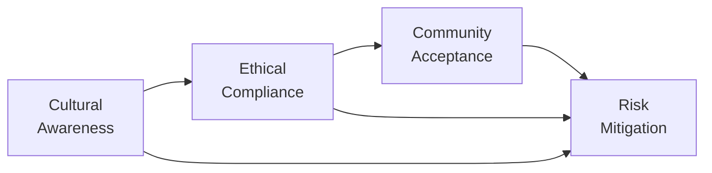

## 14.12 Cultural and Ethical Considerations in International Markets

Investing overseas might sound like an exciting proposition, but, well, it also comes with its own set of cultural, ethical, and regulatory complexities. I recall this time—back when I was just starting out—trying to finalize an international joint venture in a region where business dinners ran late into the night and personal relationships strongly influenced the negotiation process. Let’s just say I learned the hard way that being “direct” the way we often do in Canada doesn’t always resonate well in other countries. Instead, you sometimes need to slow down, build trust over extended conversations, share a meal, and develop a personal rapport before the real discussions even begin.

Below, we’ll delve deeply into some of the biggest considerations for investing in international markets: local business culture, ethical and legal concerns, social license to operate, corporate transparency, and community impact. It doesn’t matter if you’re a seasoned pro or just starting to dip your toes in foreign investments—these topics can help you more accurately evaluate potential investments, maintain a solid ethical stance, and ultimately protect both you and your clients.

### Business Culture Variations

Cultural differences are not simply about whether you bow or shake hands. They shape how deals are made, how contracts are viewed, and how people communicate or negotiate. Such differences extend to:

• Negotiation Styles: Some cultures prioritize harmony and indirect communication. They may prefer to avoid open confrontation and value consensus-building. Others are more direct or hierarchical, expecting deals to be hammered out swiftly. Missing these nuances can either stall your negotiations or break them entirely.  
• Communication Styles: In many East Asian cultures, a certain level of indirectness in language is common. Meanwhile, North American cultures—Canada and the U.S.—tend to value straightforward, candid communication. Personal rapport and trust can be especially crucial in certain Middle Eastern and Latin American cultures.  
• Relationship Building: Many regions emphasize building a deep foundation of trust before discussing the nitty-gritty of finance. Skipping this step is often seen as disrespectful. Take time to get to know your counterparts, their families, or even partake in local customs if invited.  

All these variations come into play when you’re buying sizable equity stakes abroad, partnering with local businesses, or structuring asset allocation models that include private market investments (see Chapter 13 for an overview of Private Markets). Because each market operates differently, a culturally informed approach will help you align business priorities and relationship-building strategies.

### Ethical Standards & Bribery Laws

Ethics—let’s be honest—often become trickier to navigate across borders. Different societies have different moral codes, but it’s absolutely crucial that you align with your home country’s legal standards and your personal ethical compass.

• Canada’s Corruption of Foreign Public Officials Act (CFPOA): This law makes it a criminal offense for persons and companies in Canada to bribe or offer corrupt payments to foreign public officials.  
• U.S. Foreign Corrupt Practices Act (FCPA): If you or your firm has exposure to U.S. jurisdictions, watch out for the FCPA too. It’s broad and can have extra-territorial reach.  
• Additional Anti-Bribery Laws: The UK Bribery Act is also notably strict, with a zero-tolerance stance on bribery.  

Violating these laws can result in heavy fines, sanctions, or even prison time for executives. Moreover, the negative PR alone can damage your business reputation.  
Canadian regulatory bodies, now consolidated under the Canadian Investment Regulatory Organization (CIRO), expect investment dealers and mutual fund dealers to uphold best practices wherever they operate. If you’re referencing older materials, note that the Investment Industry Regulatory Organization of Canada (IIROC) and the Mutual Fund Dealers Association of Canada (MFDA) are now defunct as separate entities—both were succeeded by CIRO in 2023.  
Many advisors follow the CFA Institute’s Code of Ethics and Standards of Professional Conduct, which addresses global ethical requirements. For example, there’s a strong emphasis on duties to clients, the market, and the broader public good.

### Social License to Operate

The notion of a “social license to operate” means ongoing acceptance or approval of an organization’s or industry’s practices by local communities. Let’s say you’ve invested in a mining project in Latin America or in a pipeline project in Canada’s North. If local communities feel marginalized, or if the project is seen as environmentally harmful, that social license can quickly evaporate. This can lead to protests, litigation, or regulatory interventions, all of which can reduce the value of your investment or force major changes to the project.

• Community Engagement: Investors can encourage public consultations, local hiring programs, or environmental initiatives.  
• Reputation Management: Some localities are wary of foreign investors. Building goodwill over time and engaging fairly with local authorities and community leaders can make all the difference.  

You might want to check out the Canadian Centre for Excellence in CSR, which provides resources on ethical standards abroad, particularly in extraction industries. Additionally, many corporations use guidelines from the Mining Association of Canada to ensure they maintain the trust of local communities.

### Corporate Transparency & Reporting Standards

We covered financial statement reliability way back in Chapter 7 (Analysis of Equity Securities II – Company Analysis and Valuation). But when you expand your investment scope globally, you face widely varying accounting standards, degrees of corporate disclosure, and the risk of incomplete or inaccurate reporting.

• Quality of Financial Statements: IFRS (International Financial Reporting Standards) is used in many countries, whereas the U.S. uses GAAP. Some nations, however, might not strictly enforce IFRS or GAAP compliance.  
• Disclosure Practices: Not all foreign markets require robust disclosures. Sometimes you’ll face language barriers, limited access to audited financial data, or overly complicated foreign ownership structures.  
• Regulatory Oversight: Canada, through securities commissions (coordinated under the Canadian Securities Administrators), imposes reporting and disclosure requirements. Internationally, you’ll need to verify that the local market has credible regulators and reliable enforcement.  

When a country does not maintain transparent financial reporting, it’s much tougher to do proper due diligence. You may also reference Chapter 2 on “Behavioural Finance and Investor Biases,” because biases can pop up if you assume that all reporting is automatically high-quality. We can sometimes be overconfident about the accuracy of businesses in unfamiliar markets. In short, carefully scrutinize the data—especially in emerging or frontier markets (see Chapter 14.9).

### Community Impact

Foreign projects that inadvertently damage local ecosystems, employ unfair labor practices, or jeopardize cultural heritage sites can harm not only the communities involved but also the investor’s bottom line. Remember:

• Environmental Concerns: Water usage, greenhouse gas emissions, deforestation—these can spark local and global protests, especially if not handled responsibly.  
• Local Employment: Sometimes, foreign firms bring in their own workforce and don’t hire locally, which can generate friction. Investing in training local employees, however, can improve community relations.  
• Corporate Social Responsibility: CSR integrates social and environmental concerns in business operations. It’s often a tool to reduce reputational risks abroad.  

These considerations come directly into play when you do sector-specific allocations—say you’re heavily invested in the resource sector, as described in Chapter 7.4 on “How to Analyze Resource Companies.” Assess how well a company aligns its production or operational strategies with community welfare and environmental standards. 

### Practical Tools & Resources

Before you hop on that plane or open your brokerage account in a new region, it’s wise to explore some resources and frameworks that can help you navigate the cultural and ethical terrain:

• Transparency International (https://www.transparency.org): Check out their Corruption Perceptions Index to gain insights on the corruption-level risk in particular countries.  
• Canadian Centre for Excellence in CSR (Mining Association of Canada): Offers guidelines and best practices for corporate social responsibility, especially in extraction industries.  
• CFA Institute Code of Ethics and Standards of Professional Conduct: If you’re following these standards, you’ll already have a robust framework for dealing with integrity, duty to clients, and avoiding conflicts of interest.  
• CIRO (https://www.ciro.ca): Canada’s new self-regulatory organization for investor protection and market integrity. Their site provides guidance on meeting compliance obligations, including those involving international investments.  
• Open-Source Environmental & Social Reports: Many NGOs issue region-specific or sector-specific environmental, social, and governance (ESG) analyses. You can often download these free of charge.  

### Diagram: Cultural, Ethical, and Community Factors in International Investing

Below is a Mermaid diagram illustrating how cultural insight, ethical compliance, and community acceptance feed into a comprehensive risk-mitigation strategy.

• A (Cultural Awareness) leads to B (Ethical Compliance) because understanding local norms helps you avoid unintentional bribery or corruption.  
• B (Ethical Compliance) leads to C (Community Acceptance) because abiding by foreign laws and safeguarding ethical standards fosters trust.  
• C (Community Acceptance) leads to D (Risk Mitigation) because having the local community’s support reduces operational, reputational, and regulatory risks.  
• All three feed into D from different angles, culminating in a thorough strategy.

### Best Practices and Common Pitfalls

• Ask Experts: Use local advisors who truly “get” the culture, or partner with local consultants.  
• Don’t Rush: Some deals require time to cultivate relationships. Pressuring a quick deal might offend local sensibilities.  
• Mind the Local Rules: And do your own checks. Even if local oversight is lax, you’re still bound by Canadian laws such as the CFPOA.  
• Track Reputation: Check local and international news. A single incident of bribery or environmental scandal might tarnish a firm’s brand or hamper future deals.  
• Stay Current: With global politics shifting and new regulations popping up, keep up to date with any changes that might affect your investments.

### Glossary of Key Terms

• **Corruption of Foreign Public Officials Act (CFPOA):** Canadian federal law prohibiting bribery of foreign public officials, with serious penalties for violations.  
• **Social License to Operate:** The ongoing acceptance or approval of a company’s operations by local stakeholders, often requiring transparent engagement, ethical practices, and responsibility.  
• **Corporate Social Responsibility (CSR):** A business practice framework in which a company integrates social, environmental, and community-focused considerations into its operations.

### Final Thoughts

Any investment strategy that broadens beyond domestic borders should incorporate these cultural, ethical, and community elements right from the start. You can’t just rely on financial spreadsheets and macroeconomic forecasts—you also need to factor in local values, regulations, and long-term societal impact. As you refine your portfolio in line with Chapters 16 (Managing Your Client’s Investment Risk) and 18 (Portfolio Monitoring and Performance Evaluation), keep a close eye on how well the companies you’re invested in respect local communities, adhere to anti-bribery laws, and maintain transparency.

International investing can be exhilarating and profitable when approached responsibly. So, if you’re willing to learn, adapt, and empathize with stakeholders across borders, you’ll not only minimize your risks but also foster more sustainable growth stories in your portfolio. At the end of the day, that’s the sweet spot: balancing returns with responsible, respectful, and compliant investing standards.

---

## Test Your Knowledge: Cultural and Ethical Considerations in International Markets



### Which of the following best describes the importance of cultural awareness when investing internationally?

- [ ] It eliminates the need for professional financial analysis.
- [x] It allows investors to navigate negotiation styles and relationship-building more effectively.
- [ ] It helps investors avoid regulatory oversight entirely.
- [ ] It guarantees returns on investment.

> **Explanation:** Cultural awareness helps investors better understand negotiation styles, relationship-building practices, and communication preferences in different regions. It doesn't replace financial due diligence or eliminate regulatory obligations.

### Which law specifically targets bribery of foreign public officials in Canada?

- [ ] U.S. Foreign Corrupt Practices Act (FCPA)
- [ ] UK Bribery Act
- [x] Corruption of Foreign Public Officials Act (CFPOA)
- [ ] Sarbanes-Oxley Act

> **Explanation:** Canada’s Corruption of Foreign Public Officials Act (CFPOA) explicitly prohibits Canadian corporations and individuals from bribing or offering corrupt payments to foreign public officials.  

### What is the primary purpose of a “social license to operate”?

- [x] To earn local acceptance or approval for a company’s activities.
- [ ] To reduce the costs associated with obtaining government permits.
- [x] To foster cooperation with local populations.
- [ ] To increase monopolistic market power.

> **Explanation:** A social license to operate refers to ongoing acceptance by local communities. Earning this acceptance often fosters local cooperation and helps avoid legal and reputational risks.

### How do corporate transparency and robust reporting standards affect international investing?

- [x] They reduce uncertainties associated with company operations.
- [ ] They have no impact on international investing decisions.
- [ ] They serve only to satisfy local marketing requirements.
- [ ] They automatically raise the share price.

> **Explanation:** Strong disclosure and transparent reporting can reduce uncertainties, making it easier for investors to evaluate risks, profitability, and ethical constraints accurately.

### Which of the following best describes the socially responsible approach to an international mining project?

- [x] Consulting local communities to understand environmental and social concerns.
- [ ] Hiring only foreign personnel to ensure company loyalty.
- [x] Installing pollution control technologies to minimize environmental impact.
- [ ] Avoiding interaction with local authorities.

> **Explanation:** Socially responsible investing involves engaging local communities and mitigating environmental or social harm. This approach is important for maintaining a social license to operate.

### Which organization replaced IIROC and MFDA in Canada as of January 1, 2023?

- [x] CIRO (Canadian Investment Regulatory Organization)
- [ ] CIPF (Canadian Investor Protection Fund)
- [ ] OSFI (Office of the Superintendent of Financial Institutions)
- [ ] OSC (Ontario Securities Commission)

> **Explanation:** CIRO is Canada’s new self-regulatory organization formed by merging the Investment Industry Regulatory Organization of Canada (IIROC) and the Mutual Fund Dealers Association of Canada (MFDA).

### How can cultural misunderstandings impact international investment deals?

- [x] By causing negotiation impasses or reputational damage.
- [ ] By ensuring faster approval from government bodies.
- [x] By leading to misinterpretations of local business etiquette.
- [ ] By simplifying contract clauses.

> **Explanation:** Misunderstanding cultural norms can stall negotiations, damage reputations, and create confusion around local business etiquette, harming the investment venture.

### Which resource offers insights into perceptions of corruption around the world?

- [x] Transparency International
- [ ] Canadian Centre for Excellence in CSR
- [ ] CIRO
- [ ] CFA Institute Code of Ethics

> **Explanation:** Transparency International publishes the Corruption Perceptions Index, which measures perceived levels of public-sector corruption worldwide.

### Why should an investor pay attention to community impact when making cross-border investments?

- [x] Negative community relations can lead to project disruptions.
- [ ] Financial statements become irrelevant.
- [ ] It guarantees zero taxes.
- [ ] It prevents diversification benefits.

> **Explanation:** Community resistance and social hostility can jeopardize operations, leading to protests, regulatory actions, or even shutdowns of projects, thereby threatening investment returns.

### When evaluating corporate behavior abroad, which statement is TRUE?

- [x] Companies should comply with both local laws and their home country’s anti-bribery legislation.
- [ ] Companies only need to meet local standards, regardless of home country rules.
- [ ] Companies should ignore local community opinions.
- [ ] Companies should always prioritize local cultural norms over legal requirements.

> **Explanation:** Firms must comply with both local regulations and the stringent anti-bribery and ethical standards enforced in their home jurisdictions. They should also engage local communities to maintain a positive reputation.


