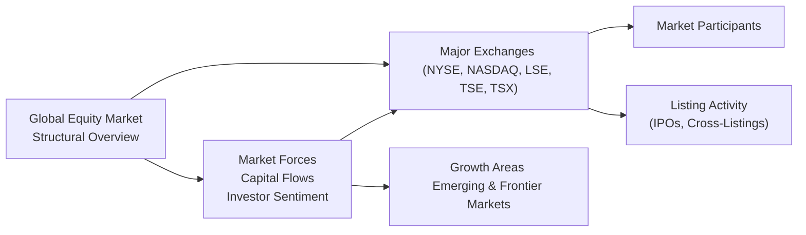

## 14.2 The Size of the Global Equity Market

Sometimes, I think about strolling through bustling city centers—like New York’s Times Square, London’s Canary Wharf, or Toronto’s Bay Street—and I'm struck by how each modern-day “hub” is a reflection of the massive global equities world we’re all a part of. The global equity market isn’t just a single “place,” but rather an ever-evolving network of stock exchanges, companies, investors, and regulators interacting across the globe. This section explores its size, how it’s measured (market capitalization), and why it matters for investors—from rookie traders to seasoned professionals.

### The Scope and Significance

When we talk about “the size of the global equity market,” we’re typically referring to the sum of all publicly listed companies’ market capitalizations around the world. In simple terms, if you multiply each listed company’s share price by the number of shares outstanding, and you take that result for all the companies in all the stock markets combined, you get the total global market cap.

Why is it such a big deal? Well:
• It’s a key barometer of economic influence and power.  
• It helps us see how investment flows, new stock listings (IPOs), and changes in investor confidence can shift the balance from one region to another.  
• It’s often used as a reference point for “market weighting,” or deciding how to allocate funds in a globally diversified portfolio.  

One personal anecdote I remember: My friend and I were chatting about how Apple and Amazon alone could dwarf entire national stock markets decades ago. That little chat hammered home to me just how massive certain companies can be—and how the balance of power in global equities is always on the move.

### Major Regional Markets

Although there are numerous stock markets worldwide, the global equity market is often dominated by a handful of major regional players. Let’s look at some of the biggest:

• United States: The U.S. is home to the New York Stock Exchange (NYSE) and Nasdaq—two giants that together represent an enormous slice of global market capitalization. Think of mega-cap tech names, and you’re almost always talking about U.S.-listed stocks (though other regions have their own homegrown giants too).  

• Europe: London Stock Exchange (LSE), Euronext, Deutsche Börse, and others anchor Europe’s financial presence. Despite economic fluctuations, European markets remain crucial, hosting global companies from sectors such as banking, pharmaceuticals, energy, and luxury goods.  

• Asia: Tokyo Stock Exchange (TSE) in Japan and the Shanghai and Shenzhen exchanges in China collectively account for a large chunk of global equity value. Hong Kong also stands out as both a gateway to mainland China and an international hub in its own right.  

• Canada: The Toronto Stock Exchange (TSX), part of the TMX Group, is a key player in resources (mining, energy, metals) and increasingly in tech as well. Many Canadian companies are globally recognized, and Canada’s stable political and regulatory environment draws both domestic and international investors.  

When you see stats about the global equity market, it’s eye-opening. The U.S. alone can sometimes account for around 40–50% of the total global market cap (the exact figure fluctuates), while the next few markets—China, Japan, the U.K., and Canada—make up a large portion of the rest. This distribution might shift over time as emerging and frontier markets take on more significance.

### Market Cap Dynamics Over Time

Market capitalization isn’t static. It changes constantly based on:

• Stock Price Fluctuations: If investor sentiment is bullish on tech, for instance, the market cap of certain tech-heavy exchanges (like Nasdaq) can surge, relative to other sectors or other countries.  
• Capital Flows: Large institutional investors (including pension funds, sovereign wealth funds, and asset managers) move billions of dollars across countries and regions. When large amounts of capital flow into a region, share prices can be driven higher.  
• Listing Activity: New IPOs add to the total market cap, while delistings or corporate bankruptcies can shrink it. Mergers and acquisitions have their own effect—sometimes consolidating widely held companies into one bigger entity.  
• Macroeconomic Factors: Interest rates, inflation, employment data, and economic growth forecasts can all tilt the scales, pushing money into or out of certain sectors and locations.  
• Geo-Political Tensions: Trade wars, regional conflicts, and political instability can cause investors to exit certain markets and bid up prices in safer havens.  

To show how dynamic market capitalization is, consider the COVID-19 pandemic period. At first, global equities declined sharply. But then, with economic stimulus programs, some sectors bounced back strongly. Tech soared, travel and hospitality slumped, and we saw new companies capturing investor attention. Today, even though markets continue to face volatility, global market cap remains in the multi-trillion dollar range, highlighting resilience and sheer scale.

### Role of Major Global Stock Exchanges

Stock exchanges are the public “marketplaces” where buying and selling shares happen. Each exchange has its own set of listing requirements, regulatory oversight, and distinct industry representation. Let’s name a few major ones:

• NYSE (New York Stock Exchange): Often considered the gold standard for institutional listings. Houses many of the largest companies in the world.  
• Nasdaq: Popular among technology firms. Home to some of the most famous and largest “growth” companies (think Apple, Microsoft, Amazon, Tesla).  
• London Stock Exchange (LSE): One of Europe’s oldest, featuring multinational energy, commodity, financial, and consumer goods companies.  
• Tokyo Stock Exchange (TSE): Widely recognized. Anchors the Japanese market, with big automotive, electronics, and industrial conglomerates.  
• TMX Group (TSX, TSXV): Dominates Canada’s equity landscape. Known for resource-based listings but also robust in financials, telecom, and technology.

Below is a simple flowchart that sums up the interrelationships between these major exchanges, market forces, and emerging regions in the global equity landscape:

It’s worth noting that each exchange’s dominance or popularity can shift over time. For instance, Hong Kong Exchanges and Clearing (HKEX) has seen significant interest as Chinese companies sought dual listings or aimed to raise capital abroad.

### Rise of Emerging Markets

The global equity market isn’t just about the established giants. Emerging markets—such as Brazil, India, and South Africa—have significantly increased in importance. Even smaller “frontier markets” (like Vietnam, Kenya, or Romania) sometimes show impressive growth rates and unique investment opportunities.

But let’s be honest: it’s not always smooth sailing. Emerging and frontier markets can be more volatile, subject to abrupt currency fluctuations, less mature regulation, and political uncertainty. That said, for investors seeking higher returns or diversification benefits, these markets can be quite appealing. Growth in these regions is frequently fueled by:

• Rapid urbanization and demographic shifts.  
• Technological adoption.  
• Rising middle classes with increasing purchasing power.  
• Government reforms that encourage foreign investment.  

At various times, we see big waves of capital rush into emergers in search of higher yields. In other periods, we see abrupt retreats. It’s an ongoing ebb and flow.

### Practical Considerations

If you’re thinking about investing globally (and “gosh, who isn’t?” might be your rhetorical thought if you’re seeking diversification), you’ll likely want to track the weighting of these major markets. A widely followed benchmark for global equities is often the MSCI All Country World Index (ACWI) or FTSE All-World Index. These indexes are market-cap weighted, meaning the biggest markets or biggest companies command the largest slice of the index.

Why do many people pay attention to these indexes?  
• They represent a broad “snapshot” of the world’s equity landscape.  
• Fund managers often measure their performance against these benchmarks.  
• They’re used by exchange-traded funds (ETFs), making it easy for retail investors to get broad exposure in a single product.

Meanwhile, for Canadian investors, it’s not just about going beyond the TSX. They might want to ensure they don’t miss out on growth in the U.S. or Asia. By tracking how slices of these indexes shift in size, they can decide if they want to be underweight or overweight particular regions.

### Market Weighting in a Global Portfolio

Market weighting is basically investing in line with each market’s share of the total global market cap. If the U.S. is 50% of global equities, a purely market-weighted global portfolio would have 50% of its funds in U.S. stocks. For some investors, that’s a simple and straightforward approach—no guesswork on which market might “beat” the others.

However, some prefer to deviate from market weights:

• Home Country Bias: Many Canadians hold a higher percentage of Canadian equities than a pure global weighting would imply. This is partly for familiarity and convenience—also, domestic regulatory and tax structures might present advantages.  
• Tactical Allocation: Others try to time market cycles or overweight markets they believe are undervalued. For instance, an investor might shift more funds into emerging markets if they think those markets are poised for outperformance due to favorable demographics or economic reforms.  

There’s no single correct method. It often depends on personal risk tolerance, investment objectives, and the investor’s overall strategy. If you ever find yourself puzzling over how to balance these exposures, just remember that diversification across multiple regions can help reduce the idiosyncratic risk tied to one particular market or economy.

### Glossary

• **Market Capitalization (Market Cap):** The total dollar value of a company’s outstanding shares. Summed across all listed companies within a market, it represents that market’s size.  
• **Stock Exchange:** An organized marketplace where securities (equities, bonds) are bought and sold. Each exchange has listing requirements and is typically overseen by a regulatory body.  
• **Emerging Markets:** Nations experiencing rapid growth and industrialization. They often have higher volatility but may offer potentially higher returns for those willing to take on more risk.  
• **Frontier Markets:** Even smaller and less accessible than emerging markets, with less-developed infrastructures. Still, they can offer unique diversification opportunities.  
• **Listing Activity:** The pace at which new stocks list via IPOs or cross-listings. It also includes companies moving from one exchange to another or delisting.  

### Canadian Regulations and Institutions

In Canada, the current self-regulatory organization, the Canadian Investment Regulatory Organization (CIRO), is responsible for overseeing investment dealers and mutual fund dealers nationwide. This is the result of a 2023 amalgamation of the former MFDA and IIROC, both of which are now defunct. If you’re dealing with a Canadian investment firm (a CIRO member), your assets typically have coverage from the Canadian Investor Protection Fund (CIPF)—Canada’s single investor protection fund.

### References for Further Exploration

• **World Federation of Exchanges:**  
  (https://www.world-exchanges.org)  
  Offers comprehensive global exchange data, listing info, and market statistics.  

• **Listings & Historical Data**  
  The **TSX (Toronto Stock Exchange)** and the **LSE (London Stock Exchange)** websites provide free historical market data, helping you track stock performance over decades.  

• **CSI (Canadian Securities Institute) Online Resources**  
  CSI provides valuable courses and modules on global market structures and strategies for international investing.  

If you’re curious about how each exchange stands in the global “pecking order,” these resources can give you a good bird’s-eye view. You’ll see how quickly or slowly the share of each region’s total market cap changes. It’s quite fascinating, especially when you notice how major world events—like a shift in Fed policy, a commodity price shock, or an emerging-market rally—cause the needle to move.

Ultimately, the global equity market is a colossal tapestry. By examining how and where it’s growing, you’ll be better equipped to make informed investment decisions—and hopefully avoid surprises. Markets are nothing if not dynamic, so keep your eyes open, stay updated on listing trends, watch macroeconomic signals, and remember: investing globally can offer diversification, but it also requires staying flexible and open-minded.

---

## Test Your Knowledge: Global Equity Market Essentials Quiz



### Which measure best represents the total size of a stock market?

- [ ] Earnings per share
- [x] Market capitalization
- [ ] Dividend yield
- [ ] Price-to-earnings ratio

> **Explanation:** Market capitalization (share price × number of shares outstanding) reflects how much a market (or individual company) is worth in dollar terms.

### Which region traditionally has the largest share of global equity market capitalization?

- [x] United States
- [ ] Europe
- [ ] Asia
- [ ] Canada

> **Explanation:** The U.S. typically represents the single largest slice of global market cap, though Europe, Asia, and Canada remain significant players.

### What primary factor causes market capitalization to change over time?

- [x] Fluctuations in stock prices, capital flows, and listing activity
- [ ] Marginal declines in GDP
- [ ] Movements in commodity prices alone
- [ ] None of the above

> **Explanation:** Market cap fluctuates with broader investor sentiment, new IPOs, delistings, and major shifts in supply–demand dynamics for equities.

### Which statement best describes emerging markets?

- [ ] Low-volatility, well-regulated markets that rarely change
- [x] Rapidly growing markets that can offer high returns but carry higher risk
- [ ] Markets that have stagnated and do not attract new investments
- [ ] Strictly North American markets

> **Explanation:** Emerging markets typically experience fast economic growth, making them more volatile but potentially more rewarding.

### Which is NOT a major global stock exchange?

- [ ] New York Stock Exchange (NYSE)
- [ ] London Stock Exchange (LSE)
- [x] Canadian Board of Commodities (CBC)
- [ ] Tokyo Stock Exchange (TSE)

> **Explanation:** The CBC is not a recognized global equity exchange like NYSE, LSE, or TSE.

### Why might someone choose to deviate from a simple market-weighted global portfolio?

- [x] They prefer to overweight or underweight specific markets
- [ ] Market weighting has no connection to actual market size
- [ ] It is illegal to own shares in certain markets
- [ ] Market weighting doesn’t exist

> **Explanation:** Many investors overweight or underweight markets based on their outlook, home bias, or strategic preferences.

### Which organization is Canada’s current self-regulatory body for investment dealers and mutual fund dealers?

- [ ] IIROC (Investment Industry Regulatory Organization of Canada)
- [ ] MFDA (Mutual Fund Dealers Association of Canada)
- [x] CIRO (Canadian Investment Regulatory Organization)
- [ ] MFDA IPC

> **Explanation:** Since 2023, CIRO has combined IIROC and MFDA into one self-regulatory organization in Canada.

### What does dynamic listing activity entail?

- [ ] Delistings and bankruptcies only
- [x] New IPOs, cross-listings, mergers, acquisitions, and occasional delistings
- [ ] Only interest rate changes by central banks
- [ ] Only bond listings

> **Explanation:** Listing activity covers many aspects, including new public offerings, cross-listings, and other changes in how companies are traded.

### How can emerging markets contribute to a global portfolio?

- [ ] They mostly track the Canadian market
- [x] They may provide higher growth potential combined with diversification benefits
- [ ] They are exclusive to North American investors
- [ ] They have fixed exchange rates always

> **Explanation:** Emerging markets can diversify a portfolio and may offer growth that outpaces developed economies, though the risks tend to be higher.

### True or False: The Toronto Stock Exchange (TSX) is primarily recognized for its resource-based listings, but it has diversified into other sectors like finance and technology.

- [x] True
- [ ] False

> **Explanation:** The TSX historically focused on resource listings, yet it now features substantial listings in finance, telecom, and the tech sector.


