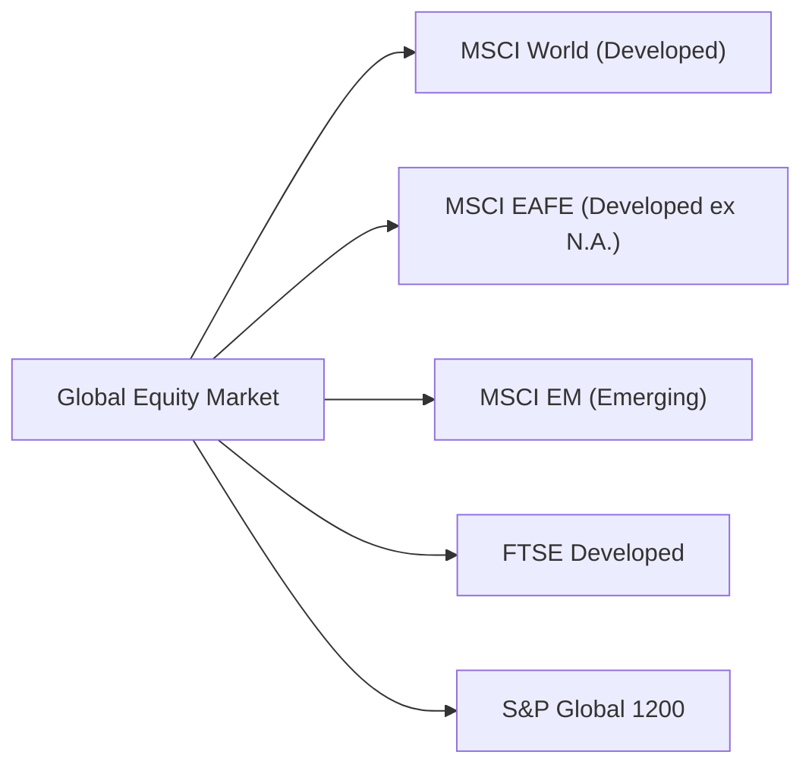

## 14.3 The Major International Equity Benchmarks

If you've ever peeked at the global equity market and wondered, "How do I sort through all these different stock markets around the world?"—you’re not alone. When I took my first serious look at international investing, I remember how intimidating it felt. I was like, "Wait, so there's this index for Europe, that index for emerging markets, and then some all-world index...which do I compare my portfolio against?" But hey, there's good news: global benchmark providers like MSCI, FTSE Russell, and S&P Global have spent decades refining robust indices—so you don’t have to create your own from scratch. In this section, we’ll walk through some major international equity benchmarks, how they're built, how they differ, and why they’re important.

We’ll focus on five big ones:

• MSCI World Index  
• MSCI EAFE Index  
• MSCI Emerging Markets Index  
• FTSE Developed Index  
• S&P Global 1200  

In addition, we’ll see that each index has its own personality, shaped by factors like sector weighting, geographic coverage, and weighting method (e.g., market capitalization, float-adjusted weighting, or specialized ESG weighting). After exploring these, we’ll check out specialized benchmarks, too—like those tailored to sustainability or particular regions. Throughout this chapter, keep in mind that measuring performance is only part of the puzzle. indices also offer a window into how different regions and sectors behave over time, which can significantly influence your asset allocation decisions.

---

### Why Are Global Equity Benchmarks So Important?

Let’s start with the “why.” If you’re an investment advisor in Canada or anywhere else, your clients might want to diversify beyond domestic markets. Sure, the Canadian market is robust, especially in sectors like financials, energy, and materials—but it doesn’t capture everything. International benchmarks help you see how the rest of the world’s markets are doing. They serve several key functions:

• Performance Measurement: If you have clients’ money invested in a global equity fund or you’ve built a custom basket of international stocks, you need a reference point to see whether you’re doing a decent job.  
• Strategic Allocation: Benchmarks can guide how you structure your portfolios. For example, if you’re leaning heavily into emerging markets, you might compare that portion of the portfolio’s performance to the MSCI Emerging Markets Index to see if you’re capturing the region’s growth.  
• Risk Management: By looking at multiple global indices, you can spot regional risk trends. You might see, for instance, that Asia-Pacific markets are struggling while North America is booming, prompting you to tweak allocations for better diversification.  
• Sector Composition Insights: Different benchmarks have different sector mixes. If you want exposure to technology or industrials, your chosen index might naturally weight these sectors more heavily.  

These benchmarks also matter from a regulatory perspective. In Canada, for instance, the Canadian Investment Regulatory Organization (CIRO) expects investment advisors to exercise diligence, which includes properly assessing and monitoring the performance of different asset classes (a rule historically covered by the MFDA and IIROC, now unified under CIRO). So as you look at global equity benchmarks, think about compliance, transparency, and how you’ll communicate these moves to your clients.

---

### Market-Cap Weighting, Float Weighting, and Other Index Construction Approaches

Before diving into each index, let’s quickly clarify how these benchmarks are typically structured:

• **Market-Cap Weighting**: Companies are weighted based on their total market capitalization. That means bigger companies (like a massive tech behemoth) play a more significant role in driving the index’s return.  
• **Float-Adjusted Market-Cap Weighting**: This is, you know, a tweak to the standard market-cap approach. The index provider only counts the shares actually available for public trading, excluding locked-in shares that won’t get traded on the open market.  
• **Equal Weighting**: Less common in major global benchmarks but worth mentioning. Each company gets the same weight regardless of size. This approach can sometimes tilt returns toward smaller companies compared to a market-cap index.  
• **Fundamental Weighting**: Sometimes, instead of focusing on market cap, an index might weigh companies by fundamentals like revenues, dividends, or book value. This is more “smart beta” territory.  

With that in mind, let’s explore the five big players in international benchmarks.

---

### MSCI World Index

The MSCI World Index might be the first index you think of when someone says, “global equities.” Despite its name, it mainly tracks large- and mid-cap companies across 23 developed markets. These markets include Canada, the United States, Western Europe, Japan, Australia, Hong Kong, and a handful of others. Emerging markets are not part of the MSCI World; for that, you need the MSCI Emerging Markets Index (we’ll get there in a moment).

#### Key Features

• **Coverage**: 23 developed countries, over 1,500 constituents.  
• **Weighting**: Float-adjusted market cap.  
• **Sector Composition**: Historically, the U.S. tends to carry the largest weighting (often 60% or more), so the index’s performance can be strongly influenced by what’s happening with major American corporations (especially technology).  

#### Why It Matters

If you want a barometer for developed-market performance outside your home country, or even in your home country if you live in a smaller country within the index, MSCI World is an excellent reference. It’s also widely used by Canadian advisors to track how developed economies overall are performing relative to Canada. Suppose your client has a globally diversified mutual fund or exchange-traded fund (ETF) that invests primarily in developed markets. In that case, it’s often benchmarked against the MSCI World.

---

### MSCI EAFE Index

Now, let’s talk about the MSCI EAFE Index, which stands for Europe, Australasia, and Far East (no direct coverage of North America here). This index is a classic measure of how developed markets outside North America perform. So, if you’re specifically curious about how non-U.S. developed markets—think Europe, Japan, Australia, and more—are doing, MSCI EAFE is your friend.

#### Key Features

• **Coverage**: 21 developed markets, excluding Canada and the U.S., but including Europe, Japan, Hong Kong, Australia, and others.  
• **Weighting**: Float-adjusted market cap.  
• **Sector Composition**: Heavier tilts towards financials, industrials, and consumer goods (especially in Europe), and also includes a substantial portion of Japan’s top corporations (heavy automotive and electronics).  

#### Using MSCI EAFE as a Benchmark

Advisors often compare a portfolio’s non-North American developed equity portion against MSCI EAFE. For instance, if you hold a diversified international fund that excludes the U.S. or Canada, the EAFE Index might give you a sense of how well your investments are performing relative to other developed countries. Some might note that emerging markets aren’t included, so if you hold emerging stocks, you’d have to benchmark them separately.

---

### MSCI Emerging Markets Index

Emerging markets sometimes feel like a rollercoaster: big gains in boom years, bigger drops in bust years. The MSCI Emerging Markets (EM) Index is the go-to reference for large- and mid-cap companies across around 24 emerging market countries, including biggies like China, India, and Brazil.

#### Key Features

• **Coverage**: Over 1,400 constituents across 24 emerging economies.  
• **Weighting**: Float-adjusted market cap.  
• **High Growth Potential**: Emerging markets can experience rapid GDP expansion, but also volatility from currency swings, political instability, and sector concentration.  

#### Sector Composition and Geographic Breakdown

MSCI EM can have a sizable chunk in technology and internet companies (especially from China and South Korea), large state-owned enterprises in energy or financials, and consumer-focused firms in regions with rising middle-class populations. The index’s performance might move significantly based on global liquidity conditions and commodity cycles (since many emerging economies export raw materials).

#### Why This Matters to Canadian Investors

Historically, Canadian investors have had a strong home-country bias. That’s not necessarily bad, but you might miss out on growth from emerging nations. The MSCI EM Index is a compass guiding you in how fast-growing markets are doing relative to more stable developed ones. Carefully weigh the risk tolerance of your client when venturing into EM waters, given the higher volatility.

---

### FTSE Developed Index

Like MSCI, FTSE Russell, another pillar in the indexing world, publishes a wide range of benchmarks. One of their top-level indices is the FTSE Developed Index, which covers developed markets around the globe. Think of it as somewhat similar to the MSCI World, but from the FTSE vantage point.

#### Key Features

• **Coverage**: Large- and mid-cap stocks from developed markets. The specific country list might differ slightly from MSCI’s classification, although it’s largely overlapping.  
• **Weighting**: Float-adjusted market cap.  
• **Comparator**: If you see a fund that says it tracks the “FTSE Developed Index,” it’s just another lens on global developed markets, comparable in scale to MSCI World.  

#### Sub-Indices and Breakdown

FTSE also offers many sub-indices. For example, you might find the FTSE Developed Europe Index or the FTSE Developed Asia Pacific Index if you want a narrower geographic focus. Advisors sometimes prefer one provider over another (MSCI vs. FTSE) for reasons like historical performance track records, sector allocations, or personal preference. But functionally, they serve similar roles.

---

### S&P Global 1200

The S&P Global 1200 is a bit of a catch-all, combining seven regional indices (like the S&P 500 for the U.S., S&P Europe 350, S&P/TOPIX 150 in Japan, etc.) to form a single global snapshot. It includes about 70% of the world’s market capitalization. If you’re used to referencing the S&P name (which is huge in North America), this global version extends the brand internationally.

#### Key Features

• **Coverage**: Over 1,200 companies, covering around 70% of global market cap.  
• **Regional Building Blocks**: It’s a composite of many S&P indexes, so it ties neatly into the S&P 500 or S&P/TSX 60 for Canada, for instance.  
• **Comparison**: In some cases, you might see differences in composition compared to MSCI or FTSE because S&P has its own proprietary index rules regarding selection, liquidity, and weighting.  

#### Role in Benchmarking

Because S&P is a well-known name, some global funds or managers might use the S&P Global 1200 to benchmark performance. It gives a straightforward, if somewhat large-cap dominated, view of the overall global market.

---

### How Index Composition Influences Returns

Sector tilts and geographic exposures can drastically change the story you get from these benchmarks. If you look at the MSCI EAFE vs. the MSCI World, for example, the difference is primarily:
- The World Index includes North America (with hefty U.S. weightings in technology, healthcare, and consumer discretionary).  
- The EAFE is more about Europe and Asia-Pacific, which historically have different sector strengths and economic cycles.  

#### Technology vs. Financials

During the 2010s, technology stocks in the U.S. soared, powering the returns of indices with a heavy U.S. weighting. On the other hand, benchmarks more tilted toward Europe or Japan might have lagged if financials and industrials underperformed. Then there are times, especially after certain crises, where financial stocks may rebound strongly and outdo growth tech names. So it can swing back and forth.

#### Currency Effects

Another subtlety is that these indices measure returns in a base currency, often U.S. dollars. As a Canadian investor, you also have to consider currency fluctuations. The same index return can look very different once you convert it into Canadian dollars. This is why currency-hedged versions of some indices exist.

#### Regional Economic Cycles

A region’s weighting to cyclical (industrials, materials) vs. defensive (utilities, healthcare) sectors can amplify or dampen swings depending on the global economic environment. During a commodity super-cycle, for instance, markets with heavy resource exposure might benefit more than a heavily technology-oriented index.

---

### Specialized and Sustainability-Focused Benchmarks

By the way, if sustainability or Socially Responsible Investing (SRI) is important to you or your clients, you might look at specialized indices. One prominent example is the MSCI World ESG Leaders Index, which selects companies with high environmental, social, and governance (ESG) performance relative to sector peers. Another is the FTSE4Good series.

#### Why Do They Exist?

Investors are increasingly mindful of corporate governance, climate issues, and social impact. Creating an ESG or sustainability-focused index is one way to measure how well "green" or "responsible" companies are doing. Plus, some institutional investors must follow ESG mandates from pension committees or endowments. If your client wants to avoid certain industries (think tobacco, weapons, etc.), an ESG index can help guide that selection.

#### Considerations for Performance

Sometimes ESG indices deviate from conventional benchmarks. They might underweight, say, energy or materials if they consider those sectors less sustainable. This tilt can lead to performance differences—for better or worse—so it’s important to evaluate whether an ESG or SRI approach aligns with your client’s overall goals.

---

### Comparing Long-Term Performance

If you line up the MSCI World, MSCI EAFE, MSCI EM, FTSE Developed, and S&P Global 1200 over a decade, you’ll notice patterns:
- **MSCI World** and **S&P Global 1200** can show strong correlations, given they both heavily feature large-cap developed corporations.  
- **MSCI EAFE** often trails the world or global indices in recent decades due to the outperformance of the U.S. market. That’s not always the case if we look further back in time; cycles can shift.  
- **MSCI EM** can have periods of explosive growth, but also big drawdowns.  

It’s crucial to keep in mind that past performance doesn’t guarantee future results—just because EAFE lagged in certain periods, or EM soared in others, doesn’t mean the future will replicate that pattern exactly. Market cycles, interest rates, trade dynamics, and a zillion other factors can swing it in a new direction.

---

### Using These Benchmarks as a Canadian Advisor

Under CIRO regulations (which consolidated the historical MFDA and IIROC frameworks), advisors are responsible for ensuring that recommended portfolios are suitable. Part of “suitability” is not just picking a random global fund, but actually showing your client how it fits their objectives and risk tolerance. Global benchmarks provide reference points to show whether these products are delivering the expected international exposure—and if they’re performing reasonably compared to global market trends.

On top of that, the Canadian Investor Protection Fund (CIPF) stands behind clients’ assets with member firms—so it’s not directly about the benchmark, but it underscores that your responsibility is to keep your client informed about the nature of their investments. If you claim that your client’s global equity position will be measured against, say, the MSCI World, you need to keep that measurement consistent. Because at the end of the day, no one wants to be left scratching their head, going, “Why does my portfolio’s benchmark performance look so different from what I see on the news?”

---

### Putting It All Together with a Visual

Let’s visualize how these major benchmarks fit together under the umbrella of global equity markets. The diagram below is just a conceptual overview, not a strict hierarchy.

Explanations:  
• A is our wide universe of all global equities.  
• B, C, D, E, and F each represent an index capturing different segments or approaches: some with purely developed markets, some focusing on emerging ones, and some that combine them in various ways.

---

### Practical Examples and Case Studies

• **Case Study: Currency Hedged vs. Unhedged**  
  Let’s say you bought an ETF tracking the MSCI EAFE in Canadian dollars. If the Canadian dollar appreciates significantly against major currencies (euro, yen, etc.), your returns might look lower in CAD terms than they would to a U.S.-dollar-based investor. Some “CAD-hedged” versions of EAFE ETFs aim to neutralize that currency effect. But hedging can come at a cost (including administrative fees and potential tracking errors).

• **Case Study: Sector Bias in MSCI World**  
  An investor noticed that their global equity fund (tied to MSCI World) soared in 2020–2021 because of its strong tilt to U.S. tech companies, which carried a giant weight. They concluded that even though it’s a “world” index, the U.S. effectively drives performance. Realizing this, the investor might add a more diversified approach or add some specific exposure to international markets that aren’t U.S.-heavy.

• **Case Study: Emerging Markets Overweight**  
  Imagine a client is bullish on long-term growth in Asia. They ask to overweight emerging markets relative to a standard global benchmark. If you benchmark that portion of the portfolio to MSCI EM, you’ll likely see more volatility. They need to understand that while the potential is higher, short-term dips can be painful. Setting the correct expectations is part of the role, guided by the right choice of index.

---

### Common Pitfalls and Best Practices

1. **Relying on the Wrong Benchmark**: Some people might compare a North American-heavy portfolio to the MSCI EAFE, which doesn’t include North America. The mismatch can produce misleading conclusions. Always align the benchmark with your portfolio’s actual geographic and sector exposures.

2. **Overlooking Sector Composition**: Index construction matters! If you load up on technology stocks but benchmark yourself to an index where technology is only 10%–15%, you might see big performance gaps. That gap isn’t necessarily “alpha”—it might just be that you’re in a different sector universe.

3. **Ignoring Currency Risk**: International benchmarks typically measure performance in U.S. dollars. If you’re a Canadian investor, currency swings can either amplify or reduce gains. Decide whether you want that currency exposure or if it should be hedged. 

4. **Chasing Past Performance**: Don’t just pick the index (and by extension, the region) that performed best in the last few years. Remember, markets are cyclical. The outperforming region of the past five years might become the underperformer of the next five. Diversification remains key.

5. **Insufficient Regulatory Consideration**: Advisors must keep CIRO’s guidelines in mind when recommending international products. Suitability, KYC (Know Your Client), and ongoing performance monitoring are critical. CIRO’s resources at https://www.ciro.ca provide the latest updates on compliance requirements.

---

### Additional Resources and References

To wrap up, here are some places to dig deeper:

• **MSCI (https://www.msci.com)**: Index methodology documents and performance data.  
• **FTSE Russell (https://www.ftserussell.com)**: Index fact sheets, rules, and ongoing updates for FTSE indices.  
• **S&P Global (https://www.spglobal.com)**: Offers the S&P Global 1200, among many detailed benchmarks and ESG indices.  
• **CIRO (https://www.ciro.ca)**: Canada’s national self-regulatory organization for investment dealers and mutual fund dealers.  
• **Open-Source Financial Analysis Tools**: Consider exploring libraries in Python (e.g., pandas, NumPy) or R (e.g., Tidyverse) to compare different indices historically, track correlations, and backtest strategies.  

If you’re curious about local Canadian benchmarks, recall that the S&P/TSX Composite or S&P/TSX 60 track Canadian equities. Mix and match them with global indices for a well-rounded picture.

---

### Final Thoughts

International equity benchmarks are like signposts. They tell you where you are—are you over- or underperforming what the world is doing, or focusing on certain regions or sectors? They also help you plan where you want to go. Younger clients sometimes want a heavier tilt to emerging markets for growth, while older clients might prefer the relative stability of developed markets. By knowing the strengths and limitations of each major index—MSCI World, MSCI EAFE, MSCI EM, FTSE Developed, and S&P Global 1200—you can build informed, transparent strategies that align with your clients’ objectives.

And that’s it, folks—your grand tour of the major international equity benchmarks. Trust me, next time someone drops an acronym like “MSCI EAFE,” you’ll be able to say, “Yeah, I know exactly what that is and how it’s used. Let's make sure that’s the right fit for our portfolio, given your goals.” And that’s a great place to be.

---

## Test Your Knowledge: Major International Equity Benchmarks



### Which of the following statements best describes the MSCI EAFE Index?

- [ ] It only covers emerging market stocks.  
- [x] It covers developed markets in Europe, Australasia, and the Far East, excluding the U.S. and Canada.  
- [ ] It is equally weighted among all countries.  
- [ ] It is a sustainability-focused index exclusively.  

> **Explanation:** The MSCI EAFE Index measures the stock performance of developed markets outside North America, specifically Europe, Australasia, and the Far East.

---

### Which global benchmark is composed of seven regional indices, including the S&P 500 and S&P Europe 350?

- [ ] FTSE Developed Index  
- [x] S&P Global 1200  
- [ ] MSCI Emerging Markets Index  
- [ ] MSCI EAFE Index  

> **Explanation:** The S&P Global 1200 pulls together multiple S&P indices from different regions, offering broad global coverage.

---

### What is one main difference between the MSCI World Index and the MSCI EAFE Index?

- [x] MSCI World includes North America, while MSCI EAFE excludes it.  
- [ ] MSCI World is only for small-cap stocks.  
- [ ] MSCI EAFE has more exposure to U.S. tech.  
- [ ] MSCI World is an ESG-only index.  

> **Explanation:** MSCI World covers 23 developed markets including the U.S. and Canada, while MSCI EAFE focuses on developed markets excluding North America.

---

### Which of the following is a potential advantage of float-adjusted market-cap weighting in an index?

- [x] It minimizes the impact of locked-in shares not available for trading.  
- [ ] It guarantees higher returns than a standard market-cap weight.  
- [ ] It excludes large-cap technology stocks.  
- [ ] It tracks only frontier markets.  

> **Explanation:** Float-adjusted market-cap weighting considers only the shares available for public trading, reducing the influence of restricted shares on index performance.

---

### Why might Canadian investors consider currency-hedged ETF versions of an international equity benchmark?

- [x] To mitigate the impact of CAD/USD (or other currency) fluctuations on returns.  
- [ ] To attract more foreign investors to Canada.  
- [x] To stabilize performance in times of exchange rate volatility.  
- [ ] To increase portfolio risk significantly.  

> **Explanation:** Currency-hedged ETFs attempt to remove or reduce currency risk, which can be significant when investing in other countries with different currencies.

---

### If a portfolio is heavily overweight U.S. technology stocks, which global index would likely provide the closest performance comparison?

- [x] MSCI World Index  
- [ ] MSCI EAFE Index  
- [ ] MSCI Emerging Markets Index  
- [ ] FTSE Frontier Index  

> **Explanation:** MSCI World has a large U.S. weighting and covers major developed market tech names, making it a better benchmark for a portfolio overweight in U.S. technology.

---

### Which index would an investor most likely use to gauge the overall performance of large- and mid-cap stocks specifically in developing economies?

- [x] MSCI Emerging Markets Index  
- [ ] MSCI EAFE Index  
- [x] MSCI World Index  
- [ ] S&P Global Infrastructure Index  

> **Explanation:** The MSCI Emerging Markets Index is the recognized benchmark for large- and mid-cap stocks across developing nations.

---

### In general, why might an ESG-focused global equity benchmark differ in performance from its non-ESG counterpart?

- [x] The ESG benchmark may exclude or underweight certain industries, creating different sector exposures.  
- [ ] ESG benchmarks always deliver higher returns by law.  
- [ ] ESG benchmarks do not allow mid-cap or small-cap stocks.  
- [ ] ESG benchmarks are not influenced by global economic cycles.  

> **Explanation:** ESG indices exclude or reduce exposure to certain “non-ESG-friendly” industries, thus impacting sector allocation and potentially altering performance outcomes.

---

### Which statement about sector composition and index returns is correct?

- [x] Indices weighted heavily in technology may perform differently than those weighted in financials or materials, depending on the economic cycle.  
- [ ] Sector composition never affects returns in a material way.  
- [ ] Technology always outperforms other sectors in every cycle.  
- [ ] Financials never contribute to index returns significantly.  

> **Explanation:** Sector weightings in an index (e.g., tech vs. financials vs. materials) can significantly boost or drag returns based on prevailing market conditions.

---

### True or False: In Canada, the term CIRO refers to the current national entity overseeing investment dealers, mutual fund dealers, and market integrity on public exchanges.

- [x] True  
- [ ] False  

> **Explanation:** As of 2023, CIRO is the new self-regulatory organization that replaced the former MFDA and IIROC, overseeing both investment and mutual fund dealers.


