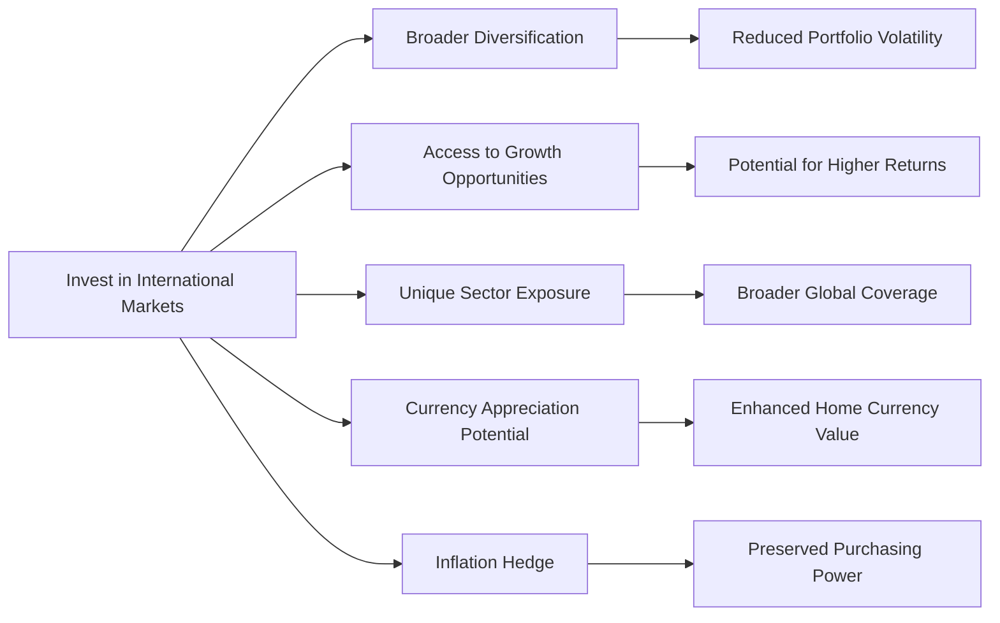

## 14.4 The Primary Advantages of International Investing

Investing internationally can feel, well, a bit intimidating. You’re not just dealing with companies in your own backyard anymore—suddenly, you’re considering political events in South America, market booms in Southeast Asia, or currency shifts in Europe. That’s a lot to take in, right? Trust me, as someone who once placed a small (and, let’s be honest, somewhat clueless) investment in a Brazilian utility company just because I was traveling through the country, I understand how overwhelming it can feel. But I also discovered that going global can offer exciting opportunities for long-term growth, protection against domestic downturns, and even potential currency gains.

In this section, we’ll walk through the primary advantages of international investing, giving you a deeper understanding of why blending foreign holdings into a portfolio might be beneficial—even if it feels slightly more complex at first glance. We’ll define a few important terms along the way (like "volatility" or "emerging economy") and mention resources like the Bank of Canada and the World Bank, so you’ll know where to turn when you’re ready to go deeper. And hey, if you can combine a week in Paris with a bit of on-the-ground market research, that’s not too bad either!

### Broader Diversification

One of the most significant benefits of international investing is the chance to diversify your portfolio beyond your home market. When we talk about diversification, we’re referring to the process of spreading your investments across various assets, industries, and regions. If you read Chapter 16: Managing Your Client’s Investment Risk, you’ll see that diversification is one of the most tried-and-true methods for managing volatility—defined as the dispersion of returns for a given security or market index—and that principle applies globally as well.

• Domestic Bias vs. Global Approach: Many investors stick primarily to their home country’s market, sometimes out of familiarity or convenience—this is often called a “home bias.” However, when domestic markets take a downturn, portfolios that lack global diversification can be hit hard. By investing in multiple countries, you reduce your dependence on the economic fate of a single nation.

• Uncorrelated Markets: Ideally, different geographical markets don’t always move in lockstep. When the Canadian market is down, another region—say, parts of Asia or Europe—might be booming, which can help smooth out your overall portfolio returns.

• Reducing Portfolio Volatility: By holding a mix of stocks, bonds, or managed products from around the world, you could experience fewer severe dips in your portfolio’s value. Of course, there are no guarantees, and markets can become correlated during global crises, but in general, an international spread can help mitigate extreme fluctuations.

Below is a simple flowchart illustrating how investing in international markets can create multiple pathways toward enhanced diversification and risk mitigation:

This diagram shows just how interlinked the benefits can be. It all starts with the decision to look globally.

### Access to Growth Opportunities

Imagine you’re living in a country with a mature economy. Your local market might be steady, but it may also be slow-growing. Meanwhile, there could be emerging economies—defined as those transitioning from lower income levels to higher growth and industrialization—that are demonstrating above-average GDP growth.

• Emerging Markets as Growth Engines: Brazil, India, and parts of Africa have been identified at times as key “emerging” regions. Companies in these areas can sometimes experience rapid growth due to industrialization, increased consumer spending, and export expansion. An investor who tapped into India’s tech services boom in the early 2000s, for instance, might have seen impressive returns.

• Global Shifts in Consumer Demand: Different economic cycles can boost specific regions at different times. For instance, commodity-rich nations can thrive when global commodity prices rise. If the price of metals or energy surges, a mining-centric economy may see increased investment opportunities.

• “Sweet Spots” in the Economic Cycle: Some investors aim to capture the peak growth phase of foreign markets. Of course, predicting these turning points can be tricky, but the appeal of earning higher returns than one might achieve in a slow-growth domestic environment remains a key draw of international investing.

### Exposure to Unique Sectors

You might have heard that certain countries specialize in specific industries. For example, South Korea is well-known for its consumer electronics and biotech industries, while Australia has a strong raw materials and mining sector.

• Sector Specialization: Gaining exposure to these specialized areas can be valuable if such industries are underrepresented in your home market. If you’re in Canada, you might have robust exposure to energy or financial services—two large sectors on the Toronto Stock Exchange (TSX)—but less so to cutting-edge biotech or consumer electronics.

• New Frontiers in Technology: Foreign markets often produce innovations that can lead to disruptive changes at home. Investing in a Chinese e-commerce platform or an Australian lithium producer, for instance, introduces entirely new dimensions to your portfolio.

• Balancing the Industry Mix: By diversifying across different sectors globally, you might balance industries that are cyclical in nature, like resources, with those that are more consumer-driven or technology-focused. This helps smooth out the bumps when certain industries face headwinds or cyclical downturns.

### Currency Appreciation Potential

Currency plays a bigger role in international investing than many people realize. A straightforward definition: currency appreciation is an increase in the value of one currency relative to another. If your home currency depreciates, your international holdings might become more valuable when converted back.

• Exchange Rate Dynamics: Let’s say you’re a Canadian investor who has purchased shares in a U.S. technology company, and the U.S. dollar appreciates significantly. Even if the share price remained flat in U.S. dollar terms, you could gain in Canadian dollars simply because of the exchange rate move.

• Hedging Strategies: Exchange rates can cut both ways. A strengthening home currency can reduce returns from foreign holdings. That’s why some investors use hedging vehicles like currency futures or options—techniques we talk about more in Chapter 16, “Managing Your Client’s Investment Risk.”

• Real-World Example: During various periods, the Canadian dollar has fluctuated widely against the U.S. dollar. Personally, I remember feeling quite pleased when my holdings in some European pharmaceutical companies jumped in value in Canadian currency terms, not because they skyrocketed on their local exchange, but because the euro strengthened over that period.

### Inflation Hedge

Inflation is like that uninvited party guest who shows up inevitably. It erodes purchasing power—how many goods or services you can buy with a given currency unit. Investing internationally can sometimes act as a hedge against inflationary pressures at home.

• Different Inflation Rates: Suppose you live in a country experiencing higher inflation. Investing in countries with lower inflation rates might help preserve your portfolio’s overall purchasing power.

• Commodity and Resource Plays: Some foreign countries produce critical resources—think of oil and precious metals. These resources tend to have intrinsic value that keeps pace with, or even outpaces, inflation, which can protect your investment’s purchasing power.

• Preferring Stable Currencies: If you’re holding a portion of your portfolio in regions with stable or appreciating currencies, you may experience less erosion from rising prices at home. This can help protect your long-term wealth, especially critical for retirement planning.

### Best Practices and Common Pitfalls

Even though all these advantages sound tempting—seriously, who doesn’t want more growth and currency gains?—international investing does come with considerations:

• Political and Regulatory Risks: Some countries have unstable political environments or inconsistent regulatory frameworks. Always monitor changes or potential changes in government leadership, taxation, or capital controls.

• Liquidity Concerns: Not all markets are as liquid as major North American exchanges. If a market is less frequently traded, it could be harder to buy or sell shares quickly at a favorable price.

• Cultural and Ethical Considerations: In Chapter 14.12, “Cultural and Ethical Considerations in International Markets,” we discuss how cultural norms, governance standards, and ethical business practices can vary vastly. It’s important to evaluate foreign companies with an understanding of local business culture and ethics.

• Currency Risk: A big one. Yes, it can be an advantage, but it can also sap your returns if your home currency strengthens. A well-thought-out currency hedging strategy, if appropriate, can help mitigate these effects.

• Over-Diversification: While diversification is generally a good thing, too many international holdings might dilute your portfolio and make it unwieldy to manage.

• Tax Implications: If you’re a Canadian investor, for example, be aware of any withholding taxes on foreign dividends, as well as your obligations under Canadian tax law or under any tax treaties Canada has with other countries. Chapters 15: “International Taxation” and 17: “Impediments to Wealth Accumulation” provide further details on how international investments can affect your tax profile.

### Incorporating International Investments into a Portfolio

• Start Small: You don’t need to jump in with both feet. An Exchange-Traded Fund (ETF) focusing on a particular region or sector can be a good first step, letting you test the waters before you increase your allocation.

• Evaluate the Right Mix: The perfect “international mix” depends on your risk tolerance, investment timeline, and financial goals. Younger investors with a longer horizon often assume more risk, thus may invest in faster-growing emerging markets, while those nearing retirement might prefer stable, developed economies or less volatile instruments.

• Use Research Tools and Data: Stay informed about global trends by referencing organizations like the World Bank (https://www.worldbank.org) for global economic indicators, or the Bank of Canada (https://www.bankofcanada.ca) for foreign exchange rates, trends, and research on economic conditions.

• Professional Advice: Consider consulting a licensed professional (registered with the Canadian Investment Regulatory Organization (CIRO)) to navigate complex foreign regulations, taxes, and investment vehicles. With the amalgamation of the former MFDA and IIROC into CIRO, there’s now a single national self-regulatory organization focused on investor protection and market integrity.

### Real-World Example: The Case of Emerging Asia

A Canadian-based investment advisor, let’s call her Samantha, was helping several clients reduce their concentration in domestic financial and resource stocks. Samantha studied countries across Southeast Asia that were experiencing economic transformations, notably in technology infrastructure. She recommended a diversified ETF that tracked an index of information technology and consumer goods companies in multiple Asian emerging markets.

Over the following five years, this ETF outperformed the Canadian benchmark, thanks to robust growth in e-commerce and mobile payments across the Asian region. Even with some local political uncertainties, currency movements against the Canadian dollar turned out favorable. The clients’ portfolios benefited both from sector representation in areas that were lacking in their Canadian holdings and from an overall reduced correlation with domestic market fluctuations.

### Helpful Resources

• Bank of Canada (https://www.bankofcanada.ca): Track exchange rates, access economic research, and stay informed about monetary policy.  
• World Bank (https://www.worldbank.org): Provides country-specific economic growth forecasts, development indicators, and insights into emerging markets.  
• “Investment Analysis and Portfolio Management” by Frank K. Reilly and Keith C. Brown: A comprehensive academic treatment covering portfolio theory and security valuation, including international investments.  

### In Summary

International investing is both an art and a science. It opens the door to broader diversification, fresh growth opportunities, unique sector exposure, currency appreciation, and an often-overlooked hedge against inflation. Sure, it’s more complex, and yes, you need to keep an eye on everything from political climates to currency fluctuations. But these are precisely the elements that can make an international allocation such a potent addition to a well-rounded investment portfolio.

With a smart, research-based approach—and maybe a bit of traveling to do some field research firsthand—you can tap into the advantages of international investing and give your portfolio a global edge.

---

### Glossary

• Volatility: A statistical measure of the dispersion of returns for a given security or market index.  
• Emerging Economy: An economy transitioning from low income to higher growth, industrializing rapidly, and often demonstrating above-average GDP growth rates.  
• Currency Appreciation: An increase in the value of one currency relative to another.  
• Purchasing Power: The quantity of goods and services that can be purchased with a given unit of currency.

---

## Test Your Knowledge: International Investing Advantages



### Which of the following best describes a key reason to invest internationally for broader diversification?

- [ ] It ensures returns are always higher than domestic markets.  
- [ ] It eliminates all currency risk.  
- [x] It reduces the dependence on a single economy.  
- [ ] It guarantees short-term profits regardless of global events.  

> **Explanation:** Investing across multiple countries helps reduce reliance on a single domestic market. This can smooth overall portfolio returns, although it doesn’t guarantee higher returns or eliminate currencies risks.

### In the context of emerging economies, what makes them particularly attractive for investors?

- [x] They often exhibit higher-than-average GDP growth.  
- [ ] They have zero volatility.  
- [ ] They impose minimal regulatory oversight on foreign investors.  
- [ ] They are fully immune to currency fluctuations.  

> **Explanation:** Emerging economies are transitioning to higher income levels and industrializing rapidly, which may lead to faster economic growth. However, they are not free of volatility or currency risks.

### Why might unique sector exposure be a compelling motivator for international investing?

- [ ] All foreign companies are cheaper.  
- [ ] It allows for automatic currency hedging.  
- [x] Some foreign markets specialize in sectors underrepresented in your home market.  
- [ ] It completely removes market risk.  

> **Explanation:** Certain countries have strong representation in specific industries (e.g., raw materials in Australia), allowing investors access to sectors they might not get domestically.

### How can currency appreciation impact your returns as a Canadian investor with foreign holdings?

- [x] When the foreign currency appreciates relative to the Canadian dollar, your returns can increase.  
- [ ] Appreciation reduces the value of foreign assets in your portfolio.  
- [ ] It always guarantees higher interest payments.  
- [ ] It immediately eliminates inflation risk.  

> **Explanation:** If the foreign currency becomes stronger against the Canadian dollar, any gains (or even flat performance) in the foreign market might be amplified when converted back into CAD.

### In terms of inflation hedging, why could international investing be especially valuable?

- [x] Certain foreign markets or currencies may experience lower inflation rates than your home market.  
- [ ] It removes the need for financial regulation.  
- [x] Commodity exporters often see asset values grow when inflation rises.  
- [ ] It guarantees a stable price level in any currency.  

> **Explanation:** Investing in countries with lower inflation or in assets like commodities can help protect purchasing power. Commodity-producing countries often benefit from higher global prices.

### What is a primary risk associated with international investing?

- [x] Political and regulatory changes can be unpredictable in foreign countries.  
- [ ] Guaranteed high rates of return.  
- [ ] Elimination of foreign withholding taxes.  
- [ ] Inability to invest in diversified funds.  

> **Explanation:** Political instability or shifting regulations in overseas markets is a shared concern among international investors. This unpredictability adds an extra dimension of risk.

### A Canadian investor purchasing a Japanese equity fund without any currency hedge is most exposed to which factor?

- [x] Fluctuations in the Japanese yen versus the Canadian dollar.  
- [ ] Canadian accounting standards.  
- [x] Japanese corporate default risk exclusively.  
- [ ] Immune to changes in global commodity prices.  

> **Explanation:** Without hedging, the investor will be fully exposed to currency risk (CAD/JPY). Any fluctuations can affect returns when converting them back into Canadian dollars.

### What could lead to over-diversification in an international portfolio?

- [x] Holding so many foreign assets that the portfolio becomes unmanageable and diluted.  
- [ ] Strictly focusing on one foreign market.  
- [ ] Only investing in well-known tech giants.  
- [ ] Allocating your entire investment to local resources.  

> **Explanation:** When you add too many international positions, it can become cumbersome to monitor them properly, and the impact of each holding might be minimal.

### Which organization is a good source of country-specific economic data for international investing research?

- [x] The World Bank (https://www.worldbank.org)  
- [ ] The local hockey league website  
- [ ] Unofficial social media pages  
- [ ] Tourist review platforms  

> **Explanation:** The World Bank provides reliable, comprehensive data on economic development, growth forecasts, and more, helping investors assess a country’s economic health and stability.

### True or False: The Canadian Investment Regulatory Organization (CIRO) now oversees investment dealers, mutual fund dealers, and market integrity, replacing the former MFDA and IIROC.

- [x] True  
- [ ] False  

> **Explanation:** As of January 1, 2023, MFDA and IIROC amalgamated into a single entity, CIRO. This is Canada’s national self-regulatory body for the investment industry.


