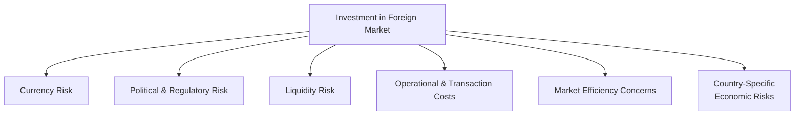

## 14.5 The Primary Disadvantages and Risks of International Investing

Investing outside one’s home market can be thrilling—there’s the allure of untapped growth opportunities, portfolio diversification benefits, and the chance to participate in innovative global industries. But, well, let's be honest: international markets can also present a whole new world (pun intended) of risk factors and challenges. One of my friends once joked that venturing into foreign markets feels like going on vacation without looking at the weather forecast. Sometimes you’ll get sunny skies, but other times you’ll be caught in a thunderstorm with no umbrella. No matter how exciting the potential, it’s important to be prepared for the downsides so your hard-earned capital doesn’t get blindsided. 

Below, let’s break down some of these risks into understandable pieces. We’ll also explore practical strategies to mitigate them—remember, being informed is half the battle. Refer to the preceding sections (for example 14.1 through 14.4) for the advantages of international investing, as well as frameworks for effective analysis of global opportunities.

---

### Currency Risk

Currency risk is often the first thing that springs to mind when we talk about investing overseas. This one’s huge: you may purchase a foreign stock that skyrockets in its local market, only to see much of those gains evaporate once you convert back to your home currency. On the flip side, a favorable fluctuation in exchange rates can amplify returns, but double-edged swords can cut both ways.

A quick example: If you live in Canada and invest in a British company, you’ll need to convert Canadian Dollars (CAD) into British Pounds (GBP) to buy shares. Suppose the GBP declines relative to the CAD during your holding period. Even if your British investment soared in GBP terms, your actual return measured in CAD might be flat or, worst case, negative. Whenever you see the term “exchange rate”—which is simply the price of one currency in terms of another—understand it can dramatically boost or slash your returns in an instant.

The next Mermaid diagram summarizes this flow:

In this diagram:  
• A is where you start with your home currency.  
• B is the step of converting and investing internationally.  
• C shows the performance of the foreign asset in its local currency.  
• D captures what happens when you convert back to your home currency.  
• E is the final realized return, which might be quite different from the asset’s “raw” performance.

#### Managing Currency Risk
• Some investors use hedging strategies, like forward contracts or currency futures, to lock in an exchange rate for a future date.  
• Others accept the volatility in the hope of potential currency gain.  
• Evaluate the cost of currency hedges against the size of your potential risk. If hedging fees eat up too much of your expected return, that might negate the benefits of the currency strategy altogether.

CIRO Investor Education often provides guidelines on evaluating currency risks and how such hedging tools work in practice. Although hedging can reduce downside swings, it can also limit your upside. The right approach depends on your risk tolerance.

---

### Political & Regulatory Risk

Governments around the world can change. Regulations shift. Policies that once supported foreign direct investment can vanish overnight. In some countries, there’s also the risk of nationalization—where the government takes control over private assets. Or, political unrest might cripple economic growth and spur capital flight. All these factors can upset investment outcomes faster than you can say “geopolitical tension.” 

If you’ve invested in a region with historically stable politics, you might still face surprises. A sudden wave of populist sentiment might lead to new taxes on certain industries, or environmental regulations might hamper profitability in resource extraction. Additionally, local regulators can impose restrictions on capital movement; for instance, they might limit the amount of currency investors can bring in or take out of the country. 

One real-world scenario was the abrupt capital controls introduced in some emerging economies after major currency crises. Investors found themselves unable to repatriate their funds easily, effectively locking them into a local economy at a time volatility was spiking. Checking your potential exposure to these shifting sands is critical. The OECD Country Risk Classification (https://www.oecd.org) is a handy starting point for gauging the political and credit risks of various emerging, frontier, and developed markets.

---

### Liquidity Risk

Do you remember the old days of eBay, when you’d list an item and wonder if anyone would actually bid on it? Investing in certain international markets can sometimes feel a bit like that. Liquidity refers to how easily (and quickly) you can sell an asset at, or near, its current market price. In highly liquid markets, you can typically find buyers and sellers with minimal friction. But in some frontier or specialized emerging markets, wide bid-ask spreads can mean it’s painfully expensive to exit a trade at a favorable price.

The term “bid-ask spread” means the difference between the highest price a buyer is willing to pay for an asset and the lowest price a seller will accept. In illiquid markets, this spread can be huge—like a canyon. Plus, trading volumes might be pretty skimpy, so even small trades can move the market. So if you need to cash out fast for personal reasons or you spot a risk on the horizon, you might be stuck with big transaction costs or forced to wait around for more favorable conditions. In other words, liquidity risk can make you feel powerless and hamper your ability to pivot.

---

### Market Efficiency Concerns

We often assume that markets are efficient, meaning the price of a security reflects all available information. But guess what? That’s not always true, particularly in certain international contexts. Some overseas financial markets might have less stringent disclosure rules, or regulators might not enforce transparency standards as strictly as in Canada or the U.S. This can lead to information asymmetry, a situation where some participants have more or better information than others—sometimes purely because insiders exploit it.

A personal example: I once had a friend invest in a foreign company based on an impressive set of financial statements, only to learn later that much of that data had been “creatively” reported. This friend ended up losing money once the truth emerged. In many developed markets, such malpractices might get uncovered earlier due to robust oversight, but in some developing jurisdictions, it may be more frequent or at least more challenging to uncover. It’s not that these markets are evil or anything; they might just be in different stages of regulatory evolution.

---

### Country-Specific Economic Risks

It’s easy to lump all “emerging markets” together, but the truth is each country is unique. Every nation has its own inflation rates, interest rate dynamics, growth prospects, cultural nuances, and social structures. One country may ride a robust wave of expansion thanks to high commodity prices and stable government, while its neighbor grapples with stagflation and currency pressures. 

Investors need to keep an eye on:  
• Inflation levels, which can erode real returns.  
• Local interest rates, which can affect borrowing costs for companies and impact your investment’s valuation.  
• Sector concentration: Some emerging markets might rely heavily on, say, mining or agriculture. A downturn in global commodity prices can hurl an entire nation into economic distress.  
• Trade relationships and potential tariffs: A brewing trade dispute can quickly shake up profitable export-oriented sectors.

The IMF’s Global Financial Stability Reports are quite valuable when it comes to scanning for emerging vulnerabilities in global financial systems. They often spotlight country-specific risks, shining a light on the broader macro picture that might affect your holdings.

---

### Operational & Transaction Costs

Operational and transaction costs can sometimes feel like that pesky line item on your bill you didn’t notice until the end of dinner—tax, tip, and a surcharge for splitting checks. Ouch. These hidden or semi-hidden costs can erode your returns more than you might initially guess. What looks like a small fee of 1–2% can add up if you’re rebalancing multiple times a year, and it can especially weigh heavily on smaller portfolios.

These costs often include:  
• Currency conversion fees.  
• International wire transfers or cross-border brokerage account fees.  
• Custody or depositary fees, particularly if you hold foreign shares in certain markets that require local custodian services.  
• Taxes on gains, dividends, or interest that foreign authorities impose (though you might offset some of these with tax treaties, or claim credits back in your home country—see Chapter 15 on International Taxation).  
• Settlement delays. Some markets have a settlement cycle that’s longer than the standard T+2 or T+3 days, creating a small window of time when your stock might be “in limbo.”

It might be helpful to run a quick cost-benefit analysis—like a back-of-the-envelope calculation—on how these fees might stack up over time. If transaction costs eat a large portion of your potential gains, you might decide it’s not worth it unless you have a strong conviction in that investment opportunity.

---

### Visual Overview of Major International Risks

To give you a comprehensive snapshot of how these major risk categories interrelate, check out the following Mermaid diagram:

While it looks straightforward, each risk bucket has multiple layers of complexity. For instance, political risk can further branch into regulatory changes, potential expropriation, or capital controls. Meanwhile, currency risk can be tackled with hedging strategies, but that might increase operational costs. It’s all interconnected.

---

### Key Risk Mitigation Tactics

• **Diversify Across Regions and Currencies**: Don’t put all your money in one single country fund. Spread your investment across different geopolitical zones so one region’s meltdown doesn’t sink your entire ship.  
• **Use Local Insights**: Consider partnering with local experts or utilizing global fund managers who understand the social, political, and market nuances on the ground.  
• **Pay Attention to Regulatory Updates**: CIRO regularly updates guidelines on dealing with political, currency, and liquidity uncertainties in global markets. Keep an eye on their website (https://www.ciro.ca) for the latest bulletins.  
• **Stay Informed**: Checking the IMF’s Global Financial Stability Reports or rating agencies’ outlook (Moody’s, S&P, Fitch) can help identify whether a country’s risk profile is going up or down.  
• **Assess Country Risk Ratings**: The OECD site (https://www.oecd.org) hosts country risk classifications that can give you a sense of both credit and political risk. If the rating changes (especially for the worse), it may warrant a portfolio review.  
• **Watch for Liquidity**: If you’re planning an investment in a less liquid market, it may be wise to build in a higher margin of safety and prepare for potentially longer holding periods.

---

### Glossary

• **Exchange Rate**: The price of one currency in terms of another.  
• **Liquidity**: The ease with which an asset can be bought or sold without significantly affecting its price.  
• **Bid-Ask Spread**: The difference between the highest price a buyer is willing to pay and the lowest price a seller is willing to accept.  
• **Information Asymmetry**: A situation where one party in a transaction has more or better information than the other.

---

### Final Thoughts

International investing is a balancing act between opportunity and risk. Yes, it can deliver the diversification benefits explored in 14.4, giving you exposure to growth potential beyond your domestic borders. But it also demands that you carefully evaluate hazards like currency volatility, shifting political winds, tricky liquidity conditions, less transparent market environments, and those sneaky operational costs.

If you’re still weighing your options, it’s okay to test the waters incrementally. Perhaps start with internationally diversified mutual funds or ETFs that already hedge some risk, so you can learn the ropes before diving into more intricate alternative strategies. When in doubt, consult a licensed investment advisor who’s experienced with international markets—especially relevant in Canada, where CIRO sets the regulatory framework that investment dealers and advisors must follow. Remember: the more knowledge you arm yourself with, the better you’ll be able to navigate the complexities of international investing without stumbling over unexpected pitfalls.

---

## Test Your Knowledge: International Investing Risks Quiz



### Which of the following scenarios best illustrates currency risk for a Canadian investor?

- [ ] The local city council imposes a new property tax in Toronto.  
- [x] The British Pound weakens significantly against the Canadian Dollar, reducing CAD returns on a UK investment.  
- [ ] The U.S. Treasury raises interest rates.  
- [ ] A Canadian bank updates its mortgage qualification criteria.  

> **Explanation:** Currency risk arises when exchange rate fluctuations affect the conversion of foreign investments back into the investor’s home currency. A weakening British Pound relative to the Canadian Dollar can hurt a Canadian investor’s returns when the investor converts GBP proceeds back into CAD.

---

### What term describes the difference between the highest price a buyer is willing to pay and the lowest price a seller is willing to accept?

- [ ] Vanguard Spread  
- [ ] Spread Prevention  
- [x] Bid-Ask Spread  
- [ ] Market Gap  

> **Explanation:** The bid-ask spread is the difference between the bid (buyer’s offer) and the ask (seller’s offer) and directly affects transaction costs, particularly in illiquid international markets.

---

### Which one of the following is a recommended resource for understanding political and credit risk across countries?

- [ ] NASA's Space Exploration Data  
- [x] OECD Country Risk Classification  
- [ ] Online Trading Forums  
- [ ] Local Newspaper Classifieds  

> **Explanation:** The OECD Country Risk Classification (https://www.oecd.org) provides assessments of political and credit risk, helping investors gauge the stability and reliability of various markets.

---

### How can exchange rate fluctuations cause even a foreign investment that has performed well locally to yield a lower home-country return?

- [ ] By forcing investors to sell at a discount.  
- [x] By weakening the foreign currency when converting back to the home currency.  
- [ ] By inflating transaction costs.  
- [ ] By increasing the purchase price of the foreign assets.  

> **Explanation:** If the foreign currency depreciates relative to the home currency, the home-country equivalent of returns may be reduced, even if the asset’s local value rose.

---

### What does “information asymmetry” mean in the context of international investing?

- [x] Certain market participants having better or more information than others.  
- [ ] Equal distribution of information to all participants.  
- [ ] Having no information at all about an investment.  
- [x] It often makes efficient pricing more challenging.  

> **Explanation:** Information asymmetry occurs when one party holds advantageous knowledge the other lacks, leading to imbalanced decision-making and potentially less efficient market prices.

---

### Which regulatory body oversees investment dealers and mutual fund dealers in Canada as of 2025?

- [ ] MFDA  
- [ ] IIROC  
- [x] CIRO  
- [ ] CIPF  

> **Explanation:** As of 2025, the Canadian Investment Regulatory Organization (CIRO) is Canada’s self-regulatory authority for investment dealers and mutual fund dealers, having succeeded the now-defunct MFDA and IIROC.

---

### Which of the following can be considered a key component of political risk?

- [x] Fear of government expropriation of private assets  
- [ ] Fluctuations in exchange rates  
- [x] Changes to regulatory environments  
- [ ] Direct changes to home-country capital gains tax  

> **Explanation:** Political risk involves factors such as government expropriation or significant regulatory changes that can directly affect the viability and profitability of foreign investments.

---

### Which strategy can help manage currency risk in an international portfolio?

- [ ] Buying only domestic stocks.  
- [x] Using hedging instruments such as forward contracts or currency futures.  
- [ ] Ignoring exchange rates.  
- [ ] Investing in bonds only.  

> **Explanation:** Currency hedging programs, using instruments like forwards or futures, can help lock in an exchange rate and mitigate undesirable currency fluctuations.

---

### What is one reason that liquidity risk can be higher in certain international markets?

- [ ] All global equity buyers have limitless funds.  
- [ ] There are strict rules providing guaranteed buyers at all times.  
- [x] Trading volumes are lower, and the bid-ask spreads are wider in some emerging or frontier markets.  
- [ ] Market makers are abundant, reducing the presence of risk.  

> **Explanation:** In some countries, the market trading volume is significantly lower, making it harder to sell holdings quickly or at a fair price, which in turn increases the possibility of liquidity risk.

---

### True or False: High operational costs on international transactions can sometimes negate the diversification benefits of investing overseas.

- [x] True  
- [ ] False  

> **Explanation:** International investments often come with currency conversion fees, custody charges, and other costs. If these expenses are substantial, they can erode the potential benefits of diversification and lower net returns.


