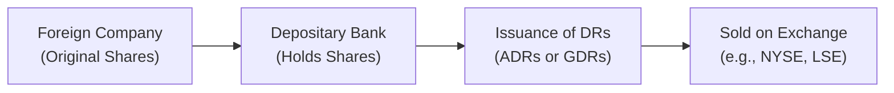

## 14.6 Foreign Investment Vehicles

Have you ever wondered if it’s possible to buy shares of a company located thousands of miles away, maybe in Europe or Asia, without stepping off Canadian soil? Well, guess what—you definitely can. And it’s not just about picking up a phone and calling a random broker in London or Tokyo anymore. There is an entire ecosystem of foreign investment vehicles that let us, as investors, put our money into overseas markets with relative ease, often using the same trading platforms we use for Canadian or U.S. equities.

In this section, we’ll walk through some of the most popular ways to invest in foreign markets, including American Depositary Receipts (ADRs) and Global Depositary Receipts (GDRs), as well as various mutual funds, ETFs, and more direct avenues like Foreign Direct Investment (FDI). Knowing about these vehicles will help you tap into global opportunities while still meeting all the regulatory and logistical requirements here in Canada (or wherever you’re based). Let’s jump right in—and yes, I’ll share some personal stories along the way, because nobody wants to wade through purely technical definitions without a little bit of relatable context.

---
  
### Understanding the Basics of Depositary Receipts

Before we examine American Depositary Receipts (ADRs) and Global Depositary Receipts (GDRs), let’s define the general concept of a Depositary Receipt (DR). A DR is basically a tradable certificate representing shares of a foreign company. These receipts make it way simpler for investors to buy foreign shares without dealing directly with international stock exchanges, foreign currencies, or complicated settlement processes.

In plain English, if you want to invest in a Japanese automotive company but you don’t know how to navigate the Tokyo Stock Exchange, you might purchase DRs of that company on the New York Stock Exchange (NYSE). This effectively gives you ownership (or a beneficial interest in ownership) of that Japanese company’s shares but in a way that’s convenient to you: priced in U.S. or Canadian dollars, with familiar trading and settlement rules.

---
  
### American Depositary Receipts (ADRs)

ADRs were the first major type of Depositary Receipts to gain global popularity. They are listed on U.S. exchanges like the NYSE or Nasdaq, though there are also ADRs trading over-the-counter (OTC). ADRs allow you to buy foreign shares in U.S. dollars, often with English-language documentation, standardized reporting, and other investor-friendly features. Here are some key points:

- **Issued by a U.S. Depositary Bank:** A U.S. financial institution (like JPMorgan Chase or Citibank) purchases the foreign company’s shares and holds them in custody. Then it issues ADRs that represent a specific number of those foreign shares.
- **Denominated in USD:** No foreign exchange hassles for U.S.-based investors, although the underlying assets remain subject to exchange-rate risk.
- **Regulated by the SEC:** ADRs are subject to U.S. securities laws, offering more transparent disclosure (though the level of disclosure can vary depending on the type of ADR program).
  
You might be thinking, “Okay, I’m in Canada—why do I care about ADRs?” Well, guess what: a large number of Canadian brokers allow you to buy and sell ADRs on U.S. exchanges. So even Canadians often use ADRs for their foreign equity exposure. I still remember the first time I bought an ADR for a French luxury goods company—I had no idea at the time that I was effectively holding shares from Paris. I only realized it when I got a dividend notice referencing euro-based distribution amounts. That’s when the currency angle became real for me.

---
  
### Global Depositary Receipts (GDRs)

While ADRs typically focus on the U.S. market, GDRs are more global in scope. They’re often listed on multiple exchanges, such as the London Stock Exchange or Luxembourg Stock Exchange, and can be denominated in U.S. dollars, euros, or other major currencies. GDRs are basically the same concept as ADRs but cast a wider net geographically.

- **Listed in Multiple Markets:** GDRs may allow for broader international distribution, appealing to investors in Europe, Asia, and elsewhere.
- **Flexibility in Currency:** GDRs can be priced in currencies other than the U.S. dollar, which can be advantageous for certain institutional or retail investors who want to avoid sole reliance on USD.

---
  

The diagram above shows the flow of how a foreign company’s shares are transformed into Depositary Receipts (ADRs or GDRs). This mechanism simplifies cross-border investing substantially.

---
  
### Role of ADRs and GDRs in Canadian Portfolios

From a Canadian perspective, you might find it simpler to hold ADRs or GDRs than to set up accounts with foreign brokers. However, it’s always essential to do your homework: fees, liquidity, and regulatory differences can still affect performance. In some cases, you may find that the foreign stock’s liquidity is stronger in its local market, meaning narrower bid-ask spreads and potentially lower transaction costs.

But for many of us, ADRs and GDRs feel like a comfortable middle ground. We get exposure to foreign markets while dealing with institutions and exchanges we already know. Furthermore, CIRO’s rules on foreign investment products (as of 2025) require that Canadian investment professionals ensure the suitability of recommending such DRs. Advisors must always check that these instruments align with a client’s objectives, time horizon, and risk tolerance. (And if this is new to you, see [Section 2](../Chapter%202%20Understanding%20a%20Client%27s%20Risk%20Profile/) for more on discussing risk.)

---

### International or Global Mutual Funds and ETFs

ADRs and GDRs can be a handy solution—don’t get me wrong—but sometimes it’s just simpler to buy a single investment product that bundles multiple foreign stocks or bonds. That’s where international or global mutual funds and ETFs come in. These funds specialize in holding a diversified basket of foreign securities, effectively giving you instant diversification across different countries, sectors, and asset classes.

1. **Professional Management:** With a mutual fund, a portfolio manager (and their team) is actively selecting and weighting securities based on the fund’s objective (e.g., emerging markets growth, global dividend strategy).
2. **Instant Diversification:** Even if you have a relatively modest amount to invest, you can spread your risk across dozens or even hundreds of companies and geographic regions.
3. **Ease of Access:** Most brokerage platforms and financial advisors can offer you a wide selection of international mutual funds and ETFs, often in Canadian dollars.

Of course, mutual funds can come with management fees (MERs), while ETFs typically have lower fees but trade on exchanges in real time. Selecting the right vehicle often boils down to your personal preference for active vs. passive management strategies (see also [Chapter 3: Asset Allocation and Investment Strategies](../Chapter%203%20Asset%20Allocation%20and%20Investment%20Strategies/)).

---
  
### Foreign Direct Investment (FDI)

If you’re a corporate or institutional investor—or a very well-capitalized retail investor—Foreign Direct Investment (FDI) might be on your radar. FDI involves making a long-term investment in business operations in another country, typically by acquiring a controlling interest in a foreign corporation or setting up subsidiaries abroad. 

- **Long-Term Commitment:** Unlike portfolio investments that can be sold in seconds, FDI usually involves real assets, production facilities, or strategic partnerships.  
- **Regulatory Approvals:** Different countries have varying degrees of oversight, sometimes requiring government approval for foreign takeovers—particularly in sensitive sectors like natural resources or telecommunications.
- **High Barriers to Entry:** Not for the faint of heart. FDI demands capital, local market knowledge, legal due diligence, and ongoing operational oversight.

Some Canadian companies consider FDI to tap into new markets, especially for manufacturing or resource extraction. However, individuals generally stick to more liquid investments, like equities and bonds, unless they’re entrepreneurs establishing a global footprint. Many investment managers in Canada handle FDI for corporate clients, ensuring compliance with local regulations and monitoring the myriad political, infrastructural, and economic risks of operating abroad.

---
  
### Canadian Mutual Funds with a Global Mandate

We can’t ignore the classic approach: Canadian mutual funds that concentrate on global investing. These are governed by Canadian securities regulations and sold through prospectuses filed on SEDAR+ (visit [https://www.sedarplus.ca](https://www.sedarplus.ca) for details). Such funds make it easier for investors to remain within the Canadian regulatory umbrella while enjoying the benefits of foreign diversification.

- **Subject to Canadian Disclosure Requirements:** Fund managers must publish up-to-date financial statements, annual reports, and other key documents in English and/or French, which is comforting in terms of transparency.
- **Currency Considerations:** Some global mandates do currency hedging (or partial hedging) to reduce volatility from CAD/USD or CAD/EUR fluctuations. Others allow you to ride the currency waves, hopefully to your benefit.
- **CIRO Oversight:** Canadian advisors recommending such funds must adhere to CIRO’s suitability and KYC (Know Your Client) requirements—historically, this was under the MFDA or IIROC, but remember they’re now merged into CIRO as the single self-regulatory organization in Canada.

From personal experience, I’ve found that a well-managed global mutual fund can simplify your life when you’re short on time to research individual foreign stocks. But the trade-off could be the management fee. Compare multiple funds to see whether the cost is justified by the returns, strategy, and track record.

---

### Global Pension Funds

Large pension funds—like the Canada Pension Plan Investment Board (CPPIB) or Ontario Teachers’ Pension Plan—often allocate a significant portion of their portfolio to international assets. They’re looking for diversification, higher returns, and access to growth markets. 

As an individual investor, you can’t directly invest in, say, CPPIB’s portfolio. However, you can:
- **Refer to Their Allocation Strategies:** Public pension funds often publish annual reports indicating how much they invest in foreign equities, private equity, real estate, infrastructure, and so on. That can offer inspiration for your own global allocation.
- **Join Large Defined-Contribution Plans:** Some corporate or provincial pension plans may allow participants to choose an “International Equity” or “Global Equity” option as part of their plan. This helps you diversify your retirement savings beyond Canada.
  
Pension funds’ rigorous risk management and scale let them explore more complex strategies—like private equity in emerging markets or direct infrastructure deals. While smaller retail investors might not replicate that complexity, we can still glean valuable insights about the long-term benefits of global diversification.

---
  
### Practical Example: Diversified International Portfolio

Let’s build a quick hypothetical scenario. Suppose you have CAD 100,000 to invest and you’d like to devote 30% of it to international markets. How might you do that?

1. **ADRs / GDRs:** Say 10% in ADRs or GDRs of well-known global brands—maybe a Swiss pharmaceutical giant or a Japanese tech leader.  
2. **Mutual Fund / ETF:** Another 15% in a global equity ETF covering both developed and emerging markets.  
3. **Industry-Specific Fund:** And perhaps 5% in a globally diversified infrastructure mutual fund, focusing on toll roads, airports, and utilities across multiple continents.

This approach offers a blend of direct exposure (through ADRs or GDRs) and professional management (through funds). If you’re uncertain about the individual stocks, you could lean more heavily on the funds. Alternatively, if you’re super confident about a specific region or sector, maybe tilt your ADR/GDR selection accordingly.

---

### Common Pitfalls in Foreign Investing

1. **Currency Risk Oversight:** Holding ADRs in USD or GDRs in euros doesn’t eliminate forex risk—your underlying asset is tied to another currency, and as a Canadian investor, that’s a double exposure (e.g., CAD to USD, then USD to JPY for a Japanese ADR).  
2. **Tax Treaties and Withholding Tax:** Different countries impose different tax rates on dividends, interest, or capital gains. Make sure you understand relevant treaties between Canada and the country of issuance.  
3. **Liquidity and Trading Hours:** The liquidity for a foreign security might be lower on the local exchange or might be out of sync with North American trading hours. This can lead to wider bid-ask spreads and less favorable pricing.  
4. **Compliance and Reporting:** CIRO has professional standards requiring advisors to explain the risks of complex foreign investments, especially if they involve derivatives or foreign currency hedging.

---

### Best Practices for Canadian Investors

- **Use Available Resources:** SEDAR+ ([https://www.sedarplus.ca](https://www.sedarplus.ca)) for regulatory filings, CIRO ([https://www.ciro.ca](https://www.ciro.ca)) for compliance guidance.  
- **Stay Informed on Global Economic Indicators:** Follow global market trends, currency movements, and political developments that may affect your investments (see [Chapter 6: Economic and Industry Analysis](../Chapter%206%20Analysis%20of%20Equity%20Securities%20I:%20Economic%20and%20Industry%20Analysis/)).  
- **Diversify:** Don’t over-concentrate in a single region. Even if you love European stocks, consider adding a slice of emerging markets or Asia.  
- **Watch Out for Fees:** Compare the management expense ratios (MERs) of different funds. Sometimes a global ETF offers near-identical exposure at a fraction of the cost of a mutual fund.  
- **Consult a Professional if Unsure:** If you feel overwhelmed, a qualified financial advisor can help tailor your strategy to your goals and risk tolerance. Just make sure they’re registered under CIRO so you’re assured of the proper regulatory oversight.

---

### Further Resources and References

- **CIRO (Canadian Investment Regulatory Organization)**: [https://www.ciro.ca](https://www.ciro.ca)  
  Up-to-date self-regulatory guidance on overseas investing, product suitability, and best practices for Canadian advisors and investors.

- **SEDAR+**: [https://www.sedarplus.ca](https://www.sedarplus.ca)  
  The database of filings for mutual funds, ETFs, and public company disclosures.

- **Open-Source Financial Analysis Tools**:  
  - [QuantLib](https://www.quantlib.org/) – A free/open-source library for financial instruments, pricing, and risk management.  
  - [R Project for Statistical Computing](https://www.r-project.org/) – Often used for analyzing stock price data, currency rates, and building econometric models.

- **Recommended Reading**:  
  - *International Investments* by Bruno Solnik and Dennis McLeavey – A classic textbook for deeper theoretical background.  
  - *Fundamentals of Multinational Finance* by Michael H. Moffett, Arthur I. Stonehill, and David K. Eiteman – Great for FDI insights and cross-border financial management.

---

### Closing Thoughts

International investing can feel overwhelming at first. Believe me, I distinctly recall the first time I tried to figure out how to buy shares of a South Korean tech company—my head nearly exploded with thoughts of currency conversions, fees, and corporate announcements in different time zones. But foreign investment vehicles such as ADRs, GDRs, global mutual funds, and ETFs are specifically designed to make your life easier. The important thing is to understand your own risk tolerance, stay aware of regulatory requirements, and ensure you have the right information about diversification, fees, and liquidity.

If your mission is to broaden your portfolio beyond the Canadian market, there’s plenty of upside potential out there. Just pace yourself, invest in vehicles you understand, and keep learning. After all, as we’ve seen in other chapters of this book (like [Chapter 13: Analyzing Non-Conventional Asset Classes](../Chapter%2013%20Analyzing%20Non-Conventional%20Asset%20Classes%20and%20Their%20Structures/) or [Chapter 16: Managing Your Client’s Investment Risk](../Chapter%2016%20Managing%20Your%20Client%E2%80%99s%20Investment%20Risk/)), knowledge is what keeps you on the right track, especially when venturing into unfamiliar territory across the globe.

---

## Test Your Knowledge: Foreign Investment Vehicles Quiz



### Which of the following best describes the main function of a Depositary Receipt (DR)?

- [x] It allows investors to trade foreign shares in their local market's currency and exchange.
- [ ] It is a local-only instrument with no link to foreign companies.
- [ ] It is only used by governments to raise capital.
- [ ] It is a futures contract on foreign bonds.

> **Explanation:** A Depositary Receipt represents shares in a foreign company and trades in the local currency or on a local exchange (e.g., NYSE). This makes it easier for investors to access foreign equity markets.

---

### ADRs (American Depositary Receipts) are typically:

- [x] Denominated in U.S. dollars and subject to U.S. securities regulations.
- [ ] Only listed on the London Stock Exchange.
- [ ] Devoid of currency risk for Canadian investors.
- [ ] Created exclusively by Canadian banks.

> **Explanation:** ADRs are primarily traded on U.S. exchanges, denominated in U.S. dollars, and regulated by the SEC. Canadian investors buying ADRs may still face currency risk between CAD and USD.

---

### One advantage of investing in global mutual funds or ETFs is:

- [x] Instant diversification across multiple markets.
- [ ] Exemption from all Canadian regulatory requirements.
- [ ] Full hedging of all currency exposures without cost.
- [ ] Guaranteed returns above domestic-only portfolios.

> **Explanation:** Mutual funds or ETFs with an international mandate can provide broad exposure to foreign markets in a single product, helping diversify an investor’s portfolio. However, there’s no guarantee of higher returns, and they do not automatically bypass regulations or provide free currency hedging.

---

### Foreign Direct Investment (FDI) differs from portfolio investments because:

- [x] FDI involves controlling ownership in a foreign business rather than holding tradable securities.
- [ ] Portfolio investments always require large capital outlays.
- [ ] FDI is strictly prohibited in the Canadian market.
- [ ] FDI can only be done through mutual funds.

> **Explanation:** FDI is characterized by direct ownership or control in a foreign enterprise, whereas portfolio investments (like buying stocks and bonds) do not involve direct operational control of the companies.

---

### In Canada, which regulatory body currently oversees compliance and suitability standards for foreign investments?

- [x] CIRO (Canadian Investment Regulatory Organization)
- [ ] IIROC (Investment Industry Regulatory Organization of Canada)
- [ ] MFDA (Mutual Fund Dealers Association of Canada)
- [ ] The Financial Services Commission of Ontario

> **Explanation:** Since the amalgamation, CIRO is the national self-regulatory body overseeing investment dealers and mutual fund dealers in Canada, replacing IIROC and MFDA (both defunct).

---

### A GDR (Global Depositary Receipt) is most commonly:

- [x] Offered in multiple global markets, sometimes denominated in USD or euros.
- [ ] Limited to retail investors only.
- [ ] A unique product that eliminates all currency risk.
- [ ] A derivative contract on domestic bonds.

> **Explanation:** GDRs can be issued in various international markets and different currencies, giving them a global scope compared to ADRs, which focus on the U.S. market.

---

### What is the primary advantage of Canadian Mutual Funds with a global mandate for domestic investors?

- [x] They are subject to Canadian securities regulations while offering foreign exposure.
- [ ] They automatically hedge all currency risk at no charge.
- [ ] They guarantee capital protection.
- [ ] They eliminate the need for asset allocation.

> **Explanation:** These funds allow investors to gain foreign exposure under familiar Canadian regulatory oversight. They do not guarantee capital protection or currency hedging, nor do they replace the need for comprehensive asset allocation planning.

---

### Which of the following is a common pitfall when investing in foreign securities?

- [x] Overlooking currency fluctuations and exchange rate risk.
- [ ] Having to trade only during Canadian market hours.
- [ ] Avoiding any research or analysis.
- [ ] Guaranteed tax exemptions on dividends and capital gains abroad.

> **Explanation:** Currency risk is significant for cross-border investments. Trading hours, taxation, and research requirements can vary, but ignoring currency dynamics is a widespread risk.

---

### A Canadian investor seeking detailed disclosures and filings for mutual funds with foreign holdings should consult:

- [x] SEDAR+.
- [ ] A random message board.
- [ ] A foreign country’s local chamber of commerce.
- [ ] Old archives of IIROC bulletins (no longer updated or valid).

> **Explanation:** SEDAR+ is the official system in Canada for accessing regulatory filings and continuous disclosure documents for issuers, including those that offer global mutual funds.

---

### True or False: Large pension funds in Canada often include international assets in their portfolios to enhance diversification.

- [x] True
- [ ] False

> **Explanation:** Large pension funds such as the Canada Pension Plan Investment Board typically invest internationally to achieve better diversification and asset allocation, aiming for stable, long-term returns.


