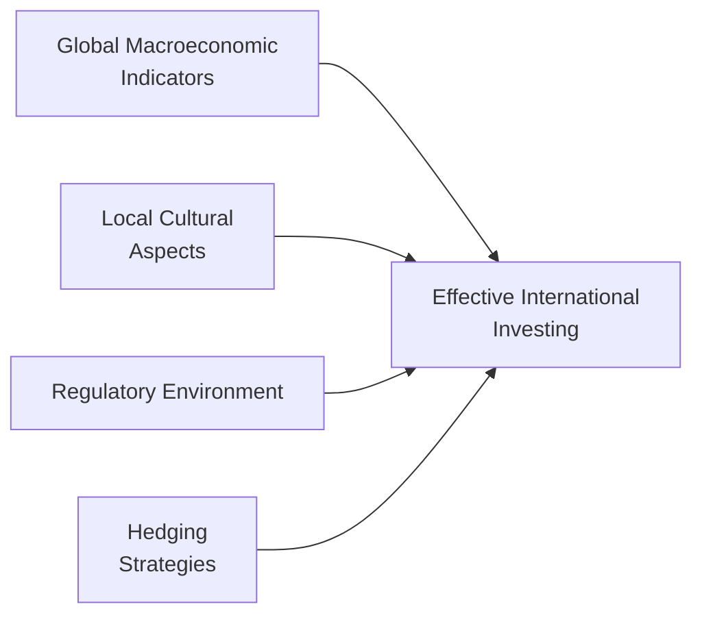

## 14.7 The Skills Necessary for Effective International Investing

Investing abroad might sound like an adventure, right? You get to explore different cultures, economies, and opportunities, all while hopefully making a decent return. But the truth is, effective international investing takes more than just a plane ticket and a handful of currency conversion apps. It calls for specialized research methods, good cultural awareness, regulatory savvy, sharp communication skills, and strategic risk management. In this section, we’ll dig into these areas and share a few personal anecdotes and stories—some of which I learned the hard way.

Before we begin, let’s do a quick overview. International investing involves juggling multiple moving pieces: macroeconomic data, foreign exchange rates, cultural differences, regulatory frameworks, and more. So think of it as a puzzle, where each piece has to be meticulously placed. By the end of this read, you’ll (hopefully) feel more prepared to drop those puzzle pieces exactly where they belong.

### Research & Analysis

When I first started investing beyond Canada and the U.S., I, uh, underestimated the depth of research required. I remember betting on a firm in Eastern Europe because its price-to-earnings (P/E) ratio looked extremely cheap. Turns out, I hadn’t accounted for local inflationary pressures and volatile exchange rates. Oops.

So, what’s the best approach? Consider these fundamentals:

• Macroeconomic Trends: Check out gross domestic product (GDP) growth, inflation rates, unemployment figures, and central bank policies. For instance, a country with rising interest rates might attract foreign capital…but it could also slow down its own economy. Balancing both sides of the coin is crucial.

• Market Valuations: Look at typical metrics like the P/E ratio or the cyclically adjusted price-to-earnings (CAPE) ratio. In some countries, average valuations differ from North American norms due to various factors like family-controlled business structures or unique debt markets.

• Currency Movements: Whew, currency fluctuations can wipe out your gains faster than you can say “exchange rate.” If the local currency depreciates against your home currency, you might lose a chunk of your return even if the underlying asset performs well. Be prepared to incorporate currency analysis in your due diligence.

• Bond Yields and Interest Rates: This ties into the bond market aspects. Higher local yields can sometimes indicate greater country risk. But they also might offer opportunities if the risk is appropriately priced.

#### Quick Example

Let’s say you’re looking at a hypothetical investment in a Brazilian consumer goods company. You might begin by tracking Brazil’s inflation, monetary policy trends, and domestic consumption patterns. Then, you’d factor in something like the real/dollar exchange rate. And of course, you’d want to compare the company’s P/E ratio (and maybe the EV/EBITDA ratio) against those of international peers to see if it’s really undervalued or if the entire sector is cheap for a reason.

#### Data Tools for Research

You don’t have to go it alone. Several powerful open-source and subscription-based tools can help:

• Bloomberg and Reuters: Provide real-time and historical market data, including currency quotes and macro indicators.  
• Yahoo Finance and Trading Economics: Offer free data on international financial statements, interest rates, and economic statistics.  
• Central Bank & Government Agencies: In Canada, the Bank of Canada publishes regular economic reviews. Globally, each country’s central bank often shares interest rate decisions and inflation targets online.

### Understanding Cultural Aspects & Local Practices

Let’s face it: not all markets behave like the North American ones. Local business norms, cultural preferences, and corporate governance practices can be dramatically different elsewhere. For instance, in some Asian economies, building personal relationships (“guanxi” in Chinese) might play a bigger role in business decisions than formal contracts. In parts of Europe, corporate boards might follow long-standing governance traditions that put social responsibility on par with shareholder returns.

If you consider the corporate structure alone, you might see, say, a fully family-owned conglomerate in India that interprets certain joint venture terms differently from a widely-held U.S. corporation. Or, a Japanese keiretsu might have cross-shareholdings that keep external acquisitions at bay.

Why does it matter?

• Corporate Governance: If you’re not familiar with common ownership structures or local regulation of boards, you might be blindsided by certain “surprise” decisions—like preferential treatment of majority owners. Ultimately, this affects a company’s transparency and future profitability.

• Accounting Practices: Some countries adopt International Financial Reporting Standards (IFRS), while others might follow local Generally Accepted Accounting Principles (GAAP). (We explore IFRS vs. GAAP in more detail in Chapter 7.) Understanding these nuances can reveal how companies recognize revenue, expense, and risk on their balance sheets.

• Cross-Reference to Another Chapter: In Chapter 2 on “Understanding a Client’s Risk Profile,” we discussed behavioural biases. This cultural aspect ties in nicely with how local investors might react differently to news or company announcements, creating unique market inefficiencies or opportunities.

Sometimes, the best insight comes from local professionals or analysts who thoroughly understand the intangible cultural aspects. Don’t be afraid to hire a local consultant or partner to get that on-the-ground perspective. I once collaborated with a local research firm in South Korea when analyzing their growing biotech sector—and it was a game-changer. They told me about new government incentives I had no idea existed, and that alone probably saved me from ignoring crucial opportunities.  

### Regulatory Familiarity

You probably don’t want to find out after you invest that your chosen country has foreign ownership restrictions or currency controls that limit your access to profits. This can be a painful lesson. In some cases, repatriating money from certain emerging markets might involve elaborate bureaucratic steps. In others, there might be withholding taxes that significantly reduce dividend income or capital gains.

• Cross-Border Tax Treaties: Countries sometimes have treaties that reduce double taxation for foreigners. If you’re Canadian, be sure to track the agreements Canada has for that specific country. The Canadian Securities Administrators (CSA) and the Canada Revenue Agency (CRA) websites can shed light on those.

• Capital Controls: Some nations monitor and regulate the inflows and outflows of foreign capital to maintain economic stability. Familiarize yourself with these to avoid nasty surprises.

• Compliance and Reporting: Countries vary in how they require disclosures from foreign investors. In Canada, the new national self-regulatory organization, the Canadian Investment Regulatory Organization (CIRO), provides updated guidelines on how foreign securities must be reported in client portfolios (relevant for advisors). This replaced the old system of IIROC and the MFDA (now both defunct). 

• Ongoing Education: CIRO-approved continuing education courses often include modules on globalization, foreign markets, and financial products. There’s a reason all the pros keep racking up continuing education credits over their careers: it ensures no one stays outdated in a fast-changing regulatory environment.

### Language & Communication Skills

When you invest internationally, you might find yourself sifting through annual reports in a language you don’t speak or misunderstood. You might also attend conferences or management calls where details get “lost in translation.” If you’re not fluent in the target language, you need a reliable method to interpret data accurately—whether that’s hiring a local due diligence team, using professional translation services, or using bilingual financial analysts.

• Accurate Translations: It’s not just about fluid conversation; you want precise translations for legal documents, financial statements, and communications. Sometimes, even a single word can drastically alter your interpretation of risk in a contract.

• Leveraging Technology: Sure, Google Translate might help you glean the gist of an article, but for deeper analysis, you’ll probably want something more robust—or a human translator.

• Subtleties and Nuances: Language is more than words. Subtle cultural references or idioms in an earnings call can be extremely telling about a company’s progress and struggles.

### Risk Management & Hedging Strategies

Risk is part of the game, but it can be hedged. In earlier chapters (particularly Chapter 16 on “Managing Your Client’s Investment Risk”), we delve into risk management. Yet, for international ventures, there are a few unique angles:

• Currency Hedging: You can look into derivatives like currency forwards and options. If, for instance, you’re concerned about fluctuations in the euro, you might purchase an option to lock in an exchange rate range.

• Diversification: While global investments add diversification benefits to your portfolio (non-perfectly correlated assets can reduce overall risk), each foreign market carries its own set of risks. Evaluate overall portfolio concentration and use sensible diversification strategies.

• Political Risk Insurance: Some specialized insurance products protect your capital against expropriation, civil unrest, or government-induced defaults. This might reasonably be considered if you’re investing in a region with known political instability or frequent policy changes.

#### Hedging Diagram

Below is a simple mermaid flowchart showing how macroeconomic analysis, hedging, and final investment decisions all feed into effective international investing:

### Networking & Collaboration

I once had a friend jokingly say: “Investing is basically one big group project—on a global scale.” He wasn’t entirely wrong! Cultivating relationships with international accountants, attorneys, local research analysts, and even local press can substantially improve your insight. If an economic event is brewing in a region, people embedded locally can sense its impact well before the hype hits foreign news outlets.

Moreover, we can’t forget that local business leaders, government agencies, and other market players might speak with more candor to someone they already know or trust. Building that trust—by visiting the region, attending local conferences, or simply showing interest in how they do business—can bring immeasurable benefits.

### Common Pitfalls & Best Practices

• Overconfidence in Familiar Markets: Sometimes, folks assume investing in markets that are somewhat similar to Canada or the U.S. (like the U.K.) requires minimal extra work. Not quite! Even minor differences in tax laws, currency fluctuations, or local business etiquettes can have a sizable impact.

• Failing to Account for Transaction Costs: Fees for currency conversion, wire transfers, foreign brokerage commissions, and custody can eat into returns. Factor them in early.

• Mistiming the Market: Economic cycles differ across the globe. By the time you hear about a “hot” emerging market in mainstream media, the best opportunities might already be priced in.

• Not Revisiting Economic and Political News: Countries can swiftly change regulations, leadership, or strategic economic directions (think of Brexit in the U.K.). Keep monitoring developments to make sure your original investment thesis still stands.

### Practical Financial Examples

• Example 1: Currency-Swaps for a Japanese Investment  
  Let’s say you want to invest in a Japanese electronics company. Rather than holding yen and dealing with day-to-day volatility, you might enter a currency-swap agreement that pegs your currency exposure to a more stable basket of currencies. This can reduce your risk but might also impose a hedging cost.

• Example 2: Hedging Commodity Risk  
  If you’re investing in a South American mining project, you can use commodity futures (copper, lithium, etc.) to hedge the volatility in metal prices. While not a perfect hedge, it can limit your downside if global prices swing widely.

• Example 3: Collaboration with Local Analysts  
  Suppose you want to invest in Malaysian palm oil companies. You secure a local research group that provides weekly updates on export quotas, government policies, and environmental regulations. This local intelligence helps you position your trades more strategically and mitigate regulatory or reputational risks.

### Personal Reflection

One time I got so carried away by the potential of an export-oriented agriculture firm in Southeast Asia that I forgot to check how local politics could influence land use laws. Let’s just say the local government was discussing farmland restrictions on foreign-controlled corporations. Equity prices tumbled as soon as the draft law was publicized. The moral? Even the best fundamental analysis can get knocked sideways if you’re not paying attention to local governance signals.

### Tying It All Together

Investing internationally can be both exhilarating and daunting. The bottom line: knowledge is power. From macro-level research and risk management to the finer details of language, culture, and local regulations, there’s a lot to chew on. But if you do your homework, cultivate networks, and keep your ear to the ground, you’ll significantly improve your odds of a successful global investing journey.

Remember, no matter how skilled you are, you can’t foresee every twist and turn. But thorough research, combined with good cultural insights and a well-structured risk management plan, can help you adapt quickly to changing conditions—because if there’s one thing that’s constant in global markets, it’s change.

### Glossary

• **Hedging**: Strategies employed to offset or reduce the probability of loss from fluctuations in asset prices, exchange rates, or interest rates.  
• **Derivatives**: Financial contracts (such as futures or options) whose value is derived from an underlying asset or benchmark.  
• **Corporate Governance**: The system of rules, practices, and processes by which a firm is directed and controlled.  
• **Due Diligence**: Comprehensive appraisal of a business or investment, undertaken to establish its assets, liabilities, and potential risks.

### References & Further Resources

• CIRO (Canadian Investment Regulatory Organization): [https://www.ciro.ca](https://www.ciro.ca)  
• Canadian Securities Administrators (CSA): Visit CSA’s website for updates on market regulations, cross-border compliance, and investor alerts.  
• Bank of Canada: Look for economic projections, inflation targets, and policy decisions.  
• Bloomberg and Reuters: For up-to-date market data, corporate earnings, and in-depth analyses.  
• Trading Economics: Offers global macroeconomic data, forecasts, and market indicators.  
• CIRO-Approved Continuing Education Courses: Seek modules focusing on the ins and outs of globalization and global asset classes.  

And with that, we wrap up our exploration of the essential skills for successful international investing. While you’re at it, you might want to keep an eye on your passport—your next investment trip might be just around the corner.

---

## Test Your Knowledge: Mastering International Investing Skills



### Which factor should investors consider first when analyzing international market opportunities?

- [ ] Local consumer behavior alone
- [x] Macroeconomic trends (e.g., GDP growth, inflation, and interest rates)
- [ ] The brand name of local financial institutions
- [ ] Day-to-day currency user experience

> **Explanation:** Macroeconomic indicators serve as the foundation for understanding broad market conditions, helping investors identify potential benefits or risks before delving into specifics like consumer behavior.

### What is one primary risk introduced by foreign currency exposure?

- [ ] Potential improvements in corporate governance
- [ ] Lower valuations in emerging markets
- [x] Exchange rate fluctuations that can erode returns
- [ ] Reduced paperwork

> **Explanation:** Exchange rate volatility can easily turn a profit into a loss or vice versa. Monitoring currency exposure is essential in international investing.

### Which of the following best describes “corporate governance”?

- [ ] A short-term policy for currency management
- [x] The system of rules and processes through which a company is controlled
- [ ] An informal set of employee guidelines
- [ ] A method for calculating interest rates

> **Explanation:** Corporate governance involves the rules, processes, and structures that guide how a company is managed and runs its operations, ensuring accountability and fairness.

### According to the text, what is one advantage of partnering with local analysts or research firms?

- [ ] Gaining exclusive stock tips unavailable elsewhere
- [x] Acquiring nuanced information about cultural and regulatory contexts
- [ ] Importing foreign currency more cheaply
- [ ] Eliminating tax liabilities in a foreign market

> **Explanation:** Local analysts or research firms provide deeply rooted knowledge and help navigate customs, regulations, and market nuances that might not be readily apparent to outsiders.

### Which of the following options is a common strategy to manage currency risk?

- [x] Purchasing derivative contracts like currency forwards
- [ ] Ignoring market fluctuations
- [x] Engaging in a currency swap agreement
- [ ] Relying solely on central bank press statements

> **Explanation:** Derivative contracts (forwards, swaps) can lock in or offset currency exposures, helping investors mitigate unexpected exchange rate movements.

### What is one potential outcome of not revisiting political and economic developments in the foreign market?

- [x] Sudden changes in regulations may invalidate the original investment thesis
- [ ] Tax advantages remain constant
- [ ] Currency values remain unchanged
- [ ] Market valuations become disconnected from economic realities indefinitely

> **Explanation:** Policies, leadership, and regulatory environments evolve. Failing to monitor these changes could undermine an investment strategy.

### When researching a foreign company operating in a language you are unfamiliar with, what is a recommended approach?

- [x] Use professional translators or bilingual analysts
- [ ] Infer meaning through guesswork
- [x] Employ robust translation tools for earnings calls and documents
- [ ] Rely solely on the company’s English press releases

> **Explanation:** Precision is critical when interpreting financial and legal documents. Combining technology and human translators or bilingual analysts can clarify details that might otherwise be misunderstood.

### Why should international investors mind local accounting practices?

- [ ] They are always identical to Canadian IFRS and GAAP
- [ ] No impact on financial statement accuracy
- [x] Different accounting standards can alter how revenue and expenses are recorded
- [ ] They never reflect genuine corporate performance

> **Explanation:** Accounting standards vary globally, affecting how a company’s financials are presented. This has a direct impact on your understanding of a firm’s profitability and risk profile.

### Which organization, established on January 1, 2023, replaced the MFDA and IIROC?

- [ ] Canadian Investment Protection Fund (CIPF)
- [ ] Canadian Securities Administrators (CSA)
- [x] Canadian Investment Regulatory Organization (CIRO)
- [ ] Canada Revenue Agency (CRA)

> **Explanation:** The Mutual Fund Dealers Association (MFDA) and the Investment Industry Regulatory Organization of Canada (IIROC) amalgamated into CIRO, the new self-regulatory organization.

### True or False? Currency hedging might protect against exchange rate risk but often adds to overall costs.

- [x] True
- [ ] False

> **Explanation:** While currency hedging can be an effective method to safeguard returns from exchange rate volatility, it generally requires additional costs or fees that reduce net returns.


